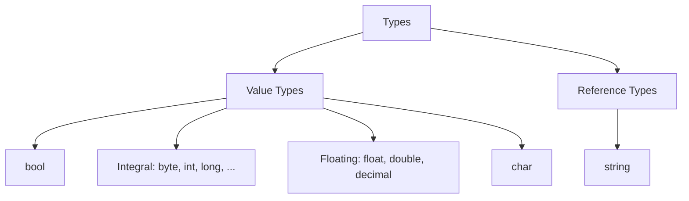
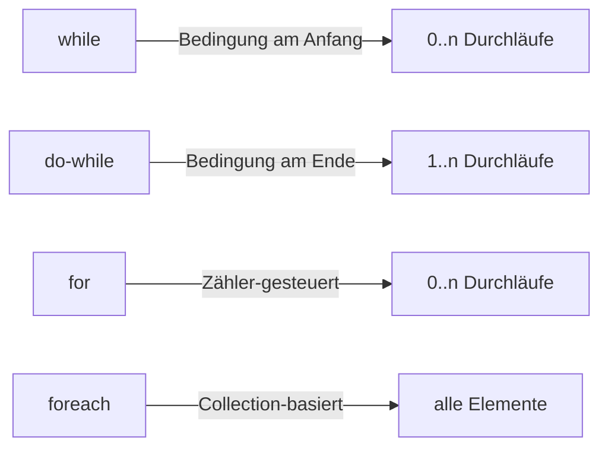

# U01: Basic Elements of Structured Programming with C\#

**Repo:** `csharp/repos/Units/U01/`
**Tasks:** [[csharp/repos/Units/U01/Tasks.md|Tasks.md]]

---


## Inhaltsverzeichnis

- [[#S01: Hello World|S01: Hello World]]
- [[#S02: Hello World Explained|S02: Hello World Explained]]
- [[#S03: Statements, Identifiers & Naming Conventions|S03: Statements, Identifiers & Naming Conventions]]
- [[#S04: Built-in Types|S04: Built-in Types]]
- [[#S05: Boolean Values|S05: Boolean Values]]
- [[#S06: Integral Numeric Types|S06: Integral Numeric Types]]
- [[#S07: Floating-Point Numeric Types|S07: Floating-Point Numeric Types]]
- [[#S08: Strings|S08: Strings]]
- [[#S09: Arrays|S09: Arrays]]
- [[#S10: Collections|S10: Collections]]
- [[#S11: Enumeration Types|S11: Enumeration Types]]
- [[#S12: Selection Statements|S12: Selection Statements]]
- [[#S13: Iteration Statements|S13: Iteration Statements]]
- [[#S14: Formatting|S14: Formatting]]
- [[#S15: Files (System.IO)|S15: Files (System.IO)]]
- [[#Tasks (Übungsaufgaben)|Tasks (Übungsaufgaben)]]
- [[#Proposed Solutions (Auszüge)|Proposed Solutions (Auszüge)]]

---

## S01: Hello World

Das klassische erste Programm. Seit C# 9.0 gibt es **Top-Level Statements** — `Main` und `Program` werden vom Compiler inferiert:

```csharp
using System;

Console.WriteLine("Hello World! Revised!");    // Top-level statement
```

Der **klassische Stil** (vor C# 9.0):

```csharp
namespace U01.S01.HelloWorld;

static class Program
{
    static void Main()
    {
        Console.WriteLine("Hello World!");
    }
}
```

---

## S02: Hello World Explained

### Namespaces

- Organisieren Typen (Klassen, Structs, Interfaces, etc.)
- Hierarchisch mit `.` getrennt, z.B. `System.Collections.Generic`
- Zwei Deklarationsformen:
  - `namespace X { ... }` — für verschachtelte/mehrere Namespaces pro Datei
  - `namespace X;` — gilt für alle Typen in der Datei

### Using-Direktive

Bringt einen Namespace in den Scope:

```csharp
using System;
// Erlaubt: Console.WriteLine() statt System.Console.WriteLine()
```

### Kommentare

- `//` — Einzeiliger Kommentar
- `/* ... */` — Blockkommentar

### Programmstruktur erklärt

```csharp
using System;

namespace U01.S02.HelloWorldExplained;

static class Program                           // Default: internal
{
    static void Main()                         // Default: private
    {
        Console.WriteLine("Hello World!");     // System.Console.WriteLine
    }
}
```

- `Main` ist der Einstiegspunkt der Konsolenanwendung
- `static class` kann nicht instanziiert werden, enthält nur statische Member

### Neue Projekte anpassen

In neuen .NET-Projekten diese Zeilen aus der `.csproj` entfernen:

```xml
<ImplicitUsings>enable</ImplicitUsings>
<Nullable>enable</Nullable>
```

---

## S03: Statements, Identifiers & Naming Conventions

### Statements

- Imperative Programmierung: Anweisungen ändern den Programmzustand Schritt für Schritt
- Jede Anweisung endet mit `;`
- Anweisungsblöcke in `{ }`, verschachtelbar

**Arten von Statements:**

| Typ | Beispiele |
|---|---|
| Deklaration | `int n = 23;` |
| Ausdruck | `n + m` |
| Selektion | `if`, `if-else`, `switch` |
| Iteration | `while`, `do-while`, `for`, `foreach` |
| Sprung | `break`, `continue`, `return`, `goto` |
| Ausnahmen | `throw`, `try-catch`, `try-finally` |

### Identifiers

- Kein Whitespace, muss mit Buchstabe oder `_` beginnen, case-sensitive, keine Keywords

### Naming Conventions

- **camelCase:** Argumente, lokale Variablen, private Felder → `myVariable`
- **PascalCase:** Typen, Namespaces, public Member, Konstanten → `MyClass`, `MyMethod`
- Interfaces beginnen mit `I`

### Konsolen-I/O

```csharp
int n = 23;
Console.Write("Hello ");                     // ohne Zeilenumbruch
Console.WriteLine("World!");                 // mit Zeilenumbruch
Console.WriteLine("n = " + n);              // Konkatenation
Console.WriteLine($"n = {n}");              // String-Interpolation ($)

var m = 42;                                  // var: Typ wird inferiert (hier: int)

Console.Write("Enter text: ");
string s = Console.ReadLine();               // Eingabe lesen
```

---

## S04: Built-in Types

### Typkategorien



- **Value Types:** Variable enthält die Daten direkt, jede Variable hat eigene Kopie
- **Reference Types:** Variable enthält Referenz auf die Daten

### Byte-Typen (8 Bit)

```csharp
byte ub0 = 128;
byte ub1 = 0xFF;                             // Hexadezimal
byte ub2 = 0b_0010_1110;                     // Binär mit Digit-Separator '_'
sbyte sb = -0x13;                            // signed byte
```

### Ganzzahlen

```csharp
int n0 = -42;                                // 32 bit, signed
uint n1 = 42;                                // 32 bit, unsigned
long l0 = -43;                               // 64 bit, signed
ulong l1 = 0x12;                             // 64 bit, unsigned
```

### Fließkommazahlen

```csharp
float f = 1.2f;                              // 32 bit, Suffix f
double d = 2.3;                              // 64 bit, kein Suffix nötig
decimal z = 3.4m;                            // 128 bit, Suffix m, ~10x langsamer
                                             // für Währungen geeignet
```

### Char, String, Bool

```csharp
char c = 'X';                               // Unicode UTF-16
string s = "Hallo";                          // Reference Type, aber immutable
bool b = false;                              // true | false
```

### var und Typ-Suffixe

```csharp
var nx = -42;         // int
var unx = 42u;        // uint
var lx = -43L;        // long (L statt l wegen Verwechslungsgefahr mit 1)
var ulx = 43ul;       // ulong
var fx = 1.2f;        // float
var dx = 2.3;         // double
var zx = 3.4m;        // decimal
```

> [!info]
> `var` ist weiterhin **statisch typisiert** — der Compiler leitet den Typ zur Compile-Zeit ab.

### Konstanten

```csharp
const double speedOfLight = 2.99792458E08;   // Wissenschaftliche Notation
const double doublePi = 2 * Math.PI;         // Ausdruck erlaubt
// speedOfLight = 3.14;                      // Fehler: Neuzuweisung nicht möglich
```

### Default-Werte

```csharp
var bd = default(double);                    // 0
bool bb = default;                           // false
```

---

## S05: Boolean Values

- Werte: `true` oder `false`, Default: `false`, belegt 1 Byte

### Logische Operatoren

```csharp
var a = true;
var b = false;

!a          // NOT  → false
a & b       // AND  → false (wertet immer beide aus)
a | b       // OR   → true  (wertet immer beide aus)
a ^ b       // XOR  → true

a && b      // Conditional AND  (Short-Circuit: rechts nur wenn nötig)
a || b      // Conditional OR   (Short-Circuit)
```

### Ternärer Operator

```csharp
var n = -17;
var sign = (n >= 0) ? 1 : -1;   // condition ? consequent : alternative
```

### Statische Methoden mit Bool

```csharp
static bool UseUmbrella(bool rainy, bool sunny, bool windy)
{
    return !windy && (rainy || sunny);
}
```

---

## S06: Integral Numeric Types

### Arithmetische Operatoren

```csharp
int n = 5, m = 3;
-n          // Negation: -5
n + m       // Addition: 8
n - m       // Subtraktion: 2
n * m       // Multiplikation: 15
n % m       // Rest (Modulo): 2
-n % m      // Rest mit Vorzeichen: -2
```

> [!warning] Achtung
> `^` ist **XOR**, nicht Potenz!

### Compound & Multiple Assignment

```csharp
n += 4;             // n = n + 4
n *= m;             // n = n * m
n = m = 256;        // Multiple Assignment
```

### Vergleichsoperatoren

```csharp
x == y      // Gleichheit
x != z      // Ungleichheit
x < z       // Kleiner
x <= z      // Kleiner-gleich
x > y       // Größer
x >= y      // Größer-gleich
// → Ergebnis ist immer bool
```

### Typkonvertierung

```csharp
// Implizit (verlustfrei)
long l = i;                     // int → long
double d1 = i;                  // int → double

// Explizit (Cast)
var d2 = (double)i;             // int → double
var pi = (int)Math.PI;          // double → int (abgeschnitten)

// Parsing
var j = int.Parse("42");
var k = int.Parse("42", CultureInfo.CurrentCulture);
```

### Integer-Division

```csharp
var a = 5;
var b = 2;
a / b               // → 2 (int!)
(float)a / b         // → 2.5 (float)
```

### Inkrement/Dekrement

```csharp
var u = 3;
u++     // Postfix: erst Wert verwenden, dann erhöhen
++u     // Prefix: erst erhöhen, dann Wert verwenden
u--     // Postfix-Dekrement
--u     // Prefix-Dekrement
```

---

## S07: Floating-Point Numeric Types

### Konstanten

```csharp
double.MinValue          // kleinster Wert
double.MaxValue          // größter Wert
double.Epsilon           // kleinstes positives ε wo 1+ε > 1
double.PositiveInfinity
double.NegativeInfinity
double.NaN               // Not a Number
```

### Math-Klasse

```csharp
Math.Abs(d1 - 2.5)      // Betrag
Math.PI                  // π
Math.Sin(d3)             // Sinus (Achtung: Fließkomma-Ungenauigkeit!)
Math.Sqrt(d4)            // Quadratwurzel
Math.Floor(d6 * 10.0)   // Gaußklammer (abrunden)
Math.Pow(2.5, 4)         // Potenz
```

---

## S08: Strings

- Typ: `System.String`, intern UTF-16 `char`-Sequenz
- **Immutable** — alle Operationen erzeugen ein neues String-Objekt
- `Length` = Anzahl `char` (UTF-16 Code Units), nicht Unicode-Zeichen

### Wichtige Methoden

```csharp
const string s = "Hello 12345 End";

s.Length                         // 15
s.Contains("End")                // true
s.IndexOf('0')                   // -1 (nicht gefunden)
s.IndexOf("123")                 // 6

// Substring / Range
s.Substring(6, 5)               // "12345"
s[6..11]                         // "12345" (Range seit C# 8)
s[6..]                           // "12345 End"
s[^3..]                          // "End" (^pos = von hinten)

s.Replace("l", "L")             // "HeLLo 12345 End"
s.ToLower()                      // alles klein
s.ToUpper()                      // alles groß
s.Insert(5, "!")                 // "Hello! 12345 End"
s.Remove(7, 3)                  // "Hello 15 End"
"  Hi  ".Trim()                 // "Hi"
```

### Escape & Raw Strings

```csharp
var escaped = "\\123\\456\t789";   // Escape-Sequenzen: \n, \t, \\
var raw = @"\123\456\t789";        // Raw: @ unterdrückt Escaping
```

### Split & Join

```csharp
var split = s.Split(' ');
string.Join(", ", split)         // zurück zusammenfügen
```

### Unicode

```csharp
Console.OutputEncoding = Encoding.UTF8;
const char omega = '\u03A9';     // Ω
```

---

## S09: Arrays

- Feste Größe, gleicher Typ, nullbasiert, **Reference Type**
- Dimension/Größe bei Erstellung festgelegt, nicht änderbar

### Deklaration & Initialisierung

```csharp
var prime = new int[5];                       // Default: alle 0
prime[0] = 2; prime[1] = 3; /* ... */

var prime2 = new[] { 2, 3, 5, 7, 11 };       // Array Initializer
int[] prime3 = [2, 3, 5, 7, 11];             // Collection Expression (C# 12)
```

### Mehrdimensionale Arrays

```csharp
var array2d = new[,] {
    { 1, 2 },
    { 3, 4 },
    { 5, 6 },
    { 7, 8 }
};
array2d.Rank              // 2
array2d.GetLength(0)      // 4 (Zeilen)
array2d.GetLength(1)      // 2 (Spalten)
array2d[1, 0]             // 3

var array3d = new[,,] {
    { { 1, 2, 3 }, { 4, 5, 6 } },
    { { 7, 8, 9 }, { 10, 11, 12 } }
};
```

---

## S10: Collections

- Dynamisch wachsend/schrumpfend (im Gegensatz zu Arrays)
- Generisch typisiert mit `<T>`

### List\<T\>

```csharp
var l1 = new List<int>();
l1.Add(1); l1.Add(2); l1.Add(3);
l1.Count                                     // 3

var l2 = new List<int> { 2, 3, 5 };          // Initializer
List<string> l3 = ["Red", "Green", "Blue"];   // C# 12

l2.Add(7);
l2.Remove(3);
l2.Contains(7)                                // true
```

### Dictionary\<TKey, TValue\>

```csharp
var d1 = new Dictionary<string, int> { { "a", 65 }, { "b", 66 } };

d1.Add("c", 67);            // Neuen Eintrag hinzufügen
d1["d"] = 68;               // Alternative zum Hinzufügen
d1["b"] = -1;               // Wert ändern
d1.Remove("a");

d1.ContainsKey("d")          // true

if (d1.TryGetValue("d", out var value))
    Console.WriteLine(value);  // effizienter als ContainsKey + Indexer

foreach (var pair in d1)
    Console.WriteLine($"{pair.Key} = {pair.Value}");
```

### Weitere Collections

`HashSet<T>`, `LinkedList<T>`, `Queue<T>`, `Stack<T>`, `SortedDictionary<TKey,TValue>`, `PriorityQueue<T>`

---

## S11: Enumeration Types

- Value Type, definiert durch benannte Konstanten eines Integer-Typs (Default: `int`)
- Startet bei 0, erhöht sich um 1; Werte können explizit gesetzt werden

```csharp
enum Cards { Seven = 7, Eight, Nine, Ten, Jack = 20, Queen, King, Ace = 100 }

const Cards queen = Cards.Queen;
(int)queen                       // 21

// Iteration
foreach (var c in Enum.GetValues<Cards>())
    Console.WriteLine($"{c} = {(int)c}");

// Cast
const Cards x = (Cards)9;       // Nine

// Parsing
Enum.TryParse<Cards>("Queen", out var card);
```

### Flags-Attribut (Bitmasken)

```csharp
[Flags]
enum UnixFilePermissions
{
    None = 0,
    UserRead = 1 << 8,
    UserWrite = 1 << 7,
    UserExecute = 1 << 6,
    GroupRead = 1 << 5
}

var perms = UnixFilePermissions.UserRead | UnixFilePermissions.UserWrite;
perms.HasFlag(UnixFilePermissions.UserRead)   // true
```

### Enums im Switch

```csharp
switch (card)
{
    case Cards.Seven: case Cards.Eight: case Cards.Nine: case Cards.Ten:
        Console.WriteLine("Zahlenkarte"); break;
    case Cards.Jack: case Cards.Queen: case Cards.King:
        Console.WriteLine("Bildkarte"); break;
    case Cards.Ace:
        Console.WriteLine("Ass"); break;
    default:
        Console.WriteLine("Unbekannt"); break;
}
```

---

## S12: Selection Statements

### if / if-else

```csharp
if (n > 10)
{
    Console.WriteLine("greater");
}
else
{
    Console.WriteLine("less or equal");
}
```

> [!info]
> Immer geschweifte Klammern verwenden — ohne ist fehleranfällig.

### else-if-Ketten

```csharp
if (char.IsUpper(letter))
    Console.WriteLine("uppercase");
else if (char.IsLower(letter))
    Console.WriteLine("lowercase");
else if (char.IsDigit(letter))
    Console.WriteLine("digit");
else
    Console.WriteLine("other");
```

### switch Statement

```csharp
switch (x)
{
    case 1:
        Console.WriteLine("one"); break;
    case 2:
        Console.WriteLine("two"); break;
    case 3:
    case 4:                                   // Mehrere Cases zusammen
        Console.WriteLine("three or four"); break;
    default:
        Console.WriteLine("other"); break;
}
```

Funktioniert auch mit `string` und `double`.

### Pattern Matching im Switch

```csharp
switch (d)
{
    case < 0:
    case > 100:
        Console.WriteLine("out of range"); break;
    case double.NaN:
        Console.WriteLine("NaN"); break;
    default:
        Console.WriteLine(d); break;
}
```

### Switch Expression (kompakte Form)

```csharp
var quadrant = degree switch
{
    >= 0 and < 90 => "first",
    >= 90 and < 180 => "second",
    >= 180 and < 270 => "third",
    >= 270 and < 360 => "forth",
    _ => "unknown"
};
```

---

## S13: Iteration Statements

### while

```csharp
int i = 1;
while (i < 10)
{
    Console.Write($" {i}");
    i++;
}
```

### do-while

```csharp
int i = 1;
do
{
    Console.Write($" {i}");
    i++;
} while (i < 10);
```

> [!info] Unterschied
> `do-while` wird **mindestens einmal** ausgeführt.

### for

```csharp
for (var j = 1; j < 10; j++)
    Console.Write($" {j}");
```

### continue & break

```csharp
for (var j = -10; j < 100; j++)
{
    if (j < 1) continue;         // nächste Iteration
    if (j >= 10) break;          // Schleife beenden
    Console.Write($" {j}");
}
```

### Reversed for

```csharp
for (var k = 9; k > 0; k--)
    Console.Write($" {k}");
```

### foreach

Iteriert über alle Elemente einer Collection (benötigt `IEnumerable`):

```csharp
int[] prime = [2, 3, 5, 7, 11, 13];
foreach (var n in prime)
    Console.Write($" {n}^2 = {n * n}");
```



---

## S14: Formatting

### Textausrichtung

```csharp
var s = "Text";
$"|{s,12}|"          // rechtsbündig, 12 Zeichen breit
$"|{s,-12}|"         // linksbündig, 12 Zeichen breit
```

### Zahlenformate

```csharp
var n = 10911;
$"{n:b}"             // Binär: 10101010011111
$"{n:x4}"            // Hex: 2a9f

var d = 1234.5678;
$"{d:f3}"            // Fixed-Point, 3 Dezimalstellen: 1234.568
$"{d:n}"             // Zahl mit Gruppentrenner: 1,234.57
$"{d:e2}"            // Wissenschaftlich: 1.23e+003
$"{d:c}"             // Währung (Culture-abhängig)
$"{d:#.####}"        // Benutzerdefiniert: 1234.5678

var p = 0.95;
$"{p:p1}"            // Prozent: 95.0%
```

### Positional Format Strings

```csharp
Console.WriteLine("'{0:d}', '{1,4:d}'", n, m);
string.Format(CultureInfo.CurrentCulture, "'{0:d}'", n);
```

### Datumsformate

```csharp
var date = DateTime.Now;
$"{date:d}"          // Short Date: 13.04.2026
$"{date:D}"          // Long Date
$"{date:f}"          // Full Date/Time
$"{date:t}"          // Short Time
$"{date:T}"          // Long Time
$"{date:s}"          // Sortable: 2026-04-13T...
$"{date:u}"          // Universal Sortable

// Culture-spezifisch
date.ToString("f", new CultureInfo("en-US"))
date.ToString("f", new CultureInfo("fr-FR"))
```

---

## S15: Files (System.IO)

### Datei komplett lesen/schreiben

```csharp
var lines = File.ReadAllLines("bundesliga-0.txt");  // nur für kleine Dateien!

foreach (var line in lines)
    Console.WriteLine(line[..26]);                  // Range: erste 26 Zeichen

File.WriteAllLines("bundesliga-1.txt", lines);
```

### StreamReader (zeilenweise)

```csharp
var reader = new StreamReader("bundesliga-1.txt");

var readLine = reader.ReadLine();       // null bei EOF
while (readLine != null && pos < 5)
{
    headlines[pos] = readLine;
    pos++;
    readLine = reader.ReadLine();
}
reader.Close();                          // Handles freigeben
```

### StreamWriter mit using

```csharp
using (var writer = new StreamWriter("bundesliga-2.txt"))
{
    foreach (var headline in headlines)
        writer.WriteLine("club: " + headline);
}
// writer.Close() nicht nötig — using erledigt das
```

---

## Tasks (Übungsaufgaben)

| Task | Thema | Beschreibung |
|---|---|---|
| **Aspal** | Setup | Repo klonen, Solution öffnen, erstes Projekt starten |
| **Agria** | IDE | Debug/Release, Haltepunkte, `#region`, Fenster-Layout |
| **Aspein** | Neues Projekt | Konsolenanwendung in neuer Solution anlegen |
| **Ablium** | IDE-Features | Fehleranzeige, IntelliSense, Refactoring |
| **Agroisil** | Arrays & Listen | 10 Zufallszahlen, for/foreach, `string.Join`, gerade Zahlen filtern |
| **Awhya** | Schleifen & Präzision | Mercator-Reihe (ln(2)), double vs decimal, verschiedene Summationsrichtungen |
| **Astren** | Kontrollstrukturen | b^n berechnen, `Power`-Methode implementieren |
| **Ablaria** | Primzahlen | Alle Primzahlen bis n berechnen |
| **Athua** | Fibonacci | Nicht-rekursiv mit for, do-while, while |

---

## Proposed Solutions (Auszüge)

### Agroisil — Arrays & Listen

```csharp
var rnd = new Random();
var array = new int[10];
for (var i = 0; i < 10; i++)
    array[i] = rnd.Next(1, 101);       // exklusive obere Grenze!

var list = new List<int>();
for (var i = 0; i < 10; i++)
    list.Add(rnd.Next(1, 101));

Console.WriteLine($"list: [ {string.Join(' ', list)} ]");

// Gerade Zahlen filtern (manuell)
var count = array.Count(x => x % 2 == 0);  // oder manuell zählen
var even = new int[count];
var j = 0;
foreach (var x in array)
    if (x % 2 == 0) even[j++] = x;

// Oder per LINQ:
var even2 = array.Where(n => n % 2 == 0);
```

### Awhya — Mercator-Reihe

```csharp
// ln(2) = 1 - 1/2 + 1/3 - 1/4 + ...
// Variante 1: links → rechts
var sum = 0.0; var mul = 1.0;
for (var i = 1; i <= 1000; i++, mul *= -1.0)
    sum += 1.0 / (mul * i);

// Variante 2: rechts → links
sum = 0.0; mul = -1.0;
for (var i = 1000; i >= 1; --i, mul *= -1.0)
    sum += 1.0 / (mul * i);

// Variante 3: Teilsummen getrennt
var sumPos = 0.0; var sumNeg = 0.0;
for (var i = 1; i <= 1000; i += 2) sumPos += 1.0 / i;
for (var i = 2; i <= 1000; i += 2) sumNeg -= 1.0 / i;
sum = sumPos + sumNeg;
// → Unterschiedliche Ergebnisse wegen Fließkomma-Präzision!
```

### Astren — Power

```csharp
static int Power(int b, int n)
{
    var p = 1;
    for (var i = 0; i < n; i++)
        p *= b;
    return p;
}
```

### Ablaria — Primzahlen

```csharp
var prims = new List<int> { 2 };
for (var i = 3; i <= 50; i += 2)
{
    var max = (int)Math.Floor(Math.Sqrt(i)) + 1;
    var found = false;
    foreach (var prim in prims)
    {
        if (i % prim == 0) { found = true; break; }
        if (prim >= max) break;
    }
    if (!found) prims.Add(i);
}
```

### Athua — Fibonacci

```csharp
// for-Variante
var f0 = 1; var f1 = 1;
List<int> fibonacci = [f0, f1];
for (var i = 2; i < 10; i++)
{
    var fn = f0 + f1;
    fibonacci.Add(fn);
    f0 = f1; f1 = fn;
}
// → [1, 1, 2, 3, 5, 8, 13, 21, 34, 55]
```
