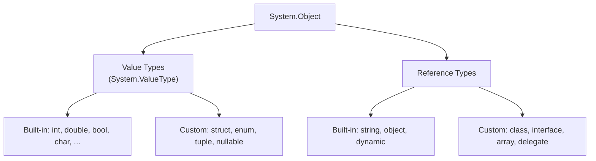
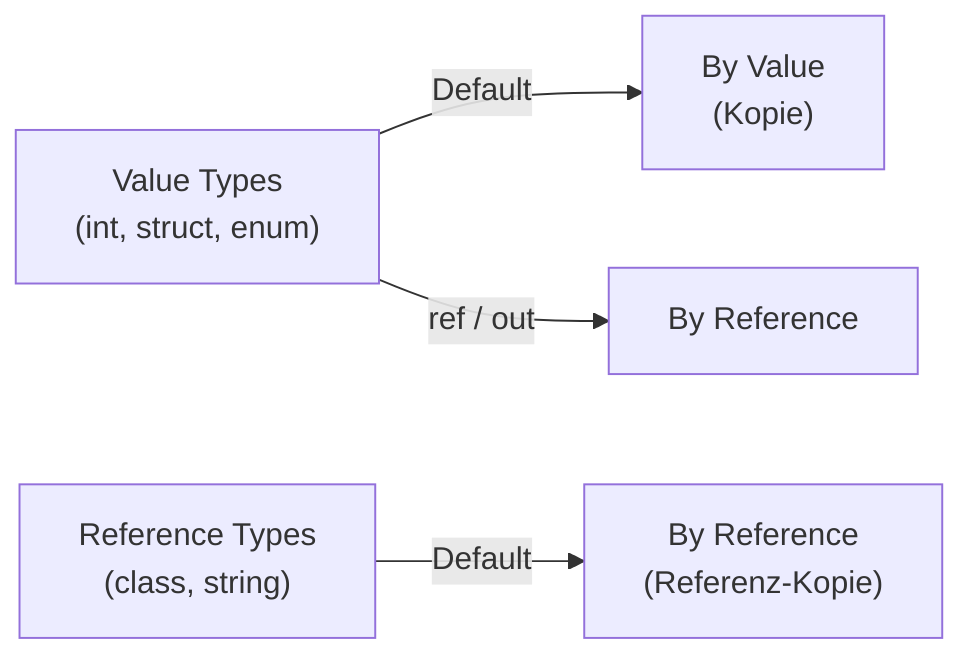
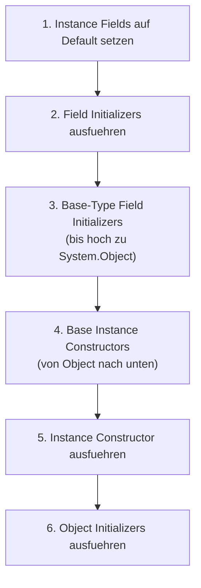
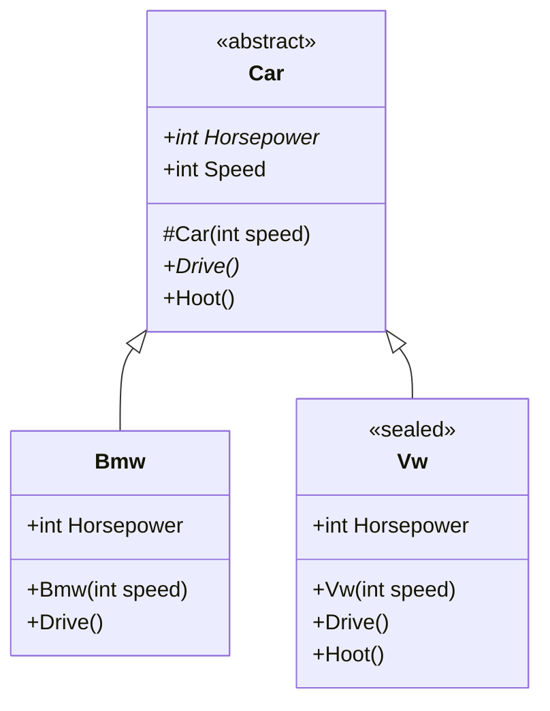

# U02: Basic Elements of Object-Oriented Programming with C\#

**Repo:** `csharp/repos/Units/U02/`
**Tasks:** [[csharp/repos/Units/U02/Tasks.md|Tasks.md]]

---

## Inhaltsverzeichnis

- [[#S01: Types, Type Members & Access Modifiers|S01: Types, Type Members & Access Modifiers]]
- [[#S02: Fields & Properties|S02: Fields & Properties]]
- [[#S03: Methods|S03: Methods]]
- [[#S04: Constructors & Inheritance|S04: Constructors & Inheritance]]
- [[#S05: Versioning (virtual, override, new)|S05: Versioning (virtual, override, new)]]
- [[#S06: Abstract & Sealed|S06: Abstract & Sealed]]
- [[#S07: Static|S07: Static]]
- [[#S08: Interfaces|S08: Interfaces]]
- [[#S09: Structure Types (Structs)|S09: Structure Types (Structs)]]
- [[#S10: Equality Comparisons|S10: Equality Comparisons]]
- [[#S11: Casting & Conversions|S11: Casting & Conversions]]
- [[#S12: Boxing & Unboxing|S12: Boxing & Unboxing]]
- [[#S13: Using Statement & IDisposable|S13: Using Statement & IDisposable]]
- [[#S14: Exceptions & Exception Handling|S14: Exceptions & Exception Handling]]
- [[#Tasks (Uebungsaufgaben)|Tasks (Uebungsaufgaben)]]
- [[#Proposed Solutions (Auszuege)|Proposed Solutions (Auszuege)]]

---

## S01: Types, Type Members & Access Modifiers

### Common Type System (CTS)

Alle Typen in C# leiten von `System.Object` (`object`) ab. Das ist das **Common Type System (CTS)**.



**Value Types** speichern Daten direkt in der Variable (inline im Speicher). **Reference Types** speichern eine Referenz auf die Daten (auf dem Heap); uninitialisierte Referenzvariablen haben den Wert `null`.

### Type Members

Typen (insbesondere Klassen) enthalten **Members** — sie reprasentieren Daten und Verhalten:

| Member | Beschreibung |
|---|---|
| **Fields** | Klassenvariablen (Daten) |
| **Properties** | Getter/Setter fuer Felder |
| **Methods** | Aktionen/Verhalten |
| **Constructors** | Initialisierung bei Instanziierung |
| **Constants** | Konstante Werte |
| **Indexers** | Instanz wie Array indizieren |
| **Events** | Benachrichtigungen |
| **Operators** | Konvertierungen und Ausdruecke |

### Access Modifiers

| Modifier | Zugriff |
|---|---|
| `public` | Von ueberall |
| `private` | Nur innerhalb der gleichen Klasse (Default fuer Members) |
| `protected` | Gleiche Klasse + abgeleitete Klassen |
| `internal` | Gleiche Assembly (Default fuer Klassen) |
| `protected internal` | Gleiche Assembly ODER abgeleitete Klasse in anderer Assembly |
| `private protected` | Abgeleitete Klasse innerhalb der gleichen Assembly |

> [!tip] Merke
> Ohne expliziten Modifier: Klassen sind `internal`, Members sind `private`.

### Beispiel: DateTime und Random

```csharp
// DateTime ist ein struct (Value Type)
var dt = new DateTime(2025, 2, 17, 9, 58, 23, DateTimeKind.Local);
Console.WriteLine($"Tag: {dt.DayOfWeek}");          // computed Property
Console.WriteLine($"UTC: {dt.ToUniversalTime()}");   // Methode

// Random ist eine class (Reference Type)
var rand = new Random();
var n = rand.Next(1, 100);     // inklusive untere, exklusive obere Grenze
var f = rand.NextDouble();     // >= 0.0, < 1.0

Random? maybeNull = null;      // Nullable Reference Type (mit <Nullable>enable</Nullable>)
```

---

## S02: Fields & Properties

### Fields vs. Properties

- **Fields** sind Variablen, die direkt in einem Typ deklariert werden
- OOP-Prinzip **Kapselung**: Fields sollten **nicht public** sein
- **Properties** bieten kontrollierte Zugriffsmethoden (Getter/Setter) und sind First-Class-Citizens in C#

### Property-Varianten im Ueberblick

```csharp
class Person
{
    // --- Explicit Backing Field ---
    string firstName;
    public string FirstName
    {
        get => this.firstName;
        set => this.firstName = value;   // 'value' = impliziter Parameter
    }

    // --- Implicit Backing Field mit 'field' Keyword (C# 14) ---
    public string LastName
    {
        get => field;
        set
        {
            ArgumentException.ThrowIfNullOrWhiteSpace(value);
            field = value;
        }
    }

    // --- Auto-Implemented Property ---
    public DateTime Birthday { get; set; }

    // --- Auto-Implemented mit Default-Wert ---
    public string Gender { get; set; } = "unknown";

    // --- Read-Only Property (nur im Constructor setzbar) ---
    public int Id { get; }

    // --- Init Accessor (nur im Constructor oder Initializer setzbar) ---
    public string Email { get; init; }

    // --- Public Getter, Private Setter ---
    public string Address { get; private set; }

    // --- Expression-Bodied Derived Property (berechnet, kein Backing Field) ---
    public string DisplayName => string.IsNullOrEmpty(this.FirstName)
        ? this.LastName
        : string.Concat(this.FirstName, ' ', this.LastName);
}
```

### Object Initializers

Statt Constructor + einzelne Zuweisungen kann man Properties direkt bei der Erstellung setzen:

```csharp
// Klassisch
var p1 = new Person();
p1.FirstName = "John";
p1.LastName = "Doe";

// Mit Object Initializer (kompakter, lesbarer)
var p2 = new Person
{
    FirstName = "Jane",
    LastName = "Roe",
    Birthday = new DateTime(2002, 6, 28),
    Email = "jane@example.com"    // geht weil 'init' Accessor
};

// Short 'new' mit Initializer
Person p3 = new() { LastName = "Smith" };

// Collection Initializer
var list = new List<Person> { p1, p2, p3 };
```

> [!tip] Merke
> `init`-Properties koennen nur im Constructor oder im Initializer gesetzt werden, danach sind sie readonly. Normale `get; set;`-Properties koennen jederzeit geaendert werden.

### Expression Bodies & Lambda Operator

Der Lambda-Operator `=>` erlaubt kompakte Definitionen:

```csharp
// Methode
public override string ToString() => $"Name: {this.DisplayName}, Id: {this.Id}";

// Property
public string DisplayName => string.Concat(this.FirstName, ' ', this.LastName);
```

---

## S03: Methods

### Methodensignatur

```
[Access Modifier] [Modifiers] ReturnType MethodName(Parameters)
```

- **Parameter** = Teil der Definition, **Argument** = konkreter Wert beim Aufruf
- Default Access Modifier: `private`

### Argument-Uebergabe: by Value vs. by Reference



```csharp
// BY VALUE: n wird NICHT veraendert
static void PassByValue(int value) => value = 42;

var n = 23;
PassByValue(n);
Console.WriteLine(n);    // 23 — unveraendert!

// BY REF: n wird veraendert
static void PassByRef(ref int n) => n = 42;

PassByRef(ref n);        // 'ref' muss auch beim Aufruf stehen!
Console.WriteLine(n);    // 42

// OUT: Variable muss nicht vorher initialisiert sein, Methode MUSS zuweisen
static void PassByOut(out object o) => o = new Random().Next();

PassByOut(out var result);
Console.WriteLine(result);
```

**Praxis-Beispiel** fuer `out`: das `TryParse`-Pattern:

```csharp
if (int.TryParse("42", out var number))
    Console.WriteLine($"Parsed: {number}");
else
    Console.WriteLine("Kein Integer!");
```

### params — Variable Argumentanzahl

```csharp
static int CalculateSum(params int[] numbers)
{
    var sum = 0;
    foreach (var n in numbers)
        sum += n;
    return sum;
}

var total = CalculateSum(1, 2, 3, 4, 5, 6);  // 21
```

> [!info]
> Nur **ein** `params`-Parameter erlaubt, muss der **letzte** Parameter sein.

### Expression-Bodied Methods

```csharp
static int Max(int a, int b) => (a >= b) ? a : b;
```

### nameof-Operator

```csharp
var n = 23;
Console.WriteLine($"{nameof(n)} = {n}");  // "n = 23"
```

Gibt den Namen einer Variable/Property/Methode als String zurueck — nuetzlich fuer Fehlermeldungen und Logging.

---

## S04: Constructors & Inheritance

### Inheritance (Vererbung)

- Klasse kann von **genau einer** Basisklasse erben (Single Inheritance)
- Syntax: `class Derived : Base { }`
- Die abgeleitete Klasse erhaelt automatisch alle `public`, `protected` und `internal` Members (ausser Constructors und Finalizers)
- Structs unterstuetzen **keine** Vererbung

```csharp
class Person
{
    public Person(string firstName, string lastName)
    {
        this.FirstName = firstName;
        this.LastName = lastName;
    }

    public string FirstName { get; }
    public string LastName { get; }
    public string DisplayName => $"{this.FirstName} {this.LastName}";
}

class Student : Person
{
    // base(...) ruft den Constructor der Basisklasse auf
    public Student(string firstName, string lastName, string matriculation)
        : base(firstName, lastName)
    {
        this.Matriculation = matriculation;
    }

    public string Matriculation { get; }
}
```

### Constructor-Regeln

1. Kein Constructor definiert => Compiler erzeugt **parameterlosen Default-Constructor**
2. Mindestens ein Constructor definiert => **kein** weiterer wird automatisch erzeugt
3. `this(...)` ruft einen anderen Constructor **derselben Klasse** auf
4. `base(...)` ruft einen Constructor der **Basisklasse** auf

```csharp
class Foo
{
    public string Name { get; set; }
    // Impliziter parameterloser Constructor
}

class Bar
{
    public Bar(string name) => this.Name = name;
    public string Name { get; }
    // new Bar() geht NICHT — kein parameterloser Constructor
}

class User
{
    // Constructor-Chaining mit this(...)
    public User(string login) : this(login, $"{login}@example.com") { }

    public User(string login, string email)
    {
        this.Login = login;
        this.Email = email;
    }

    public string Login { get; }
    public string Email { get; }
}
```

### Reihenfolge der Constructor-Aktionen



### Primary Constructors (seit C# 12)

Kompakte Syntax — Parameter stehen im gesamten Klassenkoerper zur Verfuegung:

```csharp
class PrimaryBar(string name)
{
    // Jeder weitere Constructor MUSS this(...) aufrufen
    public PrimaryBar(string name, int id) : this(name) => this.Id = id;

    public int Id { get; set; }
    public string Name { get; } = name;   // Parameter als Initializer
}
```

> [!warning] Wichtig
> Primary-Constructor-Parameter sind **keine** Properties — sie sind nur im Klassenkoerper sichtbar. Man muss sie explizit Properties zuweisen.

---

## S05: Versioning (virtual, override, new)

### Polymorphismus durch Methodenueberschreibung

Basis fuer **Polymorphismus** — das zweite Kernprinzip der OOP:

| Keyword | Bedeutung |
|---|---|
| `virtual` | Member in Basisklasse kann ueberschrieben werden |
| `override` | Member in abgeleiteter Klasse ueberschreibt Basis-Member |
| `sealed override` | Ueberschreibung, aber weitere Ueberschreibung verboten |
| `new` | Verbirgt (hides) Basis-Member statt zu ueberschreiben |

```csharp
class Customer
{
    public string Name { get; set; }

    // virtual: kann ueberschrieben werden
    public virtual double Discount => 0.05;
    public virtual string GetSalutation() => $"Dear customer {this.Name}";

    // NICHT virtual: kann NICHT ueberschrieben werden
    public void Invoice(DateTime date)
        => Console.WriteLine($"Invoice {date:d}, discount {this.Discount:p0}");

    // sealed override: ToString ueberschrieben, aber NICHT weiter ueberschreibbar
    public sealed override string ToString() => this.Name;
}

class PremiumCustomer : Customer
{
    // override: ueberschreibt virtual Member der Basisklasse
    public override double Discount => base.Discount + 0.1;    // base.Discount = 0.05
    public override string GetSalutation() => $"Valued premium customer {this.Name}";

    // Neue Members der abgeleiteten Klasse
    public int PremiumLevel { get; set; } = 1;
}
```

### Polymorphismus in Aktion

```csharp
Customer customer = new PremiumCustomer { Name = "Bar Corp." };

// Ruft PremiumCustomer.GetSalutation() auf (Polymorphismus!)
Console.WriteLine(customer.GetSalutation());

// Ruft Customer.Invoice() auf, ABER Discount ist ueberschrieben => 15%
customer.Invoice(DateTime.Now);

// Zugriff auf PremiumCustomer-spezifische Members via Pattern Matching
if (customer is PremiumCustomer premium)
{
    Console.WriteLine($"Level: {premium.PremiumLevel}");
}
```

> [!tip] Merke
> `virtual` + `override` = echte Ueberschreibung (Laufzeit-Dispatch). `new` = Verbergen (Compile-Zeit-Binding) — gefaehrlich und sollte vermieden werden!

---

## S06: Abstract & Sealed

### Abstract Classes

- Koennen **nicht instanziiert** werden
- Dienen als **Blueprint/Vertrag** fuer abgeleitete Klassen
- Koennen sowohl **abstrakte** Members (nur Signatur) als auch **konkrete** Members (mit Implementierung) enthalten
- Abgeleitete nicht-abstrakte Klassen **muessen** alle abstrakten Members implementieren

### Sealed Classes

- Koennen **nicht weiter vererbt** werden

```csharp
abstract class Car
{
    protected Car(int speed) => this.Speed = speed;

    // Abstrakte Members: nur Signatur, KEINE Implementierung
    public abstract int Horsepower { get; }
    public abstract void Drive();

    // Konkrete Members: mit Implementierung, kann virtual sein
    public virtual void Hoot() => Console.WriteLine("Hupen!");

    public int Speed
    {
        get => field;
        set => field = value > 0 ? value : 0;
    }
}

class Bmw : Car
{
    public Bmw(int speed) : base(speed) { }

    public override int Horsepower => 350;
    public override void Drive() => Console.WriteLine("BMW faehrt");
    // Hoot() wird von Car geerbt (nicht ueberschrieben)
}

sealed class Vw : Car   // sealed: keine weitere Ableitung moeglich!
{
    public Vw(int speed) : base(speed) { }

    public override int Horsepower => 180;
    public override void Drive() => Console.WriteLine("VW faehrt");

    public override void Hoot()
    {
        base.Hoot();                                  // Basis-Implementierung aufrufen
        Console.WriteLine("Zusaetzlich Fanfare!");
    }
}
```

### Polymorphe Liste

```csharp
List<Car> fleet = [new Bmw(250), new Vw(120)];

foreach (var car in fleet)
{
    Console.WriteLine($"{car.GetType().Name}: {car.Speed} km/h, {car.Horsepower} PS");
    car.Drive();   // Polymorphismus: ruft jeweils die richtige Implementierung auf
    car.Hoot();
}
```



---

## S07: Static

### Static Members

- Gehoeren zur **Klasse**, nicht zu einer Instanz
- Zugriff immer ueber den Klassennamen: `Console.WriteLine()`
- Es existiert genau **eine Kopie**, unabhaengig von der Anzahl der Instanzen
- Koennen **nicht** auf nicht-statische Members zugreifen

### Static Constructors

Werden **automatisch** aufgerufen, bevor die erste Instanz erzeugt oder ein statisches Member referenziert wird — hoechstens **einmal** pro Laufzeit.

```csharp
class Process
{
    // Statisches Feld — gehoert zur Klasse
    protected static readonly DateTime GlobalStartTime;

    // Statischer Constructor — einmalig, vor erster Nutzung
    static Process()
    {
        GlobalStartTime = DateTime.Now;
        Console.WriteLine($"Global start: {GlobalStartTime:T}");
    }

    // Instance Constructor
    public Process(int number) => this.Number = number;

    protected int Number { get; set; }

    public void Start()
    {
        var elapsed = DateTime.Now - GlobalStartTime;
        Console.WriteLine($"Process #{this.Number} started after {elapsed.Milliseconds:N0}ms");
    }
}
```

### Static Classes

- Koennen **nicht instanziiert** werden
- Enthalten **nur** statische Members
- Sind implizit `sealed`
- .NET-Beispiele: `Console`, `Math`, `File`

---

## S08: Interfaces

### Problem & Loesung

C# unterstuetzt **keine** Mehrfachvererbung von Klassen. Die Loesung: eine Klasse kann **mehrere Interfaces** implementieren.

### Interface-Regeln

- Definieren **oeffentliche Signaturen** (kein Body by default)
- Vergleichbar mit abstrakten Klassen, die nur abstrakte Members enthalten
- Koennen nicht direkt instanziiert werden
- Namenskonvention: Prefix `I` (z.B. `IDriveable`)
- Members sind **public by default**
- Seit C# 8: Default-Implementierungen moeglich
- Seit C# 11: `static abstract` Members moeglich

> [!quote] Definition
> "Wenn man ein Konzept vollstaendig als 'was es tut' beschreiben kann, ohne 'wie es das tut' zu spezifizieren, sollte man ein Interface verwenden." — Herbert Schildt

### Beispiel: Interface implementieren

```csharp
interface IDriveable
{
    string SerialNumber { get; }
    int Speed { get; }
    void Accelerate(int amount);
    void Drive();
}

// Klasse implementiert mehrere Interfaces
class Car : IDriveable, ICloneable, IEquatable<Car>
{
    public Car() : this(new Random().Next(100000).ToString()) { }
    private Car(string serialNumber) => this.SerialNumber = serialNumber;

    // IDriveable
    public string SerialNumber { get; }
    public int Speed { get; private set; }
    public void Accelerate(int amount) { if (amount > 0) this.Speed += amount; }
    public void Drive() => Console.WriteLine($"Car: {this.Speed} km/h");

    // ICloneable
    public object Clone() => new Car(this.SerialNumber) { Speed = this.Speed };

    // IEquatable<Car>
    public bool Equals(Car other) => other is not null && this.SerialNumber == other.SerialNumber;
    public override bool Equals(object obj) => this.Equals(obj as Car);
    public override int GetHashCode() => this.SerialNumber.GetHashCode();
}
```

### Interfaces vs. Abstrakte Klassen

| | Interface | Abstrakte Klasse |
|---|---|---|
| Mehrfach-Implementierung | Ja | Nein (Single Inheritance) |
| Felder | Nein (nur static) | Ja |
| Constructors | Nein (nur static) | Ja |
| Default-Implementierung | Seit C# 8 | Ja |
| Structs | Ja | Nein |

---

## S09: Structure Types (Structs)

### Structs vs. Classes

Structs sind **Value Types** — jede Variable enthaelt eine eigene Kopie der Daten.

| | Struct (Value Type) | Class (Reference Type) |
|---|---|---|
| Speicher | Stack/Inline | Heap |
| Zuweisung | Kopie der Daten | Kopie der Referenz |
| Vererbung | Nein (aber Interfaces) | Ja |
| Default Constructor | Immer vorhanden | Nur wenn kein anderer definiert |
| `null` moeglich | Nein (ausser nullable) | Ja |

### Copy-Semantik demonstriert

```csharp
// CLASS: Zuweisung kopiert die REFERENZ — beide zeigen auf das gleiche Objekt
ClassPoint pc1 = new(11, 15);
ClassPoint pc2 = pc1;               // pc2 zeigt auf dasselbe Objekt!
pc2.X = 99;
Console.WriteLine(pc1.X);           // 99 — auch pc1 ist veraendert!

// STRUCT: Zuweisung kopiert die DATEN — unabhaengige Kopien
StructPoint ps1 = new(21, 25);
StructPoint ps2 = ps1;              // ps2 ist eine eigene Kopie
ps2.X = 99;
Console.WriteLine(ps1.X);           // 21 — ps1 unveraendert!
```

### Structs und Methodenaufrufe

```csharp
// Struct als Parameter: Kopie wird uebergeben!
static void SetX(StructPoint point, int x) { point.X = x; }
SetX(ps2, 99);
Console.WriteLine(ps2.X);    // unveraendert — Kopie wurde modifiziert

// Mit ref: Original wird uebergeben
static void SetXByRef(ref StructPoint point, int x) { point.X = x; }
SetXByRef(ref ps2, 99);
Console.WriteLine(ps2.X);    // 99 — Original veraendert
```

### readonly struct

Best Practice fuer Performance: `readonly` verhindert Aenderungen nach Initialisierung und erlaubt Compiler-Optimierungen.

```csharp
readonly struct ReadonlyStructPoint : IPoint,
    IAdditionOperators<ReadonlyStructPoint, ReadonlyStructPoint, ReadonlyStructPoint>
{
    public ReadonlyStructPoint(double x, double y)
    {
        this.X = x;
        this.Y = y;
    }

    public double X { get; init; }
    public double Y { get; init; }

    // Operator-Ueberladung: muss NEUES Struct zurueckgeben (readonly!)
    public static ReadonlyStructPoint operator +(ReadonlyStructPoint left, ReadonlyStructPoint right)
        => new(left.X + right.X, left.Y + right.Y);

    public override string ToString() => $"( {this.X:G5} | {this.Y:G5} )";
}

// Nutzung
ReadonlyStructPoint a = new(3.2, -2.7), b = new(-5.6, 3.1);
var c = a + b;   // neues Struct, a und b bleiben unveraendert
```

---

## S10: Equality Comparisons

### Zwei Formen der Gleichheit

1. **Value Equality (Aequivalenz):** Gleiche Daten => gleich
2. **Reference Equality (Identitaet):** Gleiches Objekt im Speicher => gleich

```csharp
// Value Types: standardmaessig Value Equality
var a = 1 + 2 + 3;
var b = 6;
Console.WriteLine(a == b);       // true

// Reference Types: standardmaessig Reference Equality
var obj1 = new IntegerAsClass(6);
var obj2 = new IntegerAsClass(6);
Console.WriteLine(obj1 == obj2);           // false — verschiedene Objekte!
Console.WriteLine(ReferenceEquals(obj1, obj2));  // false
```

### Equality fuer eigene Typen implementieren

Fuer **Classes** (Reference Types) — muss `null` beruecksichtigen:

```csharp
class ClassPoint : IEquatable<ClassPoint>, IEqualityOperators<ClassPoint, ClassPoint, bool>
{
    public decimal X { get; set; }
    public decimal Y { get; set; }

    // Typed Equals
    public bool Equals(ClassPoint other)
    {
        if (other is null) return false;
        if (ReferenceEquals(this, other)) return true;       // Optimierung
        if (this.GetType() != other.GetType()) return false;
        return this.X == other.X && this.Y == other.Y;
    }

    // Object.Equals ueberschreiben
    public override bool Equals(object obj) => this.Equals(obj as ClassPoint);

    // GetHashCode MUSS konsistent mit Equals sein
    public override int GetHashCode() => HashCode.Combine(this.X, this.Y);

    // Operatoren
    public static bool operator ==(ClassPoint left, ClassPoint right)
        => left is null ? right is null : left.Equals(right);
    public static bool operator !=(ClassPoint left, ClassPoint right)
        => !(left == right);
}
```

Fuer **Structs** (Value Types) — einfacher, da `null` nicht moeglich:

```csharp
readonly struct StructPoint : IEquatable<StructPoint>, IEqualityOperators<StructPoint, StructPoint, bool>
{
    public decimal X { get; init; }
    public decimal Y { get; init; }

    public bool Equals(StructPoint other) => this.X == other.X && this.Y == other.Y;
    public override bool Equals(object obj) => obj is StructPoint other && this.Equals(other);
    public override int GetHashCode() => HashCode.Combine(this.X, this.Y);

    public static bool operator ==(StructPoint left, StructPoint right) => left.Equals(right);
    public static bool operator !=(StructPoint left, StructPoint right) => !(left == right);
}
```

> [!tip] Regel
> Wenn `Equals(object)` ueberschrieben wird, muss auch `GetHashCode()` ueberschrieben werden!

---

## S11: Casting & Conversions

### Vier Arten der Typkonvertierung

| Art | Beschreibung | Beispiel |
|---|---|---|
| **Implizit** | Immer erfolgreich, kein Datenverlust | `Foo f = bar;` (Bar erbt von Foo) |
| **Explizit (Cast)** | Kann fehlschlagen, moeglicher Datenverlust | `var b = (Bar)foo;` |
| **User-defined** | Eigene Konvertierungsoperatoren | |
| **Parsing** | Aus Strings | `int.Parse("42")` |

### Casting in der Vererbungshierarchie

```csharp
class Foo { public int Id { get; set; } }
class Bar : Foo { public string Name { get; set; } = "Unknown"; }

Foo foo = new(1);
Bar bar = new(2);

// Implizit: Derived -> Base (immer sicher)
Foo f = bar;              // Bar IST ein Foo

// Explizit: Base -> Derived (kann InvalidCastException werfen!)
try
{
    var b = (Bar)foo;     // foo ist KEIN Bar => Exception!
}
catch (InvalidCastException ex)
{
    Console.WriteLine(ex.Message);
}
```

### Sichere Konvertierung mit `as` und `is`

```csharp
// 'as': gibt null zurueck statt Exception
var result = foo as Bar;           // null (foo ist kein Bar)

// 'is' mit Pattern Matching (bevorzugt!)
if (foo is Bar myBar)
    Console.WriteLine(myBar.Name);    // nur wenn Konvertierung erfolgreich
else
    Console.WriteLine("Keine Konvertierung moeglich");
```

> [!success] Best Practice
> Verwende `is` mit Pattern Matching statt explizitem Cast — sicherer und lesbarer.

---

## S12: Boxing & Unboxing

Da alle Typen von `System.Object` ableiten, kann jeder Value Type als `object` behandelt werden. Dafuer braucht es Boxing/Unboxing.

### Boxing (Value -> Reference, implizit)

```csharp
int n = 42;
object o = n;          // Boxing: int wird in object "verpackt" (auf dem Heap)
```

### Unboxing (Reference -> Value, explizit)

```csharp
int m = (int)o;        // Unboxing: Wert wird aus object "ausgepackt"
```

### Unabhaengige Kopie

```csharp
n = 5;
Console.WriteLine(o);  // immer noch 42 — Boxing hat eine KOPIE erstellt
```

### Boxing mit Interfaces

```csharp
interface IIdentifiable { int Id { get; set; } }

struct Foo : IIdentifiable
{
    public int Id { get; set; }
}

var foo = new Foo { Id = 42 };
IIdentifiable box = foo;          // Boxing: Struct -> Interface

foo.Id = 5;
Console.WriteLine(foo.Id);       // 5
Console.WriteLine(box.Id);       // 42 — unabhaengige Kopie!
```

> [!tip] Merke
> Boxing erstellt immer eine **Kopie** des Value Types auf dem Heap. Aenderungen am Original betreffen die Box nicht (und umgekehrt).

---

## S13: Using Statement & IDisposable

### Garbage Collector und IDisposable

- .NET hat automatisches Speichermanagement (GC)
- **Unmanaged Resources** (Dateien, DB-Connections, etc.) muessen explizit freigegeben werden
- Das `IDisposable`-Interface stellt dafuer die Methode `Dispose()` bereit
- Das `using`-Statement garantiert, dass `Dispose()` aufgerufen wird

### Drei Varianten

```csharp
class UseMe : IDisposable
{
    public string Name { get; }
    public UseMe(string name) { this.Name = name; Console.WriteLine($"Created {name}"); }
    public void DoWork() => Console.WriteLine($"Working {this.Name}");
    public void Dispose() => Console.WriteLine($"Disposed {this.Name}");
}

// Variante 1: Manuell mit try-finally
var u1 = new UseMe("u1");
try { u1.DoWork(); }
finally { u1?.Dispose(); }         // Null-Conditional ?.

// Variante 2: using-Block
using (var u2 = new UseMe("u2"))
{
    u2.DoWork();
}   // Dispose() wird hier automatisch aufgerufen

// Variante 3: using-Deklaration (ohne Block)
using var u3 = new UseMe("u3");
u3.DoWork();
// Dispose() wird am Ende der umgebenden Methode aufgerufen
```

> [!success] Best Practice
> Immer `using` verwenden statt manuell `Dispose()` aufzurufen — verhindert Resource Leaks auch bei Exceptions.

---

## S14: Exceptions & Exception Handling

### Grundkonzept

- Alle Exceptions leiten von `System.Exception` ab
- In C# sind alle Exceptions **unchecked** (anders als Java)
- `try` — Code der Exceptions werfen koennte
- `catch` — Exception-Handler (best match wird ausgefuehrt)
- `finally` — wird **immer** ausgefuehrt (Cleanup)
- `throw` — Exception manuell werfen

### Try-Catch-Finally

```csharp
try
{
    object o = null;
    Console.WriteLine(o.ToString());           // NullReferenceException!
}
catch (NullReferenceException e)               // Spezifischster Match zuerst
{
    Console.WriteLine($"Null: {e.Message}");
}
catch (Exception e)                            // Allgemeiner Catch
{
    Console.WriteLine($"Other: {e.Message}");
}
finally
{
    Console.WriteLine("Wird immer ausgefuehrt");
}
```

### Exceptions werfen — vier Varianten

```csharp
// Variante 1: Klassisch mit == (Achtung: op== koennte ueberladen sein)
if (text == null)
    throw new ArgumentNullException(nameof(text));

// Variante 2: Pattern Matching mit 'is' (sicherer)
if (text is null)
    throw new ArgumentNullException(nameof(text));

// Variante 3: Helper-Methode (kompakt)
ArgumentNullException.ThrowIfNull(text);

// Variante 4: Null-Coalescing mit throw-Expression
Console.WriteLine(text ?? throw new ArgumentNullException(nameof(text)));
```

> [!success] Best Practice
> Verwende `is null` statt `== null` — das kann nicht durch Operator-Ueberladung veraendert werden. Oder nutze `ThrowIfNull` fuer maximale Kompaktheit.

---

## Tasks (Uebungsaufgaben)

| Task | Thema | Beschreibung |
|---|---|---|
| **Bathalia** | Fallunterscheidung | f(n) = n/2 falls n>=0 und gerade, sonst 0 |
| **Bavronil** | Schaltjahre | `IsLeapYear`-Methode nach gregorianischem Kalender |
| **Beroson** | Durchschnitt | `AverageValue(int[])` fuer Quadratzahlen |
| **Breau** | ref/out/params | `Swap`, `RandomFill`, `DynamicMax` |
| **Basinham** | Mustersuche | `FindAll` — Positionen eines Patterns in String finden |
| **Bleersora** | Palindrome | Palindrom-Pruefung (case-insensitive, ohne Satzzeichen) |
| **Babuin** | Klasse Contact | Constructors, Properties, ToString |
| **Bloitol** | Klasse Student | ReadOnly-Props, Matrikelnummer, Semester-Berechnung |
| **Boudadillo** | Dateien | Bundesliga-Datei einlesen, Club-Klasse, Tabelle |
| **Breka** | Polynome | Polynomial-Klasse mit Eval, Add, Multiply, IsZero |

---

## Proposed Solutions (Auszuege)

### Bathalia — Fallunterscheidung

```csharp
static int MyFunction(int n) => (n >= 0 && n % 2 == 0) ? n / 2 : 0;
```

### Bavronil — Schaltjahre

```csharp
static bool IsLeapYear(int year)
    => (year % 400 == 0) || (year % 4 == 0 && year % 100 != 0);
```

### Beroson — Durchschnittswert

```csharp
static double AverageValue(int[] numbers)
{
    if (numbers.Length == 0) return 0;
    var sum = 0;
    for (var i = 0; i < numbers.Length; i++)
        sum += numbers[i];
    return (double)sum / numbers.Length;
}
```

### Breau — ref, out, params

```csharp
static void Swap(ref int n1, ref int n2)
{
    var n = n1;     // oder: (n1, n2) = (n2, n1);
    n1 = n2;
    n2 = n;
}

static void RandomFill(int[] array)   // Arrays sind Reference Types!
{
    var rnd = new Random();
    for (var i = 0; i < array.Length; i++)
        array[i] = rnd.Next();
}

static int DynamicMax(params int[] array)
{
    int result = 0;
    for (var i = 0; i < array.Length; i++)
        if (result < array[i]) result = array[i];
    return result;
}
```

### Bleersora — Palindrome

```csharp
static bool IsPalindrom(string check)
{
    var s = check.ToLower();
    int i = 0, j = s.Length - 1;
    while (i < j)
    {
        while (i < j && (s[i] < 'a' || s[i] > 'z')) i++;
        while (i < j && (s[j] < 'a' || s[j] > 'z')) j--;
        if (j <= i || s[i] != s[j]) return false;
        i++; j--;
    }
    return true;
}
```

### Babuin — Contact-Klasse

```csharp
class Contact
{
    public Contact() => this.Name = "N.N.";
    public Contact(string name, int age) { this.Name = name; this.Age = age; }

    public int Age { get; set; }
    public string Name { get; set; }

    public override string ToString() => $"Contact: {this.Name}, age: {this.Age}.";
}
```

### Bloitol — Student-Klasse

```csharp
class Student
{
    public Student(string firstName, string lastName)
    {
        this.FirstName = firstName ?? throw new ArgumentNullException(nameof(firstName));
        this.LastName = lastName ?? throw new ArgumentNullException(nameof(lastName));
        this.Matriculation = $"{this.FirstName[0]}{this.LastName[0]}{new Random().Next(1000, 9999)}";
    }

    public string FirstName { get; }
    public string LastName { get; }
    public string Matriculation { get; }

    public DateTime StartOfStudy
    {
        get => field;
        set
        {
            if (value.Day != 1 || value.Month != 10)
                throw new ArgumentException("Studienstart muss am 01.10. sein.");
            field = value;
        }
    }

    public int GetSemester(DateTime date)
    {
        if (date < this.StartOfStudy || date >= this.StartOfStudy.AddYears(3))
            return 0;
        if (date.Month <= 3)
            return (2 * (date.Year - this.StartOfStudy.Year - 1)) + 1;
        if (date.Month >= 10)
            return (2 * (date.Year - this.StartOfStudy.Year)) + 1;
        return 2 * (date.Year - this.StartOfStudy.Year);
    }

    public override string ToString()
        => $"{this.FirstName} {this.LastName}, {this.Matriculation}, {this.GetSemester(DateTime.Today)}. Semester";
}
```

### Breka — Polynomial-Klasse

```csharp
class Polynomial
{
    readonly List<double> coefficients = [];

    public Polynomial() { this.coefficients.Add(0); this.Degree = -1; }
    public Polynomial(params double[] coefficients)
    {
        foreach (var d in coefficients) this.coefficients.Add(d);
        this.Degree = coefficients.Length - 1;
    }

    public int Degree { get; init; }

    // Horner-Schema fuer effiziente Auswertung
    public double Eval(double x)
    {
        var d = this.coefficients[this.Degree];
        for (var i = this.Degree - 1; i >= 0; --i)
            d = this.coefficients[i] + (x * d);
        return d;
    }

    public Polynomial Multiply(double scalar)
        => new(this.coefficients.ConvertAll(x => scalar * x).ToArray());

    public Polynomial Add(Polynomial other)
    {
        var max = int.Max(this.coefficients.Count, other.coefficients.Count);
        var result = new double[max];
        for (var i = 0; i < max; i++)
            result[i] = (i < this.coefficients.Count ? this.coefficients[i] : 0.0)
                       + (i < other.coefficients.Count ? other.coefficients[i] : 0.0);
        return new(result);
    }

    public bool IsZero() => this.coefficients.TrueForAll(c => Math.Abs(c) < 1e-15);
}
```
