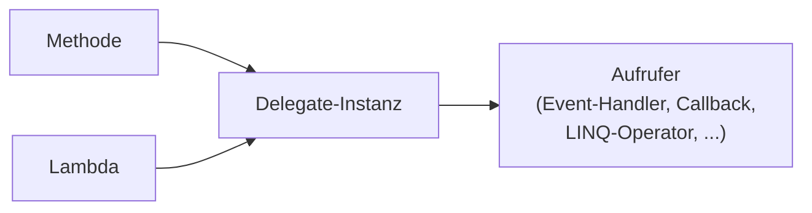
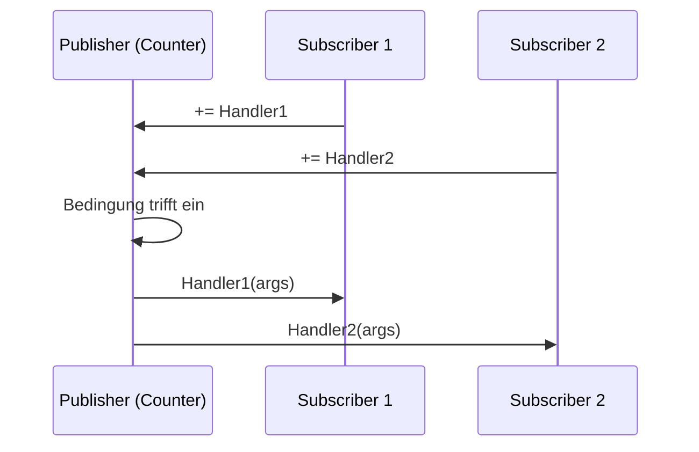

# U03: Advanced Elements of C\#

**Repo:** `csharp/repos/Units/U03/`
**Tasks:** [[csharp/repos/Units/U03/Tasks.md|Tasks.md]]

---

## Inhaltsverzeichnis

- [[#S01: Conversion Operators|S01: Conversion Operators]]
- [[#S02: Operator Overloading|S02: Operator Overloading]]
- [[#S03: Indexers|S03: Indexers]]
- [[#S04: Extension Members|S04: Extension Members]]
- [[#S05: Generic Types & Methods|S05: Generic Types & Methods]]
- [[#S06: Type Constraints|S06: Type Constraints]]
- [[#S07: Nullable Types & Null-Checking|S07: Nullable Types & Null-Checking]]
- [[#S08: Tuple Types|S08: Tuple Types]]
- [[#S09: Delegates & Lambda Expressions|S09: Delegates & Lambda Expressions]]
- [[#S10: Events|S10: Events]]
- [[#S11: Record Types|S11: Record Types]]
- [[#S12: Discard|S12: Discard]]
- [[#S13: Checked & Unchecked|S13: Checked & Unchecked]]

---

## S01: Conversion Operators

User-defined Konvertierungen erlauben es, beliebige Typen ineinander zu wandeln.

| Form | Syntax | Aufruf | Wann benutzen |
|---|---|---|---|
| **explicit** | `public static explicit operator Target(Source s)` | `var t = (Target)s;` | Kann fehlschlagen / Information verlieren |
| **implicit** | `public static implicit operator Target(Source s)` | `Target t = s;` | Immer verlustfrei und ohne Exception |

```csharp
class Foo
{
    public int Value { get; init; }
    public static implicit operator int(Foo f) => f.Value;            // verlustfrei
    public static explicit operator Foo(int n) => new() { Value = n };// (Foo)42
}
```

> [!warning] Achtung
> User-defined Conversions werden von den Operatoren `is` und `as` **nicht** beruecksichtigt. Diese pruefen nur Vererbung/Interface-Implementierung.

---

## S02: Operator Overloading

Eigene Typen koennen Operatoren ueberladen, um sich wie eingebaute Typen zu verhalten.

Ueberladbare Operatoren:

- **Arithmetisch:** unaer `++`, `--`, `+`, `-` ; binaer `*`, `/`, `%`, `+`, `-`
- **Vergleich:** `<`, `>`, `<=`, `>=`
- **Logisch:** `!`, `&`, `|`, `^` (boolesche Operanden)
- **Bitweise/Shift:** `~`, `<<`, `>>`, `>>>`, `&`, `|`, `^` (integrale Operanden)
- **Gleichheit:** `==`, `!=`

```csharp
struct Fraction(int num, int den)
{
    public int Num { get; } = num;
    public int Den { get; } = den;
    public static Fraction operator +(Fraction a, Fraction b)
        => new(a.Num * b.Den + b.Num * a.Den, a.Den * b.Den);
}
```

> [!tip] Merke
> Bei Ueberladung von `==` **muss** auch `!=` ueberladen werden — und `Equals`/`GetHashCode` sollten konsistent sein (vgl. S10 in U02).

---

## S03: Indexers

Indexer machen Klassen/Structs indizierbar wie Arrays — der Index kann **jeden** Typ haben.

```csharp
class SparseArray
{
    Dictionary<int, double> data = new();
    public double this[int i]
    {
        get => data.TryGetValue(i, out var v) ? v : 0.0;
        set { if (value == 0) data.Remove(i); else data[i] = value; }
    }
}
```

- Aehneln Properties, aber Get/Set-Accessoren haben Parameter
- Mehrere Parameter moeglich (mehrdimensional): `this[int row, int col]`
- Mehrere Indexer per Ueberladung moeglich (mit verschiedenen Index-Typen)

---

## S04: Extension Members

Erlauben das Hinzufuegen von Methoden zu vorhandenen Typen ohne deren Modifikation. **Grundlage von LINQ.**

```csharp
static class StringExtensions
{
    // Vor C# 14: this-Modifier am ersten Parameter
    public static string Reverse(this string s) => new(s.Reverse().ToArray());

    public static bool IsDivisibleBy(this int dividend, int divisor) => dividend % divisor == 0;
}

// Verwendung
string r = "hello".Reverse();
bool ok = 21.IsDivisibleBy(3);
```

Seit C# 14 gibt es **extension blocks**, die mehrere Extensions fuer einen Typ buendeln:

```csharp
// Konzept (C# 14): extension blocks
extension MyExtensions(string s)
{
    public string Reverse() => new(s.Reverse().ToArray());
}
```

> [!info] Hinweis
> Extension Members muessen in einer **static class** liegen und sind selbst **static**. Im Aufruf erscheinen sie aber wie Instanzmember (mit "extension"-Tag im IntelliSense).

---

## S05: Generic Types & Methods

Typparameter machen Klassen/Methoden wiederverwendbar **ohne** Typsicherheit zu verlieren.

```csharp
class Stack<T>
{
    T[] items = new T[16];
    int count;
    public void Push(T item) => items[count++] = item;
    public T Pop() => items[--count];
}

// Generic method
static T Max<T>(T a, T b) where T : IComparable<T>
    => a.CompareTo(b) >= 0 ? a : b;
```

Vorteile:
- **Typsicherheit** zur Compile-Zeit
- Keine Boxing/Unboxing-Kosten fuer Value Types
- Wiederverwendbarkeit (eine Implementierung fuer alle `T`)

Konvention: Typparameter heissen `T`, `TKey`, `TValue`, ...

> [!example] Beispiel — Generischer vs. nicht-generischer Code
> `List<int>` statt `ArrayList`: kein Cast beim Lesen, kein Boxing beim Schreiben, kein Risiko, dass jemand einen `string` einfuegt.

---

## S06: Type Constraints

Mit `where T : <bedingung>` werden Anforderungen an Typparameter festgelegt.

| Constraint | Bedeutung |
|---|---|
| `where T : struct` | `T` muss ein Value Type sein |
| `where T : class` | `T` muss ein Reference Type sein |
| `where T : new()` | `T` muss einen public parameterlosen Constructor haben |
| `where T : <BaseClass>` | `T` muss von BaseClass erben |
| `where T : <Interface>` | `T` muss Interface implementieren |
| `where T : U` | `T` muss von Typparameter `U` erben |
| `where T : unmanaged` | `T` muss ein unmanaged Value Type sein |
| `where T : notnull` | `T` darf nicht nullable sein |

Mehrere Constraints kommagetrennt; mehrere `where`-Klauseln fuer mehrere Typparameter.

```csharp
class Repository<T> where T : IEntity, new()
{
    public T Create() => new();
}
```

> [!warning] Achtung
> Constraints koennen **nicht** verlangen, dass ein Typ bestimmte konkrete Member hat (keine "Duck Typing"-Constraints). Stattdessen ueber ein Interface modellieren.

---

## S07: Nullable Types & Null-Checking

> [!quote] Definition — Tony Hoare ueber `null`
> _"I call it my billion-dollar mistake."_
> — Erfinder von ALGOL W, ueber die Einfuehrung der `null`-Referenz 1965.

### Nullable Value Types

Fuegt einem Value Type einen zusaetzlichen `null`-Wert hinzu — Syntax `T?`.

```csharp
int? maybe = null;
int? x = 42;
int sum = maybe + x ?? 0;   // lifted operator; null wenn ein Operand null ist
```

Typischer Einsatz: DB-Spalten mit `NULL`, fehlende Werte.

### Null-conditional & Null-propagation `?.`, `?[]`

```csharp
int? length = person?.Name?.Length;       // null, falls person oder Name null
int? first = list?[0];
```

### Null-coalescing `??`, `??=`

```csharp
string display = name ?? "(unbekannt)";   // lhs falls nicht null, sonst rhs
config ??= LoadDefault();                 // assign nur wenn null
```

### Nullable Reference Types (NRT)

```csharp
#nullable enable           // im Code, oder <Nullable>enable</Nullable> in .csproj
string  notNull;           // Warnung wenn null zugewiesen
string? maybeNull;         // null erlaubt
Console.WriteLine(maybeNull!.Length); // null-forgiving Operator: "ich weiss es besser"
```

> [!success] Best Practice
> Aktiviert Nullable-Kontext **immer** in neuen Projekten (seit .NET 6 default). Der Compiler erkennt einen Grossteil der `NullReferenceException`-Risiken statisch.

---

## S08: Tuple Types

Leichtgewichtige Wertestruktur fuer Paare/Tripel — Value Type, mit Wertgleichheit.

```csharp
(double Sum, int Count) t = (4.5, 3);
Console.WriteLine($"Mean = {t.Sum / t.Count}");

// Wertgleichheit fuer Tuples
(4.5, 3) == (4.5, 3);                   // true

// Swap in einer Zeile
(x, y) = (y, x);

// Methode mit mehreren Rueckgabewerten
static (uint Quotient, uint Remainder) DivRem(uint n, uint m) { /* ... */ }
var (q, r) = DivRem(17, 5);              // Deconstruction
```

> [!tip] Merke
> Tuples sind die moderne Alternative zu `out`-Parametern, wenn eine Methode mehrere zusammengehoerige Werte zurueckgeben soll. **Named Tuples** machen den Aufrufcode lesbar.

---

## S09: Delegates & Lambda Expressions

### Delegates

Referenzen auf Methoden mit bestimmter Signatur — typsicher und objektorientiert (vergleichbar mit C++-Funktionspointern).

```csharp
delegate double RealFunction(double x);

static double Sqr(double x) => x * x;

RealFunction f = Sqr;                    // Methode als Referenz
Console.WriteLine(f(3));                 // 9
```

### Generische Built-in Delegates

| Delegate | Signatur | Verwendung |
|---|---|---|
| `Action`, `Action<T>` | `void f(T)` | Aktion ohne Rueckgabe |
| `Func<T,R>` | `R f(T)` | Transformation |
| `Predicate<T>` | `bool f(T)` | Bedingung |

Damit muss man eigene Delegate-Typen oft gar nicht mehr definieren.

### Lambda-Ausdruecke

Anonyme Methoden, mit `=>` als Lambda-Operator.

```csharp
Func<int, int, int> add = (a, b) => a + b;
var even = numbers.Where(n => n % 2 == 0);
```



> [!info] Hinweis
> Seit C# 7 gibt es **Local Functions** als weitere Alternative — direkt innerhalb einer Methode geschachtelt.

---

## S10: Events

Events sind **Observer-Pattern** in der Sprache verankert: ein Publisher meldet ein Ereignis, beliebig viele Subscriber reagieren.

```csharp
class Counter
{
    public event EventHandler<int>? Reached;    // delegate-basiert
    int value;
    public void Increment()
    {
        if (++value % 10 == 0) Reached?.Invoke(this, value);
    }
}

var c = new Counter();
c.Reached += (s, v) => Console.WriteLine($"Wert erreicht: {v}");
```



- **Publisher** sendet das Event (kann mehrere Subscribers haben)
- **Subscriber** abonniert mit `+=` (und kann mit `-=` abmelden)
- Event-Handler **sind** im Kern Delegates (siehe S09)
- Asynchrone Benachrichtigungen moeglich

---

## S11: Record Types

Records sind eine kompakte Syntax fuer Datenmodelle — mit synthetisierter `Equals`/`GetHashCode`/`ToString`-Implementierung.

| Variante | Seit | Kategorie | Mutabilitaet |
|---|---|---|---|
| `record` | C# 9 | Reference Type | immutable (per `init`); mutable per `set` |
| `record struct` | C# 10 | Value Type | immutable; mutable per `set` |

```csharp
record Person(string FirstName, string LastName, DateTime Birthday);

var p1 = new Person("Ada", "Lovelace", new(1815, 12, 10));
var p2 = new Person("Ada", "Lovelace", new(1815, 12, 10));
Console.WriteLine(p1 == p2);             // true (Wert-Gleichheit!)
Console.WriteLine(p1);                   // Person { FirstName = Ada, ... }

// Non-destructive mutation mit 'with'
var p3 = p1 with { LastName = "Byron" };
```

### Class vs. Struct vs. Record vs. Record Struct

| | `class` | `struct` | `record` | `record struct` |
|---|---|---|---|---|
| **Kategorie** | Reference | Value | Reference | Value |
| **Speicher** | Heap | Stack | Heap | Stack |
| **Vererbung** | ja | nein | ja | nein |
| **Gleichheit (default)** | Referenz | Wert (per Feld) | **Wert** (synthetisch) | **Wert** (synthetisch) |
| **`ToString` (default)** | Typname | Typname | "Type { Prop = Val, ... }" | "Type { Prop = Val, ... }" |
| **Default-Mutabilitaet** | mutable | mutable | immutable (`init`) | immutable (`init`) |
| **`with`-Ausdruck** | nein | nein | **ja** | **ja** |

> [!success] Best Practice
> - `class`: Geschaeftslogik, Vererbung, Lebenszyklus
> - `struct`: kleine Performance-kritische Werte (Punkte, Vektoren)
> - `record`: DTOs, JSON-Modelle, ORM-Entities mit Wert-Semantik
> - `record struct`: Wertgleichheit + Stack-Performance fuer kleine immutable Datenstrukturen

---

## S12: Discard

`_` als Platzhalter signalisiert: **dieser Wert wird absichtlich verworfen**.

```csharp
// 1) Out-Parameter ignorieren
if (int.TryParse(s, out _)) { /* nur die Existenz interessiert */ }

// 2) Tuple-Element ignorieren
var (_, remainder) = DivRem(n, m);

// 3) Pattern Matching: alle restlichen Faelle
string Describe(object obj) => obj switch
{
    int n      => $"int {n}",
    string s   => $"string '{s}'",
    null       => "null",
    _          => "etwas anderes"
};

// 4) Ergebnis eines Ausdrucks verwerfen
_ = ExpensiveCallReturningTask();
```

> [!tip] Merke
> `_` ist kein normaler Bezeichner — es kann mehrfach im selben Scope auftauchen, hat keinen Speicher und keinen Typ. **Lesbarer** als `var unused = ...`.

---

## S13: Checked & Unchecked

Steuern, ob Ueberlauf bei Integer-Arithmetik geprueft wird.

| Block | Verhalten bei Ueberlauf |
|---|---|
| `checked { ... }` | wirft `System.OverflowException` |
| `unchecked { ... }` | hohe Bits verworfen (truncation) |

```csharp
int max = int.MaxValue;
int a = unchecked(max + 1);          // a == int.MinValue (wrap-around)
int b = checked(max + 1);            // OverflowException!
```

Default ist **unchecked** zur Laufzeit (kann ueber Project Property `CheckForOverflowUnderflow` gedreht werden); literale Konstantenausdruecke wertet der Compiler dagegen schon zur Compile-Zeit **checked** aus.

> [!warning] Achtung
> In sicherheits- oder geldwertkritischem Code (Finanzen, Kryptographie, Zaehler) sollte `checked` aktiv genutzt werden — `unchecked` ist nur sinnvoll, wenn der Wrap-around **gewollt** ist (z.B. Hashing, Bit-Manipulation).

---

## Bezug zu vorherigen Units

- **S01/S02** bauen auf Operator/Konvertierungs-Konzepten aus U01 auf
- **S05/S06** verallgemeinern die statische Typisierung aus U01
- **S07** loest das `null`-Problem von U01-Reference Types
- **S08/S11** ergaenzen `class` und `struct` aus U02
- **S09/S10** sind Grundlage von asynchroner Programmierung (in spaeteren Units)
