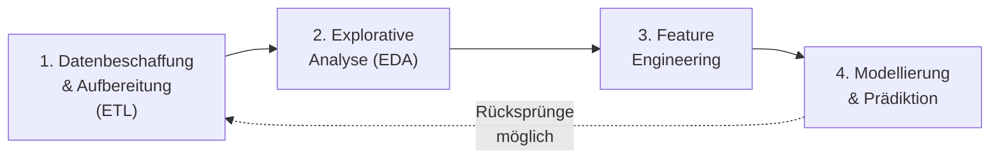
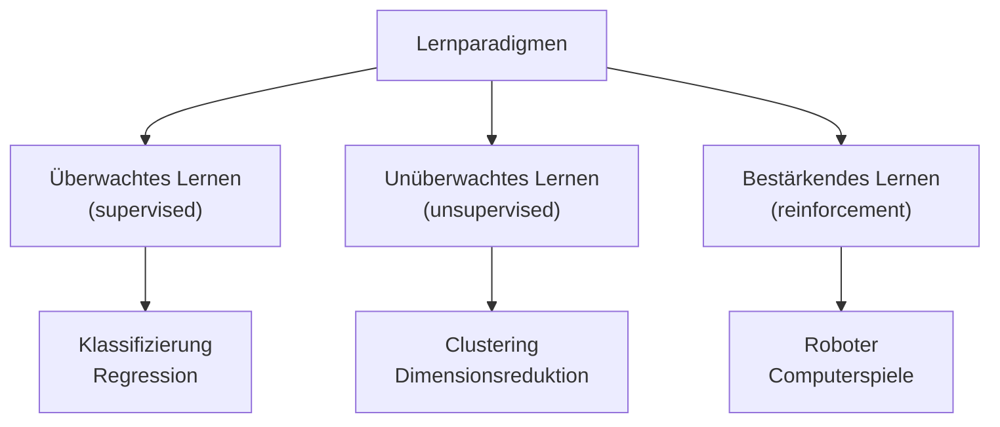
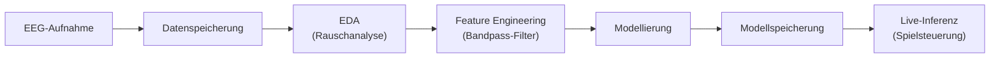
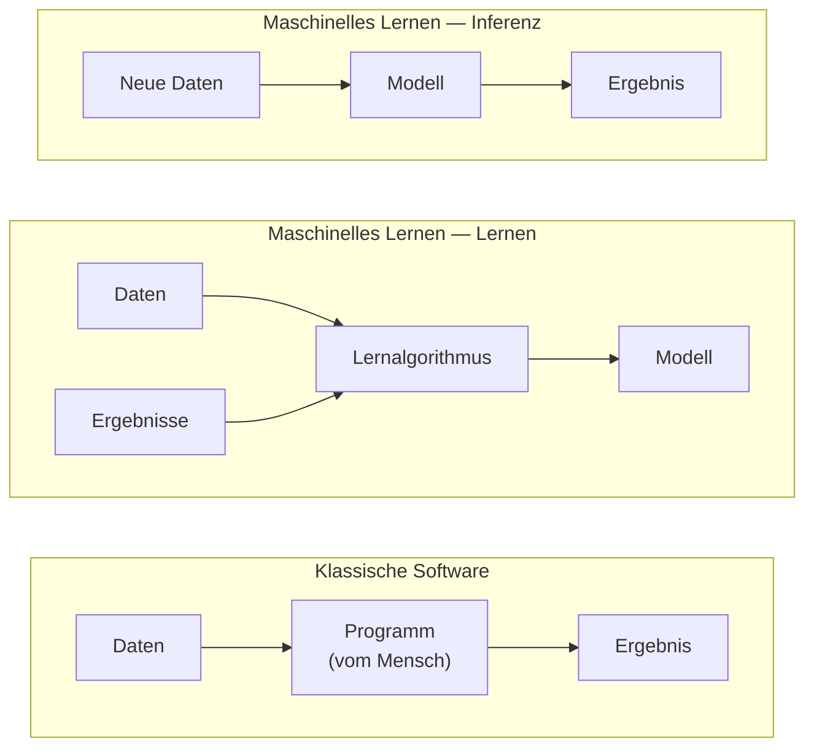

# Überblick & Grundbegriffe

**Folien:** [[data-science/resources/01_Grundbegriffe.pdf|01_Grundbegriffe.pdf]]

---

## 1. Was ist Data Science?

### Definition

- **Ziel:** Extraktion von Wissen aus Daten
- Data Science liegt im Schnitt von **Mathematik/Statistik**, **Informatik** und **Fachwissen** (Domänenwissen)

### Verwandte Begriffe

Maschinelles Lernen, Künstliche Intelligenz, Data Engineering, Klassifizierung, Regression, Clustering

### Anwendungsbeispiele

- **Suchmaschinen:** Strukturierte Informationen aus dem Web extrahieren (z.B. Google Knowledge Graph)
- **Empfehlungssysteme:** Produktvorschläge basierend auf Browserverlauf (z.B. Amazon)
- **Generative KI:** Textgenerierung (ChatGPT), Bildgenerierung
- **Brain-Computer Interfaces:** Steuerung eines Spiels durch echte und *vorgestellte* Bewegungen (Motor Imagery)

---

## Data Science Pipeline

Die typische Pipeline besteht aus vier Schritten:

| Schritt | Beschreibung |
|---|---|
| **Datenbeschaffung / -aufbereitung** | Daten sammeln, bereinigen, transformieren (ETL) |
| **Explorative Analyse (EDA)** | Visualisierung, deskriptive Statistik, Hypothesentests |
| **Feature Engineering** | Merkmale finden, die die Daten gut beschreiben |
| **Modellierung & Prädiktion** | Modelle trainieren und Vorhersagen treffen |

### Rollen

| Data Scientist | Data Engineer |
|---|---|
| Analysieren, visualisieren, interpretieren, modellieren, Zusammenhänge erkennen | Daten sammeln, speichern, bereinigen, zusammenführen, bereitstellen (ETL) |
| → Erkenntnisse & Vorhersagen | → IT-Infrastruktur & Daten-Schnittstellen |

---

## Datenbeschaffung und -aufbereitung

- **Quellen:** Oft unstrukturiert und heterogen — Dateien, Datenbanken, APIs, Webservices, Webscraping, öffentliche Datensätze
- **Bereinigung/Transformation:** Anonymisierung, Fehlerbeseitigung, Duplikate entfernen, fehlende Werte behandeln, Formatumwandlung
- Typisch: Kette von Arbeitsschritten (Pipelines), domänenspezifisch
- **Tools:** SQL, NoSQL, Python (NumPy, Pandas), APIs, Web Scraping

---

## Explorative Analyse (EDA)

- Visualisierung, Deskriptive Statistik, Statistisches Testen, Schätzer, Clustering
- **Zyklischer Prozess:** Beobachten → Fragen/Hypothesen entwickeln → Hypothesen mit Daten testen → Beobachten → ...

- **Tools:** Python, R, MATLAB

**Beispiel:** Pflanzenwachstum und Temperatur
- Hypothese: $H_0$: $Corr(\text{Wachstum}, \text{Temperatur}) > 0.5$
- $H_0$ wird verworfen → hohe Temperaturen schaden den Pflanzen
- Neue Vermutung: Es gibt eine optimale Temperatur → erneut testen

---

## Feature Engineering

- **Features** = Merkmale der Daten
- **Feature Engineering** = Prozess, Features zu finden, die die Daten gut beschreiben (bezogen auf die Fragestellung)
- Nutzt Erkenntnisse aus explorativer Analyse und Domänenexpertise
- Features sind nicht zwangsläufig Zusammenfassungen — auch die **Darstellung/Repräsentation** der Daten spielt eine Rolle
- **Tools:** Statistik, Python (NumPy, Pandas)

**Beispiel (MNIST Datensatz):**
- 60.000 handgeschriebene Ziffern, 28×28 Pixel
- Feature $x_1$ (Schwärze): $x_1 = \sum_{i=1}^{28} \sum_{j=1}^{28} p_{i,j}$
- Feature $x_2$ (Asymmetrie): $x_2 = \sum_{i=1}^{28} \sum_{j=1}^{28} |p_{i,j} - p_{-i,j}|$

**Beispiel (Gerade/Ungerade):**
- Gesucht: $f: \mathbb{N} \to \{0,1\}$ mit $f(k) = 0$ falls $k$ gerade, $1$ falls ungerade
- Lösung 1: $f(k) = \frac{\cos(\pi k) + 1}{2}$
- Lösung 2: Konvertierung in Binärdarstellung → letzte Ziffer

---

## Modellierung

### Lernparadigmen

| Überwachtes Lernen (supervised) | Unüberwachtes Lernen (unsupervised) | Bestärkendes Lernen (reinforcement) |
|---|---|---|
| Gegeben: $(x_1, y_1), ..., (x_n, y_n)$ | Gegeben: $x_1, ..., x_n$ | Gegeben: $(s_1, a_1, r_1), ..., (s_n, a_n, r_n)$ |
| Gesucht: $f: X \to Y$ mit $f(x) \approx y$ | Gesucht: $f: X \to ?$ | Gesucht: $\pi: S \times A \to [0, 1]$ |
| Klassifizierung, Regression | Clustering, Dimensionsreduktion, Ausreißerdetektion | Roboter, Computerspiele |

### Überwachtes Lernen — Modelltypen

- **Lineare Modelle:** Lineare Regression, Logistische Regression, LASSO, Ridge, ElasticNet
- **Baumbasierte Modelle:** Entscheidungsbäume, Random Forests
- **Nächste Nachbarn:** k-nearest neighbors, Kernregression
- **Neuronale Netze:** MLP, CNN, RNN, LSTM, SNN, Transformer, KAN

### MNIST-Modellierungsbeispiel

- Modell: $f(x_1) = m \cdot x_1 + c$ mit Parametern $m, c$
- Entscheidungsregel: Ziffer = 1 falls $x_2 < f(x_1)$, sonst Ziffer = 5
- Frage: Wie wählt man $m$ und $c$ optimal?

---

## Beispiel: BCI-Workflow (Brain-Computer Interface)

Vollständiger Workflow am Beispiel EEG-basierter Spielsteuerung:

**Aufnahme → Datenspeicherung → EDA → Feature Engineering & Modellierung → Modellspeicherung → (live) Inferenz**

### Datenbeschaffung: EEG

- **Elektroenzephalografie** — misst elektrische Aktivität auf der Kopfhaut
- Tragbar, nicht-invasiv, ab ca. 300€
- Elektrodentypen: Gelelektroden, Trockenelektroden

### EDA: Rauschanalyse

- **50 Hz Rauschen** (Stromnetz)
- **Langzeit-Drift** (Elektrodenbewegung)
- **Peaks** (Artefakte, z.B. Augenbewegungen)

### Feature Engineering: Bandpass-Filter

- Signal in Schwingungen unterschiedlicher Frequenzen zerlegen
- Relevante Frequenzen herausfiltern (häufig 5–40 Hz)
- Entfernt Netzrauschen und Drift

### Modellierung

- Manuelle Features: Aktivität in bestimmten Frequenzbändern
- Automatische Features: z.B. neuronale Netze
- Einfacher Ansatz: Augenbewegungen erkennen durch Abstand zwischen Beobachtung und Trend

---

## Neue Rolle: Data Scientist

- Neben dem **Programmierer** (schreibt Anweisungen) tritt der **Data Scientist** (zeigt mittels Datensätzen, was der Computer tun soll)
- Aufgaben: Datensätze erschließen/kuratieren, Bias untersuchen, Daten bereinigen, Modelle erstellen und verstehen

### Klassische Software vs. Maschinelles Lernen

| | Klassische Software | Maschinelles Lernen |
|---|---|---|
| **Lernen** | — | Daten + Ergebnis → Programm |
| **Inferenz** | Daten + Programm → Ergebnis | Daten + Programm → Ergebnis |

> *"Our relationship to computers has changed. Instead of programming them, we now show them [what to do]."* — Geoffrey Hinton

---

## 2. Organisatorisches

### Inhalte des Semesters

1. Überblick & Grundbegriffe
2. Einführung in Python (NumPy und Pandas)
3. Eindimensionale EDA und Visualisierungen
4. Visualisierungen und mehrdimensionale EDA
5. Mehrdimensionale EDA
6. Dimensionsreduktion: PCA
7. Dimensionsreduktion: MDS, Isomap
8. Clustering: Algorithmen
9. Clustering: Validierung
10. Probeklausur
11. Feature Engineering, datengetriebene Modelle
12. Datengetriebene Modelle
13. Zeitreihen

### Lernziele

- Data Science Projekte selbstständig durchführen
- Methoden zur Erschließung und Aufbereitung von Daten sowie zur explorativen Analyse und Modellierung anwenden
- Ergebnisse diskutieren und beurteilen
- Hypothesengetriebene Entscheidungen treffen

### Ablauf

- **Vorlesung:** 12:30–14:00 (2 SWS)
- **Übung:** 14:00–15:30 (2 SWS) — Vertiefung, Gruppenarbeit
- **Prüfung:** Elektronische Klausur, 75 min (Termin wird bekannt gegeben)
- **Aufwand:** 5 ECTS = 150 Zeitstunden (45h Präsenz + 105h Eigenarbeit)
- **Kontakt:** f.heinrichs@fh-aachen.de (bevorzugt Präsenzzeit)

---

## Fragen zur Selbstkontrolle

**Quelle:** [[data-science/selbstkontrolle/selbstkontrolle-01|Selbstkontrolle 01]]

**Was ist das (abstrakte) Ziel von Data Science?**
Extraktion von Wissen aus Daten.

**Im Schnitt welcher drei Gebiete befindet sich Data Science?**
Mathematik/Statistik, Informatik und Fachwissen (Domänenwissen).

**Aus welchen Schritten besteht eine "typische" Data Science Pipeline?**
1. Datenbeschaffung/-aufbereitung → 2. Explorative Analyse (EDA) → 3. Feature Engineering → 4. Modellierung & Prädiktion.

**Was ist ein typischer Schritt der Datenbeschaffung/-aufbereitung?**
Daten aus heterogenen Quellen sammeln (APIs, Datenbanken, Webscraping), bereinigen (Fehler, Duplikate, fehlende Werte entfernen), anonymisieren und in ein geeignetes Format transformieren (ETL-Prozess).

**Was ist ein typischer Schritt der explorativen Datenanalyse?**
Daten visualisieren, deskriptive Statistiken berechnen, Hypothesen aufstellen und mit statistischen Tests prüfen. Zyklischer Prozess: Beobachten → Hypothesen entwickeln → Testen → erneut beobachten.

**Was ist ein typischer Schritt des Feature Engineerings?**
Merkmale (Features) identifizieren oder konstruieren, die die Daten bezogen auf die Fragestellung gut beschreiben — z.B. beim MNIST-Datensatz Schwärze und Asymmetrie als Features berechnen. Nutzt Erkenntnisse aus der EDA und Domänenexpertise.

**Was ist ein typischer Schritt der Modellierung?**
Ein Modell wählen (z.B. lineare Regression, Entscheidungsbaum, neuronales Netz), Parameter aus Trainingsdaten lernen und Vorhersagen treffen.

**Wie unterscheiden sich Data Scientist und Data Engineer?**
Der Data Engineer kümmert sich um IT-Infrastruktur, Datenspeicherung und -bereitstellung (ETL). Der Data Scientist analysiert, visualisiert, modelliert die Daten und extrahiert daraus Erkenntnisse und Vorhersagen.

**Ist die explorative Datenanalyse ein linearer Prozess? Und die Data Science Pipeline?**
Die EDA ist ein zyklischer Prozess (Beobachten → Hypothesen → Testen → Beobachten). Auch die gesamte Pipeline ist nicht streng linear — Erkenntnisse aus späteren Schritten können Rücksprünge zu früheren Schritten erfordern.

**Was ist der Unterschied zwischen klassischer Software und maschinellem Lernen?**
Klassische Software: Programmierer schreibt Regeln, Computer wendet sie auf Daten an → Ergebnis. Maschinelles Lernen: Computer erhält Daten + Ergebnisse und lernt daraus ein Programm (Modell), das dann auf neue Daten angewendet wird (Inferenz).
