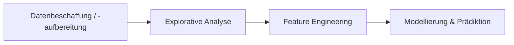

# 02 — Python

**Folien:** [[data-science/resources/02_Python.pdf|02_Python.pdf]]


## Inhaltsverzeichnis

- [[#1. Wiederholung — Data Science Pipeline|1. Wiederholung — Data Science Pipeline]]
- [[#2. Literatur|2. Literatur]]
- [[#3. Python — Überblick|3. Python — Überblick]]
- [[#Übungen|Übungen]]
- [[#Ressourcen|Ressourcen]]
- [[#Fragen zur Selbstkontrolle|Fragen zur Selbstkontrolle]]

---

## 1. Wiederholung — Data Science Pipeline



Beispiel BCI (Brain-Computer Interface): Aufnahme → Datenspeicherung → EDA → Feature Engineering & Modellierung → Modellspeicherung → (live) Inferenz

## 2. Literatur

| Buch | Autoren | Schwerpunkt |
|------|---------|-------------|
| **Python Data Science Handbook** | Jake VanderPlas | Anwendungsorientiert; NumPy, Pandas, matplotlib, scikit-learn |
| **The Elements of Statistical Learning** | Hastie, Tibshirani, Friedman | Mathematische Grundlagen, maschinelles Lernen (2009) |
| **Deep Learning** | Goodfellow, Bengio, Courville | Neuronale Netze, mathematische Grundlagen (2016) |

**Tutorials:** Kaggle, Coursera (Machine Learning), Caltech (Machine Learning), Scikit-Learn Dokumentation

## 3. Python — Überblick

- Einfache Syntax — Blöcke durch Einrückung (keine `{}` oder `()`)
- Effiziente Entwicklung, hohe Produktivität
- Interpretiert (nicht kompiliert)
- Garbage Collection
- Dynamische Typisierung
- Open Source — ~755.471 Pakete (Stand 03/2026)

### Entwicklungsumgebungen

**PyCharm (IDE):**
- Code-Vervollständigung und -Analyse (Type Hints, Style Violations)
- Code-Navigation, Projektverwaltung, virtuelle Umgebungen
- Integrierte Versionskontrolle, Debugger
- Professional kostenlos für Studierende

**Jupyter Notebooks:**
- Mischung aus Python-Code und Markdown-Zellen (Text, LaTeX, Bilder)
- Interaktive Berechnungen (zellenweise, Echtzeit-Rückmeldung)
- Gut geeignet für explorative Datenanalyse (Daten einmal im RAM, einfache Visualisierung)
- **Klausur voraussichtlich in Jupyter-Lab**

## 3.1 Grundlegende Syntax

Siehe Jupyter Notebook `topic02_python/basics.ipynb`

Built-in Funktionen:

| Kategorie | Beispiele |
|-----------|-----------|
| Typprüfung | `type("Hello")` → `str`, `isinstance("Hello", str)` → `True` |
| Konvertierung | `int("123")` → `123`, `str(123)` → `'123'`, `bool(1)` → `True` |
| Listen-Methoden | `len(x)`, `x.append(4)`, `x.extend([5, 6, 7])` |

## 3.2 Wichtige Strukturen — Dictionaries

- Nützlich zum Speichern von (unstrukturierten) Informationen
- Ähnlich dem JSON-Format

```python
x = {'german': 'Hallo', 'english': 'Hello', 'spanish': 'Hola'}

x['german']              # 'Hallo'
x['catalan']             # KeyError: 'catalan'
x.get('german', 'Hey')   # 'Hallo'
x.get('catalan', 'Hey')  # 'Hey'
x.keys()                 # ['german', 'english', 'spanish']
x.values()               # ['Hallo', 'Hello', 'Hola']
x.items()                # [('german', 'Hallo'), ('english', 'Hello'), ('spanish', 'Hola')]
```

## 3.3 Wichtige Strukturen — Funktionen

- Input: arguments (args) und keyword arguments (kwargs)
- Output: return value (Standard: `None`)
- Funktionsblock durch Einrückung gekennzeichnet
- Können als Wert einer Variablen zugewiesen werden

```python
def summation(a: int, b: int, c: int = 0) -> int:
    """Sums two (or three) integers."""
    return a + b + c

if __name__ == '__main__':
    sum1 = summation(5, 6)
    sum2 = summation(5, 6, c=7)
    print(f"{sum1=}, {sum2=}")
    # >>> sum1=11, sum2=18
```

**Lambda-Ausdrücke** (anonyme Funktionen):

```python
function2 = lambda a, b: a + b
sum1 = function2(5, 6)  # 11
```

## 3.4 Wichtige Strukturen — Klassen

Klassendefinitionen können enthalten:
- **Klassenattribute** (auf Klassenebene definiert, z.B. `version = "1.0.0"`)
- **Instanzattribute** (in `__init__` definiert, z.B. `self.height`)
- **Methoden** (mit `self` als erstem Parameter)
- **Statische Methoden** (mit `@staticmethod`, ohne `self`)

```python
class Rectangle:
    version = "1.0.0"  # Klassenattribut

    def __init__(self, height, width):
        self.height = height   # Instanzattribut
        self.width = width

    def area(self):            # Methode
        return self.height * self.width

    @staticmethod
    def get_description():     # Statische Methode
        return "The area of a rectangle is the product of its height and width"
```

### Vererbung

- Keine Interfaces in Python — stattdessen **abstract base classes** (ABC)
- Klassen, die von ABC erben, müssen alle abstrakten Methoden implementieren
- Methoden der Elternklasse überschreiben durch Neudefinition in der Kindklasse
- `super()` zum Aufrufen der Elternklasse

```python
from abc import ABC, abstractmethod

class Shape(ABC):
    @abstractmethod
    def area(self):
        pass

class Rectangle(Shape):
    def __init__(self, height, width):
        self.height = height
        self.width = width

    def area(self):
        return self.height * self.width

class Square(Rectangle):
    def __init__(self, side_length):
        super().__init__(side_length, side_length)
```

## 3.5 Wichtige Strukturen — Module

- Ein Modul ist eine Python-Datei (`.py`) mit Definitionen und Anweisungen
- Module verwenden, um Code in verschiedene Dateien aufzuteilen
- Import mit `import`-Statement

```python
# rectangle.py
class Rectangle:
    def __init__(self, height, width):
        self.height = height
        self.width = width
    def area(self):
        return self.height * self.width

# square.py
from rectangle import Rectangle

class Square(Rectangle):
    def __init__(self, side_length):
        super().__init__(side_length, side_length)
```

Einzelne Definitionen mit `from ... import ...` importieren. **Bad practice:** Wildcards wie `from rectangle import *`.

## 3.6 Wichtige Strukturen — Pakete

- In größeren Projekten mehrere Module zu Paketen zusammenfassen
- Ein Paket ist ein Ordner mit `__init__.py`-Datei
- Definitionen in `__init__.py` importieren macht sie direkt zugänglich

```
project/
├── __init__.py
├── colored_shape.py
├── shapes/
│   ├── __init__.py
│   ├── shape.py
│   ├── rectangle.py
│   └── square.py
└── colors/
    ├── __init__.py
    ├── red.py
    ├── green.py
    └── blue.py
```

### Wichtige externe Pakete für Data Science

| Paket | Zweck |
|-------|-------|
| **NumPy** | Effiziente numerische Berechnungen |
| **SciPy** | Wissenschaftliche Berechnungen (basierend auf NumPy) |
| **Pandas** | Datenmanipulation und -analyse |
| **Matplotlib** | Statische, animierte und interaktive Diagramme |
| **Scikit-learn** | Maschinelles Lernen |
| **TensorFlow** | Tiefes Lernen (Google) |
| **PyTorch** | Tiefes Lernen (Meta) |
| **XGBoost** | Skalierbares und genaues Gradient Boosting |

```python
import numpy as np
import matplotlib.pyplot as plt

if __name__ == '__main__':
    x = np.linspace(0, 2 * np.pi, 101)
    y = np.sin(x)
    z = np.cos(x)
    plt.plot(x, y)
    plt.plot(x, z)
    plt.show()
```

## 3.7 Code-Lesbarkeit verbessern

- **Type Hints** — Typen für Parameter und Rückgabewerte angeben
- **Docstrings** — Funktionsbeschreibungen mit `:param` und `:return`
- **Zeilenumbrüche** — Code übersichtlich strukturieren

```python
import math

class Circle:
    def __init__(self, radius: float):
        """Initialize new circle of specified radius.
        :param radius: Radius of circle as float.
        """
        self.radius = radius

    def area(self) -> float:
        """Return area of circle."""
        return math.pi * self.radius ** 2

def get_radius(area: float) -> float:
    """Function to display the area of a given shape.
    :param area: Area of circle as float.
    :return: Radius of circle as float
    """
    return math.sqrt(area / math.pi)
```

## Übungen

### Übung 1 (`topic02_python/exercise1.py`)
1. "Hello, World!" ausgeben
2. Liste der Quadrate von 1 bis 10 erzeugen
3. Summe der geraden Zahlen zwischen 1 und 50 berechnen (`sum()`)
4. Dreiecksmuster mit `*` ausgeben (n Zeilen)
5. Fakultät einer gegebenen Zahl berechnen

### Übung 2 (`topic02_python/exercise2.py`)
1. `calculator(a: int, b: int, operator: str) -> float` — Taschenrechner für `+`, `-`, `*`, `/`
2. `average_grade(grades: dict) -> float` — Durchschnittsnote aus Dictionary berechnen

### Übung 3 (`topic02_python/exercise3.py`)
1. Klasse `BankAccount` mit Name, Saldo, Einzahlen/Abheben (Saldo darf nicht negativ werden)
2. Klasse `Student` mit Name, Alter, Noten (als Dictionary); Methode zum Hinzufügen von Noten

### Übung 4 — Pakete (`topic02_python/package_exercise`)
Filmdatenbank entwickeln:
1. `movie.py` — Klasse `Movie` (Titel, Jahr, Genre) mit Anzeige-Methode
2. `catalog.py` — Klasse `Catalog` (Liste von Filmen) mit Hinzufügen/Anzeigen
3. `main.py` — Instanzen erstellen, Katalog befüllen, anzeigen

## Ressourcen

- Offizielle Website: python.org
- Dokumentation: docs.python.org/3/
- Beginner's Guide: wiki.python.org/moin/BeginnersGuide
- Tutorials: python.org, Kaggle, W3 Schools

---

## Fragen zur Selbstkontrolle

**Quelle:** [[data-science/selbstkontrolle/ds-selbstkontrolle-02|Selbstkontrolle 02 — Python]]

**1. Wie werden Codeblöcke in Python gekennzeichnet?**
Durch Einrückung (Indentation). Es gibt keine geschweiften Klammern `{}` wie in anderen Sprachen.

**2. Welche Vorteile hat Python?**
Einfache Syntax, effiziente Entwicklung, interpretiert, Garbage Collection, dynamische Typisierung, Open Source mit riesigem Paket-Ökosystem (~755.000 Pakete).

**3. Wie kann man Python-Code lesbar machen?**
Durch Type Hints (Typangaben für Parameter/Rückgabewerte), Docstrings (Dokumentation mit `:param`/`:return`) und sinnvolle Zeilenumbrüche.

**4. Was ist der Unterschied zwischen einer Liste und einem Tupel in Python?**
Eine Liste (`[1, 2, 3]`) ist veränderbar (mutable), ein Tupel (`(1, 2, 3)`) ist unveränderbar (immutable).

**5. Welche zwei Arten von Argumenten gibt es für Funktionen?**
Arguments (positionale Argumente) und Keyword Arguments (kwargs, benannte Argumente mit Standardwert, z.B. `c: int = 0`).

**6. Was ist der Unterschied zwischen Klassenattributen und Instanzattributen?**
Klassenattribute werden auf Klassenebene definiert (z.B. `version = "1.0.0"`) und gelten für alle Instanzen. Instanzattribute werden in `__init__` mit `self.` definiert und sind spezifisch für jede Instanz.

**7. Was ist die Verwendung von ABC (abstract base class) in Python?**
ABCs ersetzen Interfaces in Python. Klassen, die von ABC erben, müssen alle mit `@abstractmethod` markierten Methoden implementieren — so wird eine einheitliche Schnittstelle erzwungen.

**8. Was ist ein Python-Modul?**
Eine Python-Datei (`.py`), die Definitionen (Klassen, Funktionen, Variablen) und Anweisungen enthält.

**9. Warum verwenden wir Module und Pakete?**
Um Code in verschiedene Dateien aufzuteilen, ihn sauber und übersichtlich zu halten und Wiederverwendbarkeit zu ermöglichen.

**10. Wird Python-Code kompiliert oder interpretiert?**
Python wird interpretiert, nicht kompiliert.

**11. Sind Type Hints notwendig?**
Nein, sie sind optional (Python ist dynamisch typisiert), aber sie verbessern die Lesbarkeit und ermöglichen statische Code-Analyse.

**12. Was sind Dictionaries in Python?**
Datenstrukturen zum Speichern von Key-Value-Paaren, ähnlich dem JSON-Format. Zugriff über Keys, Methoden: `keys()`, `values()`, `items()`, `get()`.

**13. Was ist in Python der Unterschied zwischen [1, 2, 3], (1, 2, 3) und {1, 2, 3}?**
`[1, 2, 3]` ist eine Liste (mutable, geordnet), `(1, 2, 3)` ist ein Tupel (immutable, geordnet), `{1, 2, 3}` ist ein Set (mutable, ungeordnet, keine Duplikate).

**14. Wofür wird der Lambda-Operator verwendet?**
Zum Erstellen anonymer Funktionen (Einzeiler), z.B. `lambda a, b: a + b`. Kann als Wert einer Variablen zugewiesen werden.

**15. Was ist der Unterschied zwischen einer Methode und einer statischen Methode in einer Python-Klasse?**
Eine Methode hat `self` als ersten Parameter und kann auf Instanzattribute zugreifen. Eine statische Methode (mit `@staticmethod`) hat keinen `self`-Parameter und kann nicht auf Instanzattribute zugreifen.

**16. Was ist ein Python-Paket?**
Ein Ordner, der eine `__init__.py`-Datei enthält und mehrere Module zusammenfasst. Ermöglicht hierarchische Strukturierung von Code.

**17. Wie können Module in Python importiert werden?**
Mit `import module_name` (gesamtes Modul importieren).

**18. Wie kann eine einzelne Definition in Python importiert werden?**
Mit `from module_name import DefinitionName`. Bad practice: Wildcards wie `from module import *`.
