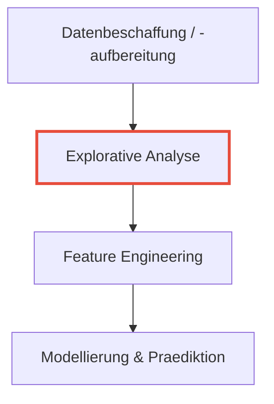
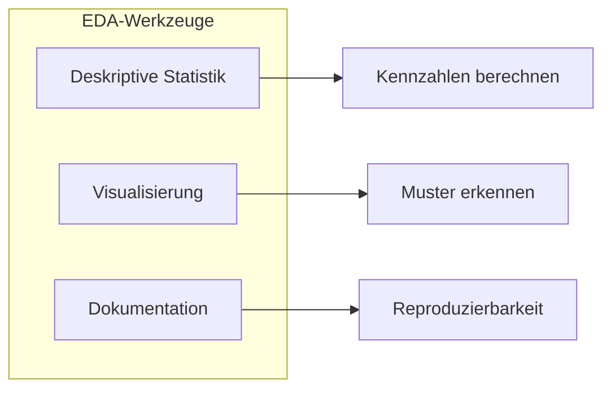
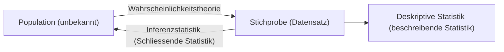
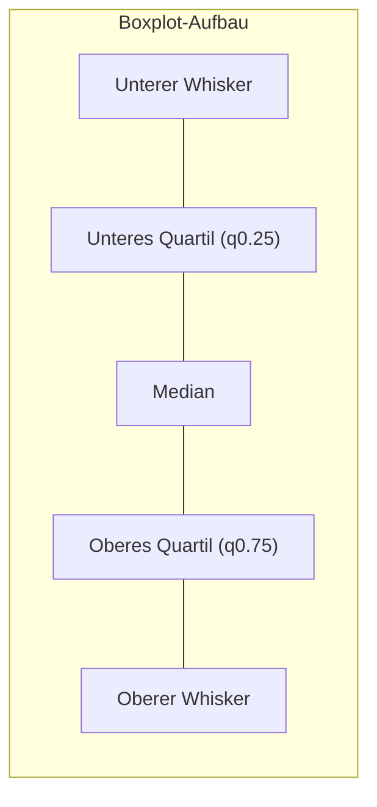

# 03 — Eindimensionale EDA und Visualisierungen

**Folien:** [[data-science/resources/03_Univariate_EDA.pdf|03_Univariate_EDA.pdf]]
**Selbstkontrolle:** [[data-science/selbstkontrolle/ds-selbstkontrolle-03|Selbstkontrolle 03]]

## Inhaltsverzeichnis

- [[#Wiederholung|Wiederholung]]
- [[#Explorative Datenanalyse (EDA)|Explorative Datenanalyse (EDA)]]
- [[#Deskriptive Statistik|Deskriptive Statistik]]
- [[#Quantile und 5 Number Summary|Quantile und 5 Number Summary]]
- [[#Boxplot|Boxplot]]
- [[#Histogramm|Histogramm]]
- [[#Anscombes Quartett|Anscombes Quartett]]
- [[#Visualisierung|Visualisierung]]
- [[#Regeln nach Edward Tufte|Regeln nach Edward Tufte]]
- [[#Fragen zur Selbstkontrolle|Fragen zur Selbstkontrolle]]

---

## Wiederholung

Der Data-Science-Prozess am Beispiel BCI (Brain-Computer Interface):

Die explorative Analyse ist der aktuelle Fokus im Kurs.

## Explorative Datenanalyse (EDA)

- Basiert auf Arbeiten der Statistiker an den **Bell Laboratories** (1960er Jahre)
- Begriff stammt von **John W. Tukey** (1915–2000, amerikanischer Statistiker)
- Kernfrage: *"Was koennen die Daten uns erzaehlen?"* — daten-getriebenes Arbeiten ergaenzt hypothesen-getriebenes Arbeiten
- Einfuehrung von Techniken wie **5-Number-Summary** und **Boxplots**

### Ziele der EDA

1. **Identifikation von Problemen** im Datensatz
2. **Einschaetzung zu Annahmen** in Daten
3. **Auswahl von passenden statistischen Methoden**
4. **Hypothesen ueber Daten bilden**

### Typische Werkzeuge

- Deskriptive Statistik
- Visualisierung
- **Dokumentation des Erkenntniswegs** (!!!)
  - Steuerung der eigenen Analysen
  - Kommunikation und Diskussion der Ergebnisse mit Dritten
  - Sicherung der Reproduzierbarkeit

Dokumentationsformen: Jupyter Notebooks (Data Science), PowerPoint (Industrie/Beratung), kommentierter Code.

## Deskriptive Statistik

**Deskriptive Statistik** beschreibt die Stichprobe; **Inferenzstatistik** schliesst von der Stichprobe auf die Population.

### Kennzahlen (Summary Statistics)

Beschreiben eine Stichprobe (Haeufigkeitsverteilung) in wenigen Zahlen:

| Typ | Verwendung | Beispiele |
|-----|-----------|-----------|
| **Lagemass** | Beschreibt die Lage einer Stichprobe. Verschiebt man alle Werte um $c$, verschiebt sich auch das Lagemass um $c$: $f(x_1+c, \ldots, x_n+c) = f(x_1, \ldots, x_n) + c$ | Mittelwert, Median, Modus, Quantile |
| **Streumass** | Beschreibt die Streuung einer Stichprobe. Veraendert sich bei Verschiebung **nicht**: $f(x_1+c, \ldots, x_n+c) = f(x_1, \ldots, x_n)$ | Varianz, Standardabweichung, Interquartilsabstand (IQR) |

### Weitere Kennzahlen

- **Arithmetisches Mittel:** $\bar{x}_n = \frac{1}{n} \sum_{i=1}^{n} x_i$
- **Empirische Varianz:** $\sigma^2 = \frac{1}{n-1} \sum_{i=1}^{n} (x_i - \bar{x}_n)^2$
- **Empirische Standardabweichung:** $\sigma = \sqrt{\sigma^2}$

> [!warning] Achtung
> Mittelwert und Varianz sind bei **multimodalen Verteilungen** wenig aussagekraeftig! Eine unimodale Verteilung hat einen klaren Gipfel, eine multimodale hat mehrere — gleiche Kennzahlen koennen voellig verschiedene Verteilungen beschreiben.

## Quantile und 5 Number Summary

### Empirisches p-Quantil

Sei $x_1, \ldots, x_n$ eine Stichprobe der Groesse $n$. Die **Ordnungsstatistik** ist die Sortierung: $x_{(1)} \leq x_{(2)} \leq \cdots \leq x_{(n)}$.

Fuer $p \in (0, 1)$ heisst:

$$q_p = \begin{cases} \frac{1}{2}(x_{(n \cdot p)} + x_{(n \cdot p + 1)}), & \text{falls } n \cdot p \in \mathbb{N} \\ x_{(\lfloor n \cdot p + 1 \rfloor)}, & \text{falls } n \cdot p \notin \mathbb{N} \end{cases}$$

das **(empirische) p-Quantil** der Stichprobe.

**Notation:** $\lfloor x \rfloor$ ist die Abrundungsfunktion, z.B. $\lfloor 5.6 \rfloor = 5$.

### Spezielle Quantile

- **Median:** $q_{0.5}$ (50%-Quantil)
- **Unteres Quartil:** $q_{0.25}$ (25%-Quantil)
- **Oberes Quartil:** $q_{0.75}$ (75%-Quantil)

**Eigenschaft:** $n \cdot p$ Beobachtungen sind $\leq q_p$ und $n(1-p)$ Beobachtungen sind $\geq q_p$.

### Beispiel: Quantilberechnung

Stichprobe: 68, 95, 2, 33, 86, 58, 64 ($n = 7$)

Ordnungsstatistik: 2, 33, 58, 64, 68, 86, 95

- **Median:** $0.5 \cdot 7 = 3.5 \notin \mathbb{N}$ $\Rightarrow q_{0.5} = x_{(\lfloor 3.5+1 \rfloor)} = x_{(4)} = 64$
- **Unteres Quartil:** $0.25 \cdot 7 = 1.75 \notin \mathbb{N}$ $\Rightarrow q_{0.25} = x_{(\lfloor 1.75+1 \rfloor)} = x_{(2)} = 33$
- **Oberes Quartil:** $0.75 \cdot 7 = 5.25 \notin \mathbb{N}$ $\Rightarrow q_{0.75} = x_{(\lfloor 5.25+1 \rfloor)} = x_{(6)} = 86$

### 5 Number Summary (nach Tukey)

| Kennzahl | Beschreibung |
|----------|-------------|
| Minimum | Kleinster Wert |
| Unteres Quartil ($q_{0.25}$) | 25%-Quantil |
| Median ($q_{0.5}$) | 50%-Quantil |
| Oberes Quartil ($q_{0.75}$) | 75%-Quantil |
| Maximum | Groesster Wert |

**Beispiel (NHANES-Daten):**

| Merkmal | Min | 25% | Median | 75% | Max |
|---------|-----|-----|--------|-----|-----|
| Age | 241 | 418 | 584 | 748 | 959 |
| Weight | 32.4 | 67.2 | 78.8 | 92.6 | 218.2 |
| Height | 140 | 160 | 167 | 175 | 204 |

Auffaelligkeiten: Alter in Monaten (nicht Jahren), sehr grosse Spannweite bei Weight.

## Boxplot

Der **Boxplot** (nach J.W. Tukey) visualisiert die 5 Number Summary:

- **Box:** Vom unteren Quartil ($q_{0.25}$) bis zum oberen Quartil ($q_{0.75}$), enthalt 50% der Daten
- **Median:** Linie innerhalb der Box
- **Interquartilsabstand (IQR):** $IQR = q_{0.75} - q_{0.25}$
- **Whisker:** Reichen maximal $1.5 \cdot IQR$ ueber die Quartile hinaus (bis zum letzten Datenpunkt innerhalb dieser Grenze)
- **Ausreisser:** Punkte mit Abstand zum naechsten Quartil groesser als $1.5 \cdot IQR$ — werden als einzelne Punkte dargestellt

**Alternative Variante** (seltener): Whisker reichen bis zum Minimum bzw. Maximum (keine Ausreisser-Erkennung).

## Histogramm

- **Histogramm:** Graphische Darstellung der Verteilung einer Stichprobe durch Einteilen der Daten in Klassen (engl. *Bins*)
- **Wichtig:** Anzahl der Bins angemessen waehlen!
  - Zu wenige Bins: Verteilungsform geht verloren
  - Zu viele Bins: Verrauschtes Bild
  - Mehr Datenpunkte erlauben mehr Bins

## Anscombes Quartett

Vier Datensaetze mit **identischen Kennzahlen** (Mean, Varianz, Korrelation), aber voellig verschiedener Struktur:

| Kennzahl | Wert |
|----------|------|
| Mean x | 9.0 |
| Mean y | 7.5 |
| Var x | 10.0 |
| Var y | 3.75 |
| Korrelation | 0.816 |

Die Visualisierung zeigt: Set I ist linear, Set II ist quadratisch, Set III hat einen Ausreisser, Set IV hat einen extremen x-Wert.

> [!tip] Merke
> Kennzahlen allein reichen nicht, um einen Datensatz zu beschreiben — **Visualisierung ist essenziell!**

## Visualisierung

Visualisierung als EDA-Werkzeug:
- Erlaubt schnelle, visuelle Exploration von Mustern
- Hilfreiches Instrument zur Kommunikation von Ergebnissen

### Typische Fehler bei der Visualisierung

| Fehler | Beschreibung | Beispiel |
|--------|-------------|---------|
| **Achsenskalierung** | x-/y-Achsen koennen Trends dramatisieren oder entdramatisieren | Zeitreihen mit unterschiedlichem y-Bereich |
| **Logarithmische Skala** | Manipulative Skalierung erschwert Groessenvergleiche | Fakultaetsgroessen auf log-Skala suggerieren falsche Verhaeltnisse |
| **3D-Darstellung** | Ueberfluessige dritte Dimension verzerrt Wahrnehmung | 3D-Balkendiagramme, 3D-Tortendiagramme |
| **Tortendiagramme** | Schwer abzulesen bei vielen Kategorien | Pie Charts mit 15+ Segmenten |
| **Ungleiche Symbolgroessen** | Icons unterschiedlicher Groesse verfaelschen Verhaeltnisse | Frucht-Piktogramme verschiedener Groesse |
| **Achsenabschnitt** | Abgeschnittene Achsen uebertreiben Unterschiede | Balkendiagramm ohne Nullpunkt |
| **Spurious correlations** | Ueberlagern unzusammenhaengender Daten suggeriert Zusammenhang | Aktienkurse vs. Sonnenstrahlung |

### Bessere Alternativen

- Statt Tortendiagramm: **Horizontales Balkendiagramm** (sortiert)
- Statt 3D-Balken: **2D gestapeltes Balkendiagramm**
- Bei Groessenvergleichen: **Keine logarithmische Skala** verwenden
- Symbole gleich gross halten (Piktogramme)

## Regeln nach Edward Tufte

Edward Tufte (US-amerikanischer Informationswissenschaftler, Yale University):

1. **Maximieren Sie das Daten-Druckerschwaerze Verhaeltnis** — so wenig Druckerschwaerze fuer so viele Daten wie moeglich
2. **Minimieren Sie den Luegenfaktor**
3. **Minimieren Sie "Chartjunk"** — keine visuellen Spielereien; lassen Sie die Daten fuer sich sprechen
4. **Nutzen Sie angemessene Skalen; beschriften Sie Ihre Achsen**

### Ressourcen

- Matplotlib Dokumentation
- Seaborn Dokumentation
- Kaggle Tutorial: Data Visualization

## Fragen zur Selbstkontrolle

**Siehe:** [[data-science/selbstkontrolle/ds-selbstkontrolle-03|Selbstkontrolle 03]]

---
