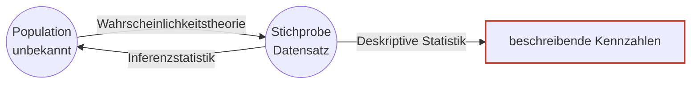
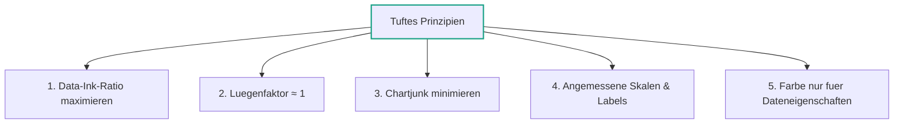
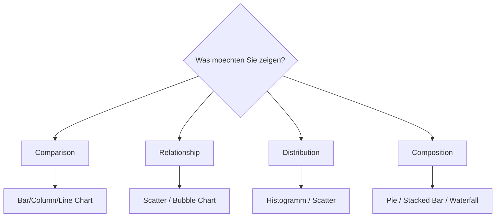
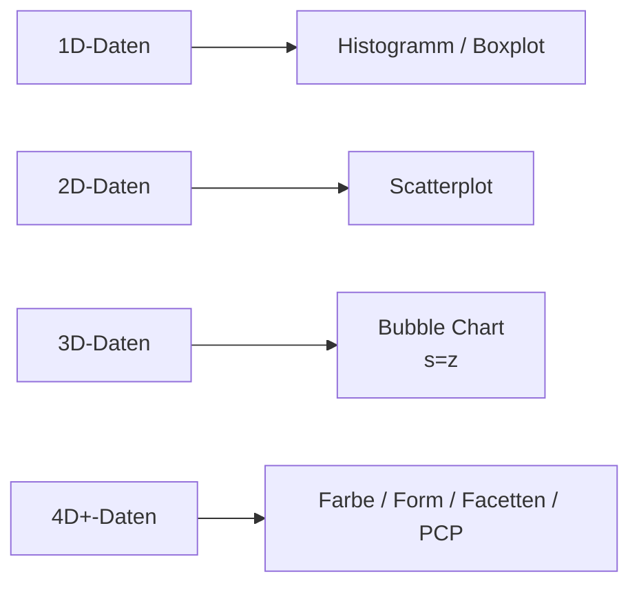
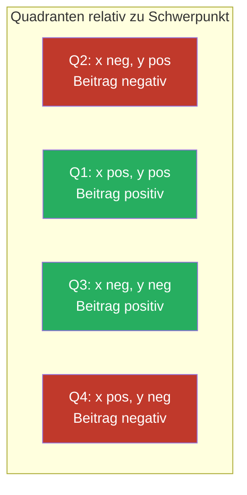

# 04 — Visualisierungen und mehrdimensionale EDA

**Folien:** [[data-science/resources/04_Visualisierungen.pdf|04_Visualisierungen.pdf]]
**Selbstkontrolle:** [[data-science/selbstkontrolle/ds-selbstkontrolle-04|Selbstkontrolle 04]]

## Inhaltsverzeichnis

- [[#Wiederholung|Wiederholung]]
- [[#Visualisierung nach Edward Tufte|Visualisierung nach Edward Tufte]]
- [[#Farbverlaeufe und Wahrnehmung|Farbverlaeufe und Wahrnehmung]]
- [[#Auswahl von Diagrammtypen|Auswahl von Diagrammtypen]]
- [[#Multivariate EDA|Multivariate EDA]]
- [[#Scatterplot und Bubble Chart|Scatterplot und Bubble Chart]]
- [[#Abhaengigkeitsmasse|Abhaengigkeitsmasse]]
- [[#Pearson Korrelationskoeffizient|Pearson Korrelationskoeffizient]]
- [[#Fragen zur Selbstkontrolle|Fragen zur Selbstkontrolle]]

---

## Wiederholung

### Ziele der EDA

1. Identifikation von Problemen im Datensatz
2. Einschaetzung zu Annahmen in Daten
3. Auswahl passender statistischer Methoden
4. Hypothesen ueber Daten bilden

### Typische Werkzeuge

- Deskriptive Statistik
- Visualisierung
- Dokumentation des Erkenntniswegs (Jupyter Notebooks, PowerPoint, kommentierter Code)

### Population, Stichprobe und Statistik



### 5 Number Summary

Minimum, unteres Quartil, Median, oberes Quartil, Maximum — visualisiert im **Boxplot** mit Whiskern und Ausreissern.

> [!warning] Achtung
> Summary Statistics sind hilfreich, aber **unterschiedliche Daten koennen identische Kennzahlen haben** (z.B. "Data Saurus", Anscombes Quartett). Visualisierungen sind unverzichtbar.

---

## Visualisierung nach Edward Tufte

**Edward Tufte** (US-amerikanischer Statistiker, bis 2004 Yale) — Pionier im Bereich Datenvisualisierung.

Bekannte Werke:
- *Beautiful Evidence* (2006)
- *PowerPoint is Evil* (2003)
- *Envisioning Information* (2001)
- *Visual Explanations* (1997)

### Prinzipien guter Visualisierung

#### 1. Daten-Druckerschwaerze-Verhaeltnis maximieren

> [!quote] Definition
> $$q = \frac{\text{Tintenmenge fuer die Darstellung von Daten}}{\text{Tinte der gesamten Abbildung}}$$

Auf Deutsch: Nur so viel Tinte wie noetig, so wenig wie moeglich. 3D-Effekte, Schmuck-Rahmen und uebermaessige Gitterlinien reduzieren $q$ und sollten entfallen.

#### 2. Luegenfaktor minimieren

> [!quote] Definition
> $$\ell = \frac{\text{Groesse eines Effekts in der Abbildung}}{\text{Groesse eines Effekts in den Daten}}$$

Auf Deutsch: Leiten Sie Ihr Publikum nicht fehl. $\ell$ sollte moeglichst nahe bei 1 liegen.

> [!warning] Achtung — Bad Practices
> - Mittelwerte ohne Standardabweichung
> - Interpolierte Werte ohne tatsaechliche Datenpunkte
> - Seitenverhaeltnis manipulieren, um Daten zu dramatisieren
> - Koordinatenursprung nicht zeigen (**Standard in matplotlib!**)
> - Achsen nicht oder irrefuehrend beschriften
> - Logarithmische Skala bei Verhaeltnis-Vergleichen (z.B. Frauenanteil)

#### 3. Chartjunk minimieren

> [!quote] Definition
> *Chartjunk*: Visuelle Elemente in Abbildungen, die unnoetig sind oder das Verstaendnis erschweren.

#### 4. Angemessene Skalen und Beschriftungen

#### 5. Farbe zum Darstellen — nicht fuer kuenstlerische Aussage

> [!info] Hinweis
> Vertiefendes Paper: N.P. Rougier et al. *Ten Simple Rules for Better Figures* (PLOS Comput. Biol. 10, e1003833, 2014).

### Tufte-Prinzipien im Ueberblick



---

## Farbverlaeufe und Wahrnehmung

### Was wir wollen

Gleiche Unterschiede in den Daten sollen gleichen wahrgenommenen Farbunterschieden entsprechen.


Der Pfad Monitor → Photonen → Auge → Gehirn ist das Modell $f$ der menschlichen Farbwahrnehmung. Wir wollen $df/dx \approx \text{const}$.

### Jet vs. Viridis

> [!warning] Achtung — Farbverlauf "Jet"
> - Kompliziertes Leuchtdichteprofil → in Graustufen kaum interpretierbar
> - Betont vermeintliche Eigenschaften der Daten, die gar nicht existieren
> - Beobachtung: $df/dx \neq \text{const}$

> [!success] Best Practice — Viridis & Co.
> *Viridis*, *Magma*, *Inferno*, *Plasma* sind:
> - Optimiert bzgl. Farbwahrnehmung ($df/dx = \text{const}$)
> - Auch in Graustufen nutzbar
> - Optimiert fuer verschiedene Farbfehlsichtigkeiten
> 
> *Viridis* ist Standard in matplotlib.

> [!info] Hinweis — Fehlsichtigkeit
> Anteil aller Menschen mit Farbfehlsichtigkeit: Maenner ~8%, Frauen ~0.5%. Rot/Gruen-Fehlsichtigkeit: Maenner ~5%, Frauen ~0.4% (Kalloniatis & Luu, 2007).

### Vergleich Jet vs. Viridis

| Aspekt | Jet | Viridis |
|---|---|---|
| Leuchtdichteprofil | kompliziert | linear |
| Graustufen-kompatibel | nein | ja |
| Suggeriert falsche Muster | ja | nein |
| $df/dx$ | nicht konstant | konstant |
| Farbfehlsichtigkeit | problematisch | optimiert |

---

## Auswahl von Diagrammtypen

Andrew Abela's Diagramm-Entscheidungsbaum unterscheidet die vier Hauptfragen:



> [!info] Hinweis
> matplotlib-Galerie: [matplotlib.org/stable/gallery](https://matplotlib.org/stable/gallery/index.html) — vor dem Coden inspirieren lassen.

---

## Multivariate EDA

Bisher: **univariate** (eindimensionale) Daten — ein Merkmal/Feature.
Jetzt: **multivariate** (mehrdimensionale) Daten — mehr als ein Merkmal.

Beispiel: Mietpreise (univariat) vs. Abhaengigkeit zwischen Mietpreis und Wohnungsgroesse (multivariat).

---

## Scatterplot und Bubble Chart

### Scatterplot (Streudiagramm)

Darstellung der Wertepaare $(x_i, y_i)$ zweier Features $X, Y$ → **bivariate** Darstellung. Hilft, Abhaengigkeitsstrukturen zwischen Merkmalen zu erkennen.

```python
import matplotlib.pyplot as plt
plt.scatter(x, y)
```

### Bubble Chart (Blasendiagramm)

Darstellung der Wertetupel $(x_i, y_i, z_i)$ dreier Features → **trivariate** Darstellung. Die dritte Dimension wird als Punktflaeche kodiert.

```python
import matplotlib.pyplot as plt
plt.scatter(x, y, s=z)
```



> [!tip] Merke
> Fuer ein viertes Merkmal (z.B. Kontinent, Klasse) kann **Farbe** verwendet werden — und nicht-numerische Kategorien lassen sich gut so kodieren.

---

## Abhaengigkeitsmasse

Drei Charakterisierungen von Zusammenhaengen:

| Charakter | Was wird gemessen | Beispielmass |
|---|---|---|
| **Staerke** | wie stark haengen $X$ und $Y$ zusammen | Pearson $r$, Spearman $\rho_s$ |
| **Richtung** | beeinflusst $X$ → $Y$ oder umgekehrt | Granger Causality |
| **Direkt-/Indirektheit** | direkter Zusammenhang oder ueber Drittvariable | $n$-variate Masse, $n \geq 3$ |

Bivariate Masse fuer die **Staerke**:
- Pearson Korrelationskoeffizient
- Spearman Korrelationskoeffizient (→ Lecture 5)
- Kendall's Tau
- Goodman & Kruskal's Gamma
- Yule's Q
- Chatterjee's Korrelation
- …

> [!info] Hinweis
> Es gibt so viele Masse, weil jedes auf einen anderen Typ Zusammenhang (linear, monoton, ordinal, nominal, nicht-monoton, …) und Datentyp zugeschnitten ist.

---

## Pearson Korrelationskoeffizient

### Definition

> [!quote] Definition (Pearson / empirischer Korrelationskoeffizient)
> Seien $X, Y$ Merkmale und $(x_1, y_1), \dots, (x_n, y_n)$ eine Stichprobe gepaarter Daten der Groesse $n$. Mit den empirischen Mittelwerten $\bar{x}_n = \frac{1}{n} \sum x_i$ und $\bar{y}_n = \frac{1}{n} \sum y_i$ gilt
> $$r = r_{XY} = \frac{\sum_{i=1}^{n} (x_i - \bar{x}_n)(y_i - \bar{y}_n)}{\sqrt{\sum_{i=1}^{n} (x_i - \bar{x}_n)^2 \sum_{i=1}^{n} (y_i - \bar{y}_n)^2}} = \frac{s_{XY}}{s_X s_Y}$$

mit
- $s_X^2 = \sum (x_i - \bar{x}_n)^2$ — empirische Varianz von $X$
- $s_Y^2 = \sum (y_i - \bar{y}_n)^2$ — empirische Varianz von $Y$
- $s_{XY} = \sum (x_i - \bar{x}_n)(y_i - \bar{y}_n)$ — empirische Kovarianz

### Kovarianz geometrisch

Das Vorzeichen jedes Summanden in $s_{XY}$ ergibt sich aus der Lage von $(x_i, y_i)$ gegenueber dem Schwerpunkt $(\bar{x}_n, \bar{y}_n)$:



Punkte im 1. oder 3. Quadranten erhoehen $s_{XY}$, Punkte im 2. oder 4. senken es.

### Eigenschaften

- **Normierung**: $-1 \le r \le 1$
- $r$ misst die Staerke des **linearen** Zusammenhangs
- $r = 1$: Messwerte liegen exakt auf einer Geraden mit positiver Steigung
- $r = -1$: Messwerte liegen exakt auf einer Geraden mit negativer Steigung
- $r = 0$: kein linearer Zusammenhang (Gerade konstant)

### Rule of Thumb

| Korrelation | $|r|$ |
|---|---|
| schwach | $|r| < 0.5$ |
| mittel | $0.5 \le |r| < 0.8$ |
| stark | $|r| \ge 0.8$ |

> [!warning] Achtung — Kontextabhaengig
> Diese Schwellen sind eine Faustregel. Was als signifikante Korrelation gilt, ist immer kontextabhaengig (z.B. in der Genetik gelten viel niedrigere Werte als relevant).

> [!example] Beispiel — Muenchener Mietspiegel (2015)
> Nettomiete vs. Wohnflaeche: deutlich positive Korrelation ($r$ vermutlich um 0.8). Aber Ausreisser (Luxuswohnungen) und nichtlineare Effekte werden vom Pearson-$r$ nicht erfasst.

---

## Fragen zur Selbstkontrolle

Die kompakten Karteikarten finden sich unter [[data-science/selbstkontrolle/ds-selbstkontrolle-04|Selbstkontrolle 04]]. Im Folgenden ausfuehrliche Antworten zur Pruefungsvorbereitung.

**Was beschreibt das Daten-Druckerschwaerze-Verhaeltnis?**

Das Verhaeltnis nach Tufte
$$q = \frac{\text{Tintenmenge fuer die Darstellung von Daten}}{\text{Tinte der gesamten Abbildung}}$$
soll **maximiert** werden: Nur so viel Tinte wie noetig (Daten), so wenig wie moeglich (Schmuck, Rahmen, redundante Gitter). Es ist ein qualitatives Kriterium fuer "saubere" Abbildungen ohne dekorativen Ballast.

**Warum sollte der Luegenfaktor moeglichst nah bei 1 sein?**

$\ell = \frac{\text{Groesse eines Effekts in der Abbildung}}{\text{Groesse eines Effekts in den Daten}}$ misst, ob die Abbildung den tatsaechlichen Effekt korrekt wiedergibt. Bei $\ell > 1$ werden Effekte uebertrieben (z.B. abgeschnittene y-Achse), bei $\ell < 1$ werden sie verschleiert (z.B. logarithmische Skala fuer Anteilsvergleiche). Beide Faelle leiten das Publikum in die Irre.

**Was sind Bad Practices fuer Visualisierungen?**

- Mittelwert ohne Streuung
- Interpolation ohne tatsaechliche Datenpunkte
- Manipuliertes Seitenverhaeltnis
- Koordinatenursprung weggelassen (matplotlib-Standard!)
- Fehlende oder irrefuehrende Achsenbeschriftung
- Chartjunk
- 3D-Saeulendiagramme, Schatten

**Was ist Chartjunk?**

Visuelle Elemente, die unnoetig sind oder das Verstaendnis erschweren — z.B. 3D-Schatten, dekorative Hintergruende, redundante Gitterlinien, ueberfluessige Symbolik. Begriff von Tufte.

**Warum sind manche Farbverlaeufe besser fuer Visualisierungen geeignet als andere?**

Gute Farbverlaeufe haben ein **lineares Leuchtdichteprofil** ($df/dx \approx \text{const}$), so dass gleiche Datenunterschiede gleichen wahrgenommenen Farbunterschieden entsprechen. *Jet* hat ein nichtlineares Profil — es betont vermeintliche Eigenschaften der Daten, die gar nicht existieren, und ist in Graustufen schwer interpretierbar. *Viridis*, *Magma*, *Inferno*, *Plasma* sind hingegen perzeptuell uniform, graustufentauglich und fuer Farbfehlsichtige optimiert.

**Was ist der Unterschied zwischen univariater und multivariater EDA?**

| | univariat | multivariat |
|---|---|---|
| Anzahl Merkmale | 1 | $\ge 2$ |
| Typische Methoden | Lage- & Streumasse, Boxplot, Histogramm | Scatterplot, Bubble Chart, Korrelationskoeffizienten |
| Ziel | Verteilung **eines** Merkmals | **Abhaengigkeit** zwischen Merkmalen |

**Wie koennen wir 2- bzw. 3-dimensionale Daten visualisieren?**

- 2D → **Scatterplot** mit `plt.scatter(x, y)`
- 3D → **Bubble Chart** mit `plt.scatter(x, y, s=z)`, d.h. dritte Dimension als Punktgroesse
- Ein viertes Merkmal kann ueber **Farbe** kodiert werden (`c=...`).

**Was beschreibt der (Pearson) Korrelationskoeffizient?**

$r = \frac{s_{XY}}{s_X s_Y}$ misst die **Staerke des linearen** Zusammenhangs zweier Merkmale. Er ist normiert auf $[-1, 1]$: $r = 1$ perfekt positiver linearer Zusammenhang, $r = -1$ perfekt negativer, $r = 0$ kein linearer Zusammenhang.

> [!warning] Achtung
> Pearson **misst nur lineare Zusammenhaenge**. Nichtlineare Zusammenhaenge (z.B. quadratisch, periodisch) werden ggf. uebersehen, selbst wenn sie stark sind. → Spearman, Mutual Information (Lecture 5).
