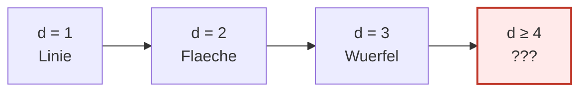
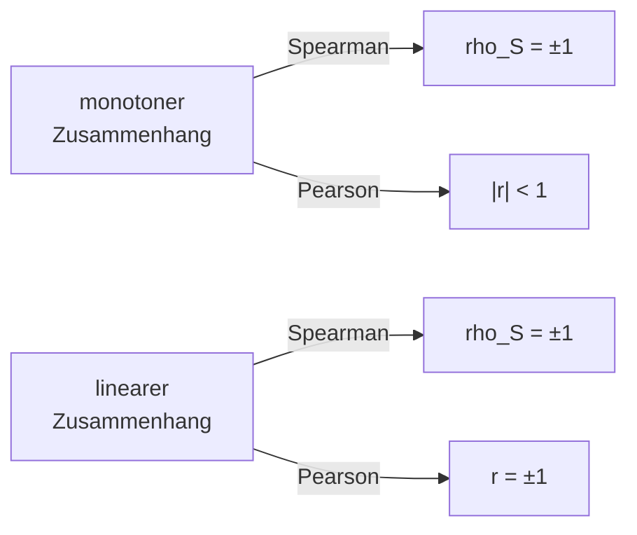
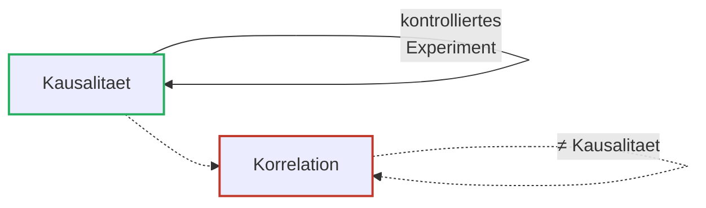
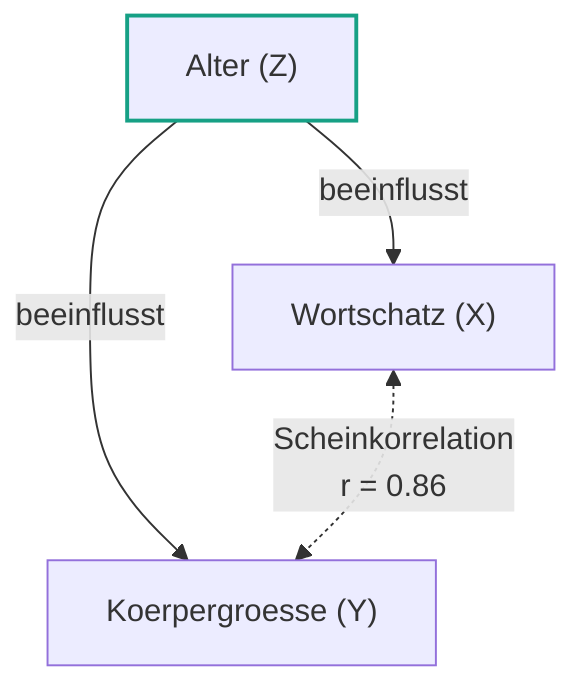
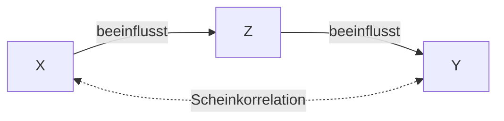
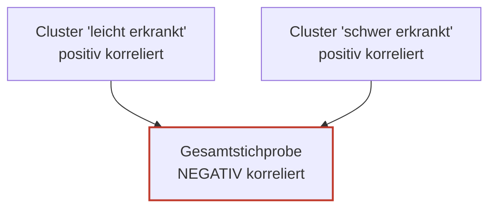
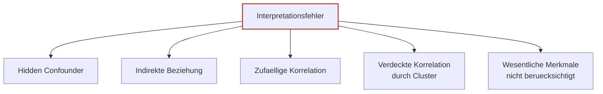

# 05 — Mehrdimensionale EDA

**Folien:** [[data-science/resources/05_Multivariate_EDA.pdf|05_Multivariate_EDA.pdf]]
**Selbstkontrolle:** [[data-science/selbstkontrolle/ds-selbstkontrolle-05|Selbstkontrolle 05]]

## Inhaltsverzeichnis

- [[#Wiederholung|Wiederholung]]
- [[#Visualisierung hoeherdimensionaler Daten|Visualisierung hoeherdimensionaler Daten]]
- [[#Parallel Coordinate Plot (PCP)|Parallel Coordinate Plot (PCP)]]
- [[#Spearman Korrelationskoeffizient|Spearman Korrelationskoeffizient]]
- [[#Pearson vs. Spearman|Pearson vs. Spearman]]
- [[#Invarianzeigenschaften|Invarianzeigenschaften]]
- [[#Mutual Information|Mutual Information]]
- [[#Korrelation und Kausalitaet|Korrelation und Kausalitaet]]
- [[#Interpretationsfehler|Interpretationsfehler]]
- [[#Fragen zur Selbstkontrolle|Fragen zur Selbstkontrolle]]

---

## Wiederholung

### Scatter- und Bubble-Plot

- **Scatterplot**: `plt.scatter(x, y)` → bivariate Darstellung
- **Bubble Chart**: `plt.scatter(x, y, s=z)` → trivariate Darstellung

### Pearson Korrelationskoeffizient

$$r = \frac{s_{XY}}{s_X s_Y}, \quad s_{XY} = \sum_{i=1}^{n} (x_i - \bar{x}_n)(y_i - \bar{y}_n)$$

Misst die Staerke des **linearen** Zusammenhangs, $r \in [-1, 1]$.

---

## Visualisierung hoeherdimensionaler Daten

### Das Problem mit $d > 3$

Bis $d = 3$ koennen wir Daten geometrisch im Raum unterbringen. Fuer $d \ge 4$ brauchen wir andere Darstellungen.



### Punkte als Kurven

Jedes Element $x \in \mathbb{R}^d$ entspricht einer **Kurve** mit $d$ Punkten. So lassen sich beliebig hochdimensionale Daten ueber eine 2D-Linienzeichnung visualisieren.

> [!info] Hinweis
> Manchmal gibt es zwischen den Koordinaten einen sinnvollen Zusammenhang (z.B. Nahinfrarotspektren von Fleischsorten, gemessen bei 100 Wellenlaengen) — dann fasst man $x = (x_1, \dots, x_{100})$ besser als Funktion $x = x(t)$ auf → **Funktionale Datenanalyse (FDA)**.

---

## Parallel Coordinate Plot (PCP)

### Idee

Die $d$ Koordinaten werden auf **$d$ parallelen Achsen** dargestellt. Jeder Datenpunkt $x \in \mathbb{R}^d$ wird zu einer Polylinie, die alle Achsen schneidet.


### Beispiel — Iris-Datensatz

- 150 Schwertlilien, 4 Merkmale (Sepal/Petal Length & Width), 3 Arten (Setosa, Versicolor, Virginica)
- Im PCP werden Cluster und Verlaeufe der Merkmale sichtbar

### Mehrdimensionale Strukturen in PCPs

Verschiedene Datenstrukturen erzeugen charakteristische Muster im PCP:

| Datenstruktur (2D-Scatter) | PCP-Muster |
|---|---|
| Korrelation $+1$ | parallele Linien |
| Korrelation $-1$ | Schmetterling (kreuzen sich in einem Punkt) |
| Zwei Cluster | zwei klar getrennte Linienbuendel |
| Kreisfoermig | verteilte Kreuzungen |
| Normalverteilung | dichte, zufaellige Kreuzungen |

> [!tip] Merke
> Korrelation zwischen Merkmalen ist nur **bei benachbarten Achsen** gut erkennbar. Achsenpermutation und -skalierung beeinflussen die Lesbarkeit erheblich.

### Code

```python
from sklearn.datasets import load_iris
from pandas.plotting import parallel_coordinates

iris = load_iris(as_frame=True).frame
parallel_coordinates(iris, class_column='target')
```

---

## Spearman Korrelationskoeffizient

### Idee — Pearson auf Raengen

Spearmans Korrelationskoeffizient entspricht dem Pearson-Korrelationskoeffizienten, angewandt auf die **Raenge** der Werte statt auf die Werte selbst.

### Rang und Ordnungsstatistik

Sei $x_1, \dots, x_n$ eine Stichprobe und $x_{(1)} \le x_{(2)} \le \dots \le x_{(n)}$ die zugehoerige Ordnungsstatistik. Der Rang ist der Index in dieser sortierten Folge:
$$rg(x_i) = k, \quad \text{falls } x_i = x_{(k)}$$

### Umgang mit Ties (Bindungen)

Treten identische Werte mehrfach auf, ist die Rangvergabe nicht eindeutig. Stattdessen wird der **Durchschnittsrang** vergeben.

> [!example] Beispiel
> Werte: $1.09, 2.17, 2.17, 2.17, 3.02, 4.5$
> Naive Raenge: $1, 3, 2, 4, 5, 6$ (nicht eindeutig fuer die drei 2.17er)
> Durchschnittsrang: $(2 + 3 + 4)/3 = 3$
> Endgueltige Raenge: $1, 3, 3, 3, 5, 6$

### Definition

> [!quote] Definition (Spearman Korrelationskoeffizient)
> $$\rho_S = \frac{\sum_{i=1}^{n} \bigl(rg(x_i) - \tfrac{n+1}{2}\bigr) \bigl(rg(y_i) - \tfrac{n+1}{2}\bigr)}{\sqrt{\sum \bigl(rg(x_i) - \tfrac{n+1}{2}\bigr)^2 \sum \bigl(rg(y_i) - \tfrac{n+1}{2}\bigr)^2}}$$

Der Wert $\frac{n+1}{2}$ ist der mittlere Rang einer Stichprobe der Groesse $n$ (Mittelwert der ganzen Zahlen von 1 bis $n$).

### Was misst Spearman?

> [!tip] Merke
> Pearson misst **lineare** Zusammenhaenge — Spearman misst **monotone** Zusammenhaenge.

Bei einem **monoton wachsenden, nichtlinearen** Zusammenhang ist $r_{XY} > 0$, aber $r_{XY} < 1$ — der Zusammenhang der **Raenge** ist hingegen linear, also $\rho_S = 1$. Analog bei monoton fallendem nichtlinearem Zusammenhang: $r_{XY} < 0$, aber $\rho_S = -1$.



---

## Pearson vs. Spearman

| | **Pearson** | **Spearman** |
|---|---|---|
| Misst | linearen Zusammenhang | monotonen Zusammenhang |
| Geeignet fuer | diskrete & stetige Merkmale | **ordinale**, diskrete & stetige Merkmale |
| Beispiele | Nettomiete, Alter | Schwierigkeitsgrade (blau, rot, schwarz), Schulnoten |
| Invarianz | linear (Betrag) | streng monoton (Vorzeichen abhaengig) |

> [!success] Best Practice
> Bei ordinalen Daten (Reihenfolge, aber kein Abstand) ist Spearman die richtige Wahl — Pearson wuerde implizite Abstaende zwischen den Stufen unterstellen.

---

## Invarianzeigenschaften

### Lineare Transformationen — Pearson und Spearman

Fuer $\tilde X = a_X X + b_X, \; \tilde Y = a_Y Y + b_Y$ gilt:
$$r_{\tilde X \tilde Y} = \frac{a_X a_Y}{|a_X| \cdot |a_Y|} r_{XY} = \begin{cases} r_{XY}, & \text{falls } \text{sign}(a_X) = \text{sign}(a_Y) \\ -r_{XY}, & \text{sonst} \end{cases}$$

Insbesondere $|r_{\tilde X \tilde Y}| = |r_{XY}|$.

### Streng monotone Transformationen — nur Spearman

Fuer streng monotone Funktionen $g, h$ und $\tilde X = g(X), \tilde Y = h(Y)$ gilt:
$$\rho_S(\tilde X, \tilde Y) = \begin{cases} \rho_S(X, Y), & \text{falls } g \text{ und } h \text{ beide wachsend oder beide fallend} \\ -\rho_S(X, Y), & \text{sonst} \end{cases}$$

Pearson **ist nicht** invariant unter monotonen Transformationen.

### Symmetrie

Beide sind symmetrisch in den Argumenten:
$$r_{XY} = r_{YX}, \qquad \rho_S(X, Y) = \rho_S(Y, X)$$

### Beispiel — nicht-monoton

Ein klassisches Gegenbeispiel ist eine Punktwolke entlang $y = \cos(\pi x)$ auf $[-1, 1]$:
- $X$ und $Y$ sind **nicht unabhaengig** (klare Struktur)
- Pearson und Spearman sind beide nahe $0$ — der Zusammenhang ist nicht monoton

> [!warning] Achtung
> Korrelation $= 0$ heisst **nicht** Unabhaengigkeit. Es heisst nur, dass kein linearer (Pearson) bzw. monotoner (Spearman) Zusammenhang vorliegt. Fuer nicht-monotone Zusammenhaenge brauchen wir andere Masse → **Mutual Information**.

---

## Mutual Information

### Informationsgehalt

> [!quote] Definition (Informationsgehalt)
> Sei $A$ ein Ereignis mit Wahrscheinlichkeit $p_A$. Der **Informationsgehalt** ist
> $$I_A := -\log_2 p_A$$
> Einheit: bit.

Eigenschaften:
- Je seltener $A$, desto groesser $I_A$
- $I_A \ge 0$
- Basiswechsel aendert nur die Einheit: $\log_2 p = \frac{\log_b p}{\log_b 2}$

### Entropie

> [!quote] Definition (Shannon-Entropie)
> Sei $X$ eine diskrete Zufallsvariable mit Wahrscheinlichkeitsfunktion $p_k$. Die **Entropie** ist der mittlere Informationsgehalt:
> $$H(X) = \mathbb{E}[I] = -\sum_k p_k \log_2 p_k$$

- $0 \log_2 0 := 0$ (Grenzwert: $\lim_{p \to 0} p \log_2 p = 0$)
- Bei $d$ moeglichen Werten: $H(X) = -\sum_{k=1}^{d} p_k \log_2 p_k$

> [!example] Beispiel — 2 Klassen
> Mit $p_1 = p$ und $p_2 = 1 - p$:
> $$H(X) = -\bigl(p \log_2 p + (1-p) \log_2 (1-p)\bigr)$$
> Maximum bei $p = 0.5$ (Gleichverteilung) → $H = 1$ bit. Minimum bei $p = 0$ oder $p = 1$ → $H = 0$ bit.

### Bedingte Entropie

> [!quote] Definition (Bedingte Entropie)
> Sei die bedingte W'keit $p_{X|Y}(x_i | y_j) = \frac{p_{X,Y}(x_i, y_j)}{p_Y(y_j)}$.
> 
> Die Entropie von $X$ bedingt auf $Y = y_j$:
> $$H(X | Y = y_j) = -\sum_i p_{X|Y}(x_i | y_j) \log_2 p_{X|Y}(x_i | y_j)$$
> 
> Die Entropie von $X$ bedingt auf $Y$:
> $$H(X | Y) = \sum_j p_Y(y_j) H(X | Y = y_j) = -\sum_{i,j} p_{X,Y}(x_i, y_j) \log_2 \frac{p_{X,Y}(x_i, y_j)}{p_Y(y_j)}$$

**Interpretation**: mittlerer Informationsgehalt von $X$ unter der Bedingung, dass $Y$ bekannt ist. Anders: wie viel Unsicherheit ueber $X$ bleibt, wenn ich $Y$ kenne.

### Mutual Information

> [!quote] Definition (Mutual Information)
> $$I(X; Y) = H(X) - H(X | Y)$$

**Interpretation**: Abnahme des mittleren Informationsgehalts von $X$ durch Kenntnis von $Y$ — also **wie viel Information $Y$ ueber $X$ liefert**. Wird auch als *Information Gain* bezeichnet.

### Eigenschaften

- **Symmetrie**: $I(X; Y) = I(Y; X)$ — $Y$ liefert so viel Info ueber $X$ wie $X$ ueber $Y$
- **Nicht-Negativitaet**: $I(X; Y) \ge 0$ (Beweis ueber Jensensche Ungleichung)
- $I(X; Y) = 0$ genau dann, wenn $X$ und $Y$ unabhaengig sind
- Auch fuer **stetige** Zufallsvariablen definiert (Dichten statt W'keitsfunktionen)

### Venn-Diagramm

```mermaid
flowchart LR
    HX(("H(X)<br/>vollst. Info ueber X"))
    HY(("H(Y)<br/>vollst. Info ueber Y"))
    HX -.-|Schnitt = I(X;Y)|.- HY
```

Die Standardvisualisierung als zwei sich ueberlappende Kreise:
- Linker Kreis = $H(X)$, rechter Kreis = $H(Y)$
- Schnitt = $I(X; Y)$
- Linker Halbmond = $H(X|Y)$, rechter Halbmond = $H(Y|X)$
- Es gilt $H(X) = I(X;Y) + H(X|Y)$

### Was MI besser kann

- Erkennt **nicht-monotone** und **nichtlineare** Zusammenhaenge
- Beispiel-Wolke $y = \cos(\pi x)$: Pearson und Spearman nahe 0, aber $I(X;Y) \approx 0.85$

> [!warning] Achtung
> MI ist bei kleinen Stichproben schwer zu schaetzen. Robuste Schaetzer wurden in den letzten 20 Jahren entwickelt — bekannt: Kraskov, Stoegbauer, Grassberger (Forschungszentrum Juelich, 2004, *Phys. Rev. E* 69).

```python
from sklearn.feature_selection import mutual_info_regression
```

---

## Korrelation und Kausalitaet

> [!tip] Merke
> Korrelation ist ein Mass fuer die **Staerke** eines Zusammenhangs zwischen $X$ und $Y$ — **nicht** fuer Kausalitaet.

- Hohe Werte von Zusammenhangsmassen koennen auf kausale Zusammenhaenge **hinweisen**, beweisen sie aber nicht.
- **Kontrollierte Experimente** sind der klassische Weg, Kausalitaet zu untersuchen: $X$ wird gezielt veraendert, $Y$ beobachtet.
- Experimente sind oft nicht durchfuehrbar (ethisch, praktisch) → Masse fuer die **Richtung** eines Zusammenhangs (z.B. **Granger Causality**).



---

## Interpretationsfehler

### Hidden Confounder (Drittvariable)

Eine **Scheinkorrelation** ist eine Korrelation ohne kausalen Zusammenhang.

> [!example] Beispiel — Wortschatz und Koerpergroesse
> Bei Kindern: $r_{XY} = 0.86$ zwischen Wortschatz und Koerpergroesse. Kausal? Nein — die Drittvariable **Alter** beeinflusst beides.
> $r_{XZ} = 0.89$ (Alter ↔ Wortschatz), $r_{YZ} = 0.99$ (Alter ↔ Koerpergroesse).



### Indirekte Beziehung



$X$ wirkt indirekt ueber $Z$ auf $Y$ — die direkte Korrelation $X \leftrightarrow Y$ ist also keine direkte Beziehung.

### Zufaellige Korrelation (Spurious Correlation)

Bei langen Zeitreihen oder vielen verglichenen Variablen entstehen rein zufaellig hohe Korrelationen. Klassische Beispiele von [tylervigen.com/spurious-correlations](https://www.tylervigen.com/spurious-correlations):

- US-Ausgaben fuer Wissenschaft ↔ Selbstmorde durch Erhaengen ($r = 0.998$)
- Alter von Miss America ↔ Morde durch heisse Daempfe ($r = 0.870$)
- Verliehene Mathematik-Doktorate ↔ Uran in US-Kernkraftwerken ($r = 0.952$)

### Verdeckte Korrelation durch Cluster

> [!example] Beispiel — Medikamentendosierung
> Dosierung vs. Therapieerfolg ueber die Gesamtstichprobe: **negative** Korrelation.
> Aber: Cluster "leicht erkrankt" und "schwer erkrankt" haben jeweils positive Korrelation. Die Mischung der Cluster verdeckt den positiven Zusammenhang innerhalb jeder Gruppe (Simpson-Paradoxon-aehnlich).



### Uebersicht — Fehlerquellen



---

## Fragen zur Selbstkontrolle

Die kompakten Karteikarten finden sich unter [[data-science/selbstkontrolle/ds-selbstkontrolle-05|Selbstkontrolle 05]]. Im Folgenden ausfuehrliche Antworten zur Pruefungsvorbereitung.

**Was ist ein PC-Plot? Wann ist er hilfreich?**

Ein Parallel Coordinate Plot stellt die $d$ Koordinaten jedes Datenpunkts auf $d$ parallelen Achsen dar — jeder Datenpunkt wird zu einer Polylinie. Hilfreich fuer die Exploration **hoeherdimensionaler Daten** ($d \ge 4$), wo Scatter-/Bubble-Plots an ihre Grenzen kommen. Im PCP werden Cluster, parallele Buendel (Korrelation $+1$), Schmetterlingsmuster (Korrelation $-1$) und Ausreisser sichtbar.

**Was ist der Spearman Korrelationskoeffizient?**

Der Pearson-Korrelationskoeffizient angewandt auf die **Raenge**:
$$\rho_S = \frac{\sum (rg(x_i) - \frac{n+1}{2})(rg(y_i) - \frac{n+1}{2})}{\sqrt{\sum (rg(x_i) - \frac{n+1}{2})^2 \sum (rg(y_i) - \frac{n+1}{2})^2}}$$
Misst die Staerke **monotoner** Zusammenhaenge. Wert in $[-1, 1]$.

**Wie gehen wir mit identischen Werten bei der Berechnung von Raengen um?**

Durch **Durchschnittsraenge**: Werden mehrere Werte als identisch erfasst, erhalten alle den Mittelwert ihrer "naiven" Raenge. So bleibt die Rangzuweisung eindeutig.

**Was ist der Unterschied zwischen Pearson und Spearman?**

Pearson misst **lineare**, Spearman **monotone** Zusammenhaenge. Pearson eignet sich fuer diskrete und stetige Merkmale, Spearman zusaetzlich fuer **ordinale** Merkmale (z.B. Schwierigkeitsgrade). Spearman ist invariant unter streng monotonen Transformationen, Pearson nur unter linearen.

**Ist der Pearson-Korrelationskoeffizient invariant bzgl...**

- **... linearen Transformationen?** Ja im Betrag: $|r_{\tilde X \tilde Y}| = |r_{XY}|$. Vorzeichen kippt, wenn $a_X$ und $a_Y$ unterschiedliche Vorzeichen haben.
- **... monotonen Transformationen?** Nein — nur Spearman ist invariant unter streng monotonen Transformationen.
- **... Vertauschen von $X$ und $Y$?** Ja: $r_{XY} = r_{YX}$.

**Wie koennen wir nicht-monotone Zusammenhaenge messen?**

Mit der **Mutual Information** $I(X;Y) = H(X) - H(X|Y)$ aus der Informationstheorie. Sie misst, wie viel Information $Y$ ueber $X$ liefert, und erkennt auch nichtlineare und nicht-monotone Strukturen.

**Was ist Entropie?**

$H(X) = -\sum_k p_k \log_2 p_k$ — der mittlere Informationsgehalt einer diskreten Zufallsvariablen (in bit). Hoch bei Gleichverteilung (maximale Unsicherheit), niedrig bei Konzentration auf wenige Werte.

**Wie koennen wir Mutual Information, Entropie und bedingte Entropie grafisch darstellen?**

Als Venn-Diagramm zweier sich ueberlappender Kreise $H(X)$ und $H(Y)$:
- Schnitt = $I(X; Y)$
- linker Halbmond = $H(X | Y)$
- rechter Halbmond = $H(Y | X)$
- es gilt $H(X) = I(X; Y) + H(X | Y)$

**Folgt aus Korrelation eine Kausalitaet?**

Nein. Eine hohe Korrelation kann auf Kausalitaet **hinweisen**, beweist sie aber nicht. Moegliche Alternativerklaerungen: Hidden Confounder, indirekte Beziehung, zufaellige Korrelation, verdeckte Korrelation durch Cluster.

**Folgt aus Kausalitaet eine Korrelation?**

Nicht zwingend in linearer/monotoner Form. Ein kausaler nichtlinearer Zusammenhang (z.B. $Y = X^2$) kann $r_{XY} = 0$ und $\rho_S = 0$ ergeben. Mutual Information kann den Zusammenhang dennoch quantifizieren.
