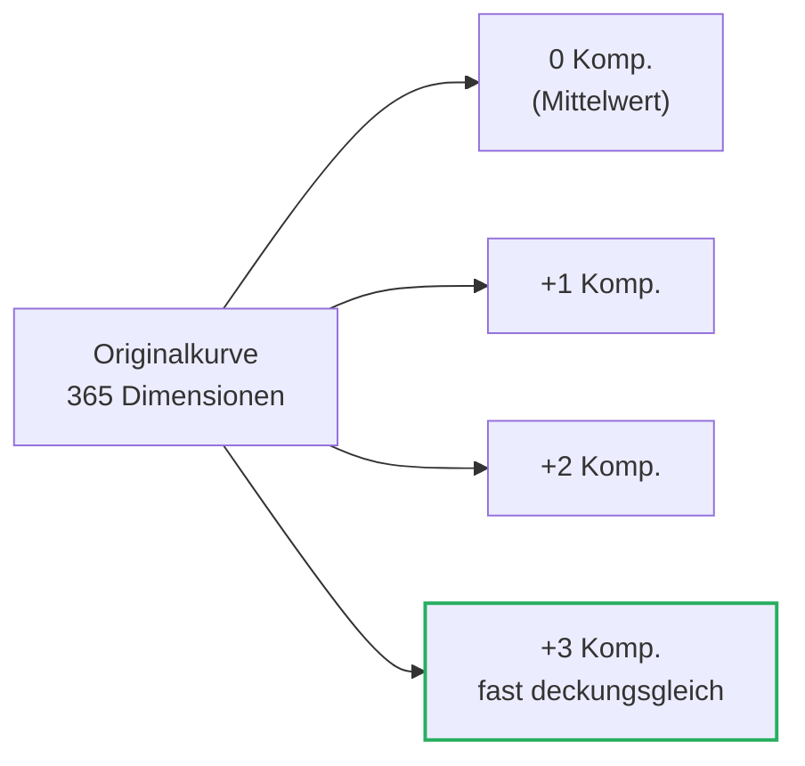
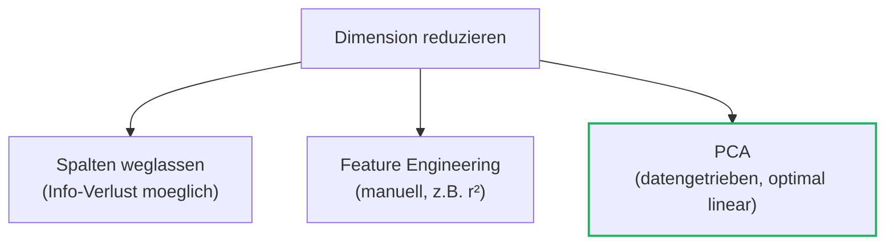
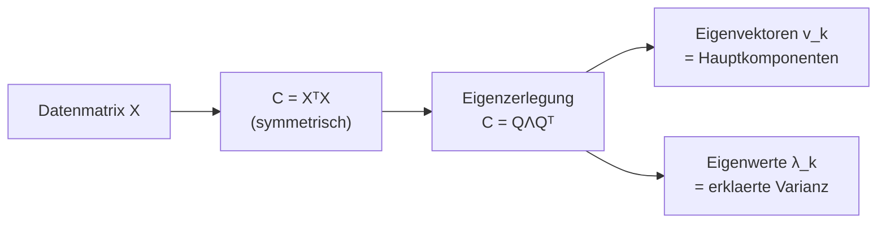
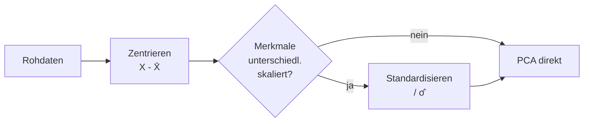

# 06 — Dimensionsreduktion (PCA)

**Folien:** [[data-science/resources/06_Dimensionsreduktion.pdf|06_Dimensionsreduktion.pdf]]
**Selbstkontrolle:** [[data-science/selbstkontrolle/ds-selbstkontrolle-06|Selbstkontrolle 06]]

## Inhaltsverzeichnis

- [[#Wiederholung|Wiederholung]]
- [[#Dimensionsreduktion|Dimensionsreduktion]]
- [[#Warum Dimensionen reduzieren — Fluch der Dimensionalitaet|Warum Dimensionen reduzieren — Fluch der Dimensionalitaet]]
- [[#Wie Dimensionen reduzieren|Wie Dimensionen reduzieren]]
- [[#Hauptkomponentenanalyse (PCA)|Hauptkomponentenanalyse (PCA)]]
- [[#Definition der Hauptkomponenten|Definition der Hauptkomponenten]]
- [[#Berechnung ueber Eigenwerte|Berechnung ueber Eigenwerte]]
- [[#Projektion und Dimensionsreduktion mit PCA|Projektion und Dimensionsreduktion mit PCA]]
- [[#Zentrierung und Standardisierung|Zentrierung und Standardisierung]]
- [[#Anwendung — Temperaturkurven und Iris|Anwendung — Temperaturkurven und Iris]]
- [[#Fragen zur Selbstkontrolle|Fragen zur Selbstkontrolle]]

---

## Wiederholung

Methoden der **multivariaten EDA** (aus der vorigen Vorlesung):

1. **Visualisierungen**
   - Scatter Plot
   - Parallel Coordinate (PC-)Plot
2. **Zusammenhangsmasse**
   - Korrelationskoeffizient: Pearson (linear), Spearman (monoton)
   - Mutual Information (auch nicht-monotone Zusammenhaenge)

**Jetzt:** Dimensionsreduktion.

---

## Dimensionsreduktion

> [!quote] Leitfrage
> Koennen wir die Dimension der Daten reduzieren, **ohne (viele) Informationen zu verlieren**?

Sehr oft liegen Daten zwar in hoher Dimension vor, ihre eigentliche "Struktur" ist aber niederdimensional. Liegen z.B. die Punkte einer 2D-Wolke fast auf einer Geraden, so steckt die wesentliche Information in **einer** Koordinate (entlang der Geraden) — die zweite Richtung beschreibt nur kleines Rauschen.

### Beispiel — Temperaturkurven

- **73 spanische Wetterstationen**
- Tagliche Temperaturen, **365 Werte je Station**
- Wie viel Information beinhaltet jede Kurve? Wie viele Zahlen ("Dimensionen") brauchen wir wirklich, um die 365-dimensionalen Daten zu beschreiben?

Eine einzelne, glatte Jahreskurve laesst sich erstaunlich gut mit **wenigen** Komponenten rekonstruieren:

- **0 Komponenten** = nur der Mittelwert (mean) → grobe Naeherung
- mit **1, 2, 3 Komponenten** naehert sich die Rekonstruktion der Originalkurve schnell an



> [!tip] Merke
> Die "intrinsische" Dimension eines Datensatzes ist oft **viel kleiner** als die Zahl der gemessenen Merkmale. Genau das nutzt die Dimensionsreduktion aus.

---

## Warum Dimensionen reduzieren — Fluch der Dimensionalitaet

Es gibt zwei Gruende, die Dimension zu reduzieren:

1. **Explorative Datenanalyse** ist bei vielen Dimensionen schwierig (kaum visualisierbar).
2. **Mathematische Gruende** — der *Fluch der Dimensionalitaet*.

### Volumen und Abstand im Einheitswuerfel

Betrachte den Einheitswuerfel $[0,1]^n$:

| Dimension | Volumen $V_n$ | max. Abstand $d_n$ |
|---|---|---|
| $n = 1$ (Strecke) | $1$ | $1$ |
| $n = 2$ (Quadrat) | $1$ | $\sqrt{2}$ |
| $n = 3$ (Wuerfel) | $1$ | $\sqrt{3}$ |
| allgemein | $V_n = 1$ | $d_n = \sqrt{n}$ |

> [!warning] Achtung — Fluch der Dimensionalitaet
> - Je hoeher die Dimension, **desto weiter koennen zwei Punkte voneinander entfernt** sein ($d_n = \sqrt{n} \to \infty$), obwohl das Volumen konstant $1$ bleibt.
> - Verdoppelt man die Seitenlaenge, waechst das Volumen **exponentiell**:
> $$V([0,1]^n) = 1, \qquad V([0,2]^n) = 2^n$$
> - In hohen Dimensionen "verlaufen" sich die Daten — statistische Analysen werden schwierig, weil der Raum riesig und duenn besetzt ist.


---

## Wie Dimensionen reduzieren

### Variante 1 — Spalten weglassen

Einfach **Dimensionen (Spalten) streichen**, z.B. bei einem Tagesablauf-Datensatz (Arbeitszeit, Freizeit, Schlaf) die Spalte `Schlaf` (immer konstant 8 h) oder eine der beiden anderen.

> [!warning] Achtung
> Beim naiven Weglassen von Spalten verlieren wir **potenziell Informationen** — eine weggelassene Spalte kann wichtige Struktur enthalten.

### Variante 2 — Feature Engineering

Erstelle **neue Features** durch eine Abbildung $\varphi$, die mehrere Koordinaten zu einer zusammenfasst. Beispiel fuer kreisfoermige Daten:
$$\varphi(x_1, x_2) = x_1^2 + x_2^2, \qquad \varphi: \mathbb{R}^2 \to \mathbb{R}$$
Diese eine Zahl (der quadrierte Radius) trennt innere und aeussere Kreise sauber — aus $\mathbb{R}^2$ wird $\mathbb{R}^1$.

```python
import numpy as np
from sklearn.datasets import make_circles

X, y = make_circles(noise=0.1, factor=0.5)
X2 = np.sum(X ** 2, axis=-1)
```

Weiteres Beispiel (Temperatur): nur **Minimum und Maximum pro Jahr** verwenden → $\mathbb{R}^{365} \to \mathbb{R}^2$.

> [!question] Geht das besser — "datengetrieben" statt "manuell"?
> Ja! Anstatt die Abbildung $\varphi$ von Hand zu entwerfen, lernt die **PCA** die beste lineare Reduktion direkt aus den Daten.



---

## Hauptkomponentenanalyse (PCA)

### Idee

Wie viele Dimensionen brauchen wir **wirklich**, um die Daten zu beschreiben?

Standardrepraesentation eines Punkts $\mathbb{R}^2$ ueber die Einheitsvektoren:
$$\begin{pmatrix} x_1 \\ x_2 \end{pmatrix} = x_1 \begin{pmatrix} 1 \\ 0 \end{pmatrix} + x_2 \begin{pmatrix} 0 \\ 1 \end{pmatrix}$$

Stattdessen suchen wir eine **bessere Basis**:
- Vektoren $v_1, v_2$ (gleich fuer **alle** Beobachtungen im Datensatz) und
- Skalare $s_1, s_2$ (unterschiedlich **je** Beobachtung), sodass
$$\begin{pmatrix} x_1 \\ x_2 \end{pmatrix} = s_1 v_1 + s_2 v_2 \approx s_1 v_1$$

Die "meisten" Informationen stecken bereits in $s_1 v_1$ — die zweite Richtung kann weggelassen werden.

> [!quote] Definition (PCA)
> **Principal Component Analysis (PCA)** sucht eine neue Orthonormalbasis (die *Hauptkomponenten*) mit:
> - Neue Komponenten **maximieren die Varianz** der projizierten Daten.
> - Jede neue Komponente ist **orthogonal** zu allen vorherigen.


Projiziert man die Punktwolke auf verschiedene Achsen, ergibt sich:
- Projektion auf die **1. Hauptkomponente** → breite Streuung (maximale Varianz).
- Projektion auf die dazu **orthogonale** Achse → kleine Streuung → 2. Hauptkomponente.
- Komponenten mit vernachlaessigbarer Varianz koennen weggelassen werden.

---

## Definition der Hauptkomponenten

### 1. Hauptkomponente

> [!quote] Definition (1. Hauptkomponente)
> Gegeben seien **zentrierte** Beobachtungen $X_1, \dots, X_n \in \mathbb{R}^p$, d.h. $\mathbb{E}[X_i] = 0$. Die erste Hauptkomponente $w_1$ ist
> $$w_1 = \arg\max_{\|w\| = 1} \sum_{i=1}^{n} \langle X_i, w \rangle^2$$

**Warum diese Formel?**
- Das Skalarprodukt $\langle X_i, w \rangle$ misst den **Winkel** (genauer: die Projektionslaenge) zwischen $X_i$ und $w$ — je groesser, desto "aehnlicher" zeigt $X_i$ in Richtung $w$.
- Die **Summe der Quadrate** $\sum_i \langle X_i, w\rangle^2$ ist (bei zentrierten Daten) gerade die **Varianz der Projektionen** auf $w$. Maximieren wir sie, finden wir die Richtung groesster Varianz.

### Matrixform

Sei $\mathbf{X} \in \mathbb{R}^{n \times p}$ die Matrix mit den Beobachtungen $X_1, \dots, X_n$ als **Zeilen**. Dann gilt:
$$w_1 = \arg\max_{\|w\| = 1} \|\mathbf{X} w\|^2 = \arg\max_{\|w\| = 1} w^T \mathbf{X}^T \mathbf{X}\, w$$

Das Maximum
$$\max_{\|w\|=1} \|\mathbf{X} w\|^2 = \max_{\|w\|=1} w^T \mathbf{X}^T \mathbf{X}\, w$$
heisst die **erklaerte Varianz** von $w_1$.

### $k$-te Hauptkomponente

> [!quote] Definition ($k$-te Hauptkomponente)
> Gegeben sei $\mathbf{X} \in \mathbb{R}^{n \times p}$ mit $n$ zentrierten Beobachtungen und die ersten $(k-1)$ Hauptkomponenten $w_1, \dots, w_{k-1}$. Mit der **Matrix der Residuen**
> $$\mathbf{X}_k = \mathbf{X} - \sum_{i=1}^{k-1} \mathbf{X} w_i w_i^T$$
> (wobei $\mathbf{X} w_i w_i^T$ die Projektion von $\mathbf{X}$ auf $w_i$ ist) wird die $k$-te Hauptkomponente definiert als
> $$w_k = \arg\max_{\|w\|=1} \|\mathbf{X}_k\, w\|^2$$

Anschaulich: man zieht von den Daten alles ab, was die bisherigen Hauptkomponenten erklaeren, und sucht in dem **Rest** wieder die Richtung groesster Varianz.

---

## Berechnung ueber Eigenwerte

> [!tip] Merke — Hauptkomponenten = Eigenvektoren
> Seien $\lambda_1 \ge \dots \ge \lambda_p$ die **Eigenwerte** der Matrix $\mathbf{X}^T \mathbf{X}$ mit zugehoerigen **Eigenvektoren** $v_1, \dots, v_p$. Dann gilt fuer $k \in \{1, \dots, p\}$
> $$\lambda_k = \max_{\|w\|=1} \|\mathbf{X} w\|^2$$
> und das Maximum wird von $v_k$ angenommen.
> - Die **Eigenvektoren** entsprechen den Hauptkomponenten (sortiert nach Groesse der Eigenwerte).
> - Die **Eigenwerte** entsprechen der **erklaerten Varianz** je Hauptkomponente.
> - Eigenwerte und -vektoren koennen **effizient** berechnet werden!

### Herleitung (anschaulich)

$C = \mathbf{X}^T \mathbf{X}$ ist symmetrisch, also gibt es eine **orthogonale Matrix** $Q$ mit $C = Q \Lambda Q^T$, wobei $\Lambda$ die Diagonalmatrix der (sortierten) Eigenwerte ist. Mit der Substitution $v = Q^T w$ (orthogonal, also $\|v\| = \|w\|$):
$$\max_{\|w\|=1} w^T \mathbf{X}^T \mathbf{X}\, w = \max_{\|w\|=1} w^T C w = \max_{\|w\|=1} w^T Q \Lambda Q^T w = \max_{\|v\|=1} v^T \Lambda v = \max_{\|v\|=1} \sum_{i=1}^{p} \lambda_i v_i^2 = \lambda_1$$

Das Maximum wird fuer $v_1 = 1, v_i = 0\ (i \ge 2)$ angenommen — die gesamte "Masse" liegt auf dem groessten Eigenwert. Analog:
$$\arg\max_{\|w\|=1} w^T \mathbf{X}^T \mathbf{X}\, w = Q \begin{pmatrix} 1 \\ 0 \\ \vdots \\ 0 \end{pmatrix} = w_1$$

> [!info] Hinweis
> Alternative Herleitung (Herleitung 1, typisch): Optimierung mit **Lagrange-Multiplikatoren** unter der Nebenbedingung $\|w\| = 1$. Beide Wege fuehren auf das Eigenwertproblem von $\mathbf{X}^T \mathbf{X}$.



---

## Projektion und Dimensionsreduktion mit PCA

### Projektion auf die 1. Hauptkomponente

Sei $w_1$ die 1. Hauptkomponente. Die **Projektion** eines Vektors $X \in \mathbb{R}^p$ auf $w_1$ ist
$$\text{proj}(X) = \langle X, w_1 \rangle\, w_1$$
Wegen $X^T w_1 = \langle X, w_1 \rangle$ ist
$$\mathbf{X}\, w_1 w_1^T$$
die Projektion **aller** Beobachtungen auf die 1. Hauptkomponente. Der Skalar $\langle X, w_1 \rangle$ ist die neue Koordinate entlang $w_1$.

### Orthonormalbasis und Rekonstruktion

Die Hauptkomponenten $w_1, \dots, w_p$ bilden eine **Orthonormalbasis** des $\mathbb{R}^p$. Jede Beobachtung laesst sich exakt als Linearkombination darstellen:
$$X_j = \sum_{i=1}^{p} \langle X_j, w_i \rangle\, w_i$$

Die "meisten" Informationen stecken in den **ersten** Hauptkomponenten. Fuer $d \ll p$ gilt daher
$$X_j = \sum_{i=1}^{p} \langle X_j, w_i \rangle\, w_i \approx \sum_{i=1}^{d} \langle X_j, w_i \rangle\, w_i$$

### Dimensionsreduktion (Hin) und Generierung (Rueck)

> [!success] Dimensionsreduktion
> Reduktion $\mathbb{R}^p \to \mathbb{R}^d$ durch Projektion auf die ersten $d$ Hauptkomponenten:
> $$\mathbb{R}^p \ni X = \begin{pmatrix} X^{(1)} \\ \vdots \\ X^{(p)} \end{pmatrix} \longrightarrow \begin{pmatrix} \langle X, w_1 \rangle \\ \vdots \\ \langle X, w_d \rangle \end{pmatrix} \in \mathbb{R}^d$$

> [!success] Daten generieren (Rueckrichtung)
> Aus $d$ Koeffizienten erzeugen wir neue Beobachtungen im $\mathbb{R}^p$:
> $$\mathbb{R}^d \ni \begin{pmatrix} \alpha_1 \\ \vdots \\ \alpha_d \end{pmatrix} \longrightarrow \sum_{i=1}^{d} \alpha_i w_i \in \mathbb{R}^p$$
> Damit kann man z.B. neue, realistisch aussehende Temperaturkurven synthetisieren.


---

## Zentrierung und Standardisierung

> [!warning] Achtung — Voraussetzung
> Die Beobachtungen **muessen zentriert** sein. Falls nicht, zentriere zuerst:
> $$\tilde X_i = X_i - \bar X_n$$

### Skalierung und Standardisierung

Die Hauptkomponenten **haengen von der Skalierung der Merkmale ab** — ein Merkmal mit grosser Wertespanne dominiert sonst die Varianz und damit die 1. Hauptkomponente.

> [!example] Beispiel — Mord vs. Polizisten
> Derselbe Datensatz (Mordzahl, Polizisten pro Einwohner) sieht je nach **Einheit** der Achsen voellig anders aus. Die Richtung der 1. Hauptkomponente kippt, wenn man die Achsen unterschiedlich skaliert — obwohl die Daten dieselben sind.

**Standardisierung** (z-Transformation) pro Merkmal:
$$\tilde X_i = \frac{X_i - \bar X_n}{\hat\sigma}$$
Nach der Standardisierung hat die Stichprobe **Mittelwert 0** und **empirische Varianz 1**.

Bei mehrdimensionalen Daten / Tabellen: Mittelwert und Standardabweichung **je Dimension bzw. je Spalte** berechnen.

> [!warning] Achtung
> Standardisierung kann zu **verzerrten Ergebnissen** fuehren und unwichtigen Merkmalen ein grosses Gewicht geben (deren Rauschen wird auf Varianz 1 hochskaliert). Ob standardisiert wird, ist eine bewusste Entscheidung.



---

## Anwendung — Temperaturkurven und Iris

### Temperaturkurven mit `sklearn`

```python
from sklearn.decomposition import PCA

X, y = load_data()
model = PCA(n_components=10)
X_proj = model.fit_transform(X)
```

Auswertung am 365-dimensionalen Temperaturdatensatz:
- **Mean temperature**: die mittlere Jahreskurve (Zentrierung).
- **Principal components**: 1. Komponente (etwa konstantes Niveau ueber das Jahr), 2. Komponente (Sommer/Winter-Kontrast).
- **Explained variance**: die 1. Komponente erklaert bereits ~85 % der Varianz; nach 2-3 Komponenten ist die **kumulierte erklaerte Varianz** nahe $1$.

> [!question] Wie viele Komponenten waehlen ($d \ll p$)?
> So viele, dass die **kumulierte erklaerte Varianz $\approx 100\%$** ist. Praktisch liest man das am Knick im Plot der kumulierten erklaerten Varianz ab (Elbow / Scree).

Projiziert man die 73 Stationen auf die ersten **zwei** Hauptkomponenten, erhaelt man eine 2D-Karte, in der sich Stationen mit aehnlichem Klima gruppieren (z.B. Navacerrada als Ausreisser). Ebenso lassen sich aus zufaelligen Koeffizienten neue, plausible Temperaturkurven generieren.

### Uebung — Iris-Datensatz

1. Iris-Datensatz mit scikit-learn laden:
   ```python
   from sklearn.datasets import load_iris
   ```
2. Dimension von **4 auf 2** reduzieren.
3. Die beiden Hauptkomponenten und die Projektion der Daten visualisieren (Pflanzenart farblich kodieren).
4. **Interpretation** der Hauptkomponenten: Die 1. Hauptkomponente gewichtet vor allem *petal length* und *petal width* (trennt die Arten deutlich), die 2. Hauptkomponente vor allem *sepal length/width*. Die drei Arten (Setosa, Versicolor, Virginica) bilden im 2D-Projektionsraum gut trennbare Cluster.

---

## Fragen zur Selbstkontrolle

Die kompakten Karteikarten finden sich unter [[data-science/selbstkontrolle/ds-selbstkontrolle-06|Selbstkontrolle 06]]. Im Folgenden ausfuehrliche Antworten zur Pruefungsvorbereitung.

**Warum wollen wir die Dimension von Daten reduzieren?**

Zwei Gruende: (1) **Praktisch** — explorative Datenanalyse und Visualisierung sind bei vielen Dimensionen schwierig (ab $d \ge 4$ kaum darstellbar). (2) **Mathematisch** — der *Fluch der Dimensionalitaet*: Im Einheitswuerfel waechst der maximale Punktabstand mit $d_n = \sqrt{n}$, das Volumen waechst bei Verdoppelung der Seitenlaenge exponentiell ($V([0,2]^n) = 2^n$). In hohen Dimensionen sind die Daten weit verstreut und der Raum duenn besetzt, sodass statistische Analysen unzuverlaessig werden.

**Warum koennen wir die Dimension von Daten reduzieren?**

Weil die **intrinsische Dimension** vieler Datensaetze viel kleiner ist als die Zahl der gemessenen Merkmale. Die Merkmale sind oft korreliert oder folgen einer niederdimensionalen Struktur (z.B. liegen Punkte fast auf einer Geraden/Ebene, oder eine glatte Temperaturkurve mit 365 Werten laesst sich mit wenigen Komponenten rekonstruieren). Die "ueberzaehligen" Richtungen enthalten nur Rauschen mit kleiner Varianz.

**Wie koennen wir die Dimension von Daten reduzieren?**

Drei Ansaetze: (1) **Spalten weglassen** (einfach, aber Info-Verlust moeglich). (2) **Feature Engineering** — neue Features manuell konstruieren, z.B. $\varphi(x_1, x_2) = x_1^2 + x_2^2$ ($\mathbb{R}^2 \to \mathbb{R}$). (3) **PCA** — datengetrieben die beste lineare Reduktion aus den Daten lernen.

**Was ist die Idee hinter der PCA?**

Statt der Standardbasis (Einheitsvektoren) sucht die PCA eine neue **Orthonormalbasis** (die Hauptkomponenten) so, dass jede neue Komponente die **Varianz der projizierten Daten maximiert** und **orthogonal** zu allen vorherigen ist. Da $X = s_1 v_1 + s_2 v_2 + \dots \approx s_1 v_1$, stecken die meisten Informationen in den ersten Komponenten; Komponenten mit vernachlaessigbarer Varianz werden weggelassen.

**In welchem Verhaeltnis stehen Hauptkomponenten?**

Sie sind paarweise **orthogonal** und auf Laenge 1 normiert, bilden also eine **Orthonormalbasis** des $\mathbb{R}^p$. Sie sind nach **abnehmender erklaerter Varianz** sortiert: $w_1$ maximiert die Varianz, $w_k$ ist orthogonal zu $w_1, \dots, w_{k-1}$ und maximiert die restliche Varianz.

**Was ist die erklaerte Varianz? Wofuer nutzen wir sie?**

Die erklaerte Varianz einer Hauptkomponente $w_k$ ist $\max_{\|w\|=1} \|\mathbf{X} w\|^2 = \lambda_k$ (der zugehoerige Eigenwert von $\mathbf{X}^T\mathbf{X}$). Sie gibt an, wie viel der Gesamtvarianz die Komponente erfasst. Wir nutzen sie, um zu **entscheiden, wie viele Komponenten** $d$ wir behalten: man waehlt $d$ so, dass die kumulierte erklaerte Varianz $\approx 100\%$ ist.

**Wie koennen wir Hauptkomponenten und erklaerte Varianz effizient berechnen?**

Ueber das **Eigenwertproblem** der symmetrischen Matrix $C = \mathbf{X}^T \mathbf{X}$. Die **Eigenvektoren** $v_1, \dots, v_p$ (sortiert nach Eigenwert) sind die Hauptkomponenten, die **Eigenwerte** $\lambda_1 \ge \dots \ge \lambda_p$ sind die erklaerten Varianzen. Hintergrund: $C = Q\Lambda Q^T$ (Spektralzerlegung), und $\max_{\|w\|=1} w^T C w = \lambda_1$, angenommen von $v_1$. Eigenwerte/-vektoren sind effizient berechenbar.

**Wie koennen wir mit der PCA die Dimension reduzieren?**

Indem wir jede Beobachtung auf die ersten $d$ Hauptkomponenten projizieren:
$$\mathbb{R}^p \ni X \longrightarrow \begin{pmatrix} \langle X, w_1 \rangle \\ \vdots \\ \langle X, w_d \rangle \end{pmatrix} \in \mathbb{R}^d$$
Die $d$ Skalarprodukte sind die neuen Koordinaten. Wegen $X \approx \sum_{i=1}^{d} \langle X, w_i\rangle w_i$ geht dabei nur wenig Information verloren.

**Wie koennen wir mit der PCA neue Daten generieren?**

Ueber die **Rueckrichtung**: aus $d$ Koeffizienten $\alpha_1, \dots, \alpha_d$ rekonstruiert man eine Beobachtung im $\mathbb{R}^p$ durch
$$\begin{pmatrix} \alpha_1 \\ \vdots \\ \alpha_d \end{pmatrix} \longrightarrow \sum_{i=1}^{d} \alpha_i w_i \in \mathbb{R}^p$$
Mit zufaellig (plausibel) gewaehlten $\alpha_i$ lassen sich so neue, realistisch aussehende Datenpunkte (z.B. Temperaturkurven) erzeugen.
