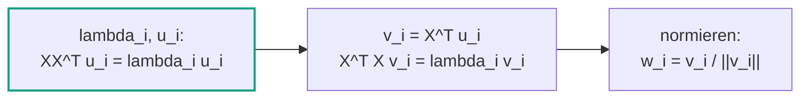
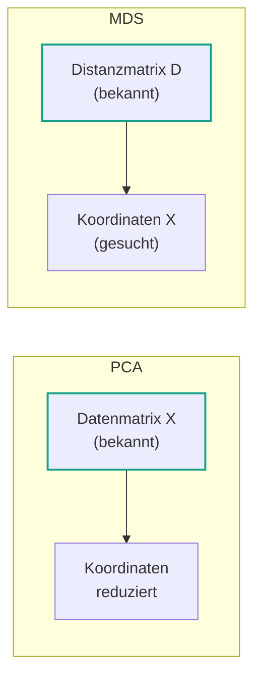
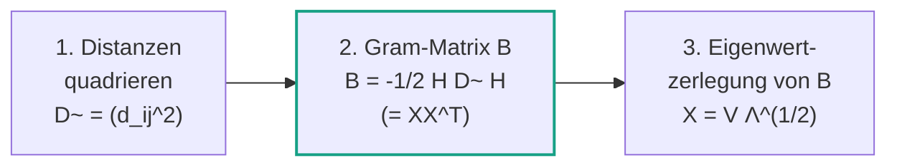
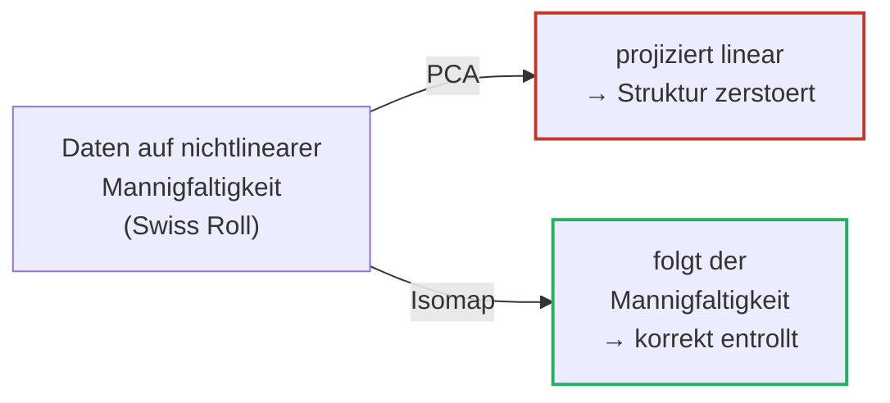
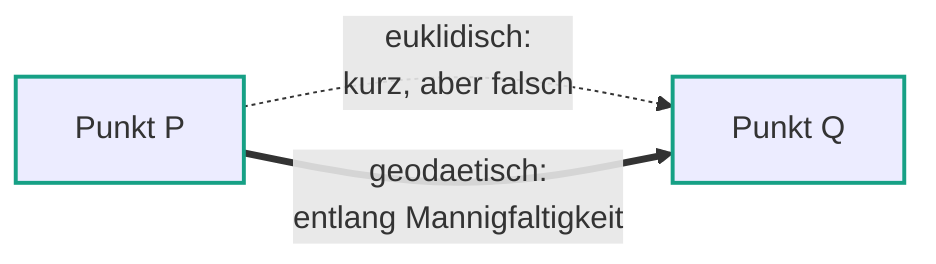

# 07 — Dimensionsreduktion: MDS und Isomap

**Folien:** [[data-science/resources/07_Isomap.pdf|07_Isomap.pdf]]
**Selbstkontrolle:** [[data-science/selbstkontrolle/ds-selbstkontrolle-07|Selbstkontrolle 07]]

## Inhaltsverzeichnis

- [[#Wiederholung — PCA|Wiederholung — PCA]]
- [[#Nachtrag PCA — hochdimensionale Daten|Nachtrag PCA — hochdimensionale Daten]]
- [[#Multidimensional Scaling (MDS)|Multidimensional Scaling (MDS)]]
- [[#Der MDS-Algorithmus|Der MDS-Algorithmus]]
- [[#Wahl der Dimension — PDME|Wahl der Dimension — PDME]]
- [[#Zusammenhang MDS und PCA|Zusammenhang MDS und PCA]]
- [[#Grenzen der PCA — nichtlineare Mannigfaltigkeiten|Grenzen der PCA — nichtlineare Mannigfaltigkeiten]]
- [[#Isomap|Isomap]]
- [[#Fragen zur Selbstkontrolle|Fragen zur Selbstkontrolle]]

---

## Wiederholung — PCA

Die **Hauptkomponentenanalyse (PCA)** dient der Dimensionsreduktion durch Maximierung der Varianz.

- Hauptkomponenten **maximieren die Varianz**
- Hauptkomponenten sind **orthogonal** zu vorherigen Hauptkomponenten
- Die "meisten" Informationen stecken in den **ersten** Hauptkomponenten, d.h. fuer $d \ll p$ gilt die Approximation
$$X_j = \sum_{i=1}^{p} \langle X_j, w_i \rangle w_i \approx \sum_{i=1}^{d} \langle X_j, w_i \rangle w_i$$

Die erste Hauptkomponente loest das Optimierungsproblem
$$w_1 = \arg\max_{\|w\|=1} \sum_{i=1}^{n} \langle X_i, w \rangle^2.$$

Sei $\mathbf{X} \in \mathbb{R}^{n \times p}$ die Matrix mit den Beobachtungen $X_1, \dots, X_n$ als Zeilen. Dann gilt
$$w_1 = \arg\max_{\|w\|=1} \|\mathbf{X}w\|^2 = \arg\max_{\|w\|=1} w^T \mathbf{X}^T \mathbf{X} w.$$

Das Maximum $\max_{\|w\|=1} \|\mathbf{X}w\|^2$ ist die **erklaerte Varianz**.

> [!tip] Merke
> Die Hauptkomponenten von $X_1, \dots, X_n$ entsprechen den **Eigenvektoren** von $\mathbf{X}^T\mathbf{X}$. Die Eigenwerte entsprechen der **erklaerten Varianz**:
> $$\lambda_k = \max_{\|w\|=1} \|\mathbf{X}w\|^2, \qquad v_k = \arg\max_{\|w\|=1} \|\mathbf{X}w\|^2$$

---

## Nachtrag PCA — hochdimensionale Daten

### Das Problem

Sei $\mathbf{X} \in \mathbb{R}^{n \times p}$ die Datenmatrix.

- **Normalerweise** $p \ll n$ ("viele Daten, weniger Dimensionen") → $\mathbf{X}^T\mathbf{X} \in \mathbb{R}^{p \times p}$ ist klein und gut handhabbar.
- **Aber** manchmal sind die Daten **hochdimensional**, d.h. $n \ll p$. Dann ist $\mathbf{X}^T\mathbf{X}$ riesig ($p \times p$) und teuer.

> [!warning] Achtung
> Wie berechnen wir die Hauptkomponenten effizient, falls $\mathbf{X}^T\mathbf{X}$ gross ist? Trick: auf die **kleinere** Matrix $\mathbf{X}\mathbf{X}^T \in \mathbb{R}^{n \times n}$ ausweichen.

### Der Zusammenhang zwischen $\mathbf{X}^T\mathbf{X}$ und $\mathbf{X}\mathbf{X}^T$

Falls $p \gg n$, ist $\mathbf{X}^T\mathbf{X}$ gross, aber $\mathbf{X}\mathbf{X}^T$ klein. Seien $\lambda_i$ und $v_i$ Eigenwerte und -vektoren von $\mathbf{X}^T\mathbf{X}$:

$$
\begin{aligned}
\mathbf{X}^T\mathbf{X} v_i &= \lambda_i v_i \\
\Leftrightarrow \mathbf{X}\mathbf{X}^T (\mathbf{X} v_i) &= \lambda_i (\mathbf{X} v_i) \\
\Leftrightarrow \mathbf{X}\mathbf{X}^T u_i &= \lambda_i u_i \\
\Leftrightarrow \mathbf{X}^T\mathbf{X} (\mathbf{X}^T u_i) &= \lambda_i (\mathbf{X}^T u_i)
\end{aligned}
$$

> [!tip] Merke
> $\mathbf{X}^T\mathbf{X}$ und $\mathbf{X}\mathbf{X}^T$ haben **dieselben** (nicht-null) Eigenwerte. Wir koennen also die Eigenwerte und -vektoren der **kleineren** Matrix bestimmen!

### Effizientes Vorgehen bei $p \gg n$



1. Berechne $\lambda_i, u_i$ sodass $\mathbf{X}\mathbf{X}^T u_i = \lambda_i u_i$ (kleine Matrix $\mathbb{R}^{n \times n}$)
2. Berechne $v_i = \mathbf{X}^T u_i$, dann gilt $\mathbf{X}^T\mathbf{X} v_i = \lambda_i v_i$
3. **Normiere** $w_i = \dfrac{v_i}{\|v_i\|} = \dfrac{\mathbf{X}^T u_i}{\|\mathbf{X}^T u_i\|}$ (Eigenvektoren haben nicht automatisch Laenge 1)

> [!info] Hinweis
> Symmetrisch gilt: falls $p \ll n$, nutze $\mathbf{X}^T\mathbf{X} \in \mathbb{R}^{p \times p}$. Falls $p \gg n$, nutze $\mathbf{X}\mathbf{X}^T \in \mathbb{R}^{n \times n}$. Man waehlt immer die kleinere der beiden Matrizen.

```python
def pca(X, n_components=2):
    X_centered = X - np.mean(X, axis=0)        # zentrieren
    XtX = np.dot(X_centered.T, X_centered)     # Kovarianzmatrix
    eigenvalues, eigenvectors = np.linalg.eigh(XtX)
    sorted_indices = np.argsort(eigenvalues)[::-1]   # absteigend sortieren
    eigenvalues_sorted = eigenvalues[sorted_indices]
    eigenvectors_sorted = eigenvectors[:, sorted_indices]
    eigenvectors_selected = eigenvectors_sorted[:, :n_components]
    return eigenvectors_selected, eigenvalues_sorted[:n_components]
```

---

## Multidimensional Scaling (MDS)

### Was ist MDS?

> [!quote] Definition (Multidimensional Scaling)
> Eine **Familie von Verfahren** zur Visualisierung von Punkten und zur Dimensionsreduktion. Wir betrachten das **"klassische" Verfahren** (auch **Torgerson-Scaling** bzw. **Principal Coordinate Analysis (PCoA)**). Es ist die Grundlage weiterer Verfahren, z.B. **Isomap** zur Extraktion nichtlinearer Mannigfaltigkeiten.

### Gegeben und Gesucht

| | |
|---|---|
| **Gegeben** | Matrix der **paarweisen Distanzen** $D = (d_{ij})_{i,j=1}^{n}$ zwischen $n$ Objekten |
| **Gesucht** | Datenmatrix $\mathbf{X}$ mit Koordinaten fuer jedes der $n$ Objekte, sodass die Objekte die paarweisen Distanzen aus $D$ haben |

> [!tip] Merke
> **MDS startet mit der Distanzmatrix $D$** (die Datenmatrix $\mathbf{X}$ ist meist **unbekannt**). Das ist der entscheidende Unterschied zur **PCA**, die mit der Datenmatrix $\mathbf{X}$ startet.



### Beispiel — Staedte in Spanien

Gegeben sind die paarweisen Distanzen (in km) zwischen 6 spanischen Staedten (Barcelona, Granada, La Coruña, Madrid, Sevilla, Valencia). MDS rekonstruiert aus diesen Distanzen Koordinaten, die einer Landkarte Spaniens entsprechen.

> [!warning] Achtung
> Die **Loesung ist nicht eindeutig**! Distanzen sind **invariant unter orthogonalen Transformationen** (Rotation, Spiegelung) und **Translation**. Die rekonstruierte Karte kann also gedreht oder gespiegelt sein — die paarweisen Abstaende stimmen aber.

### Dimensionsreduktion mit MDS

So laesst sich MDS auch fuer Dimensionsreduktion einsetzen:

1. Sei $\mathbf{X} \in \mathbb{R}^{n \times p}$ die Matrix mit den Beobachtungen $X_1, \dots, X_n$ als Zeilen
2. Bestimme die paarweisen Distanzen $D = (d_{ij})_{i,j=1}^{n}$
3. Mit MDS: bestimme aus $D$ eine **neue Datenmatrix** $\widetilde{\mathbf{X}}$ mit $d < p$ Dimensionen

$\widetilde{\mathbf{X}}$ wird so gewaehlt, dass die Abstaende moeglichst nah an den urspruenglichen Abstaenden $d_{ij}$ liegen.

---

## Der MDS-Algorithmus

Gegeben paarweise Distanzen $D = (d_{ij})_{i,j=1}^{n}$, gesucht Datenmatrix $\mathbf{X}$ mit diesen Abstaenden.



### Schritt 1 — Distanzen quadrieren

Quadriere die Eintraege der Matrix $D$, d.h. $\widetilde{D} = (d_{ij}^2)_{i,j=1}^{n}$.

### Schritt 2 — Gram-Matrix $B$ aus $\widetilde{D}$ herleiten

Wir wollen $B \in \mathbb{R}^{n \times n}$ als Funktion von $\widetilde{D}$ angeben, wobei $B = \mathbf{X}\mathbf{X}^T$. $\mathbf{X}$ ist unbekannt, aber die Dimensionen sind bekannt: $\mathbf{X} \in \mathbb{R}^{n \times p}$.

Fuer $B = (b_{ij})$ gilt
$$b_{ij} = \sum_{k=1}^{p} x_{ik} x_{jk} \qquad (1)$$

Fuer die quadrierten Abstaende gilt
$$d_{ij}^2 = \sum_{k=1}^{p} (x_{ik} - x_{jk})^2 = \sum_{k=1}^{p} x_{ik}^2 - 2 x_{ik} x_{jk} + x_{jk}^2 = b_{ii} - 2 b_{ij} + b_{jj} \qquad (2)$$

Wir nehmen an, dass der **Mittelwertsvektor der Daten 0** ist (zentriert):
$$\sum_{i=1}^{n} x_{ij} = 0 \quad \forall j = 1, \dots, p \qquad (3)$$

Aus $(1)$ und $(3)$ folgt, dass die Zeilen- und Spaltensummen von $B$ verschwinden:
$$\sum_{i=1}^{n} b_{ij} = 0 \;(4), \qquad \sum_{j=1}^{n} b_{ij} = 0 \;(5), \qquad \sum_{i,j=1}^{n} b_{ij} = 0 \;(6)$$

Aus $(2)$ und $(4)$ folgt (mit $\mathrm{tr}$ = Spur)
$$\sum_{i=1}^{n} d_{ij}^2 = \mathrm{tr}(B) + n \cdot b_{jj} \;\Leftrightarrow\; b_{jj} = \frac{1}{n}\left( \sum_{i=1}^{n} d_{ij}^2 - \mathrm{tr}(B) \right) \qquad (7)$$

Aus $(2)$, $(5)$, $(6)$ folgt analog
$$b_{ii} = \frac{1}{n}\left( \sum_{j=1}^{n} d_{ij}^2 - \mathrm{tr}(B) \right) \;(8), \qquad 2\,\mathrm{tr}(B) = \frac{1}{n} \sum_{i,j=1}^{n} d_{ij}^2 \;(9)$$

Loest man $(2)$ nach $b_{ij}$ auf und setzt $(7)$–$(9)$ ein, ergibt sich die **doppelte Zentrierung**:
$$b_{ij} = -\frac{1}{2}\left( d_{ij}^2 - \frac{1}{n}\sum_{j=1}^{n} d_{ij}^2 - \frac{1}{n}\sum_{i=1}^{n} d_{ij}^2 + \frac{1}{n^2}\sum_{i,j=1}^{n} d_{ij}^2 \right)$$

> [!tip] Merke
> In Matrixform mit der **Zentrierungsmatrix** $H = I - \frac{1}{n}\mathbf{1}\cdot\mathbf{1}^T$ gilt kompakt
> $$\boxed{B = -\frac{1}{2} H \widetilde{D} H}$$

### Schritt 3 — Eigenwertzerlegung von $B$

Wir kennen $\mathbf{X}$ nicht, aber wissen $B = \mathbf{X}\mathbf{X}^T$, also ist $B$ **symmetrisch** (und reellwertig):
$$B^T = (\mathbf{X}\mathbf{X}^T)^T = (\mathbf{X}^T)^T \mathbf{X}^T = \mathbf{X}\mathbf{X}^T = B$$

> [!quote] Definition (Spektrale Zerlegung)
> Reelle symmetrische Matrizen sind **orthogonal diagonalisierbar**: Ist $B$ symmetrisch mit Eigenwerten $\lambda_1, \dots, \lambda_n$ und $\Lambda$ die Diagonalmatrix der Eigenwerte, so gibt es eine **orthogonale** Matrix $V$ mit $B = V \Lambda V^T$.

Da $V$ orthogonal ist, gilt $V^{-1} = V^T$, also $B = V\Lambda V^{-1} \Leftrightarrow BV = V\Lambda$. Die Spalten von $V$ sind die **Eigenvektoren** von $B$. Wegen $\mathbf{X}\mathbf{X}^T = B = V\Lambda V^T$ folgt
$$\mathbf{X} = V \Lambda^{\frac{1}{2}}$$

Fuer absteigend sortierte Eigenwerte $\lambda_1 \ge \lambda_2 \ge \dots \ge \lambda_p$ konstruieren wir
$$\mathbf{X} = V\Lambda^{\frac{1}{2}} = \left( \sqrt{\lambda_1}\, v_1, \dots, \sqrt{\lambda_p}\, v_p \right)$$

> [!example] Beispiel — Staedte (Code)
> ```python
> dist_squared = distance_matrix ** 2
> n = len(cities)
> H = np.eye(n) - np.ones((n, n)) / n            # Zentrierungsmatrix
> B = -1/2 * np.dot(np.dot(H, dist_squared), H)  # B = -1/2 H D~ H
> eigenvalues, eigenvectors = np.linalg.eig(B)
> eigenvalues_sqrt = np.sqrt(eigenvalues)
> coordinates = np.dot(eigenvectors, np.diag(eigenvalues_sqrt))
> ```
> Das rekonstruierte Staedte-Diagramm entspricht der Spanien-Karte — ggf. gespiegelt/gedreht (Loesung nicht eindeutig).

> [!success] Best Practice
> In der Praxis nutzt man `sklearn.manifold.MDS` statt eigener Implementierung:
> ```python
> from sklearn.manifold import MDS
> mds = MDS(n_components=2, dissimilarity="precomputed", n_init=100, max_iter=500)
> coordinates = mds.fit_transform(distance_matrix)
> ```
> Mit `dissimilarity="precomputed"` wird die fertige Distanzmatrix uebergeben.

---

## Wahl der Dimension — PDME

Gegeben paarweise Distanzen, gesucht $\mathbf{X} \in \mathbb{R}^{n \times p}$. Wie waehlt man die Dimension $p$?

- **PCA**: Anteil der erklaerten Varianz (*Proportion of Variance Explained*)
- **MDS**: Anteil der erklaerten Distanzen (*Proportion of Distance Matrix Explained, PDME*)

> [!quote] Definition (PDME)
> $$\mathrm{PDME}(j) = \frac{\lambda_j}{\sum_{i=1}^{n} |\lambda_i|}$$

Waehle $p$ so, dass die **(kumulierte) erklaerte Distanz gross** ist — analog zum Scree-Plot / erklaerter Varianz bei der PCA.

---

## Zusammenhang MDS und PCA

MDS und PCA sind **konzeptionell aehnlich**: beide berechnen ueber **Eigenwerte und -vektoren**, beide waehlen die Dimension $p$ ueber erklaerte Varianz bzw. erklaerte Distanzen.

> [!tip] Merke
> **Wenn**
> - die Datenmatrix $\mathbf{X}$ **zentriert** ist (Mittelwertvektor = 0), **und**
> - die Distanzmatrix $D$ aus **euklidischen Distanzen** besteht,
>
> **dann** sind die **MDS-Koordinaten = PCA-Koordinaten**.

**Begruendung**: Der Zusammenhang ist genau der aus dem Nachtrag — PCA arbeitet mit $\mathbf{X}^T\mathbf{X}$, MDS mit $\mathbf{X}\mathbf{X}^T = B$, und beide haben dieselben Eigenwerte.

> [!info] Hinweis
> Warum braucht man dann ueberhaupt MDS? Wegen der **anderen Ausgangslage**: Bei MDS sind die **Distanzen bekannt**, die **Koordinaten unbekannt**. Genau dann (z.B. nur paarweise Distanzen verfuegbar, keine Koordinaten) versagt PCA, MDS aber nicht.

---

## Grenzen der PCA — nichtlineare Mannigfaltigkeiten

Klassisches Problembeispiel: der **Swiss Roll**-Datensatz (eine aufgerollte 2D-Flaeche im 3D-Raum).

> [!warning] Achtung
> Die Daten liegen auf einer **nichtlinearen Mannigfaltigkeit**. PCA hilft, **lineare** Strukturen zu entdecken — bei nichtlinearen Strukturen ist sie **keine Hilfe**, weil sie nur orthogonal projiziert und die "Aufrollung" nicht beruecksichtigt.



Der entscheidende Punkt: zwei Punkte, die im 3D-Raum **euklidisch nah** sind, koennen auf der entrollten Flaeche **weit** voneinander entfernt sein (z.B. zwei uebereinanderliegende Windungen der Rolle). Die euklidische Distanz ist also das **falsche** Mass.

---

## Isomap

### Idee

> [!quote] Definition (Isomap — isometric feature mapping)
> Eine Erweiterung von MDS fuer nichtlineare Mannigfaltigkeiten. Statt euklidischer Distanzen nutzt Isomap **geodaetische Distanzen** — Abstaende **entlang der Mannigfaltigkeit**, approximiert ueber den kuerzesten Pfad in einem **Nachbarschaftsgraphen**.

### Geodaetische vs. euklidische Distanz



> [!tip] Merke
> Die **geodaetische Distanz** = Laenge des **kuerzesten Pfades** im Nachbarschaftsgraphen. Sie misst Abstand "entlang der Oberflaeche", nicht "quer durch den Raum".

### Pipeline


1. **Erzeugung eines Nachbarschaftsgraphen**: Datenpunkte, die nah beieinander sind, werden mit einer Kante verbunden (z.B. $k$ naechste Nachbarn).
2. **Distanz zwischen zwei Punkten** = Laenge des **kuerzesten Pfades** im Graphen (geodaetische Distanz).
3. **MDS**: Die so erhaltene Distanzmatrix liefert ueber Eigenvektoren die Dimensionsreduktion.

### Algorithmus (formal)

Gegeben Datenmatrix $\mathbf{X} \in \mathbb{R}^{n \times p}$, gesucht niedrigdimensionale Projektion $\widetilde{\mathbf{X}} \in \mathbb{R}^{n \times d}$ mit $d < p$:

1. Ermittle **Nachbarschaftsgraph**
2. Ermittle **paarweise Distanzen** zwischen Punkten **auf dem Graph**
3. Wende **MDS** auf die Matrix $D$ der paarweisen Distanzen an

> [!info] Hinweis
> Wichtiger Parameter bei `isomap` ist die **Anzahl der Nachbarn** (`n_neighbors`) fuer den Nachbarschaftsgraphen — zu klein → Graph zerfaellt, zu gross → "Abkuerzungen" quer durch die Mannigfaltigkeit (Short-Circuit). Ausserdem die Zieldimension `n_components` ($= d$).

> [!success] Best Practice
> Isomap baut auf MDS auf: der einzige Unterschied liegt in **Schritt 1+2** (geodaetische statt euklidischer Distanzen). Schritt 3 ist exakt der klassische MDS-Algorithmus.

---

## Fragen zur Selbstkontrolle

Die kompakten Karteikarten finden sich unter [[data-science/selbstkontrolle/ds-selbstkontrolle-07|Selbstkontrolle 07]]. Im Folgenden ausfuehrliche Antworten zur Pruefungsvorbereitung.

**Wie koennen wir fuer hochdimensionale Daten ($p > n$) effizient die Hauptkomponenten bestimmen?**

Statt der grossen Matrix $\mathbf{X}^T\mathbf{X} \in \mathbb{R}^{p \times p}$ arbeitet man mit der kleinen Matrix $\mathbf{X}\mathbf{X}^T \in \mathbb{R}^{n \times n}$ — beide haben **dieselben** (nicht-null) Eigenwerte. Vorgehen:
1. Berechne $\lambda_i, u_i$ mit $\mathbf{X}\mathbf{X}^T u_i = \lambda_i u_i$
2. Setze $v_i = \mathbf{X}^T u_i$ (dann gilt $\mathbf{X}^T\mathbf{X} v_i = \lambda_i v_i$)
3. Normiere $w_i = \dfrac{\mathbf{X}^T u_i}{\|\mathbf{X}^T u_i\|}$, da Eigenvektoren nicht automatisch Laenge 1 haben.

**Was ist beim Multidimensional Scaling gegeben und gesucht?**

**Gegeben**: die Matrix der paarweisen Distanzen $D = (d_{ij})_{i,j=1}^{n}$ zwischen $n$ Objekten. **Gesucht**: eine Datenmatrix $\mathbf{X}$ mit Koordinaten, sodass die Objekte genau diese paarweisen Distanzen haben. MDS startet also mit den **Distanzen** (Koordinaten unbekannt) — im Gegensatz zur PCA, die mit der Datenmatrix $\mathbf{X}$ startet.

**Wie kann mit MDS die Dimension reduziert werden?**

1. Sei $\mathbf{X} \in \mathbb{R}^{n \times p}$ die Datenmatrix. 2. Bestimme die paarweisen Distanzen $D$. 3. Mit MDS: bestimme aus $D$ eine neue Datenmatrix $\widetilde{\mathbf{X}}$ mit nur $d < p$ Dimensionen, sodass die Abstaende moeglichst nah an den urspruenglichen $d_{ij}$ bleiben.

**Aus welchen 3 Schritten besteht der MDS-Algorithmus?**

1. **Quadriere** die Eintraege von $D$: $\widetilde{D} = (d_{ij}^2)$.
2. **Gram-Matrix** $B = \mathbf{X}\mathbf{X}^T$ aus $\widetilde{D}$ per doppelter Zentrierung: $B = -\frac{1}{2} H \widetilde{D} H$ mit $H = I - \frac{1}{n}\mathbf{1}\mathbf{1}^T$.
3. **Eigenwertzerlegung** von $B = V\Lambda V^T$ (symmetrisch, also spektral zerlegbar) und Konstruktion $\mathbf{X} = V\Lambda^{1/2} = (\sqrt{\lambda_1}\,v_1, \dots, \sqrt{\lambda_p}\,v_p)$ mit $\lambda_1 \ge \dots \ge \lambda_p$.

**Wie waehlen wir die Dimension der Datenmatrix $\mathbf{X} \in \mathbb{R}^{n \times p}$?**

Ueber den Anteil der erklaerten Distanzen, **PDME** (Proportion of Distance Matrix Explained): $\mathrm{PDME}(j) = \dfrac{\lambda_j}{\sum_{i=1}^{n} |\lambda_i|}$. Man waehlt $p$ so, dass die kumulierte erklaerte Distanz gross ist — analog zur erklaerten Varianz bei der PCA.

**Wie haengen PCA und MDS zusammen?**

Beide rechnen ueber Eigenwerte/-vektoren und waehlen $p$ ueber erklaerte Varianz/Distanzen. Konkret: **Wenn** $\mathbf{X}$ zentriert ist **und** $D$ aus euklidischen Distanzen besteht, **dann** sind MDS-Koordinaten = PCA-Koordinaten. Der Grund ist der Zusammenhang von $\mathbf{X}^T\mathbf{X}$ (PCA) und $\mathbf{X}\mathbf{X}^T = B$ (MDS), die dieselben Eigenwerte haben. MDS wird trotzdem gebraucht, wenn die Koordinaten unbekannt und nur Distanzen gegeben sind.

**Wie funktioniert der Isomap-Algorithmus?**

Gegeben $\mathbf{X} \in \mathbb{R}^{n \times p}$, gesucht $\widetilde{\mathbf{X}} \in \mathbb{R}^{n \times d}$ mit $d < p$:
1. **Nachbarschaftsgraph** erzeugen: nahe Datenpunkte mit Kanten verbinden ($k$ naechste Nachbarn).
2. **Paarweise Distanzen** auf dem Graph bestimmen = Laenge des kuerzesten Pfades (geodaetische Distanz).
3. **MDS** auf die so erhaltene Distanzmatrix $D$ anwenden → Eigenvektoren liefern die Dimensionsreduktion.

**Was ist der Unterschied zwischen Dimensionsreduktion mit MDS und Isomap?**

Beide nutzen denselben Kern (klassisches MDS in Schritt 3). Der Unterschied liegt in der **Distanzdefinition**: MDS verwendet die direkten (euklidischen) Distanzen, Isomap verwendet **geodaetische Distanzen** entlang der Mannigfaltigkeit (kuerzeste Pfade im Nachbarschaftsgraphen). Dadurch kann Isomap **nichtlineare** Mannigfaltigkeiten (z.B. Swiss Roll) korrekt entrollen, waehrend MDS/PCA dort scheitern.

**Wuerden Sie fuer Daten in einem linearen Raum PCA oder Isomap zur Dimensionsreduktion waehlen?**

**PCA** (bzw. aequivalent klassisches MDS). Bei linearen Strukturen ist PCA einfacher, schneller und benoetigt keine Wahl von Nachbarschaftsparametern. Isomap waere unnoetig komplex und anfaellig fuer Fehler beim Graphaufbau, ohne Mehrwert.

**Wuerden Sie fuer Daten in einem nicht-linearen Raum PCA oder Isomap zur Dimensionsreduktion waehlen?**

**Isomap**. PCA entdeckt nur lineare Strukturen und projiziert die Mannigfaltigkeit fehlerhaft (euklidisch nahe, aber geodaetisch ferne Punkte werden vermischt). Isomap folgt ueber die geodaetischen Distanzen der Mannigfaltigkeit und entrollt sie korrekt.
