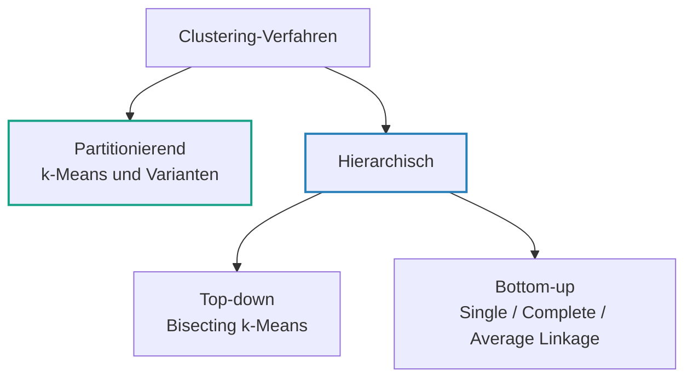
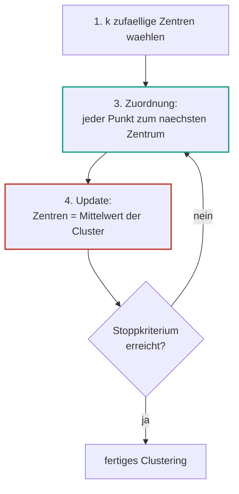
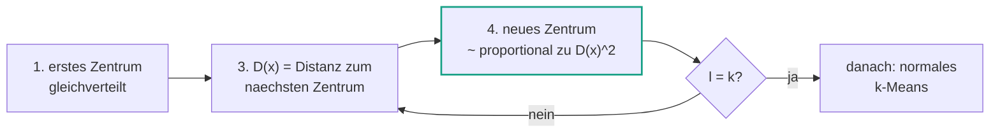
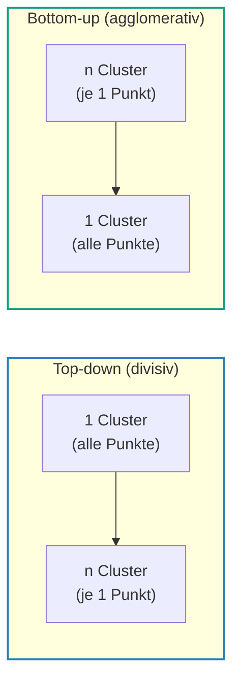
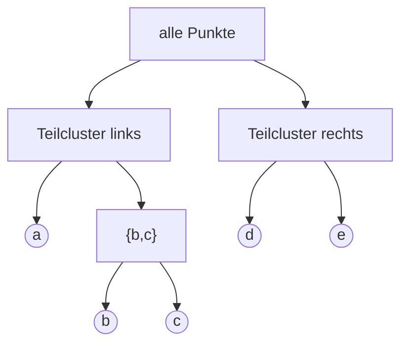
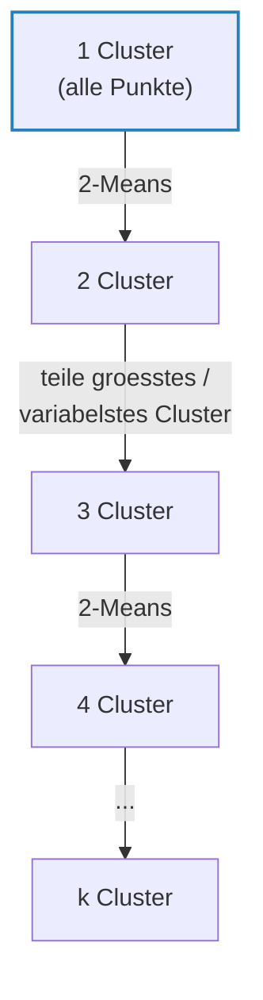
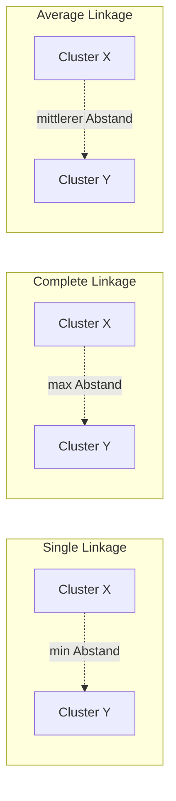

# 08 — Clustering: Algorithmen

**Folien:** [[data-science/resources/08_Clustering_Algorithmen.pdf|08_Clustering_Algorithmen.pdf]]
**Selbstkontrolle:** [[data-science/selbstkontrolle/ds-selbstkontrolle-08|Selbstkontrolle 08]]

## Inhaltsverzeichnis

- [[#Wiederholung|Wiederholung]]
- [[#Clustering|Clustering]]
- [[#Partitionierendes Clustering: k-Means|Partitionierendes Clustering: k-Means]]
- [[#Zusammenhang mit der Zielfunktion (Beweis)|Zusammenhang mit der Zielfunktion (Beweis)]]
- [[#k-Means in der Praxis|k-Means in der Praxis]]
- [[#Schwachstellen von k-Means|Schwachstellen von k-Means]]
- [[#k-Means++ und Varianten|k-Means++ und Varianten]]
- [[#Hierarchisches Clustering|Hierarchisches Clustering]]
- [[#Dendrogramm|Dendrogramm]]
- [[#Bisecting k-Means (top-down)|Bisecting k-Means (top-down)]]
- [[#Agglomeratives Clustering (bottom-up)|Agglomeratives Clustering (bottom-up)]]
- [[#Annahmen der Clusterverfahren|Annahmen der Clusterverfahren]]
- [[#Praktische Hinweise|Praktische Hinweise]]
- [[#Fragen zur Selbstkontrolle|Fragen zur Selbstkontrolle]]

---

## Wiederholung

### Multidimensional Scaling (MDS)

- **Gegeben**: paarweise Distanzen zwischen $n$ Objekten $D = (d_{ij})_{i,j=1}^{n}$
- **Gesucht**: Datenmatrix $\mathbf{X}$ mit Koordinaten fuer jedes Objekt, sodass die Objekte die paarweisen Distanzen aus $D$ haben

**Algorithmus:**
1. Quadriere die Eintraege: $\tilde D = (d_{ij}^2)_{i,j=1}^{n}$
2. Berechne $B \in \mathbb{R}^{n \times n}$ mit $H = I - \tfrac{1}{n} \mathbf{1} \cdot \mathbf{1}^T$ als $B = -\tfrac{1}{2} H \tilde D H$
3. Konstruiere $\mathbf{X}$ durch Eigenwertzerlegung von $B$ (Eigenwerte $\lambda_1 \ge \dots \ge \lambda_p$, Eigenvektoren $v_1, \dots, v_p$): $\mathbf{X} = V \Lambda^{1/2} = (\sqrt{\lambda_1} v_1, \dots, \sqrt{\lambda_p} v_p)$

Die Dimension $p$ waehlt man ueber den **Anteil der erklaerten Distanzen** (Proportion of Distance Matrix Explained, PDME):
$$\text{PDME}(j) = \frac{\lambda_j}{\sum_{i=1}^{n} |\lambda_i|}$$

### Isomap

- **Gegeben**: Datenmatrix $\mathbf{X} \in \mathbb{R}^{n \times p}$
- **Gesucht**: niedrigdimensionale Projektion $\tilde{\mathbf{X}} \in \mathbb{R}^{n \times d}$ mit $d < p$
- **Algorithmus**: (1) Nachbarschaftsgraph ermitteln, (2) paarweise Distanzen auf dem Graph berechnen, (3) MDS auf diese Distanzmatrix $D$ anwenden

### Methoden der multivariaten EDA

1. **Visualisierungen** — Scatter Plot, Parallel Coordinate (PC-)Plot
2. **Zusammenhangsmasse** — Korrelationskoeffizient (Pearson, Spearman), Mutual Information
3. **Dimensionsreduktion** — PCA, MDS, Isomap
4. **Jetzt: Clustering** (auch: Clusteranalyse)

---

## Clustering

> [!quote] Definition (Clusteranalyse)
> **Clusteranalyse** umfasst Methoden, die die Identifizierung von Gruppen (Clustern) **aehnlicher** Datenpunkte in einem Datensatz ermoeglichen. **Clustering** ist die Partition (Einteilung) der Datenpunkte in Gruppen.

Viele Clustering-Verfahren existieren und unterscheiden sich in:
- der Definition von **Aehnlichkeit**
- der Definition von **Gruppen (Clustern)**
- dem **algorithmischen Vorgehen**

### Warum clustern wir Daten?

Um Aussagen ueber **Gruppen in den Daten** zu machen — z.B. ueber Kundensegmente.

> [!example] Beispiel — Kundensegmentierung
> Daten: Alter und jaehrliches Einkommen von 201 Kunden. Ziel: die Kunden zu Segmenten zusammenfassen. Im Scatterplot zeichnen sich mehrere Gruppen ab (junge Kunden mit niedrigem Einkommen, mittlere, aeltere mit hohem Einkommen).

### Wieviele Cluster sind "richtig"?

> [!warning] Achtung
> Cluster-Verfahren finden **immer** Cluster in den Daten — auch wenn keine sinnvolle Struktur existiert. Verschiedene Verfahren liefern unterschiedliche Cluster, weil sie auf unterschiedlichen (teils impliziten) **Annahmen** beruhen.

Bei derselben Punktwolke koennen z.B. sowohl eine 2-Cluster- als auch eine 4-Cluster-Loesung "richtig" sein — es kommt auf den Kontext an. **Wie Partitionen bewertet werden koennen** (sinnvoll / nicht sinnvoll) ist ein aktuelles und im Allgemeinen ungeloestes Forschungsproblem.

In dieser Vorlesung betrachten wir zwei Familien:



---

## Partitionierendes Clustering: k-Means

### Idee partitionierender Verfahren

- Waehle $k$ Clusterzentren
- Update die Clusterzentren **iterativ**
- Die **Anzahl** der Clusterzentren $k$ wird vorgegeben

Wichtige partitionierende Verfahren: $k$-Means (und Varianten $k$-Means++, $k$-Median, $k$-Medoids) sowie EM-Clustering.

> [!warning] Achtung
> $k$-Means ist **nicht** dasselbe wie $k$-**nearest neighbors** (kNN) — nicht verwechseln! kNN ist ein Klassifikationsverfahren, $k$-Means ein Clusteringverfahren.

### Problemstellung

- **Gegeben**: Daten $X_1, \dots, X_n$ und Anzahl der Cluster $k$
- **Gesucht**: Cluster $C_1, \dots, C_k$, die die Daten **partitionieren**:
  - $C_1 \cup \dots \cup C_k = \{X_1, \dots, X_n\}$
  - $C_i \cap C_j = \emptyset$ fuer alle $i \neq j$

**Idee**: Ein Clustering ist gut, wenn die Abstaende der Punkte innerhalb eines Clusters klein sind. Dazu definieren wir die **Intra-Cluster-Variation**:

> [!quote] Definition (Intra-Cluster-Variation)
> $$W(C_i) = \frac{1}{|C_i|} \sum_{x, y \in C_i} \|x - y\|^2$$
> Summe ueber **alle Paare** $x, y$ im Cluster, mit quadriertem euklidischem Abstand $\|x-y\|^2$.

Wir suchen Cluster, die die Summe der Intra-Cluster-Variationen minimieren:
$$\arg\min_{C_1, \dots, C_k} \sum_{i=1}^{k} W(C_i) = \arg\min_{C_1, \dots, C_k} \sum_{i=1}^{k} \frac{1}{|C_i|} \sum_{x, y \in C_i} \|x - y\|^2$$

> [!info] Hinweis
> Dieses Optimierungsproblem ist (NP-)schwer. Deshalb nutzen wir einen **iterativen** Algorithmus, der eine — aber nicht zwangslaeufig die beste — Loesung liefert.

### Der k-Means Algorithmus

> [!quote] Definition (k-Means Algorithmus)
> 1. Waehle $k$ zufaellige Clusterzentren $m_1^{(1)}, \dots, m_k^{(1)}$ aus den Daten.
> 2. Wiederhole bis zum Stoppkriterium:
> 3. **Zuordnung**: Berechne Cluster $C_i^{(t)} = \left\{ X_j : \left\|X_j - m_i^{(t)}\right\|^2 = \min_{i^*=1,\dots,k} \left\|X_j - m_{i^*}^{(t)}\right\|^2 \right\}$
> 4. **Update**: Berechne neue Clusterzentren $m_i^{(t+1)} = \frac{1}{|C_i^{(t)}|} \sum_{X_j \in C_i^{(t)}} X_j$

- **Schritt 3** ordnet jeden Punkt dem **naechstgelegenen** Clusterzentrum zu.
- **Schritt 4** berechnet anschliessend die Clusterzentren als **Mittelwert** der zugeordneten Punkte neu.



> [!example] Beispiel — Ablauf (4 Bilder)
> 1. **Initialisierung** (oben links): zufaellige Clusterzentren (rot).
> 2. Jeder Punkt wird einem Zentrum zugeordnet (Faerbung blau, orange, gruen).
> 3. Update der Zentren: 1. Iteration (oben rechts), 2. Iteration (unten links), 3. Iteration (unten rechts) — die Cluster stabilisieren sich.

---

## Zusammenhang mit der Zielfunktion (Beweis)

**Frage**: Wie haengt der $k$-Means-Algorithmus mit der Zielfunktion zusammen? Es gilt die zentrale Identitaet:
$$\frac{1}{|C_i|} \sum_{x, y \in C_i} \|x - y\|^2 = 2 \sum_{x \in C_i} \|x - m_i\|^2 \tag{1}$$
wobei $m_i = \frac{1}{|C_i|} \sum_{x \in C_i} x$ das Clusterzentrum ist.

> [!tip] Merke
> **Schritt 3** (Zuordnung zum naechsten Zentrum) minimiert die **rechte** Seite von (1) — und damit auch die **linke** Seite, also das urspruengliche Optimierungsproblem. So macht der Algorithmus die Zielfunktion in jedem Schritt kleiner.

### Beweis von (1)

Fuer Skalarprodukte gilt die binomische Formel $\|x - y\|^2 = \|x\|^2 - 2\langle x, y\rangle + \|y\|^2$. Mit dem Trick $x - y = (x - m_i) - (y - m_i)$:
$$\frac{1}{|C_i|} \sum_{x,y \in C_i} \|x-y\|^2 = \frac{1}{|C_i|} \sum_{x,y \in C_i} \|(x - m_i) - (y - m_i)\|^2$$
$$= \underbrace{\frac{1}{|C_i|} \sum_{x,y \in C_i} \|x - m_i\|^2}_{\sum_{x \in C_i} \|x - m_i\|^2} + \underbrace{\frac{1}{|C_i|} \sum_{x,y \in C_i} \|y - m_i\|^2}_{\sum_{y \in C_i} \|y - m_i\|^2} - \underbrace{\frac{2}{|C_i|} \sum_{x,y \in C_i} \langle x - m_i, y - m_i \rangle}_{= \, 0}$$

**Noch zu zeigen**: $\sum_{x,y \in C_i} \langle x - m_i, y - m_i \rangle = 0$. Ausmultiplizieren liefert vier Summen:
$$\sum_{x,y \in C_i} \langle x - m_i, y - m_i \rangle = \sum \langle x, y \rangle - \sum \langle m_i, y \rangle - \sum \langle x, m_i \rangle + \sum \langle m_i, m_i \rangle$$
Jede dieser vier Summen ist gleich $|C_i|^2 \|m_i\|^2$, denn z.B.
$$\sum_{x,y \in C_i} \langle x, y \rangle = \Big\langle \sum_{x \in C_i} x, \sum_{y \in C_i} y \Big\rangle = \langle |C_i| m_i, |C_i| m_i \rangle = |C_i|^2 \langle m_i, m_i \rangle = |C_i|^2 \|m_i\|^2$$
Damit gilt $|C_i|^2\|m_i\|^2 - |C_i|^2\|m_i\|^2 - |C_i|^2\|m_i\|^2 + |C_i|^2\|m_i\|^2 = 0$. $\square$

---

## k-Means in der Praxis

### scikit-learn

```python
from sklearn.cluster import KMeans

X, y = load_data()
model = KMeans(n_clusters=k)
model.fit(X_proj)
pred = model.predict(X_proj)
```

### Kombination mit Dimensionsreduktion

$k$-Means wird **oft mit Dimensionsreduktion kombiniert**, z.B. PCA: hochdimensionale Kurven (etwa Temperaturkurven) werden zuerst auf 2 Hauptkomponenten reduziert, dann darauf geclustert.

### Skalierung der Merkmale

> [!warning] Achtung
> $k$-Means nutzt die **euklidische Distanz**. Merkmale mit grossem Wertebereich dominieren dadurch. Beispiel: Alter 30 vs. 60 ist "naeher" als Einkommen 50 000 vs. 50 031 — obwohl der Altersunterschied inhaltlich grosser ist.

> [!success] Best Practice
> Merkmale vor dem Clustering **skalieren** (z.B. auf $[0,1]$ normieren oder standardisieren), damit alle Merkmale vergleichbar in die Distanz eingehen.

---

## Schwachstellen von k-Means

> [!warning] Achtung — wichtigste Schwachstellen
> - $k$-Means haengt von der **zufaelligen Anfangsinitialisierung** ab → findet **lokale Minima** der Zielfunktion, nicht zwangslaeufig das globale Minimum.
> - Die **Clusteranzahl $k$ muss zu Beginn festgelegt** werden — verschiedene Werte liefern unterschiedliche Cluster.
> - Keine Moeglichkeit, **Ausreisser** in den Daten zu erkennen und getrennt zu behandeln.

> [!success] Best Practice — Empfehlung
> Fuehre $k$-Means mit **unterschiedlichen zufaelligen Initialisierungen** durch und waehle das Ergebnis mit dem **kleinsten Wert der Zielfunktion** (summierte Intra-Cluster-Variation).

> [!example] Beispiel — 6 Wiederholungen
> Bei 6 Laeufen von $k$-Means ergeben sich verschiedene Endergebnisse. Die Zahlen ueber den Abbildungen sind die summierten Intra-Cluster-Variationen (die Zielfunktion). Mehrere Laeufe landen im gleichen guten Minimum (z.B. $235.8$), andere in schlechteren lokalen Minima ($310.9$, $320.9$). Man waehlt das Clustering mit dem kleinsten Wert.

---

## k-Means++ und Varianten

$k$-Means waehlt die initialen Clusterzentren **zufaellig gleichverteilt** — das ist nicht immer sinnvoll. Varianten verbessern Initialisierung bzw. Zentrumsdefinition:

| Variante | Idee |
|---|---|
| **$k$-Means++** | waehlt Clusterzentren **sukzessive** mit einer cleveren, nicht-gleichmaessigen Verteilung |
| **$k$-Median** | nutzt statt des Mittelwerts jeweils den **Median** pro Cluster |
| **$k$-Medoids** | erlaubt als Clusterzentren nur **Punkte aus dem Datensatz** |

### k-Means++ — Initialisierung der Clusterzentren

> [!quote] Definition (k-Means++ Initialisierung)
> 1. Waehle (gleichverteilt) ein zufaelliges Clusterzentrum $m^{(1)}$ aus dem Datensatz.
> 2. Fuer $\ell = 2, \dots, k$:
> 3. Bestimme fuer jeden Punkt $x$ die Distanz zum naechsten bereits gewaehlten Clusterzentrum: $D(x) = \min_{i=1,\dots,\ell-1} \|x - m^{(i)}\|$
> 4. Waehle ein neues Clusterzentrum aus den uebrigen Punkten mit Wahrscheinlichkeit **proportional zu $D^2(x)$**.



> [!tip] Merke
> $k$-Means++ macht es **wahrscheinlicher**, dass die Startzentren weit auseinanderliegen (weil weit entfernte Punkte ein grosses $D^2(x)$ haben). Das fuehrt zu besseren und stabileren Loesungen als die rein zufaellige Initialisierung.

---

## Hierarchisches Clustering

Statt einer einzelnen Partition erzeugt hierarchisches Clustering eine **Hierarchie von Clustern**: von einem Cluster mit $n$ Elementen bis zu $n$ Clustern mit je einem Element. Die Darstellung erfolgt als **Dendrogramm**.

Zwei Richtungen, eine Hierarchie zu erstellen:
- **Top-down**: 1 Cluster $\to$ $n$ Cluster (z.B. **Bisecting k-Means**, iterative Anwendung von 2-Means)
- **Bottom-up** (agglomerativ): $n$ Cluster $\to$ 1 Cluster (z.B. **Single / Complete / Average Linkage**)



---

## Dendrogramm

> [!quote] Definition (Dendrogramm)
> Ein **Dendrogramm** ist die Darstellung einer Clusterhierarchie als **Baum**:
> - Jedes **Blatt** entspricht einem Cluster mit einem Element.
> - Jeder **Knoten** entspricht der Vereinigung seiner Kinder.
> - Die **$y$-Achse** beinhaltet oft Informationen ueber die (Un-)Aehnlichkeit der vereinigten Cluster (Hoehe der Vereinigung).



> [!tip] Merke
> Ein konkretes **Clustering** erhaelt man, indem man das Dendrogramm bei einem bestimmten **Level (Hoehe)** horizontal "abschneidet". Die Anzahl der vom Schnitt durchtrennten Aeste = Anzahl der Cluster. Tiefer Schnitt → mehr Cluster, hoher Schnitt → weniger Cluster.

---

## Bisecting k-Means (top-down)

> [!quote] Definition (Bisecting k-Means)
> Starte mit **einem** Cluster, das alle Punkte enthaelt, und wende iterativ **2-Means** an, um jeweils ein Cluster in zwei zu teilen — bis $k$ Cluster erreicht sind.

**Welches Cluster sollte geteilt werden?** Zwei gaengige Strategien:
- **`largest_cluster`** — das **groesste** Cluster (meiste Punkte)
- **`biggest_inertia`** — das Cluster mit den "**unterschiedlichsten Elementen**", d.h. der groessten Intra-Cluster-Variation



```python
from sklearn.cluster import BisectingKMeans

X, y = load_data()
# strategy in ["largest_cluster", "biggest_inertia"]
model = BisectingKMeans(n_clusters=k, bisecting_strategy=strategy)
pred = model.fit_predict(X)
```

---

## Agglomeratives Clustering (bottom-up)

> [!quote] Definition (Agglomeratives Clustering)
> Starte mit **einem Cluster je Punkt** und kombiniere iterativ die **beiden Cluster mit kleinster Distanz**, bis nur noch ein Cluster uebrig ist.

Die zentrale Frage: **Was ist die Distanz zwischen zwei Mengen (Clustern)?** Diese Definition heisst **Linkage**:

| Linkage | Formel | Bedeutung |
|---|---|---|
| **Single Linkage** | $D(X,Y) = \min_{x \in X, y \in Y} d(x,y)$ | **minimale** Inter-Cluster-Unterschiedlichkeit (kleinster Paarabstand) |
| **Complete Linkage** | $D(X,Y) = \max_{x \in X, y \in Y} d(x,y)$ | **maximale** Inter-Cluster-Unterschiedlichkeit (groesster Paarabstand) |
| **Average Linkage** | $D(X,Y) = \frac{1}{|X| \cdot |Y|} \sum_{x \in X} \sum_{y \in Y} d(x,y)$ | **mittlere** Inter-Cluster-Unterschiedlichkeit (Durchschnitt aller Paarabstaende) |

Berechnung in allen Faellen: bestimme **alle paarweisen Abstaende** ("Unterschiedlichkeiten") $d(x,y)$ fuer $x \in X, y \in Y$, dann nimm das Minimum (Single), Maximum (Complete) bzw. den Mittelwert (Average).



> [!tip] Merke
> **Average und Complete Linkage** erzeugen i.d.R. **ausgewogenere** (balanciertere) Cluster als **Single Linkage**. Single Linkage neigt zum sogenannten *Chaining* — lange, kettenartige Cluster, weil schon ein einziges nahes Paar zwei Cluster verbindet.

```python
from sklearn.cluster import AgglomerativeClustering

X, y = load_data()
# linkage in ['single', 'complete', 'average', 'ward']
model = AgglomerativeClustering(n_clusters=k, linkage=linkage)
pred = model.fit_predict(X)
```

> [!info] Hinweis
> Es gibt **viele weitere** Clusteringverfahren (MiniBatch KMeans, MeanShift, Spectral Clustering, **DBSCAN**, **HDBSCAN**, OPTICS, BIRCH, Gaussian Mixture, ...). Ein scikit-learn-Vergleich zeigt: kein Verfahren ist fuer alle Datenformen optimal — z.B. trennt $k$-Means ineinander verschachtelte Ringe schlecht, dichtebasierte Verfahren (DBSCAN) dagegen gut.

---

## Annahmen der Clusterverfahren

**Welche Annahmen liegen $k$-Means bzw. dem hierarchischen Clustering zugrunde?**

Gemeinsame Grundannahmen:
- Aehnliche Punkte liegen **nahe zusammen**.
- Das **Abstandsmass** ist geeignet, um Aehnlichkeit zu bestimmen.

| Verfahren | spezifische Annahmen |
|---|---|
| **$k$-Means** | Cluster sind (tendenziell) **kugelfoermig**; **keine Ausreisser** in den Daten |
| **Hierarchisches Clustering** | Cluster sind **hierarchisch** — grosse Cluster setzen sich aus kleineren Clustern zusammen |

> [!example] Beispiel — 50 Frauen, 50 Maenner, 3 Nationalitaeten
> Gegeben ein Datensatz mit Messungen von 50 Frauen und 50 Maennern aus 3 Nationalitaeten (Deutsch, Japanisch, Amerikanisch). Die beste 2-Cluster-Partition trennt die **Geschlechter**, die beste 3-Cluster-Partition die **Nationalitaeten**.
> Welches Verfahren hat das erzeugt? **$k$-Means** — denn die Cluster sind **nicht hierarchisch**: die 3 Nationalitaeten-Cluster resultieren **nicht** aus der Teilung der 2 Geschlechter-Cluster. Ein hierarchisches Verfahren wuerde die 3-Cluster-Loesung durch Aufspalten der 2-Cluster-Loesung erzeugen.

---

## Praktische Hinweise

> [!success] Best Practice — Vorgehen bei der Cluster-Analyse
> 1. **Passendes Distanzmass** waehlen ("Unterschiedlichkeitsmass").
> 2. **Vorverarbeitung** der Daten — insbesondere den Einfluss einer **Skalierung** der Merkmale auf die Cluster ueberpruefen.
> 3. **Wahl der Cluster** — den Einfluss der Clusteranzahl auf die Cluster untersuchen.
> 4. **Interpretation** der Ergebnisse.

> [!tip] Merke
> Die Cluster-Analyse ist haeufig der **Startpunkt** einer Datenanalyse, **nicht das Endergebnis**.

---

## Fragen zur Selbstkontrolle

Die kompakten Karteikarten finden sich unter [[data-science/selbstkontrolle/ds-selbstkontrolle-08|Selbstkontrolle 08]]. Im Folgenden ausfuehrliche Antworten zur Pruefungsvorbereitung.

**Warum wollen wir Daten clustern?**

Um Aussagen ueber **Gruppen in den Daten** zu machen, z.B. Kundensegmente. Clustering teilt einen Datensatz in Gruppen aehnlicher Datenpunkte ein und macht so verborgene Struktur sichtbar. Es ist meist der **Startpunkt** einer Analyse.

**Was ist der Unterschied zwischen partitionierenden und hierarchischen Clusterverfahren?**

- **Partitionierend** (z.B. $k$-Means): erzeugt **eine** flache Partition in genau $k$ Cluster; $k$ muss vorgegeben werden.
- **Hierarchisch**: erzeugt eine ganze **Hierarchie** von Clustern (Dendrogramm), aus der man durch Abschneiden bei einem Level eine beliebige Clusterzahl ablesen kann. Top-down (Bisecting k-Means) oder bottom-up (agglomerativ).

**Welche Groesse wollen wir mit k-Means minimieren?**

Die Summe der **Intra-Cluster-Variationen**:
$$\arg\min_{C_1,\dots,C_k} \sum_{i=1}^{k} \frac{1}{|C_i|} \sum_{x,y \in C_i} \|x-y\|^2$$
Aequivalent (Faktor 2) die Summe der quadrierten Abstaende der Punkte zu ihrem Clusterzentrum $\sum_i \sum_{x \in C_i} \|x - m_i\|^2$.

**Wie funktioniert der k-Means Algorithmus?**

1. Waehle $k$ zufaellige Clusterzentren aus den Daten.
2. Wiederhole bis zum Stoppkriterium: **(3) Zuordnung** — jeder Punkt zum naechstgelegenen Zentrum; **(4) Update** — jedes Zentrum als Mittelwert der ihm zugeordneten Punkte neu berechnen.

Schritt 3 minimiert die rechte Seite von $\frac{1}{|C_i|}\sum_{x,y}\|x-y\|^2 = 2\sum_x \|x-m_i\|^2$ und damit die Zielfunktion.

**Was sind Nachteile von k-Means?**

- Abhaengig von der **zufaelligen Initialisierung** → nur lokale Minima.
- $k$ muss **vorab** festgelegt werden.
- **Keine** Ausreissererkennung.
- Setzt **kugelfoermige** Cluster und eine sinnvolle euklidische Distanz voraus (sensibel gegenueber Skalierung). Abhilfe: mehrere Laeufe, kleinstes Zielfunktionsergebnis waehlen; Merkmale skalieren.

**Wie unterscheidet sich k-Means++ von k-Means?**

Nur in der **Initialisierung**. $k$-Means waehlt alle Startzentren zufaellig gleichverteilt. $k$-Means++ waehlt sie **sukzessive**: nach einem zufaelligen ersten Zentrum wird jeder weitere Startpunkt mit Wahrscheinlichkeit **proportional zu $D^2(x)$** gezogen (Distanz zum naechsten bereits gewaehlten Zentrum). So liegen die Startzentren tendenziell weit auseinander → bessere, stabilere Loesungen.

**Was ist der Unterschied zwischen Top-Down und Bottom-Up Clusterverfahren? Was sind jeweils Beispiele?**

- **Top-down (divisiv)**: startet mit **einem** Cluster (alle Punkte) und teilt iterativ auf → Beispiel **Bisecting k-Means** (iterative 2-Means).
- **Bottom-up (agglomerativ)**: startet mit **einem Cluster je Punkt** und verschmilzt iterativ die naechsten Cluster → Beispiel **Single / Complete / Average Linkage**.

**Wie erhalten wir aus einem Dendrogramm ein Clustering?**

Durch **horizontales Abschneiden** bei einer bestimmten Hoehe (Level). Jeder vom Schnitt durchtrennte Ast entspricht einem Cluster. Tieferer Schnitt → mehr Cluster, hoeherer Schnitt → weniger Cluster.

**Wie funktioniert Bisecting k-Means?**

Top-down: Start mit einem Cluster aus allen Punkten; wiederholt wird ein Cluster mit **2-Means** in zwei geteilt, bis $k$ Cluster vorliegen. Geteilt wird je nach Strategie das **groesste** Cluster (`largest_cluster`) oder das Cluster mit der **groessten Intra-Cluster-Variation** (`biggest_inertia`).

**Wie funktioniert agglomeratives Clustering?**

Bottom-up: Start mit einem Cluster je Punkt; in jedem Schritt werden die **beiden Cluster mit der kleinsten Distanz** (gemaess Linkage) verschmolzen, bis nur ein Cluster bleibt. Das Ergebnis ist ein Dendrogramm.

**Was ist der Unterschied zwischen Single, Complete und Average Linkage?**

Es ist die Definition der **Distanz zwischen zwei Clustern** $X, Y$:
- **Single**: $\min_{x,y} d(x,y)$ — kleinster Paarabstand (neigt zu Chaining/Ketten).
- **Complete**: $\max_{x,y} d(x,y)$ — groesster Paarabstand.
- **Average**: $\frac{1}{|X||Y|}\sum_{x,y} d(x,y)$ — mittlerer Paarabstand.

Average und Complete erzeugen i.d.R. **ausgewogenere** Cluster als Single.

**Auf welchen Annahmen basieren die unterschiedlichen Clusterverfahren?**

Gemeinsam: aehnliche Punkte liegen nahe zusammen, das Abstandsmass ist geeignet. $k$-Means zusaetzlich: Cluster sind (tendenziell) **kugelfoermig**, keine Ausreisser. Hierarchisches Clustering zusaetzlich: Cluster sind **hierarchisch** (grosse Cluster aus kleineren zusammengesetzt).

**Welches ist das beste Clusterverfahren?**

Es gibt **kein** universell bestes Verfahren. Jedes beruht auf anderen Annahmen und ist fuer andere Datenstrukturen geeignet — z.B. trennt $k$-Means kugelfoermige Cluster gut, aber verschachtelte Ringe schlecht, waehrend dichtebasierte Verfahren (DBSCAN) dort besser sind. Die Wahl haengt von Daten und Ziel ab; die Bewertung von Partitionen ist ein offenes Forschungsproblem.
