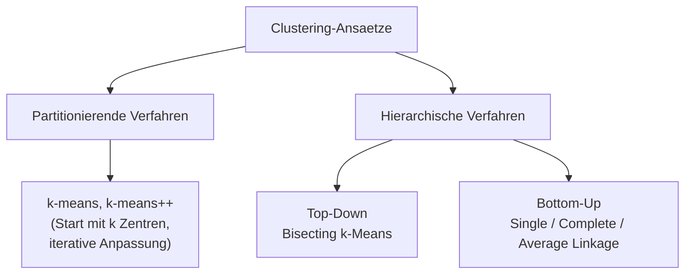
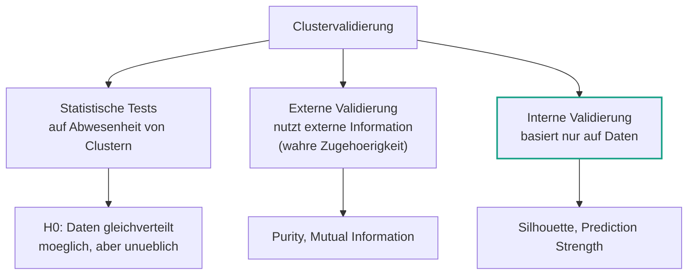
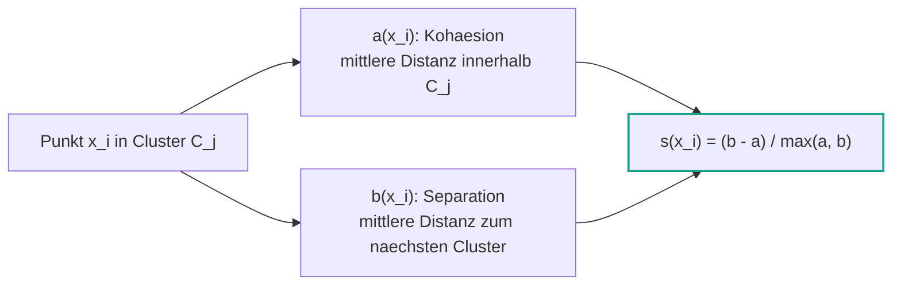
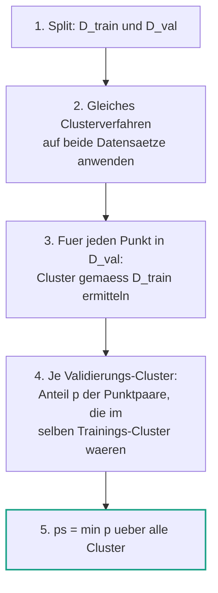

# 09 — Clustering: Validierung

**Folien:** [[data-science/resources/09_Cluster_Validierung.pdf|09_Cluster_Validierung.pdf]]
**Selbstkontrolle:** [[data-science/selbstkontrolle/ds-selbstkontrolle-09|Selbstkontrolle 09]]

## Inhaltsverzeichnis

- [[#Wiederholung Clustering|Wiederholung Clustering]]
- [[#Warum Clustervalidierung|Warum Clustervalidierung]]
- [[#Drei Arten der Validierung|Drei Arten der Validierung]]
- [[#Externe Clustervalidierung|Externe Clustervalidierung]]
- [[#Interne Clustervalidierung|Interne Clustervalidierung]]
- [[#Silhouette|Silhouette]]
- [[#Prediction Strength|Prediction Strength]]
- [[#Fragen zur Selbstkontrolle|Fragen zur Selbstkontrolle]]

---

## Wiederholung Clustering

### Clusteranalyse vs. Clustering

- **Clusteranalyse**: Methoden, die die Identifizierung von Gruppen (**Clustern**) *aehnlicher* Datenpunkte in einem Datensatz ermoeglichen — z.B. um Aussagen ueber Kundensegmente zu machen.
- **Clustering**: die konkrete **Partition** (Einteilung) der Datenpunkte in Gruppen.

### Ansaetze

- **Partitionierende Verfahren**: Beginne mit $k$ Clusterzentren und passe sie iterativ an ($k$-means, $k$-means++).
- **Hierarchische Verfahren**: Erstelle eine Hierarchie von Clustern (Dendrogramm) — von einem Cluster mit $n$ Elementen zu $n$ Clustern mit je einem Element.

### $k$-Means

> [!quote] Definition ($k$-Means Zielfunktion)
> $$\arg\min_{C_1, \dots, C_k} \sum_{i=1}^{k} \frac{1}{|C_i|} \sum_{x, y \in C_i} \|x - y\|^2$$

**Algorithmus** (gegeben: Daten $X_1, \dots, X_n$ und Anzahl Cluster $k$):
1. Waehle $k$ zufaellige Clusterzentren $m_1^{(1)}, \dots, m_k^{(1)}$ aus den Daten.
2. Wiederhole bis Stoppkriterium erreicht:
   - **Zuordnung**: $C_i^{(t)} = \{ X_j : \|X_j - m_i^{(t)}\|^2 = \min_{i^*=1,\dots,k} \|X_j - m_{i^*}^{(t)}\|^2 \}$
   - **Update**: $m_i^{(t+1)} = \frac{1}{|C_i^{(t)}|} \sum_{X_j \in C_i^{(t)}} X_j$

### Hierarchisches Clustering

- **Bisecting $k$-Means (top-down)**: Starte mit einem Cluster, das alle Punkte enthaelt, und wende **2-Means iterativ** an. Geteilt wird entweder das groesste Cluster oder das Cluster mit den "unterschiedlichsten Elementen" (groesste Intra-Cluster-Variation).
- **Agglomeratives Clustering (bottom-up)**: Starte mit einem Cluster je Punkt und kombiniere iterativ die beiden Cluster mit kleinster Distanz. Die Distanz zwischen zwei Mengen $X, Y$:

| Linkage | Distanz $D(X, Y)$ |
|---|---|
| **Single Linkage** | $\min_{x \in X, y \in Y} d(x, y)$ |
| **Complete Linkage** | $\max_{x \in X, y \in Y} d(x, y)$ |
| **Average Linkage** | $\frac{1}{|X| \cdot |Y|} \sum_{x \in X} \sum_{y \in Y} d(x, y)$ |

---

## Warum Clustervalidierung

> [!warning] Achtung
> Cluster-Verfahren finden **immer** Cluster in den Daten — auch in voellig zufaelligen, gleichverteilten Daten. $k$-Means mit $k = 6$ liefert auch fuer reines Rauschen 6 "Cluster".

Daraus folgt die zentrale Frage: **Welches Clustering ist sinnvoll, welches nicht?**

- **Clustervalidierungsverfahren** bewerten die **Qualitaet** eines Clusterings.
- Das ermoeglicht die **Wahl von Hyperparametern** (z.B. der Clusteranzahl $k$).

> [!info] Hinweis
> **Hyperparameter** sind Parameter, die das Modell beschreiben, aber nicht geschaetzt werden muessen. Beim $k$-Means ist die Anzahl der Cluster $k$ ein Hyperparameter — die Clusterzentren $m^{(1)}, \dots, m^{(k)}$ sind es **nicht** (sie werden gelernt).

> [!tip] Merke
> Es gibt viele publizierte Validierungsverfahren, aber **keine endgueltige Empfehlung** fuer eine Methode (Everitt et al., *Cluster Analysis*, Wiley 2011). Clustervalidierung ist aktueller Forschungsgegenstand.

---

## Drei Arten der Validierung

1. **Statistische Tests auf Abwesenheit von Clustern** — moeglich, aber unueblich. Nullhypothese z.B. $H_0$: Daten sind gleichverteilt. Es gilt: *Daten sind nicht gleichverteilt* $\Leftrightarrow$ *Es gibt Cluster*.
2. **Externe Clustervalidierung** — Kriterien, die auf **externen Informationen** ueber die "wahre" Clusterzugehoerigkeit (ground truth) basieren.
3. **Interne Clustervalidierung** — Kriterien, die **nur auf den Daten** basieren.

> [!info] Hinweis
> Wenn es eine **wahre** Gruppenzugehoerigkeit gibt, spricht man in der Regel von **Klassifikation**, nicht von Clustering. Clustering ist **explorativ**: die wahre Zugehoerigkeit wird *nicht* fuer den Algorithmus benutzt, sondern nur zur **Bewertung** der Cluster — vergleichbar mit Testdaten beim supervised learning.

---

## Externe Clustervalidierung

Nutzt externe Information (ground truth). Wir betrachten zwei Ansaetze: **Purity** und **Mutual Information**. Gegeben Cluster $C_1, \dots, C_k$ und wahre Cluster $T_1, \dots, T_k$ (ground truth), $n_i = |C_i|$ Anzahl der Elemente in Cluster $i$.

### Purity

**Purity** misst die **Reinheit** von Clustern.

> [!quote] Definition (Purity)
> Reinheit eines einzelnen Clusters $i$:
> $$\text{purity}_i = \frac{1}{n_i} \max_{j=1}^{k} |C_i \cap T_j|$$
> Gesamt-Purity:
> $$\text{purity} = \sum_{i=1}^{k} \frac{n_i}{n} \, \text{purity}_i = \frac{1}{n} \sum_{i=1}^{k} \max_{j=1}^{k} |C_i \cap T_j|$$

- $\text{purity}_i = 1$, wenn $C_i$ nur Punkte **eines** wahren Clusters $T_j$ enthaelt.
- $\text{purity} = 1$, wenn **alle** Cluster $C_i$ nur Punkte eines wahren Clusters enthalten.
- Wertebereich: $\text{purity} \in (0, 1]$, bester Wert $1$.

> [!warning] Achtung
> Eine Purity von $1$ ist **trivial erreichbar** und daher allein kein gutes Qualitaetsmass:
> 1. Falls es nur **ein** wahres Cluster $T$ gibt: mit **jedem** Vorgehen.
> 2. Ansonsten: indem man **ein Cluster je Punkt** bildet (jeder Singleton ist rein).

### Mutual Information

**Mutual Information** misst die **Aehnlichkeit zwischen den Partitionen** $C$ und $T$.

> [!quote] Definition (Mutual Information zweier Partitionen)
> $$I(C, T) = \sum_{i, j} p_{ij} \log_2 \left( \frac{p_{ij}}{p_{C_i} \, p_{T_j}} \right)$$
> mit
> - $p_{ij} = \frac{|C_i \cap T_j|}{n}$ — W'keit, dass ein Punkt zu $C_i$ **und** $T_j$ gehoert
> - $p_{C_i} = \frac{|C_i|}{n}$ — W'keit, dass ein Punkt zu $C_i$ gehoert
> - $p_{T_j} = \frac{|T_j|}{n}$ — W'keit, dass ein Punkt zu $T_j$ gehoert

- Bekannt bereits aus der multivariaten EDA ([[data-science/lectures/05/ds-05-multivariate-eda|Mehrdimensionale EDA]]).
- **Je groesser** die Mutual Information, desto **aehnlicher** sind $C$ und $T$ — also desto besser passt das Clustering zur ground truth.

---

## Interne Clustervalidierung

Basiert **nur auf den Daten** (keine ground truth noetig).

> [!tip] Merke
> Interne Validierung ist **haeufig die einzige Moeglichkeit** (ground truth ist normalerweise nicht bekannt) und in der Praxis **am weitesten verbreitet**.

Wir betrachten zwei Ansaetze: **Silhouette / Silhouette Plots** und **Prediction Strength**.

---

## Silhouette

(Rousseeuw, *J. Comp. Appl. Math.* 20, 53–65, 1987)

### Idee

Der **Silhouettenindex** misst, wie gut ein **einzelner Punkt** geclustert wurde. Genauer: er misst die **Aehnlichkeit** eines Punktes zu den anderen Punkten in seinem Cluster (**Kohaesion**) in Relation zur **Unaehnlichkeit** mit Punkten anderer Cluster (**Separation**).

### Kohaesion und Separation

Seien $C_1, \dots, C_k$ Cluster, $x_i \in C_j$ und $d(x_i, x_j)$ der (euklidische) Abstand zwischen $x_i$ und $x_j$.

> [!quote] Definition (Kohaesion und Separation)
> **Kohaesion** — mittlere Distanz von $x_i$ zu allen anderen Punkten im **eigenen** Cluster $C_j$ (misst Aehnlichkeit):
> $$a(x_i) = \frac{1}{|C_j| - 1} \sum_{x \in C_j, \, x \neq x_i} d(x_i, x) \quad \text{fuer } |C_j| > 1$$
> **Separation** — mittlere Distanz von $x_i$ zu allen Punkten im **naechsten** Cluster (misst Unaehnlichkeit):
> $$b(x_i) = \min_{k \neq j} \frac{1}{|C_k|} \sum_{x \in C_k, \, x \neq x_i} d(x_i, x)$$

### Silhouettenindex

> [!quote] Definition (Silhouettenindex)
> $$s(x_i) = \begin{cases} 1 - \dfrac{a(x_i)}{b(x_i)}, & \text{falls } |C_j| > 1 \text{ und } a(x_i) < b(x_i) \\[2mm] 0, & \text{falls } |C_j| = 1 \text{ oder } a(x_i) = b(x_i) \\[2mm] \dfrac{b(x_i)}{a(x_i)} - 1, & \text{falls } |C_j| > 1 \text{ und } a(x_i) > b(x_i) \end{cases} \;=\; \frac{b(x_i) - a(x_i)}{\max\{a(x_i), b(x_i)\}}$$

Wertebereich: $s(x_i) \in [-1, 1]$.

| Fall | Bedeutung |
|---|---|
| $s(x_i) \to 1$ | **Gut**: $x_i$ ist aehnlicher zu Punkten im eigenen Cluster als zu Punkten anderer Cluster |
| $s(x_i) = 0$ | **Nicht eindeutig** (Singleton oder $a = b$) |
| $s(x_i) \to -1$ | **Schlecht**: $x_i$ liegt im Mittel naeher an Punkten eines anderen Clusters |

> [!example] Beispiel
> Gegeben zwei Cluster $C_1, C_2$ und $x_i \in C_1$. Wird $x_i$ stattdessen $C_2$ zugeordnet, so kippt $s(x_i) \to -s(x_i)$ (Kohaesion und Separation tauschen die Rollen).

### Mittlerer Silhouettenindex

> [!quote] Definition (Aggregierte Silhouette)
> **Average silhouette width** — bewertet **einzelne Cluster** $C_j$:
> $$\bar{s}_j = \frac{1}{|C_j|} \sum_{x \in C_j} s(x)$$
> **Silhouette Score** — bewertet **alle Cluster** zusammen:
> $$\bar{s} = \frac{1}{n} \sum_{i=1}^{n} s(x_i)$$

### Silhouettenplot

Der **Silhouettenplot** ist die visuelle Darstellung der Silhouettenindizes fuer den gesamten Datensatz:
- nach Clusterzugehoerigkeit **gruppiert** und je Cluster in **absteigender Groesse** sortiert,
- erlaubt eine visuelle Einschaetzung der Clusterqualitaet (breite Balken mit hohen Werten = gut; Balken links der mittleren Linie = schlecht zugeordnete Punkte).

### Wahl der Clusteranzahl

Den Silhouette Score fuer verschiedene $k$ berechnen und das $k$ mit dem **maximalen** Score waehlen.

> [!example] Beispiel — synthetischer Datensatz
> Fuer einen Datensatz mit vier kugelfoermigen Gruppen ergibt der Silhouette Score sein Maximum bei $k = 4$ — die korrekte Clusteranzahl.

> [!warning] Achtung
> Silhouettenplots und Silhouette Score nehmen Cluster als (tendenziell) **kugelfoermig** an. Bei nicht-konvexen Strukturen (z.B. zwei ineinander liegende Ringe, mit single linkage korrekt geclustert) zeigt der Silhouette Score die **richtige** Clusteranzahl **nicht** an — er steigt einfach mit $k$ weiter an.

---

## Prediction Strength

(Tibshirani et al., *J. Comput. Graph. Stat.* 14, 511–528, 2005)

### Idee

> [!tip] Merke
> Die Clusterqualitaet ist hoch, wenn die Clusterzugehoerigkeit auf **anderen Realisierungen** der Daten zuverlaessig **vorhergesagt** werden kann. Das Vorgehen entspricht dem Hyperparameter-Tuning bzw. der Model Selection im supervised learning.

### Algorithmus

1. Teile die Daten in **Trainings-** und **Validierungsdaten**: $\mathcal{D}_{\text{train}} \cap \mathcal{D}_{\text{val}} = \emptyset$ und $\mathcal{D}_{\text{train}} \cup \mathcal{D}_{\text{val}} = \mathcal{D}$.
2. Wende **dasselbe** Clusterverfahren auf **beide** Datensaetze an.
3. Ermittle fuer alle Punkte in den Validierungsdaten das Cluster **gemaess den Trainingsdaten** (Trainingsmodell sagt die Zugehoerigkeit der Validierungspunkte vorher).
4. Bestimme fuer jedes "Validierungs"-Cluster den Anteil $p$ aller Paare von Punkten, die auch im **selben** "Trainings"-Cluster waeren.
5. Der **kleinste** Wert von $p$ ueber alle Cluster heisst **prediction strength**.

> [!info] Hinweis
> Wie ein Punkt $x$ einem Cluster gemaess $\mathcal{D}_{\text{train}}$ zugeordnet wird, **haengt vom Clusterverfahren ab** — es kodiert die Vorstellung davon, was ein Cluster ist:
> - **$k$-Means**: Cluster tendenziell kugelfoermig; Clusterzentren definieren die Zugehoerigkeit (Punkt → naechstes Zentrum); Cluster sind **Polygone** (Voronoi-Regionen).
> - **Single Linkage**: $x$ wird dem Cluster mit der **minimalen** (euklidischen) Distanz zugeordnet.
> - **Average Linkage**: $x$ wird dem Cluster mit der **mittleren** (euklidischen) Distanz zugeordnet.

### Formale Definition

> [!quote] Definition (Prediction Strength)
> Seien $C_1, \dots, C_k$ die Cluster auf $\mathcal{D}_{\text{train}}$ und $A_1, \dots, A_k$ die Cluster auf $\mathcal{D}_{\text{val}}$ mit $n' = |\mathcal{D}_{\text{val}}|$. Die **Ko-Mitgliedschaftsmatrix** $M \in \mathbb{R}^{n' \times n'}$:
> $$M_{ij} = \begin{cases} 1, & \text{falls } \exists k : x_i, x_j \in C_k \\ 0, & \text{sonst} \end{cases}$$
> ($M_{ij} = 1$, falls die Validierungspunkte $x_i, x_j$ zum **selben** Cluster der Trainingsdaten gehoeren.)
> $$\text{ps}(k) = \min_{\ell = 1, \dots, k} \frac{1}{|A_\ell| (|A_\ell| - 1)} \sum_{x_i, x_j \in A_\ell : \, x_i \neq x_j} M_{ij}$$
> (Summe ueber alle Paare im Validierungs-Cluster $A_\ell$.)

> [!example] Beispiel — $k$-Means, $k = 4$
> Fuer die vier Validierungs-Cluster ergibt sich: blau $p = 1$, orange $p = 1$, gruen $p = 1$, rot $p = \frac{4}{10}$ (bei $n_{\text{rot,val}} = 5$ Punkten gibt es $n_{\text{Paare}} = \frac{5 \cdot 4}{2} = 10$ Paare). Das Minimum bestimmt: $\text{prediction strength} = \frac{4}{10}$.

### Wahl der Clusteranzahl

> [!tip] Merke
> Die "optimale" Clusteranzahl $k$ ist der **groesste** Wert von $k$, fuer den die Prediction Strength (noch) maximal ist.

- Es gilt stets $\text{ps}(1) = 1$ — bei nur einem Cluster gehoeren trivialerweise alle Paare zum selben Cluster.
- Haeufig werden die Daten in **80 %** Training und **20 %** Validierung aufgeteilt.
- Alternativ: **Cross Validation** statt eines einzelnen Train-Test-Splits.

---

## Fragen zur Selbstkontrolle

Die kompakten Karteikarten finden sich unter [[data-science/selbstkontrolle/ds-selbstkontrolle-09|Selbstkontrolle 09]]. Im Folgenden ausfuehrliche Antworten zur Pruefungsvorbereitung.

**Wozu benutzen wir Clustervalidierungsverfahren?**

Cluster-Verfahren finden **immer** Cluster — auch in zufaelligen Daten. Clustervalidierungsverfahren bewerten die **Qualitaet** eines Clusterings: Sie beantworten, welches Clustering sinnvoll ist und welches nicht, und ermoeglichen so die **Wahl von Hyperparametern** (insbesondere der Clusteranzahl $k$).

**Wie unterscheiden sich interne und externe Clustervalidierung?**

- **Externe** Validierung nutzt **externe Information** ueber die wahre Clusterzugehoerigkeit (ground truth) — z.B. Purity und Mutual Information.
- **Interne** Validierung basiert **nur auf den Daten** (keine ground truth) — z.B. Silhouette und Prediction Strength.
- Interne Validierung ist in der Praxis am weitesten verbreitet, da die ground truth meist nicht bekannt ist. (Gibt es eine wahre Zugehoerigkeit, spricht man ohnehin meist von Klassifikation statt Clustering.)

**Was ist die Purity eines Clusterings?**

Die Purity misst die **Reinheit** der Cluster gegen eine ground truth $T_1, \dots, T_k$:
$$\text{purity} = \frac{1}{n} \sum_{i=1}^{k} \max_{j=1}^{k} |C_i \cap T_j|$$
Jedes gefundene Cluster $C_i$ wird dem haeufigsten wahren Cluster zugeordnet; gezaehlt werden die "richtig" zusammengefassten Punkte.

**In welchem Wertebereich liegt die Purity? Was ist der beste Wert?**

$\text{purity} \in (0, 1]$. Der **beste** Wert ist $1$ (jedes Cluster enthaelt nur Punkte eines wahren Clusters). Vorsicht: $\text{purity} = 1$ ist trivial erreichbar (nur ein wahres Cluster; oder ein Cluster je Punkt) — daher kein alleinstehendes Qualitaetsmass.

**Sind grosse oder kleine Werte der Mutual Information zu bevorzugen?**

**Grosse** Werte. Mutual Information $I(C, T)$ misst die Aehnlichkeit der Partitionen $C$ und $T$ — je groesser, desto besser passt das Clustering zur ground truth.

**Was misst der Silhouettenindex?**

Wie gut ein **einzelner Punkt** $x_i$ geclustert wurde: die **Kohaesion** $a(x_i)$ (mittlere Distanz innerhalb des eigenen Clusters) in Relation zur **Separation** $b(x_i)$ (mittlere Distanz zum naechsten Cluster):
$$s(x_i) = \frac{b(x_i) - a(x_i)}{\max\{a(x_i), b(x_i)\}}$$

**In welchem Wertebereich liegt der Silhouettenindex? Was ist der beste Wert?**

$s(x_i) \in [-1, 1]$. Der **beste** Wert ist $1$ ($a(x_i) \ll b(x_i)$, also der Punkt ist sehr aehnlich zum eigenen Cluster und unaehnlich zu anderen).

**Wann ist der Silhouettenindex negativ? Was bedeutet das fuer die Cluster?**

$s(x_i) < 0$ gilt, wenn $a(x_i) > b(x_i)$ — der Punkt liegt **im Mittel naeher an einem anderen Cluster** als an seinem eigenen. Das bedeutet: er ist (vermutlich) **falsch zugeordnet** und waere in einem anderen Cluster besser aufgehoben.

**Welche implizite Annahme liegt dem Silhouettenindex zugrunde?**

Dass Cluster **(tendenziell) kugelfoermig** (konvex/kompakt) sind. Bei nicht-konvexen Strukturen (z.B. ineinander liegende Ringe) versagt der Silhouette Score — er zeigt die richtige Clusteranzahl nicht an, sondern steigt mit $k$ weiter.

**Wie wird die Prediction Strength bestimmt?**

1. Split in $\mathcal{D}_{\text{train}}$ und $\mathcal{D}_{\text{val}}$. 2. Gleiches Clusterverfahren auf beide. 3. Validierungspunkte gemaess Trainingsmodell zuordnen. 4. Je Validierungs-Cluster den Anteil $p$ der Paare bestimmen, die auch im selben Trainings-Cluster lägen. 5. $\text{ps}(k) = \min_\ell p$ — das **Minimum** ueber alle Cluster. Formal mit der Ko-Mitgliedschaftsmatrix $M$:
$$\text{ps}(k) = \min_{\ell} \frac{1}{|A_\ell| (|A_\ell| - 1)} \sum_{x_i, x_j \in A_\ell : \, x_i \neq x_j} M_{ij}$$

**Warum gilt fuer die Prediction Strength $\text{ps}(1) = 1$?**

Bei $k = 1$ gibt es nur ein einziges Cluster. Dann gehoeren trivialerweise **alle** Punktpaare zum selben Cluster, also ist $M_{ij} = 1$ fuer alle Paare und $p = 1$ — somit auch das Minimum $\text{ps}(1) = 1$.

**Wie erhalten wir mit Hilfe der Prediction Strength die optimale Anzahl Cluster?**

Man waehlt den **groessten** Wert von $k$, fuer den die Prediction Strength (noch) **maximal** bzw. hoch genug ist. (Da $\text{ps}(1) = 1$ trivial ist, sucht man das groesste nicht-triviale $k$ mit hoher Prediction Strength.) Haeufig: 80/20-Split, alternativ Cross Validation.
