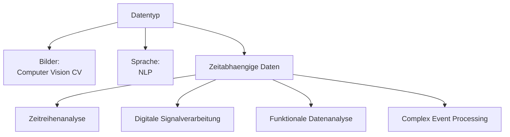
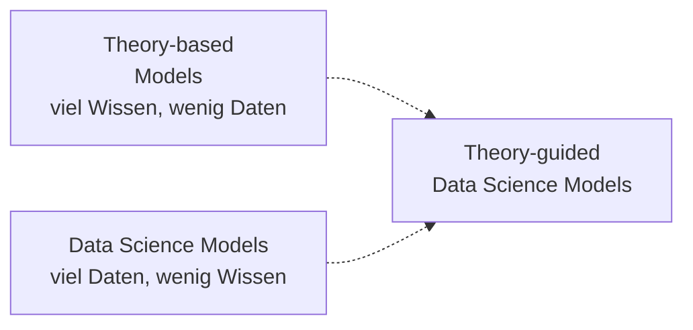
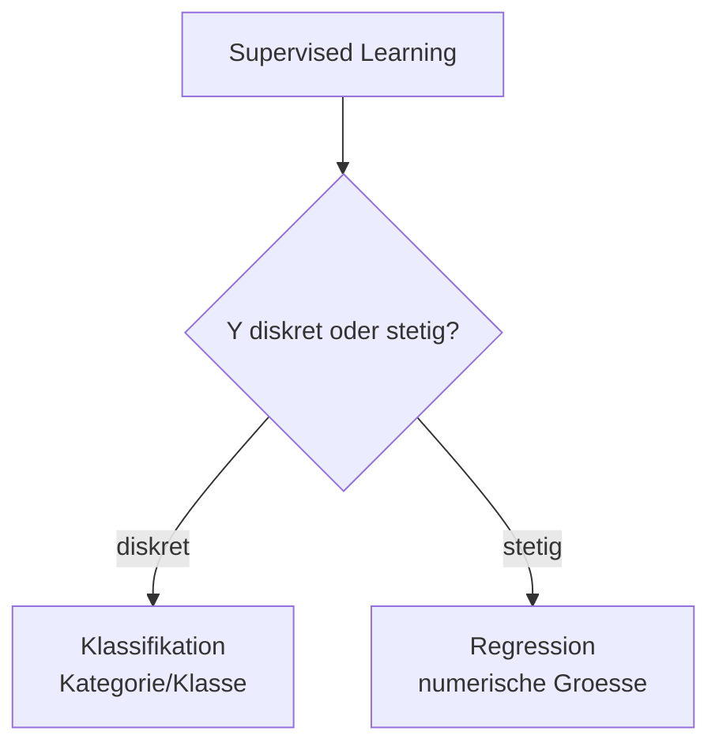
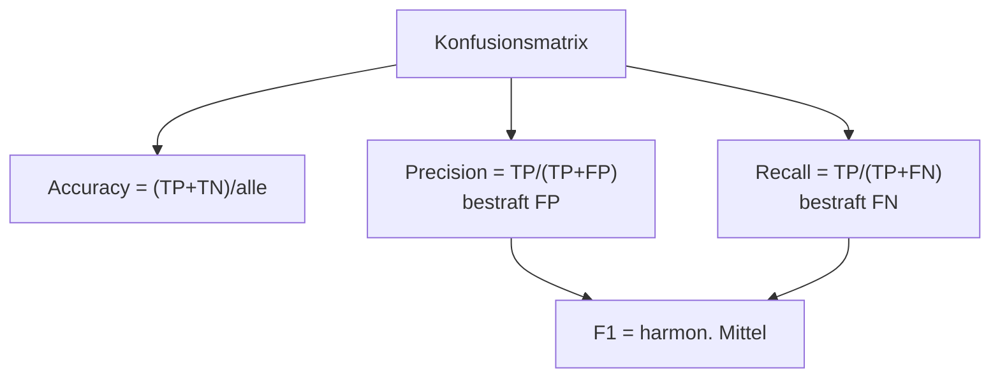
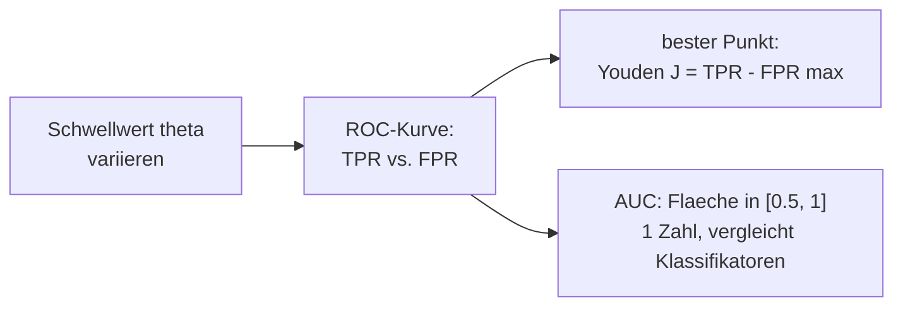

# 11 — Feature Engineering & Datengetriebene Modelle

**Folien:** [[data-science/resources/11_Feature_Eng_Modellierung.pdf|11_Feature_Eng_Modellierung.pdf]]
**Selbstkontrolle:** [[data-science/selbstkontrolle/ds-selbstkontrolle-11|Selbstkontrolle 11]]

## Inhaltsverzeichnis

- [[#Einordnung im Data-Science-Prozess|Einordnung im Data-Science-Prozess]]
- [[#Wiederholung — Clustervalidierung|Wiederholung — Clustervalidierung]]
- [[#Feature Engineering|Feature Engineering]]
- [[#Datengetriebene vs. theoriebasierte Modellierung|Datengetriebene vs. theoriebasierte Modellierung]]
- [[#Datengetriebene Modellierung|Datengetriebene Modellierung]]
- [[#Supervised Learning|Supervised Learning]]
- [[#Binaere Klassifikation|Binaere Klassifikation]]
- [[#Beurteilung eines Klassifikators|Beurteilung eines Klassifikators]]
- [[#ROC-Kurve und AUC|ROC-Kurve und AUC]]
- [[#Mehrklassen-Klassifikation und kNN|Mehrklassen-Klassifikation und kNN]]
- [[#Fragen zur Selbstkontrolle|Fragen zur Selbstkontrolle]]

---

## Einordnung im Data-Science-Prozess

Der Data-Science-Prozess besteht aus vier Phasen. Diese Vorlesung deckt die beiden letzten ab: **Feature Engineering** und **Modellierung & Praediktion**.


---

## Wiederholung — Clustervalidierung

### Ansaetze der Clustervalidierung

Clustervalidierung bewertet Clusterings und ermoeglicht **Hyperparameter-Tuning** (z.B. die Wahl von $k$).

1. **Statistische Tests** auf Abwesenheit von Clustern (eher unueblich)
2. **Externe Clustervalidierung** — basiert auf Informationen ueber "wahre" Cluster. Beispiele: Purity, Mutual Information
3. **Interne Clustervalidierung** — Beispiele: Silhouette (Plots), Prediction Strength

$$\text{purity} = \frac{1}{n} \sum_{i=1}^{k} \max_{j=1}^{k} |C_i \cap T_j|$$

### Silhouettenplots

Beispiel: $k$-Means auf einem synthetischen Datensatz. Der **Silhouette Score** wird ueber verschiedene $k$ berechnet — das Maximum gibt die beste Clusterzahl an (hier $k = 4$).

### Prediction Strength

> [!info] Idee
> Die Clusterqualitaet ist hoch, wenn sich die Clusterzugehoerigkeit auf **anderen Realisierungen** der Daten zuverlaessig vorhersagen laesst.

**Algorithmus:**
1. Teile die Daten in Trainings- und Validierungsdaten auf ($\mathcal{D}_{\text{train}} \cap \mathcal{D}_{\text{val}} = \emptyset$, $\mathcal{D}_{\text{train}} \cup \mathcal{D}_{\text{val}} = \mathcal{D}$).
2. Wende dasselbe Clusterverfahren auf **beide** Datensaetze an.
3. Ermittle fuer alle Punkte der Validierungsdaten das Cluster gemaess der **Trainingsdaten**.
4. Bestimme fuer jedes "Validierungs"-Cluster den Anteil $p$ aller Paare von Punkten, die im selben "Trainings"-Cluster waeren.
5. Der **kleinste** Wert von $p$ ueber alle Cluster heisst *prediction strength*.

**Formal:** Seien $C_1, \dots, C_k$ die Cluster aus $\mathcal{D}_{\text{train}}$ und $A_1, \dots, A_k$ die Cluster aus $\mathcal{D}_{\text{val}}$ mit $n' = |\mathcal{D}_{\text{val}}|$. Die Ko-Mitgliedschaftsmatrix $M \in \mathbb{R}^{n' \times n'}$ ist:
$$M_{ij} = \begin{cases} 1, & \text{falls } \exists k: x_i, x_j \in C_k \\ 0, & \text{sonst} \end{cases}$$

$M_{ij} = 1$ bedeutet: die beiden Validierungspunkte $x_i, x_j$ gehoeren zum **selben Cluster der Trainingsdaten**. Damit:
$$\text{ps}(k) = \min_{\ell = 1, \dots, k} \frac{1}{|A_\ell|(|A_\ell| - 1)} \sum_{x_i, x_j \in A_\ell : x_i \neq x_j} M_{ij}$$

> [!example] Beispiel
> Bei $k = 4$ (k-Means): blaues, oranges und gruenes Cluster haben jeweils $p = 1$, das rote Cluster mit $n_{\text{rot,val}} = 5$ hat $n_{\text{Paare}} = \frac{5 \cdot 4}{2} = 10$ und $p = \frac{4}{10}$. Damit ist die *prediction strength* $= \frac{4}{10}$ (das Minimum).

---

## Feature Engineering

> [!quote] Definition (Feature Engineering)
> Auf Deutsch **Merkmalskonstruktion**: der Prozess, bei dem mithilfe von **Domaenenwissen** Daten transformiert werden, um die datengetriebene Modellierung zu ermoeglichen. Oft werden dabei neue "Merkmale" (Features) aus den Daten erzeugt.

> [!tip] Merke
> Feature Engineering **"vermittelt" zwischen Daten und Modellen** — die **Repraesentation** der Daten ist entscheidend fuer den Modellerfolg.

> [!example] Beispiel — Repraesentation
> Die Ziffern 1–9 koennen als einzelne Symbole nebeneinander oder als $3 \times 3$-Gitter dargestellt werden — letzteres macht raeumliche Beziehungen sichtbar. Ebenso kann die Funktion $f(k) = \frac{\cos(\pi k) + 1}{2}$ (liefert die Paritaet) ersetzt werden durch (1) Konvertierung in Binaerdarstellung $k_{10} \to k_2$ und (2) Abbildung auf die letzte Ziffer $k_2 \to k_2^{(0)}$.

### Eigenschaften

Feature Engineering ist …
- **haeufig zeitaufwaendig**
- **oft entscheidend** fuer den Erfolg (oder Misserfolg) eines Machine-Learning-Projekts
- **domaenenspezifisch** — unterschiedliche Daten erfordern unterschiedliche Features



> [!tip] Merke
> Unterschiedliche Daten → unterschiedliche Features.

### Typisches Vorgehen

1. **Klassische Methoden der EDA** (deskriptive Statistik, Dimensionsreduktion, Clustering) → *unser Ansatz in der Vorlesung*
2. **Domaenenexperten** zu Daten und ihren wichtigsten Eigenschaften befragen → *Empfehlung (falls moeglich)*
3. **Selbst zum Domaenenexperten** fuer bestimmte Datenarten werden → *Spezialisierung, z.B. waehrend Ausbildung oder Berufsausuebung*

---

## Datengetriebene vs. theoriebasierte Modellierung

### Feature Engineering vs. Explorative Datenanalyse

| | **Explorative Datenanalyse** | **Feature Engineering** |
|---|---|---|
| Zielsetzung | Kennenlernen der Daten und Entwicklung von Fragen | Daten fuer die datengetriebene Modellierung transformieren, um Vorhersagen zu ermoeglichen |

### Zwei Modellierungsparadigmen

| | **Datengetriebene Modellierung** | **Theoriebasierte Modellierung** |
|---|---|---|
| Vorgehen | Mathematische Beschreibung **mithilfe von Daten** | Mathematische Beschreibung **mithilfe von Grundprinzipien** |
| Beispiele | Machine-Learning-Modelle (Bild-/Spracherkennung) | Physikalische Modelle (z.B. Wettervorhersage) |

> [!info] Hinweis
> Zwischen den Extremen liegen **theory-guided Data Science Models**, die viel Daten *und* viel wissenschaftliches Wissen nutzen (Karpatne et al., *IEEE T. Knowl. Data En.* 29, 2017). **Feature Engineering erlaubt die Beruecksichtigung von Expertenwissen bei der datengetriebenen Modellierung.**



---

## Datengetriebene Modellierung

> [!tip] Merke — Wann ist maschinelles Lernen hilfreich?
> 1. Es gibt **Muster** in den Daten.
> 2. Wir koennen diese Muster **nicht (effizient) mathematisch beschreiben**.
> 3. Wir **haben Daten**.

> [!example] Beispiel
> ML ist hilfreich z.B. zur **Wettervorhersage**, zum **Finden eines Objekts** in einem Foto, zum **Uebersetzen von Texten** und zum **Empfehlen** von Streaming-Inhalten. ML ist **nicht** hilfreich bei der Vorhersage der naechsten **Roulette-Zahl** (kein Muster) oder der **Flaeche eines Rechtecks** (exakt mathematisch beschreibbar).

---

## Supervised Learning

> [!quote] Definition (Supervised Learning / ueberwachtes Lernen)
> - **Input:** $x \in X$ (Features)
> - **Output:** $y \in Y$ (Label)
> - **(Unbekannte) Zielfunktion:** $f: X \to Y$ mit $f(x) = y$
> - **Datensatz/Stichprobe:** $(x_1, y_1), \dots, (x_n, y_n)$
> - **Ziel:** Approximation von $f$ basierend auf den Daten — finde $g$ sodass $g \approx f$

> [!example] Beispiel — Spam-Filter
> Aus manuell klassifizierten E-Mails (Spam / Nicht-Spam) lernt ein Modell, neue E-Mails automatisch zu klassifizieren.

### Klassifikation vs. Regression

| | **Klassifikation** | **Regression** |
|---|---|---|
| $Y$ formal | **diskret** | **stetig** |
| Aufgabe | Klasse $y$ vorhersagen, zu der $x$ gehoert | Wert $y$ vorhersagen, der von $x$ abhaengt |
| Modell | Klassifikator (*classifier*) | Regressor (*regressor*) |
| Ergebnis | Kategorie / Klasse | numerische Groesse |

> [!example] Beispiel — Vorhersagetyp bestimmen
> - Vorhersage von **Nettomieten** → Regression
> - Vorhersage von **epileptischen Anfaellen** → Klassifikation
> - Erkennung **handgeschriebener Ziffern** → Klassifikation
> - Vorhersage von **Aktienkursen** → Regression



---

## Binaere Klassifikation

Das Modell unterscheidet zwischen **zwei** Klassen. Einfachstes Modell: **Schwellwert-basierte Klassifikation**.

> [!example] Beispiel — Geschlecht aus Koerpergroesse
> Daten des *NHANES* (USA, 2009–2010), 4797 Menschen zwischen 20–80 Jahren. Feature Engineering = Suche nach Merkmalen, die Frauen und Maenner unterscheiden (hier: Koerpergroesse).

> [!quote] Definition (Schwellwert-Modell)
> $$f: X \to \{0, 1\}, \qquad f(x) = \begin{cases} 1, & \text{falls } x > \theta \\ 0, & \text{sonst} \end{cases}$$
> mit Klasse $0 = $ Frau, $1 = $ Mann.

> [!warning] Achtung
> Die Wahl des Schwellwerts $\theta$ ist entscheidend: unterschiedliche Werte liefern unterschiedliche Vorhersagen. Welcher Wert "gut" ist, haengt von der Anwendung ab → siehe Youden Index.

---

## Beurteilung eines Klassifikators

### Grundbegriffe und Konfusionsmatrix

- $P$: Anzahl der Datenpunkte der **vorherzusagenden** Klasse (1 — Positiv)
- $N$: Anzahl der Datenpunkte der **nicht vorherzusagenden** Klasse (0 — Negativ)
- $TP$ (True Positives): korrekt vorhergesagte Positive
- $TN$ (True Negatives): korrekt vorhergesagte Negative
- $FP$ (False Positives): falsch als positiv vorhergesagt
- $FN$ (False Negatives): falsch als negativ vorhergesagt

> [!quote] Definition (Konfusionsmatrix / confusion matrix)
> | Wahre Klasse \ Vorhersage | **Positiv** | **Negativ** |
> |---|---|---|
> | **Positiv** | TP | FN |
> | **Negativ** | FP | TN |
>
> Nur die Konfusionsmatrix zeigt das **gesamte Bild** — alle anderen Guetemasse fassen Informationen zusammen.

### FP oder FN — was ist schlimmer?

> [!warning] Achtung — "Es kommt darauf an!"
> - **Smartphone entsperren** mit Fingerabdruck: ein **FP** (Akzeptiere Fingerabdruck eines Angreifers) ist schlimmer.
> - **FBI-Terroristenerkennung**: ein **FN** (Identifiziere Terrorist als Zivilist) ist schlimmer.

### Accuracy

> [!quote] Definition (Accuracy / Genauigkeit)
> $$Acc = \frac{TP + TN}{TP + TN + FN + FP}$$
> Anteil der **richtig** klassifizierten Datenpunkte.

> [!example] Beispiel — Baseline Models bei 50/50-Verteilung
> Bei 50% "Frau" und 50% "Mann": ein Modell, das eine **zufaellige** Klasse vorhersagt, erreicht $\approx 50\%$ Accuracy. Ein Modell, das **immer dieselbe** Klasse vorhersagt, erreicht ebenfalls $50\%$.

> [!warning] Achtung — Class Imbalance
> Accuracy ist problematisch bei **ungleich grossen Klassen** (*class imbalance*).
>
> Beispiel: 100 von 10000 Personen sind krank. **Test B** sagt einfach immer "negativ" und erreicht $99\%$ Accuracy — obwohl er **keinen** Kranken erkennt. **Test A** (90 TP, 9405 TN, 495 FP, 10 FN) hat $94.95\%$ und ist trotzdem besser. → Wir brauchen weitere Masse!

### Precision, Recall, F1-Score

> [!quote] Definition (Precision)
> $$Precision = \frac{TP}{TP + FP}$$
> Anteil der Richtig-Positiven an allen als "positiv" klassifizierten Punkten. Bestraft **False Positives**.

> [!quote] Definition (Recall / Sensitivitaet / TPR)
> $$Recall = \frac{TP}{TP + FN} = \frac{TP}{P}$$
> Anteil der Richtig-Positiven an allen Positiven. Bestraft **False Negatives**.

> [!quote] Definition (F1-Score)
> Harmonisches Mittel aus Precision und Recall:
> $$F_1 = \left( \frac{Recall^{-1} + Precision^{-1}}{2} \right)^{-1} = 2 \cdot \frac{Precision \cdot Recall}{Precision + Recall} \in [0, 1]$$
> Je groesser $F_1$, desto besser der Klassifikator.

> [!example] Beispiel (Fortsetzung Krankheitstest)
> Test A: $Precision \approx 15.4\%$, $Recall = 90\%$, $F_1 \approx 26.3\%$. Test B: $Recall = 0\%$, Precision und $F_1$ undefiniert (—). Damit zeigt sich klar, dass Test A der bessere ist.



### Weitere Guetemasse

$$Specificity = \frac{TN}{TN + FP} = \frac{TN}{N} \quad (\text{auch Spezifitaet / TNR})$$

### Precision-Recall-Tradeoff

> [!tip] Merke
> Oft kann mit einem **freien Parameter** (z.B. dem Schwellwert $\theta$) zwischen $TPR$ und $FPR$ abgewogen werden:
> $$TPR = \frac{TP}{P}, \qquad FPR = \frac{FP}{N}$$
> Verschiebung des Schwellwerts nach links → **Verbesserung des Recalls**; nach rechts → **Verbesserung der Precision**.

---

## ROC-Kurve und AUC

> [!quote] Definition (ROC-Kurve / Receiver Operating Characteristic)
> Die ROC-Kurve traegt $TPR$ gegen $FPR$ auf, waehrend der freie Parameter (Schwellwert) variiert wird. Sie beschreibt, **wie gut trennbar** die Verteilungen der beiden Klassen sind.

- Bei **identischen Verteilungen** (Klassen nicht unterscheidbar) ergibt sich die **Diagonale** — entspricht einer Zufallsvorhersage.
- Der **beste** Klassifikator liegt am Punkt mit der **groessten Distanz zur Diagonalen**.

> [!quote] Definition (Youden Index)
> $$J = TPR - FPR$$
> wird **maximal** am Punkt mit maximaler Distanz zur Diagonalen. Wahl des optimalen Schwellwerts:
> $$\tilde\theta = \arg\max_\theta J(\theta)$$

> [!warning] Achtung
> Je nach Anwendung ist ggf. ein **anderer** Schwellwert sinnvoll: beim **Smartphone-Entsperren** ist FP schlechter, bei der **Terroristenerkennung** ist FN schlechter — der Youden-optimale Punkt ist nicht immer der praktisch beste.

> [!quote] Definition (AUC / Area Under Curve)
> Die Flaeche unter der ROC-Kurve fasst die Kurve in **einer Zahl** zusammen (bei Verlust von Information). Es gilt:
> $$AUC \in [0.5, 1]$$
> $0.5$ = zufaellige Vorhersage (Diagonale), $1$ = perfekte Vorhersage.



---

## Mehrklassen-Klassifikation und kNN

Bisher: binaere Klassifikation (zwei Klassen, Schwellwert-Modell). **Jetzt: mehr als zwei Klassen.** Einfachstes Modell: **$k$-naechste Nachbarn** ($kNN$).

### Verallgemeinerung von Accuracy und Konfusionsmatrix

Accuracy und Konfusionsmatrix lassen sich direkt auf $n$ Klassen verallgemeinern. Mit der Konfusionsmatrix $cm$ (Eintraege $c_{ij}$):
$$Acc = \frac{\text{Anz. korrekt klassifiziert}}{\text{Stichprobengroesse}} = \frac{tr(cm)}{sum(cm)}$$
Die **Diagonaleintraege** $c_{ii}$ sind die korrekt klassifizierten Punkte (Spur $tr$), $sum(cm)$ ist die Gesamtzahl.

### k-nearest neighbors (kNN)

> [!example] Beispiel — Fussballverein im Ruhrgebiet
> Von welchem Verein ist eine unbekannte Person Fan? Man schaut auf die **Nachbarn**: der naechste Nachbar ist z.B. Dortmund-Fan, die naechsten 4 sind Bochum-Fans. Bei $k = 3$ ergibt sich z.B. `y = VfL Bochum` (haeufigste Klasse unter den 3 Naechsten).

> [!quote] Definition (kNN-Algorithmus)
> **Gegeben:** Datensatz $(X_1, y_1), \dots, (X_n, y_n)$, Anzahl Nachbarn $k$, Input $X$. **Gesucht:** Zielgroesse $y$.
> 1. Berechne fuer jeden Punkt $X_1, \dots, X_n$ den **Abstand** zu $X$.
> 2. Suche aus dem Datensatz die $k$ **naechsten** Punkte um $X$.
> 3. Bestimme die **haeufigste Klasse** $y$ der Nachbarn.

> [!tip] Merke
> Der kNN-Algorithmus basiert auf der impliziten Annahme: **"Nahe" Punkte haben aehnliche Eigenschaften.**

> [!info] Hinweis
> kNN ist ein **"Lazy Learner"**: das Training besteht nur aus dem **Speichern** des Datensatzes — die eigentliche Berechnung passiert erst bei der Vorhersage.

```python
from sklearn.neighbors import KNeighborsClassifier

model = KNeighborsClassifier(*model_args, **model_kwargs)
model.fit(X_train, y_train)
prediction = model.predict(X_test)
```


---

## Fragen zur Selbstkontrolle

Die kompakten Karteikarten finden sich unter [[data-science/selbstkontrolle/ds-selbstkontrolle-11|Selbstkontrolle 11]]. Im Folgenden ausfuehrliche Antworten zur Pruefungsvorbereitung.

**Was ist das Ziel des Feature Engineerings?**

Daten mithilfe von **Domaenenwissen** so zu **transformieren** (und neue Merkmale zu erzeugen), dass eine datengetriebene Modellierung moeglich und erfolgreich wird. Feature Engineering vermittelt zwischen Daten und Modellen — die **Repraesentation** der Daten ist oft entscheidend fuer den Modellerfolg.

**Woher wissen wir, wie Daten transformiert werden sollten?**

Drei Wege: (1) klassische **EDA-Methoden** (deskriptive Statistik, Dimensionsreduktion, Clustering) — der Ansatz der Vorlesung; (2) **Domaenenexperten befragen** (Empfehlung, falls moeglich); (3) **selbst zum Domaenenexperten** werden (Spezialisierung in Ausbildung/Beruf).

**Was ist der Unterschied zwischen datengetriebener und theoriebasierter Modellierung?**

Datengetriebene Modellierung erstellt eine mathematische Beschreibung **mithilfe von Daten** (z.B. ML-Modelle fuer Bild-/Spracherkennung). Theoriebasierte Modellierung erstellt sie **mithilfe von Grundprinzipien** (z.B. physikalische Modelle wie Wettervorhersage). Dazwischen liegen theory-guided Data Science Models, die beides kombinieren.

**Wann ist maschinelles Lernen hilfreich?**

Wenn drei Bedingungen erfuellt sind: (1) es gibt **Muster** in den Daten, (2) diese Muster lassen sich **nicht (effizient) mathematisch beschreiben** und (3) es liegen **Daten** vor. Nicht hilfreich bei rein zufaelligen Phaenomenen (Roulette) oder exakt mathematisch beschreibbaren (Rechteckflaeche).

**Wie kann Supervised Learning (mathematisch) beschrieben werden?**

Input $x \in X$ (Features), Output $y \in Y$ (Label), unbekannte Zielfunktion $f: X \to Y$ mit $f(x) = y$. Gegeben ist eine Stichprobe $(x_1, y_1), \dots, (x_n, y_n)$. Ziel: ein Modell $g$ finden, das $f$ approximiert ($g \approx f$).

**Was ist der Unterschied zwischen Klassifikation und Regression?**

Bei **Klassifikation** ist $Y$ **diskret** — vorhergesagt wird eine Klasse/Kategorie (Modell = Klassifikator). Bei **Regression** ist $Y$ **stetig** — vorhergesagt wird eine numerische Groesse (Modell = Regressor). Beispiel: Nettomieten/Aktienkurse → Regression; Ziffernerkennung/epileptische Anfaelle → Klassifikation.

**Wofuer sind Baseline Models hilfreich?**

Es sind einfache, schnell erzeugte Modelle zur **Einschaetzung** von Klassifikatoren: "Wie gut ist mein Modell gegenueber einem einfachen Baseline Model?" Sie decken auch Probleme wie Class Imbalance auf (z.B. ein Modell, das immer "negativ" sagt und trotzdem 99% Accuracy erreicht).

**Was ist bei einem binaeren Klassifikator schlimmer: False Positives oder False Negatives?**

Es kommt auf die **Anwendung** an. Beim Smartphone-Entsperren ist ein **FP** schlimmer (Angreifer wird akzeptiert). Bei der Terroristenerkennung ist ein **FN** schlimmer (Terrorist wird als Zivilist eingestuft).

**Was ist die Accuracy eines Klassifikators?**

$Acc = \frac{TP + TN}{TP + TN + FP + FN}$ — der Anteil der **richtig** klassifizierten Datenpunkte. Verallgemeinert auf $n$ Klassen: $Acc = \frac{tr(cm)}{sum(cm)}$ (Spur der Konfusionsmatrix geteilt durch Gesamtsumme). Problematisch bei Class Imbalance.

**Wofuer brauchen wir Precision und Recall? Wie sind sie definiert?**

Weil Accuracy bei **ungleich grossen Klassen** irrefuehrend ist. $Precision = \frac{TP}{TP + FP}$ (bestraft False Positives), $Recall = \frac{TP}{TP + FN} = \frac{TP}{P}$ (bestraft False Negatives). Zusammengefasst im $F_1 = 2\frac{Precision \cdot Recall}{Precision + Recall}$ (harmonisches Mittel).

**Wie erhalten wir eine ROC-Kurve?**

Indem wir den **freien Parameter** (Schwellwert $\theta$) variieren und fuer jeden Wert $TPR = \frac{TP}{P}$ gegen $FPR = \frac{FP}{N}$ auftragen. Die Kurve beschreibt, wie gut die Klassenverteilungen trennbar sind; die Diagonale entspricht einer Zufallsvorhersage.

**Wie erhalten wir aus einer ROC-Kurve den "besten" Klassifikator?**

Ueber den **Youden Index** $J = TPR - FPR$: der beste Punkt hat die **groesste Distanz zur Diagonalen** und maximiert $J$. Der optimale Schwellwert ist $\tilde\theta = \arg\max_\theta J(\theta)$. Je nach Anwendung kann aber ein anderer Schwellwert sinnvoller sein.

**Welche Groesse fasst die ROC-Kurve in einer Zahl zusammen?**

Die **AUC** (Area Under Curve) — die Flaeche unter der ROC-Kurve. $AUC \in [0.5, 1]$: $0.5$ = zufaellige Vorhersage, $1$ = perfekte Vorhersage. Vorteil: vergleicht zwei Klassifikatoren mit einer Zahl; Nachteil: Informationsverlust gegenueber der vollen Kurve.

**Was ist eine Konfusionsmatrix?**

Eine Tabelle, die wahre Klasse gegen vorhergesagte Klasse auftraegt (binaer: TP, FN, FP, TN). Sie ist das **vollstaendige Bild** der Klassifikationsleistung — alle Guetemasse (Accuracy, Precision, Recall, F1, Specificity) sind Zusammenfassungen daraus. Verallgemeinert auf $n$ Klassen mit Eintraegen $c_{ij}$.

**Wie funktioniert der k-naechste-Nachbarn-Algorithmus?**

Fuer einen neuen Input $X$: (1) Abstand zu allen Trainingspunkten berechnen, (2) die $k$ naechsten Punkte auswaehlen, (3) die **haeufigste Klasse** dieser Nachbarn als Vorhersage $y$ nehmen. kNN ist ein "Lazy Learner" — das Training besteht nur aus dem Speichern der Daten.

**Auf welcher impliziten Annahme basiert der kNN-Algorithmus?**

Auf der Annahme, dass **"nahe" Punkte aehnliche Eigenschaften** haben — also dass raeumliche Naehe im Featureraum mit Aehnlichkeit der Zielgroesse einhergeht.
