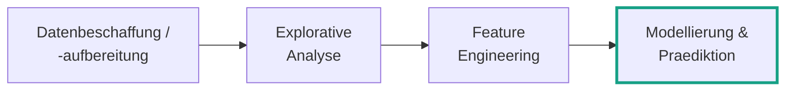
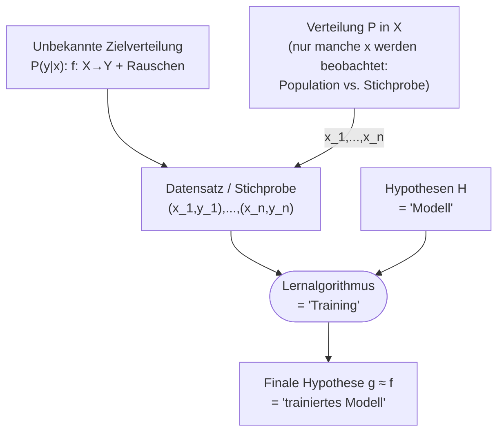
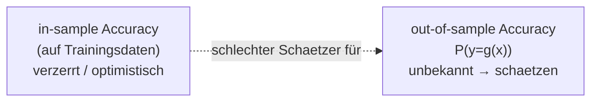
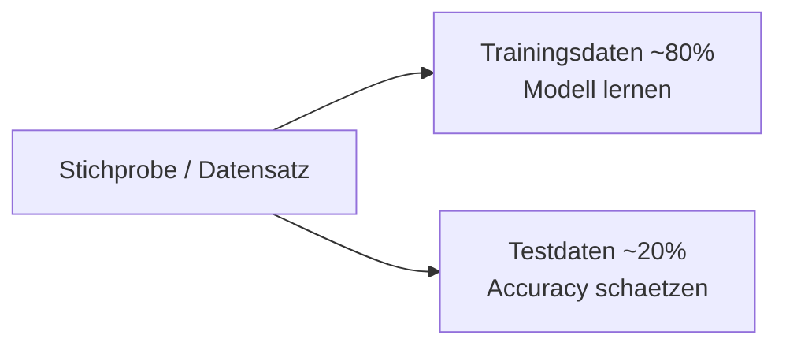
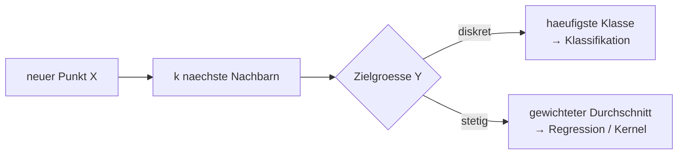

# 12 — Datengetriebene Modelle

**Folien:** [[data-science/resources/12_Modellierung.pdf|12_Modellierung.pdf]]
**Selbstkontrolle:** [[data-science/selbstkontrolle/ds-selbstkontrolle-12|Selbstkontrolle 12]]

> [!info] Hinweis
> Diese Vorlesung vertieft die **Modellierungs-Phase** und schliesst direkt an [[data-science/lectures/11/ds-11-feature-engineering-modellierung|11 — Feature Engineering & Datengetriebene Modelle]] an. Neu sind hier v.a. das **Supervised-Learning-Diagramm** (mit Zielverteilung und Rauschen), **in-sample vs. out-of-sample Accuracy**, der **Train-Test-Split** sowie **Metriken** und **Regression** bei kNN.

## Inhaltsverzeichnis

- [[#Einordnung im Data-Science-Prozess|Einordnung im Data-Science-Prozess]]
- [[#Wiederholung|Wiederholung]]
- [[#Supervised Learning — Beispiele|Supervised Learning — Beispiele]]
- [[#Das Supervised-Learning-Diagramm|Das Supervised-Learning-Diagramm]]
- [[#kNN und das 100%-Accuracy-Problem|kNN und das 100%-Accuracy-Problem]]
- [[#In-sample vs. out-of-sample Accuracy|In-sample vs. out-of-sample Accuracy]]
- [[#Train-Test-Split und Generalisierung|Train-Test-Split und Generalisierung]]
- [[#Die Rolle der Metrik bei kNN|Die Rolle der Metrik bei kNN]]
- [[#kNN für Regression|kNN für Regression]]
- [[#Fragen zur Selbstkontrolle|Fragen zur Selbstkontrolle]]

---

## Einordnung im Data-Science-Prozess

Der Data-Science-Prozess umfasst vier Phasen. Diese Vorlesung liegt vollstaendig in der letzten Phase — **Modellierung & Praediktion**.



---

## Wiederholung

Kurzer Rueckblick auf die zentralen Begriffe aus Deck 11 (ausfuehrlich dort):

- **Feature Engineering** transformiert Daten mit Domaenenwissen — die **Repraesentation** entscheidet ueber den Modellerfolg. Es "vermittelt" zwischen Daten und Modellen.
- **Wann hilft ML?** (1) es gibt **Muster** in den Daten, (2) wir koennen sie **nicht (effizient) mathematisch beschreiben**, (3) wir **haben Daten**.
- **Supervised Learning:** Input $x\in X$, Output $y\in Y$, unbekannte Zielfunktion $f(x)=y$; finde $g\approx f$ aus der Stichprobe.
- **Beurteilung eines Klassifikators:** Konfusionsmatrix (TP/FN/FP/TN) als vollstaendiges Bild; abgeleitete Guetemasse:

$$Acc=\frac{TP+TN}{TP+TN+FP+FN},\quad Precision=\frac{TP}{TP+FP},\quad Recall=\frac{TP}{TP+FN},\quad F_1=2\,\frac{Precision\cdot Recall}{Precision+Recall}.$$

> [!warning] Achtung — FP oder FN?
> Was schlimmer ist, **kommt auf die Anwendung an**: beim **Smartphone-Entsperren** ist ein FP (Angreifer akzeptiert) schlimmer, bei der **Terroristenerkennung** ein FN (Terrorist als Zivilist eingestuft).

- **kNN:** Fuer einen neuen Punkt die $k$ naechsten Nachbarn bestimmen und deren **haeufigste Klasse** zurueckgeben.

---

## Supervised Learning — Beispiele

Vier klassische Datensaetze illustrieren Klassifikation und Regression:

| Datensatz | Input $x$ | Output $y$ | Groesse | Aufgabe |
|---|---|---|---|---|
| **Iris** | Kron-/Kelchblatt (Breite, Laenge) | Art (setosa, versicolor, virginica) | 150 (50 je Art) | Klassifikation |
| **Titanic** | Passagier-Infos (Klasse, Geschlecht, Alter, …) | Ueberleben (ja/nein) | 1309 | Klassifikation |
| **Housing Prices** | Bezirk-Infos (Lage, Hausalter, Haushalte, …) | Median-Hauswert im Bezirk | 20640 | Regression |
| **Rotwein-Qualitaet** | Wein-Infos (Zitronensaeure, Restzucker, Dichte, pH, Alkohol, …) | Qualitaet | 1599 | Regression / Klassifikation |

> [!example] Beispiel — Titanic: "keine nuetzliche ML-Anwendung"?
> Titanic ist ein **Standard-Uebungsbeispiel**, aber praktisch wenig nuetzlich: die Ereignisse liegen fest in der Vergangenheit, es gibt keine "neuen" Passagiere vorherzusagen. Der didaktische Wert (Umgang mit gemischten Features, fehlenden Werten) ueberwiegt.

---

## Das Supervised-Learning-Diagramm

Das Diagramm formalisiert, **was beim ueberwachten Lernen tatsaechlich passiert** und ordnet die Umgangsbegriffe "Modell", "Training" und "trainiertes Modell" ein.



- **Unbekannte Zielfunktion** $f:X\to Y$ mit $f(x)=y$ — bzw. realistischer eine **Zielverteilung** $\mathbb{P}(y\mid x)$: der gleiche Input kann wegen **Rauschen** und **unbekannter Faktoren** unterschiedliche Outputs liefern (z.B. haengt die Weinqualitaet auch von Wetter/Standort ab, die nicht in $x$ stehen).
- **Verteilung $P$ in $X$:** wir beobachten nur **manche**, nicht alle $x\in X$ → Unterschied zwischen **Population** und **Stichprobe**.
- **Datensatz/Stichprobe** $(x_1,y_1),\dots,(x_n,y_n)$: die verfuegbaren Beispiele.
- **Lernalgorithmus ("Training")** waehlt aus der Menge der **Hypothesen $H$ ("Modell")** die **finale Hypothese $g\approx f$ ("trainiertes Modell")**.

> [!tip] Merke — die drei Umgangsbegriffe
> - **"Modell"** = die Hypothesenmenge $H$ (z.B. "alle kNN-Klassifikatoren"),
> - **"Training"** = der Lernalgorithmus, der daraus ein konkretes $g$ auswaehlt,
> - **"trainiertes Modell"** = die finale Hypothese $g$.

---

## kNN und das 100%-Accuracy-Problem

Vorhersage der Rotwein-Qualitaet mit kNN ueber verschiedene $k$:

```python
import numpy as np
import pandas as pd
from sklearn.neighbors import KNeighborsClassifier

df = pd.read_csv("../data/wine_quality.csv")
X, y = df.iloc[:, :-1].to_numpy(), df.iloc[:, -1].to_numpy()

accuracies = []
for k in range(1, 11):
    model = KNeighborsClassifier(n_neighbors=k)
    model.fit(X, y)
    y_pred = model.predict(X)          # Vorhersage auf den TRAININGSdaten!
    accuracy = np.sum(y_pred == y) / len(y) * 100
    accuracies.append(accuracy)
```

Ergebnis: mit **$k=1$** ergibt sich **100% Accuracy** — die Kurve faellt mit steigendem $k$ (auf ~60% bei $k=10$).

> [!warning] Achtung — 100% ist eine Illusion
> Bei $k=1$ ist der naechste Nachbar eines Trainingspunktes **der Punkt selbst** (Abstand 0). Das Modell "erinnert" sich also nur an die Trainingsdaten. Die 100% sagen, wie gut Vorhersagen fuer **bekannte** Weine sind — uns interessiert aber, wie gut sie fuer **neue** Weine sind.

---

## In-sample vs. out-of-sample Accuracy

> [!quote] Definition
> - **In-sample Accuracy:** Accuracy, gemessen auf den **Trainingsdaten** (den Daten, mit denen das Modell gelernt wurde).
> - **Out-of-sample Accuracy** $\mathbb{P}(y=g(x))$: Accuracy auf **neuen, ungesehenen** Daten — das, was uns eigentlich interessiert.

> [!tip] Merke
> Die out-of-sample Accuracy ist **unbekannt** und muss **geschaetzt** werden. Die in-sample Accuracy ist dafuer ein **verzerrter (zu optimistischer) Schaetzer** — das kNN-Beispiel mit $k=1$ (100% in-sample) zeigt das drastisch.



---

## Train-Test-Split und Generalisierung

Um die out-of-sample Accuracy **unverzerrt** zu schaetzen, teilt man die Stichprobe auf:

- **Trainingsdaten** (oft **80%**) — zum Lernen des Modells.
- **Testdaten** (oft **20%**) — zum Schaetzen der Accuracy auf "neuen" Daten.



```python
from sklearn.model_selection import train_test_split
X_train, X_test, y_train, y_test = train_test_split(X, y, test_size=0.2)
```

> [!success] Best Practice — Generalisierung
> Das Modell wird **nur** auf den Trainingsdaten gelernt und auf den **Testdaten** ausgewertet. Ist der **out-of-sample Fehler klein**, so **verallgemeinert** das Modell gut. Fuer reproduzierbare Splits einen festen `random_state` uebergeben.

> [!example] Beispiel — Uebung (Wein-Qualitaet)
> Datensatz `data/wine_quality.csv` laden, mit `train_test_split(..., test_size=0.2, random_state=24)` aufteilen, kNN-Modelle fuer $k=1,\dots,30$ auf den Trainingsdaten bilden und **auf den Testdaten** evaluieren. Gesucht: das $k$, das **am besten generalisiert** (nicht $k=1$!). Zusaetzlich: durch sinnvolles **Preprocessing** (z.B. Skalierung der Features) laesst sich die Vorhersage weiter verbessern. Code: `topic12_modelling/knn_exercise.py`.

---

## Die Rolle der Metrik bei kNN

Welche Punkte die "naechsten" sind, haengt vom gewaehlten **Abstandsmass** ab:

> [!quote] Definition — drei gaengige Metriken
> $$d_1(x,y)=\sum_{i=1}^{d}|x_i-y_i|\ \text{(Manhattan)},\quad d_2(x,y)=\sqrt{\sum_{i=1}^{d}(x_i-y_i)^2}\ \text{(euklidisch)},\quad d_\infty(x,y)=\max_{i=1,\dots,d}|x_i-y_i|\ \text{(Maximum)}.$$

**Beispiel** — welcher Punkt ist am naechsten am Ursprung $(0,0)$? Mit $x_1=(0.4,0.95)$, $x_2=(0.75,0.75)$, $x_3=(0.8,0.6)$:

| | $d_1$ | $d_2$ | $d_\infty$ |
|---|---|---|---|
| $x_1$ | **1.35** | 1.03 | 0.95 |
| $x_2$ | 1.50 | 1.06 | **0.75** |
| $x_3$ | 1.40 | **1.00** | 0.80 |

> [!warning] Achtung — Metrik ändert die Vorhersage
> Der naechste Nachbar ist je nach Metrik ein **anderer** Punkt: Manhattan → $x_1$, euklidisch → $x_3$, Maximum → $x_2$. Ein kNN-Klassifikator liefert dann entsprechend **unterschiedliche** Vorhersagen (im Foliencode: Vorhersage `[0]`, `[2]` bzw. `[1]`). Auch die **Skalierung** der Features beeinflusst die Abstaende — daher ist Preprocessing wichtig.

---

## kNN für Regression

kNN kann auch eine **stetige** Zielgroesse vorhersagen (Regression):

- **Einfach:** Durchschnitt der Zielwerte der $k$ Nachbarn (`KNeighborsRegressor`).
- **Besser:** ein **gewichteter** Durchschnitt abhaengig von der Entfernung → **Kernel Regression** und **Local Polynomial Regression**.

```python
from sklearn.neighbors import KNeighborsRegressor
model1 = KNeighborsRegressor()
model1.fit(x_exp, y)
pred1 = model1.predict(x_exp)

# gewichteter Durchschnitt per Faltung mit einem Kernel
kernel = np.array([0.1, 0.2, 0.4, 0.2, 0.1])
pred2 = np.convolve(y, kernel, mode='valid')
```



---

## Fragen zur Selbstkontrolle

Die kompakten Karteikarten finden sich unter [[data-science/selbstkontrolle/ds-selbstkontrolle-12|Selbstkontrolle 12]]. Im Folgenden ausfuehrliche Antworten zur Pruefungsvorbereitung.

**Wie ist das "Supervised-Learning-Diagramm" zu interpretieren?**

Eine **unbekannte Zielverteilung** $\mathbb{P}(y\mid x)$ — bestehend aus der Zielfunktion $f:X\to Y$ **plus Rauschen** — erzeugt zusammen mit der Verteilung $P$ auf dem Inputraum $X$ einen **Datensatz** $(x_1,y_1),\dots,(x_n,y_n)$. Dieser ist nur eine **Stichprobe**: wir beobachten manche, nicht alle $x$ (Population vs. Stichprobe), und $y$ kann wegen Rauschen und unbekannter Faktoren streuen. Ein **Lernalgorithmus** ("Training") waehlt aus der Menge der **Hypothesen $H$** ("Modell") die **finale Hypothese $g\approx f$** ("trainiertes Modell") aus.

**Wie erhalten wir beim kNN-Algorithmus ein Modell mit 100% Accuracy?**

Mit **$k=1$**, ausgewertet auf den **Trainingsdaten**: der naechste Nachbar eines Trainingspunktes ist der Punkt selbst (Abstand 0), also wird jeder Punkt seiner eigenen (korrekten) Klasse zugeordnet → 100% **in-sample** Accuracy. Das ist jedoch reines "Auswendiglernen" (Overfitting) und sagt nichts ueber neue Daten aus.

**Wie sind in-sample und out-of-sample Accuracy definiert? Was ist der Unterschied?**

Die **in-sample Accuracy** wird auf den **Trainingsdaten** gemessen (den Daten, mit denen gelernt wurde). Die **out-of-sample Accuracy** $\mathbb{P}(y=g(x))$ ist die Accuracy auf **neuen, ungesehenen** Daten. Der Unterschied: in-sample misst Auswendiglernen, out-of-sample misst **Generalisierung** — und nur letztere ist praktisch relevant.

**Warum können wir nicht die in-sample Accuracy als Schätzer für die out-of-sample Accuracy nutzen?**

Weil sie ein **verzerrter, zu optimistischer Schaetzer** ist: das Modell wurde auf genau diesen Daten optimiert und kann sie im Extremfall exakt reproduzieren (kNN mit $k=1$ → 100% in-sample), obwohl es auf neuen Daten schlecht generalisiert. Die in-sample Accuracy ueberschaetzt also systematisch die tatsaechliche Leistung.

**Wie können wir die out-of-sample Accuracy schätzen? Warum wollen wir sie überhaupt schätzen?**

Durch einen **Train-Test-Split**: die Stichprobe wird in **Trainingsdaten** (oft 80%) und **Testdaten** (oft 20%) aufgeteilt (`train_test_split`). Das Modell lernt nur auf den Trainingsdaten; die Accuracy wird auf den **Testdaten** gemessen und schaetzt so die out-of-sample Accuracy unverzerrt. Wir wollen sie schaetzen, weil sie angibt, wie gut das Modell auf **neuen** Daten **verallgemeinert** — genau das ist der Zweck eines Vorhersagemodells.

**Wovon hängt es ab, welche Punkte die nächsten Nachbarn sind?**

Von der gewaehlten **Metrik**. Manhattan $d_1$, euklidische $d_2$ und Maximum-Metrik $d_\infty$ koennen fuer denselben Anfragepunkt **verschiedene** naechste Nachbarn liefern (im Beispiel: $x_1$ bzw. $x_3$ bzw. $x_2$ als naechster Punkt zum Ursprung) — und damit unterschiedliche Vorhersagen. Zusaetzlich beeinflusst die **Skalierung** der Features die Abstaende, weshalb Preprocessing (z.B. Normierung) wichtig ist.

**Wie kann mit dem k-nearest-neighbors-Algorithmus eine stetige Variable vorhergesagt werden?**

Fuer Regression bildet man statt der haeufigsten Klasse den **Durchschnitt** der Zielwerte der $k$ Nachbarn (`KNeighborsRegressor`). Besser ist ein **entfernungsgewichteter** Durchschnitt: nahe Nachbarn zaehlen staerker → **Kernel Regression** bzw. **Local Polynomial Regression** (praktisch z.B. als Faltung `np.convolve(y, kernel)`).
