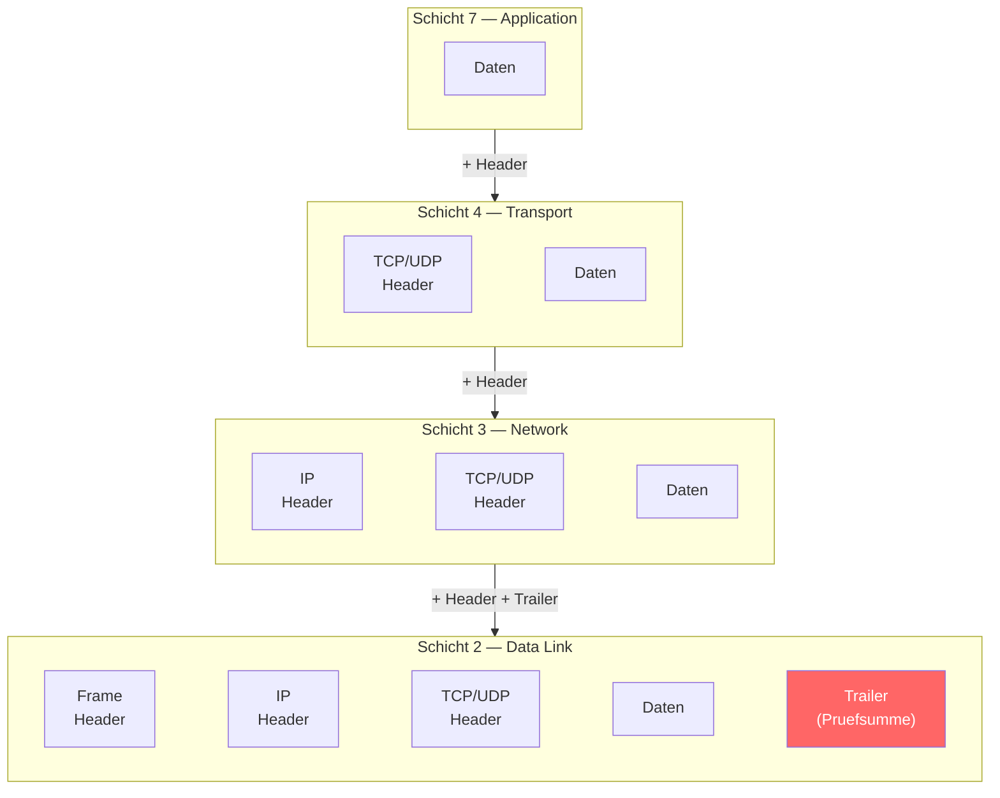
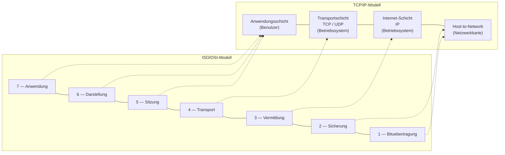

# 02 — Schichtenmodell

**Folien:** [[kommunikationssysteme/resources/Kommunikationssysteme_2_Schichtenmodell.pdf|Kommunikationssysteme_2_Schichtenmodell.pdf]]

## Ausgangsfrage

Wir wissen, wie die Verbindungsstruktur aussehen kann — aber wie kommunizieren Rechner/Geraete und die darauf laufenden Anwendungen miteinander?

Anwendungen muessen:
- sich **finden**
- sich **verstehen**
- wissen, wann man dran ist zu "sprechen"

---

## Netzwerkprotokolle

Kommunikationspartner muessen sich an bestimmte Regeln halten und die gleiche "Sprache" sprechen. Vereinbarungen ueber den Datenaustausch sind zwingend erforderlich:

- Uebertragungsrichtung (wer redet, wer hoert zu?)
- Datenformat und -kodierung (Sprache)
- Wegeermittlung (wie kommen die Daten zum Empfaenger?)
- Fehlerbehandlung (was macht man bei Kommunikationsfehlern?)

> **Ein Protokoll ist die Gesamtheit aller Vereinbarungen zwischen Computeranwendungen zum Zweck einer gemeinsamen Kommunikation.**

---

## Der Begriff Netzwerk

Unter Netzwerk versteht man mehr als nur das verbindende "Kabel":
- Physikalische Eigenschaften des Uebertragungsmediums
- Darstellung der Daten als Signal
- Zugriffsregeln der angeschlossenen Systeme
- Topologie des Systems
- Verbindung unterschiedlicher Netztechnologien
- Erkennung von Uebertragungsfehlern
- Adressierung von Endpunkten
- Erreichbarkeit entfernter Systeme in anderen Netzen
- Uebermittlung der Daten bei den End-Systemen
- Kodierungsregeln und Semantiken

Protokolle regeln diese Fragen und koennen sehr komplex sein — daher ist **Abstraktion** (Schichtung) von Bedeutung.

---

## Implementierung von Datenkommunikation

### Loesung 1: "Naives" Konzept
- Ein grosses Kommunikationsprogramm, das allen Anforderungen genuegt
- Vorteil: optimal und effizient fuer eine gegebene Anwendung
- Nachteil: nicht flexibel, Aenderungen erfordern hohen Aufwand

### Loesung 2: Modularisierung
- Kleinere, spezialisierte Programme, die sich kombinieren lassen
- Vorteil: sehr flexibel, einzelne Komponenten austauschbar
- Nachteil: durch vorgegebene Struktur wird vieles umstaendlich, dadurch nicht so effizient
- Realisiert durch **Schichtenmodelle**

---

## Systemschichtung

**Schrittweise Verfeinerung** (top-down): Zerlegung der Aufgabe in Funktionen, die einen Dienst auf einem bestimmten Abstraktionsniveau erbringen. Jede Schicht nutzt den Dienst der darunterliegenden Schicht.

**Schrittweise Vergroesserung** (bottom-up): Zusammenfassung von Dienstfunktionen einer unteren Schicht in Bausteine, die gemeinsam den Dienst der oberen Schicht schaffen.

- Schicht n → Schnittstelle n (Nutzerschnittstelle)
- Schicht 0 → Schnittstelle 0 (Geraeteschnittstelle)

### Beispiel: Gedankenaustausch von Philosophen
Drei Schichten der Kommunikation:
1. **Philosoph** — Gedanken zur Weltpolitik (Inhalt)
2. **Dolmetscher** — Uebersetzung zwischen Sprachen (uninterpretierte Saetze)
3. **Techniker** — Erkennt einzelne Buchstaben und morst diese (elektrische Signale ueber Netz)

Jede Schicht kommuniziert logisch mit der gleichen Schicht auf der Gegenseite (Peer-to-Peer-Protokolle), physisch aber nur ueber die darunterliegende Schicht.

---

## Standardisierung der Protokolle

- Ziel: **offene Kommunikation** — technisch unlimitierte Kommunikation zwischen kommunikationswilligen Partnern
- **Ein offener Standard heisst, dass jeder Zugang zu der Spezifikation hat, ohne Kosten**

### Standardisierungsgremien

**ISO** (International Standards Organization):
- Freiwillige Organisation seit 1946, ~90 Laender
- ~200 Technical Committees (z.B. TC97 fuer Computer und Informationsverarbeitung)
- Zusammenarbeit mit ITU-T bzgl. Telekommunikationsstandards
- **Bahnbrechende Leistung: Das ISO/OSI-Referenzmodell**
- Bahnbrechend bzgl. des Konzepts, nicht wegen der daraus entstandenen Produkte!

*(OSI: Open Systems Interconnection)*

---

## Das ISO-OSI-Referenzmodell (7 Schichten)

| Schicht | Name (EN) | Name (DE) | Kommunikation |
|---------|-----------|-----------|---------------|
| 7 | Application | Anwendung | peer-to-peer |
| 6 | Presentation | Darstellung | peer-to-peer |
| 5 | Session | Kommunikationssteuerung | peer-to-peer |
| 4 | Transport | Transport | peer-to-peer |
| 3 | Network | Vermittlung | hop-by-hop |
| 2 | Data Link | Sicherung | hop-by-hop |
| 1 | Physical | Bituebertragung | hop-by-hop |

- Schichten 4-7: Ende-zu-Ende (Transport-Schichten)
- Schichten 1-3: Netzwerk-Schichten (auch auf Zwischenknoten)

### Wechselspiel zwischen den Schichten
- Jede Schicht bietet der ueber ihr liegenden Schicht Dienste an
- Dazu versieht sie ihre Nachricht mit Kontrollinformationen (**Header**) — zusammen als **Protocol Data Unit (PDU)** bezeichnet
- Die PDU einer Schicht n wird an Schicht (n-1) weitergeleitet — dort sind dies die zu uebertragenden Inhaltsdaten
- Untere Schichten benoetigen ein **Upper-Layer-Protocol-Feld**, damit die passende obere Schicht ausgewaehlt werden kann
- Eine obere Schicht muss die untere Schicht parametrisieren
- **Schicht 2 weicht ab:** hier findet Framing statt (Fehlererkennung/-korrektur und Synchronisation)

---

## Aufgaben der einzelnen OSI-Schichten

### Schicht 7: Anwendungsschicht (Application Layer)
- Stellt (Standard-)Schnittstellen/Bausteine zur Verfuegung, die bestimmten Anwendungstypen ganze Kommunikationsdienste (**Grunddienste**) bereitstellen
- Beispiel: Protokoll zur Uebertragung von Webseiten mit fest definierter Schnittstelle (GET, POST, DELETE, ...)
- **Merke:** Die Anwendungsschicht ist eher als Bibliothek zu verstehen — es sind **nicht die Anwendungen selber**
- Das Internet realisiert dies anders

### Schicht 6: Darstellungsschicht (Presentation Layer)
- Daten so darstellen, dass sie von unterschiedlichen Plattformen und Anwendungen gehandhabt werden koennen
- Probleme: ASCII vs. Unicode, 32-Bit vs. 64-Bit, Big/Little-Endian
- Binaere Daten koennen Sonderzeichen enthalten → Seiteneffekte
- Effiziente plattformunabhaengige Darstellung ist zwingend erforderlich

### Schicht 5: Sitzungsschicht (Session Layer)
- **Dialogkontrolle:** Festlegung, wer wann uebertragen darf (Sende-Token)
- Bereitstellung von **Wiederaufsetzpunkten** (bei Unterbrechung nicht komplett von vorne)
- **Merke:** Die Sitzungsschicht regelt den elementaren Kommunikationsablauf

### Schicht 4: Transportschicht (Transport Layer)
- Ermoeglicht die **Kommunikation zwischen Anwendungen** der Endsysteme
- Segmentierung von Datenstroemen in Einheiten: Segmente/Datagramme (Pakete)
- Verbirgt wesentliche Charakteristika der Netzinfrastruktur
- Adressierung von Anwendungsprozessen
- Regeln zur Behandlung von Fehlern
- Eventuell Flusskontrolle/Staukontrolle
- **Merke: Die Transportschicht ermoeglicht die Kommunikation zwischen Anwendungen/Prozessen!**

### Schicht 3: Vermittlungsschicht (Network Layer)
- **Uebertragung der Daten zwischen Rechnern in einem Netz aus Netzen**
- Elementare Aufgabe: geeignete Wegewahl (**Routing**)
- Voraussetzung: gemeinsamer Adressraum fuer Rechner und Einigung auf maximale PDU-Groesse (Datagramm-Groesse)
- Statisches Netzkonzept: Zwischenknoten speichern ankommende Nachrichten und ermitteln ueber Tabellen den naechsten Knoten
- **Merke: Die Vermittlungsschicht ermoeglicht die Kommunikation zwischen Endgeraeten ueber Netzwerkgrenzen hinweg!**

### Schicht 2: Sicherungsschicht (Data Link Layer)
- Kommunikation zwischen Rechnern **in einem einzelnen Netz**
- **Logical Link Control (LLC):**
  - Moeglichst fehlerfreie Uebertragung zwischen zwei Rechnern innerhalb eines Netzes
  - Daten werden in **Rahmen** unterteilt
  - Pruefsumme am Ende der Nachricht zur Fehlererkennung
  - Flusskontrolle zur Vermeidung von Ueberlastung des Empfaengers
- **Medium Access Control (MAC):**
  - Bei Multi-Access-Netzen: konfliktfreier Zugriff auf das Medium
- **Merke: Die Sicherungsschicht ermoeglicht die Kommunikation zwischen Rechnern in einem einzelnen Netz und regelt ggf. den konfliktfreien Mehrfachzugriff**

### Schicht 1: Bituebertragungsschicht (Physical Layer)
- Transportiert einzelne Bits ueber eine bestimmte physische Leitung (Medium)
- Festlegung von: Leitungstyp, Kodierung von 0/1, Stecker (Pinbelegungen), Uebertragungsrichtung (uni-/bidirektional)
- **Merke:** Regelt die Darstellung von Symbolen (Bits) und die Kabel/Drahtlos-technik

---

## Schichtenmodelle in der Praxis: TCP/IP

### Orientierung am OSI-Referenzmodell mit Reduktion des Overheads

| ISO/OSI | TCP/IP |
|---------|--------|
| Schicht 7: Anwendung | **Anwendungsschicht** |
| Schicht 6: Darstellung | *(existieren nicht, werden bei Bedarf* |
| Schicht 5: Sitzung | *in der Anwendungsebene mit implementiert)* |
| Schicht 4: Transport | **Transportschicht** |
| Schicht 3: Vermittlung | **Internet-Schicht** |
| Schicht 2: Sicherung | **Host-to-Network-Schicht** |
| Schicht 1: Bituebertragung | *(z.B. durch IEEE standardisiert)* |

### Host-to-Network-Schicht (ISO/OSI 1-2)
- Faktische Datenuebertragung **wird von der Netzwerkkarte erledigt**
- Netzwerkkarte entscheidet bei Multi-Access-Netzen selbst, ob Daten fuer den eigenen Rechner bestimmt sind → Entlastung des Betriebssystems
- IP teilt dem Treiber der Netzwerkkarte mit, Daten an eine **MAC-Adresse** zu uebertragen
- Direkte Anbindung des Zielrechners erforderlich
- Beispiele: Ethernet (kabelgebunden), WLAN (drahtlos), PPP ueber DSL

### Internet-Schicht (ISO/OSI 3)
- **Kommunikation zwischen Rechnern auch ueber die eigenen Netzwerkgrenzen hinaus**
- Paketvermittelnd: Datagramme werden unabhaengig voneinander mit Adressinformation versehen
- **Store-and-Forward:** Router an Netzgrenzen leiten Daten weiter, Entscheidung ueber naechsten Router anhand der Zieladresse
- Pakete koennen verloren gehen oder in anderer Reihenfolge ankommen → Behebung auf Transportebene
- Vorteil: eine Leitung kann von vielen Teilnehmern genutzt werden
- Einheitliches Protokoll: **Internet Protocol (IP)**

### Transportschicht (ISO/OSI 4)
- **Kommunikation zwischen Anwendungen**
- **TCP (Transmission Control Protocol):** zuverlaessig, verbindungsorientiert
  - Strom von Bytes wird sicher zwischen zwei Rechnern uebertragen
  - Segmentierung in IP-Pakete, Zusammensetzung in richtiger Reihenfolge
  - Flusskontrolle und Staukontrolle
- **UDP (User Datagram Protocol):** unzuverlaessig ("best effort"), verbindungslos
  - Wenn schnelle Lieferung wichtiger ist als zuverlaessige (z.B. Sprache, Video)

### Anwendungsschicht (ISO/OSI 5-7 + Anwendung)
- Die Aufgaben der ISO/OSI-Schichten **5-7 werden im Internet auf die Anwendung verschoben**
- Eine Anwendung realisiert alle Aufgaben von Kommunikationssteuerung ueber Darstellung bis zur konkreten Anwendung (z.B. httpd)
- Festgelegt werden auch Dialoge (Schicht 5) und Nachrichtenformate (Schicht 6: Syntax & Semantik)

---

## Fazit

- Datenkommunikation = Sammlung aufeinander aufbauender Protokolle, die gemeinsam fehlerfreien Datenaustausch definieren
- ISO/OSI-Referenzmodell als Versuch der Standardisierung; die Terminologie wird weiter verwendet
- ISO/OSI-Schichten 1-2 werden als **Treiber fuer Netzwerkkarten** implementiert
- TCP/IP-Referenzmodell baut auf den Netzwerkkartentreibern auf:
  - IP und TCP/UDP sind als **Teil des Betriebssystems** implementiert
  - Anwendungsprotokolle koennen als zusaetzliche Dienste auf dem System laufen

> **Merke:** Waehrend das ISO/OSI-Modell systematisch die Abstraktionsebenen festlegt, geht das Internet-Referenzmodell einen pragmatischen Weg:
> - Die **Anwendung** realisiert Kommunikationsregeln, Darstellung, Wiederaufsetzpunkte etc.
> - Im **Betriebssystem** wird die Transport- und Vermittlungsschicht implementiert
> - Die **Netzwerkkarte** implementiert die unteren beiden Schichten und filtert bei Multi-Access-Netzen irrelevante Nachrichten

---

## Fragen zur [[kommunikationssysteme/selbstkontrolle/selbstkontrolle-01|Selbstkontrolle]]

**8. Was versteht man unter einem Protokoll im Kontext der Datenkommunikation?**
- Ein Protokoll ist die **Gesamtheit aller Vereinbarungen zwischen Computeranwendungen zum Zweck einer gemeinsamen Kommunikation**. Es regelt: Uebertragungsrichtung, Datenformat/-kodierung, Wegeermittlung und Fehlerbehandlung.

**9. Nennen Sie 3-4 Probleme, die fuer eine erfolgreiche Datenkommunikation zu loesen sind!**
- Physikalische Eigenschaften des Uebertragungsmediums und Darstellung als Signal
- Zugriffsregeln bei geteilten Medien (Multi-Access)
- Adressierung von Endpunkten und Erreichbarkeit entfernter Systeme
- Erkennung von Uebertragungsfehlern
- Kodierungsregeln und Semantiken

**10. Welche Vorteile (und ggf. auch Nachteile) haben Schichten-Architekturen?**
- **Vorteile:** Modularisierung — einzelne Komponenten austauschbar, sehr flexibel. Jede Schicht hat klare Verantwortlichkeit, Komplexitaet wird handhabbar.
- **Nachteile:** Durch vorgegebene Struktur wird vieles umstaendlich, dadurch nicht so effizient wie ein monolithisches, auf eine Anwendung optimiertes Programm. Overhead durch Schichten-Kommunikation.

**11. Wie heissen die sieben Schichten des ISO/OSI-Modells, und welche grobe Aufgabe haben sie jeweils?**
1. **Physical** (Bituebertragung): Transport einzelner Bits ueber physisches Medium
2. **Data Link** (Sicherung): Fehlerfreie Uebertragung zwischen Rechnern im selben Netz, Zugriffskontrolle
3. **Network** (Vermittlung): Routing — Datenuebertragung zwischen Rechnern ueber Netzgrenzen hinweg
4. **Transport**: Kommunikation zwischen Anwendungen/Prozessen, Segmentierung, Fluss-/Staukontrolle
5. **Session** (Sitzung): Dialogkontrolle und Wiederaufsetzpunkte
6. **Presentation** (Darstellung): Plattformunabhaengige Datendarstellung
7. **Application** (Anwendung): Standard-Schnittstellen/Grunddienste fuer Anwendungstypen

**12. Wie uebertraegt jede Schicht die fuer sie relevanten Informationen?**
- Jede Schicht versieht ihre Nachricht mit Kontrollinformationen (**Header**) — zusammen als **Protocol Data Unit (PDU)** bezeichnet. Die PDU von Schicht n wird an Schicht (n-1) weitergeleitet, wo sie als Inhaltsdaten behandelt wird. Untere Schichten benoetigen ein **Upper-Layer-Protocol-Feld**, damit die passende obere Schicht ausgewaehlt werden kann.

**13. Was ist hier das Besondere an der Sicherungsschicht?**
- Die Sicherungsschicht weicht vom normalen Schema ab: hier findet **Framing** statt — die Daten werden in Rahmen unterteilt mit einer **Pruefsumme am Ende** (nicht nur Header am Anfang). Dies dient der Fehlererkennung/-korrektur und Synchronisation.

**14. Welche Unterschiede existieren zwischen dem ISO/OSI-Modell und dem Internet-Referenzmodell?**
- OSI hat 7 Schichten, TCP/IP hat 4. Die Schichten 5-7 (Session, Presentation, Application) werden im Internet in der **Anwendungsschicht** zusammengefasst — die Anwendung implementiert diese Funktionen selbst. Schichten 1-2 werden zur **Host-to-Network-Schicht** zusammengefasst und durch die Netzwerkkarte realisiert. TCP/IP ist pragmatischer, OSI systematischer.

**15. Zu welcher Schicht gehoeren die Protokolle TCP und UDP, und wie unterscheiden sie sich?**
- Beide gehoeren zur **Transportschicht** (Schicht 4).
- **TCP:** Zuverlaessig, verbindungsorientiert. Garantiert Reihenfolge und Vollstaendigkeit. Segmentierung, Flusskontrolle, Staukontrolle.
- **UDP:** Unzuverlaessig ("best effort"), verbindungslos. Schneller, aber keine Garantie. Geeignet wenn Geschwindigkeit wichtiger als Zuverlaessigkeit (Sprache, Video).

**16. Welche Schichten implementiert der Benutzer, welches das Betriebssystem und welche sind auf der Netzwerkkarte?**
- **Anwendung (Benutzer):** Anwendungsschicht — realisiert Kommunikationsregeln, Darstellung, Wiederaufsetzpunkte
- **Betriebssystem:** Transport- und Vermittlungsschicht (TCP/UDP und IP)
- **Netzwerkkarte (Hardware):** Host-to-Network-Schicht (Sicherung + Bituebertragung)

**17. Welche Vorteile hat es, die Host-to-Network-Schicht komplett in Hardware zu realisieren?**
- Die Netzwerkkarte entscheidet bei Multi-Access-Netzen **selbst**, ob Daten fuer den eigenen Rechner bestimmt sind → **Entlastung des Betriebssystems**. Irrelevante Nachrichten werden bereits in Hardware gefiltert, ohne dass CPU-Zyklen verbraucht werden. Bei der hohen Datenrate moderner Netze waere eine reine Software-Loesung zu langsam.
