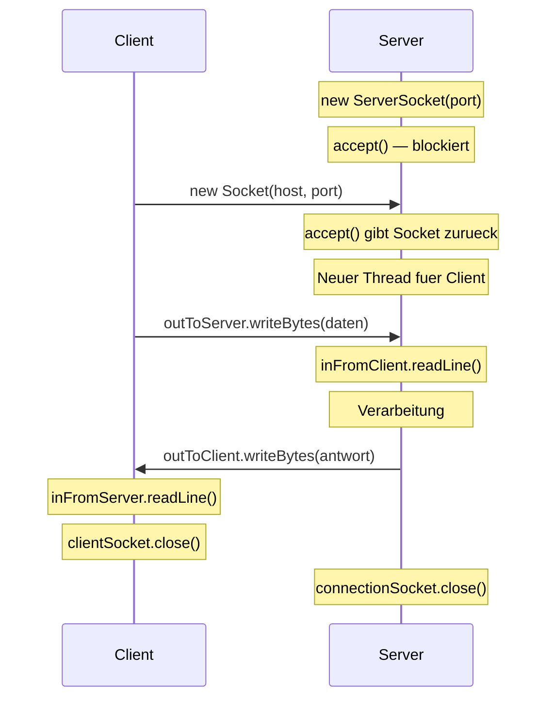
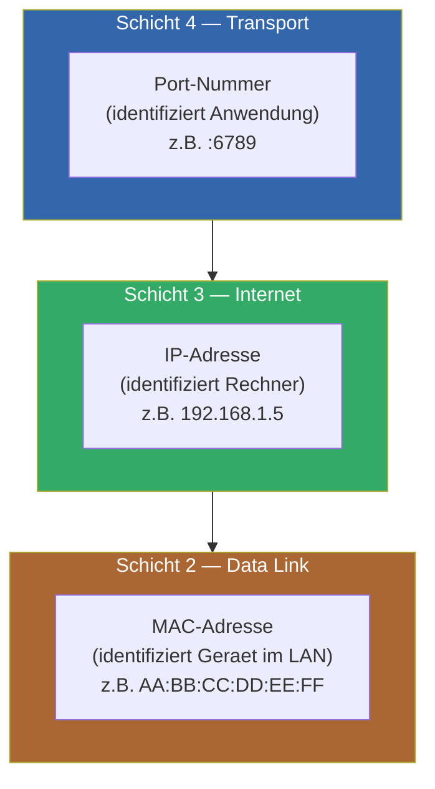

# 03 — Sockets

**Folien:** [[kommunikationssysteme/resources/Kommunikationssysteme_3_Sockets.pdf|Kommunikationssysteme_3_Sockets.pdf]]
**Selbstkontrolle:** [[kommunikationssysteme/selbstkontrolle/komsys-selbstkontrolle-02|Selbstkontrolle Vorlesung 2]]


## Inhaltsverzeichnis

- [[#Entwicklung eigener verteilter Anwendungen|Entwicklung eigener verteilter Anwendungen]]
- [[#Sockets|Sockets]]
- [[#TCP Client (Java)|TCP Client (Java)]]
- [[#TCP Server (Java)|TCP Server (Java)]]
- [[#Problem: Blockierende Operationen|Problem: Blockierende Operationen]]
- [[#Prozesse und Threads|Prozesse und Threads]]
- [[#Fragen zur Selbstkontrolle|Fragen zur Selbstkontrolle]]

---

## Entwicklung eigener verteilter Anwendungen

- TCP/UDP (Transportschicht) und IP (Vermittlungsschicht) sind im **Betriebssystem** implementiert
- Eigene Anwendungen bauen mittels der **Socket-Schnittstelle** direkt auf TCP oder UDP auf
- **Port-Nummern** identifizieren die Anwendung, **IP-Adressen** den Zielrechner
- Port-Nummern: 16-Bit (0-65535)
  - Port 0: Betriebssystem waehlt freien Port
  - Ports 1-1023: **Well-Known-Ports** — benoetigen Administrator-Privilegien
- **localhost** (127.0.0.1 / ::1): Loopback-Adresse, virtuelle Netzwerkschnittstelle fuer Kommunikation mit sich selbst

---

## Sockets

- **Abstraktion fuer den Zugang zum Transportprotokoll**, bereitgestellt vom Betriebssystem
- Bei **TCP**: Adressinformationen uebergeben → logischer Kommunikationskanal wird aufgebaut. Daten per **Streams** (Input/Output) uebertragen
- Bei **UDP**: Art **Briefkasten** — Nachrichten mit Absender/Empfaenger werden aufgegeben und (hoffentlich) uebertragen
- Der/die Programmierer:in ist verantwortlich fuer das, was uebertragen wird

### TCP-Sockets: Zwei logische Kommunikationskanaele
- Jede Anwendung hat einen Socket mit Input- und Output-Stream
- Bytestrom zwischen den Endanwendungen

---

## TCP Client (Java)

```java
// Socket erstellen, Verbindung aufbauen
Socket clientSocket = new Socket("zielrechner", 6789);

// Ausgabestrom zum Server
DataOutputStream outToServer =
    new DataOutputStream(clientSocket.getOutputStream());

// Eingabestrom vom Server
BufferedReader inFromServer = new BufferedReader(
    new InputStreamReader(clientSocket.getInputStream()));

// Senden
outToServer.writeBytes(sentence + '\n');

// Empfangen
modifiedSentence = inFromServer.readLine();

// Socket schliessen
clientSocket.close();
```

- Client gibt **Zieladresse + Port** an → Socket wird erstellt, Verbindung aufgebaut
- Client gibt **keinen eigenen Port** an — wird vom Betriebssystem gewaehlt

## TCP Server (Java)

```java
// ServerSocket erstellen (wartet auf Port 6789)
ServerSocket welcomeSocket = new ServerSocket(6789);

while(true) {
    // Blockiert bis Client-Verbindung eingeht
    Socket connectionSocket = welcomeSocket.accept();

    // Eingabestrom vom Client
    BufferedReader inFromClient = new BufferedReader(
        new InputStreamReader(connectionSocket.getInputStream()));

    // Ausgabestrom zum Client
    DataOutputStream outToClient =
        new DataOutputStream(connectionSocket.getOutputStream());

    // Lesen, verarbeiten, antworten
    clientSentence = inFromClient.readLine();
    capitalizedSentence = clientSentence.toUpperCase() + '\n';
    outToClient.writeBytes(capitalizedSentence);

    connectionSocket.close();
}
```

### Socket und ServerSocket — Zwei Klassen

- **ServerSocket**: Zeigt dem Betriebssystem an, auf welchem Port Verbindungsanfragen eingehen. `accept()` blockiert bis ein Client verbinden moechte
- **Socket** (von `accept()` zurueckgegeben): Bietet Input- und Output-Stream fuer die Kommunikation
- Auf Client-Seite: nur `Socket`-Klasse benoetigt
- Mit dem Schliessen des Sockets werden auch die Streams geschlossen



### Warum zwei Socket-Klassen auf Server-Seite?
- ServerSocket wartet auf Verbindungswuensche (passive open)
- Bei jedem Verbindungswunsch erstellt `accept()` einen **neuen Socket fuer den Client**
- So koennen **mehrere Clients** bedient werden

---

## Problem: Blockierende Operationen

- Der einfache Server hat ein Problem: **blockierende Leseoperationen**
- Waehrend der Server auf eine Nachricht eines Clients wartet, kann er keine anderen Clients bedienen
- Loesung: **asynchrone** oder **nebenlaeufige/parallele** Programmierung (Threads)

## Prozesse und Threads

**Prozess:**
- Abstraktion eines in Ausfuehrung befindlichen Programms
- Zustaende: Rechnend, Wartend, Rechenbereit
- Eigener **Adressraum** — keine gemeinsamen Variablen zwischen Prozessen

**Thread (leichtgewichtiger Prozess):**
- Gehoert zu einem Prozess
- Alle Threads eines Prozesses teilen sich **denselben Adressraum** → gemeinsame Variablen moeglich
- Eigene Register und eigener Programmzaehler

| Per Process | Per Thread |
|-------------|-----------|
| Address space | Program counter |
| Global variables | Registers |
| Open files | Stack |
| Child processes | State |
| Signals and handlers | |

### Threads fuer Server
- Server-Anwendungen die blockieren koennen, muessen ueber parallele/nebenlaeufige Ablaeufe verfuegen
- Typischerweise wird nach `accept()` ein neuer **Java-Thread** gestartet, der die Client-Kommunikation uebernimmt
- Bei UDP blockiert man ueblicherweise nicht, da kein Verbindungskonzept (Briefkastenprinzip)

---

## Fragen zur [[kommunikationssysteme/selbstkontrolle/komsys-selbstkontrolle-02|Selbstkontrolle]]

**1. Was abstrahiert aus Programmiersicht ein Socket?**
Ein Socket abstrahiert den Zugang zum Transportprotokoll (TCP/UDP), der vom Betriebssystem bereitgestellt wird. Man uebergibt Adressinformationen und erhaelt einen logischen Kommunikationskanal mit Input-/Output-Streams.

**2. Wer kommuniziert letztendlich miteinander?**
Letztendlich kommunizieren **Anwendungsprozesse** (Client und Server) miteinander. Dazu muessen: Socket erstellt, Adressinformationen (IP + Port) angegeben, und die Daten als Bytestream ueber die Streams des Sockets gesendet/empfangen werden.

**3. Wieso werden 3 Arten von Adressen benoetigt?**
- **MAC-Adresse** (Schicht 2): Identifiziert das Geraet im lokalen Netz
- **IP-Adresse** (Schicht 3): Identifiziert den Rechner im Internet (netzuebergreifend)
- **Port-Nummer** (Schicht 4): Identifiziert die Anwendung auf dem Rechner
Jede Schicht benoetigt ihre eigene Adressierung.



**4. Warum unterschiedliche Konstruktorparameter bei Client/Server-Sockets?**
Der **Client-Socket** benoetigt Ziel-IP und Ziel-Port (2 Parameter), da er die Verbindung initiiert. Der **ServerSocket** benoetigt nur den eigenen Port (1 Parameter), da er passiv wartet — die IP-Adresse ist die eigene/Standardadresse.

**5. Warum zwei verschiedene Socket-Klassen auf Server-Seite?**
`ServerSocket` dient zum Warten auf Verbindungsanfragen (passive open auf einem Port). `accept()` gibt eine `Socket`-Instanz zurueck, die den konkreten Kommunikationskanal zu einem einzelnen Client repraesentiert. So kann der Server auf dem gleichen Port weitere Clients annehmen.

**6. Was bewirkt accept()?**
`accept()` **blockiert** den aufrufenden Thread, bis ein Client eine Verbindungsanfrage stellt. Nach Aufbau der logischen Verbindung liefert es eine **neue Socket-Instanz** zurueck, ueber die mit dem Client kommuniziert werden kann.

**7. Was ist bei blockierenden Leseoperationen zu beachten?**
Blockierende Operationen verhindern, dass der Server andere Clients bedienen kann. Loesung: **Threads** verwenden — nach jedem `accept()` wird ein neuer Thread gestartet, der die Client-Kommunikation uebernimmt, waehrend der Hauptthread weiter auf neue Verbindungen wartet.

**8. Warum nicht einfach Port 500?**
Ports 1-1023 sind **Well-Known-Ports** und erfordern **Administrator-Privilegien**. Ohne Root-/Admin-Rechte kann man keinen Server auf diesen Ports starten. Eigene Anwendungen sollten Ports > 1023 verwenden.

**9. Was ist die Idee von localhost?**
localhost (127.0.0.1 / ::1) ist eine **Loopback-Adresse** — eine virtuelle Netzwerkschnittstelle ohne physische Netzwerkkarte. Programme und Dienste koennen darueber **innerhalb des lokalen Rechners** miteinander kommunizieren, ohne das physische Netzwerk zu nutzen.
