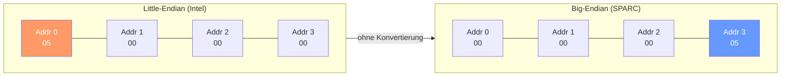
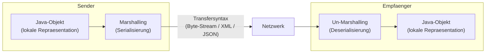

# 04 — Darstellungsschicht

**Folien:** [[kommunikationssysteme/resources/Kommunikationssysteme_4_Darstellung.pdf|Kommunikationssysteme_4_Darstellung.pdf]]
**Selbstkontrolle:** [[kommunikationssysteme/selbstkontrolle/komsys-selbstkontrolle-02|Selbstkontrolle Vorlesung 2]]


## Inhaltsverzeichnis

- [[#Problem: Heterogenitaet|Problem: Heterogenitaet]]
- [[#Loesung: Explizite Datendarstellung|Loesung: Explizite Datendarstellung]]
- [[#Technologien fuer die Darstellungsschicht|Technologien fuer die Darstellungsschicht]]
- [[#Serialisierung / Deserialisierung|Serialisierung / Deserialisierung]]
- [[#XML (eXtensible Markup Language)|XML (eXtensible Markup Language)]]
- [[#XML Schema (XSD)|XML Schema (XSD)]]
- [[#JSON (JavaScript Object Notation)|JSON (JavaScript Object Notation)]]
- [[#Fragen zur Selbstkontrolle|Fragen zur Selbstkontrolle]]

---

## Problem: Heterogenitaet

Warum muss eine Darstellungsschicht implementiert werden?
- **Heterogenitaet der Plattform:** Unterschiedliche Betriebssysteme, Hardware
- **Heterogenitaet der Programmiersprache**

### Little-Endian vs. Big-Endian
- **Little-Endian** (z.B. Intel): Niedrigstwertiges Byte zuerst gespeichert
- **Big-Endian** (z.B. Sun SPARC): Hoechstwertiges Byte zuerst
- Problem: Integer-Werte werden durch unterschiedliche Byteordnung **verdreht**, Zeichenketten jedoch nicht
- Beispiel: Integer 5 auf Little-Endian = `05 00 00 00`, auf Big-Endian = `00 00 00 05`. Wird ohne Konvertierung uebertragen, wird aus 5 der Wert 83886080



### Unterschiedliche Zeichencodierung
- ASCII auf PCs vs. EBCDIC auf IBM Mainframes

---

## Loesung: Explizite Datendarstellung

**Idee:**
1. Definiere eine Menge **abstrakter Datentypen** und eine **Kodierung** (genaues Bit-Format) fuer jeden Typ
2. Stelle Werkzeuge bereit, die Datentypen der Programmiersprache in abstrakte Datentypen uebersetzen und umgekehrt

- **Marshalling** (Senden): Kodierungsfunktion aufrufen, Ergebnis uebertragen
- **Un-Marshalling** (Empfangen): Bit-String dekodieren, lokale Repraesentation erzeugen



### Pragmatische Loesung
- Textbasiertes Protokoll mit eindeutiger Zeichenkodierung (z.B. HTTP, SMTP)
- Alle Inhalte muessen als Text darstellbar sein

---

## Technologien fuer die Darstellungsschicht

- **ASN.1** (Abstract Syntax Notation) — ISO-genormte Beschreibungssprache
- Sun ONC-RPC: **XDR** (eXternal Data Representation)
- OSF-RPC: **IDL** (Interface Definition Language)
- CORBA: IDL und **CDR** (Common Data Representation)
- **XML**/SOAP
- **Java-Objektserialisierung**
- **JSON** (JavaScript Object Notation)

### ASN.1

- ISO-genormte Beschreibungssprache zur darstellungsunabhaengigen Spezifikation von Datentypen und Werten
- **Elementare Datentypen:** Boolean, Integer, Bitstring, Octetstring, IA5String
- **Strukturierte Datentypen:**
  - `Sequence` — Geordnete Liste von Datentypen (wie struct in C)
  - `Set` — Ungeordnete Menge von Datentypen
  - `Sequence OF` — Geordnete Liste gleicher Datentypen (Array)
  - `Set OF` — Ungeordnete Menge gleicher Datentypen
  - `Choice` — Auswahl aus mehreren Datentypen (Union in C)

**ASN.1 Uebertragungssyntax (BER — Basic Encoding Rules):**
- TLV-Format: **Type** (Bezeichner) | **Length** (Laenge) | **Value** (Inhalt)
- Bezeichner-Byte: Typklasse (2 Bit) + Datentyp (1 Bit: einfach/strukturiert) + Tag-Nummer (5 Bit)

---

## Serialisierung / Deserialisierung

### Abstrakte Syntax vs. Transfersyntax
- **Abstrakte Syntax:** Beschreibung der Datentypen unabhaengig von der konkreten Darstellung (z.B. ASN.1-Definition, XML-Schema, Java-Klasse)
- **Transfersyntax:** Die konkrete Kodierung der Daten fuer die Uebertragung (z.B. BER, XML-Dokument, serialisierter Byte-Stream)

### (De-)Serialisierung
- **Serialisierung:** Abflachung eines Objekts (oder Objekt-Graphen) zu einem seriellen Format (Byte-Stream, Text). Inkl. Informationen ueber Klassen
- **Deserialisierung:** Wiederherstellung des Objekts aus dem seriellen Format, ohne Vorwissen ueber die konkreten Typen

### Java-Objektserialisierung
- `ObjectInputStream` mit `readObject()` — liest serialisierte Objekte
- `ObjectOutputStream` mit `writeObject()` — schreibt Objekte als Byte-Stream
- Serialisierung ist nicht auf singulaere Objekte beschraenkt — Objekt-Graphen werden verarbeitet
- Streams beruhen auf Interfaces → eigencodierte Serialisierung moeglich

---

## XML (eXtensible Markup Language)

- **Metasprache** zur Strukturierung von Dokumenten und Daten
- Basis: **beliebige Auszeichnungselemente** mit geringen syntaktischen Regeln
- Wohlgeformte XML-Dokumente bilden einen **DOM-Baum**

### Anatomie von XML-Dokumenten
- **XML-Deklaration:** `<?xml version="1.0" encoding="UTF-8"?>`
- **Elemente** mit Inhalt: `<name>Volker Sander</name>`
- **Attribute:** `<name attribute="Wert">`
- **Entity-Referenzen:** `&lt;` statt `<`
- **Kommentare:** `<!-- Kommentar -->`
- **Processing Instructions:** `<?name pidata?>`

### XML-Dokument Eigenschaften
- Enthalten Daten und Strukturinformation ueber Auszeichnungselemente
- Semantik ist **nicht** festgelegt — ergibt sich aus der Anwendung
- Informationen haben einen Datentyp (typisiert)
- XML ist textbasiert

### Wohlgeformtheit vs. Validitaet

**Wohlgeformtheit** — syntaktische Regeln:
- Genau ein Dokument-Element (Wurzel)
- Jedes oeffnende Tag hat ein schliessendes Tag
- Verschachtelung ist balanciert
- Attributwerte in Anfuehrungszeichen

**Validitaet** — Dokument ist:
- Wohlgeformt UND
- Konform zu einer vorgegebenen **Dokumentenstruktur** (DTD oder XML Schema)

### Namensraeume (Namespaces)
- Gleiche Elementbezeichnungen koennen unterschiedliche Bedeutung haben (z.B. `<Schloss>`)
- Namensraeume werden durch **URI** eindeutig identifiziert
- Praefix stellt verkuerzte Notation bereit: `xmlns:job="http://www.berufe-online.de/berufe"`
- Nutzung: `<job:berufsbezeichnung>Mathematiker</job:berufsbezeichnung>`

---

## XML Schema (XSD)

- XML-Anwendung zur Beschreibung der Struktur einer Klasse von XML-Dokumenten
- Enthaelt in XML notierte Regeln fuer **erlaubte Elementbezeichner, Reihenfolgen, Inhalte und Attribute mit Wertebereichen**
- Nachfolger von DTD (DTD war kein XML)
- Schema-Namespace: `xmlns:xsd="http://www.w3.org/2001/XMLSchema"`
- Referenzierung im Dokument: `xsi:noNamespaceSchemaLocation="artikel_simple.xsd"`

### Einfache Datentypen
```xml
<xsd:element name="name" type="xsd:string"/>
<xsd:element name="schuhgroesse" type="xsd:positiveInteger"/>
<xsd:element name="geburtsdatum" type="xsd:date"/>
```

### Komplexe Typen
- Benoetigt wenn Elemente **Attribute oder Kindelemente** besitzen
- **Anonymer Typ:** Definition innerhalb des `<xs:element>`
- **Benannter Typ:** Separat definiert, per `type`-Attribut zugewiesen (wiederverwendbar)

```xml
<xs:complexType name="KundenTyp">
  <xs:sequence>
    <xs:element name="Vorname" type="xs:string"/>
    <xs:element name="Nachname" type="xs:string"/>
  </xs:sequence>
</xs:complexType>
<xs:element name="Kunde" type="KundenTyp"/>
```

### Kompositoren (3 Stueck)

| Kompositor | Beschreibung |
|-----------|-------------|
| **`<xsd:sequence>`** | Inhalte muessen in der angegebenen **Reihenfolge** erscheinen |
| **`<xsd:all>`** | Elemente in **beliebiger Reihenfolge**, aber hoechstens einmal |
| **`<xsd:choice>`** | **Genau eines** der aufgefuehrten Elemente muss instanziiert werden |

### Ergaenzungen zu Kompositoren
- Sequenzen und Auswahllisten koennen **beliebig geschachtelt** werden
- **`minOccurs`** — wie oft ein Element mindestens erscheinen muss (default: 1)
- **`maxOccurs`** — wie oft ein Element hoechstens auftreten darf (default: 1, unbounded fuer ∞)
- **`default`** — Standardwert wenn Element vorhanden aber leer

### Abgeleitete Typen
- Durch **Einschraenkung** (restriction) des Wertebereichs
- Durch **Liste** (list) von Werten
- Durch **Vereinigung** (union) mehrerer Typen
- Durch **Erweiterung** (extension, nur komplexe Typen)

---

## JSON (JavaScript Object Notation)

- JSON-Dokumente sind gueltiges JavaScript
- Einfache Struktur mit eingebauter Typisierung
- Key-Value-Paare, verschachtelte Objekte, Arrays

```json
{
    "id": 2648,
    "Name": "Mustermann",
    "Vorname": "Max",
    "adr": { "Stadt": "Aachen", "plz": 52064 },
    "tel": ["0241 1234", "0160123456"],
    "partner": null,
    "maennlich": true
}
```

### JSON in Java (org.json)
- Objektserialisierung ueber `JSONObject`
- Meistens automatische Marshaller/Unmarshaller wie **Jackson**

### XML vs. JSON
- Beide sind textbasierte Objektserialisierungsformate fuer die Darstellungsschicht
- Beide in allen Programmiersprachen integrierbar
- XML hat durch Schema einen Vorteil fuer typisierte Programmiersprachen
- JSON-Schema ist ein de-facto Standard

### Objekt Mappings
- XML-Schema beschreibt eine Klasse von Dokumenten (→ Java-Klasse, DB-Tabelle)
- XML-Dokument = Instanz (→ Java-Objekt, DB-Tuple)
- Tools: LINQ2XSD (.NET), Hibernate/JAXB (Java)

---

## Fragen zur [[kommunikationssysteme/selbstkontrolle/komsys-selbstkontrolle-02|Selbstkontrolle]]

**10. Little-Endian vs. Big-Endian?**
- **Little-Endian** (Intel): Niedrigstwertiges Byte an niedrigster Speicheradresse. **Big-Endian** (SPARC): Hoechstwertiges Byte zuerst.
- Problem bei Datenkommunikation: Integer-Werte werden verdreht (aus 5 wird 83886080), Zeichenketten hingegen nicht. Loesung: Einigung auf eine Transfersyntax (z.B. Network Byte Order = Big-Endian) oder textbasierte Uebertragung.

**11. Abstrakte Syntax und Transfersyntax?**
- **Abstrakte Syntax:** Beschreibung der Datentypen unabhaengig von Plattform/Sprache (z.B. ASN.1-Definition, XML-Schema, Java-Klasse). Definiert WAS uebertragen wird.
- **Transfersyntax:** Die konkrete Kodierung fuer die Uebertragung (z.B. BER, XML-Dokument, Byte-Stream). Definiert WIE es uebertragen wird.

**12. Was versteht man unter (De-)Serialisierung?**
- **Serialisierung (Marshalling):** Umwandlung eines Objekts/Objekt-Graphen in ein serielles Format (Byte-Stream, Text) inkl. Typinformationen. Ziel: Uebertragung oder Speicherung.
- **Deserialisierung (Un-Marshalling):** Wiederherstellung des Objekts aus dem seriellen Format ohne Vorwissen ueber die konkreten Typen.

**13. 3 Technologien fuer die Darstellungsschicht?**
- **XML** (textbasiert, mit Schema-Validierung)
- **JSON** (textbasiert, einfache Struktur, eingebaute Typisierung)
- **Java-Objektserialisierung** (binaer, ueber ObjectInputStream/ObjectOutputStream)
- Weitere: ASN.1/BER, XDR, CORBA CDR

**14. Aufbau und syntaktische Elemente eines XML-Dokuments?**
- XML-Deklaration: `<?xml version="1.0" encoding="UTF-8"?>`
- Elemente mit Inhalt: `<tag>inhalt</tag>` oder leer: `<tag/>`
- Attribute: `<tag attribut="wert">`
- Entity-Referenzen: `&lt;`, `&amp;` etc.
- Kommentare: `<!-- ... -->`
- Processing Instructions: `<?name daten?>`
- Baumstruktur (DOM) mit genau einem Wurzelelement

**15. Wohlgeformtheit vs. Validitaet?**
- **Wohlgeformt:** Syntaktisch korrekt — genau ein Wurzelelement, alle Tags geschlossen, Verschachtelung balanciert, Attribute in Anfuehrungszeichen.
- **Valide:** Wohlgeformt UND konform zu einer vorgegebenen Dokumentenstruktur (DTD oder XML Schema). Validitaet ist strenger.

**16. Wozu dient ein XML-Schema?**
Ein XML-Schema beschreibt die **erlaubte Struktur** einer Klasse von XML-Dokumenten: erlaubte Elementbezeichner, deren Reihenfolgen, Inhalte, Attribute und Wertebereiche. Es dient der Validierung und ermoeglicht automatische Code-Generierung (z.B. JAXB).

**17. 3 Kompositoren und deren Ergaenzungen?**
- **`sequence`** — Elemente in fester Reihenfolge
- **`all`** — Elemente in beliebiger Reihenfolge, hoechstens einmal
- **`choice`** — genau ein Element aus der Liste
- **Ergaenzungen:** `minOccurs` (Mindestanzahl), `maxOccurs` (Maximalanzahl, `unbounded` fuer ∞), `default` (Standardwert). Sequenzen und Choices koennen beliebig geschachtelt werden.
