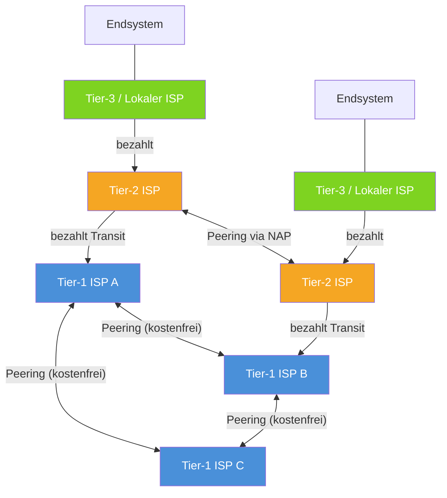
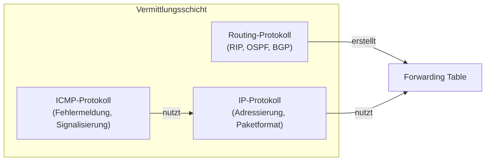
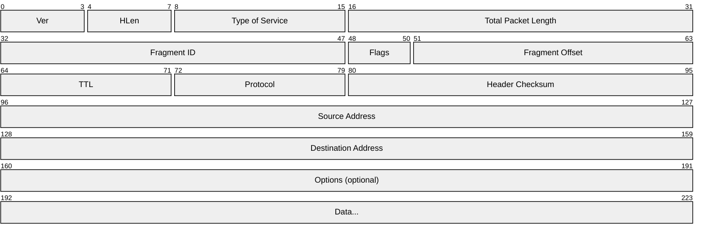
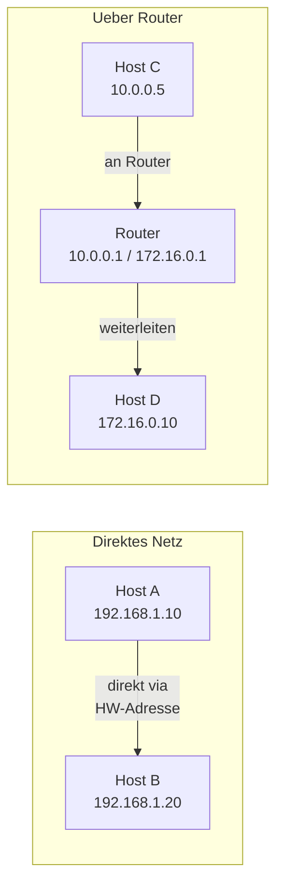

# 05 — IP-Adressen Einfuehrung

**Folien:** [[kommunikationssysteme/resources/Kommunikationsssysteme_5_Einfuehrung_IP_Adressen.pdf|Kommunikationsssysteme_5_Einfuehrung_IP_Adressen.pdf]]

## Inhaltsverzeichnis

- [[#Aufbau des Internets|Aufbau des Internets]]
- [[#Autonome Systeme|Autonome Systeme]]
- [[#Vermittlungsschicht|Vermittlungsschicht]]
- [[#IP-Protokoll Grundprinzipien|IP-Protokoll Grundprinzipien]]
- [[#IPv4-Header|IPv4-Header]]
- [[#Direkte vs. indirekte Zustellung|Direkte vs. indirekte Zustellung]]
- [[#IPv4-Adressierung|IPv4-Adressierung]]
- [[#Classful Addressing|Classful Addressing]]
- [[#Subnetting|Subnetting]]
- [[#Spezielle Adressen|Spezielle Adressen]]
- [[#Fragen zur Selbstkontrolle|Fragen zur Selbstkontrolle]]

---

## Aufbau des Internets

Das Internet ist hierarchisch aufgebaut und besteht aus mehreren Ebenen von Internet Service Providern (ISPs).

| Ebene | Beschreibung |
|---|---|
| **Tier-1 ISPs** | Globale Backbone-Provider, Peering untereinander kostenfrei, bilden das Rueckgrat des Internets |
| **Tier-2 ISPs** | Regionale Provider, bezahlen Tier-1 fuer Anbindung, nutzen NAPs (Network Access Points) fuer Peering untereinander |
| **Tier-3 / Lokale ISPs** | Access Network (z.B. DSL), dicht an Endsystemen, "letzte Meile" |

## Autonome Systeme

> [!quote] Definition
> Ein **Autonomes System (AS)** ist ein Netzwerk oder eine Gruppe von Netzwerken unter einer gemeinsamen administrativen Kontrolle mit einer einheitlichen Routing-Politik.

- Das Internet besteht aus vielen unabhaengigen Eigentuemern
- Vertragswerke regulieren den Datenverkehr zwischen ASen
- Datagramme koennen unterwegs verworfen werden — es gibt keine garantierte Zustellung
- Internet-Standards verlangen eine **gleiche Vermittlungsschicht** (IP) ueber alle Netze hinweg

## Vermittlungsschicht

Die Vermittlungsschicht (Network Layer) besteht aus mehreren Komponenten:

> [!tip] Merke
> Die Vermittlungsschicht umfasst drei Protokolle: **IP** (Adressierung und Paketformat), **Routing-Protokolle** (RIP, OSPF, BGP fuer Wegewahl) und **ICMP** (Fehlermeldungen und Signalisierung). Die Routing-Protokolle befuellen die Forwarding Table, die IP fuer die Weiterleitung nutzt.

## IP-Protokoll Grundprinzipien

- IP bietet **Ende-zu-Ende-Kommunikation** zwischen beliebigen Hosts im Internet
- **Store-and-Forward**: Router empfangen Pakete vollstaendig, bevor sie weitergeleitet werden
- **Verbindungslos**: Jedes Paket wird unabhaengig behandelt, kein Verbindungsaufbau
- IP-Adressen adressieren **Endpunkte in einem Netz aus Netzen**
- Wegwahl erfolgt anhand der **Zieladresse** via Routing-/Forwarding-Tabellen
- **Jeder Router** entscheidet fuer **jedes Paket unabhaengig** ueber den naechsten Hop

> [!warning] Achtung
> IP ist ein **Best-Effort-Dienst** — es gibt keine Garantie fuer Zustellung, Reihenfolge oder Duplikat-Erkennung. Zuverlaessigkeit muss von hoeheren Schichten (z.B. TCP) sichergestellt werden.

## IPv4-Header

Der IPv4-Header hat eine Mindestgroesse von **20 Bytes** (ohne Optionen).

| Feld                     | Groesse | Beschreibung                                    |
| ------------------------ | ------- | ----------------------------------------------- |
| **Version (Ver)**        | 4 Bit   | IP-Version (4 fuer IPv4)                        |
| **Header Length (HLen)** | 4 Bit   | Laenge des Headers in 32-Bit-Woertern           |
| **Type of Service**      | 8 Bit   | QoS-Priorisierung                               |
| **Total Packet Length**  | 16 Bit  | Gesamtlaenge des Pakets in Bytes                |
| **Fragment ID**          | 16 Bit  | Identifikation zusammengehoeriger Fragmente     |
| **Flags**                | 3 Bit   | Steuerung der Fragmentierung (DF, MF)           |
| **Fragment Offset**      | 13 Bit  | Position des Fragments im Originalpaket         |
| **TTL**                  | 8 Bit   | Time to Live — wird bei jedem Hop dekrementiert |
| **Protocol**             | 8 Bit   | Transportprotokoll (6=TCP, 17=UDP)              |
| **Header Checksum**      | 16 Bit  | Pruefsumme nur ueber den Header                 |
| **Source Address**       | 32 Bit  | Absender-IP-Adresse                             |
| **Destination Address**  | 32 Bit  | Ziel-IP-Adresse                                 |

> [!tip] Merke
> Das **TTL-Feld** verhindert, dass Pakete endlos im Netz kreisen. Bei jedem Router wird TTL um 1 dekrementiert. Erreicht TTL den Wert 0, wird das Paket verworfen und ein ICMP-Fehler zurueckgesendet.

## Direkte vs. indirekte Zustellung

| Zustellungsart | Bedingung | Ablauf |
|---|---|---|
| **Direkte Zustellung** | Sender und Empfaenger im gleichen Netz | Hardware-Adresse (MAC) wird benoetigt, kein Router involviert |
| **Indirekte Zustellung** | Sender und Empfaenger in verschiedenen Netzen | Paket wird an Router gesendet, der es weiterleitet |

> [!info] Hinweis
> Router haben **mehr als eine Netzwerkkarte** und somit **mehr als eine IP-Adresse** — jeweils eine pro angeschlossenem Netz. Die topologische Zuordnung ist direkt in der IP-Adresse kodiert.

## IPv4-Adressierung

- IPv4-Adressen sind **32 Bit** lang
- Aufgeteilt in: **Netzwerk-Adresse** (vorderer Teil) + **Rechner-Adresse** (hinterer Teil)
- Die topologische Struktur ist in der IP-Adresse kodiert

> [!quote] Definition
> Eine **IP-Adresse** identifiziert nicht einen einzelnen Rechner, sondern einen **Netzwerkanschluss** (Interface) in einem bestimmten Netz. Ein Rechner mit mehreren Interfaces hat mehrere IP-Adressen.

## Classful Addressing

Das urspruengliche Adressierungsschema teilt den IPv4-Adressraum in fuenf Klassen:

| Klasse | Praefix-Bits | Netz-Bits | Host-Bits | Bereich | Anzahl Netze | Hosts/Netz |
|---|---|---|---|---|---|---|
| **A** | `0` | 8 | 24 | 0.0.0.0 – 127.255.255.255 | 128 | ~16 Mio |
| **B** | `10` | 16 | 16 | 128.0.0.0 – 191.255.255.255 | 16.384 | ~65.000 |
| **C** | `110` | 24 | 8 | 192.0.0.0 – 223.255.255.255 | ~2 Mio | 254 |
| **D** | `1110` | — | — | 224.0.0.0 – 239.255.255.255 | Multicast | — |
| **E** | `1111` | — | — | 240.0.0.0 – 255.255.255.255 | Reserviert | — |

> [!warning] Achtung
> Classful Addressing fuehrt zu massiver **Adressverschwendung**: Klasse A und B sind viel zu gross fuer die meisten Organisationen, Klasse C mit nur 254 Hosts ist oft zu klein. Dieses Problem wird durch **CIDR** geloest (siehe [[kommunikationssysteme/lectures/03/komsys-06-cidr|06 — CIDR]]).

## Subnetting

Subnetting unterteilt ein zugewiesenes Netzwerk in kleinere **Teilnetze** (Subnetze).

> [!quote] Definition
> Eine **Subnetzmaske** ist ein zusammenhaengender Block von 1-Bits (Netz-/Subnetzanteil) gefolgt von 0-Bits (Hostanteil). Sie definiert die Grenze zwischen Netz- und Hostanteil einer IP-Adresse.

**Notation:**
- CIDR-Notation: `/24` (Anzahl der 1-Bits)
- Dotted Decimal: `255.255.255.0`

> [!example] Beispiel
> Ein Klasse-B-Netz `172.16.0.0/16` wird in Subnetze mit `/24` unterteilt:
> - `172.16.1.0/24` — Subnetz 1 (254 Hosts)
> - `172.16.2.0/24` — Subnetz 2 (254 Hosts)
> - ...bis zu 256 Subnetze moeglich
>
> Die Subnetzmaske `255.255.255.0` bewirkt, dass die ersten 24 Bits als Netzanteil und die letzten 8 Bits als Hostanteil interpretiert werden.

> [!tip] Merke
> Die Netzadresse ergibt sich aus: `IP-Adresse AND Subnetzmaske`. Der Hostanteil ergibt sich aus: `IP-Adresse AND NOT Subnetzmaske`.

## Spezielle Adressen

| Adresse | Bedeutung |
|---|---|
| Host-Teil = alle 0 | **Netzadresse** — identifiziert das Netz selbst |
| Host-Teil = alle 1 | **Broadcast** — alle Hosts im Netz |
| `127.x.x.x` | **Loopback** — Pakete verlassen den Rechner nicht |
| `0.0.0.0` | **Dieses System** — wird bei DHCP-Anfragen als Absender verwendet |

---

## Fragen zur Selbstkontrolle

**Selbstkontrolle:** [[kommunikationssysteme/selbstkontrolle/komsys-selbstkontrolle-03|Selbstkontrolle Vorlesung 3]]

**Was ist ein sog. Autonomes System (AS) im Internet?**

Ein autonomes System ist ein zusammenhaengender Netzverbund unter gemeinsamer administrativer Kontrolle. Nach aussen praesentiert sich dieser Verbund mit einer einheitlichen Routing-Politik und einer AS-Nummer. Genau deshalb ist das Internet kein einzelnes zentrales Netz, sondern ein Verbund vieler unabhaengiger Betreiber.

**Wodurch sind Tier 1-3 ISPs charakterisiert?**

- Tier 1: globale Backbone-Betreiber, die untereinander settlement-free peeren und keinen Upstream kaufen muessen
- Tier 2: groessere regionale oder nationale Provider, die teils peeren und teils Transit einkaufen
- Tier 3: accessnahe Provider fuer Endkunden und die "letzte Meile"

**Wieso kann es zwischen autonomen Systemen zu Paketverlusten kommen?**

IP ist ein Best-Effort-Dienst. Zwischen AS existieren wirtschaftliche und technische Uebergabepunkte mit endlichen Puffern und begrenzter Kapazitaet. Ueberlastete Router oder Peering-Links verwerfen Pakete deshalb auch genau an AS-Grenzen.

**Wodurch zeichnet sich ein Backbone-Netz aus?**

Ein Backbone ist das Rueckgrat des Netzes: hohe Uebertragungsraten, grosse Reichweite, leistungsfaehige Kernrouter und starke Redundanz. Seine Aufgabe ist nicht die direkte Endkundenanbindung, sondern der schnelle Transport grosser Verkehrsmengen zwischen Netzen und Regionen.

**Was tut ein Router nach Empfang eines Pakets mit Zieladresse X?**

Der Router arbeitet in mehreren Schritten:

1. Er liest den IP-Header und prueft die Zieladresse.
2. Er dekrementiert die TTL und aktualisiert die Header-Pruefsumme.
3. Er sucht in der Forwarding-Tabelle den besten Eintrag fuer die Zieladresse.
4. Er bestimmt Next Hop und Ausgangsinterface.
5. Er loest fuer das Ausgangsnetz die noetige MAC-Adresse auf und sendet das Paket weiter.

Benoetigt werden also Zieladresse, Praefixe und Masken der Forwarding-Tabelle, Interface-Informationen und lokal die Zuordnung von IP zu MAC.

**Wie erkennt man im classful System die Adressklasse?**

Im alten classful Addressing entscheidet das Bitpraefix des ersten Oktetts:

- `0` -> Klasse A
- `10` -> Klasse B
- `110` -> Klasse C
- `1110` -> Klasse D
- `1111` -> Klasse E

**Wie viele Hosts passen in ein Class-B-Netz?**

Ein Class-B-Netz hat 16 Host-Bits. Damit gibt es `2^16 = 65536` Adressen, davon bleiben wegen Netzadresse und Broadcast genau `65534` nutzbare Host-Adressen.

**Welche speziellen Werte existieren fuer den Host-Anteil?**

- Hostteil `00...00`: Netzadresse
- Hostteil `11...11`: Broadcast-Adresse

Diese beiden Werte bezeichnen also kein einzelnes Endgeraet.

**Was sind private IP-Adressen und Netzwerke?**

Private IPv4-Bloecke sind:

- `10.0.0.0/8`
- `172.16.0.0/12`
- `192.168.0.0/16`

Sie duerfen intern frei verwendet werden, werden aber im globalen Internet nicht geroutet.

**Was ist eine Subnetzmaske und wie ist sie aufgebaut?**

Die Subnetzmaske ist eine Bitmaske aus zusammenhaengenden 1-Bits fuer Netz- und Subnetzteil und anschliessenden 0-Bits fuer den Hostteil. In CIDR-Notation ist das schlicht die Prefixlaenge, z.B. `/24`.

**Warum sind Subnetze fuer Organisationen oft ein Muss?**

Weil grosse Organisationen ihr Netz strukturieren muessen:

- kleinere Broadcast-Domaenen
- klare organisatorische und sicherheitstechnische Trennung
- effizientere Adressnutzung
- einfacheres internes Routing

**Wie bestimmt man zu einem Netz und einer Zahl benoetigter Subnetze die Maske und die Adressbereiche?**

Man entnimmt dem Hostteil so viele Bits, bis `2^s` die gewuenschte Zahl an Subnetzen liefert. Der neue Prefix ist `alter Prefix + s`. Die Hostanzahl je Subnetz ist dann `2^(32-neuer Prefix) - 2`, weil Netz- und Broadcast-Adresse nicht an Endgeraete vergeben werden.

**Wieso duerfen die Adressen mit Hostteil `00..00` und `11..11` nicht verwendet werden?**

Weil diese beiden Bitmuster fuer Netzkennung und Broadcast reserviert sind. Ein einzelner Rechner braucht dagegen eine eindeutige Host-Adresse innerhalb des Subnetzes.
