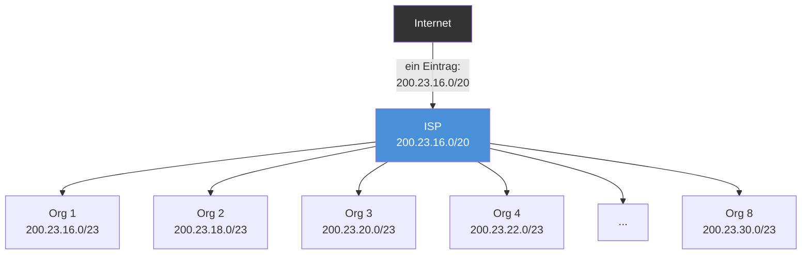
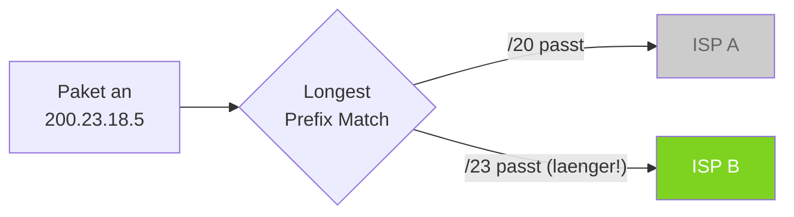
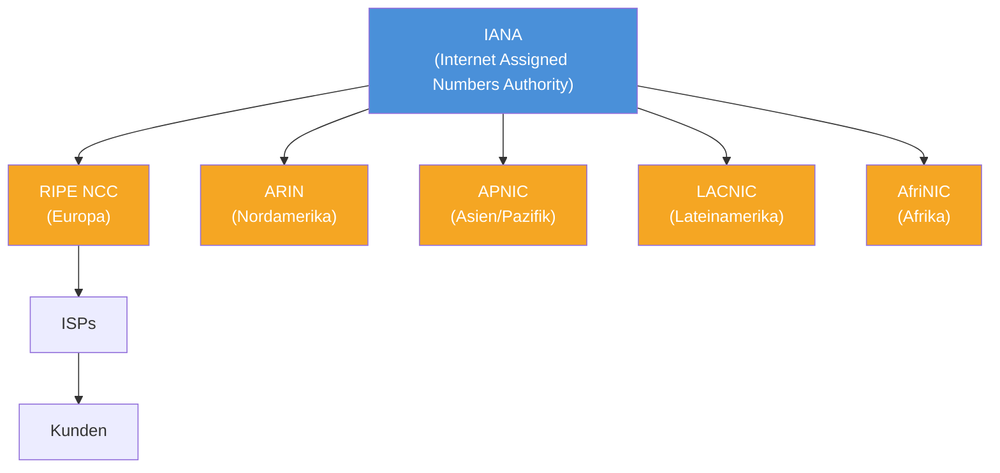

# 06 — CIDR (Classless Inter-Domain Routing)

**Folien:** [[kommunikationssysteme/resources/Kommunikationsssysteme__06_CIDR.pdf|Kommunikationsssysteme__06_CIDR.pdf]]

## Inhaltsverzeichnis

- [[#Probleme des Classful Addressing|Probleme des Classful Addressing]]
- [[#CIDR — Loesung|CIDR — Loesung]]
- [[#Supernetting und Route Aggregation|Supernetting und Route Aggregation]]
- [[#Longest-Prefix-Match|Longest-Prefix-Match]]
- [[#Adressvergabe|Adressvergabe]]
- [[#Beispielrechnung|Beispielrechnung]]
- [[#Fragen zur Selbstkontrolle|Fragen zur Selbstkontrolle]]

---

## Probleme des Classful Addressing

Das klassische Adressierungsschema (siehe [[kommunikationssysteme/lectures/03/komsys-05-ip-adressen|05 — IP-Adressen]]) hat zwei zentrale Probleme:

1. **Adressverschwendung**: Klasse A (~16 Mio Hosts) und B (~65.000 Hosts) sind fuer die meisten Organisationen viel zu gross, Klasse C (254 Hosts) ist oft zu klein
2. **Explosion der Routing-Tabellen**: Jedes einzelne Netz benoetigt einen eigenen Eintrag, was bei Millionen von Klasse-C-Netzen nicht skaliert

> [!warning] Achtung
> Ohne CIDR waere der IPv4-Adressraum laengst erschoepft und die Router waeren mit riesigen Routing-Tabellen ueberfordert.

## CIDR — Loesung

> [!quote] Definition
> **CIDR (Classless Inter-Domain Routing)** hebt die starre Klasseneinteilung auf und erlaubt **beliebige Prefix-Laengen**. Die Grenze zwischen Netz- und Hostanteil kann an jeder Bit-Position liegen.

- Notation: `IP/Prefix` (z.B. `200.23.16.0/20`)
- Flexible Netzgroessen: Netze koennen exakt so gross wie noetig zugeschnitten werden
- Loest beide Probleme: weniger Verschwendung und kleinere Routing-Tabellen

| Prefix | Anzahl Adressen | Entspricht |
|---|---|---|
| /20 | 4.096 | 16 Klasse-C-Netze |
| /21 | 2.048 | 8 Klasse-C-Netze |
| /23 | 512 | 2 Klasse-C-Netze |
| /24 | 256 | 1 Klasse-C-Netz |
| /25 | 128 | halbes Klasse-C-Netz |

## Supernetting und Route Aggregation

**Supernetting** ist das Gegenteil von Subnetting: Mehrere kleinere Netze werden zu einem groesseren Block zusammengefasst.

> [!tip] Merke
> **Route Aggregation** (auch Supernetting) ermoeglicht es ISPs, alle ihre Kundennetze als **einen einzigen Routing-Eintrag** nach aussen zu kommunizieren. Das reduziert die Groesse der globalen Routing-Tabellen erheblich.

> [!example] Beispiel
> Ein ISP hat den Block `200.23.16.0/20` und verteilt ihn an 8 Organisationen mit je `/23`:
> - Org 1: `200.23.16.0/23`
> - Org 2: `200.23.18.0/23`
> - Org 3: `200.23.20.0/23`
> - ...
> - Org 8: `200.23.30.0/23`
>
> Gegenueber dem restlichen Internet advertiert der ISP nur den aggregierten Block `200.23.16.0/20`.

## Longest-Prefix-Match

Wenn mehrere Eintraege in der Routing-Tabelle auf eine Zieladresse passen, wird der **spezifischste Eintrag** (laengster Prefix) verwendet.

> [!quote] Definition
> **Longest-Prefix-Match**: Bei der Wegewahl wird derjenige Routing-Tabelleneintrag gewaehlt, dessen Prefix am laengsten mit der Zieladresse uebereinstimmt. Je laenger der Prefix, desto spezifischer die Route.

> [!example] Beispiel
> Routing-Tabelle:
> - `200.23.16.0/20` -> ISP A
> - `200.23.18.0/23` -> ISP B
>
> Ein Paket an `200.23.18.5` passt auf beide Eintraege. Da `/23` laenger als `/20` ist, wird das Paket an **ISP B** geleitet.

> [!warning] Achtung
> Longest-Prefix-Match ist essentiell fuer CIDR. Ohne dieses Prinzip waere Route Aggregation nicht moeglich, da spezifischere Routen nicht bevorzugt wuerden.

## Adressvergabe

Die Vergabe von IP-Adressbloecken erfolgt hierarchisch:

| Ebene | Aufgabe |
|---|---|
| **IANA** | Globale Verwaltung des Adressraums |
| **RIRs** (Regional Internet Registries) | Regionale Verteilung an ISPs (RIPE fuer Europa, ARIN fuer Nordamerika, etc.) |
| **ISPs** | Vergabe von Adressbloecken an Kunden |
| **Kunden** | Nutzung der zugewiesenen Adressen |

## Beispielrechnung

> [!example] Beispiel
> Ein ISP erhaelt den Block `200.23.16.0/20`:
> - `/20` = 32 - 20 = 12 Host-Bits = 2^12 = **4.096 Adressen**
> - Aufgeteilt in 8 Organisationen mit je `/23`:
>   - `/23` = 32 - 23 = 9 Host-Bits = 2^9 = **512 Adressen** pro Organisation
>   - 8 x 512 = 4.096 — der gesamte Block wird ausgeschoepft
> - Nutzbare Host-Adressen pro `/23`: 512 - 2 = **510** (abzueglich Netzadresse und Broadcast)

---

## Fragen zur Selbstkontrolle

**Selbstkontrolle:** [[kommunikationssysteme/selbstkontrolle/komsys-selbstkontrolle-03|Selbstkontrolle Vorlesung 3]]

**Wie funktioniert die Idee von CIDR, und warum ermoeglicht sie die "Untervermietung" von Adressbereichen?**

CIDR ersetzt feste Klassen durch frei waehhlbare Prefixlaengen. Ein Provider kann dadurch einen grossen Block bekommen und ihn flexibel in kleinere Teilpraefixe aufteilen. Genau das ist mit "Untervermietung" gemeint: ein zusammenhaengender Bereich wird hierarchisch weitergegeben.

**Warum fuehrt CIDR zur Kompaktierung von Routing-Tabellen?**

Mehrere zusammenhaengende Netze mit gleichem Oberpraefix koennen zu einer aggregierten Route zusammengefasst werden. Nach aussen sieht man dann statt vieler einzelner Kundennetze nur noch einen gemeinsamen Prefix. Das reduziert Eintraege in Routing-Tabellen deutlich.

**Wie funktioniert Longest Prefix Match?**

Wenn eine Zieladresse zu mehreren Routing-Eintraegen passt, wird immer die spezifischste Route gewaehlt, also die mit dem laengsten passenden Prefix. Ein `/23` schlaegt daher z.B. einen allgemeineren `/20`-Eintrag fuer dieselbe Zieladresse.

> [!tip] Merke
> CIDR und Route Aggregation funktionieren nur sauber, wenn Router bei ueberlappenden Eintraegen konsequent Longest Prefix Match anwenden.
