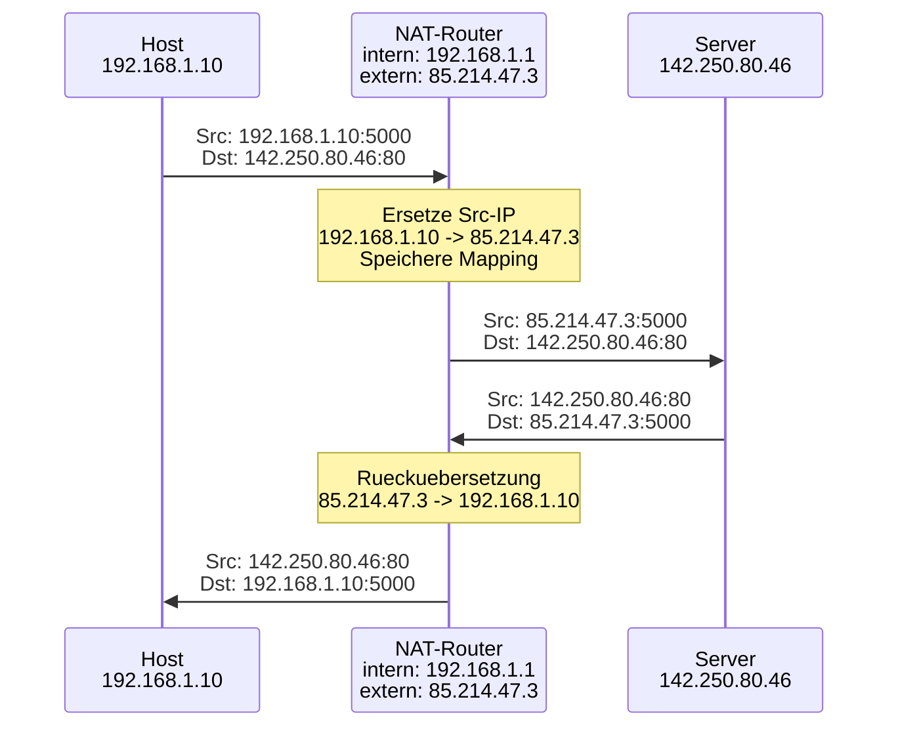
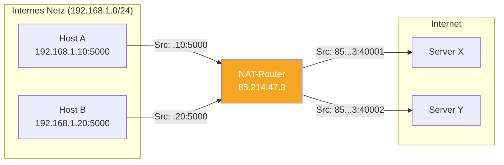
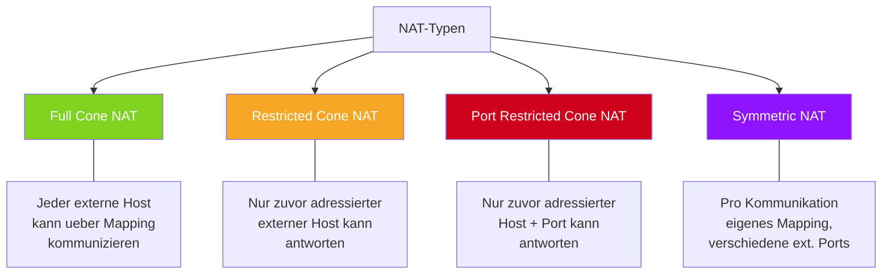

# 07 — NAT (Network Address Translation)

**Folien:** [[kommunikationssysteme/resources/Kommunikationssysteme_07_NAT.pdf|Kommunikationssysteme_07_NAT.pdf]]

## Inhaltsverzeichnis

- [[#Motivation|Motivation]]
- [[#Private Adressbloecke|Private Adressbloecke]]
- [[#NAT-Grundprinzip|NAT-Grundprinzip]]
- [[#NAPT — Network Address Port Translation|NAPT — Network Address Port Translation]]
- [[#NAT-Typen|NAT-Typen]]
- [[#Probleme und Einschraenkungen|Probleme und Einschraenkungen]]
- [[#Fragen zur Selbstkontrolle|Fragen zur Selbstkontrolle]]

---

## Motivation

- **Adressknappheit** bei IPv4: der 32-Bit-Adressraum reicht nicht fuer alle Geraete weltweit
- **Vereinfachter Aufbau von Heimnetzen**: Nur der Default-Router braucht eine oeffentliche IP-Adresse
- Das interne Netz nutzt **private Adressen**, die nicht global geroutet werden

## Private Adressbloecke

> [!quote] Definition
> **Private IP-Adressen** (RFC 1918) sind Adressbereiche, die frei in internen Netzen verwendet werden duerfen. Sie werden im globalen Internet **nicht geroutet** und sind von aussen **nicht direkt erreichbar**.

| Block | Bereich | Anzahl Adressen | Entspricht |
|---|---|---|---|
| `10.0.0.0/8` | 10.0.0.0 – 10.255.255.255 | ~16,7 Mio | 1 Klasse-A-Netz |
| `172.16.0.0/12` | 172.16.0.0 – 172.31.255.255 | ~1 Mio | 16 Klasse-B-Netze |
| `192.168.0.0/16` | 192.168.0.0 – 192.168.255.255 | ~65.000 | 256 Klasse-C-Netze |

> [!warning] Achtung
> Private Adressen sind **nicht weltweit eindeutig**. Mehrere Heimnetze koennen dieselben privaten Adressen verwenden (z.B. `192.168.1.0/24`). Ohne NAT koennen Pakete mit privaten Absenderadressen das Internet nicht durchqueren.

## NAT-Grundprinzip

Der NAT-Router ersetzt beim Verlassen des Netzes die **private Absenderadresse** durch seine eigene **oeffentliche IP-Adresse**. Bei eingehenden Antworten wird die Rueckuebersetzung durchgefuehrt.

> [!info] Hinweis
> **Problem der Rueckuebersetzung**: Wenn mehrere interne Rechner gleichzeitig kommunizieren, hat der NAT-Router nur eine externe IP. Allein anhand der IP-Adresse kann er nicht unterscheiden, welchem internen Rechner eine Antwort gehoert. Dieses Problem loest NAPT.

## NAPT — Network Address Port Translation

> [!quote] Definition
> **NAPT (Network Address Port Translation)** nutzt den **TCP/UDP-Port** als zusaetzliches Unterscheidungskriterium, um mehrere interne Rechner ueber eine einzige externe IP-Adresse zu multiplexen.
> Auch bekannt als: **Hiding NAT**, **NAT-Overloading**, **Masquerading**.

Die Abbildungstabelle speichert fuer jede Verbindung:

| Transport-Protokoll | IP lokal | Port lokal | IP global | Port global |
|---|---|---|---|---|
| TCP | 192.168.1.10 | 5000 | 85.214.47.3 | 40001 |
| TCP | 192.168.1.20 | 5000 | 85.214.47.3 | 40002 |
| UDP | 192.168.1.10 | 3000 | 85.214.47.3 | 40003 |

> [!tip] Merke
> NAPT ermoeglicht es, dass **tausende interne Geraete** gleichzeitig ueber eine einzige oeffentliche IP kommunizieren. Der NAT-Router vergibt eindeutige externe Ports und fuehrt Buch ueber die Zuordnung in seiner Abbildungstabelle.

## NAT-Typen

Je nachdem, wie streng der NAT-Router eingehende Pakete filtert, unterscheidet man vier Typen:

| NAT-Typ | Eingehende Pakete erlaubt von | Restriktivitaet |
|---|---|---|
| **Full Cone** | Jedem externen Host, sobald ein Mapping existiert | Niedrig |
| **Restricted Cone** | Nur von dem externen Host, an den zuvor gesendet wurde (beliebiger Port) | Mittel |
| **Port Restricted Cone** | Nur von dem externen Host UND Port, an den zuvor gesendet wurde | Hoch |
| **Symmetric** | Pro Ziel-Kombination wird ein eigenes Mapping mit anderem externen Port erzeugt | Hoechste |

> [!example] Beispiel
> **Full Cone NAT**: Host A sendet an Server X. Danach kann auch Server Y ueber das gemappte Tupel (externe IP + Port) an Host A senden — ohne dass Host A je mit Server Y kommuniziert hat.
>
> **Symmetric NAT**: Host A sendet an Server X (ext. Port 40001) und an Server Y (ext. Port 40002). Jede Kommunikation bekommt einen eigenen externen Port. Server X kann nur ueber Port 40001 antworten, Server Y nur ueber 40002.

## Probleme und Einschraenkungen

> [!warning] Achtung
> - **Interne Rechner sind von aussen nicht erreichbar**, solange kein Mapping existiert
> - **Hole Punching** wird benoetigt, um Peer-to-Peer-Verbindungen hinter NAT aufzubauen (z.B. VoIP, Online-Gaming)
> - NAT bricht das **Ende-zu-Ende-Prinzip** des Internets: Anwendungen muessen NAT-Traversal-Techniken implementieren
> - Protokolle, die IP-Adressen im Payload uebertragen (z.B. FTP, SIP), benoetigen spezielle **Application Layer Gateways (ALGs)**

---

## Fragen zur Selbstkontrolle

**Selbstkontrolle:** [[kommunikationssysteme/selbstkontrolle/komsys-selbstkontrolle-03|Selbstkontrolle Vorlesung 3]]

**Was sind private IP-Adressen und Netzwerke?**

Private IPv4-Adressen sind nur fuer interne Netze gedacht und werden im Internet nicht geroutet. Mehrere Haushalte oder Firmen duerfen daher dieselben privaten Bereiche parallel benutzen, ohne globale Eindeutigkeit sicherstellen zu muessen.

**Welche Massnahmen sind fuer den Einsatz privater IP-Adressen notwendig?**

Sobald ein privates Netz mit dem Internet kommunizieren soll, braucht es einen Uebergangspunkt mit NAT oder NAPT. Dieser Router ersetzt interne private Quelladressen durch eine oeffentliche Adresse und fuehrt eine Zuordnungstabelle fuer Rueckpakete.

**Warum erfordert ein interner Dienst mit privater Adresse am NAT-Router eine manuelle Konfiguration?**

Bei ausgehenden Verbindungen entsteht das Mapping automatisch. Bei eingehenden Verbindungen von aussen existiert dieses Mapping aber zunaechst nicht. Der Router weiss also nicht, welcher interne Host gemeint ist. Deshalb braucht man:

- statisches Port-Forwarding
- 1:1-NAT
- oder spezielle NAT-Traversal-Protokolle wie STUN/TURN/ICE

> [!warning] Achtung
> NAT macht interne Hosts standardmaessig von aussen unsichtbar. Das ist praktisch, bricht aber das Ende-zu-Ende-Prinzip und erschwert Serverbetrieb, Peer-to-Peer und manche Anwendungsprotokolle.
