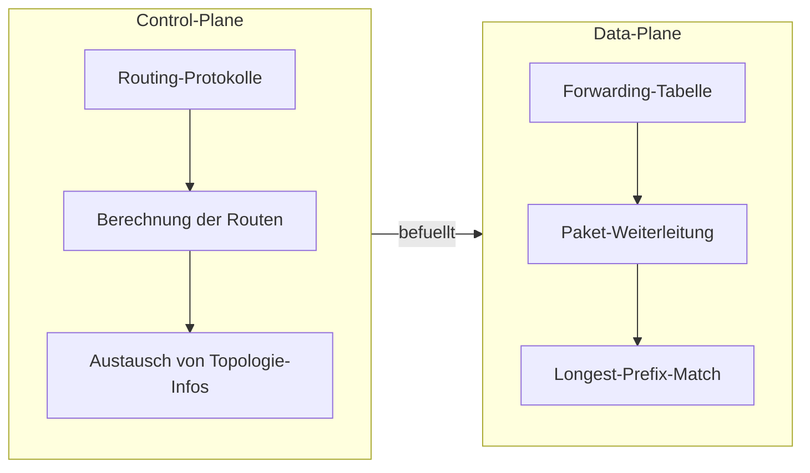
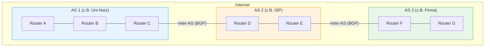
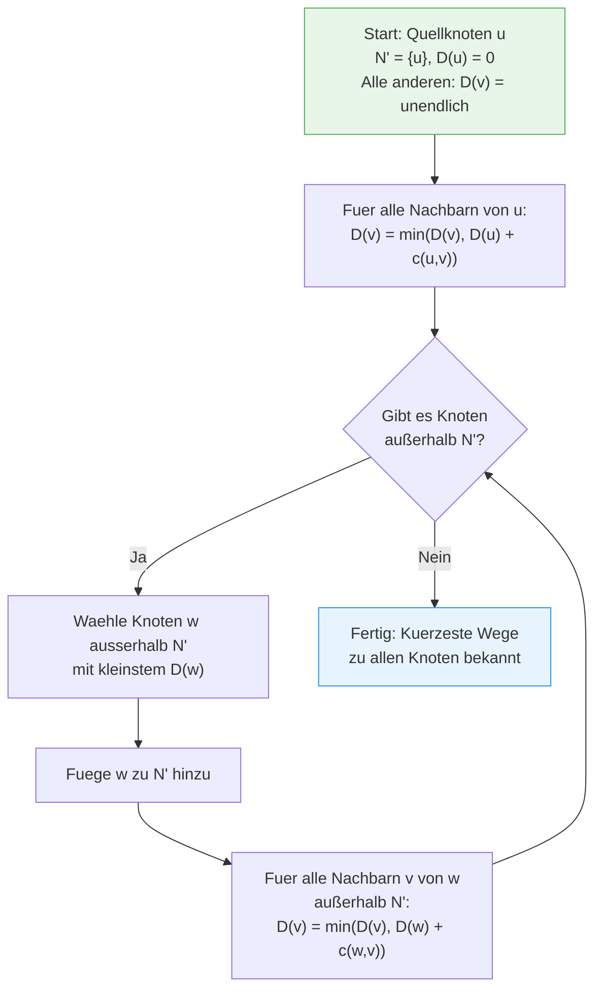

# 08 — Routingprotokolle

**Folien:** [[kommunikationssysteme/resources/Kommunikationssysteme_08_Routingprotokolle.pdf|Kommunikationssysteme_08_Routingprotokolle.pdf]]

## Inhaltsverzeichnis

- [[#Routing — Grundkonzept|Routing — Grundkonzept]]
- [[#Control-Plane und Data-Plane|Control-Plane und Data-Plane]]
- [[#Routing-Tabelle und Forwarding|Routing-Tabelle und Forwarding]]
- [[#Autonome Systeme: Intra-AS und Inter-AS|Autonome Systeme: Intra-AS und Inter-AS]]
- [[#Link-State Protokolle|Link-State Protokolle]]
- [[#Dijkstra-Algorithmus|Dijkstra-Algorithmus]]
- [[#Distance-Vektor-Algorithmus|Distance-Vektor-Algorithmus]]
- [[#Uebersicht Routing-Protokolle|Uebersicht Routing-Protokolle]]
- [[#Fragen zur Selbstkontrolle|Fragen zur Selbstkontrolle]]

---

## Routing — Grundkonzept

Routing verbindet **Teilstrecken** fuer eine Ende-zu-Ende-Kommunikation ueber Netzgrenzen hinweg. Ziel ist es, den optimalen Weg von einer Quelle zu einem Ziel durch ein Netz aus Routern und Teilnetzen zu finden.

> [!quote] Definition
> **Routing** ist der Prozess der Wegwahl fuer Pakete ueber mehrere Netzwerke hinweg. Jeder Router trifft seine Entscheidung **unabhaengig** von vorherigen Routern, ausschliesslich auf Basis der **Zieladresse** im Paket.

---

## Control-Plane und Data-Plane

- **Control-Plane:** Logik der Wegwahl — Router tauschen Informationen aus und berechnen optimale Routen
- **Data-Plane:** Eigentliches Weiterleiten der Pakete anhand der Forwarding-Tabelle

> [!tip] Merke
> Die Routing-Entscheidung basiert auf **Longest-Prefix-Match** der Zieladresse. Jede Entscheidung ist **unabhaengig** von vorherigen Entscheidungen anderer Router.

---

## Routing-Tabelle und Forwarding

- Jeder Rechner und jeder Router hat eine eigene **Routing-/Forwarding-Tabelle**
- Konfiguration kann erfolgen durch:
  - **Statisch:** Manuell oder per DHCP (Default-Route)
  - **Dynamisch:** Ueber Routing-Protokolle — Router tauschen Informationen ueber angeschlossene Netze und Erreichbarkeit aus

> [!info] Hinweis
> Bei Endgeraeten genuegt oft eine **Default-Route** zum naechsten Router. Komplexe Routing-Tabellen sind vor allem auf Routern noetig.

---

## Autonome Systeme: Intra-AS und Inter-AS

Das Internet ist in **Autonome Systeme (AS)** unterteilt — jeweils unter einheitlicher Verwaltung. Routing-Protokolle sind dementsprechend abgestuft:

| Typ | Bereich | Beispiel-Protokolle | Algorithmus |
|---|---|---|---|
| **Intra-AS** | Innerhalb eines AS | OSPF, RIP, IS-IS | Link-State / Distance-Vector |
| **Inter-AS** | Zwischen AS | BGP | Distance-Vector (Path-Vector) |

> [!tip] Merke
> **Intra-AS** (Interior Gateway Protocol): Routing innerhalb eines Autonomen Systems. **Inter-AS** (Exterior Gateway Protocol): Routing zwischen verschiedenen AS.

---

## Link-State Protokolle

Link-State ist der Ansatz fuer **Intra-AS-Routing**, bei dem jeder Router die **gesamte Netztopologie** kennt.

**Ablauf:**
1. Jeder Router kommuniziert mit seinen **direkten Nachbarn**
2. Router teilen ihre **Verbindungen und Kosten** (Link-State Advertisements) mit
3. Per **Flooding** werden diese Informationen an alle Router im AS verteilt
4. Jeder Router lernt die **gesamte Netztopologie**
5. Mit dem **Dijkstra-Algorithmus** berechnet jeder Router den kuerzesten Weg zu allen Zielen

> [!success] Best Practice
> Link-State Protokolle konvergieren schnell, da jeder Router ein vollstaendiges Bild des Netzes hat. **OSPF** ist das meistverbreitete Link-State Protokoll.

---

## Dijkstra-Algorithmus

Der Dijkstra-Algorithmus berechnet den **kuerzesten Weg** von einem Quellknoten zu allen anderen Knoten im Graphen.

**Prinzip:**
- Teilt den Graphen in zwei Mengen: **N'** (kuerzester Weg bekannt) und **Rest**
- Ausgehend von der Quelle wird in jedem Schritt der **guenstigste Knoten** aus dem Rest zu N' hinzugefuegt
- Die Kosten der Nachbarn werden aktualisiert, falls ein kuerzerer Weg ueber den neu hinzugefuegten Knoten existiert

> [!example] Beispiel
> Knoten A (Quelle), Nachbarn B (Kosten 2) und C (Kosten 5):
> 1. N' = {A}, D(B)=2, D(C)=5
> 2. B hat kleinste Kosten → N' = {A, B}
> 3. Ueber B: Falls D(C) > D(B) + c(B,C), aktualisiere D(C)
> 4. Weiter bis alle Knoten in N'

---

## Distance-Vektor-Algorithmus

Der Distance-Vektor-Algorithmus ist ein **dezentraler** Ansatz — kein Router kennt die gesamte Topologie.

**Prinzip:**
- Jeder Router verwaltet eine **Entfernungstabelle** mit vermuteten Entfernungen zu allen Knoten
- Unbekannte Wege werden als **unendlich** initialisiert
- Nachbarn tauschen regelmassig ihre Tabellen aus
- Sukzessive entsteht ein **konsistentes Bild** der Netzentfernungen

**Berechnung des kuerzesten Weges:**
- Fuer ein Ziel Z waehle den Nachbarn N mit den **minimalen Gesamtkosten**: eigene Verbindungskosten zu N + dessen Kosten zum Ziel Z

> [!warning] Achtung
> Distance-Vektor-Algorithmen koennen unter dem **Count-to-Infinity-Problem** leiden: Bei einem Ausfall steigen die Entfernungsschaetzungen nur langsam an, da Nachbarn sich gegenseitig veraltete Informationen mitteilen.

| Eigenschaft | Link-State | Distance-Vector |
|---|---|---|
| Topologie-Wissen | Vollstaendig (alle Router) | Nur Nachbarn |
| Algorithmus | Dijkstra (zentral pro Router) | Bellman-Ford (dezentral) |
| Konvergenz | Schnell | Langsamer |
| Nachrichtenaufwand | Hoch (Flooding) | Gering (nur Nachbarn) |
| Typischer Einsatz | Intra-AS (OSPF) | Inter-AS (BGP), Intra-AS (RIP) |

---

## Uebersicht Routing-Protokolle

| Protokoll | Typ | Algorithmus | Beschreibung |
|---|---|---|---|
| **RIP / RIP2** | Intra-AS | Distance-Vector | Einfach, max. 15 Hops |
| **OSPF** | Intra-AS | Link-State | Open Shortest Path First, weit verbreitet |
| **IS-IS** | Intra-AS | Link-State | Intermediate System to Intermediate System |
| **BGP** | Inter-AS | Distance-Vector (Path-Vector) | Border Gateway Protocol, verbindet AS |

> [!tip] Merke
> **OSPF** ist das Standard-Intra-AS-Protokoll und nutzt Dijkstra. **BGP** ist das einzige Inter-AS-Protokoll im Internet und basiert auf Path-Vectors.

---

## Fragen zur Selbstkontrolle

**Selbstkontrolle:** [[kommunikationssysteme/selbstkontrolle/komsys-selbstkontrolle-04|Selbstkontrolle Vorlesung 4]]

**Erklaeren Sie den Unterschied zwischen Routing und Forwarding.**

Routing ist die Berechnung bzw. das Lernen von Wegen durch das Netz. Forwarding ist die konkrete Weiterleitung eines einzelnen Pakets anhand des bereits bekannten Eintrags in der Tabelle. Deshalb gehoert Routing in die Control Plane und Forwarding in die Data Plane.

**Welche zwei Arten von Routingverfahren kennen Sie?**

Die Vorlesung trennt vor allem:

- Link-State: jeder Router kennt die Topologie und rechnet selbst
- Distance-Vector: jeder Router kennt nur Kosten ueber Nachbarn und verbessert seine Schaetzung iterativ

**Wieso gibt es zwei Verfahren?**

Weil Netze unterschiedliche Anforderungen haben. Link-State konvergiert schnell und ist topologisch sehr genau, erzeugt aber mehr Informationsaustausch. Distance-Vector ist einfacher und lokaler, konvergiert aber langsamer und ist anfaelliger fuer Probleme wie Count-to-Infinity.

**Beschreiben Sie ein Distance-Vector-Verfahren mit eigenen Worten. Wo wird Bellman-Ford verwendet?**

Jeder Router speichert fuer jedes Ziel seine aktuell beste Distanz und den naechsten Hop. Regelmaessig schickt er diesen Vektor an seine Nachbarn. Aus den empfangenen Vektoren berechnet er mit der Bellman-Ford-Idee:

`Kosten(Ziel) = min ueber alle Nachbarn { Linkkosten zum Nachbarn + Distanz des Nachbarn zum Ziel }`

Dadurch verbessert sich die Tabelle schrittweise, bis keine besseren Wege mehr gefunden werden.
