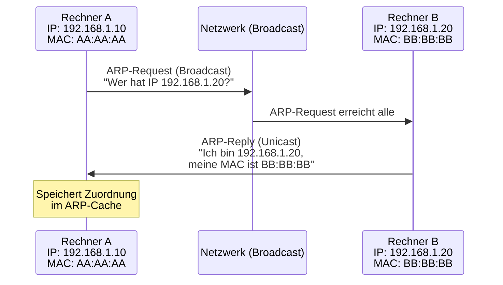
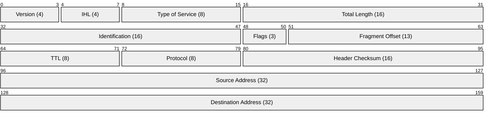
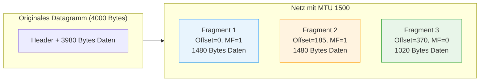

# 09 — ARP, ICMP und IP-Header

**Folien:** [[kommunikationssysteme/resources/Kommunikationssysteme_9_ARP_ICMP_IP.pdf|Kommunikationssysteme_9_ARP_ICMP_IP.pdf]]

## Inhaltsverzeichnis

- [[#ARP (Address Resolution Protocol)|ARP (Address Resolution Protocol)]]
- [[#RARP (Reverse ARP)|RARP (Reverse ARP)]]
- [[#DHCP (Dynamic Host Configuration Protocol)|DHCP (Dynamic Host Configuration Protocol)]]
- [[#ICMP (Internet Control Message Protocol)|ICMP (Internet Control Message Protocol)]]
- [[#IPv4-Header im Detail|IPv4-Header im Detail]]
- [[#Fragmentierung|Fragmentierung]]
- [[#Fragen zur Selbstkontrolle|Fragen zur Selbstkontrolle]]

---

## ARP (Address Resolution Protocol)

**Problem:** Die IP-Adresse des Ziels ist bekannt, aber fuer die Sicherungsschicht (Schicht 2) wird die **Hardware-Adresse (MAC)** benoetigt.

**Ablauf:**
1. Station sendet **ARP-Request als Broadcast** — "Rechner X sucht Rechner Y"
2. Nur das Ziel antwortet per **Unicast** mit seiner MAC-Adresse
3. Die Zuordnung wird im **ARP-Cache** temporaer gespeichert

> [!quote] Definition
> **ARP** ermoeglicht die dynamische Zuordnung von IP-Adressen zu MAC-Adressen in Multi-Access-Netzen mit Broadcast-Faehigkeit.

> [!warning] Achtung
> Die **Schichtzuordnung von ARP** ist umstritten: Die Literatur ordnet ARP Schicht 2 zu, da es MAC-Adressen aufloest. ARP nutzt jedoch IP-Adressen — daher sprechen manche von **Schicht 2.5** oder ordnen es Schicht 3 zu.

> [!info] Hinweis
> **IPv6** verwendet kein ARP mehr, sondern das **Neighbor Discovery Protocol (NDP)**, das auf ICMPv6 basiert.

---

## RARP (Reverse ARP)

- **Inverse Richtung:** MAC-Adresse → IP-Adresse
- Anfrage per Broadcast, ein **RARP-Server** antwortet mit der zugehoerigen IP
- Historisch relevant, heute durch DHCP ersetzt

---

## DHCP (Dynamic Host Configuration Protocol)

DHCP verteilt dynamisch die **IP-Konfiguration** an Clients: IP-Adresse, Subnetzmaske, Default-Router, DNS-Server.

**Ablauf:**
1. **DHCPDISCOVER:** Client sendet per UDP-Broadcast (Quell-IP `0.0.0.0:68` → Ziel `255.255.255.255:67`) und Ethernet-Broadcast
2. DHCP-Server antwortet ueber **Port und MAC** gezielt an den Client

> [!warning] Achtung
> DHCP ist grundsaetzlich **unsicher** — jeder kann sich als DHCP-Server ausgeben. An der FH wird daher **Port Security** eingesetzt, um unauthorisierte DHCP-Server zu verhindern.

---

## ICMP (Internet Control Message Protocol)

> [!quote] Definition
> **ICMP** ist ein Protokoll der Schicht 3 fuer **Fehlermeldungen und Diagnose**. Es nutzt IP zur Uebertragung (Protocol-Nummer 1 im IP-Header).

**Wichtige ICMP-Typen:**

| Typ | Name | Beschreibung |
|---|---|---|
| 0 / 8 | Echo Reply / Echo Request | **Ping** — Erreichbarkeitspruefung |
| 3 | Destination Unreachable | Ziel nicht erreichbar (versch. Codes) |
| 11 | Time Exceeded | TTL abgelaufen — Paket verworfen |
| 5 | Redirect | Bessere Route verfuegbar |

> [!example] Beispiel
> **Traceroute** nutzt ICMP geschickt aus:
> 1. Sende Pakete mit **TTL = 1, 2, 3, ...** an das Ziel
> 2. Jeder Router auf dem Weg dekrementiert TTL; bei TTL = 0 wird das Paket verworfen und eine **ICMP Time Exceeded**-Nachricht zurueckgesendet
> 3. So wird Hop fuer Hop der gesamte Pfad sichtbar

---

## IPv4-Header im Detail

| Feld | Bits | Beschreibung |
|---|---|---|
| **Version** | 4 | IPv4 = 4 |
| **IHL** (Internet Header Length) | 4 | Header-Laenge in 32-Bit-Woertern (min. 5 = 20 Bytes) |
| **Type of Service** | 8 | Priorisierung / QoS |
| **Total Length** | 16 | Gesamtlaenge des Datagramms in Bytes (max. 64 KB) |
| **Identification** | 16 | Identifiziert zusammengehoerige Fragmente |
| **Flags** | 3 | Bit 0: Unused, Bit 1: **DF** (Don't Fragment), Bit 2: **MF** (More Fragments) |
| **Fragment Offset** | 13 | Position im Original-Datagramm, in **Vielfachen von 8 Bytes** |
| **TTL** (Time to Live) | 8 | Hop Count — wird pro Router dekrementiert, bei 0 → Paket vernichtet |
| **Protocol** | 8 | Upper-Layer-Protokoll: TCP=6, UDP=17, ICMP=1 |
| **Header Checksum** | 16 | Pruefsumme nur ueber den Header |
| **Source Address** | 32 | Quell-IP-Adresse |
| **Destination Address** | 32 | Ziel-IP-Adresse |

> [!warning] Achtung
> Die **Header Checksum** aendert sich bei **jedem Router**, da der TTL-Wert dekrementiert wird. Deshalb muss jeder Router die Checksum neu berechnen.

> [!tip] Merke
> Der **Fragment Offset** wird in Vielfachen von **8 Bytes** angegeben, nicht in Bytes. Das ist eine beliebte Klausurfalle.

---

## Fragmentierung

Fragmentierung wird noetig, wenn ein IP-Datagramm groesser ist als die **MTU** (Maximum Transmission Unit) der darunterliegenden Sicherungsschicht.

**MTU-Beispiele:**

| Technologie | MTU (Bytes) |
|---|---|
| Ethernet | 1500 |
| Gigabit Ethernet (Jumbo Frames) | 9000 |
| FDDI | 4500 |
| ATM | 9180 |

> [!quote] Definition
> Das Internet schreibt vor, dass die Sicherungsschicht mindestens **576 Bytes** unterstuetzen muss.

**Eigenschaften der Internet-Fragmentierung:**
- **Nicht-transparent:** Reassembly erfolgt nur am **Endsystem**, nicht an Zwischen-Routern
- Fragmente koennen **out-of-order**, **dupliziert** oder **verloren** ankommen
- Zusammengehoerigkeit wird ueber das **Identification**-Feld bestimmt
- **MF-Flag** zeigt an, ob weitere Fragmente folgen
- **Fragment Offset** gibt die Position im Original an

> [!example] Beispiel
> Datagramm mit 4000 Bytes Gesamtlaenge, MTU = 1500:
> - **Fragment 1:** 20 Bytes Header + 1480 Bytes Daten, Offset = 0, MF = 1
> - **Fragment 2:** 20 Bytes Header + 1480 Bytes Daten, Offset = 185 (= 1480/8), MF = 1
> - **Fragment 3:** 20 Bytes Header + 1020 Bytes Daten, Offset = 370 (= 2960/8), MF = 0
>
> Beachte: Jedes Fragment erhaelt einen eigenen IP-Header (20 Bytes), daher passen maximal **MTU - 20 = 1480** Bytes Nutzdaten pro Fragment. Der Offset wird in 8-Byte-Einheiten angegeben.

---

## Fragen zur Selbstkontrolle

**Selbstkontrolle:** [[kommunikationssysteme/selbstkontrolle/komsys-selbstkontrolle-04|Selbstkontrolle Vorlesung 4]]

**Was sind private IP-Netze, und wie werden sie mit NAT eingesetzt?**

Private Netze verwenden RFC-1918-Adressbereiche und sind intern frei nutzbar, aber von aussen nicht global erreichbar. Ein NAT-Router setzt beim Verlassen des Netzes Quelladresse und haeufig auch den Port auf eine oeffentliche Kombination um.

**Was passiert beim Senden und beim Empfang ueber einen NAT-Router?**

Beim Senden legt der Router ein Mapping aus internem Tupel und externem Tupel an. Beim Rueckpaket sucht er dieses Mapping und setzt Zieladresse und Zielport auf den internen Host zurueck.

**Warum verletzt NAT die Schichtenarchitektur, und welche Probleme entstehen?**

NAT bleibt nicht sauber in Schicht 3, weil es oft Ports und teils sogar Anwendungsdaten beachten muss. Probleme entstehen besonders bei eingehenden Verbindungen, Protokollen mit eingebetteten Adressen, Peer-to-Peer und beim Verlust echter Ende-zu-Ende-Transparenz.

**Welche Aufgaben haben IP- und MAC-Adressen?**

IP dient der logischen, hierarchischen Ende-zu-Ende-Adressierung ueber mehrere Netze. MAC dient der lokalen Zustellung auf dem unmittelbar angeschlossenen Medium.

**Wozu dient ARP, und wie ordnet man es einer Schicht zu?**

ARP loest eine bekannte IP-Adresse in die passende MAC-Adresse auf. Es sitzt begrifflich zwischen Schicht 2 und 3, weil es lokale Rahmenzustellung ermoeglicht, aber mit IP-Adressen arbeitet.

**Wie funktioniert DHCP?**

Ein Client ohne Adresse sendet per Broadcast ein Discover. Der Server antwortet mit Offer, der Client fordert per Request an, der Server bestaetigt mit Ack. Dabei werden typischerweise IP-Adresse, Netzmaske, Gateway und DNS-Server mitgeliefert.

**Welche Funktion haben TTL und Fragment Offset?**

TTL begrenzt die Lebensdauer eines Pakets in Hop-Schritten und verhindert Schleifen. Der Fragment Offset gibt an, an welcher Position ein Fragment im urspruenglichen Datagramm liegt; die Einheit ist 8 Bytes.

**Welche Header-Felder aendern Router immer?**

Immer die TTL und daraus folgend die Header-Pruefsumme. Bei Fragmentierung kommen weitere Anpassungen hinzu, aber die sind nicht in jedem Hop zwingend.

**Warum wird fragmentiert, welche Rolle spielt die MTU, und was ist bei 8 Byte wichtig?**

Wenn ein Datagramm groesser ist als die MTU des naechsten Links, muss es zerlegt werden. Da der Offset in 8-Byte-Einheiten codiert ist, muessen alle Fragmente ausser dem letzten eine Nutzdatenlaenge haben, die durch 8 teilbar ist.

**Welche Aufgaben hat ICMP?**

ICMP transportiert Fehler- und Diagnoseinformationen, zum Beispiel:

- Destination Unreachable
- Time Exceeded
- Echo Request/Reply fuer Ping
- Redirect

**Wie lang ist eine IPv6-Adresse, wieso ist IPv6 einfacher, was macht das Flow Label interessant und was ist Anycast?**

IPv6-Adressen sind 128 Bit = 16 Byte lang. IPv6 ist einfacher, weil der Basisheader fest 40 Byte gross ist, Router keine Header-Pruefsumme aktualisieren und Zwischenrouter nicht fragmentieren. Das Flow Label kann zusammengehoerende Pakete eines Flows markieren. Anycast bedeutet, dass mehrere Systeme dieselbe Zieladresse anbieten und das Routing den naechsten passenden Knoten auswaehlt.
