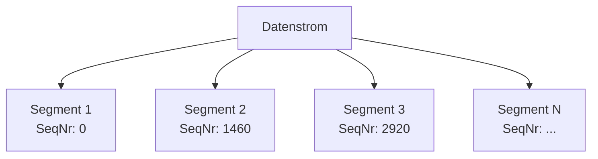
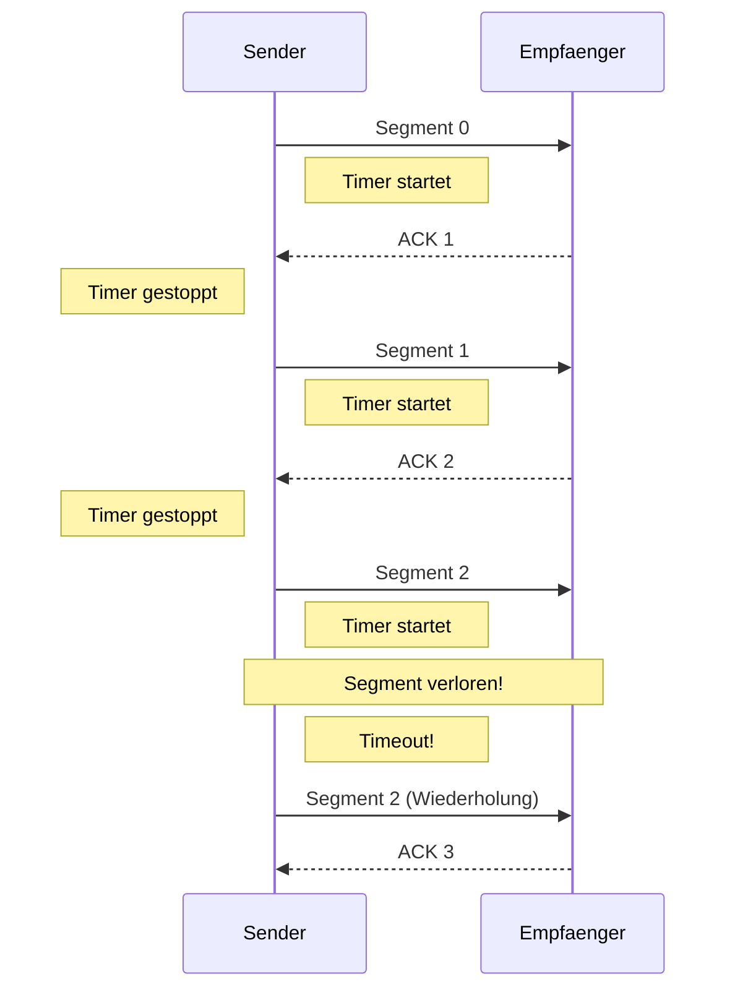
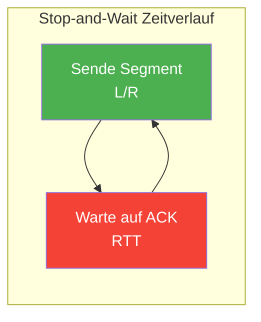
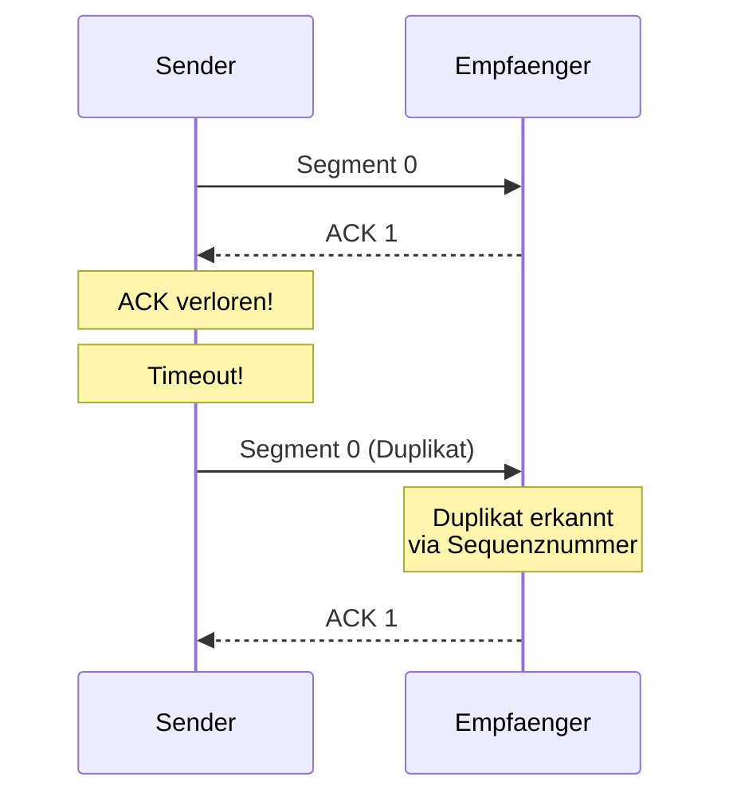

# 10 — Send and Wait / Transportschicht

**Folien:** [[kommunikationssysteme/resources/Kommunikationssysteme_10_SendWait.pdf|Kommunikationssysteme_10_SendWait.pdf]]

## Inhaltsverzeichnis

- [[#Vermittlungsschicht vs. Transportschicht|Vermittlungsschicht vs. Transportschicht]]
- [[#Zuverlaessige Kommunikation|Zuverlaessige Kommunikation]]
- [[#TCP vs. UDP|TCP vs. UDP]]
- [[#Herausforderungen zuverlaessiger Transport|Herausforderungen zuverlaessiger Transport]]
- [[#Erforderliche Mechanismen|Erforderliche Mechanismen]]
- [[#Stop-and-Wait (ARQ)|Stop-and-Wait (ARQ)]]
- [[#Nutzungsgrad von Stop-and-Wait|Nutzungsgrad von Stop-and-Wait]]
- [[#Verfahren bei Fehlern|Verfahren bei Fehlern]]
- [[#Fragen zur Selbstkontrolle|Fragen zur Selbstkontrolle]]

---

## Vermittlungsschicht vs. Transportschicht

| Eigenschaft | Vermittlungsschicht | Transportschicht |
|---|---|---|
| Kommunikation zwischen | Rechnern | **Prozessen** |
| Adressierung | IP-Adressen | **Ports** (Anwendungen) |
| Laeuft auf | Rechnern und Routern | **Nur Endsystemen** |
| Beispiel | IP | TCP, UDP |

- **Vermittlungsschicht:** logische Kommunikation zwischen Rechnern (Netz aus Netzen)
- **Transportschicht:** logische Kommunikation zwischen **Prozessen**
  - Adressierung der Anwendungen ueber Ports
  - Segmentierung der Datenstroeme
  - Benutzt und **erweitert** Dienste der Vermittlungsschicht
  - Reine **Endsystemschicht** — nicht auf Routern implementiert

> [!tip] Merke
> Zuverlaessige Kommunikation ist nur auf **Transport- oder Anwendungsebene** moeglich, da die darunterliegenden Schichten auf Store-and-Forward und kooperierenden autonomen Systemen basieren.

---

## Zuverlaessige Kommunikation

Zuverlaessigkeit kann nur in den **oberen Schichten** (Transport / Anwendung) garantiert werden, weil:
- Pakete durch **verschiedene autonome Systeme** (AS) geroutet werden
- Jeder Router nur **Store-and-Forward** betreibt
- Dazwischenliegende Schichten keine Ende-zu-Ende-Garantie bieten

---

## TCP vs. UDP

| Eigenschaft | TCP | UDP |
|---|---|---|
| Zuverlaessigkeit | Zuverlaessig | **Unzuverlaessig** |
| Verbindung | Verbindungsorientiert | Verbindungslos |
| Flusskontrolle | Ja | Nein |
| Staukontrolle | Ja | Nein |
| Modell | Zwei Streams (Open/Close) | **Postkartenmodell** |

> [!quote] Definition
> **TCP** bietet eine **virtuelle Verbindungsorientierung**: zwei Streams werden durch Open/Close verwaltet.
>
> **UDP** folgt dem **Postkartenmodell**: ein einziger Empfangspunkt (Port) fuer alle Nachrichten — ohne Verbindungsaufbau.

---

## Herausforderungen zuverlaessiger Transport

Beim Transport ueber unzuverlaessige Netze koennen folgende Probleme auftreten:

1. **Pakete gehen verloren** (Router-Ueberlastung, Bitfehler)
2. **Reihenfolge aendert sich** (unterschiedliche Routen)
3. **Pakete sind fehlerhaft** (Bitfehler waehrend Uebertragung)

> [!warning] Achtung
> Alle drei Probleme muessen durch das Transportprotokoll behandelt werden — die Vermittlungsschicht liefert keine Garantien.

---

## Erforderliche Mechanismen

Ein zuverlaessiges Transportprotokoll benoetigt:

| Mechanismus | Beschreibung |
|---|---|
| **Segmentierung** | Datenstrom in Segmente aufteilen |
| **Sequenznummern** | Position im Byte-Stream identifizieren |
| **Quittierungen** | ACK (positiv), optional NAK (negativ) |
| **Neuuebertragung** | Timer-gesteuert oder bei NAK |

---

## Stop-and-Wait (ARQ)

> [!quote] Definition
> **ARQ (Automatic Repeat-reQuest):** Sende ein Segment, warte auf ACK. Bei Empfang des ACK: naechstes Segment senden. Bei Timeout: Segment wiederholen.

Stop-and-Wait ist das **einfachste ARQ-Protokoll**.

**Ablauf:**
1. Sender sendet **ein** Segment
2. Sender startet **Timer**
3. Warte auf ACK:
   - **ACK empfangen** → naechstes Segment senden
   - **Timeout** → gleiches Segment erneut senden

---

## Nutzungsgrad von Stop-and-Wait

> [!tip] Merke
> Der Nutzungsgrad von Stop-and-Wait ist durch die Beschraenkung auf **ein Paket pro Round-Trip** stark limitiert:
>
> $$\rho = \frac{L/R}{L/R + RTT}$$
>
> wobei $L$ = Segmentlaenge, $R$ = Uebertragungsrate, $RTT$ = Round-Trip-Time.

> [!example] Beispiel: Nutzungsgrad-Berechnungen
> **FastEthernet LAN:**
> - $R = 100\ \text{Mbit/s}$, $L = 1460\ \text{Byte}$, $RTT = 3\ \text{ms}$
> - $L/R = \frac{1460 \cdot 8}{100 \cdot 10^6} = 0{,}1168\ \text{ms}$
> - $\rho = \frac{0{,}1168}{0{,}1168 + 3} = 3{,}74\%$
>
> **Verbindung nach Kalifornien:**
> - $R = 100\ \text{Mbit/s}$, $L = 1460\ \text{Byte}$, $RTT = 200\ \text{ms}$
> - $\rho = \frac{0{,}1168}{0{,}1168 + 200} = 0{,}058\%$

> [!warning] Achtung
> Bei langen Distanzen (hohe RTT) wird der Nutzungsgrad verschwindend klein. Die Leitung ist fast die gesamte Zeit **ungenutzt**.

---

## Verfahren bei Fehlern

### Problem: Duplikate

Bei **vorzeitigem Timeout** oder **verlorenem ACK** sendet der Sender das Segment erneut — der Empfaenger erhaelt es doppelt.

### Loesung: Sequenznummern

- **Eindeutige Identifikation** fuer Segmente und Bestaetigungen
- Zwei Varianten:
  - **Byte-Offset** im Stream (TCP-Ansatz)
  - **Durchnummerierung** der Segmente
- **Zyklische Nummerierung:** begrenzter Zahlenraum wird wiederverwendet (0, 1, 2, ..., MAX, 0, 1, ...)
- ACK verweist immer auf das **naechste erwartete Byte/Segment**

> [!tip] Merke
> Sequenznummern sind essentiell, um Duplikate zu erkennen und die korrekte Reihenfolge der Daten sicherzustellen. Ohne sie kann der Empfaenger nicht zwischen neuen und wiederholten Segmenten unterscheiden.

---

## Fragen zur Selbstkontrolle

**Selbstkontrolle:** [[kommunikationssysteme/selbstkontrolle/komsys-selbstkontrolle-05|Selbstkontrolle Vorlesung 5]]

**Welche zwei wichtigen Transportprotokolle gibt es, und wie unterscheiden sie sich?**

TCP ist verbindungsorientiert und zuverlaessig. UDP ist verbindungslos und leichtgewichtig. TCP bietet Sequenznummern, ACKs, Flusskontrolle und Staukontrolle; UDP liefert nur Datagramme an einen Zielport.

**Was bedeutet virtuelle Verbindungsorientierung?**

Es gibt keine reservierte physische Leitung. Trotzdem erzeugt das Protokoll fuer die Anwendung den Eindruck einer logischen Verbindung mit geordnetem, zusammenhaengendem Datenstrom.

**Was ist Segmentierung eines Streams?**

Ein grosser Bytestrom wird in kleinere Segmente zerlegt, damit diese uebertragen, nummeriert, quittiert und bei Bedarf neu gesendet werden koennen.

**Wie funktioniert ARQ, und warum braucht man Timeouts?**

ARQ basiert auf Senden, Warten auf ACK und Neuuebertragen bei Verlust. Timeouts sind noetig, weil fehlende ACKs sonst nicht von stillen Verlusten unterschieden werden koennen.

**Warum werden Sequenznummern benoetigt?**

Sie machen Segmente eindeutig, helfen bei der Wiederherstellung der Reihenfolge und erlauben das Erkennen von Verlusten und Duplikaten.

**Wie ist der Nutzungsgrad definiert, und warum ist hohe RTT problematisch?**

Der Nutzungsgrad ist der Anteil der Zeit, in der wirklich Nutzdaten auf der Leitung sind. Bei Stop-and-Wait wird bei hoher RTT fast nur gewartet, also sinkt der Durchsatz drastisch.

**Wie versucht man das Problem zu umgehen, und welches neue Problem entsteht?**

Man fuehrt Pipelining ein und laesst mehrere Segmente gleichzeitig unterwegs sein. Dadurch steigt die Auslastung, aber die Fehlerbehandlung wird komplexer: Puffer, out-of-order-Empfang und Retransmissions muessen sauber beherrscht werden.
