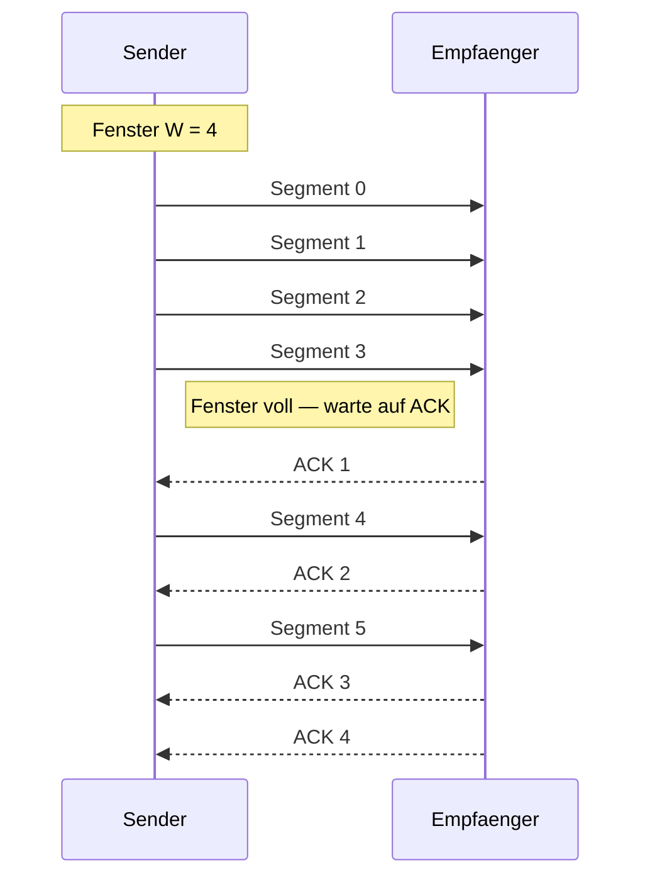
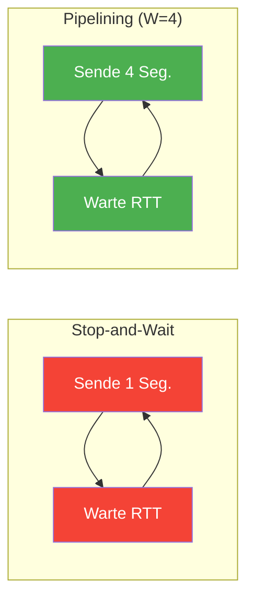
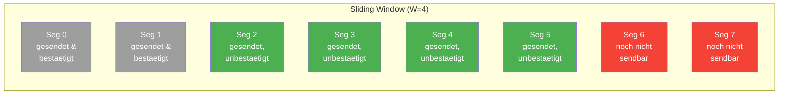
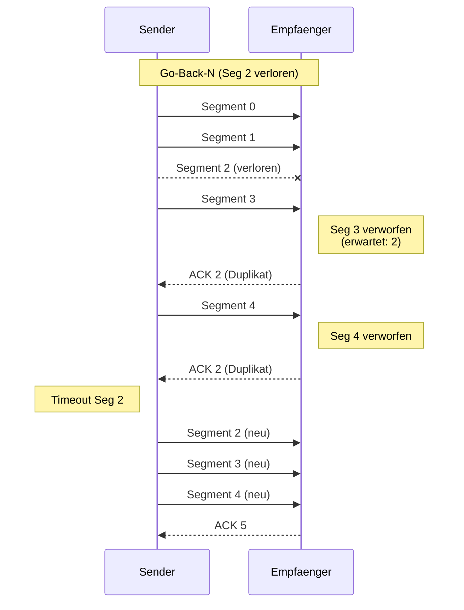
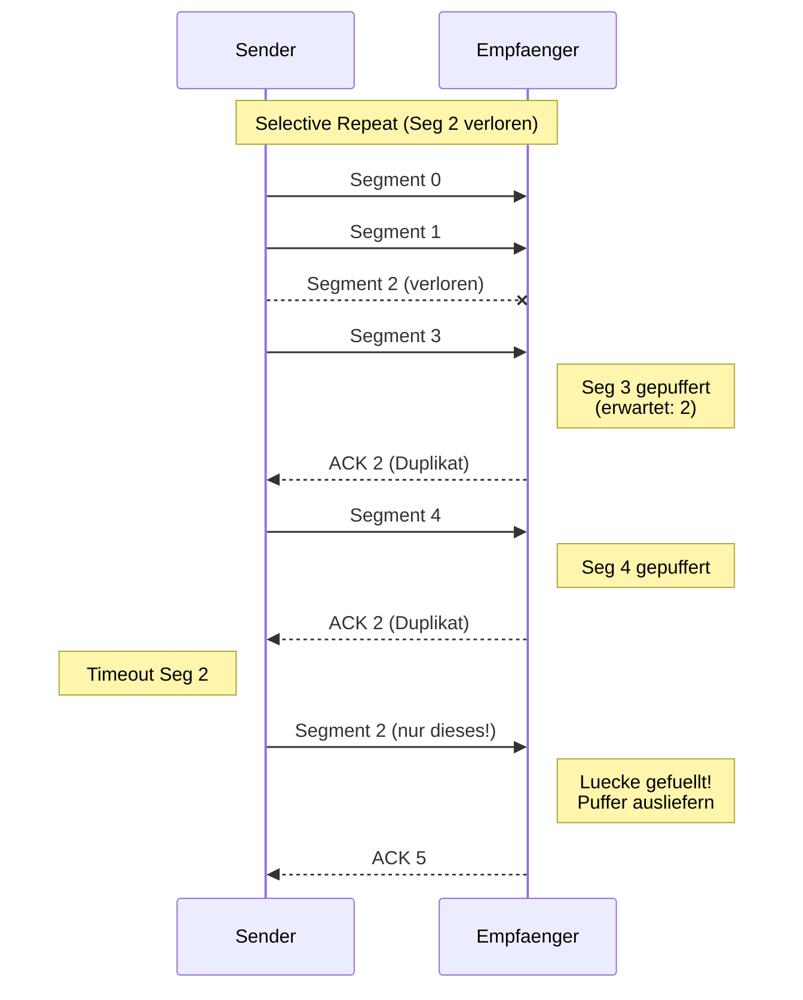
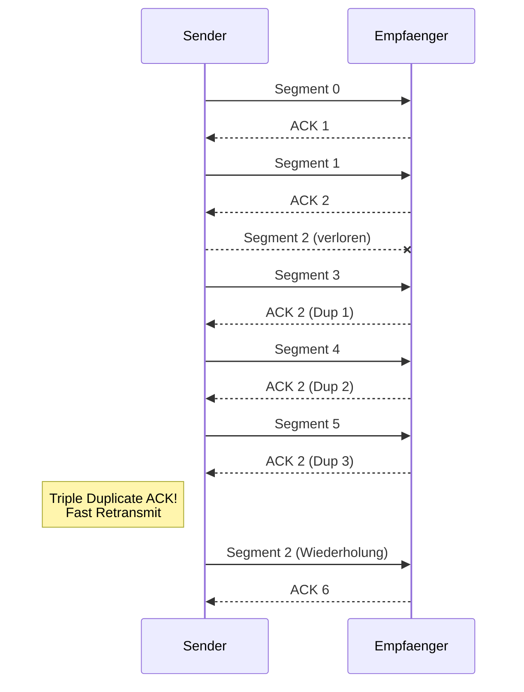

# 11 — Sliding Window Protokolle

**Folien:** [[kommunikationssysteme/resources/Kommunikationssysteme_11_SlidingWindow.pdf|Kommunikationssysteme_11_SlidingWindow.pdf]]

## Inhaltsverzeichnis

- [[#Idee: Pipelining|Idee: Pipelining]]
- [[#Verbesserter Nutzungsgrad|Verbesserter Nutzungsgrad]]
- [[#Sliding Window — Prinzip|Sliding Window — Prinzip]]
- [[#Fenstergroesse und Zyklische Nummerierung|Fenstergroesse und Zyklische Nummerierung]]
- [[#Bandwidth-Delay-Produkt|Bandwidth-Delay-Produkt]]
- [[#Flusskontrolle und Fehlerbehandlung|Flusskontrolle und Fehlerbehandlung]]
- [[#Fehlerbehandlungsstrategien|Fehlerbehandlungsstrategien]]
- [[#Kumulative Bestaetigungen|Kumulative Bestaetigungen]]
- [[#Zahlenraum und Fenstergroesse|Zahlenraum und Fenstergroesse]]
- [[#Fragen zur Selbstkontrolle|Fragen zur Selbstkontrolle]]

---

## Idee: Pipelining

Das Grundproblem von [[kommunikationssysteme/lectures/05/komsys-10-send-wait|Stop-and-Wait]] ist die Beschraenkung auf **ein Segment pro Round-Trip**. Die Loesung: **mehrere Segmente gleichzeitig senden** (Pipelining).

- Segmente werden auf **Sender- und Empfaengerseite gepuffert**
- Die Anzahl der gleichzeitig gesendeten, unquittierten Segmente wird durch das **Sliding Window** begrenzt

---

## Verbesserter Nutzungsgrad

> [!tip] Merke
> Mit Pipelining von $N$ Segmenten verbessert sich der Nutzungsgrad zu:
>
> $$\rho = \frac{N \cdot L/R}{L/R + RTT}$$
>
> Durch genuegend grosse Fensterwahl kann die Leitung **voll ausgelastet** werden.

---

## Sliding Window — Prinzip

> [!quote] Definition
> Das **Sliding Window** ist ein logisches Fenster der Groesse $W$ (in Segmenten oder Bytes), das ueber den Datenstrom gelegt wird. Es bestimmt, welche Daten **ohne ACK gesendet** werden duerfen.

**Funktionsweise:**
1. Das Fenster umfasst $W$ Segmente ab der letzten bestaetigten Position
2. Alle Segmente im Fenster duerfen gesendet werden
3. Bei Empfang eines ACK **verschiebt sich das Fenster nach rechts**
4. Am Fensterrand muss auf ACK gewartet werden (**Rueckkopplung**)

- **Grau:** bereits bestaetigt (hinter dem Fenster)
- **Gruen:** im Fenster (gesendet, warte auf ACK)
- **Rot:** noch nicht sendbar (vor dem Fenster)

> [!info] Hinweis
> Sender und Empfaenger nutzen ein **Uebertragungsfenster**, das typischerweise dem freien Pufferspeicher im Betriebssystem entspricht.

---

## Fenstergroesse und Zyklische Nummerierung

- **Zyklische Nummerierung:** Sequenznummern laufen von $0, 1, \ldots, \text{MODULUS} - 1$ und beginnen dann wieder bei $0$
- In der Realitaet: **Byte-Offset** im Stream, Fenstergroesse in **Bytes**
- Fenstergrenzen: $\text{MIN}$ und $\text{MAX}$ mit $\text{MAX} - \text{MIN} = W$
- ACK bezieht sich auf das **naechste erwartete Segment/Byte** (Offset)

> [!warning] Achtung
> Die Fenstergroesse $W$ muss **kleiner als MODULUS** sein — sonst kann der Empfaenger nicht zwischen Retransmissions und neuen Daten unterscheiden (siehe [[#Zahlenraum und Fenstergroesse]]).

---

## Bandwidth-Delay-Produkt

> [!quote] Definition
> Das **Bandwidth-Delay-Produkt** bestimmt die minimale Fenstergroesse fuer volle Auslastung:
>
> $$w \geq \text{Bandwidth} \times \text{Delay (RTT)}$$
>
> Der erreichbare Durchsatz ist begrenzt durch: $\text{Durchsatz} \leq \frac{w}{RTT}$

> [!example] Beispiel: Fenstergroesse berechnen
> **Beispiel 1 — Lokales Netz:**
> - $R = 10\ \text{Mbit/s}$, $RTT = 8\ \text{ms}$, Segmente $= 500\ \text{Byte}$
> - $w \geq 10 \cdot 10^6 \cdot 8 \cdot 10^{-3} = 10.000\ \text{Byte} = 20\ \text{Segmente}$
>
> **Beispiel 2 — Long-Fat-Pipe:**
> - $R = 1\ \text{Gbit/s}$, $RTT = 240\ \text{ms}$, Segmente $= 1000\ \text{Byte}$
> - $w \geq 1 \cdot 10^9 \cdot 240 \cdot 10^{-3} = 30.000.000\ \text{Byte} = 30.000\ \text{Segmente}$

> [!tip] Merke
> Das Bandwidth-Delay-Produkt grenzt die erzielbare Rate ein — **unabhaengig** von der verfuegbaren Bandbreite. Bei hoher Bandbreite und hoher Latenz (**Long-Fat-Pipes**) werden extrem grosse Fenster benoetigt.

---

## Flusskontrolle und Fehlerbehandlung

**Flusskontrolle** reguliert die Senderate basierend auf Feedback vom Empfaenger.

### Fehlerereignisse beim Empfaenger

| Ereignis | Reaktion Empfaenger | Reaktion Sender |
|---|---|---|
| **Out-of-order Segment** | ACK mit bisher empfangener Position senden, optional zwischenspeichern | Abhaengig von Strategie |
| **Fehlerhaftes Segment** | Keine Reaktion (oder NAK senden) | Timeout → Neuuebertragung |
| **Duplikat** | Verwerfen, ACK erneut senden | — |

---

## Fehlerbehandlungsstrategien

Es gibt drei grundlegende Strategien fuer die Fehlerbehandlung bei Sliding-Window-Protokollen:

### Go-Back-N

- Empfaenger **ignoriert** alle Segmente, die nicht in der erwarteten Reihenfolge eintreffen
- Bei Fehler: **alles ab dem fehlenden Segment wird neu uebertragen**
- Einfach zu implementieren, aber **ineffizient** bei vielen Fehlern

### Selective Repeat

- Empfaenger **puffert** out-of-order Segmente
- Nur die **tatsaechlich fehlenden Segmente** werden wiederholt
- Effizienter, aber komplexerer Empfaenger (Pufferverwaltung)

### Selective Reject

- **Sofortige Reaktion** auf unerwartete Ereignisse mittels NACK
- Sender wiederholt gezielt das abgelehnte Segment

> [!tip] Merke
> **Go-Back-N** ist einfacher, verschwendet aber Bandbreite bei Fehlern. **Selective Repeat** ist effizienter, benoetigt aber Puffer beim Empfaenger. TCP nutzt eine Kombination beider Ansaetze.

---

## Kumulative Bestaetigungen

> [!quote] Definition
> **Kumulative Bestaetigung:** Ein ACK zeigt an, dass **alle Daten bis Position X** korrekt empfangen wurden. Es wird nicht jedes Segment einzeln bestaetigt.

- Bei Out-of-order-Empfang: Empfaenger sendet **Duplicate ACK** (wiederholt die letzte korrekte Position)
- Duplicate ACKs sind ein **Indiz fuer Paketverlust**

> [!tip] Merke
> **Triple Duplicate ACK** (drei identische ACKs hintereinander) wird als **implizites NACK** aufgefasst! Der Sender wiederholt das fehlende Segment sofort, ohne auf den Timeout zu warten (Fast Retransmit).

---

## Zahlenraum und Fenstergroesse

> [!warning] Achtung
> Die Fenstergroesse $W$ muss **strikt kleiner als MODULUS** sein. Andernfalls koennen Sender und Empfaenger bestimmte Szenarien nicht unterscheiden.

> [!example] Beispiel: Problem bei W = MODULUS
> Bei $W = 3$ und $\text{MODULUS} = 4$ (Sequenznummern 0, 1, 2, 3):
>
> **Szenario A:** Alle ACKs gehen verloren → Sender wiederholt Segmente 0, 1, 2
>
> **Szenario B:** Alle Segmente korrekt empfangen → Sender sendet **neue** Segmente 0, 1, 2 (gleiche Nummern!)
>
> Der Empfaenger kann **nicht unterscheiden**, ob es sich um Retransmissions oder neue Daten handelt.

Korrekte Bedingung:
- **Go-Back-N:** $W \leq \text{MODULUS} - 1$
- **Selective Repeat:** $W \leq \text{MODULUS} / 2$

---

## Fragen zur Selbstkontrolle

**Selbstkontrolle:** [[kommunikationssysteme/selbstkontrolle/komsys-selbstkontrolle-05|Selbstkontrolle Vorlesung 5]]

**Wie loest das Go-Back-N-Verfahren Uebertragungsfehler?**

Go-Back-N arbeitet mit kumulativen ACKs. Sobald ein Segment fehlt oder fehlerhaft ist, kann der Empfaenger nur noch bis vor diese Luecke bestaetigen. Alle spaeter angekommenen Segmente werden verworfen. Laeuft beim Sender der Timer fuer das erste unbestaetigte Segment ab, sendet er dieses Segment und alle darauf folgenden Segmente erneut.

Das Verfahren ist einfach, aber bei einzelnen Verlusten ineffizient, weil auch korrekt uebertragene Segmente hinter der Luecke noch einmal ueber das Netz gehen.

Die [[kommunikationssysteme/selbstkontrolle/komsys-selbstkontrolle-05|Selbstkontrolle Vorlesung 5]] behandelt Themen zur Leitungskodierung und WLAN (Bituebertragungsschicht) und enthaelt keine Fragen zum Inhalt dieser Vorlesung (Sliding Window / Pipelining).
