# 12 — TCP: Ein Sliding-Window-Protokoll

**Folien:** [[kommunikationssysteme/resources/Kommunikationssysteme_12_TCP.pdf|Kommunikationssysteme_12_TCP.pdf]]
**Selbstkontrolle:** [[kommunikationssysteme/selbstkontrolle/komsys-selbstkontrolle-12|Selbstkontrolle 12]]

## Inhaltsverzeichnis

- [[#Flusskontrolle in TCP|Flusskontrolle in TCP]]
- [[#Empfaenger-Seite: Buffer und Window|Empfaenger-Seite: Buffer und Window]]
- [[#Eine hybride Loesung: Go-Back-N und Selective Repeat|Eine hybride Loesung: Go-Back-N und Selective Repeat]]
- [[#ACK-Strategien: Huckepack und Delayed ACKs|ACK-Strategien: Huckepack und Delayed ACKs]]
- [[#Round Trip Time und Timeout|Round Trip Time und Timeout]]
- [[#Staukontrolle (Congestion Control)|Staukontrolle (Congestion Control)]]
- [[#Slow Start und Congestion Avoidance|Slow Start und Congestion Avoidance]]
- [[#Fast Retransmit und Fast Recovery|Fast Retransmit und Fast Recovery]]
- [[#TCP-Verbindungsmanagement|TCP-Verbindungsmanagement]]
- [[#Format eines TCP-Segments|Format eines TCP-Segments]]
- [[#Push-Flag, Nagle und Urgent-Pointer|Push-Flag, Nagle und Urgent-Pointer]]
- [[#Window-Scale: Bandwidth-Delay-Produkt|Window-Scale: Bandwidth-Delay-Produkt]]
- [[#Fragen zur Selbstkontrolle|Fragen zur Selbstkontrolle]]

---

## Flusskontrolle in TCP

TCP implementiert das **Sliding-Window-Protokoll** auf Byte-Ebene.

> [!tip] Merke
> Bei einer Fenstergroesse von $n$ koennen **$n$ Bytes** verschickt werden, ohne dass ein ACK empfangen werden muss. Sobald der Empfaenger bestaetigt, verschiebt sich das Fenster — neue Daten koennen gesendet werden.

### Nummerierung (zyklisch, 32 Bit)

- Segmente werden durch ihren **Byte-Offset im Stream** identifiziert.
- Die Startposition wird beim Verbindungsaufbau **zufaellig** festgelegt.
- TCP verwendet **kumulative ACKs**: `ACK n+1` bestaetigt alle Bytes bis Position $n$ und kuendigt $n+1$ als naechstes erwartetes Segment an.

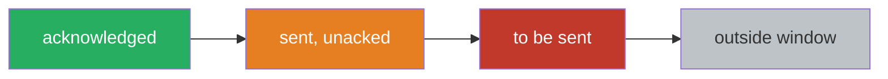

### Sliding Window in TCP-Begriffen

| Sender | Empfaenger |
|---|---|
| `LastByteAcked ≤ LastByteSent ≤ LastByteWritten` | `LastByteRead < NextByteExpected ≤ LastByteRcvd+1` |
| Sendepuffer: zwischen `LastByteAcked` und `LastByteWritten` | Empfangspuffer: zwischen `LastByteRead` und `LastByteRcvd` |

**Senderbedingung**: `LastByteSent - LastByteAcked < AdvertisedWindow`

$$\text{EffectiveWindow} = \text{AdvertisedWindow} - (\text{LastByteSent} - \text{LastByteAcked})$$

**Empfaengerberechnung** (advertised in jedem ACK):
$$\text{AdvertisedWindow} = \text{Empfangspuffer} - ((\text{NextByteExpected} - 1) - \text{LastByteRead})$$

### Variable Fenstergroesse

> [!quote] Definition
> TCP verwendet eine **variable Fenstergroesse**. Jede Bestaetigung enthaelt das **Window**-Feld, das den aktuell freien Platz im Empfangspuffer angibt (**Advertised Window / Receiver Window**). Das Sliding Window des Senders wird durch die noch freie Pufferkapazitaet beim Empfaenger beeinflusst.

---

## Empfaenger-Seite: Buffer und Window

Der Empfaenger puffert auch **out-of-order** Segmente. So bleibt **Selective Repeat** prinzipiell moeglich.

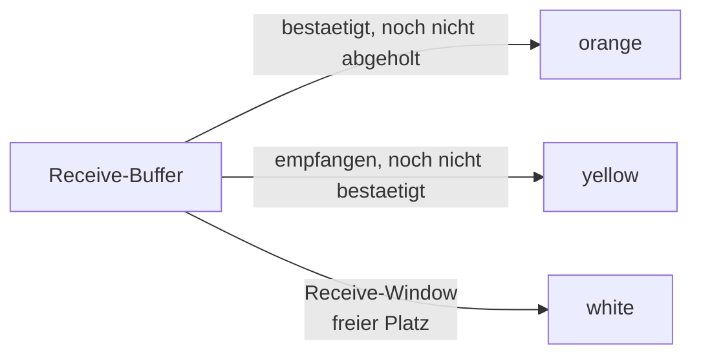

> [!info] Hinweis
> Wie soll der Empfaenger entscheiden, was er tut? Siehe Tabelle bei den Delayed Acks weiter unten.

---

## Eine hybride Loesung: Go-Back-N und Selective Repeat

TCP verwaltet einen einzigen Timer fuer das naechste zu bestaetigende Segment. Bei Timeout sieht es **augenscheinlich** wie Go-Back-N aus, **tatsaechlich** ist es Selective Repeat:

> [!tip] Merke
> - **Go-Back-N**: Timer fuer naechstes zu bestaetigendes Segment, bei Timeout wird neu uebertragen
> - **Selective Repeat**: Empfaenger speichert Out-of-Order-Segmente, sodass kumulative ACKs zwischengepufferte Daten nutzen koennen (Luecken koennen geschlossen werden)
> - TCP **emuliert** NAKs durch **Triple-Duplicate-ACKs** → Neuuebertragung schon **vor** dem Timeout (siehe Fast Retransmit)

---

## ACK-Strategien: Huckepack und Delayed ACKs

TCP unterstuetzt **bidirektionale** Kommunikation. Daraus folgen zwei Optimierungen:

### Huckepack-Technik (Piggybacking)

Bestaetigungen koennen auf dem Datenpaket der **Gegenrichtung** "reiten". Eine ACK-Nachricht kann viele Segmente bestaetigen (kumulativ).

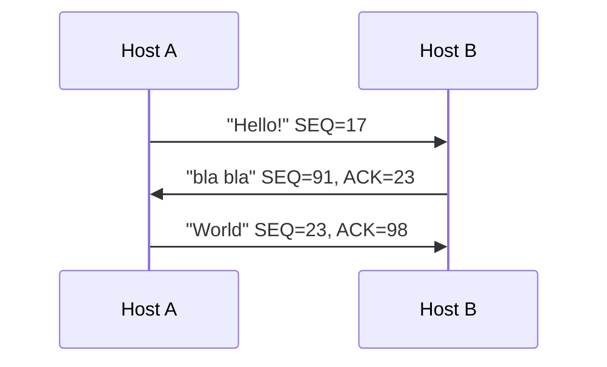

### Delayed Acknowledgments

> [!quote] Definition
> Liegen keine Daten in Gegenrichtung an, werden Acks verzoegert — irgendwann aber doch verschickt. Ziel: Abwarten, bis mit einer Bestaetigung auch Daten versendet werden koennen. Bestaetigungen werden **spaetestens fuer jedes zweite Segment** versendet.

### Reaktion des Empfaengers

| Ereignis beim Empfaenger | Aktion |
|---|---|
| Erwartetes Segment, alle Daten davor bereits bestaetigt | **Delayed ACK** — bis zu **500 ms** auf das naechste Segment warten |
| Erwartetes Segment, vorheriges noch nicht bestaetigt | **Sofortige kumulative Bestaetigung** beider Segmente |
| Segment **hinter** der erwarteten Sequenznummer (Luecke) | Sofortiges **Duplicate ACK** mit erwarteter Segmentnummer |
| Segment, das eine Luecke teilweise oder vollstaendig fuellt | Sofortige Bestaetigung |

---

## Round Trip Time und Timeout

### Wann sollte es ein Timeout geben?

- RTT = Mindestzeit, bis eine Bestaetigung ankommen kann
- Timeout sollte **nicht vorher** auftreten

> [!warning] Achtung
> Problem: RTT variiert
> - **Zu kurz**: vorzeitige Timeouts, unnoetige Neuuebertragungen
> - **Zu gross**: sehr langsame Reaktion auf Paketverluste

### Wie wird die RTT geschaetzt?

- TCP stoppt die Zeit zwischen Versand eines Segments und Empfang des ACKs
- **Neuuebertragungen** gehen nicht ein
- **Delayed ACKs** muessen ausgeblendet werden
- **SampleRTT** wird **geglaettet** (z.B. exponential weighted moving average)

> [!info] Hinweis
> Die Glaettung liefert eine Mittelung ueber die Vergangenheit, nicht nur den aktuellen Messwert.

---

## Staukontrolle (Congestion Control)

### Motivation

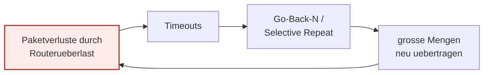

> [!warning] Achtung — Congestion Collapse
> Werden viele Pakete bei Ueberlast neu uebertragen, verstaerken sich Ueberlast und Verluste gegenseitig. Reaktion: **Drosselung der Senderate**.

### Flusskontrolle vs. Staukontrolle

| Aspekt | Flusskontrolle | Staukontrolle |
|---|---|---|
| Wo? | Endpunkte (Sender ↔ Empfaenger) | Zwischensysteme (Router) |
| Basis | Sliding Window, Receiver Window | Congestion Window |
| Trigger | freier Empfangspuffer | Timeouts, DupACKs |
| Ziel | Empfaenger nicht ueberlasten | Netz nicht ueberlasten + Fairness |

### Congestion Window (cwnd)

> [!quote] Definition
> Zusaetzliche Beschraenkung des verfuegbaren Fensters auf **Senderseite** durch ein **Congestion Window (cwin)**. Faktisch wird cwnd zumeist nicht in Bytes, sondern in Vielfachen der **Maximum Segment Size (MSS)** gefuehrt.

Ziel: Anzahl ausstehender Segmente so variieren, dass Ueberlast vermieden wird und **Fairness** entsteht.

> [!tip] Merke
> Staukontrolle schafft **Fairness**: Wird eine Leitung von $N$ TCP-Verbindungen genutzt, erhaelt jede etwa $1/N$ der Bandbreite.

---

## Slow Start und Congestion Avoidance

TCP hat **zwei Phasen** zur Aenderung des Congestion Windows.

### Slow Start (Multiplicative Increase)

- Initiale Groesse: **1 MSS**
- Bei jeder erfolgreichen Bestaetigung wird cwnd um 1 MSS erhoeht
- Erfolgreiche Uebertragung eines vollen Fensters von $n$ Segmenten liefert $2n$ → **Verdopplung pro RTT (exponentielles Wachstum)**
- Maximal bis zur Groesse des Receiver Windows

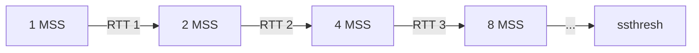

### Congestion Avoidance (Additive Increase)

Ab cwnd = `ssthresh = min(Receiver Window, Congestion Window * MSS)`:
- Vorsichtige Annaeherung an Netzkapazitaet
- cwnd waechst etwa **1 MSS pro RTT** (linear)

### Verlauf von cwnd

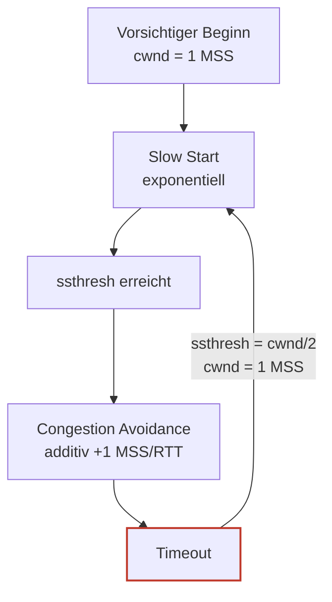

> [!example] Beispiel — Slow-Start-Phase
> Round 0: 1 Segment gesendet
> Round 1: 2 Segmente
> Round 2: 4 Segmente
> Round 3: 8 Segmente …

---

## Fast Retransmit und Fast Recovery

> [!tip] Merke
> Werden **drei Duplicate ACKs** empfangen, kann die Leitung noch etwas uebertragen → wahrscheinlich fehlt nur das eine Segment. Dieses wird **sofort** neu uebertragen (vor Timeout), und cwnd wird nur **halbiert** (Multiplicative Decrease) statt auf 1 zurueckgesetzt.

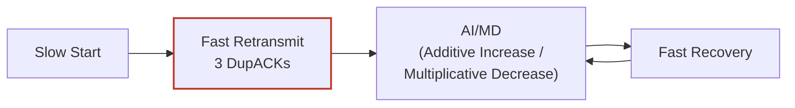

### TCP-Varianten

> [!info] Hinweis
> Congestion Control in TCP ist deutlich komplexer als hier dargestellt. Viele Varianten existieren:

```text
grep TCP_CONG /boot/config-$(uname -r)
CONFIG_TCP_CONG_ADVANCED=y
CONFIG_TCP_CONG_BIC=m
CONFIG_TCP_CONG_CUBIC=y    ← Default
CONFIG_TCP_CONG_WESTWOOD=m
CONFIG_TCP_CONG_HTCP=m
CONFIG_TCP_CONG_HSTCP=m
CONFIG_TCP_CONG_HYBLA=m
CONFIG_TCP_CONG_VEGAS=m
CONFIG_TCP_CONG_SCALABLE=m
CONFIG_TCP_CONG_LP=m
CONFIG_TCP_CONG_VENO=m
CONFIG_TCP_CONG_YEAH=m
CONFIG_TCP_CONG_ILLINOIS=m
CONFIG_DEFAULT_TCP_CONG="cubic"
```

### Self-Clocking

Die Senderate wird durch das **Eintreffen der ACKs** getaktet — TCP injiziert neue Daten erst, wenn ein ACK kommt. Die Sequence-Number-Kurve schmiegt sich automatisch an die Engstelle der Strecke an.

---

## TCP-Verbindungsmanagement

### 1. Verbindungsaufbau — Three-Way-Handshake

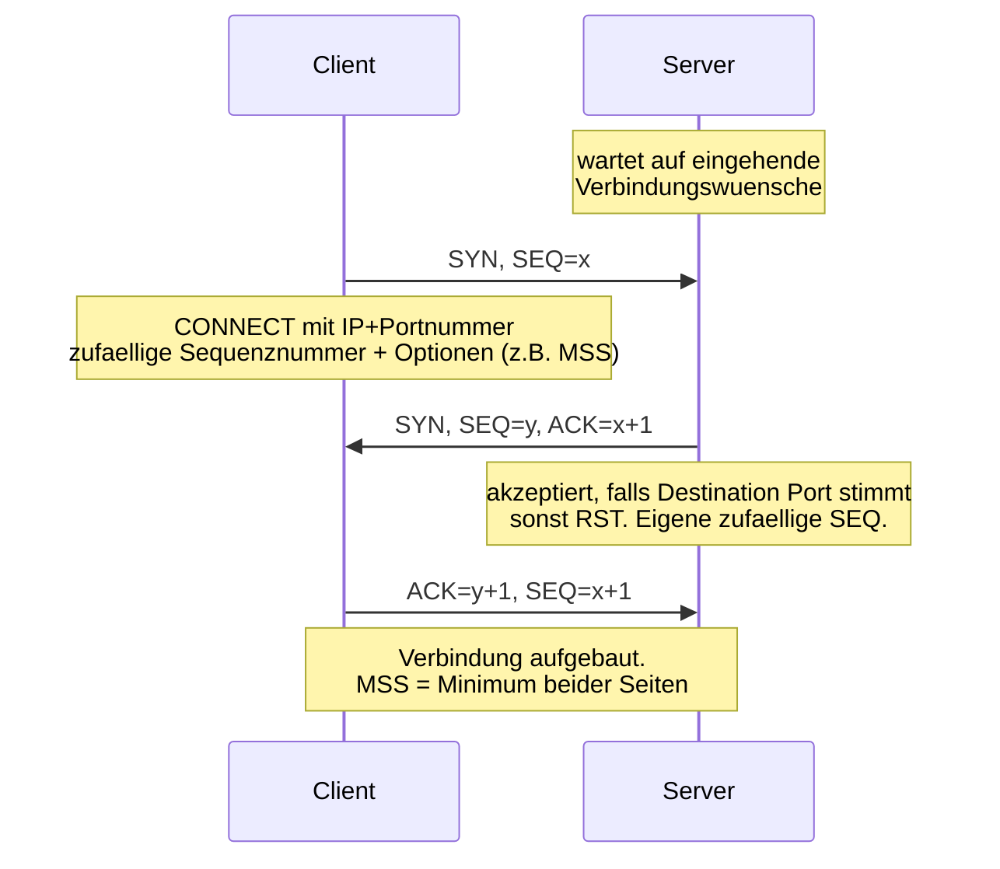

### 2. Datenuebertragung

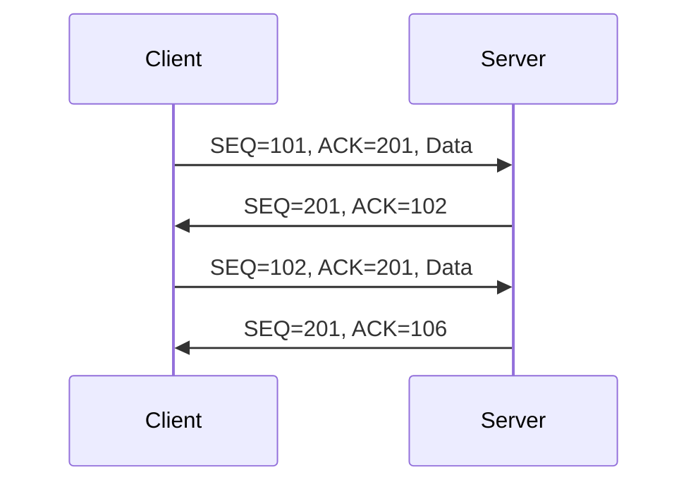

> [!info] Hinweis — Datenuebertragung
> - **Vollduplex**-Betrieb
> - Aufteilung des Bytestroms in Segmente maximaler MSS (typisch 1460 oder 536 Byte) → **IP-Fragmentierung wird vermieden**
> - **Kumulative ACKs**
> - **Go-Back-N** bei Timeout (de facto Selective Repeat via Empfaengerpufferung)

### 3. Verbindungsende — 4-Way-Handshake

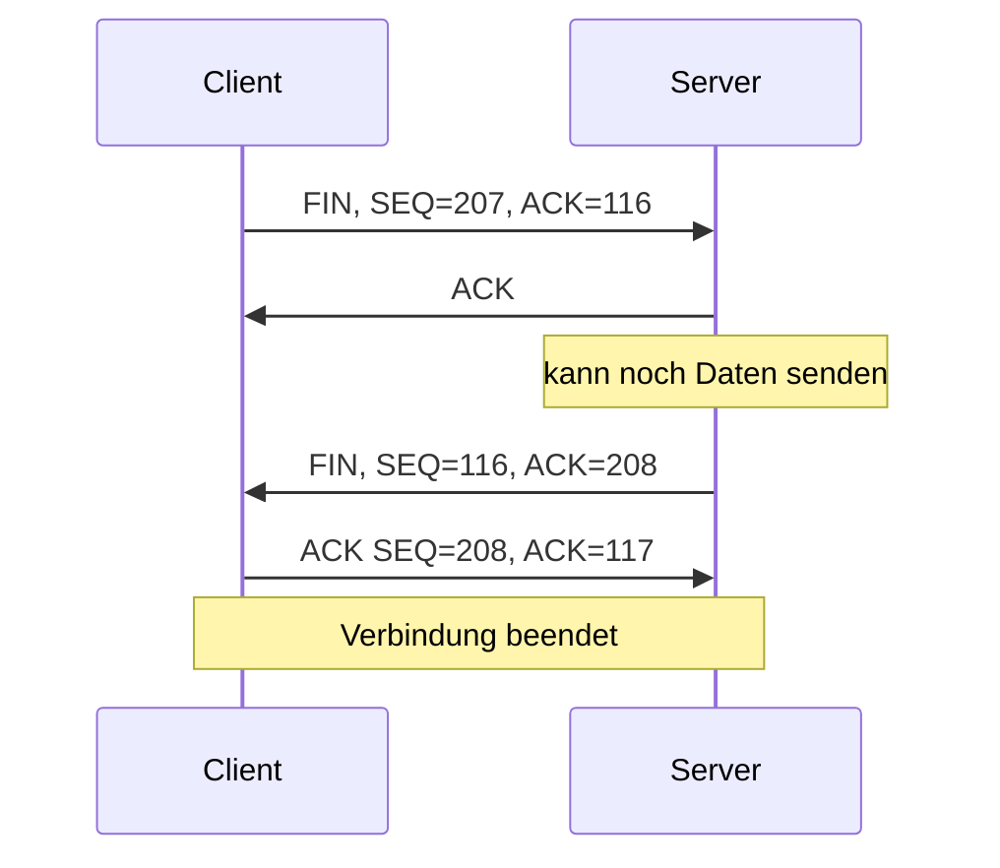

> [!warning] Achtung — Warum 4-Way?
> Beim **Aufbau** koennen SYN und ACK in **einem** Paket kombiniert werden (3-Way) — beide Seiten wollen gleichzeitig aufbauen.
> 
> Beim **Abbau** ist das **nicht** immer moeglich: Die Seite, die das erste FIN sendet, signalisiert nur "ich sende keine Daten mehr" — kann aber weiter empfangen. Die andere Seite kann noch Daten senden und erst spaeter ihr eigenes FIN schicken.
> 
> Spaetestens nach einer Karenzzeit (**Maximum Segment Lifetime**) wird allerdings ein Reset gemacht.

---

## Format eines TCP-Segments

```text
 0                                                              31
+--------------------------------+--------------------------------+
|          Source Port           |        Destination Port        |
+--------------------------------+--------------------------------+
|                       Sequence Number                           |
+----------------------------------------------------------------+
|                    Acknowledgement Number                       |
+----------------------------------------------------------------+
| Data |        |     Code      |                                 |
|Offset|Reserved|U A P R S F   |             Window              |
|      |        |R C S S Y I   |                                 |
|      |        |G K H T N N   |                                 |
+------+--------+-------+-------+--------------------------------+
|            Checksum            |          Urgent Pointer        |
+--------------------------------+--------------------------------+
|                            Options                           …  |
+----------------------------------------------------------------+
|                              Data                            …  |
+----------------------------------------------------------------+
```

### Feldbeschreibungen

| Feld | Beschreibung |
|---|---|
| Source / Destination Port | Identifiziert sender- und empfaenger-seitige Anwendung |
| Sequence Number | Byte-Position des ersten Datenbytes im Stream |
| Acknowledgement Number | naechstes erwartetes Byte in Gegenrichtung |
| Data Offset | Header-Laenge in 32-Bit-Einheiten (Optionen variabel) |
| Reserved | reserviert fuer kuenftige Nutzung |
| Code | Steuerflags (siehe unten) |
| Window | aktuell freier Platz im Empfangspuffer |
| Checksum | 16-Bit-Laengsparitaet ueber das gesamte Segment (Header + Daten) |
| Urgent Pointer | Offset auf "dringende" Daten |
| Options | z.B. MSS, Window Scale, SACK-Permitted, Timestamp |

### Code-Bits

| Flag | Bedeutung |
|---|---|
| URG | Urgent Pointer Field is valid |
| ACK | Acknowledgement Field is valid |
| PSH | This segment requests a push |
| RST | Reset the Connection |
| SYN | Synchronize sequence numbers |
| FIN | Sender has reached end of his byte stream |

### Wie wird die Laenge eines Datagramms ermittelt?

Aus dem **IP-Header** (Total Length) — TCP enthaelt selbst kein Laengenfeld fuer die Daten. Data Offset gibt nur den Beginn der Daten an.

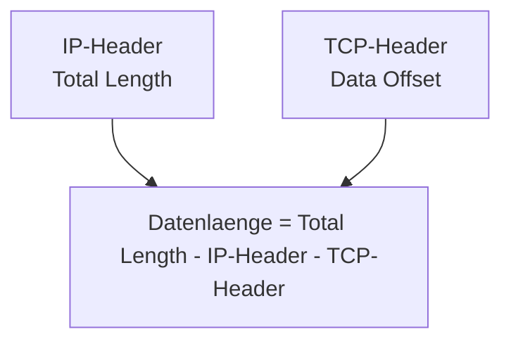

### Window-Management Beispiel

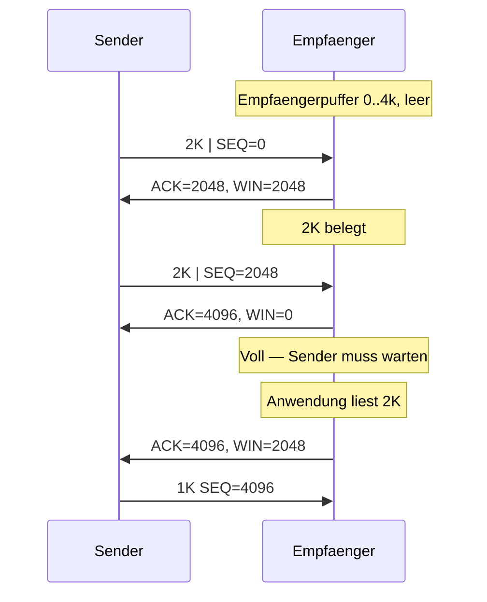

---

## Push-Flag, Nagle und Urgent-Pointer

### Push-Flag (PSH)

Damit der Empfaenger nicht unnoetig lange puffert (Threshold vor Auslieferung), gibt es das **PUSH-Flag**.
- Empfaenger liefert solche Segmente **direkt beim naechsten Read** aus
- Terminal-Emulationen setzen PSH bei **CRLF**, damit das Kommando direkt verarbeitet wird
- Direktes Setzen ist nicht moeglich — ein **Flush auf den Output-Stream** ist ein guter Ansatz

### Nagle-Algorithmus

> [!quote] Definition
> Limitiert die Anzahl "kleiner" Segmente:
> - Solange ein unbestaetigtes kleines Segment unterwegs ist, werden **keine** weiteren kleinen Segmente gesendet
> - Neue Daten werden im Sendepuffer gesammelt und erst verschickt, wenn entweder eine Bestaetigung eintrifft **oder** genuegend Daten fuer ein volles Segment (MSS) angesammelt sind

Deaktivierung: Socket-Option **`TCP_NODELAY`**.

> [!warning] Achtung
> **Nagle und Delayed-Ack behindern sich gegenseitig**: Nagle wartet auf ACK bevor er sendet, Delayed-ACK wartet auf naechstes Segment bevor es bestaetigt → Latenzen bis 500 ms entstehen.

### Urgent-Pointer (URG)

```js
socket.sendUrgentData(int data); // 0x03 = Ctrl-C
```

- Wenn das **URG-Flag** gesetzt ist, interpretiert der Empfaenger den Urgent-Pointer und liefert die Daten **vor** etwaig gepufferten Daten aus
- Der Urgent-Pointer ist als **Offset im Segment** gemeint — ab dort beginnen die wichtigen Daten
- Anwendung: interaktive Anwendungen koennen Signale (CTRL-Eingaben) "ueberholen"

---

## Window-Scale: Bandwidth-Delay-Produkt

### Problem

Der TCP-Header stellt nur ein **16-Bit-Feld** fuer das Advertised Window zur Verfuegung → maximal 64 kB Uebertragungsfenster.

> [!quote] Definition (Bandwidth-Delay-Produkt)
> Das Bandwidth-Delay-Produkt gibt an, wie gross das Uebertragungsfenster bei gegebener Bandbreite und Round-Trip-Zeit sein muss.

Auf **Long-Fat-Pipes** (hohe Bandbreite × hohe RTT) reichen 64 kB nicht aus → unter Auslastung der Leitung.

### Window-Scale-Option

> [!tip] Merke
> Einfuehren einer **Window-Scale-Erweiterung**: ein Skalierungsfaktor fuer das 16-Bit-Window-Feld.

- Window Scale ist 3 Byte lang (zzgl. Fuell-Byte) — eine TCP-Option
- Das 3. Byte gibt die Skalierung **logarithmisch** an (Wertebereich 0x00 – 0x0E = 0–14)
- Bedeutung: zusaetzliche binaere Nullen hinter dem Window-Header-Feld
- Wird **nur im SYN-Segment beim Verbindungsaufbau** uebertragen — danach gilt der Wert fuer die ganze Verbindung
- Beide Seiten muessen die Option separat in ihrem SYN schicken — 0 bedeutet "keine Skalierung"
- Neue maximale Fenstergroesse: $65\,535 \cdot 2^{14} \approx 1{,}07 \cdot 10^{9}$ Byte
- TCP-intern wird die Fenstergroesse als 30-Bit-Zahl verwaltet

> [!tip] Merke
> - Ohne Window-Scale-Option ist TCP **nicht geeignet** fuer Long-Fat-Pipes.
> - Die Option wird beim Aufbau in **beiden Richtungen separat** mitgeteilt.
> - Mit groesserer Skalierung koennen nur noch **groessere** Aenderungen im Empfangspuffer angezeigt werden — nicht mehr das Lesen einzelner Bytes.
> - Verpasst eine Anwendung das Setzen der Option vor Verbindungsaufbau, kann sie ggf. die gewuenschte Rate nicht erzielen.

---

## Fragen zur Selbstkontrolle

Die kompakten Karteikarten finden sich unter [[kommunikationssysteme/selbstkontrolle/komsys-selbstkontrolle-12|Selbstkontrolle 12]]. Im Folgenden ausfuehrliche Antworten zur Pruefungsvorbereitung.

**Wie funktioniert die Flusskontrolle in TCP?**

TCP implementiert ein **byte-basiertes Sliding-Window-Protokoll**. Jedes ACK enthaelt das **Advertised Window** (freier Platz im Empfangspuffer), das das nutzbare Sendefenster begrenzt. Auf Senderseite gilt `LastByteSent - LastByteAcked < AdvertisedWindow`. ACKs sind **kumulativ**: `ACK n+1` bestaetigt alles bis Byte $n$.

**Wie geht TCP mit verlorenen Segmenten um?**

TCP nutzt eine **hybride** Strategie. Der Sender verwaltet nur einen Timer fuer das aelteste unbestaetigte Segment — bei Timeout sieht das wie Go-Back-N aus. Der Empfaenger puffert aber Out-of-Order-Segmente, sodass faktisch **Selective Repeat** entsteht. Zusaetzlich werden mehrfach gleiche ACKs (**Triple-Duplicate-ACKs**) als NAK interpretiert und triggern einen **Fast Retransmit** vor dem Timeout.

**Was sind Delayed Acknowledgments und Huckepack-Technik?**

- **Piggybacking**: Bestaetigungen reiten auf einem Datenpaket der Gegenrichtung — bidirektional spart das eigenstaendige ACK-Pakete.
- **Delayed ACKs**: Liegen keine Daten in Gegenrichtung an, werden ACKs **bis zu 500 ms** verzoegert. Spaetestens fuer jedes **zweite** Segment muss aber bestaetigt werden.

**Wie schaetzt TCP die Round Trip Time?**

TCP misst die Zeit zwischen Sendung eines Segments und Empfang des zugehoerigen ACKs (**SampleRTT**) — Neuuebertragungen und Delayed ACKs werden ausgeblendet. Der Wert wird **geglaettet** (z.B. EWMA), sodass die Schaetzung eine Mittelung ueber die Vergangenheit ist. Ein Timeout darf nicht vor der RTT auftreten — zu kurz fuehrt zu unnoetigen Retransmissions, zu lang zu langsamer Reaktion auf Verluste.

**Was ist der Unterschied zwischen Fluss- und Staukontrolle?**

| | Flusskontrolle | Staukontrolle |
|---|---|---|
| Wo? | Zwischen Endpunkten | An Zwischensystemen / Routern |
| Mittel | Sliding Window / Receiver Window | Congestion Window |
| Ziel | Empfaenger nicht ueberlasten | Netz nicht ueberlasten + Fairness |

Bei Ueberlast wuerden Timeouts massenhaft Retransmissions ausloesen → Routerueberlast verschlimmert sich (**Congestion Collapse**). Drosselung der Datenrate bricht diese Spirale.

**Erklaeren Sie Slow Start und Congestion Avoidance.**

- **Slow Start**: cwnd startet bei 1 MSS und verdoppelt sich pro RTT (exponentiell). Endet bei `ssthresh`.
- **Congestion Avoidance**: ab `ssthresh` waechst cwnd nur noch um 1 MSS pro RTT (additiv).
- Bei **Timeout**: `ssthresh = cwnd/2`, cwnd zurueck auf 1 MSS (erneuter Slow Start).
- Bei **3 DupACKs**: Fast Retransmit, cwnd halbiert, Fast Recovery → kein Slow Start noetig.

**Was schafft TCP Staukontrolle?**

**Fairness**: Wird eine Leitung von $N$ TCP-Verbindungen genutzt, erhaelt jede etwa $1/N$ der Bandbreite.

**Wie wird eine TCP-Verbindung auf- und abgebaut?**

- **Aufbau**: 3-Way-Handshake (`SYN` → `SYN+ACK` → `ACK`). Zufaellige Startsequenznummern, MSS wird ausgehandelt.
- **Abbau**: 4-Way-Handshake (jede Richtung separat per FIN). Erforderlich, weil eine Seite ihr FIN schicken kann, waehrend die andere noch sendet.

**Welche Felder enthaelt ein TCP-Header und wozu dienen sie?**

Source/Destination Port, Sequence Number, Acknowledgement Number, Data Offset, Reserved, Code (URG/ACK/PSH/RST/SYN/FIN), Window, Checksum, Urgent Pointer, Options, Data — siehe Tabelle oben. Die **Laenge der Daten** wird aus dem **IP-Header** ermittelt, da TCP selbst kein Laengenfeld traegt.

**Was sind Nagle-Algorithmus und Push-Flag?**

- **Nagle**: Sammelt kleine Segmente, bis ACK eintrifft oder MSS gefuellt ist. Deaktivierbar mit `TCP_NODELAY`. Achtung: Nagle + Delayed-Ack koennen sich gegenseitig blockieren.
- **PSH-Flag**: Empfaenger soll Daten **sofort** ausliefern, ohne Pufferung. Anwendung: Terminal-Emulationen, CRLF.

**Wozu dient die Window-Scale-Option?**

Da das Window-Feld nur 16 Bit hat (max 64 kB), reichen Standardfenster fuer Long-Fat-Pipes nicht aus. Die Window-Scale-Option setzt einen **logarithmischen Skalierungsfaktor** (0–14) — beim SYN ausgehandelt, fuer die ganze Verbindung. Maximalfenster bis ca. **1 GB**. Beide Seiten muessen die Option separat senden; 0 = keine Skalierung.
