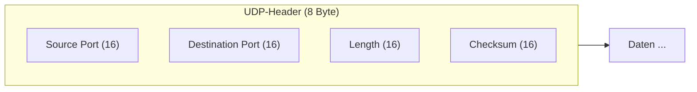
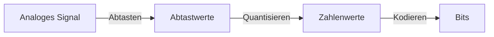
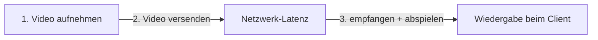
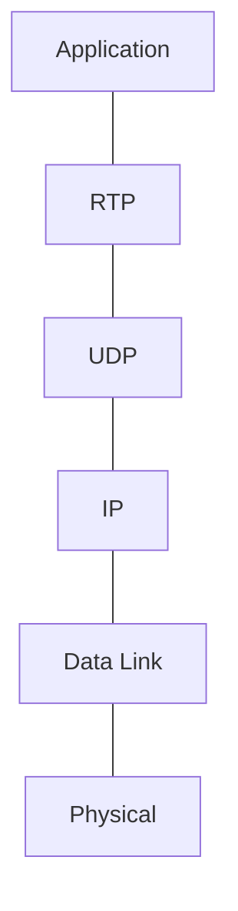

# 13 — User Datagram Protocol (UDP)

**Folien:** [[kommunikationssysteme/resources/Kommunikationssysteme_13_UDP.pdf|Kommunikationssysteme_13_UDP.pdf]]
**Selbstkontrolle:** [[kommunikationssysteme/selbstkontrolle/komsys-selbstkontrolle-07|Selbstkontrolle 7]]

> [!info] Hinweis
> Woche 7 umfasst zwei Foliensätze: **UDP** — diese Notiz — und [[kommunikationssysteme/lectures/07/komsys-14-dns|14 — Domain Name System (DNS)]]. Die Selbstkontroll-Fragen 1–8 (UDP, Multimedia, RTP) werden hier behandelt, die Fragen 9–18 (DNS) in der DNS-Notiz.

## Inhaltsverzeichnis

- [[#Warum überhaupt UDP?|Warum überhaupt UDP?]]
- [[#Der UDP-Header|Der UDP-Header]]
- [[#UDP-Checksum|UDP-Checksum]]
- [[#Wozu UDP? Multimedia-Anforderungen|Wozu UDP? Multimedia-Anforderungen]]
- [[#Continuous Media: Digitalisierung|Continuous Media: Digitalisierung]]
- [[#Multimediale Netzanwendungen und Streaming|Multimediale Netzanwendungen und Streaming]]
- [[#Real-Time Protocols: RTP / RTCP / RTSP|Real-Time Protocols: RTP / RTCP / RTSP]]
- [[#Weitere UDP-basierte Anwendungen|Weitere UDP-basierte Anwendungen]]
- [[#Fragen zur Selbstkontrolle|Fragen zur Selbstkontrolle]]

---

## Warum überhaupt UDP?

> [!quote] Definition (UDP)
> UDP stellt eine **„direkte" Schnittstelle zur Nutzung von IP** dar: Anwendungen können Nachrichten **direkt verschicken, ohne Verbindungsaufbau** (verbindungslos).

TCP hat **Seiteneffekte**, die man nicht immer will:

- **Fluss- und Staukontrollmechanismen** beeinflussen die Übertragungsrate in erheblichem Umfang
- **Head-of-Line-Blocking** (ein verlorenes Segment blockiert die Auslieferung nachfolgender)
- je nach Programmierung **Skalierungsprobleme** auf Server-Seite

> [!tip] Merke
> Sehr viele **Multimedia-Anwendungen** verwenden UDP, da dort **keine zuverlässige Verbindung** benötigt wird — geringe Latenz und einfacher Nachrichtentransport zählen mehr als garantierte Zustellung.

---

## Der UDP-Header

Der Header ist nur **8 Bytes** lang (4 Felder à 16 Bit):

| Feld | Bedeutung |
|---|---|
| **Source Port** | identifiziert den sendenden Prozess (für eventuelle Rückmeldungen). **Optional** — Wert `0`, wenn nicht genutzt |
| **Destination Port** | identifiziert den Prozess im Zielsystem, an den die Daten abzuliefern sind |
| **Length** | Gesamtlänge des UDP-Datagramms in Bytes; **Mindestlänge 8** (= Header-Länge) |
| **Checksum** | **optional** (0 = keine Angabe); Prüfsumme über Pseudo-Header + Header + Daten |

---

## UDP-Checksum

> [!tip] Merke
> **Ziel:** Erkennen von Fehlern (z.B. flipped bits) im übertragenen Segment — **optionale** Nutzung.

Berechnung formal über eine **Einerkomplementsumme** über **Pseudo-Header + Header + Daten**:

- Der **Pseudo-Header** (12 Bytes, **nicht** mitübertragen) sichert die IP-Adressen ab: Quell-IP-Adresse (32 Bit), Ziel-IP-Adresse (32 Bit), 8 Bit Leerfeld, 8 Bit Protokoll-ID (**UDP = 17**), Länge des UDP-Datagramms (16 Bit).
- Optionales Auffüllen der Daten (bei ungerader Byteanzahl) durch `0`-en.
- Berechnung durch Interpretation der Daten als 16-Bit-Werte, Aufaddieren im Einer-Komplement; etwaiger Übertrag wird durch Addieren der `1` mit eingebaut.
- Einfügen der Prüfsumme in den UDP-Header.

> [!warning] Achtung
> Da der **Datenteil** eines IP-Datagramms **nicht** durch die IP-Header-Checksum geschützt ist, bedeutet ein Verzicht auf die UDP-Checksum, dass der Inhalt des UDP-Datagramms (Header **und** Daten) durch **keine** Prüfsumme gesichert ist.

---

## Wozu UDP? Multimedia-Anforderungen

> [!quote] Definition
> **Multimedia:** Die digitale Übertragung von Audio- und Videodaten besitzt **andere Anforderungen** als klassische Datenübertragung.

- **Geringe Verlustraten stören nicht** (ein paar fehlende Pakete fallen kaum auf)
- **Isochrones Abspielen** (gleichmäßiger Takt)
- **Latenzzeiten** müssen — insbesondere bei interaktiven Anwendungen — **gering** sein
  - Kriterien für gute Telefonie: maximale Latenz von **150 ms**
  - **Jitter** (Variation der Laufzeit) sollte ebenso beschränkt sein

---

## Continuous Media: Digitalisierung

Die Wandlung eines analogen Signals in ein digitales erfolgt in **drei Schritten**:

1. **Abtasten** (Sampling) — die Signalstärke wird regelmäßig gemessen.
2. **Quantisieren** — Umwandlung der Spannungswerte in (diskrete) Zahlenwerte.
3. **Kodieren** — die Zahlenwerte werden binär kodiert.

> [!tip] Merke — Nyquist-Theorem
> $$ \text{Sampling-Frequenz} \;\geq\; 2 \times \text{maximale Frequenz} $$
> Ein bandbegrenztes Signal kann nur dann fehlerfrei rekonstruiert werden, wenn mit **mindestens der doppelten Maximalfrequenz** abgetastet wird (sonst Aliasing).

**Qualität** hängt ab von:
- **Anzahl der Quantisierungsstufen** (Auflösung der Niveaus / Lautstärken)
- **Abtastrate** (liefert die Bandbreite)

> [!example] Beispiel — Platzbedarf / Übertragungsrate
> $$ \text{Bitrate/s} = \text{Abtastrate/Hz} \times \text{Bits/Abtastwert} $$
> **Audio-CD:** $44{,}1\,\text{kHz} \times 2 \times 16\,\text{bit} = 1{,}4\,\text{MBit/s}$ → Speicherbedarf bei 60 min ≈ **630 MB**.

---

## Multimediale Netzanwendungen und Streaming

**Kategorien:**

1. **Streaming gespeicherter** Audio- und Video-Daten
2. **Streaming von Live**-Audio und -Video (z.B. Internet-Radio, IPTV)
3. **Interaktive** Audio- und Video-Nutzung (z.B. VoIP, Videokonferenz)

> [!quote] Definition (Streaming)
> **Streaming** ist das Verwenden (Ausliefern) von Daten, **bevor** diese vollständig übertragen wurden — der Client spielt die ersten Teile bereits ab, während der Server noch überträgt.

> [!warning] Achtung — Pufferung
> Beim Senden mit **konstanter** Bitrate trifft das Signal wegen schwankender **Netzwerklatenz** mit **variabler** Bitrate ein. Ein **Playback-Puffer** auf Empfängerseite gleicht diese Schwankungen aus, damit die Wiedergabe gleichmäßig (konstante Bitrate) bleibt.
> - **Live-Streaming:** Zeitverschiebung kann ~10 s betragen; der Puffer darf **nicht leerlaufen**.
> - **Interaktivität:** Vorspulen kann nicht funktionieren; Rückspulen und Pausieren ist möglich.

---

## Real-Time Protocols: RTP / RTCP / RTSP

Die **RTP-Programmierbibliothek** liefert Transportschnittstellen, die **UDP erweitern**:

- **UDP** liefert Port-Nummern, **IP** die Adressen der Endpunkte.
- **RTP** liefert u.a.: **Kodierungskennung**, **Sequenznummern**, **Zeitstempel**.
- **RTCP** liefert Statistiken (auf UDP-Basis).
- **RTSP** ist „unsere Fernbedienung" (Steuerung: Play/Pause/…).

> [!info] Hinweis — HLS / MPEG-DASH
> Auch wenn RTP das eigentlich für Streaming besser konzipierte Protokoll ist, nutzen aktuelle Streaming-Plattformen eher **HTTP Live Streaming (HLS, Apple)** oder **MPEG-DASH**:
> - **Skalierbarkeit:** für große Zuschauerzahlen und verteilte Auslieferung (CDN) optimiert
> - **Kompatibilität:** funktioniert auf praktisch allen Endgeräten und hinter Firewalls/NAT, da HTTP genutzt wird
> - **Einfache Abmeldung:** Client hört einfach auf, Segmente anzufordern — keine komplexe Session-/Verbindungsüberwachung
> - **Sicherheit/DRM:** HLS unterstützt Verschlüsselung und Digital Rights Management nativ

---

## Weitere UDP-basierte Anwendungen

**Netzwerk-Boot** — das Laden des Betriebssystems über das Netzwerk:

- TCP ist aufwendig; die im EEPROM verankerten Mechanismen sind eher begrenzt.
- Für den Boot-Zugang nutzt man die **Sicherungsschicht ohne über einen Router zu gehen** → von einem zuverlässigen Übertragungskanal kann ausgegangen werden.
- **TFTP** (Trivial File Transfer Protocol) und **DHCP**.

**DNS** nutzt in der Regel **UDP** — treibende Ursache war, dass man die üblichen TCP-Mechanismen nicht wollte und eher an geringen Antwortzeiten interessiert war (Details in [[kommunikationssysteme/lectures/07/komsys-14-dns|14 — DNS]]).

**HTTP/3 / QUIC** — modernes Beispiel: QUIC setzt auf UDP auf und implementiert Zuverlässigkeit/Staukontrolle selbst im User-Space.

---

## Fragen zur Selbstkontrolle

Die kompakten Karteikarten finden sich unter [[kommunikationssysteme/selbstkontrolle/komsys-selbstkontrolle-07|Selbstkontrolle 7]]. Diese Notiz beantwortet die Fragen **1–8** (UDP, Multimedia, RTP); die DNS-Fragen 9–18 in [[kommunikationssysteme/lectures/07/komsys-14-dns|14 — DNS]].

**Warum hat UDP neben TCP eine Daseinsberechtigung?**

Weil viele Anwendungen geringe Latenz, einfachen (verbindungslosen) Nachrichtentransport oder eigene Zuverlässigkeitsmechanismen brauchen und dafür den Overhead von TCP nicht wollen. TCPs Fluss-/Staukontrolle, Head-of-Line-Blocking und Verbindungsaufbau sind für Multimedia/Echtzeit kontraproduktiv.

**Welche Felder enthält der UDP-Header?**

Vier 16-Bit-Felder (8 Byte gesamt): **Source Port**, **Destination Port**, **Length** und **Checksum**. Source Port und Checksum sind optional.

**Welche Schritte sind notwendig, um ein analoges Signal in ein digitales zu wandeln?**

**Abtasten** (regelmäßiges Messen der Signalstärke), **Quantisieren** (Spannungswerte → diskrete Zahlenwerte) und **Kodieren** (Zahlenwerte → Bits).

**Was besagt das Nyquist-Theorem?**

Ein bandbegrenztes Signal kann fehlerfrei rekonstruiert werden, wenn mit **mindestens der doppelten Maximalfrequenz** abgetastet wird (Sampling-Frequenz ≥ 2 × max. Frequenz).

**Nennen Sie unterschiedliche Kategorien von Multimedia-Anwendungen!**

(1) Streaming **gespeicherter** Audio-/Video-Daten, (2) **Live**-Streaming (Internet-Radio, IPTV), (3) **interaktive** Echtzeitkommunikation (VoIP, Videokonferenz). Dazu klassische Download/Playback-Anwendungen.

**Warum ist beim Streaming von Live-Daten immer eine Pufferung auf Empfängerseite notwendig?**

Weil Netzverzögerung und **Jitter** schwanken: bei konstantem Senden trifft das Signal mit variabler Bitrate ein. Der **Playback-Puffer** gleicht diese Schwankungen aus, damit die Wiedergabe gleichmäßig bleibt — er darf aber nicht leerlaufen.

**Welches Anwendungsprotokoll unterstützt die Versendung von Echtzeitdaten über UDP?**

Typischerweise **RTP** (Real-time Transport Protocol), oft zusammen mit **RTCP** (Statistiken) und **RTSP** (Steuerung).

**Warum benötigt man ein solches Protokoll on-Top von UDP?**

UDP liefert nur Ports — keine Zeitstempel, Sequenznummern, Payload-Typen oder Feedback. RTP/RTCP ergänzen genau diese Informationen (Kodierungskennung, Sequenznummern, Zeitstempel, Statistiken), die Echtzeitmedien für korrekte Wiedergabe und Synchronisation brauchen.
