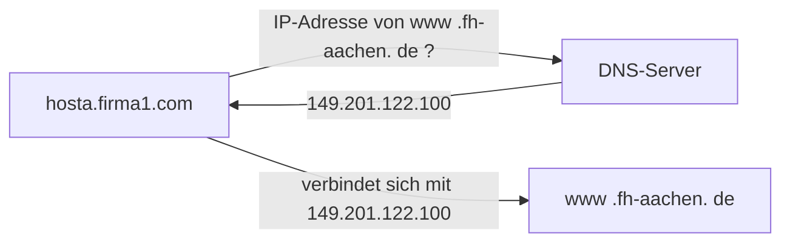
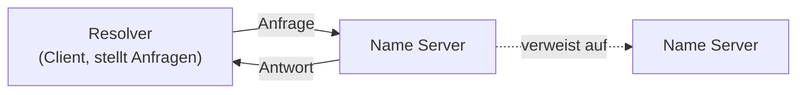
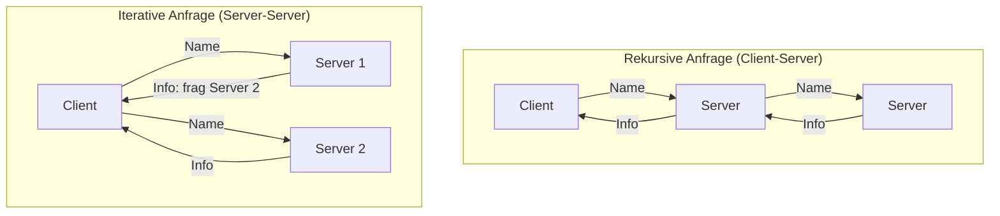

# 14 — Domain Name System (DNS)

**Folien:** [[kommunikationssysteme/resources/Kommunikationssysteme_14_DNS.pdf|Kommunikationssysteme_14_DNS.pdf]]
**Selbstkontrolle:** [[kommunikationssysteme/selbstkontrolle/komsys-selbstkontrolle-07|Selbstkontrolle 7]]

> [!info] Hinweis
> Woche 7 umfasst zwei Foliensätze: [[kommunikationssysteme/lectures/07/komsys-13-udp|13 — User Datagram Protocol (UDP)]] und **DNS** — diese Notiz. Die Selbstkontroll-Fragen 9–18 (DNS) werden hier behandelt, die Fragen 1–8 (UDP, Multimedia, RTP) in der UDP-Notiz.

## Inhaltsverzeichnis

- [[#Semantische / mnemonische Namen|Semantische / mnemonische Namen]]
- [[#DNS-Konzept: verteilte Datenbank|DNS-Konzept: verteilte Datenbank]]
- [[#Der DNS-Server|Der DNS-Server]]
- [[#Struktur der Datenbank: Baum und FQDN|Struktur der Datenbank: Baum und FQDN]]
- [[#Die Information: Resource Records|Die Information: Resource Records]]
- [[#Domänen und Zonen|Domänen und Zonen]]
- [[#Root-Name-Server|Root-Name-Server]]
- [[#Auflösung: rekursive und iterative Anfragen|Auflösung: rekursive und iterative Anfragen]]
- [[#DNS-Dienste: MX-Record und Cache|DNS-Dienste: MX-Record und Cache]]
- [[#DNS-Attacken|DNS-Attacken]]
- [[#Fragen zur Selbstkontrolle|Fragen zur Selbstkontrolle]]

---

## Semantische / mnemonische Namen

- Socket-basierte Kommunikation nutzt **IP-Adressen** — End-Anwender wollen aber **sprechende Bezeichnungen**.

> [!quote] Definition (mnemonisch)
> **Mnemonisch** = Eigenschaft von Bezeichnungen/Namen, wenn sie leicht zu merken sind und Rückschlüsse auf ihre Bedeutung erlauben. Solche Namen müssen **übersetzt und aufgelöst** werden → **DNS = Domain Name System**.



> [!tip] Merke
> Internetadressen sind für **Menschen** schlecht zu merken, aber für **Rechner** perfekt. Symbolische Namen sind für Menschen einfacher, aber Maschinen können damit nichts anfangen — DNS überbrückt beides.

---

## DNS-Konzept: verteilte Datenbank

1. DNS handhabt die **Abbildung von Rechnernamen auf Adressen** (und weitere Dienste).
2. DNS ist eine **verteilte Datenbank**:
   - DNS-Server verwalten nur einen **Teil** der Rechner im Internet.
   - Erst der **Verbund** aller Server ergibt den vollständigen Namensraum.
   - Die Struktur des Namensraums gibt eine **administrative Einteilung** wieder — Bereiche (**Zonen**) verwalten ihre Adressen unter **lokaler Kontrolle**; Zonen sind durch **Übergangspunkte** verbunden.
3. Daten jedes lokalen Bereichs werden über eine **Client/Server-Architektur** verfügbar gemacht.
4. **Robustheit und Geschwindigkeit** werden durch **Replikation** und **Caching** erreicht.
5. Zwei Hauptkomponenten:



> [!quote] Definition
> **Name Server:** Server, die Informationen über einen Bereich der Datenbank verwalten. **Resolver:** Clients, die Anfragen an die Server stellen.

---

## Der DNS-Server

- Server-Prozess im Netz, **wartet auf Anfragen** (Standard ist **UDP**!).
- Enthält eine **Tabelle** mit Namen von Hosts und zugehörigen **IP-Adressen** (**nicht injektiv** — mehrere Namen können auf dieselbe IP zeigen und umgekehrt).
- Wird von den Klienten über **Konfigurationsdatei oder DHCP** gefunden.
- Zusammenspiel mit lokaler Datei: `/etc/hosts` (UNIX) bzw. `C:\WINDOWS\system32\drivers\etc\hosts` (Windows).
- Reihenfolge bei manchen Systemen einstellbar: `/etc/resolv.conf`, `/etc/nsswitch.conf` (UNIX).

---

## Struktur der Datenbank: Baum und FQDN

- Die Strukturierung aller Informationen kann als **Baum** verstanden werden.
- Jeder Knoten ist durch ein **Label** gekennzeichnet, das relativ zu seinem Vater-Knoten (Parent) definiert ist.
- Jeder innere Knoten ist selbst Wurzel eines Teilbaums (**Domäne / Subdomäne**).
- Das Label, durch „." mit allen übergeordneten Labels verknüpft, bildet den **vollständigen, absoluten Namen** (**Fully Qualified Domain Name, FQDN**).

```mermaid
flowchart TB
    ROOT["\" \" (root)"]
    ROOT --> com & edu & gov & mil & se & de
    de --> fhaachen[fh-aachen]
    de --> juelich
    edu --> oxford[Oxford]
    oxford --> cs
```

---

## Die Information: Resource Records

> [!quote] Definition
> Ein **DNS-Knoten ist ein Datencontainer**, der über **Resource Records** beliebige (aber standardisierte) Informationen zu einer Namenskomponente speichert.

- **IP-Adressen** (`A` für IPv4 / `AAAA` für IPv6) oder **Zonengrenzen** (definiert durch **`SOA` + `NS`**) sind klassische Beispiele.
- **Zonengrenzen** sind Übergangspunkte zwischen administrativen Einheiten:
  - Zonen haben eigene DNS-Server.
  - `fh-aachen.de` ist eine Zone.
  - `.de` ist eine Zone, die den DNS-Server der FH Aachen faktisch verlinkt.
- In den **Blättern** stehen typischerweise die IP-Adressen einzelner Rechner.

> [!example] Beispiel — FQDN-Auflösung
> Logischer Name `www.idt.fh-aachen.de` → zugehörige IP-Adresse `149.201.10.30`. Der Baum wird von der Wurzel über `de` → `fh-aachen` → `idt` → `www` durchlaufen, wobei jede Zonengrenze einen Verweis (NS) auf den nächsten zuständigen Server enthält.

---

## Domänen und Zonen

> [!warning] Achtung — Domäne ≠ Zone
> **Domäne** und **Zone** sind unterschiedliche Konzepte! Eine **Domäne** ist ein Teilbaum des Namensraums; eine **Zone** ist der administrativ von **einem** Name Server verwaltete Ausschnitt davon.

```mermaid
flowchart TB
    ROOT["\" \""] --> com & edu & org
    subgraph eduDom["edu Domäne"]
        edu --> berkeley & nwu & purdue
    end
    edu -.edu Zone.-> edu
    berkeley -.berkeley.edu Zone.-> berkeley
    purdue -.purdue.edu Zone.-> purdue
```

- Jeder **Name Server verwaltet nur einen kleinen Teil** der Informationen — eine **Zone**.
- Eine Zone ist ein **autarker Bereich** im DNS-Namensraum; zur Einrichtung muss der **übergeordnete Knoten** die Verwaltung **delegieren**.
- Knoten-Label max. **63 Zeichen**, bis zu **127 Ebenen**.
- Jede Zone hat **einen primären** und beliebig viele **sekundäre** Nameserver (NS):
  - Jeder NS kennt **alle IP-Adressen** seiner **direkt** untergeordneten Sub-Domains der eigenen Zone.
  - Sekundäre NS führen ein periodisches Update durch — den **Zonentransfer** (vollständiger Datenbestand des primären NS wird übertragen, **Master-Slave-Prinzip**).

> [!quote] Definition (IETF, RFC 1035)
> Name servers manage two kinds of data: **zones** (*„each zone is the complete database for a particular 'pruned' subtree of the domain space"* — autoritative Daten) und **cached data** (von einem lokalen Resolver erworben, ggf. unvollständig, wird per Timeout verworfen).

---

## Root-Name-Server

- Bilden die **Wurzel** der hierarchischen DNS-Struktur.
- Es gibt weltweit **13 Root-Name-Server** — z.Zt. `{a-m}.root-servers.net`.
- Die tatsächliche Anzahl physischer Server ist deutlich größer, da via **Anycast** mehrere physische Server einen DNS-Root-Server realisieren.
- Root-Server müssen **hohe Lasten** bewältigen.
- Name-Server der anderen Hierarchien werden mit **festen Root-Servern** konfiguriert (Root Hints) — daher kennt jeder Server den „Startpunkt" seiner Suche.

---

## Auflösung: rekursive und iterative Anfragen



- **Rekursive Anfrage:** Der Server schickt die Anfrage zum nächsten Server **weiter** (oder liefert eine Fehlermeldung) und gibt erst die endgültige Antwort zurück → Client-Server-Anfragen.
- **Iterative Anfrage:** Der Server antwortet dem Fragenden **direkt** mit der IP-Adresse des **nächsten** zu fragenden Servers → Server-Server-Anfragen.

> [!example] Beispiel — Namensauflösung von `girigiri.gbrmpa.gov.au`
> Der konfigurierte Name Server fragt **iterativ**: Root-Server → Verweis auf `au`-NS → `au`-NS → Verweis auf `gov.au`-NS → `gov.au`-NS → Verweis auf `gbrmpa.gov.au`-NS → dieser liefert die Adresse. Der **Resolver** des Clients stellt dabei typischerweise eine **rekursive** Anfrage an den konfigurierten Server, der die iterative Auflösung übernimmt.

---

## DNS-Dienste: MX-Record und Cache

- DNS leistet **mehr** als nur die Auflösung von Namen.
- Der **Mail-Exchange-Record (`MX`)** liefert zu einer Zone den **Mail-Server** (samt Priorität) — so weiß man, wer bei der FH Aachen die Mails empfängt.
- Weitere Informationen können z.B. im Zusammenhang mit **IP-Telefonie** geliefert werden.

> [!tip] Merke — Caching
> Jeder DNS-Server besitzt einen **Cache**, der vor kurzem aufgelöste Anfragen vorhält. Den **Gültigkeitszeitraum (TTL)** liefert der Server, der die Adresse ursprünglich aufgelöst hat.

---

## DNS-Attacken

> [!warning] Achtung
> DNS ist ein durchaus **kritischer Dienst** und — da meist nur **UDP** verwendet wird — häufig Angriffsziel.

| Angriff | Idee |
|---|---|
| **DNS ID Hacking** | Anfragen sind oft nur über eine **Query ID** geschützt. Der Client erwartet neben der Auflösung diese assoziierte ID; kann sie nicht aus dem Netz abgegriffen werden, muss der Angreifer sie **erraten**. |
| **DNS Spoofing** | Ein **falscher DNS-Server** beantwortet die Anfrage (mit korrekter ID und falscher IP). Von Providern zu unterbinden. |
| **DNS Cache Poisoning** | Ein eigentlich korrekter DNS-Server wird „verseucht" — der **Cache** wird gezielt **falsch gefüllt**. |

---

## Fragen zur Selbstkontrolle

Die kompakten Karteikarten finden sich unter [[kommunikationssysteme/selbstkontrolle/komsys-selbstkontrolle-07|Selbstkontrolle 7]]. Diese Notiz beantwortet die Fragen **9–18** (DNS); die UDP-Fragen 1–8 in [[kommunikationssysteme/lectures/07/komsys-13-udp|13 — UDP]].

**Wozu dient das Domain Name System (DNS) hauptsächlich?**

Zur Übersetzung von **Namen in IP-Adressen** und allgemein zur **verteilten Verwaltung** von Namensdaten.

**Was ist eine Zone, was ist eine (Sub-)Domäne?**

Eine **Domäne** ist ein Teilbaum des DNS-Namensraums; eine **Zone** ist der administrativ von einem Nameserver verwaltete Ausschnitt davon (ein autarker, delegierter Bereich).

**Wie wird eine Zone in den DNS-Raum anschaulich integriert?**

Als **delegierter Teilbaum** unterhalb einer übergeordneten Zone, an den Delegationspunkten durch **NS-Einträge** abgeschnitten.

**Woher kennt ein Rechner typischerweise die IPs seines zugehörigen DNS-Servers?**

Meist per **DHCP**, alternativ statisch konfiguriert (z.B. `/etc/resolv.conf`).

**Was versteht man unter einem Zonen-Transfer?**

Die Übertragung der Zonendaten von einem **primären** auf einen **sekundären** DNS-Server (vollständig oder inkrementell) — Master-Slave-Prinzip.

**Löst ein DNS-Server eine Anfrage rekursiv oder iterativ auf?**

Ein **rekursiver Resolver** arbeitet für den Client rekursiv, fragt andere Server intern aber meist **iterativ** ab.

**Wie arbeitet die Resolver-Bibliothek beim Client, rekursiv oder iterativ?**

Sie schickt typischerweise eine **rekursive** Anfrage an den konfigurierten Resolver.

**Woher kennt ein DNS-Server den „Startpunkt" seiner Suche?**

Aus den fest eingebauten bzw. konfigurierten **Root-Server-Hinweisen (Root Hints)**.

**Was ist ein MX-Record?**

Ein DNS-Record, der den für eine Domäne zuständigen **Mailserver** samt **Priorität** angibt.

**Warum ist das DNS ein kritischer Dienst im Internet und Ziel von Hacking-Attacken?**

Weil fast alle Internetdienste **zuerst** eine Namensauflösung brauchen; Ausfälle oder Manipulationen (ID Hacking, Spoofing, Cache Poisoning) können daher große Teile der Kommunikation stören oder umlenken.
