# 15 — Anwendungsprotokolle

**Folien:** [[kommunikationssysteme/resources/Kommunikationssysteme_15_Anwendungsprotokolle.pdf|Kommunikationssysteme_15_Anwendungsprotokolle.pdf]]
**Selbstkontrolle:** [[kommunikationssysteme/selbstkontrolle/komsys-selbstkontrolle-08|Selbstkontrolle 8]]

## Inhaltsverzeichnis

- [[#HTTP — Abruf von Webseiten|HTTP — Abruf von Webseiten]]
- [[#MIME — Binärdaten in textbasierten Protokollen|MIME — Binärdaten in textbasierten Protokollen]]
- [[#Virtual Hosts|Virtual Hosts]]
- [[#TLS/SSL — Absicherung der Kommunikation|TLS/SSL — Absicherung der Kommunikation]]
- [[#Zertifikate und Signaturen|Zertifikate und Signaturen]]
- [[#Der TLS-Handshake|Der TLS-Handshake]]
- [[#Diffie-Hellman-Schlüsselaustausch|Diffie-Hellman-Schlüsselaustausch]]
- [[#TLS Record Layer und QUIC|TLS Record Layer und QUIC]]
- [[#FTP — File Transfer Protocol|FTP — File Transfer Protocol]]
- [[#TFTP — Trivial File Transfer Protocol|TFTP — Trivial File Transfer Protocol]]
- [[#E-Mail — Grundarchitektur|E-Mail — Grundarchitektur]]
- [[#E-Mail-Formate und Header|E-Mail-Formate und Header]]
- [[#SMTP, POP3 und IMAP|SMTP, POP3 und IMAP]]
- [[#Telnet, rlogin/rsh und SSH|Telnet, rlogin/rsh und SSH]]
- [[#SNMP — Netzwerkmanagement|SNMP — Netzwerkmanagement]]
- [[#Fragen zur Selbstkontrolle|Fragen zur Selbstkontrolle]]

---

## HTTP — Abruf von Webseiten

Der Abruf einer Webseite (im klassischen Fall **ohne** Persistent-Connections) durchläuft mehrere Schritte, die typisch für ein Anwendungsprotokoll über TCP sind: Zuerst eine **DNS-Auflösung**, dann ein **TCP-Verbindungsaufbau** zu Port 80, dann der eigentliche **Request/Response** und zum Schluss der Verbindungsabbau.

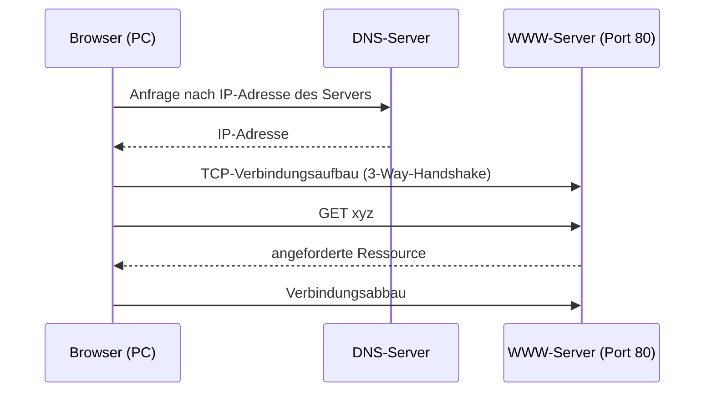

> [!tip] Merke
> HTTP wurde **textbasiert** konzipiert (E-Mail übrigens auch). Der Browser fragt zuerst das DNS, öffnet dann eine **TCP-Verbindung zu Port 80**, sendet das Kommando `GET xyz`, erhält die Ressource zurück und baut die Verbindung anschließend wieder ab.

> [!warning] Achtung — ohne Persistent-Connections
> Ohne persistente Verbindungen wird pro angeforderter Ressource eine **eigene TCP-Verbindung** auf- und wieder abgebaut. Das kostet für jede Ressource einen vollständigen 3-Way-Handshake und ist der Grund, warum HTTP später Persistent-Connections eingeführt hat.

---

## MIME — Binärdaten in textbasierten Protokollen

HTTP und E-Mail sind **textbasiert** — wie lassen sich damit **binäre Daten** (Bilder, Audio, Video) übertragen?

> [!quote] Definition — MIME
> **MIME** = *Multipurpose Internet Mail Extensions*. MIME definiert die **Kodierungsregeln für Nicht-ASCII-Nachrichten** und ermöglicht die Nutzung verschiedener Kodierungen (*media types*) innerhalb einer Nachricht.

Wichtige MIME-Header-Felder:

| Feld | Bedeutung |
|---|---|
| **`MIME-Version`** | Kennzeichnet die benutzte MIME-Version (z.B. `1.0`) |
| **`Content-Type`** | Legt den Datentyp (`type/subtype`) der Nachricht fest, z.B. `text/html`, `image/GIF`, `image/jpeg`, `multipart/mixed` (gemäß RFC 1521) |
| **`Content-Transfer-Encoding`** | Definiert die **Transfersyntax**, in der der Hauptteil übertragen wird, z.B. `base64` oder `quoted-printable`. Verpackung für Netze, die z.B. nur ASCII verstehen |
| **`Content-Id`** | Eindeutiger Bezeichner des Inhalts |
| **`Content-Description`** | Für Menschen lesbarer String, der den Inhalt beschreibt |

> [!warning] Achtung — HTTP vs. E-Mail
> Das Feld **`Content-Transfer-Encoding` wird bei HTTP nicht benutzt** — HTTP nutzt dafür die Felder `Content-Encoding` und `Transfer-Encoding`. `Content-Transfer-Encoding` ist typisch für die **E-Mail**-Nutzung von MIME.

> [!example] Beispiel — multipart/mixed mit Bild-Anhang
> ```
> MIME-Version: 1.0
> Content-Type: MULTIPART/MIXED;
>   BOUNDARY="8323328-2120168431-824156555=:325"
> --8323328-2120168431-824156555=:325
> Content-Type: TEXT/PLAIN; charset=US-ASCII
> A picture is in the appendix
> --8323328-2120168431-824156555=:325
> Content-Type: IMAGE/JPEG; name="picture.jpg"
> Content-Transfer-Encoding: BASE64
> Content-ID: <PINE.LNX.3.91.960212212235.325B@localhost>
> Content-Description:
> /9j/4AAQSkZJRgABAQEAlgCWAAD/2wBDAAEBAQEBAQEBAQEBAQIBAQEBA [...]
> ---8323328-2120168431-824156555=:325 —
> ```
> Die `BOUNDARY` trennt die einzelnen Teile. Das Bild wird als **BASE64** kodiert, damit es durch das textbasierte Protokoll transportiert werden kann.

---

## Virtual Hosts

Auf **einem** Rechner sollen mehrere Domains und Web-Server-Instanzen verfügbar sein — typische Anwendung: **Web-Hosting bei einem Provider**. Ein oder mehrere Webserver (Software) beantworten die Anfragen für die auf dem Rechner vorhandenen Domains.

Das Problem: **Nach der DNS-Auflösung geht die Information verloren, mit welchem Server man eigentlich sprechen wollte** — man landet nur noch bei einer IP-Adresse. Die **Anwendungsebene liefert diese Information erneut mit** (bei HTTP über den `Host`-Header, bei HTTPS zusätzlich über **SNI** — Server Name Indication).

> [!tip] Merke — nicht injektiv
> Die Namensauflösung **FQDN → IP ist nicht injektiv**: es kann beliebig viele Domänen geben, die faktisch an dieselbe Zone bzw. IP gehen. Wird `firma1.de` von `provider1.de` bedient, wird in der `.de`-Zone typischerweise ein **NS-Record** hinterlegt, der die autoritativen Nameserver für `firma1.de` angibt (z.B. `ns1.provider1.de`).

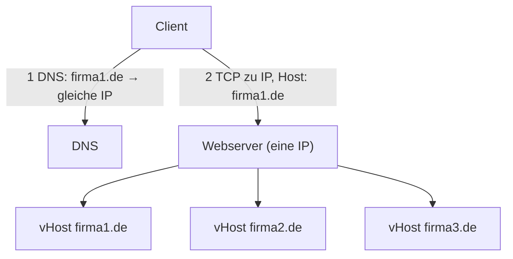

---

## TLS/SSL — Absicherung der Kommunikation

Kommunikation kann durch den Einsatz des **Secure-Socket-Layer-Protokolls (SSL)** abgesichert werden.

> [!quote] Definition — SSL/TLS
> SSL wurde von **Netscape** entwickelt und unter dem Namen **Transport Layer Security (TLS)** standardisiert (RFC 2246). TLS/SSL sichert die Transportschicht ab, Basis ist u.a. das **RSA-Verfahren**, und TLS/SSL ist **verbindungsorientiert**.

Das SSL-Protokoll hat **drei grundlegende Eigenschaften**:

1. **Vertraulichkeit (privacy):** Beim Verbindungsaufbau wird ein **Sitzungsschlüssel (Session Key)** bestimmt, der dann zur **symmetrischen** Verschlüsselung genutzt wird.
2. **Authentifikation:** Die (meist einseitige, optional beiderseitige) **Authentifikation** wird durch **asymmetrische** Verschlüsselung ermöglicht.
3. **Integrität:** Jede Nachricht wird durch einen **Hash** gegen Veränderungen abgesichert.

Diese drei entsprechen den klassischen TLS-Zielen **Authentication** (asymmetrisch), **Confidentiality** (symmetrisch) und **Integrity** (Message Authentication Code).

### Historie

| Version | Jahr (Published) | Herausgeber |
|---|---|---|
| SSL 2.0 | 1995 | Netscape (deprecated 2011) |
| SSL 3.0 | 1996 | Netscape (deprecated 2015) |
| TLS 1.0 | 1999 | IETF, RFC 2246 (deprecated 2020) |
| TLS 1.1 | 2006 | IETF, RFC 4346 (deprecated 2020) |
| TLS 1.2 | 2008 | IETF, RFC 5246 |
| TLS 1.3 | 2018 | IETF, RFC 8446 |

### SSL im ISO/OSI-Stack

> [!tip] Merke — Einordnung im Schichtenmodell
> SSL/TLS ist eine **transparente Schicht zwischen TCP/IP und Anwendung** — universell einsetzbar zur Verschlüsselung der Inhaltsdaten. Im OSI-Bild liegt es oberhalb von **Transport (TCP)** und unterhalb der Anwendung (**HTTP, SMTP, ...**), also im Bereich Session/Presentation. In der Praxis ist es faktisch in die Anwendung integriert und hat keine eigene „echte" Schicht.

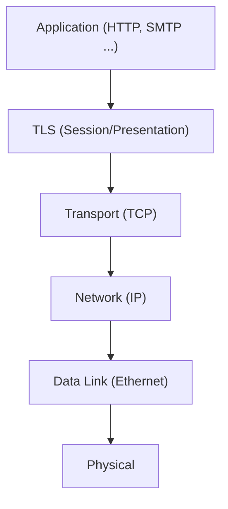

TLS besteht selbst aus zwei Teilen: dem **Handshake-Protokoll** (inkl. Alert, ChangeCipherSpec, Application) und dem **Record-Protokoll** (Fragmentation, Compression, Integrity, Authentication, Encryption).

---

## Zertifikate und Signaturen

Zur Authentifikation kommen **X.509-Zertifikate** zum Einsatz.

> [!quote] Definition — Zertifikat
> Ein **Zertifikat bindet einen öffentlichen Schlüssel an eine Identität**. Es wird von einer **Certification Authority (CA)** — dem Aussteller, der die Identität validiert hat — signiert.

Inhalt eines X.509-Zertifikats:

| Feld | Bedeutung |
|---|---|
| Versionsnummer, Seriennummer | Formale Angaben |
| **Signatur-Algorithmus** | Verwendeter Signaturalgorithmus |
| **Aussteller (Name)** | Der Aussteller, der die Identität validiert hat |
| **Gültigkeit** | Gültigkeitszeitraum |
| **Subject** | Die zu prüfende Identität |
| **SubjectPublicKeyInfo** | Der öffentliche Schlüssel des Subjects |
| **Signatur des Ausstellers** | Der Aussteller bestätigt die Zuordnung des Public Key |

Die **Signatur** funktioniert über einen **verschlüsselten Hash**: Über die Zertifikatsdaten wird ein Hash (z.B. **MD5**) gebildet und dieser **mit dem Private Key des Ausstellers** verschlüsselt. Die zugrunde liegende Idee der asymmetrischen Kryptografie:

> [!tip] Merke — asymmetrisches Grundprinzip
> `{{Klartext}private_key}public_key = Klartext`
> `{{Klartext}public_key}private_key = Klartext`
> Was mit dem einen Schlüssel verschlüsselt wurde, kann nur mit dem anderen entschlüsselt werden. Signieren = mit **Private Key** verschlüsseln; Prüfen = mit **Public Key** entschlüsseln.

### Einweg-Hash-Funktionen

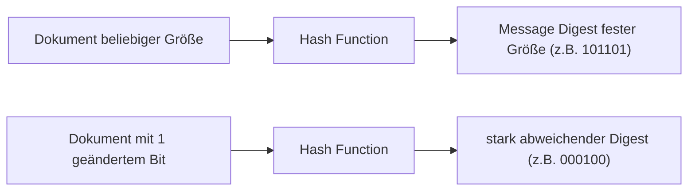

> [!tip] Merke — Avalanche-Effekt
> Die Änderung eines **einzelnen Bits** im Dokument sollte ungefähr **50 % der Hash-Bits** verändern. Der Message Digest hat immer **feste Größe**, unabhängig von der Dokumentgröße. Eine gute Hash-Funktion ist deterministisch, schnell, kollisionsarm und praktisch **irreversibel** (Einweg-Funktion).

---

## Der TLS-Handshake

> [!quote] Definition — Aufgaben des Handshake-Protokolls
> Das TLS-Handshake-Protokoll erledigt: (1) **Ermittlung des stärksten gemeinsam unterstützten Algorithmus**, (2) **optionale Authentifikation** der Kommunikationspartner (seltener wird auch der Client authentifiziert) mittels **Zertifikaten** (Zertifikatsketten bis zum selbst-signierten Root-Zertifikat), (3) **Bestimmung eines Session Keys** zur symmetrischen Verschlüsselung.

Mit der Fähigkeit, den Session Key abzuleiten, ist der **Nachweis der Kenntnis des Private Keys** erbracht. Ob damit die Authentizität gesichert ist, hängt vom **Vertrauen in die Zertifikatskette** ab.

### Klassischer Ablauf (vereinfacht, vor TLS 1.3)

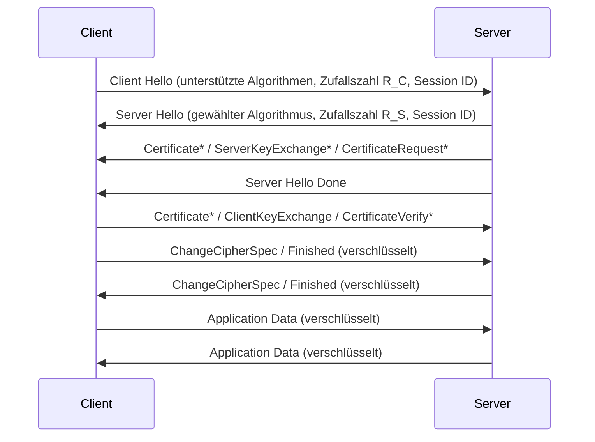

Schrittweise:

- **Client Hello:** unterstützte Algorithmen, Zufallszahl des Clients (`R_C`), **Session ID** (ermöglicht eine **Abkürzung des Handshakes** bei Wiederaufnahme).
- **Server Hello:** ausgewählter Algorithmus, Zufallszahl des Servers (`R_S`), Session ID.
- **Server Certificate:** das Server-Zertifikat (mit Signatur = optional, aber üblich).
- **Server Hello Done.**
- **Client Key Exchange:** nach Prüfung des Zertifikats wird **mit dem Public Key des Servers** die Basis des Session Keys verschlüsselt.
- **Optional:** Client-Zertifikat + mit Private Key verschlüsselte Zufallszahl (CertificateVerify).
- **Beiderseitiges `Finished`** (`ChangeCipherSpec` markiert den Umschalt-Punkt auf Verschlüsselung).

> [!info] Hinweis — mit `*` markierte Nachrichten
> `Certificate`, `ServerKeyExchange`, `CertificateRequest` (Server-Seite) sowie `Certificate` und `CertificateVerify` (Client-Seite) sind **optional**. Ab `Finished` (bzw. `ChangeCipherSpec`) ist der Verkehr verschlüsselt.

---

## Diffie-Hellman-Schlüsselaustausch

Wie erzeugen zwei Partner ein gemeinsames **Geheimnis** (den symmetrischen Schlüssel), **ohne** es über das Netz auszutauschen? Antwort: **Diffie-Hellman (DH)** bzw. dessen ephemere Variante ECDHE.

Öffentlich bekannt sind eine Basis `g` (public base) und ein Modul `p` (public modulus). Jede Seite hat einen privaten Wert (`a` bzw. `b`):

- Alice berechnet `A = g^a mod p` und sendet `A`.
- Bob berechnet `B = g^b mod p` und sendet `B`.
- Alice berechnet `S = B^a mod p = g^(ba) mod p`.
- Bob berechnet `S = A^b mod p = g^(ab) mod p`.
- Beide erhalten **dasselbe** `S`; via **HKDF** (Key Derivation Function auf HMAC-Basis) wird daraus ein Shared Secret gewünschter Länge abgeleitet.

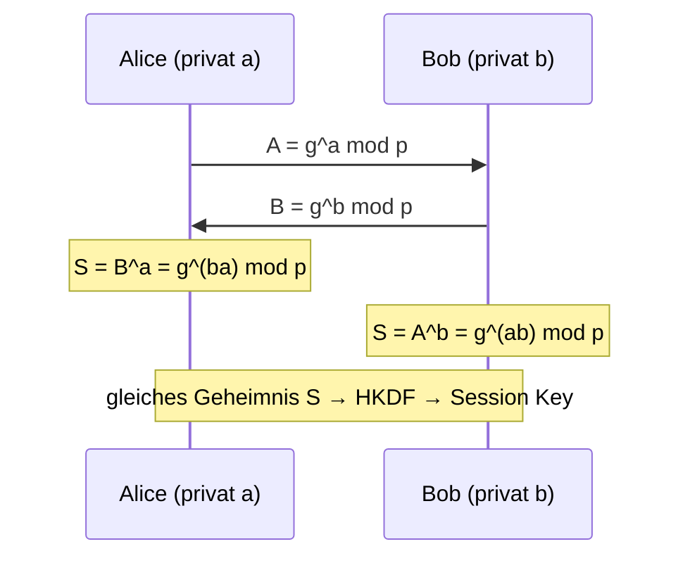

> [!tip] Merke — Sicherheit via Trapdoor
> DH ist eine **Trapdoor-Funktion**: Aus `a, p, g` ist `A = g^a mod p` leicht zu berechnen (schnell, `O(log a)`). Umgekehrt aus `A, p, g` den Exponenten `a` zu bestimmen, ist das **diskrete Logarithmusproblem** — praktisch nicht lösbar. Typische Größen: `p` = 2048-Bit-Primzahl, `a, b` = 256-Bit-Zufallszahlen, `g` = primitive Wurzel modulo `p`.

---

## TLS Record Layer und QUIC

Das **Record-Protokoll** ist vollständig **getrennt** vom Handshake-Protokoll:

- Es verschickt Daten **symmetrisch** mit dem im Handshake ausgehandelten Verschlüsselungsalgorithmus und dem symmetrischen **Session Key**.
- Es bildet zu jedem Datenblock einen **Hash (Message Digest)** zur Sicherung der **Integrität**.

> [!info] Hinweis — QUIC verbirgt mehr
> Bei klassischem **HTTP über TLS + TCP** liegen TCP-Header-Felder (Ports, Sequenznummern, Flags, ...) und der TLS-Record-Header offen. **QUIC** (Basis von HTTP/3, über UDP) verschlüsselt deutlich mehr des Transportverhaltens — sichtbar bleiben im Wesentlichen nur Ports, Länge, Checksumme und die Connection ID.

---

## FTP — File Transfer Protocol

> [!quote] Definition — FTP
> **FTP** ist der Internet-Standard für die **Übertragung von (kompletten) Dateien** von einem Rechner auf einen anderen.

Neben dem reinen File-Transfer bietet FTP:
- **Interaktiven Zugriff** (z.B. Verzeichniswechsel),
- **Format-Spezifikation** (Binär- oder Textdateien, ASCII- oder EBCDIC-Code),
- **Authentifizierung** (ursprünglich nur Login-Name + Passwort, nicht empfehlenswert; es gibt Varianten mit verbesserter Authentifikation).

### Das Besondere: zwei Verbindungen

> [!tip] Merke — Steuer- und Datenkanal getrennt
> FTP nutzt **zwei TCP-Verbindungen**: einen eher **interaktiven Kontrollkanal** (Server-**Port 21**) und einen **durchsatzoptimierten Transferkanal** (Server-**Port 20** im Active Mode). Weil die Datenverbindung separat ist, kann sie über verbesserte Parameter (z.B. **WSCALE-Option**) verfügen.

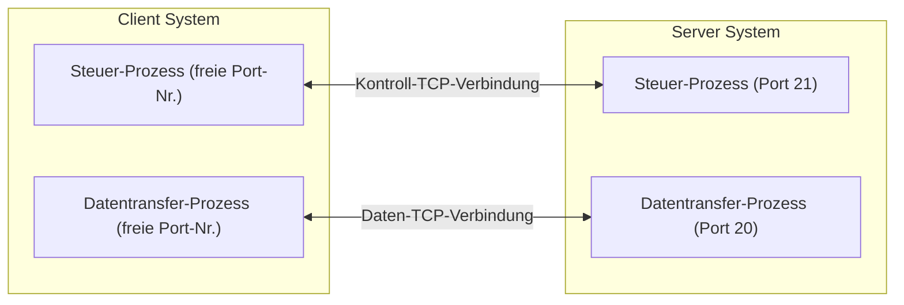

### Active vs. Passive Mode

Es gibt **zwei Arten**, die Datenverbindung zu öffnen:

| Modus | Ablauf | Kommando |
|---|---|---|
| **Active Mode** | Der **Client** horcht auf einem zufälligen Port und teilt ihn dem Server mit; der **Server** (Port 20) verbindet sich **aktiv zurück** zum Client. | `PORT` |
| **Passive Mode** | Der **Server** öffnet einen Port und teilt ihn dem Client mit; der **Client** verbindet sich zum Server. Vorteil: funktioniert auch, wenn der Client hinter **NAT/Firewalls** steht. | `PASV` |

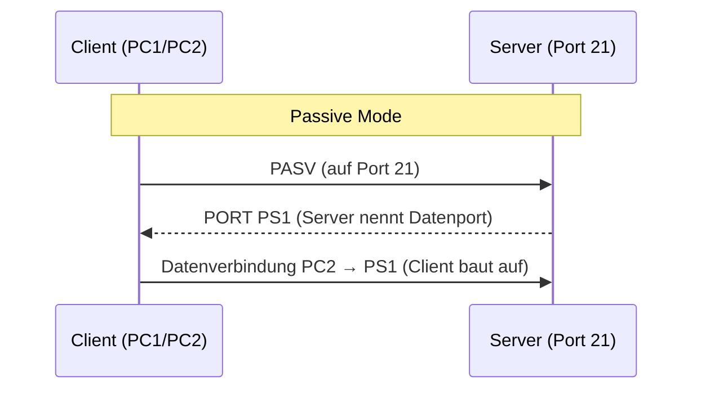

> [!warning] Achtung — Active Mode im Heimnetz
> Im **Active Mode** verbindet sich der Server aktiv zurück zum Client. Hinter **NAT/Firewall** wird diese eingehende Verbindung typischerweise **blockiert** — deshalb gibt es im typischen Heimnetzwerk Probleme mit Active FTP. Der **Passive Mode** löst das, da der Client beide Verbindungen aufbaut.

### Wichtige FTP-Befehle

| Kommando | Wirkung |
|---|---|
| `open` / `disconnect` | Verbinden zum / Beenden der FTP-Sitzung |
| `user` | Benutzerinformationen nach dem Verbinden senden |
| `cd` / `lcd` | Verzeichnis wechseln auf entferntem / eigenem Rechner |
| `pwd` | Arbeitsverzeichnis des entfernten Rechners ausgeben |
| `get`/`mget`, `put`/`mput` | Dokument(e) empfangen / senden |
| `binary` / `ascii` | Übertragungsmodus setzen |
| `dir`/`ls` | Inhalt des entfernten Verzeichnisses auflisten |
| `delete`, `help`, `bye` | Datei löschen, Hilfe, Sitzung beenden |

> [!warning] Achtung — „einfaches" FTP heute vermeiden
> Bei klassischem FTP werden **Zugangsdaten und Daten unverschlüsselt** übertragen und können leicht mitgelesen oder manipuliert werden. Heute stattdessen FTPS/SFTP nutzen oder FTP über einen SSH-Tunnel absichern.

---

## TFTP — Trivial File Transfer Protocol

> [!quote] Definition — TFTP
> **TFTP** ist ein sehr **einfaches** Protokoll für den File-Transfer (z.B. für EEPROM/Bootvorgänge). Es läuft über **Port 69** und benutzt **UDP** (nicht TCP), hat **keine Authentifizierung** und verwendet immer **512-Byte-Blöcke**.

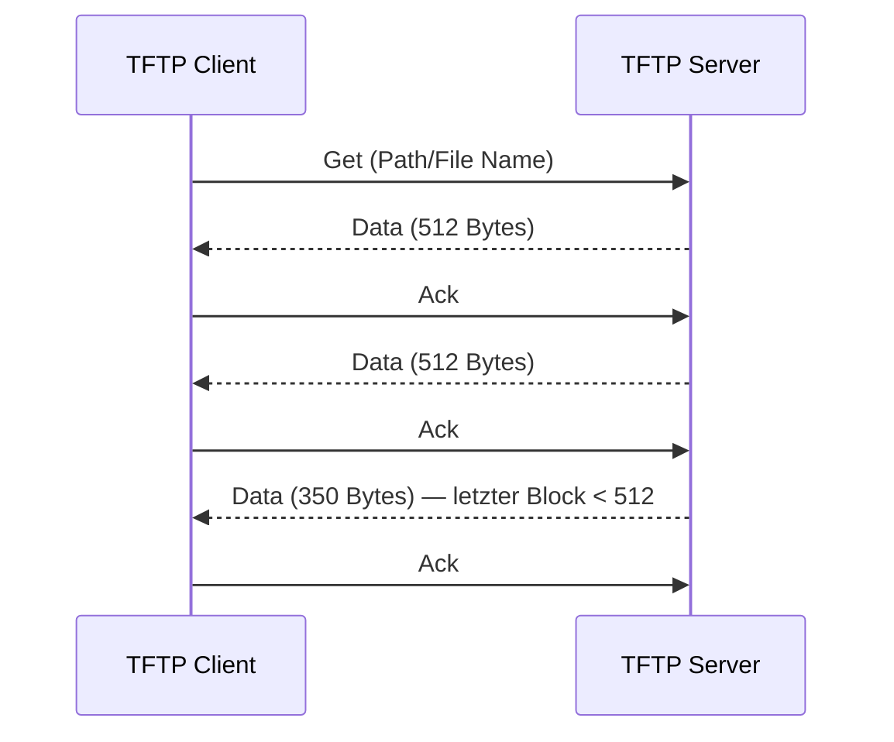

Jeder Datenblock wird einzeln mit einem **Ack** quittiert (Stop-and-Wait, mit Timeout-Wiederholung). Ein Block **kleiner als 512 Byte** signalisiert das Ende der Übertragung.

---

## E-Mail — Grundarchitektur

Ein E-Mail-System besteht aus zwei Subsystemen:

> [!quote] Definition — UA und MTA
> **User Agent (UA):** das E-Mail-Programm auf dem Rechner des Benutzers — Erstellen, Beantworten, Empfangen, Anzeigen und Verwalten von E-Mails.
> **Message Transfer Agent (MTA, Mailserver, Mailrelay):** läuft rund um die Uhr im Hintergrund — **Zustellung** der vom UA losgeschickten Mails und **Zwischenspeicherung** für andere User oder MTAs.

Zum **Verschicken** dient das **Simple Mail Transfer Protocol (SMTP)**.

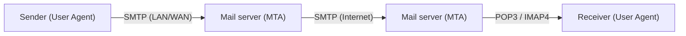

> [!tip] Merke — Rolle des DNS
> Der **DNS Mail-Exchange-Record (MX)** teilt dem sendenden Mail-Server mit, welcher Mailserver für die **Zieldomäne** zuständig ist.

---

## E-Mail-Formate und Header

Zum Verschicken macht der Benutzer folgende Angaben: die **Nachricht** (Text + Attachments), die **Zieladresse** (`mailbox@location`, z.B. `v.sander@fh-aachen.de`) und evtl. zusätzliche Parameter (Priorität, Sicherheit).

Zwei verbreitete Formate:
- **RFC 822** (ARPA Internet Text Messages): Die E-Mail besteht aus einem einfachen **„Umschlag"** (vom MTA anhand der Header-Daten erstellt), einer Reihe von **Header-Feldern** (je eine Zeile ASCII), einer **Leerzeile** und der eigentlichen **Nachricht (Message Body)**.
- **MIME** (Multipurpose Internet Mail Extensions).

### Wichtige RFC-822-Header

| Header | Bedeutung |
|---|---|
| `To:` | Hauptempfänger (evtl. mehrere / Verteilerliste) |
| `Cc:` | Carbon Copy — weniger wichtige Empfänger |
| `Bcc:` | Blind Carbon Copy — Empfänger, die anderen **nicht** angezeigt werden |
| `From:` | Person, die die Nachricht generiert hat |
| `Sender:` | Adresse des eigentlichen Senders (evtl. ≠ „From-Person") |
| `Received:` | Je ein Eintrag pro MTA auf dem Weg zum Ziel |
| `Return-Path:` | Pfad zurück zum Sender |
| `Date:` | Sende-Datum und -Uhrzeit |
| `Reply-To:` | Adresse, an die Antworten gerichtet werden sollen |
| `Message-Id:` | Eindeutige Nummer der E-Mail |
| `In-Reply-To:` / `References:` | Message-Id(s), auf die geantwortet wurde |
| `Subject:` | Einzeilige Angabe des Inhalts |

### Warum MIME?

RFC 822 (bzw. 2822) ist **nur für reinen ASCII-Text ohne Sonderzeichen** geeignet. Heute zusätzlich gefordert: Sprachen mit Sonderzeichen (deutsch, französisch), nicht-lateinische Alphabete (russisch), Sprachen ohne Alphabet (japanisch) sowie Nachrichten ohne Text (Audio, Video).

> [!tip] Merke — was MIME macht
> **MIME behält das RFC-2822-Format bei**, definiert aber zusätzlich eine **Struktur im Message Body** (durch zusätzliche Header) und **Kodierungsregeln für Nicht-ASCII-Zeichen**. Der konkrete Ablauf ist in RFC **2045 (MIME)** und RFC **2821 (SMTP)** spezifiziert.

### MIME-Ablauf

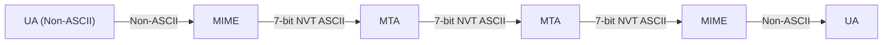

Der UA erzeugt Non-ASCII-Inhalt, MIME kodiert ihn in **7-bit NVT ASCII** für den Transport über die MTAs; auf der Empfängerseite dekodiert MIME wieder zurück.

---

## SMTP, POP3 und IMAP

### SMTP (Versenden)

> [!quote] Definition — SMTP
> **SMTP** versendet E-Mails über eine **TCP-Verbindung (Port 25)**. Es ist ein einfaches **ASCII-Protokoll**, **ohne Prüfsummen und ohne Verschlüsselung**. Ist der Server empfangsbereit, signalisiert er das; der Client sendet Absender und Empfänger, und bei bekanntem Empfänger die Nachricht, die der Server bestätigt.

```mermaid
sequenceDiagram
    participant C as Client (sendender MTA)
    participant S as Server (empfangender MTA)
    S->>C: 220 <beta.edu> Service Ready
    C->>S: HELO <abc.com>
    S->>C: 250 <beta.edu> OK
    C->>S: MAIL FROM:<Krogull@abc.com>
    S->>C: 250 OK
    C->>S: RCPT TO:<Bolke@beta.edu>
    S->>C: 250 OK
    C->>S: DATA
    S->>C: 354 Start mail input; end with <crlf>.<crlf>
    C->>S: (Nachricht) ... <crlf>.<crlf>
    S->>C: 250 OK
    C->>S: QUIT
    S->>C: 221 <beta.edu> Server Closing
```

> [!warning] Achtung — SMTP ist unsicher
> Ohne TLS und Zusatzmechanismen läuft SMTP im **Klartext**, ist leicht **spoofbar** und bietet weder Vertraulichkeit noch starke Authentisierung.

### POP3 vs. IMAP (Abrufen)

| Merkmal | **POP3** (Port 110) | **IMAP** (RFC 3501) |
|---|---|---|
| Speicherort | Mails werden **abgeholt** und lokal gespeichert | Mails **verbleiben auf dem Server** |
| Grundidee | An-/Abmelden, herunterladen, auf Server löschen oder liegen lassen | Zugriff auf Server-Verzeichnisse wie auf lokale Verzeichnisse |
| Funktionsumfang | einfach | komplexer: Ordner erstellen/umbenennen/löschen, Flags setzen/löschen, Mails suchen |
| Datenmenge | ganze Nachrichten | reduziert — zunächst nur **Nachrichten-Header** |
| Offline | begrenzt | Offline-Betrieb und Resynchronisation möglich |

> [!tip] Merke
> **Mit IMAP verbleiben die E-Mails auf dem Server** und alle Aktionen führt der Client dort aus — im Gegensatz zu POP3, bei dem üblicherweise heruntergeladen (und ggf. serverseitig gelöscht) wird.

---

## Telnet, rlogin/rsh und SSH

### Telnet

TCP ermöglicht den transparenten, interaktiven Gebrauch **entfernter** Maschinen. Das verbreitete (heute veraltete) Protokoll **TELNET** basiert auf Client/Server: Ein **Pseudo-Terminal** des Servers interpretiert Zeichen, als kämen sie von der eigenen Tastatur; die Serverantwort geht den umgekehrten Weg zurück an den Client.

> [!warning] Achtung — Telnet überträgt Klartext
> Bei Telnet werden **Benutzername und Passwort unverschlüsselt** übertragen. Sinnvoll ist Telnet heute höchstens noch zum **einfachen Testen textbasierter TCP-Dienste** (z.B. im Praktikum manuell einen SMTP-/HTTP-Dialog tippen).

### rlogin und rsh (früher unter Unix)

- **rlogin:** flexible Alternative; **Trusted Hosts** können sich Login-Name und Zugriffsrechte teilen — auf einem Trusted Host entfällt die **Passwortabfrage**. Umgebungsvariablen (z.B. Terminaltyp) werden automatisch übertragen.
- **rsh:** Variante von rlogin, um einzelne Kommandos auf der Remote-Maschine auszuführen (`rsh machine command`) — durch automatische Authentifizierung auch aus Programmen heraus nutzbar.

### SSH

> [!success] Best Practice — SSH statt Telnet/rlogin
> **SSH** adressiert die Sicherheitsprobleme von Telnet und rlogin: eine **sichere Verbindung** zwischen zwei Systemen, bei der alle Daten (128-Bit-)**verschlüsselt** übertragen werden. SSH ist heute das Mittel der Wahl zum Login auf entfernten Rechnern.

SSH unterstützt verschiedene **Authentisierungsarten**:
- **hostbased:** ein Rechner akzeptiert ohne eigene account-spezifische Tests die Vorgaben eines fremden Rechners (nur dessen Identität wird geprüft).
- **Passwort:** das Passwort wird **verschlüsselt** übertragen.
- **Public-Key-Verfahren:** der **Private Key** verbleibt auf dem eigenen Rechner, der **Public Key** wird auf dem Server hinterlegt (einmalige Anmeldung mit Passwort nötig, um den Key zu hinterlegen). Danach ist kein Passwort mehr nötig.

### SSH als Proxy: Port-Forwarding

> [!tip] Merke — sicherer Tunnel zu beliebigem TCP-Port
> **Port-Forwarding** erzeugt eine verschlüsselte Verbindung zwischen zwei beliebigen Ports (auch ohne Shell): ein lokaler Port führt direkt auf den Zielport, als wäre dieser lokal. Einsatz u.a.: FTP-Kommando-Port tunneln, POP3/SMTP absichern, X-Window-Verkehr absichern.

- `ssh -L port:zielHost:zielPort <Rechner>` — leitet `localhost:port` via `Rechner` zu `zielHost:zielPort` (**Local Forwarding**).
- `ssh -R port:zielHost:zielPort <Rechner>` — leitet `Rechner:port` via `localhost` zu `zielHost:zielPort` (**Remote Forwarding**).

Zusätzlich gibt es dynamisches Forwarding (SOCKS-Proxy) — das Prinzip bleibt: verschlüsselter Tunnel über SSH.

---

## SNMP — Netzwerkmanagement

Die Objekte des Internet-Managements sind Rechner und **vor allem Router**. Ähnlich wie bei SMTP wird das Management durch **zwei unabhängige standardisierte Teilbereiche** beschrieben:

> [!quote] Definition — SNMP und MIB
> **SNMP** (Simple Network Management Protocol) legt fest, **wie** Management-Information kommuniziert wird (Formate und Bedeutung der Nachrichten). Die **MIB** (Management Information Base) ist die **Spezifikation der Daten** — sie legt die Informationseinheiten (*items*) fest, die vorgehalten werden müssen, und welche Operationen darauf erlaubt sind.

Das Management arbeitet nach dem **Client/Server-Prinzip**:

> [!tip] Merke — Agent und Manager
> In jedem verwalteten Objekt (v.a. Router) läuft ein **SNMP-Agent** (Software-Prozess), der die in der MIB spezifizierten Informationen sammelt (z.B. Anzahl eingegangener/verlorener Pakete), einem Client zur Verfügung stellt und Kommandos entgegennimmt. Der **Manager** (Software-Prozess) kommuniziert mit den Agenten. **SNMP verwendet UDP.** Für Management-Funktionen ist eine **Authentifizierung** erforderlich.

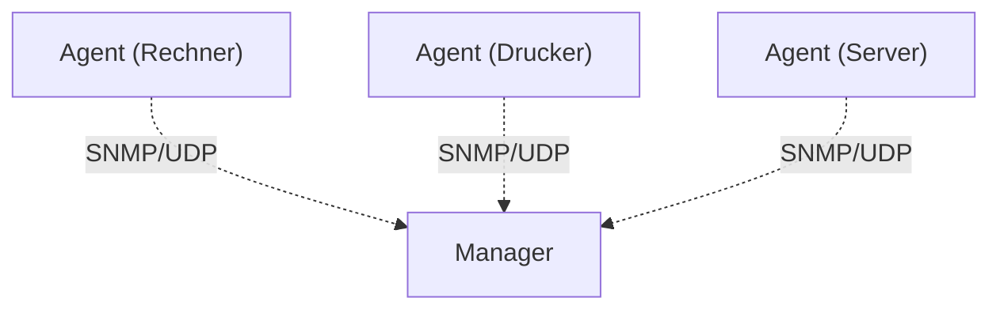

---

## Fragen zur Selbstkontrolle

Die kompakten Karteikarten finden sich unter [[kommunikationssysteme/selbstkontrolle/komsys-selbstkontrolle-08|Selbstkontrolle 8]].

**Was ist MIME? Warum wird es benötigt? Nennen Sie wichtige Attribute, die hier gesetzt werden.**

MIME (Multipurpose Internet Mail Extensions) erweitert textbasierte Internet-Nachrichten (E-Mail, aber auch HTTP-Antworten) um **Typinformationen und Kodierungen für Nicht-reinen-ASCII-Inhalt**. Es wird benötigt, weil HTTP und E-Mail textbasiert konzipiert wurden, aber auch **Binärdaten** (Bilder, Audio, Video) sowie Sonderzeichen und nicht-lateinische Alphabete übertragen werden sollen. MIME behält das RFC-2822-Format bei und ergänzt eine Struktur im Message Body sowie Kodierungsregeln. Wichtige Header: **`MIME-Version`**, **`Content-Type`** (`type/subtype`, z.B. `text/html`, `image/jpeg`, `multipart/mixed`; bei `multipart` mit **`BOUNDARY`**/Charset), **`Content-Transfer-Encoding`** (z.B. `base64`, `quoted-printable`), **`Content-Id`** und **`Content-Description`**.

**Erklären Sie das Konzept von 'Virtual Hosts' bei HTTP.**

Auf einem Rechner mit **einer** IP-Adresse werden mehrere Websites/Domains bereitgestellt (typisch: Web-Hosting beim Provider). Da die FQDN→IP-Auflösung **nicht injektiv** ist, gehen nach der DNS-Auflösung viele Domänen an dieselbe IP — und die Information, welche Site eigentlich gemeint war, geht verloren. Die **Anwendungsebene liefert sie erneut mit**: bei HTTP über den **`Host`-Header**, bei HTTPS zusätzlich über **SNI (Server Name Indication)**. Anhand dieser Angabe wählt der Server die passende (virtuelle) Host-Konfiguration.

**Wo ist der SSL-Layer im ISO/OSI- oder Internet-Schichtenmodell angesiedelt?**

SSL/TLS ist eine **transparente Schicht zwischen Transport (TCP) und Anwendung**, also oberhalb von TCP und unterhalb von HTTP, SMTP usw. Im OSI-Bild liegt es im Bereich Session/Presentation; faktisch ist es in die Anwendung integriert und universell zur Verschlüsselung der Inhaltsdaten einsetzbar.

**Erklären Sie die Unterschiede/Vorteile/Nachteile von symmetrischer und asymmetrischer Verschlüsselung.**

**Symmetrisch** (ein gemeinsamer Schlüssel): schnell und gut für große Datenmengen (bei TLS: die eigentliche Nutzdaten-Verschlüsselung im Record Layer mit dem Session Key), benötigt aber einen **sicheren Schlüsselaustausch**. **Asymmetrisch** (Schlüsselpaar Public/Private): erleichtert **Authentifikation** (Signaturen, Zertifikate) und **Schlüsselverteilung**, ist aber deutlich **langsamer**. TLS kombiniert beides: asymmetrisch zum Authentifizieren und Aushandeln, symmetrisch zum Übertragen der Nutzdaten.

**Was ist ein Zertifikat? Wer stellt es aus, und welche Informationen enthält es?**

Ein Zertifikat (X.509) **bindet einen öffentlichen Schlüssel an eine Identität**. Ausgestellt und **signiert** wird es von einer **Certification Authority (CA)**, die die Identität validiert hat. Es enthält u.a.: Versions- und Seriennummer, **Signatur-Algorithmus**, **Aussteller**, **Gültigkeit**, **Subject** (zu prüfende Identität), **SubjectPublicKeyInfo** (der Public Key) sowie die **Signatur des Ausstellers** (ein mit dem Private Key der CA verschlüsselter Hash über die Zertifikatsdaten).

**Welche Eigenschaften hat eine Hash-Funktion? Wo wird sie im Kontext der Verschlüsselung eingesetzt?**

Eine (kryptografische) Hash-Funktion ist **deterministisch, schnell, kollisionsarm und praktisch irreversibel** (Einweg-Funktion) und liefert einen Message Digest **fester Größe**. Zudem gilt der Avalanche-Effekt: die Änderung eines einzelnen Bits verändert ca. 50 % der Hash-Bits. Eingesetzt wird sie für **Integrität** (Message Digest je Datenblock im TLS Record Layer), **Signaturen und Zertifikate** (verschlüsselter Hash), Passwortspeicherung und MAC/HMAC.

**Wie kann man bei 2 Kommunikationspartnern ein 'Geheimnis' erzeugen, ohne es über das Netz auszutauschen?**

Mit einem **Schlüsselaustauschverfahren wie Diffie-Hellman** (bzw. ephemer ECDHE). Bei öffentlich bekanntem `g` und `p` sendet jede Seite `g^(privat) mod p`; durch Potenzieren mit dem eigenen privaten Wert erhalten beide dasselbe `S = g^(ab) mod p`, aus dem (z.B. per HKDF) der symmetrische Session Key abgeleitet wird. Das eigentliche Geheimnis (`a`, `b`, `S`) wird nie übertragen; die Sicherheit beruht auf dem **diskreten Logarithmusproblem** (Trapdoor).

**Welche Aufgaben hat das SSL-Handshake-Protokoll und das SSL-Record-Protokoll?**

Der **Handshake** handelt den stärksten gemeinsam unterstützten **Algorithmus** aus, **authentifiziert** die Parteien (meist den Server per Zertifikat, optional den Client) und legt den **Session Key** fest. Das **Record-Protokoll** ist davon vollständig getrennt und überträgt danach die **Nutzdaten**: symmetrisch verschlüsselt mit dem Session Key und je Datenblock durch einen **Hash (Message Digest)** integritätsgeschützt.

**Erklären Sie den Handshake.**

Client und Server tauschen `Client Hello` (unterstützte Algorithmen, Zufallszahl `R_C`, Session ID) und `Server Hello` (gewählter Algorithmus, `R_S`, Session ID) aus. Der Server sendet sein **Zertifikat** (und ggf. ServerKeyExchange/CertificateRequest) und `Server Hello Done`. Der Client prüft das Zertifikat und verschlüsselt mit dem **Public Key des Servers** die Basis des Session Keys (`Client Key Exchange`); optional folgt ein Client-Zertifikat + CertificateVerify. Nach `ChangeCipherSpec` senden beide ein verschlüsseltes `Finished`; danach fließen **Application Data** verschlüsselt. Die Session ID erlaubt eine spätere **Abkürzung** des Handshakes.

**Warum ist das FTP-Protokoll so besonders? Welche Vorteile hat das Vorgehen?**

FTP **trennt Steuer- und Datenverbindung** in zwei TCP-Verbindungen: einen interaktiven **Kontrollkanal (Port 21)** und einen durchsatzoptimierten **Transferkanal (Port 20)**. Vorteil: klare Kommandosteuerung neben getrennten Datenkanälen, und die Datenverbindung kann eigene, verbesserte Parameter (z.B. WSCALE) nutzen. Nachteil: das Protokoll wird komplexer (und macht Probleme mit NAT/Firewalls).

**Warum sollte 'einfaches' FTP heute nicht mehr verwendet werden?**

Weil **Zugangsdaten und Nutzdaten unverschlüsselt** (Klartext) übertragen werden und daher leicht mitgelesen oder manipuliert werden können. Heute nutzt man verschlüsselte Varianten (FTPS/SFTP) oder tunnelt FTP über SSH.

**Warum gibt es in einem typischen Heimnetzwerk Probleme mit dem FTP 'Active' Mode?**

Im Active Mode baut der **Server** die Datenverbindung **aktiv zum Client zurück** auf (von Port 20 zu einem vom Client genannten Port). Hinter **NAT und Firewall** werden solche eingehenden Verbindungen zum Client typischerweise blockiert. Der **Passive Mode** (PASV) umgeht das, weil dann der Client beide Verbindungen aufbaut.

**Welches Protokoll wird zum Versenden von E-Mails verwendet? Was passiert konkret, und wie ist das DNS beteiligt?**

Zum Versenden dient **SMTP** (TCP, Port 25). Der sendende MTA baut die Verbindung auf; nach `220`/`HELO` folgen `MAIL FROM`, `RCPT TO`, `DATA` (Nachricht endet mit `<crlf>.<crlf>`) und `QUIT`, jeweils mit Statuscodes (`250 OK` usw.) bestätigt. Das **DNS** liefert dabei über den **MX-Record** der Zieldomäne den zuständigen Mailserver, an den die Mail übergeben wird.

**Warum ist einfaches SMTP unsicher?**

Weil SMTP ein einfaches ASCII-Protokoll **ohne Prüfsummen und ohne Verschlüsselung** ist. Ohne TLS und Zusatzmechanismen läuft es im **Klartext**, ist leicht **spoofbar** und bietet weder Vertraulichkeit noch starke Authentisierung.

**Wozu dient das (veraltete) TELNET-Protokoll? Wozu kann es (z.B. im Praktikum) sinnvoll eingesetzt werden?**

Telnet bietet **interaktive Terminal-Sitzungen** auf entfernten Maschinen über ein Pseudo-Terminal. Da Benutzername und Passwort **unverschlüsselt** übertragen werden, ist es heute unsicher. Sinnvoll ist es noch zum **einfachen Testen textbasierter TCP-Dienste** — man kann z.B. den SMTP- oder HTTP-Dialog von Hand eintippen.

**Welches Protokoll sollte heute zum Login auf entfernten Rechnern verwendet werden?**

**SSH** — es erstellt eine sichere, verschlüsselte Verbindung und löst die Klartext-Probleme von Telnet und rlogin.

**Wie kann man einen sicheren 'Tunnel' zu/von einem beliebigen (TCP-)Port einrichten?**

Mit **SSH Port-Forwarding**: eine verschlüsselte Verbindung zwischen zwei beliebigen Ports, auch ohne Shell. `ssh -L port:zielHost:zielPort <Rechner>` (Local Forwarding) leitet `localhost:port` über den Rechner zum Ziel; `ssh -R ...` (Remote Forwarding) den umgekehrten Weg; zusätzlich existiert dynamisches Forwarding. So lassen sich z.B. FTP-Kommandoport, POP3/SMTP oder X-Window absichern.

**Wozu wird SNMP verwendet? Welches Transportprotokoll verwendet es? Was ist ein SNMP-Agent und eine MIB?**

**SNMP** dient dem **Monitoring und Management** von Netzgeräten (v.a. Router) nach dem Client/Server-Prinzip und nutzt als Transport meist **UDP**. Ein **SNMP-Agent** ist ein Software-Prozess auf dem verwalteten Gerät, der die Managementinformationen sammelt (z.B. Anzahl eingegangener/verlorener Pakete), einem Manager bereitstellt und Kommandos entgegennimmt. Die **MIB (Management Information Base)** ist die Spezifikation der Daten: sie legt die verwalteten Objekte (items/OIDs) und die darauf erlaubten Operationen fest. Für Management-Funktionen ist eine Authentifizierung erforderlich.
