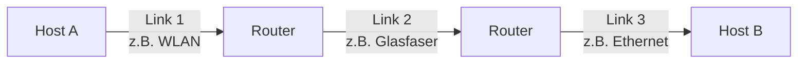
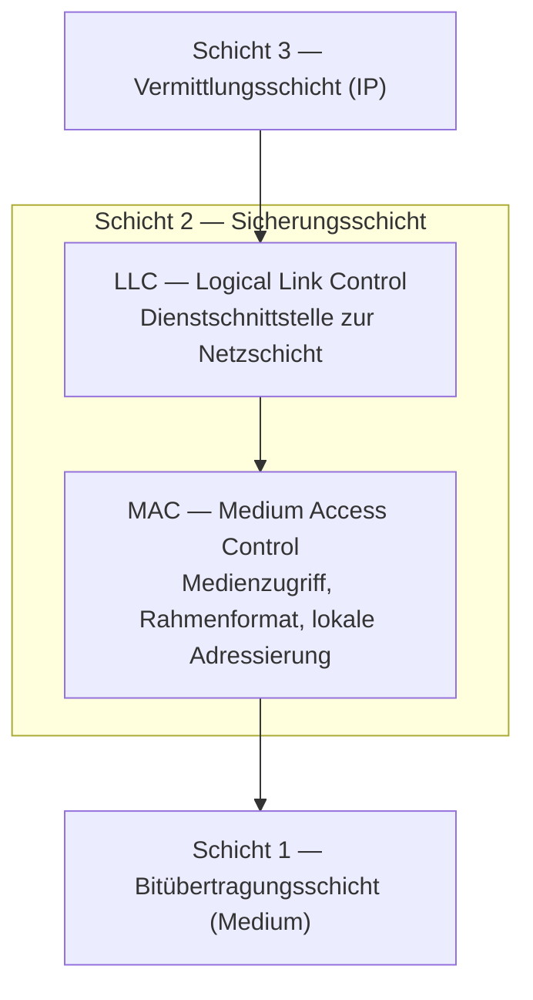
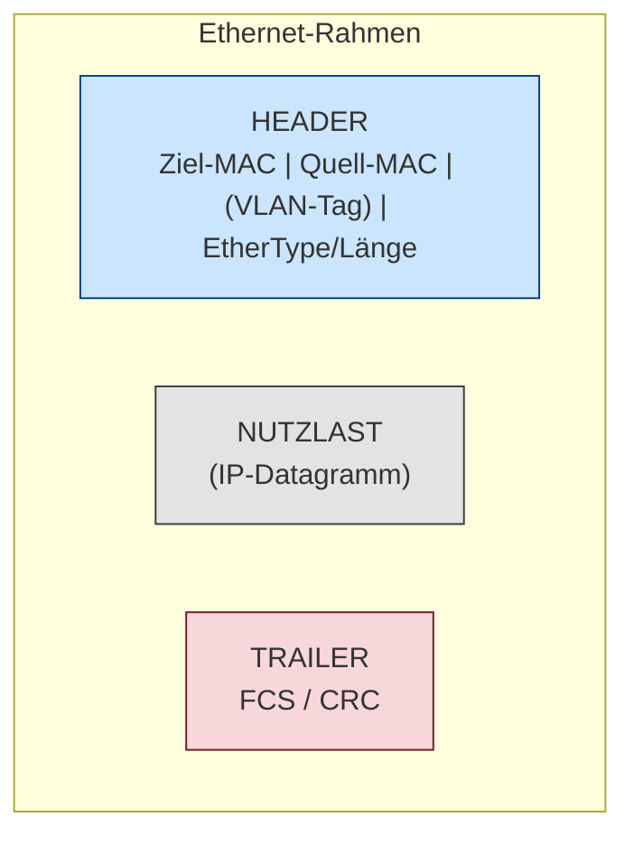
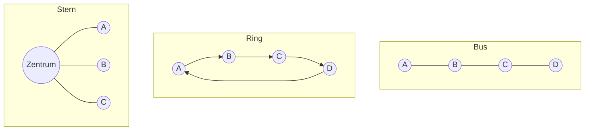
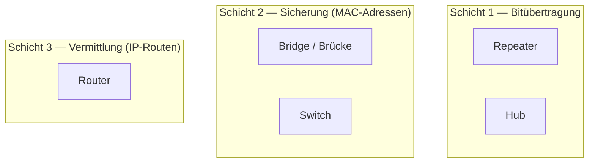
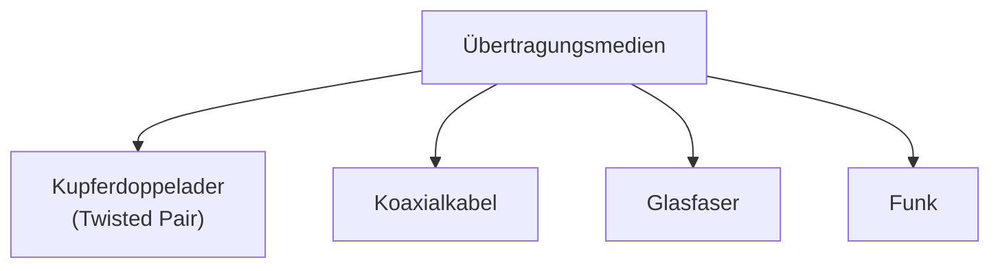
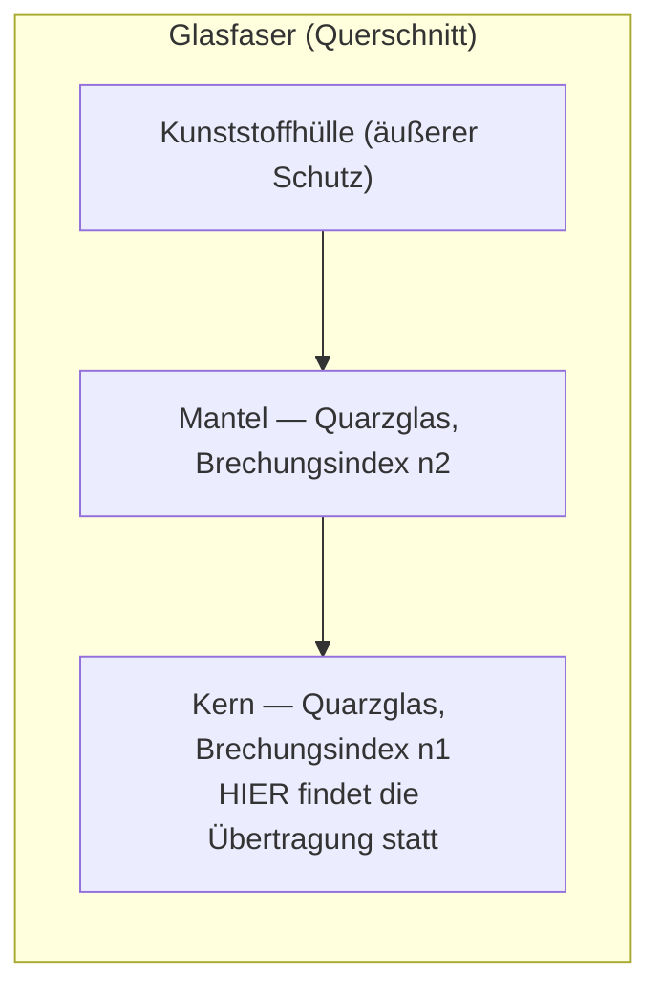
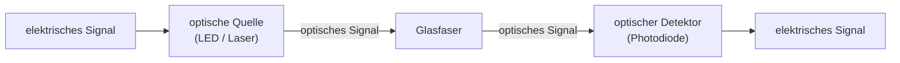

# 16 — Einführung Sicherungsschicht & Netztechnik

**Folien:** [[kommunikationssysteme/resources/Kommunikationssysteme_16_Einfuehrung_Sicherungsschicht_Netztechnik.pdf|Kommunikationssysteme_16_Einfuehrung_Sicherungsschicht_Netztechnik.pdf]]
**Selbstkontrolle:** [[kommunikationssysteme/selbstkontrolle/komsys-selbstkontrolle-09|Selbstkontrolle 9]]

## Inhaltsverzeichnis

- [[#Die Sicherungsschicht (Link-Layer)|Die Sicherungsschicht (Link-Layer)]]
- [[#Die zwei Sublayer: LLC und MAC|Die zwei Sublayer: LLC und MAC]]
- [[#Dienste der Sicherungsschicht|Dienste der Sicherungsschicht]]
- [[#Der Rahmen: Header und Trailer (Ethernet)|Der Rahmen: Header und Trailer (Ethernet)]]
- [[#Verbindung von Rechnern|Verbindung von Rechnern]]
- [[#Netztopologien|Netztopologien]]
- [[#Netzinfrastruktur und Segmentierung|Netzinfrastruktur und Segmentierung]]
- [[#Infrastrukturkomponenten|Infrastrukturkomponenten]]
- [[#Übertragungsmedien im Überblick|Übertragungsmedien im Überblick]]
- [[#Kupferdoppelader (Twisted Pair)|Kupferdoppelader (Twisted Pair)]]
- [[#Koaxialkabel|Koaxialkabel]]
- [[#Glasfaser|Glasfaser]]
- [[#Fragen zur Selbstkontrolle|Fragen zur Selbstkontrolle]]

---

## Die Sicherungsschicht (Link-Layer)

> [!quote] Definition
> Die **Sicherungsschicht** (Data-Link Layer, Schicht 2 im ISO/OSI-Modell) hat die Aufgabe, die **Datagramme über das gemeinsame Kommunikationsmedium zu einem anderen (benachbarten) Knoten zu transportieren**.

- Es handelt sich um die **direkte Kommunikation innerhalb einer Netzwerktechnologie** — also von Knoten zu Knoten über einen einzelnen „Link".
- Ein **„Link"** ist ein einzelner Kommunikationsabschnitt zwischen zwei direkt verbundenen Knoten (z.B. Rechner ↔ Router, Router ↔ Router). Der Gesamtweg durch das Internet setzt sich aus vielen solcher Links unterschiedlicher Netzwerktechnologien zusammen.
- Während die Vermittlungsschicht (Schicht 3) das Datagramm **Ende-zu-Ende** über viele Netze routet, kümmert sich die Sicherungsschicht nur um den nächsten **Hop** über ein konkretes Medium.

---

## Die zwei Sublayer: LLC und MAC

Die Sicherungsschicht wird konzeptionell in **zwei Teilschichten (Sublayer)** aufgeteilt:

| Sublayer | Aufgabe |
|---|---|
| **LLC** (Logical Link Control) | Stellt den **Dienst zur Netzschicht** bereit — die einheitliche, medienunabhängige Schnittstelle nach oben (z.B. Flusskontrolle, Fehlerkontrolle, Multiplexen der Netzprotokolle). |
| **MAC** (Medium Access Control) | Regelt den **Medienzugriff** (wer darf wann senden?), definiert das **Rahmenformat** (Framing) und die **lokale Adressierung** über **MAC-Adressen**. |

> [!tip] Merke
> Der **MAC-Sublayer** ist besonders wichtig bei **geteilten Medien** (Broadcast-Netzen), wo mehrere Stationen sich eine Leitung teilen und der Zugriff koordiniert werden muss.

---

## Dienste der Sicherungsschicht

### Framing und Kanalzuteilung

- Fast alle Sicherungsschichten **verkapseln** die Datagramme der Vermittlungsschicht vor der Übertragung in einen **Rahmen (Frame)**.
- Der Rahmen bettet das Datagramm in **Header und Trailer** ein (ggf. mehrere Felder), z.B. um im **Trailer Fehlerkorrekturbits** zu platzieren oder um **Anfang und Ende** zu synchronisieren.
- Das **Kanalzugriffsprotokoll** beschreibt, nach welchen Regeln ein Rahmen auf der Verbindungsleitung übertragen wird:
  - **Punkt-zu-Punkt-Verbindung:** einfaches Zugriffsprotokoll — der Sender darf senden, wann immer die Leitung nicht bereits benutzt wird (**Full-Duplex**).
  - **Mehrfachzugriffsprotokoll:** mehrere Teilnehmer teilen sich eine Leitung (z.B. Bus-Prinzip). Das Zugriffsprotokoll übernimmt die **Koordination der Leitungsnutzung**.

> [!info] Hinweis — MAC-Adresse
> Im Header wird meist eine separate **Zieladresse** benutzt, die **MAC-Adresse**. Diese hat zunächst **nichts mit der IP-Adresse zu tun**. (Erst mit IPv6 hätte die MAC-Adresse in die IP-Adresse integriert werden können — inzwischen aber *deprecated*.)

### Zuverlässige Übertragung

- Einige Sicherungsschichten **sichern die Übertragung eines Frames fehlerfrei zu** — nach ähnlichen Konzepten wie die Transportprotokolle (Bestätigungen, Wiederholungen).
- **Verbindungsleitungen mit niedrigen Fehlerraten** verzichten aber auf diesen Mehraufwand (besonders im **optischen Bereich**, wo die Bitfehlerrate sehr klein ist).

> [!example] Beispiel — Warum auf zwei Ebenen?
> Zuverlässigkeit gibt es sowohl auf **Sicherungs-** als auch auf **Transport-Ebene**. Grund: Die Sicherungsschicht behebt Fehler **lokal pro Link** — das ist billiger und schneller, als einen Fehler erst am Ende der ganzen Strecke (per TCP) zu bemerken und den kompletten Weg neu zu übertragen. Auf Transportebene bleibt die Sicherung dennoch nötig, weil sie **Ende-zu-Ende** greift (auch über Links, die selbst nicht zuverlässig sind).

### Weitere mögliche Dienste

| Dienst | Beschreibung |
|---|---|
| **Flusskontrolle** | Bekannt von den Sliding-Window-Protokollen. Die Sicherungsschicht passt ggf. die Transmissionsrate an die Fähigkeiten des Empfängers an und verhindert Pufferüberläufe durch Signalisieren von freiem Pufferplatz. |
| **Fehlererkennung** | Fehler entstehen z.B. durch elektromagnetische Störungen oder Signaldämpfung. Durch **redundante Fehlererkennungsbits** kann der Empfänger Fehler erkennen. |
| **Fehlerbehebung** | Je nach Redundanzniveau können einige Fehler sogar **ohne erneute Übertragung** korrigiert werden → **Forward Error Correction (FEC)**. |

---

## Der Rahmen: Header und Trailer (Ethernet)

Ein Schicht-2-Rahmen besitzt im Gegensatz zu höheren Schichten **nicht nur einen Header, sondern auch einen Trailer**.

> [!tip] Merke — Warum ein Trailer?
> Der **Trailer** trägt typischerweise die **FCS (Frame Check Sequence, CRC-Prüfsumme)** zur **Fehlererkennung**. Die Prüfsumme steht am **Ende** des Rahmens, weil sie erst berechnet werden kann, nachdem der gesamte Inhalt feststeht — und der Empfänger sie prüft, sobald der Rahmen vollständig empfangen wurde. Zudem markieren Header/Trailer **Anfang und Ende** des Rahmens (Synchronisation).

**Felder des Ethernet-Headers:**

- **Ziel-MAC-Adresse** (Empfänger)
- **Quell-MAC-Adresse** (Absender)
- optional ein **VLAN-Tag**
- **EtherType / Längenfeld** (gibt das übergeordnete Protokoll bzw. die Länge an)

Der **Trailer** enthält die **FCS/CRC** zur Fehlererkennung am Rahmenende.

---

## Verbindung von Rechnern

Grundsätzlich lassen sich Rechner auf zwei Arten miteinander verbinden:

| Art | Beschreibung | Einsatz |
|---|---|---|
| **Point-to-Point** (Punkt-zu-Punkt) | Ein Paar von Rechnern ist durch eine **direkte Leitung** (Kupfer, Glasfaser oder Funk) verbunden. | Normales Vorgehen in **Backbones** (Verbindungen zwischen je zwei Stationen zur Datenweiterleitung über Router). Auch in lokalen Netzen möglich. |
| **Broadcast-Netz** (geteilte Leitung) | Alle Stationen sind an **eine einzige Leitung** angeschlossen. Sendet eine Station, werden die Daten an **alle** angeschlossenen Stationen ausgeliefert; jeder Rechner kontrolliert selbst, ob ein Paket für ihn bestimmt ist. | Eher in **lokalen Netzen** (LAN). |

> [!info] Hinweis
> Die zentrale Frage bei Broadcast-Netzen lautet: **Wie können überhaupt mehrere Rechner an eine Leitung angeschlossen werden — und wie wird der Zugriff koordiniert?** → Genau das regelt der **MAC-Sublayer** über Netztopologien und Zugriffsprotokolle.

---

## Netztopologien

Die klassischen Topologien für **Broadcast-Netze** sind Bus, Ring und Stern.

### Vergleich der Topologien

| Topologie | Vorteile | Nachteile | Beispiel |
|---|---|---|---|
| **Bus** | Einfach, preiswert, einfacher Anschluss neuer Knoten; **passive Ankopplung** → Ausfall eines Knotens stört die anderen nicht. | Nur **eine Station** kann zu einem Zeitpunkt senden (alle anderen nur empfangen); Zahl der Stationen begrenzt; begrenzte Ausdehnung (Repeater zur Kopplung mehrerer Busse nötig). | **Ethernet** (klassisch) |
| **Ring** | Reihe von Punkt-zu-Punkt-Verbindungen; **aktive Knoten** fungieren als Repeater → **große Ausdehnung** möglich; einfaches Einfügen neuer Knoten; geordneter Zugriff. | Unterbrechung einer Verbindung oder Ausfall eines Knotens legt den **gesamten Ring** lahm (Abhilfe: **Bypass**, bidirektionaler Ring). | **Token Ring, FDDI** |
| **Stern** | Ausgezeichneter zentraler Knoten leitet Nachrichten weiter; gut erweiterbar und leicht administrierbar; entweder Punkt-zu-Punkt (**Switch**) oder Broadcast (**Hub**). | **Verwundbarkeit durch den zentralen Knoten** (Single Point of Failure — Redundanz möglich). | **Fast/Gigabit Ethernet** |

> [!tip] Merke
> Der **Ring** verkraftet große Ausdehnungen, weil jeder Knoten **aktiv** (als Repeater) arbeitet. Der **Bus** koppelt Stationen **passiv** an — robust gegen Knotenausfälle, aber in der Länge begrenzt. Beim **Stern** hängt alles am zentralen Gerät.

---

## Netzinfrastruktur und Segmentierung

Bei der Planung eines LANs möchte man die **Komplexität des Netzes begrenzen** — durch **Segmentierung**.

| Administrative Gründe | Technische Gründe |
|---|---|
| Wartbarkeit | Maximale Segmentlänge |
| Flexibilität der Infrastruktur | Maximale Knotenanzahl im Netz |
| Sicherheit | Erhöhte Zugangsverzögerung bei zu vielen Benutzern |
|  | Probleme bei zu vielen Broadcasts |
|  | Erhöhte Kollisionsgefahr bei zu vielen Benutzern |

Zur **Kopplung von Netzen** werden spezielle Netzwerkknoten benötigt. Diese lassen sich **hierarchisch nach Funktionalität** anordnen:

| Komponente | Funktionalität |
|---|---|
| **Repeater** | Vergrößert einzelne lokale Netze gleichen Typs (physikalisch). |
| **Hub** | Koppelt mehrere gleiche lokale Netze. |
| **Brücke (Bridge)** | Koppelt mehrere, eventuell unterschiedliche lokale Netze. |
| **Switch** | Wie Hub, aber „intelligenter". |
| **Router** | Verbindet mehrere LANs mit gleichem Netzwerkprotokoll über weite Strecken. |

---

## Infrastrukturkomponenten

Die Geräte lassen sich den **OSI-Schichten** zuordnen — das ist die zentrale Unterscheidung:

| Gerät | Schicht | Arbeitsweise |
|---|---|---|
| **Repeater** | **Schicht 1** | Verknüpft zwei Netze zur Vergrößerung der Ausdehnung. Interpretiert einkommende Signale als „0"/„1" und **frischt** sie auf (jedes Bit wird neu als Stromimpuls codiert). **Kein Verständnis von Adressen** höherer Schichten — alle Daten werden weitergeleitet (Netz bleibt Broadcast-Netz). |
| **Hub** | **Schicht 1** | „Repeater mit mehr als zwei Anschlüssen". Signalauffrischung wie beim Repeater. **Broadcast-Netz:** gibt ein empfangenes Signal auf **allen** Anschlüssen wieder aus → **gemeinsamer Übertragungskanal**. Nur eine Station kann auf einmal senden; **geringe Sicherheit**, da alle mithören können. |
| **Bridge / Brücke** | **Schicht 2** | Koppelt mehrere (u.U. verschiedene) LANs bzw. entkoppelt sie voneinander. Aufgaben: geeignete Weiterleitung, Anpassung an LAN-Typen, **Verkehrsreduzierung** pro Segment (Pakete A→C werden nicht in LAN₂ durchgelassen, D kann parallel senden), Aufhebung physikalischer Längenbegrenzungen, erhöhte Zuverlässigkeit durch Segmentabgrenzung. |
| **Switch** | **Schicht 2** | Wie Hub, aber **Punkt-zu-Punkt-Kommunikation** zwischen zwei Stationen. Versteht und **lernt MAC-Adressen** und leitet Daten **gezielt** weiter. Stationen können **gleichzeitig senden und empfangen**; nur der adressierte Empfänger erhält die Daten (kein Mithören). Stern-Verkabelung, **Puffer pro Port**. („Layer-3-Switch" = integriert mit Routing.) |
| **Router** | **Schicht 3** | Verbindet LANs über weite Strecken anhand von **IP-Routen** und stellt die **Anbindung zum Internet** dar. |

### Switch — Lernen von Adressen (Autokonfiguration)

- Zu Beginn ist **unbekannt**, welcher Rechner an welchem Port hängt.
- Werden Daten für eine **unbekannte** Zieladresse empfangen: **Weiterleitung an alle anderen Ports** (Broadcast).
- Die **Absenderadresse** der Daten wird für den Port, über den sie empfangen wurden, **gespeichert** (z.B. „x is at Port 3"). So baut sich die Weiterleitungstabelle selbst auf.

### Router — warum überhaupt innerhalb einer Domäne?

Obwohl Brücken teilweise geeignet sind, Rechner über mehrere Netze zu verbinden, haben sie **Nachteile**:

- Brücken unterstützen nur **einige tausend Stationen**, weil MAC-Adressen **keine hierarchische Struktur** und keinen geographischen Bezug haben (**ARP erforderlich**).
- Mit Brücken gekoppelte LANs bilden ein **„großes LAN"**, obwohl Trennung oft wünschenswert wäre (Verwaltung, Fehler).
- Brücken leiten **Broadcast-Frames an alle angeschlossenen LANs** weiter (sonst funktioniert ARP nicht) → riesige Broadcast-Domäne, es kann zu **Broadcast Storms** kommen.
- Brücken kommunizieren nicht mit den angeschlossenen Stationen → **keine Info über Überlast** (ICMP Source Quench) oder verworfene Frames.

> [!success] Best Practice
> **Router beheben diese Schwächen** durch hierarchische IP-Adressen, Trennung von Broadcast-Domänen und Rückmeldungen bei Überlast. Außerdem stellen Router die **Anbindung zum Internet** dar.

---

## Übertragungsmedien im Überblick

Die verschiedenen Medien unterscheiden sich in **Übertragungstechnik, Kapazität und Bitfehlerrate (BER)**.

| Medium | Übertragung | Bitfehlerrate (BER) | Eigenschaften |
|---|---|---|---|
| **Twisted Pair** | Spannungsniveaus | ≤ 10⁻⁶ (STP bis 10⁻¹⁰) | Anfällig für Störungen, günstig, nur wenige hundert Meter |
| **Koaxialkabel** | Spannungsniveaus | 10⁻⁹ bis 10⁻¹² | Gut abgeschirmt, robust, größere Entfernungen, höhere Datenraten |
| **Glasfaser** | Lichtpulse | ~ 10⁻¹² | Unempfindlich gegen EM-Störungen, sehr große Entfernungen und hohe Datenraten |
| **Funk** | Elektromagnetische Wellen | (medienabhängig) | Basisstation + Festnetz, begrenzte Funkreichweite |

---

## Kupferdoppelader (Twisted Pair)

> [!quote] Definition
> **Kupferdoppelader (Telefonkabel):** Daten werden als **Spannungsniveaus** übertragen. Das Kabel besteht aus **zwei gegeneinander isolierten, verdrillten** Kupferadern.

- **Anfällig für Störungen:** Geräte oder andere Kabel in der Umgebung, die elektromagnetische Felder ausstrahlen, verfälschen die Bit-Darstellung.
- **Verdrillen** reduziert elektromagnetische Interferenzen — trotzdem BER ≤ **10⁻⁶**.
- **Einfach** (Kosten und Wartung); oft existiert Twisted Pair bereits zur Telefon-Verkabelung → senkt Vernetzungskosten.
- Kabel dürfen nur **wenige hundert Meter** lang sein (Kupfer wirkt als Widerstand und dämpft das Signal).

### Unterscheidung nach Kategorie

| Kategorie | Merkmale |
|---|---|
| **Kategorie 3** | Gemeinsame Umhüllung für **vier Kupferdoppeladern**. |
| **Kategorie 5** | Wie Kat. 3, aber **mehr Windungen/cm** (weniger Interferenzen); Umhüllung aus **Teflon** (bessere Isolierung, gute Signalqualität über längere Strecken); bei STP inzwischen BER von **10⁻¹⁰** und besser. |
| **Kategorie 6, 7** | Die Paare sind zusätzlich **einzeln mit Silberfolie** umwickelt. |

### Unterscheidung nach Abschirmung

| Typ | Bedeutung |
|---|---|
| **UTP** (Unshielded Twisted Pair) | Keine Abschirmung des Kabels. In der Praxis oft trotzdem UTP. |
| **STP** (Shielded Twisted Pair) | Abschirmung des Kabels → günstigere (bessere) Eigenschaften. |

---

## Koaxialkabel

> [!quote] Definition
> **Koaxialkabel:** Übertragung ebenfalls durch **Spannungsniveaus**, aber **gut abgeschirmt** und robust gegenüber mechanischen Einflüssen. BER **10⁻⁹ bis 10⁻¹²**.

- Größere Entfernungen überbrückbar, höhere Datenraten möglich.
- **Aufbau:**
  - **Innenleiter** — isolierter Kupferdraht im Zentrum (Kupferkern)
  - **Innere Isolierung** — trennt Innenleiter von der Abschirmung
  - **Abschirmung** — aus netzförmigem (meist geflochtenem) Kupferdraht
  - **Äußere Isolierung**

---

## Glasfaser

### Charakteristika

- Übertragung durch **Lichtpulse** in den Bändern um **0,85, 1,3 und 1,55 µm**.
  - Beschränkung auf diese Bänder wegen **Absorption** des Lichts im Glaskern (ähnlich zur Dämpfung auf Kupferkabel).
- **Unempfindlich gegenüber elektromagnetischen Störungen**, BER ~ **10⁻¹²**.
- **Sehr große Entfernungen** mit **sehr hohen Datenraten** möglich.

### Aufbau eines Glasfaserkabels

> [!tip] Merke — Wo findet die Übertragung statt?
> Die **Lichtübertragung findet im Kern** statt. Das Licht wird durch **Totalreflexion** an der Grenzfläche zum **Mantel** (niedrigerer Brechungsindex n₂ < n₁) im Kern gehalten. Der **Brechungsindex** gibt die Brechungswirkung relativ zur Luft an.

**Aufbau eines optischen Übertragungssystems:**

> [!warning] Achtung — Intensitätsmodulation
> Die optische Quelle konvertiert elektrische in optische Signale, normalerweise in der Form „1 = Lichtpuls" / „0 = kein Lichtpuls" (**Intensitätsmodulation**). Es werden **Symbole** übertragen, **nicht direkt „Datenbits"**.

### Moden und Dispersion

> [!quote] Definition
> **Moden** = die verschiedenen **Ausbreitungswege (Strahlen)**, die das Licht in der Faser nehmen kann. **Dispersion** = die **zeitliche Aufweitung eines Pulses** auf dem Weg durch die Faser.

- **Dispersion** ist das **größte Problem** bei Glasfaser und **begrenzt die Übertragungsstrecke**.
- Ein Lichtpuls besteht aus **mehreren Wellen (Strahlen)** mit unterschiedlichem **Einfallswinkel**.
- Die Strahlen legen **unterschiedlich lange Wege (Moden)** zurück und kommen **zeitversetzt** am Kabelende an.
- Folge: Die **Intensität** der Impulse nimmt ab, benachbarte Impulse **verschwimmen** (aus einem kurzen, starken Signal wird ein langes, schwaches).

### Glasfasertypen

Kennzeichnend ist das **Profil** (X-Achse: Größe des Brechungsindex, Y-Achse: Dicke von Kern und Mantel).

| Typ | Kerndurchmesser | Dispersion | Reichweite | Merkmale |
|---|---|---|---|---|
| **Monomode** | 8–10 µm | **Keine** (homogene Signalverzögerung) | 50 GBit/s über 100 km | Alle Strahlen nehmen **nur einen Weg**; **teuer** wegen des geringen Kerndurchmessers. |
| **Multimode, Stufenindex** | 50 µm | **Stark** | bis 1 km | Brechungsindex ändert sich **sprunghaft**; unterschiedliche Wege je nach Einfallswinkel. |
| **Multimode, Gradientenindex** | 50 µm | **Geringer** | bis 30 km | Brechungsindex ändert sich **fließend** → nur leicht unterschiedliche Wege, reduziert Laufzeitunterschiede. |

> [!warning] Achtung — „Monomode" heißt nicht „eine Welle"
> **Monomode** bedeutet **nicht**, dass nur eine Welle gleichzeitig unterwegs ist. Es bedeutet, dass alle Wellen **denselben Weg** nehmen. Damit wird Dispersion verhindert.

> [!info] Hinweis — Stufenindex vs. Gradientenindex
> Beim **Stufenindex** ändert sich der Brechungsindex **sprunghaft** zwischen Kern und Mantel. Beim **Gradientenindex** sinkt er im Kern **allmählich (fließend)**, wodurch die Laufzeitunterschiede der Moden reduziert werden → geringere Dispersion.

### Strahlungsquellen und -empfänger

| Strahlungsquelle | Eigenschaften |
|---|---|
| **Leuchtdioden (LED)** | Billig und zuverlässig (z.B. gegen Temperaturschwankungen); **breites Wellenlängenspektrum** → hohe Dispersion, geringe Reichweite; keine sehr hohe Kapazität. |
| **Laserdioden** | Teuer und empfindlich; **hohe Kapazität**; geringes Wellenlängenspektrum → **hohe Reichweite**. |

- **Strahlungsempfänger:** **Photodioden** (mit nachgeschaltetem Verstärker) — unterscheiden sich vor allem bei der **Signal-to-Noise Ratio**.
- Durch bessere Materialeigenschaften, präzisere Lichtquellen und kleinere Abstände zwischen nutzbaren Wellenlängen wird die Anzahl der verfügbaren Kanäle laufend erhöht.

---

## Fragen zur Selbstkontrolle

Die kompakten Karteikarten finden sich unter [[kommunikationssysteme/selbstkontrolle/komsys-selbstkontrolle-09|Selbstkontrolle 9]].

**In welche zwei Sublayer kann der Data-Link Layer (Schicht 2 in ISO/OSI) unterteilt werden? Was sind grob die Aufgaben dieser zwei Sublayer?**

In **LLC (Logical Link Control)** und **MAC (Medium Access Control)**. Der **LLC** stellt den **Dienst zur Netzschicht** bereit — die einheitliche, medienunabhängige Schnittstelle nach oben. Der **MAC** regelt den **Medienzugriff** (welche Station wann senden darf, besonders wichtig bei geteilten Medien), definiert das **Rahmenformat (Framing)** und die **lokale Adressierung** über MAC-Adressen.

**Welche Kabeltypen kennen Sie?**

**Twisted Pair (Kupferdoppelader), Koaxialkabel und Glasfaser** (dazu Funk als drahtloses Medium). Sie unterscheiden sich in Übertragungstechnik, Kapazität und Bitfehlerrate: Twisted Pair (BER ≤ 10⁻⁶, günstig, kurze Strecken), Koax (BER 10⁻⁹–10⁻¹², gut abgeschirmt), Glasfaser (BER ~ 10⁻¹², sehr hohe Datenraten und Reichweiten). Bei Glasfaser unterscheidet man zusätzlich **Monomode** und **Multimode**.

**Wie ist ein Glasfaserkabel prinzipiell aufgebaut? Wo findet die „Übertragung" statt?**

Von innen nach außen: **Kern** (optisches Glas / Quarzglas mit Brechungsindex n₁, extrem dünn), **(innere) Glasummantelung/Mantel** (Quarzglas mit niedrigerem Brechungsindex n₂) und **(äußere) Kunststoffhülle** als Schutz. Die **Übertragung findet im Kern** statt: Das Licht wird durch **Totalreflexion** an der Grenzfläche Kern/Mantel im Kern gehalten.

**Erklären Sie im Zusammenhang mit Glasfaserkabeln die Begriffe „Moden" und „Dispersion"!**

**Moden** sind die verschiedenen **Ausbreitungswege (Strahlen)** des Lichts in der Faser — ein Lichtpuls besteht aus mehreren Wellen mit unterschiedlichem Einfallswinkel. **Dispersion** ist die **zeitliche Aufweitung eines Pulses**: Weil die Strahlen unterschiedlich lange Wege zurücklegen, kommen sie **zeitversetzt** am Ende an, die Intensität nimmt ab und benachbarte Impulse verschwimmen. Dispersion begrenzt die Übertragungsstrecke.

**Wie unterscheiden sich Monomode- und Multimode-Glasfaserkabel? Welche Eigenschaften resultieren aus dem unterschiedlichen Aufbau?**

**Monomode** hat einen sehr kleinen Kern (**8–10 µm**), sodass alle Strahlen **nur einen Weg** nehmen → **keine Dispersion**, große Reichweite (50 GBit/s über 100 km), aber **teuer** wegen des geringen Kerndurchmessers. **Multimode** hat einen größeren Kern (**50 µm**) und damit **mehrere Moden** → **Dispersion**, kürzere Reichweite (bis 1 km beim Stufenindex, bis 30 km beim Gradientenindex), dafür einfacher anzukoppeln. Wichtig: „Monomode" heißt nicht „nur eine Welle", sondern **alle Wellen nehmen denselben Weg**.

**Was ist der Unterschied zwischen Stufenindex und Gradientenindex?**

Beim **Stufenindex** ändert sich der Brechungsindex **sprunghaft** zwischen Kern und Mantel — die Strahlen nehmen je nach Einfallswinkel deutlich unterschiedliche Wege → **starke Dispersion**. Beim **Gradientenindex** sinkt der Brechungsindex im Kern **allmählich (fließend)**, wodurch die Laufzeitunterschiede der Moden ausgeglichen werden → **geringere Dispersion** und größere Reichweite.

**Vergleichen Sie Ring-, Bus- und Stern-Topologie bzgl. ihrer Vor- und Nachteile!**

- **Bus:** einfach, preiswert, einfacher Anschluss neuer Knoten; passive Ankopplung → Knotenausfall stört die anderen nicht. **Aber:** nur eine Station kann gleichzeitig senden, Stationszahl begrenzt, begrenzte Ausdehnung.
- **Ring:** aktive Knoten (als Repeater) erlauben große Ausdehnung, geordneter Zugriff, einfaches Einfügen von Knoten. **Aber:** empfindlich — Unterbrechung einer Verbindung oder ein Knotenausfall legt den ganzen Ring lahm (Abhilfe: Bypass / bidirektionaler Ring).
- **Stern:** gut erweiterbar und leicht administrierbar, entweder Punkt-zu-Punkt (Switch) oder Broadcast (Hub). **Aber:** der zentrale Knoten ist ein **Single Point of Failure** (Redundanz möglich).

**Wie (und auf welcher Schicht) arbeitet ein Repeater, Switch, Hub, Router, Bridge?**

- **Repeater — Schicht 1:** frischt Signale auf (interpretiert und codiert Bits neu), vergrößert die Ausdehnung; versteht keine höheren Adressen.
- **Hub — Schicht 1:** „Repeater mit mehr als zwei Anschlüssen"; gibt Signale auf **allen** Ports aus (Broadcast, gemeinsamer Kanal), nur eine Station kann senden.
- **Bridge/Brücke — Schicht 2:** koppelt (auch verschiedene) LANs, leitet anhand von **MAC-Adressen** weiter und reduziert so den Verkehr pro Segment.
- **Switch — Schicht 2:** wie Hub, aber **lernt MAC-Adressen** und leitet **gezielt** Punkt-zu-Punkt weiter; gleichzeitiges Senden/Empfangen, kein Mithören.
- **Router — Schicht 3:** verbindet LANs über weite Strecken anhand von **IP-Routen** und stellt die Internet-Anbindung dar.

**Warum gibt es in der Schicht 2 neben dem Header auch einen Trailer? Welche Felder enthält der Ethernet-Header?**

Der **Trailer** trägt typischerweise die **FCS/CRC-Prüfsumme** zur **Fehlererkennung** am Rahmenende — sie steht hinten, weil sie erst nach dem gesamten Rahmeninhalt berechnet werden kann, und markiert (mit dem Header zusammen) Anfang und Ende zur Synchronisation. Der **Ethernet-Header** enthält die **Ziel-MAC-Adresse**, die **Quell-MAC-Adresse**, optional ein **VLAN-Tag** sowie das **EtherType-/Längenfeld**.
