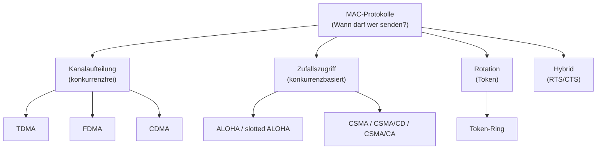
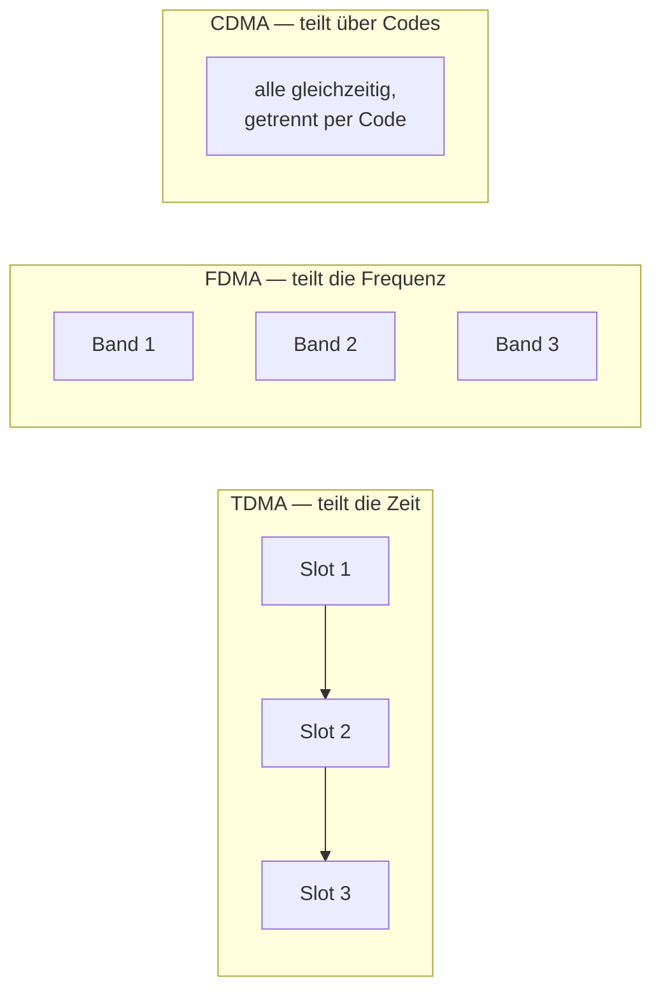
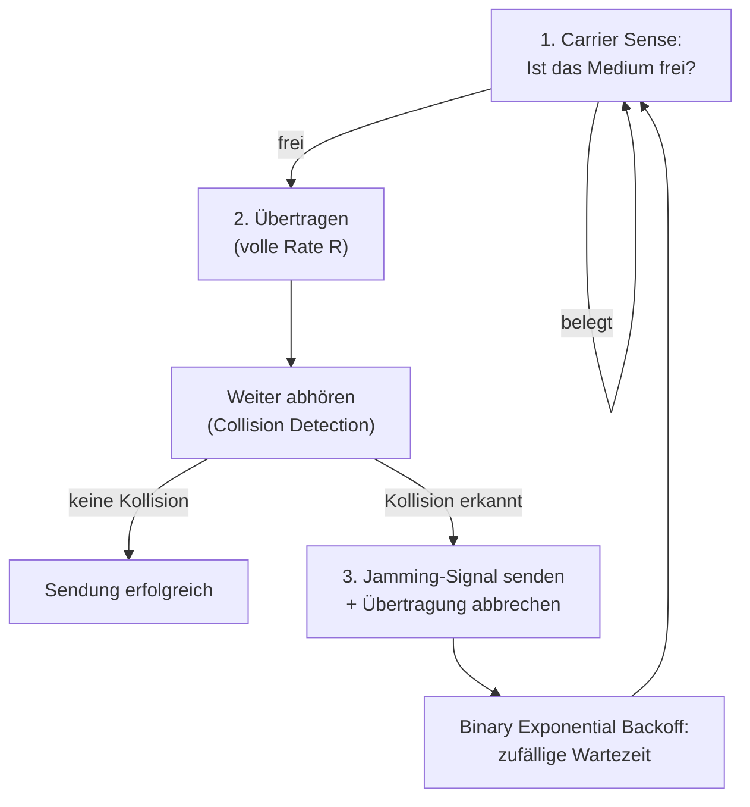
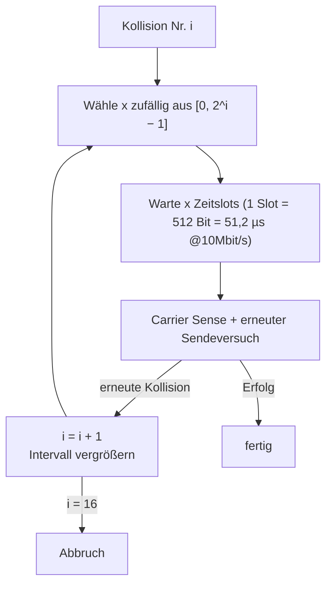
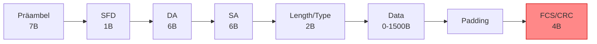
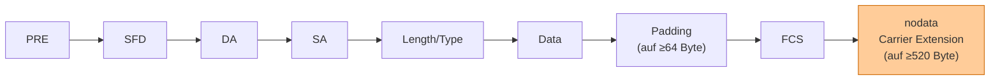
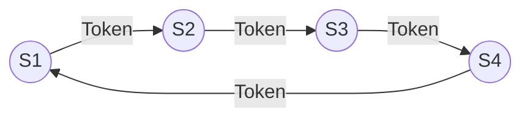

# 17 — Kanalzuteilung

**Folien:** [[kommunikationssysteme/resources/Kommunikationssysteme_17_Kanalzuteilung.pdf|Kommunikationssysteme_17_Kanalzuteilung.pdf]]
**Selbstkontrolle:** [[kommunikationssysteme/selbstkontrolle/komsys-selbstkontrolle-10|Selbstkontrolle 10]]

## Inhaltsverzeichnis

- [[#Ein ideales Mehrfachzugriffsprotokoll|Ein ideales Mehrfachzugriffsprotokoll]]
- [[#Was ist ein Mehrfachzugriffsprotokoll?|Was ist ein Mehrfachzugriffsprotokoll?]]
- [[#MAC-Protokolle: Eine Taxonomie|MAC-Protokolle: Eine Taxonomie]]
- [[#Kanalaufteilungsprotokolle: TDMA, FDMA, CDMA|Kanalaufteilungsprotokolle: TDMA, FDMA, CDMA]]
- [[#Zufallszugriffsprotokolle|Zufallszugriffsprotokolle]]
- [[#CSMA: Carrier Sense Multiple Access|CSMA: Carrier Sense Multiple Access]]
- [[#CSMA/CD: Prüfe auf Kollision|CSMA/CD: Prüfe auf Kollision]]
- [[#Mindest-Sendezeit und Mindest-Rahmenlänge|Mindest-Sendezeit und Mindest-Rahmenlänge]]
- [[#Binary Exponential Backoff|Binary Exponential Backoff]]
- [[#Ethernet|Ethernet]]
- [[#Ethernet-Varianten und -Namensgebung|Ethernet-Varianten und -Namensgebung]]
- [[#Nachrichtenformat bei Ethernet|Nachrichtenformat bei Ethernet]]
- [[#Fast Ethernet und Gigabit-Ethernet|Fast Ethernet und Gigabit-Ethernet]]
- [[#Rotationsprotokolle: Token-Ring|Rotationsprotokolle: Token-Ring]]
- [[#Fragen zur Selbstkontrolle|Fragen zur Selbstkontrolle]]

---

## Ein ideales Mehrfachzugriffsprotokoll

Ausgangspunkt ist ein **Broadcast-Kanal der Rate `R` bps**, den sich mehrere Knoten teilen. Ein *ideales* Protokoll hätte vier Eigenschaften:

1. Ein **einzelner** Knoten kann mit der vollen Rate `R` übertragen.
2. Sind `M` Knoten aktiv, überträgt **jeder** mit einer mittleren Rate von `R/M` (**Fairness**).
3. Das Protokoll ist **dezentral** — es gibt keinen Master-Knoten, dessen Ausfall das ganze System abstürzen lässt.
4. Das Protokoll ist **einfach** und damit **kostengünstig** implementierbar.

> [!tip] Merke — Das ideale Protokoll
> Volle Rate `R` bei einem Sender, faire Aufteilung `R/M` bei `M` Sendern, **kollisionsfrei**, dezentral, wenig Overhead, einfach. Reale Protokolle erkaufen jede dieser Eigenschaften mit dem Verzicht auf eine andere.

---

## Was ist ein Mehrfachzugriffsprotokoll?

> [!quote] Definition
> Ein **Mehrfachzugriffsprotokoll (Medium Access Control, MAC)** ist ein **verteilter Algorithmus** zur Regelung der gemeinsamen Nutzung eines **geteilten Übertragungsmediums**. Es beantwortet: **Wann kann wer etwas senden?** und sorgt für **störungsfreien Kanalzugriff**.

> [!warning] Achtung — In-Band-Signalisierung
> Die zur Koordination nötige Kommunikation (**Kontrollnachrichten**) muss **über dasselbe geteilte Medium** abgewickelt werden. Es gibt **keine out-of-band-Signalisierung** — der Koordinationsverkehr konkurriert also selbst um den Kanal.

---

## MAC-Protokolle: Eine Taxonomie

Man unterscheidet grob vier Kategorien:

| Kategorie | Prinzip | Kollisionen? | Beispiele |
|---|---|---|---|
| **Konkurrenzfreie / Kanalaufteilungsprotokolle** | Kanal wird in kleine Übertragungseinheiten (Zeitfenster, Frequenzen, Kodierung) aufgeteilt; **exklusive** Nutzung je Knoten | nein (per Aufteilung ausgeschlossen) | TDMA, FDMA, CDMA |
| **Konkurrenzbasierte / Zufallszugriffsprotokolle** | Keine Unterteilung — jeder sendet mit der **gesamten** Leitungskapazität; Kollisionen sind möglich und müssen behandelt werden | ja (müssen erkannt/behandelt werden) | ALOHA, slotted ALOHA, CSMA, CSMA/CD, CSMA/CA |
| **Rotationsprotokolle** | Der Sende-Zeitpunkt wird durch eine spezielle Koordinierung nach einem flexiblen **Rotationsprinzip** im Medium ausgetauscht | nein | Token-Ring, Token-Bus |
| **Hybride Protokolle** | Nutzen Verfahren zur **Vermeidung** von Kollisionen (**Request-to-Send / Clear-to-Send**) | vermieden | RTS/CTS (z.B. WLAN) |



---

## Kanalaufteilungsprotokolle: TDMA, FDMA, CDMA

Der Kanal wird in kleine, exklusiv vergebene Einheiten zerlegt. Damit sind Kollisionen **prinzipiell ausgeschlossen** — der Preis ist, dass **ungenutzte Einheiten verloren gehen** (schlechte Auslastung bei wenigen aktiven Sendern).

### TDMA — Time Division Multiple Access (Zeitmultiplex)

- Aufteilung des Kanals in kleine **Zeiteinheiten (Slots)**, die sich in **Runden** wiederholen.
- Jeder Knoten darf eine feste Anzahl Slots pro Runde nutzen; **ungenutzte Slots bleiben ungenutzt** (idle).
- Slots können meist auch **gruppiert** angefordert werden.
- Die Anforderung entspricht der Konfiguration der NIC-Karte — häufig gibt es dafür einen speziellen **Kommunikationsslot**; die **Synchronisation** wird vorher initiiert.

> [!example] Beispiel — 6-Knoten-LAN (TDMA)
> Nur die Knoten 1, 3 und 4 haben Daten. Pro Runde (`frame`) senden nur die Slots 1, 3, 4; die **Slots 2, 5, 6 bleiben leer (idle)** — ihre Kapazität ist verloren.

### FDMA — Frequency Division Multiple Access (Frequenzmultiplex)

- Aufteilung des Kanals in **Frequenzbänder**; jede Station nutzt ihr eigenes Band und moduliert die Symbole (Daten) darauf (unter Anwendung einer Spreizung).
- Nach **Nyquist** kann ein rauschfreier Kanal der Bandbreite `B` Hz mit höchstens `2·B·Symboltiefe` Bit/s übertragen.
- Auch hier gilt: **Die Kapazität nicht genutzter Frequenzbänder geht verloren.**

> [!example] Beispiel — 6-Knoten-LAN (FDMA)
> 1, 3, 4 haben Daten und senden dauerhaft auf ihren Bändern; die Bänder von 2, 5, 6 bleiben leer.

### CDMA — Code Division Multiple Access

- **Alle** Stationen senden **gleichzeitig** auf **demselben** Frequenz-/Zeitbereich.
- Die Trennung erfolgt über **unterschiedliche (orthogonale) Spreizcodes**: Der Empfänger multipliziert das Summensignal mit dem Code des gewünschten Senders und filtert so dessen Daten heraus.



| Verfahren | Aufteilung nach | Trennung | Nachteil |
|---|---|---|---|
| **TDMA** | Zeit (Slots in Runden) | jeder in seinem Zeitslot | ungenutzte Slots verloren |
| **FDMA** | Frequenz (Bänder) | jeder in seinem Band | ungenutzte Bänder verloren |
| **CDMA** | Code | alle gleichzeitig, Trennung per Spreizcode | Aufwand für Codes/Synchronisation |

---

## Zufallszugriffsprotokolle

- Sendet ein Knoten, so nutzt er die **vollständige Kanalrate `R`** — es gibt **keine a-priori-Koordination**.
- **Kollisionen** treten auf, wenn mehrere Knoten **gleichzeitig** senden. Zwei Kernfragen:
  - Wie werden Kollisionen **erkannt**?
  - Wie werden sie **behandelt** (z.B. erneutes Verschicken nach einem zufälligen Zeitintervall — *delayed retransmissions*)?
- Beispielprotokolle: **ALOHA**, **slotted ALOHA**, **CSMA**, **CSMA/CD**, **CSMA/CA**.

---

## CSMA: Carrier Sense Multiple Access

> [!quote] Definition — CSMA
> **Carrier Sense Multiple Access:** *Höre vor der Übertragung das Medium ab und sende nur, falls das Medium frei ist.* Analogie: „Unterbrich keine anderen."

- **Vorteil:** einfach, da die Stationen nicht koordiniert werden müssen; mit einigen Erweiterungen trotzdem gute Ausnutzung der Netzkapazität.
- **Nachteil:** kein garantierter Zugriff — eine **große Verzögerung** ist möglich.

> [!warning] Achtung — Das Grundproblem von CSMA
> Die Nachricht breitet sich mit **endlicher Geschwindigkeit** auf dem Medium aus. Daher kann `S₂` das Medium für frei halten, obwohl `S₁` **schon zu senden begonnen** hat. Beide Signale **überlagern sich** und werden unbrauchbar — „Carrier Sense" allein verhindert Kollisionen also **nicht** vollständig.

---

## CSMA/CD: Prüfe auf Kollision

> [!quote] Definition — CSMA/CD
> **Carrier Sense Multiple Access with Collision Detection:** wie CSMA, aber zusätzlich wird **während der Sendung das Medium weiter abgehört**. Bei einer Kollision wird die Übertragung **abgebrochen** und ein **Jamming-Signal** gesendet, damit **jede** Station weiß, dass die Nachricht nutzlos geworden ist.

Ablauf (IEEE 802.3, klassisches Ethernet):



> [!warning] Achtung — Nur für „kleine" Netze
> Mit zunehmender **Ausdehnung** des Netzes steigt die Gefahr eines Konflikts (längere Laufzeit → längeres „Fenster", in dem eine Station den Kanal fälschlich für frei hält). CSMA/CD ist daher nur für **räumlich begrenzte** Netze geeignet.

---

## Mindest-Sendezeit und Mindest-Rahmenlänge

> [!tip] Merke — Warum eine Mindest-Sendezeit?
> Eine Kollision muss noch **während der eigenen Sendung** erkannt werden. Dazu muss ein Sender `S₁` mindestens so lange senden, dass er das Kollisionssignal auch eines **maximal entfernten** Teilnehmers noch mitbekommt — also mindestens so lange, wie die **Signallaufzeit hin und zurück** (Round-Trip) dauert.

Die Mindest-Sendezeit entspricht der **maximalen Ende-zu-Ende-Laufzeit** mal zwei (hin und zurück). Daraus folgt eine **Mindest-Rahmenlänge**:

```text
t_min      = 2 · Ausbreitungszeit über die maximale Netzausdehnung
             (Round-Trip-Propagationszeit)

Rahmen_min = Bitrate R · t_min
```

> [!example] Beispiel — Standard-Ethernet (10 Mbit/s)
> Bei einer Signalgeschwindigkeit von ca. `200 000 km/s` (≈ 5 µs/km) und einer maximalen Ausdehnung von **2800 m** (inkl. Zeit in Repeatern) beträgt die maximale Ende-zu-Ende-Laufzeit ca. `25,6 µs`. Die maximale **Konfliktdauer** ist damit ca. `2 · 25,6 µs ≈ 51,2 µs`. Um einen Konflikt sicher zu erkennen, muss eine Station **mindestens 51,2 µs** senden und horchen.
> → Bei `10 Mbit/s` entsprechen 51,2 µs genau **64 Byte** (= 512 Bit) → das ist die **minimale Rahmenlänge** von klassischem Ethernet.

> [!tip] Merke — Zusammenhang Ausdehnung ↔ Rahmenlänge
> Steigt die Bitrate `R` (Fast/Gigabit-Ethernet), so ist derselbe 64-Byte-Rahmen viel **schneller** gesendet — die Kollisionserkennung wäre nicht mehr gewährleistet. Man muss dann **entweder die Ausdehnung verkleinern oder die minimale Rahmenlänge vergrößern**.

---

## Binary Exponential Backoff

> [!quote] Definition — Binary Exponential Backoff
> Nach einer Kollision wird eine **zufällige Wartezeit** aus einem vorgegebenen Intervall **gleichverteilt** gezogen, um eine gleichzeitige Wiederholung (Folgekollision) zu vermeiden. Das Intervall wird **klein** gehalten (kurze Wartezeiten); kommt es erneut zur Kollision, wird das Intervall **vor dem nächsten Versuch vergrößert**, um mehr Spielraum für alle Sender zu schaffen.

Ablauf der Wartezeitermittlung:

- Hatte eine Station bereits `i` Kollisionen, würfelt sie eine Zahl `x` aus dem Intervall `[0, 2ⁱ − 1]`.
- Ab Kollision **10–15** bleibt das Intervall fix bei `[0, 2¹⁰ − 1]`; bei der **16.** Kollision erfolgt **Abbruch**.
- Sobald das Medium frei ist, wartet der Sender `x` **Zeitslots**, wobei ein Zeitslot der minimalen Ethernet-Rahmenlänge von **512 Bit** entspricht — bei 10 Mbit/s also **51,2 µs**.
- Nach dem `x`-ten Zeitslot beginnt die Station erneut mit **Carrier Sense**.



> [!tip] Merke
> „Binary Exponential" = der **Zufallsbereich verdoppelt sich** (`2ⁱ`) mit jeder weiteren Kollision. Wenige Kollidierende → kurze Wartezeiten; viele Kollidierende → automatisch größerer Streubereich und damit sinkende Kollisionswahrscheinlichkeit.

---

## Ethernet

- Basiert auf dem Standard **IEEE 802.3 „CSMA/CD"**.
- Mehrere **passive** Rechner teilen sich **ein gemeinsames Medium** (Random Access).
- Ursprünglich **Bustopologie**.

Der Zugriff läuft in drei Schritten (siehe CSMA/CD oben):
1. **Ist das Medium frei?** (Carrier Sense)
2. **Übertragen.**
3. **Prüfe auf Kollision** (Collision Detection). Falls ja: Jamming senden, abbrechen, danach **Binary Exponential Backoff**.

> [!success] Best Practice — Warum Ethernet sich durchgesetzt hat
> Ethernet dominiert den LAN-Bereich, weil es **einfach zu verstehen, umzusetzen (passiv) und zu überwachen** ist, in der Anschaffung **billig** ist und es **keine Kompatibilitätsprobleme** zwischen den Generationen gibt.

---

## Ethernet-Varianten und -Namensgebung

Vier Klassen (alle IEEE 802.3, CSMA/CD):

| Variante | Rate | Status |
|---|---|---|
| **Standard Ethernet** | 10 Mb/s | kaum noch im Einsatz |
| **Fast Ethernet** | 100 Mb/s | ehemals meistverbreitet |
| **Gigabit Ethernet** | 1000 Mb/s | heute meist verbreitet |
| **10-Gigabit-Ethernet** | 10 000 Mb/s | standardisiert |

Die Variante wird durch **3 Namenskomponenten** angegeben, z.B. `10Base-T`:

1. **Kapazität** in Mb/s (10, 100, 1000, 10G)
2. **Übertragungstechnik** (`Base` = Basisband, `Broad` = Broadband)
3. **maximale Segmentlänge** in Einheiten von 100 m bzw. Art des Mediums

> [!example] Beispiel — Namensschema
> `10Base-T` = 10 Mb/s, Basisband, Twisted-Pair. `100Base-T2` = 100 Mb/s, Basisband, 2 Twisted-Pair. `1000Base-X` = 1000 Mb/s, Basisband, Glasfaser.
> Von der Variante hängen weitere Parameter ab (wegen unterschiedlicher Signallaufzeiten), z.B. `1000Base-X`: min. Rahmenlänge **416 Byte**, `1000Base-T`: **520 Byte**.

### Kenndaten im Vergleich

| Parameter | Ethernet | Fast Ethernet | Gigabit Ethernet |
|---|---|---|---|
| Maximale Ausdehnung | bis 2800 m | 205 m | 200 m |
| Kapazität | 10 Mb/s | 100 Mb/s | 1000 Mb/s |
| Minimale Rahmenlänge | 64 Byte | 64 Byte | **520 Byte** |
| Maximale Rahmenlänge | 1526 Byte | 1526 Byte | 1526 Byte |
| Signaldarstellung | Manchester-Code | 4B/5B, 8B/6T, … | 8B/10B, … |
| Maximale Anzahl Repeater | 5 | 2 | 1 |

> [!info] Hinweis — Jamming
> Zusätzlich zum eigentlichen Rahmen wird ein weiterer „Rahmen" zum **Jamming** benutzt: ein **4-Byte-Störsignal** zur Kollisionserkennung.

---

## Nachrichtenformat bei Ethernet

Der Ethernet-Rahmen besteht auf der Leitung aus folgenden Feldern (Header + Trailer auf Schicht 2):

| # | Feld | Größe | Bedeutung |
|---|---|---|---|
| 1 | **Präambel** | 7 Byte | Synchronisation; jedes Byte `10101010` |
| 2 | **SFD** (Start Frame Delimiter) | 1 Byte | markiert den Rahmenbeginn: `10101011` |
| 3 | **DA** (Destination Address) | 6 Byte | Ziel-MAC-Adresse |
| 4 | **SA** (Source Address) | 6 Byte | Quell-MAC-Adresse |
| 5 | **Length/Type** | 2 Byte | Länge des Datenfelds **bzw.** Typ des Schicht-3-Protokolls (z.B. IP, ARP) |
| 6 | **Data** | ≥ 0 (0–1500) Byte | Nutzdaten |
| 7 | **Padding** | ≥ 0 Byte | füllt den Rahmen auf mindestens **64 Byte** auf (kleinere Fragmente werden verworfen, außer dem Jamming-Signal) |
| 8 | **FCS** (Frame Check Sequence) | 4 Byte | **CRC**-Prüfsumme (Trailer) |



> [!info] Hinweis
> **Präambel + SFD** dienen der Synchronisation und Rahmenerkennung. Der **Trailer** ist die **FCS/CRC** — sie erlaubt dem Empfänger, beschädigte (z.B. kollidierte) Rahmen zu erkennen und zu verwerfen.

---

## Fast Ethernet und Gigabit-Ethernet

### Fast Ethernet (IEEE 802.3u, 1995)

- Prinzip: Ethernet **beibehalten**, aber schneller machen — **Kompatibilität** zu existierenden Netzen.
- 100 Mbit/s durch bessere Technik, effizientere Codes, mehrere Leitungspaare, Switches.
- **Problem:** Die minimale Rahmenlänge von 64 Byte wird bei 100 Mb/s ca. **10-mal schneller** abgesendet → Kollisionserkennung nicht mehr gewährleistet.
- **Resultat:** Die maximale Ausdehnung wurde um ca. **Faktor 10 auf etwas mehr als 200 m** reduziert (statt 2500 m bei 10-Mbit-Ethernet). So bleibt die Signallaufzeit klein genug, um Kollisionen innerhalb der vorgeschriebenen Sendezeit noch zu erkennen.

### Gigabit-Ethernet (IEEE 802.3z, 1998)

- **Kompatibilität** zu Fast Ethernet beibehalten.
- **Problem:** Zur Kollisionserkennung wäre eine Reduktion der Ausdehnung auf **25 m** nötig — praktisch zu klein.
- **Lösung:**
  - Ausdehnung von Fast Ethernet (**~200 m**) beibehalten.
  - Neue **minimale Rahmenlänge von 520 Byte** (statt 64 Byte).
  - Altes Rahmenformat beibehalten: ein **zweites Padding-Feld** wird hinter dem Rahmen angehängt (**Carrier Extension**).



> [!tip] Merke — Der rote Faden Fast → Gigabit
> Höhere Bitrate ⇒ derselbe Rahmen ist schneller weg ⇒ Kollisionserkennung gefährdet. **Fast Ethernet** löst das durch **kleinere Ausdehnung** (205 m); **Gigabit** durch **größere minimale Rahmenlänge** (520 Byte via Carrier Extension), weil eine weitere Verkleinerung der Ausdehnung (25 m) unpraktikabel wäre.

---

## Rotationsprotokolle: Token-Ring

Neben Kanalaufteilung und Zufallszugriff bilden **Rotationsprotokolle** die dritte Grundstrategie: Der Sende-Zeitpunkt wird nach einem **flexiblen Rotationsprinzip** im Medium ausgetauscht — dadurch **kollisionsfrei** und **fair**.

- Ein spezielles **Token** (Sendeberechtigung) kreist ständig im **Ring**.
- Nur die Station, die das **freie Token** besitzt, darf senden.
- Nach dem Senden gibt der Sender wieder ein **freies Token** in den Ring, sodass die nächste Station zum Zuge kommt.



> [!tip] Merke — Token-Ring vs. CSMA/CD
> Token-Ring ist **konfliktfrei** und garantiert eine **Obergrenze der Wartezeit** (deterministisch), während CSMA/CD zufallsbasiert arbeitet und keinen garantierten Zugriff bietet. Ethernet hat sich dennoch durchgesetzt (einfacher, billiger, passiv).

---

## Fragen zur Selbstkontrolle

Die kompakten Karteikarten finden sich unter [[kommunikationssysteme/selbstkontrolle/komsys-selbstkontrolle-10|Selbstkontrolle 10]].

**Welche Eigenschaften hätte ein ideales Mehrfachzugriffsprotokoll?**

Ein ideales Protokoll für einen Broadcast-Kanal der Rate `R` würde (1) bei **nur einem** aktiven Sender die **volle Rate `R`** liefern, (2) bei `M` aktiven Sendern jedem eine **faire** mittlere Rate von etwa `R/M` geben, (3) **völlig kollisionsfrei** arbeiten, (4) **dezentral** sein (kein Master-Knoten, dessen Ausfall das System lahmlegt) und (5) **einfach** sowie mit **wenig Overhead** implementierbar sein.

**Nennen Sie 3 grundsätzliche Strategien, wie der mehrfache Zugriff auf ein gemeinsames Medium gelöst werden kann!**

(1) **Kanalkonfektionierung / Kanalaufteilung** (konkurrenzfrei) — der Kanal wird in exklusive Einheiten wie Zeitslots, Frequenzbänder oder Codes zerlegt (TDMA, FDMA, CDMA). (2) **Kontrollierter Zugriff** über ein **Rotationsprinzip**, z.B. Token-Ring — eine Sendeberechtigung wird herumgereicht. (3) **Zufallsbasierter (konkurrenzbasierter) Zugriff** — jeder sendet mit voller Rate, Kollisionen werden erkannt und behandelt (ALOHA, CSMA/CD). (Als vierte, hybride Form: RTS/CTS zur Kollisionsvermeidung.)

**Erklären Sie kurz die Funktionsweise von TDMA, FDMA und CDMA!**

- **TDMA** (Time Division): Der Kanal wird in **Zeitslots** zerlegt, die sich in Runden wiederholen; jeder Knoten sendet nur in seinen zugewiesenen Slots, ungenutzte Slots bleiben leer.
- **FDMA** (Frequency Division): Der Kanal wird in **Frequenzbänder** zerlegt; jede Station moduliert ihre Daten auf ihr eigenes Band, ungenutzte Bänder gehen verloren.
- **CDMA** (Code Division): **Alle** senden **gleichzeitig** im selben Bereich, die Trennung erfolgt über verschiedene **(orthogonale) Spreizcodes**, mit denen der Empfänger den gewünschten Sender herausfiltert.

**Erklären Sie die Funktionsweise von CSMA/CD! Was bedeutet diese Abkürzung?**

**CSMA/CD** = *Carrier Sense Multiple Access with Collision Detection*. Vor dem Senden wird das Medium **abgehört** (Carrier Sense) und nur bei freiem Medium gesendet. **Während** der Sendung wird das Medium **weiter abgehört** (Collision Detection): Wird eine Kollision erkannt, bricht die Station ab, sendet ein **Jamming-Signal** (damit alle die Kollision bemerken) und wiederholt den Versuch später nach dem **Binary Exponential Backoff**.

**Erklären Sie, warum bei CSMA/CD ein Sender eine Mindestzeit senden muss (und parallel per „CD" das Medium abhören muss)! Wie lässt sich diese Mindestzeit berechnen und ggf. in eine Mindest-Rahmengröße umrechnen?**

Eine Kollision kann nur erkannt werden, solange die Station **noch selbst sendet** und dabei mithört. Das von einem **maximal entfernten** Teilnehmer ausgelöste Kollisionssignal braucht aber die Zeit **hin und zurück**, um beim ursprünglichen Sender anzukommen. Deshalb muss die Sendezeit mindestens der **Round-Trip-Propagationszeit** entsprechen: `t_min = 2 · (max. Ausbreitungszeit über die Netzausdehnung)`. Die **Mindest-Rahmenlänge** ergibt sich daraus über die Bitrate: `Rahmen_min = R · t_min`. Bei Standard-Ethernet (2800 m, ~5 µs/km, inkl. Repeater) sind das ca. `25,6 µs` Laufzeit → Konfliktdauer ca. `51,2 µs` → bei `10 Mbit/s` genau **512 Bit = 64 Byte**.

**Wie funktioniert und wozu dient der „Binary Exponential Backoff"-Algorithmus?**

Er verhindert, dass nach einer Kollision die beteiligten Stationen **erneut gleichzeitig** senden (Folgekollision). Nach der `i`-ten Kollision wählt die Station eine **zufällige, gleichverteilte** Zahl `x` aus dem Intervall `[0, 2ⁱ − 1]` und wartet `x` **Zeitslots** (1 Slot = 512 Bit = 51,2 µs bei 10 Mbit/s), bevor sie erneut mit Carrier Sense beginnt. Weil sich der Bereich mit jeder Kollision **verdoppelt** (`2ⁱ`), sinkt die Wahrscheinlichkeit weiterer Kollisionen bei Last automatisch. Ab Kollision 10–15 bleibt das Intervall fix bei `[0, 2¹⁰ − 1]`, bei der 16. erfolgt Abbruch.

**Warum wurde bei Gigabit-Ethernet die minimale Rahmenlänge von 64 auf 520 Bytes erhöht?**

Bei `1000 Mbit/s` wäre ein 64-Byte-Rahmen extrem schnell (ca. 100-mal schneller als bei 10 Mbit/s) abgesendet — kürzer als die Round-Trip-Laufzeit auf einer klassischen CSMA/CD-Strecke, sodass Kollisionen **nicht mehr rechtzeitig** erkannt würden. Da man die Ausdehnung nicht auf die theoretisch nötigen ~25 m verkleinern wollte, wurde stattdessen die **minimale Rahmenlänge auf 520 Byte** erhöht (via **Carrier Extension** / zweites Padding-Feld), damit die Sendedauer wieder lang genug für die Kollisionserkennung ist.

**Warum wurde bei Fast-Ethernet die Segmentlänge von 2500 m (10 MBit Ethernet) auf 200–250 m verkleinert?**

Bei `100 Mbit/s` wird der 64-Byte-Rahmen ca. **10-mal schneller** gesendet als bei 10 Mbit/s. Damit eine Kollision noch innerhalb der (kürzeren) Sendezeit erkannt werden kann, muss die **Signallaufzeit** entsprechend kleiner sein — also die maximale Ausdehnung um ca. **Faktor 10** auf gut 200 m reduziert werden. So bleibt die Round-Trip-Zeit unter der Sendedauer des Mindestrahmens.

**Wie ist die Rahmen-Struktur eines Ethernet-Paketes aufgebaut? Welche Daten(-Felder) werden im Header und Trailer auf Schicht 2 übertragen?**

Auf der Leitung: **Präambel** (7 Byte Synchronisation, `10101010`), **SFD** (1 Byte Start Frame Delimiter, `10101011`), **Ziel-MAC (DA, 6 Byte)**, **Quell-MAC (SA, 6 Byte)**, **Length/Type** (2 Byte — Länge des Datenfelds bzw. Typ des Schicht-3-Protokolls, z.B. IP/ARP), **Data** (0–1500 Byte Nutzdaten), **Padding** (füllt auf mind. 64 Byte auf) und im **Trailer** die **FCS/CRC** (4 Byte Prüfsumme). Header = Präambel/SFD/DA/SA/Length; Trailer = FCS.

**Erklären Sie die grundsätzliche Vorgehensweise des Medienzugriffes beim Token-Ring Netz!**

Ein spezielles **Token** (Sendeberechtigung) kreist ständig im **Ring**. Nur die Station, die das **freie Token** hält, darf senden. Nach dem Senden gibt sie ein **freies Token** wieder in den Ring, sodass die nächste Station senden kann. Dadurch ist der Zugriff **kollisionsfrei**, **fair** und mit einer **garantierten Obergrenze der Wartezeit** — im Gegensatz zum zufallsbasierten CSMA/CD.
