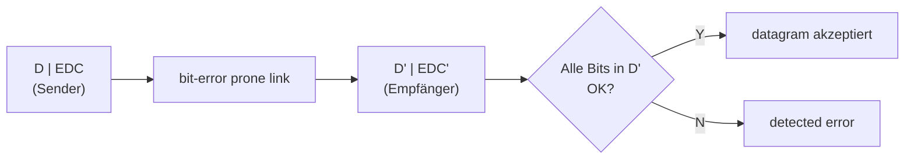
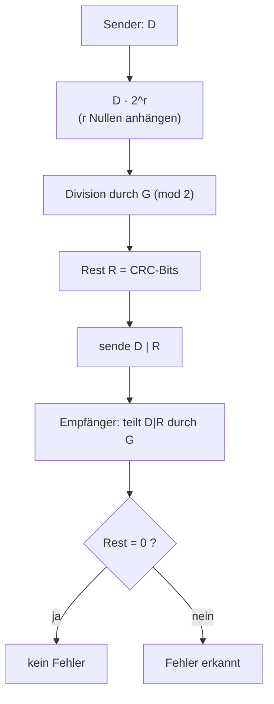
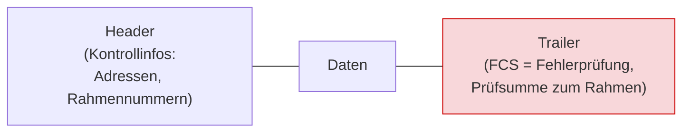
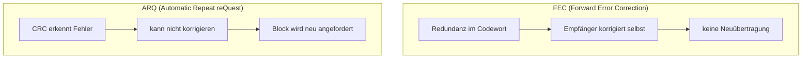

# 18 — Fehlerkorrektur

**Folien:** [[kommunikationssysteme/resources/Kommunikationssysteme_18_Fehlerkorrektur.pdf|Kommunikationssysteme_18_Fehlerkorrektur.pdf]]
**Selbstkontrolle:** [[kommunikationssysteme/selbstkontrolle/komsys-selbstkontrolle-11|Selbstkontrolle 11]]

## Inhaltsverzeichnis

- [[#Fehlererkennung: EDC und Daten|Fehlererkennung: EDC und Daten]]
- [[#Fehlererkennung auf Bitebene: Hamming-Abstand|Fehlererkennung auf Bitebene: Hamming-Abstand]]
- [[#Hamming-Codes: Erkennen und Beheben|Hamming-Codes: Erkennen und Beheben]]
- [[#Cyclic Redundancy Check (CRC)|Cyclic Redundancy Check (CRC)]]
- [[#Modulo-2-Arithmetik|Modulo-2-Arithmetik]]
- [[#Berechnung der Prüfsumme R|Berechnung der Prüfsumme R]]
- [[#Rahmenerstellung in der Sicherungsschicht|Rahmenerstellung in der Sicherungsschicht]]
- [[#Schicht 2: LLC und MAC|Schicht 2: LLC und MAC]]
- [[#Fragen zur Selbstkontrolle|Fragen zur Selbstkontrolle]]

---

## Fehlererkennung: EDC und Daten

Die Übertragung über Schicht 1 ist **nicht unbedingt fehlerfrei**: durch Abschwächung der Signale oder durch Störungen kann der Empfänger einzelne Bits falsch „erkennen". Um das aufzufangen, hängt man an die Daten **redundante Information** an.

- **EDC** = *Error Detection and Correction bits* — die redundante Information.
- **D** = die Daten, die durch das EDC geschützt werden (`d data bits`).

Durch Fehlererkennungs- und -korrekturmechanismen kann der Empfänger **manchmal — aber nicht immer** — erkennen, dass Bitfehler aufgetreten sind. Grundregel: **Höhere Redundanz hilft.**



> [!tip] Merke
> Der Empfänger prüft das empfangene Paar `D' | EDC'`. Stimmt die Prüfung nicht, wird ein Fehler erkannt (`detected error`). Fehlererkennung ist aber **nie perfekt**: manche Fehlermuster bleiben unentdeckt.

---

## Fehlererkennung auf Bitebene: Hamming-Abstand

**Idee für die Verwendung von Redundanz:** Daten werden in Form eines **Codes** übertragen. Man nutzt die **„Distanz"** zwischen gültigen Codewörtern aus, d.h. **nicht alle möglichen Bitkombinationen sind gültige Codewörter**. Verfälscht ein Fehler ein gültiges Wort, entsteht (bei genügend Abstand) ein **ungültiges** Wort, das als Fehler auffällt.

> [!quote] Definition — Hamming-Abstand
> Der **Hamming-Abstand** $d(c_1, c_2)$ zweier Codewörter ist die **Anzahl der Bitpositionen, in denen sie sich unterscheiden**, d.h. die Anzahl der 1-Bits von $c_1 \oplus c_2$ (XOR).

$$d(c_1, c_2) = \text{Anzahl der 1-Bits von } (c_1 \oplus c_2)$$

> [!example] Beispiel — Abstand zweier Wörter
> $$d(10001001,\ 10110001) = 3$$
> Die beiden Wörter unterscheiden sich in genau 3 Positionen (XOR liefert `00111000`, mit drei Einsen).

Der **Hamming-Abstand $D$ eines vollständigen Codes $C$** ist der kleinste Abstand über alle Paare verschiedener Codewörter:

$$D(C) := \min\{\, d(c_1, c_2) \mid c_1, c_2 \in C;\ c_1 \neq c_2 \,\}$$

---

## Hamming-Codes: Erkennen und Beheben

Der Hamming-Abstand eines Codes bestimmt seine **Fähigkeit, Fehler zu erkennen und zu beheben**.

> [!tip] Merke — die beiden zentralen Ungleichungen
> - **Erkennen** von $e$-Bit-Fehlern: Hamming-Abstand $d_{min} \ge e + 1$ notwendig.
> - **Beheben** von $e$-Bit-Fehlern: Hamming-Abstand $d_{min} \ge 2e + 1$ notwendig.

$$\text{erkennen: } d_{min} \ge e+1 \qquad\qquad \text{korrigieren: } d_{min} \ge 2e+1$$

> [!example] Beispiel — Abstand 3
> Bei einem **Hamming-Abstand von 3** können wir **2-Bit-Fehler erkennen** ($3 \ge 2+1$) und **1-Bit-Fehler beheben** ($3 \ge 2\cdot1+1$).

### Beispiele für Codes

**Fehlererkennender Code — einzelnes Paritätsbit:**

- Code mit einem einzigen **Paritätsbit**.
- Hamming-Abstand des Codes $= 2$.
- Die Änderung eines einzelnen Bits erfordert eine Änderung des Paritätsbits → ein 1-Bit-Fehler verletzt die Parität.
- **Erkennung eines 1-Bit-Fehlers möglich** (tatsächlich sogar aller Fehler mit **ungerader** Anzahl von Bits). Korrigieren ist nicht möglich.

**Fehlerbehebender Code (vereinfacht):**

- Gültige Codewörter (5+5 Bit): `00000 00000`, `00000 11111`, `11111 00000`, `11111 11111`.
- Hamming-Abstand des Codes $= 5$ → **Korrektur von 2-Bit-Fehlern möglich** ($5 \ge 2\cdot2+1$).
- Beispiel einer Korrektur: empfangen `00000 00111` $\Rightarrow$ korrigiert zu `00000 11111` (das nächstgelegene gültige Codewort, 2 gekippte Bits).

> [!quote] Definition — FEC (Forward Error Correction)
> **FEC = Forward Error Correction:** Fehlerkorrektur durch Redundanz **im Codewort selbst**, sodass der Empfänger bestimmte Fehler eigenständig korrigieren kann — **ohne Neuübertragung**.

> [!success] Best Practice
> Wer mit **minimaler Anzahl von Prüfbits** Einzelbitfehler **korrigieren** will, verwendet einen **Hamming-Code**. Für die Korrektur von 2-Bit-Fehlern braucht man einen Code mit **Mindestabstand 5** (z.B. einen geeigneten BCH-Code).

---

## Cyclic Redundancy Check (CRC)

CRC ist eine **schnelle Hardware-Lösung** zur Fehlererkennung. Es handelt sich um einen **Polynomcode**: die Datenbits $D$ werden als Bitkette eines Polynoms interpretiert, dessen Koeffizienten die 0-1-Werte der Bitkette sind.

$$1011 \ \rightarrow\ u^3 + u + 1$$

Die Prüfung der Nachricht mittels CRC basiert auf **Polynomarithmetik** (über GF(2)).

Der zu sendende Rahmen besteht aus den $d$ Datenbits $D$ gefolgt von $r$ CRC-Bits $R$:

```
| <-- d bits: D (data bits) --> | <-- r bits: R (CRC) --> |
```

Als mathematische Formel entspricht das gesendete Bitmuster $D \cdot 2^r \ \text{XOR}\ R$ (die Daten um $r$ Stellen nach links geschoben, mit den CRC-Bits in den frei gewordenen Stellen).

> [!quote] Definition — Generator G
> Sender und Empfänger einigen sich auf ein gemeinsames Bitmuster der Länge **$r+1$ Bit**, den **Generator $G$**. Das **höchstwertige Bit von $G$ ist stets 1**.

**Konzept:** Berechne die $r$ CRC-Bits $R$ so, dass die $d + r$ Bits (als Binärzahl interpretiert) mit der **Modulo-2-Arithmetik genau durch $G$ teilbar** sind.

- Der Empfänger kennt $G$ und teilt das empfangene $\langle D, R\rangle$ durch $G$. **Ist der Rest ungleich 0, liegt ein Fehler vor!**
- Die **Ethernet-CRC** kann **Burst-Fehler von weniger als $r+1$ Bits** sowie **jede ungerade Fehlerzahl** erkennen — aber **keine Fehler beheben**.



---

## Modulo-2-Arithmetik

Die Rechenoperationen werden in der **Modulo-2-Arithmetik einfacher**, da hierbei **keine Überträge** zu berücksichtigen sind.

> [!tip] Merke
> **Addition und Subtraktion** führen in der Modulo-2-Arithmetik zum **gleichen Ergebnis** — beide entsprechen dem **XOR**. Wir können also einfach mit **XOR** arbeiten.

| $a$ | $b$ | $a + b$ (mod 2) $= a - b = a \oplus b$ |
|---|---|---|
| 0 | 0 | 0 |
| 0 | 1 | 1 |
| 1 | 0 | 1 |
| 1 | 1 | 0 |

---

## Berechnung der Prüfsumme R

Gesucht ist eine Bitkombination $R$, sodass gilt:

$$D \cdot 2^r \ \text{XOR}\ R = n \cdot G$$

D.h. $R$ soll so gewählt werden, dass $G$ das Muster $D \cdot 2^r$ **ohne Rest** teilt. Daraus folgt direkt: teilt man $D \cdot 2^r$ durch $G$, ist der Rest genau $R$.

> [!tip] Merke — Formel für R
> $$R = \text{Rest}\!\left[\frac{D \cdot 2^r}{G}\right]$$
> Man hängt $r$ **Nullen** an $D$ an ($D \cdot 2^r$) und dividiert per Modulo-2 (XOR) durch $G$; der verbleibende Rest ist die Prüfsumme $R$.

> [!example] Beispiel — CRC mit Generator G = 1001
> Generator $G = 1001$ (also $r = 3$), zu übertragende Daten $D = 101110$.
> Zunächst $r = 3$ Nullen anhängen: `101110000`. Dann Modulo-2-Division (XOR) durch `1001`:
>
> ```
> 101110000 : 1001
> 1001
> ----
> 001010000
>   1001
>   ----
>   0011000
>    1001
>    ----
>    01010
>     1001
>     ----
>     0011   <-- Rest R = 011
> ```
>
> **R ist somit 011.** Gesendet wird `101110` + `011` = `101110011`.

> [!example] Beispiel — Aufgabe mit Generatorpolynom $x^4 + x^3 + 1$
> Generatorpolynom $x^4 + x^3 + 1$ entspricht dem Bitmuster $G = 11001$ (also $r = 4$). Gesucht ist die CRC-Prüfsumme zur Bitfolge $D = 10110101110$.
> Man rechnet $\underbrace{10110101110}_{D}\,\underbrace{0000}_{r=4} : 11001$:
>
> ```
> 101101011100000 : 11001
> 11001
> -----
> 011111011100000
>  11001
>  -----
>  0011001 1100000
>    11001
>    -----
>    0000011000
>          11001
>          -----
>          0000100   <-- Rest R = 0100
> ```
>
> **R ist somit 0100.** (Die grau/farbig heruntergezogenen Bits sind die noch nicht verarbeiteten Datenbits.)

---

## Rahmenerstellung in der Sicherungsschicht

Die Sicherungsschicht (Schicht 2) teilt eine Nachricht in **einheitliche Einheiten (Rahmen / Frames)** ein — das vereinfacht die Übertragung — und bietet eine **wohldefinierte Schnittstelle nach oben (Schicht 3)**.

Jeder Rahmen wird gekennzeichnet:



- **Header:** Kontrollinformationen (Adressen, Rahmennummern, …).
- **Trailer:** die **Fehlerprüfung** — eine **Prüfsumme zum ganzen Rahmen**, die **FCS (Frame Check Sequence)**. Hier steckt in Ethernet die CRC.

> [!tip] Merke — warum CRC gut zum Framing passt
> Ein Rahmen ist am Ende ohnehin abgeschlossen — daher kann die über den **gesamten Rahmen** berechnete Prüfsumme bequem als **Trailer (FCS)** angehängt werden.

**Fehlererkennung: ARQ (Automatic Repeat reQuest)**

- Verwendung eines **fehlererkennenden Codes (CRC)**.
- Fehler werden zwar **erkannt, können aber nicht korrigiert** werden! Daher müssen verfälschte Daten **neu angefordert** werden.
- Einführung einer **Flusskontrolle** (wie bei TCP: **Sliding Window**):
  - Identifikation der Datenblöcke,
  - Quittierung von Blöcken durch den Empfänger,
  - Wiederholung fehlerhaft übertragener Blöcke.



> [!warning] Achtung — FEC vs. ARQ
> **FEC** korrigiert selbst (mehr Redundanz, keine Rückkanal-Neuübertragung); **ARQ** erkennt nur (via CRC) und fordert fehlerhafte Rahmen **neu an** (braucht Rückkanal + Flusskontrolle).

---

## Schicht 2: LLC und MAC

Die Sicherungsschicht (Schicht 2) teilt sich in zwei Aufgabenbereiche:

| Teilschicht | Ebene | Aufgaben |
|---|---|---|
| **LLC** — Logical Link Control | Schicht 2b | Einteilung der Daten in **Rahmen (Frames)**; (möglichst) **fehlerfreie Übertragung** zwischen benachbarten Knoten durch Erkennung (und Behebung) von Übertragungsfehlern, **Flusskontrolle** (Vermeidung der Überlastung des Empfängers) und **Pufferspeicher**. |
| **MAC** — Medium Access Control | Schicht 2a | **Regelung des Zugriffs** auf den Kommunikationskanal bei **Broadcast-Netzen**. |

Über der LLC sitzt der IEEE-802.2-Standard; darunter die konkreten MAC-Standards realer Netze, z.B. **802.3 CSMA/CD (Ethernet)**, 802.4 Token Bus, 802.5 Token Ring, 802.6 DQDB, FDDI, ATM.

> [!info] Hinweis
> Die **nächste Aufgabe der LLC-Schicht** ist die **sichere Übertragung der Rahmen** zum Kommunikationspartner. Die Übertragung über Schicht 1 ist nicht unbedingt fehlerfrei — durch Signalabschwächung oder Störungen „erkennt" der Empfänger möglicherweise einige Bits falsch. Genau dagegen wirken CRC/FCS (Erkennung) und ARQ (Neuanforderung).

---

## Fragen zur Selbstkontrolle

Die kompakten Karteikarten finden sich unter [[kommunikationssysteme/selbstkontrolle/komsys-selbstkontrolle-11|Selbstkontrolle 11]].

**Was ist ein Hamming-Abstand bei einem Code C mit den Wörtern c1 bis cn?**

Der Hamming-Abstand $d(c_1, c_2)$ zweier Codewörter ist die **Anzahl der Bitpositionen, in denen sie sich unterscheiden** — gleichbedeutend mit der Anzahl der 1-Bits von $c_1 \oplus c_2$. Für einen **ganzen Code** $C$ betrachtet man den **minimalen** Abstand über alle Paare verschiedener Codewörter: $D(C) := \min\{ d(c_1, c_2) \mid c_1, c_2 \in C;\ c_1 \neq c_2 \}$. Dieser Mindestabstand bestimmt die Erkennungs- und Korrekturfähigkeit des Codes.

**Was versteht man unter "Forward Error Correction"?**

**FEC (Forward Error Correction)** ist Fehlerkorrektur durch **Redundanz im Codewort selbst**, sodass der Empfänger bestimmte Fehler **eigenständig erkennen und korrigieren** kann, **ohne** dass eine **Neuübertragung** nötig ist. Beispiel aus der Vorlesung: der Code mit den Wörtern `00000 00000`, `00000 11111`, `11111 00000`, `11111 11111` (Mindestabstand 5) korrigiert empfangene 2-Bit-Fehler auf das nächstgelegene gültige Codewort (`00000 00111` $\Rightarrow$ `00000 11111`).

**Wie groß muss der Hamming-Abstand mindestens sein, um e-Bitfehler zu erkennen bzw. zu beheben?**

Zum **Erkennen** von $e$ Bitfehlern ist ein Mindestabstand $d_{min} \ge e + 1$ notwendig; zum **Beheben (Korrigieren)** von $e$ Bitfehlern $d_{min} \ge 2e + 1$. Beispiel: bei Abstand 3 lassen sich 2-Bit-Fehler erkennen und 1-Bit-Fehler korrigieren.

**Nennen Sie einen Code, der mit einer minimalen Anzahl von Prüfbits Einzelbitfehler korrigieren kann!**

Ein **Hamming-Code**. Er korrigiert Einzelbitfehler mit einer **minimalen Anzahl von Prüfbits** (der Hamming-Abstand des Codes ist dabei 3, d.h. $d_{min} = 2\cdot1+1$).

**Geben Sie einen Code an, der 2-Bit-Fehler beheben kann.**

Ein Code mit **Mindestabstand 5** ($d_{min} \ge 2\cdot2+1 = 5$), z.B. der in der Vorlesung gezeigte vereinfachte Code (`00000 00000` / `00000 11111` / `11111 00000` / `11111 11111`) oder allgemein ein geeigneter **BCH-Code** bzw. 2-Fehler-korrigierender Blockcode.

**Was versteht man unter Modulo-2-Arithmetik? Wie werden Addition und Subtraktion durchgeführt?**

Rechnen über den Bits 0 und 1 **ohne Übertrag**. Dadurch werden die Rechenoperationen einfacher: **Addition und Subtraktion führen zum gleichen Ergebnis** und entsprechen beide dem **XOR**. Man kann daher die gesamte CRC-Berechnung als XOR-basierte Polynomdivision durchführen.

**Was leistet bzw. wie funktioniert das CRC-Verfahren? Wozu dient das Generator-Polynom? Wo wird das Verfahren im Kontext von Ethernet eingesetzt?**

CRC erkennt (Burst-)Fehler: Die Datenbits $D$ werden als **Polynom über GF(2)** interpretiert. Sender und Empfänger einigen sich auf ein **Generatorpolynom / einen Generator $G$** der Länge $r+1$ Bit (höchstwertiges Bit = 1). Der Sender bildet $R = \text{Rest}[\,(D \cdot 2^r)/G\,]$ per Modulo-2-Division und hängt die $r$ CRC-Bits $R$ an, sodass das gesendete Muster **ohne Rest durch $G$ teilbar** ist. Der Empfänger dividiert das empfangene $\langle D, R\rangle$ durch $G$: ist der **Rest $\neq 0$**, liegt ein Fehler vor. Das Generatorpolynom legt also fest, welche Fehlermuster erkannt werden. In **Ethernet** steckt die CRC als **FCS (Frame Check Sequence)** im **Trailer** des Rahmens; sie erkennt Burst-Fehler von weniger als $r+1$ Bits und jede ungerade Fehlerzahl, kann aber **keine Fehler beheben**.

**Wieso passt das CRC-Verfahren gut zum Framing der Schicht 2?**

Weil ein Rahmen am Ende **ohnehin abgeschlossen** ist. Die über den **gesamten Rahmen** berechnete Prüfsumme lässt sich daher bequem als **Trailer (FCS)** anhängen und beim Empfänger über den ganzen Rahmen prüfen — genau die Struktur, die die Rahmenerstellung der LLC-Schicht vorsieht (Header | Daten | Trailer).

**Wie muss ich mir Flusskontrolle und Sliding Window auf der Schicht 2 vorstellen?**

Auch auf Schicht 2 (LLC) gibt es eine **Flusskontrolle**, um eine Überlastung des Empfängers zu vermeiden. Im Rahmen von **ARQ (Automatic Repeat reQuest)** werden Datenblöcke identifiziert, vom Empfänger **quittiert** und fehlerhaft übertragene Blöcke **wiederholt**. Wie bei TCP kann ein Sender nur eine **begrenzte Zahl unbestätigter Rahmen „im Flug"** haben; eingehende ACKs/Credits **verschieben das Fenster (Sliding Window)** und verhindern so das Überlaufen des Empfängerpuffers.
