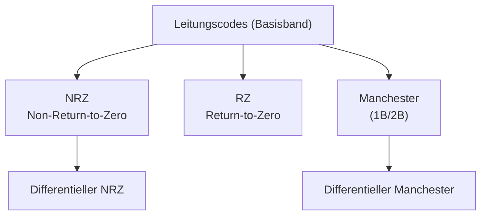
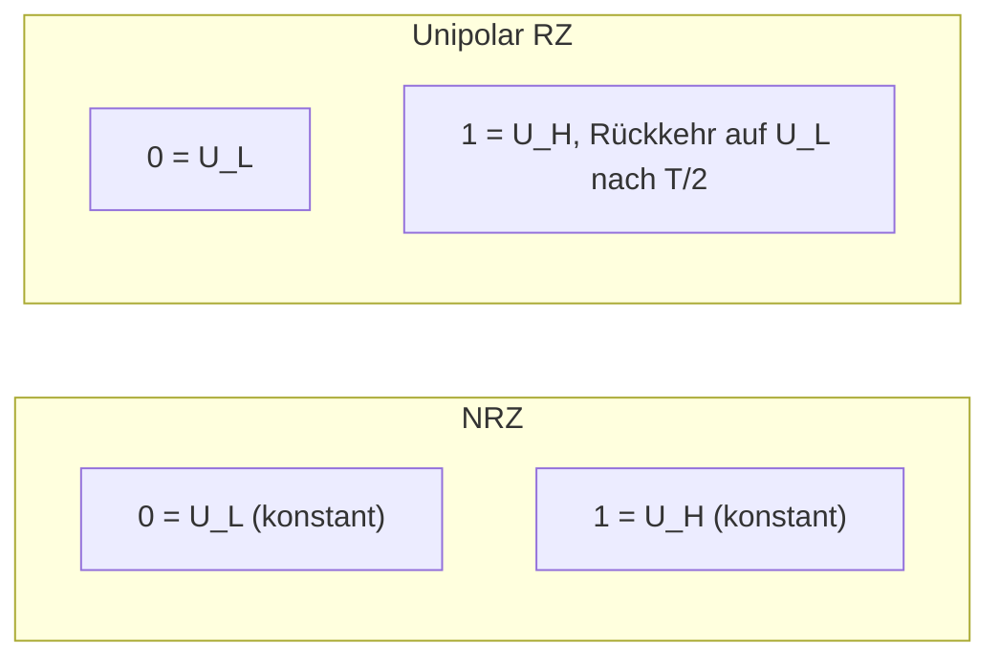
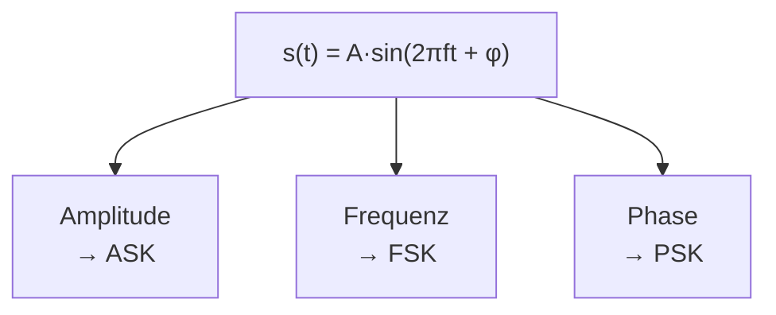
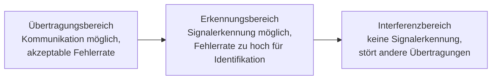
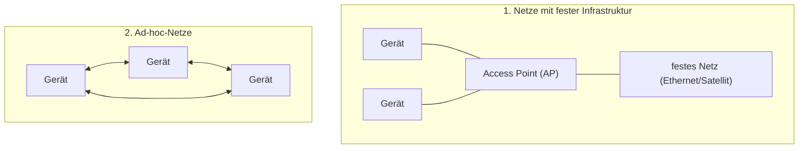
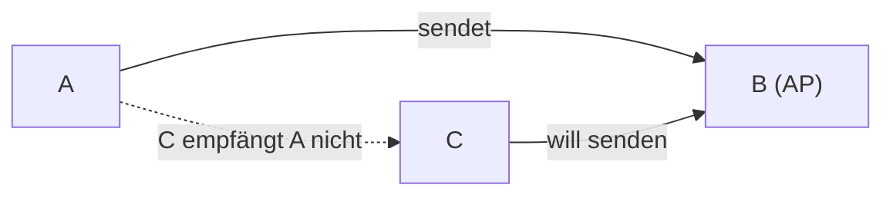
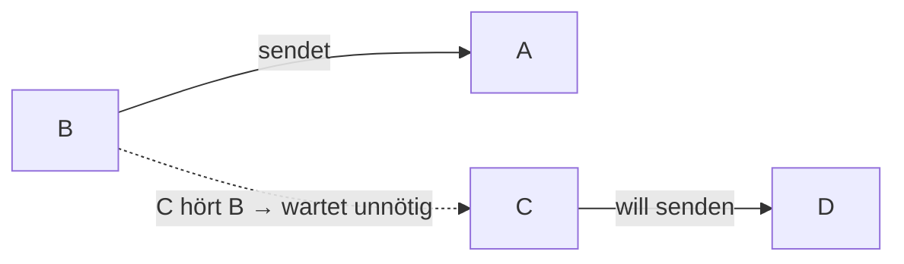
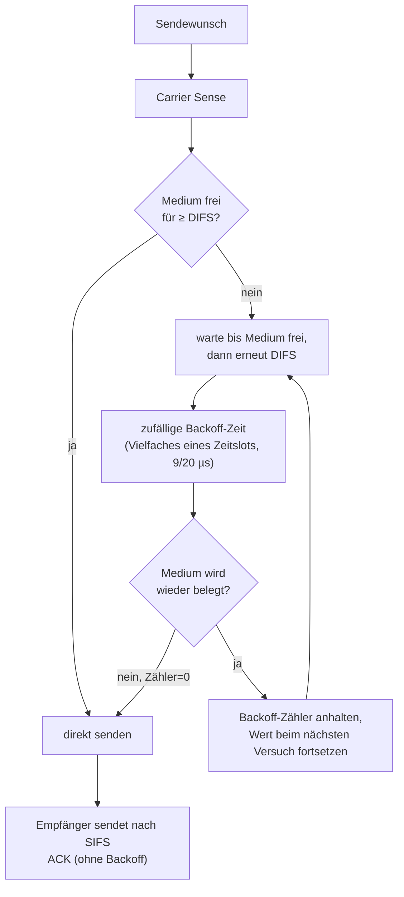
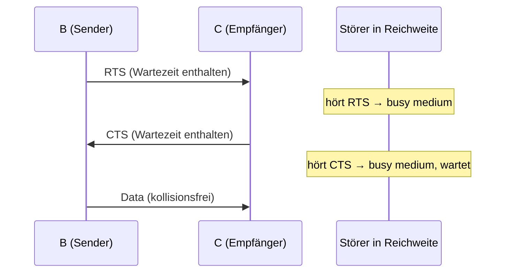

# 19 — Bitübertragungsschicht

**Folien:** [[kommunikationssysteme/resources/Kommunikationssysteme_19_Bituebertragungsschicht.pdf|Kommunikationssysteme_19_Bituebertragungsschicht.pdf]]
**Selbstkontrolle:** [[kommunikationssysteme/selbstkontrolle/komsys-selbstkontrolle-12|Selbstkontrolle 12]]

## Inhaltsverzeichnis

- [[#Kodierung von Informationen|Kodierung von Informationen]]
- [[#Basisband und Breitband|Basisband und Breitband]]
- [[#Anforderungen an Leitungscodes|Anforderungen an Leitungscodes]]
- [[#Baud-Rate vs. Bit-Rate|Baud-Rate vs. Bit-Rate]]
- [[#Leitungscodes im Basisband|Leitungscodes im Basisband]]
- [[#Manchester-Code|Manchester-Code]]
- [[#Verbessertes Line-Coding: 4B/5B und 8B/10B|Verbessertes Line-Coding: 4B/5B und 8B/10B]]
- [[#Breitbandkommunikation: Modulation|Breitbandkommunikation: Modulation]]
- [[#Fortgeschrittene Modulation: QPSK und QAM|Fortgeschrittene Modulation: QPSK und QAM]]
- [[#Grenzen der Übertragung (Shannon)|Grenzen der Übertragung (Shannon)]]
- [[#Signalausbreitung bei Funk|Signalausbreitung bei Funk]]
- [[#WLAN — Drahtloses Ethernet|WLAN — Drahtloses Ethernet]]
- [[#Medienzugriff bei WLAN|Medienzugriff bei WLAN]]
- [[#Hidden- und Exposed-Station-Problem|Hidden- und Exposed-Station-Problem]]
- [[#CSMA/CA im Detail|CSMA/CA im Detail]]
- [[#RTS/CTS-Handshake|RTS/CTS-Handshake]]
- [[#Fragen zur Selbstkontrolle|Fragen zur Selbstkontrolle]]

---

## Kodierung von Informationen

Die Bitübertragungsschicht (**Schicht 1**, Physical Layer) kümmert sich um die **physikalische Darstellung von Digitalsignalen** auf dem Medium.

> [!quote] Definition — Shannon
> „Das grundlegende Problem der Kommunikation besteht darin, an einer Stelle genau oder angenähert eine Nachricht wiederzugeben, die an einer anderen Stelle ausgewählt worden ist."
> Ziel ist eine **sinnvolle Darstellung der Information**.

Man unterscheidet zwei Codierungsarten:

| Codierungsart | Schicht | Aufgabe |
|---|---|---|
| **Kanalcodierung** | Schicht 2 und 4 | Sicherung gegen Übertragungsfehler durch fehlererkennende bzw. -korrigierende Codes (Redundanz) |
| **Leitungscodierung** | Schicht 1 | Physikalische Darstellung von Digitalsignalen (wie wird 0/1 auf dem Kanal repräsentiert) |

> [!tip] Merke
> Die Daten werden in **Codewörter** überführt, die den Eigenschaften des Übertragungskanals angepasst sind. Diese Vorlesung behandelt die **Leitungscodierung** — die physikalische Signalform.

---

## Basisband und Breitband

Die Übertragung von Informationen kann entweder auf dem **Basisband** oder auf dem **Breitband** erfolgen.

| | Basisband | Breitband |
|---|---|---|
| Prinzip | Digitale Informationen werden so übertragen, wie sie sind | Signale werden auf eine **Trägerwelle aufmoduliert** |
| Kodierung | Verfahren legt fest, wie 0/1 repräsentiert wird | Modulation von Amplitude/Frequenz/Phase |
| Parallelität | Nur **ein** Signal gleichzeitig | Mehrere Informationen gleichzeitig (verschiedene Trägerfrequenzen) |

> [!info] Hinweis
> Erst durch **optische Übertragungstechniken, DSL und Funknetze** wurde die Breitbandtechnik verbreitet.

---

## Anforderungen an Leitungscodes

Grundfrage: *Wie sollen digitale Signale z.B. auf Kupferkabel elektrisch repräsentiert werden?*

- **Widerstandsfähigkeit gegen Dämpfung** — das Signal muss auch nach Störungen erkennbar bleiben.
- **Effizienz** — möglichst hohe Übertragungsraten durch mehrwertige Codewörter:
  - binärer Code: +5V / −5V (2 Zustände)
  - ternärer Code: +5V / 0V / −5V (3 Zustände)
  - quaternärer Code: 4 Zustände (Kodierung von 2 Bit gleichzeitig)
- **Taktrückgewinnung** beim Empfänger (**Synchronisation**) — dazu möglichst **häufige Pegelwechsel**.
- **Gleichstromfreiheit** — positive und negative Signale treten ungefähr gleich oft auf.

> [!warning] Achtung
> Diese Anforderungen stehen teils im Konflikt: mehr Pegelwechsel für die Taktrückgewinnung kosten Bandbreite (siehe Manchester), mehrwertige Codes erhöhen die Effizienz, sind aber störanfälliger.

---

## Baud-Rate vs. Bit-Rate

Ist die Zeitdauer (Schrittdauer) eines Codeelements (Symbols) $T$, so ist die **Schrittgeschwindigkeit** (Symbolrate):

$$v_s = \frac{1}{T} \quad (\text{Einheit: } \textbf{Baud})$$

Die Übertragungsgeschwindigkeit (äquivalente **Bitrate**) ist dann:

$$v_u = v_s \cdot \mathrm{ld}\, n \qquad (n = \text{Anzahl diskreter Kennzustände des Codeelements})$$

wobei $\mathrm{ld} = \log_2$. Allgemein gilt also $v_{bit} = v_{Baud}\cdot\log_2(M)$ mit $M$ = Anzahl der Symbolzustände.

> [!tip] Merke
> Bei **binären** Codeelementen ($n=2$) stimmen **Bitrate und Baudrate überein**. Wir übertragen also nicht die Datenbits direkt, sondern **Symbolbits** — hierbei handelt es sich um eine Codierung!

> [!example] Beispiel
> Ein quaternärer Code hat $n=4$ Zustände. Pro Symbol werden $\log_2 4 = 2$ Bit übertragen. Bei einer Schrittgeschwindigkeit von 1000 Baud ergibt sich eine Bitrate von $1000 \cdot 2 = 2000$ bit/s.

---

## Leitungscodes im Basisband

### NRZ — Non-Return-to-Zero

Eine Spannung von 0 kommt nie vor:

- `0` ⇒ negative Spannung (konstant −5V)
- `1` ⇒ positive Spannung (konstant +5V)

**Nachteil:** bei langen 0- oder 1-Folgen **Taktverlust** und **keine Gleichstromfreiheit**. Werden allerdings Symbole (Line Coding) verwendet, ist die Taktrückgewinnung möglich.

### Differentieller NRZ

- `0` ⇒ kein Polaritätswechsel
- `1` ⇒ Polaritätswechsel

**Nachteil:** Taktverlust und keine Gleichstromfreiheit bei langen 0-Folgen (Line Coding als Lösung).

### NRZI — Non-Return-to-Zero Inverted

Wie NRZ, jedoch **Umkehrung der Wertzuordnung**. Ebenfalls nicht gleichstromfrei, keine Taktrückgewinnung.

### Unipolarer RZ — Return-to-Zero

- `0` ⇒ $U_L$
- `1` ⇒ $U_H$, danach Rückkehr auf $U_L$ nach $T/2$

Nicht gleichstromfrei, keine Taktrückgewinnung, aber **Taktinformation in 1-Folgen** (durch die Rückkehr auf Null entsteht bei jeder 1 eine Flanke).

| Code | Gleichstromfrei | Taktrückgewinnung | Bemerkung |
|---|---|---|---|
| NRZ | nein | nein (nur mit Line Coding) | Pegel konstant über volle Bitdauer |
| Differentiell NRZ | nein | nein | 1 = Wechsel, 0 = kein Wechsel |
| NRZI | nein | nein | invertierte Wertzuordnung |
| Unipolar RZ | nein | nur in 1-Folgen | Rückkehr auf Ruhepegel nach T/2 |
| Manchester | **ja** | **ja** (selbsttaktend) | Wechsel in jeder Bitmitte, nur 50% Effizienz |

---

## Manchester-Code

Der Manchester-Code (**1B/2B-Code**) verhindert lange Folgen gleicher Signale durch einen **Pegelwechsel in der Mitte jedes Bits**. Damit sind **Taktrückgewinnung und Gleichstromfreiheit** gegeben; das Ende einer Übertragung wird leicht erkannt. Er besteht aus **zwei um 180° phasenverschobenen Signalelementen** $S_1$ und $S_2$.

> [!warning] Achtung — zwei widersprüchliche Standards
> Die Zuordnung von Bit zu Flankenrichtung ist je nach Standard **entgegengesetzt** definiert!

| Standard | `0` | `1` |
|---|---|---|
| **IEEE 802.3** | $U_H \rightarrow -U_H$ nach $T/2$ ($S_1$) | $-U_H \rightarrow U_H$ nach $T/2$ ($S_2$) |
| **G.E. Thomas (Tanenbaum)** | Polaritätswechsel von negativ (−5V) nach positiv (+5V) | Polaritätswechsel von positiv (+5V) nach negativ (−5V) |

**Nachteil:** durch den Pegelwechsel in der Mitte wird die Kapazität **nur zur Hälfte** genutzt (50% Effizienz). Es gilt: **Taktrate = 2 × Schrittgeschwindigkeit ⇒ höhere Bandbreite erforderlich**.

> [!example] Beispiel — Bits → Manchester-Signal (IEEE 802.3)
> Datenfolge `0 1 1 0`, high = +5V, low = −5V. Jeder Bitzeitraum wird halbiert; die Flanke liegt in der Bitmitte.
>
> | Bit | 1. Hälfte | Flanke (Mitte) | 2. Hälfte |
> |---|---|---|---|
> | `0` | high (+5V) | ↓ | low (−5V) |
> | `1` | low (−5V) | ↑ | high (+5V) |
> | `1` | low (−5V) | ↑ | high (+5V) |
> | `0` | high (+5V) | ↓ | low (−5V) |
>
> **Zurückwandeln:** Der Empfänger liest an der **Richtung des Pegelwechsels in der Bitmitte** das Datenbit ab — high→low ⇒ `0`, low→high ⇒ `1` (bei G.E. Thomas umgekehrt).

### Differentieller Manchester-Code

Wie beim Manchester-Code erfolgt ein Pegelwechsel in der Bitmitte, zusätzlich gilt:

- `0` ⇒ Polaritätswechsel **am Taktanfang**
- `1` ⇒ **kein** Polaritätswechsel zwischen aufeinanderfolgenden Bits

Ebenfalls gleichstromfrei und selbsttaktend.

> [!info] Hinweis — Codeverletzungen
> Da beim Differential Manchester der Pegelwechsel **in der Taktmitte zwingend stattfinden muss**, lässt sich sein Fehlen als absichtliche **Codeverletzung** (J-/K-Symbole) für Steuerzwecke nutzen (Erkennung von Rahmengrenzen).

---

## Verbessertes Line-Coding: 4B/5B und 8B/10B

**Nachteil des Manchester-Codes:** nur 50% Effizienz (1B/2B, ein Bit auf zwei „Baud" kodiert).

### 4B/5B-Code

- **Vier Daten-Bit werden in fünf Symbolbits kodiert ⇒ 80% Effizienz.**
- Arbeitsweise: Pegelwechsel bei `1`, kein Pegelwechsel bei `0` (differentieller NRZ-Code mit Line Encoding).
- Kodierung hexadezimaler Zeichen (0…9, A…F, also 4 Bit) in 5 Bit, so dass lange Nullblöcke vermieden werden.
- Auswahl der **günstigsten 16 der möglichen 32 Codewörter** — Kriterium: **maximal 3 Nullen in Folge** (Worst Case `11100|01110`).
- Weitere 5-Bit-Kombinationen dienen als **Steuerinformationen** (z.B. J/K-Starting Delimiter, T-Ending Delimiter, Idle/Quiet/Halt-Line-State).
- Taktrückgewinnung über zeitlichen Abstand der Flanken — spätestens nach 4 Bit gibt es einen Wechsel.

> [!info] Hinweis — MLT-3
> MLT-3 verwendet drei Spannungspegel (positiv, null, negativ). Die Signalpegel wechseln zyklisch, aber **nur bei einer logischen 1** im Datenstrom.

### 8B/10B-Code

Einsatz beim **Gigabit Ethernet**. Effizienz entspricht dem 4B/5B-Code (80%), bietet aber Vorteile:

- **Gleichstromfreiheit (DC-Balance)**
- Einfache Taktrückgewinnung durch regelmäßige Flanken
- **Fehlererkennung** durch ungültige Codes
- Einfache Hardware-Implementierung

Wie bei 4B/5B: begrenzte Lauflänge (maximale Folge gleicher Bits) und Unterstützung von Steuerzeichen für Protokollfunktionen.

---

## Breitbandkommunikation: Modulation

Bei der Breitbandkommunikation muss das **digitale** Signal auf ein **analoges** Trägersignal **aufmoduliert** werden. Daten werden physikalisch als elektromagnetische Wellen dargestellt:

$$s(t) = A\cdot\sin(2\pi f t + \varphi)$$

- **A**: Amplitude
- **f**: Frequenz
- **φ**: Phase

Jeder dieser drei Parameter kann zur Modulation verwendet werden:

| Verfahren | Parameter | Prinzip | Eigenschaften |
|---|---|---|---|
| **ASK** (Amplitude Shift Keying) | Amplitude | 1 = große Amplitude, 0 = kleine Amplitude | Technisch einfach, üblich bei optischer Übertragung; **störanfällig** wegen Abschwächung des Signals |
| **FSK** (Frequency Shift Keying) | Frequenz | Für 0 und 1 verschiedene Frequenzen | Verschwenderischer Umgang mit Frequenzen; z.B. Telefonübertragung |
| **PSK** (Phase Shift Keying) | Phase | Unterschiedliche Phasenlagen für 0 und 1 (z.B. 180° Phasenshift) | Komplexe Demodulation; **störungssicher**; in drahtloser Kommunikation oft bevorzugt |

> [!tip] Merke
> **PSK ist störungssicherer als ASK**, weil die Information in der **Phase** statt in der leicht durch Dämpfung verfälschten Amplitude steckt.

---

## Fortgeschrittene Modulation: QPSK und QAM

### BPSK (Binary Phase Shift Keying)

- = einfaches PSK. Bitwert 0: Sinuswelle, Bitwert 1: invertierte Sinuswelle.
- Niedrige Datenraten, robuste Übertragung. Oft auch als differentieller Code (DBPSK).

### QPSK (Quaternary Phase Shift Keying)

Die Umtastung kann **mehr als 2 Phasen** umfassen — es kann zwischen $M$ verschiedenen Phasen umgetastet werden, wobei $M$ eine **Zweierpotenz** sein muss. Dadurch werden mehr Informationen gleichzeitig übermittelt.

- Umtastung zwischen **4 Phasen** ⇒ 4 Zustände ⇒ **2 Bit auf einmal** kodiert.
- Damit **doppelte** Übertragungsrate gegenüber BPSK.
- Beschreibung über I/Q-Komponenten: $I = A\cos\varphi$ (In-Phase, in Phase mit Trägersignal), $Q = A\sin\varphi$ (Quadratur-Phase, senkrecht zur Trägerphase).

### QAM (Quadrature Amplitude Modulation)

- **Kombination aus ASK und QPSK** (Amplitude + Phase).
- $n$ Bit können gleichzeitig übertragen werden ($n=2$ ist QPSK).
- Die Bitfehlerrate steigt mit zunehmendem $n$, aber **weniger als bei vergleichbaren reinen PSK-Verfahren**.

> [!example] Beispiel — 16-QAM (4 Bit pro Signal)
> Im Konstellationsdiagramm gilt z.B.: `0011` und `0001` haben **gleiche Phase, aber unterschiedliche Amplitude**; `0000` und `0010` haben **gleiche Amplitude, aber unterschiedliche Phase**. Es werden also beide Parameter gleichzeitig ausgenutzt.

| | QPSK | QAM |
|---|---|---|
| Variierte Parameter | nur Phase (4 Phasenlagen) | Amplitude **und** Phase |
| Bit pro Symbol | 2 | n (frei, z.B. 4 bei 16-QAM) |
| Amplitude | konstant | mehrere Stufen |
| Fehlerrate | — | geringer als reines M-PSK bei gleichem n |

---

## Grenzen der Übertragung (Shannon)

> [!tip] Merke — „Es gibt keine eierlegende Wollmilchsau"
> Die in einem Abtastvorgang modulierbare Information hängt von einem **ausreichenden Signal-Rauschabstand** ab.

- Der Signal-Rauschabstand lässt sich durch **erhöhte Sendeleistung** verstärken, jedoch ist die **Leistungsflussdichte** im freien Raum umgekehrt proportional zum **Quadrat der Entfernung**: bei Verdoppelung der Distanz nur noch ein Viertel, bei **Verzehnfachung** sogar nur ein **Hundertstel** des Ausgangswertes.
- Nach **Shannon** ist die Bandbreite begrenzt durch den Faktor $\log_2(1 + \text{Signalrauschabstand})$.

> [!example] Beispiel
> Eine Telefonleitung mit 30 dB Rauschabstand und einer Bandbreite von 3 kHz kann maximal ca. **30000 bit/s** übertragen.

- Höhere Frequenzen verhalten sich ähnlich wie Licht — damit wird eine **Sichtverbindung** benötigt.

---

## Signalausbreitung bei Funk

Im freien Raum breitet sich das Signal geradlinig aus; die **Empfangsleistung ist proportional zu $1/d^\alpha$** ($d$ = Abstand Sender–Empfänger):

| Umgebung | α |
|---|---|
| freier Raum | 2 |
| Stadt | 2.7 – 5 |
| Gebäude | 4 – 6 |

Werte für $\alpha > 2$ ergeben sich durch Dämpfung, Reflexion, Streuung, Beugung. Anhand der Empfangsleistung ergeben sich drei konzentrische Bereiche:

### Mehrwegausbreitung

Faktoren, die die Ausbreitung beeinflussen: natürliche Umgebung (Gebirge, Wasser, Vegetation, Regen, Schnee) und künstliche Umgebung (Gebäude).

**Ausbreitungsmechanismen:** Dämpfung/Abschattung (Regen, Vegetation), Beugung/Ablenkung an scharfen und runden Kanten, Reflexion an großen Flächen, Streuung an kleinen Hindernissen, Brechung (Brechungsindex sinkt mit zunehmender Höhe).

**Wirkung:**
- Der Empfänger erhält ein Signal auf **mehreren Wegen** zugleich.
- Abschwächung der Sendeleistung bei Reflexion, Beugung, …
- Dasselbe Signal wird mit **verschiedenen Phasenlagen** empfangen ⇒ Interferenz.
- Das Signal wird **zeitlich gestreut** ⇒ Interferenz mit Nachbarsymbolen.

> [!warning] Achtung — Konsequenz
> Drahtlose Netze benötigen ausgeklügelte Mechanismen zur Fehlerkorrektur (**Forward Error Correction**), wofür Kanalleistung bereitgestellt werden muss. Der **Kommunikations-Overhead liegt erheblich über dem kabelgebundener Übertragung**.
> **Daumenregel:** Protokolle zur zuverlässigen Datenübertragung können oft nur **2/3** der verfügbaren drahtlosen Übertragungsrate tatsächlich nutzen.

---

## WLAN — Drahtloses Ethernet

WLAN ist das drahtlose Äquivalent zu Ethernet („Wireless LAN") — eine ausschließlich datenorientierte, breitbandige Internetzugangslösung, standardisiert von der IEEE als **IEEE 802.11**.

| Standard | Jahr | Datenrate (brutto) | Band / Besonderheit |
|---|---|---|---|
| 802.11 | 1997 | max. 2 Mb/s | — |
| 802.11a | — | 54 Mb/s | 5 GHz-Band (störanfälliger), größere Kapazität |
| 802.11b | 1999 | 11 Mb/s (Nutzdaten bis 6 Mb/s) | 2.4 GHz |
| 802.11g | — | bis 54 Mb/s | 2.4 GHz, orthogonale Frequenzbereiche |
| 802.11n | — | bis 600 Mb/s | **MIMO** (Spatial Diversity über ≥3 Antennen), optional 5 GHz |

> [!tip] Merke — Frequenzbänder & Raten
> WLAN nutzt das **lizenzfreie 2.4 GHz-ISM-Band** (2.4–2.4835 GHz, ISM = Industrial–Scientific–Medical) und optional das **5 GHz-Band**. Die **Nutzdatenrate ist nur etwa die Hälfte** der jeweiligen Bruttorate.

### Aufbau eines WLAN

- **Infrastruktur-Netze:** zentraler **Access Point (AP)**, drahtlose Geräte kommunizieren nur mit dem AP. Kontrollfunktionen (Medienzugriff, Mobilitätsmanagement, Authentisierung) liegen in der Infrastruktur — die Geräte brauchen nur ein Minimum an Funktionalität.
- **Ad-hoc-Netze:** keine Infrastruktur, Geräte kommunizieren direkt miteinander. Höhere Komplexität der Geräte, da jedes alle Zugriffs- und Kontrollmechanismen implementieren muss.

### Übertragungskanäle

Das gesamte Frequenzspektrum wird in feste Bereiche (**Kanäle**) unterteilt. Um Interferenzen zu vermeiden, müssen **Schutzabstände zwischen den Kanälen** eingehalten werden; einem AP wird ein Kanal zugewiesen.

- In IEEE 802.11b sind die Kanäle je **22 MHz** breit — **13 Kanäle in Deutschland** (2412, 2417, …, 2472 MHz), 11 in USA/Kanada.
- Kanäle belegen nie genau eine Frequenz, sondern „streuen" auf benachbarte Frequenzen ⇒ sie **überlappen**. Nicht-überlappende Wahl im Idealfall: nur **Kanäle 1, 7 und 13**.
- **Signalspreizung:** die Sendung wird mit einem Code überlagert, der das Signal über den gesamten 22-MHz-Bereich „verschmiert" (faktisch mehrere Frequenzen). Nutzen: ist ein Teil des Bereichs gestört, kommt dennoch genug Signal durch. Benachbarte Subkanäle senden in orthogonal zueinander stehenden Wellen.

### Durchsatz eines WLAN

- Mit wachsender Entfernung nimmt die Durchsatzrate ab — faktisch wird die **Modulationsart angepasst**.
- Hohe Übertragungsraten nur in Radien von ~10m; bereits bei ~30m liegt die 802.11g-Rate bei 11 Mb/s. Bautechnische Hindernisse reduzieren dies zusätzlich.
- **Keine Mobilität** (relative Geschwindigkeit etwa 50 km/h → 802.11p).
- **MIMO** (Multiple-Inputs-Multiple-Outputs, 802.11n): mehrere Antennen als Gruppe ⇒ stärkeres Empfangssignal, größere Distanzen bei gleichem Durchsatz bzw. höhere Datenraten bei gleicher Entfernung; zusätzlich Richtwirkung.

---

## Medienzugriff bei WLAN

### Warum kein CSMA/CD?

Beim kabelgebundenen **CSMA/CD** wird vor der Übertragung gehorcht, ob jemand sendet, und **während** der Übertragung, ob jemand parallel sendet (Kollisionserkennung).

> [!warning] Achtung — Probleme bei drahtloser Kommunikation
> - Es ist sehr schwierig (teuer), **gleichzeitig zu senden und zu empfangen** ⇒ Kollisionserkennung (CD) kann nicht durchgeführt werden.
> - Eine Kollision tritt beim **Empfänger** auf, aber nicht notwendigerweise beim **Sender** ⇒ „Broadcastnetz" ohne garantierten Empfang aller Übertragungen ⇒ **Hidden Station**.

Daher wird bei WLAN **CSMA/CA** (Carrier Sense Multiple Access with **Collision Avoidance**) verwendet: Kollisionen können nicht erkannt werden, darum wird versucht, sie zu **vermeiden** — Carrier Sense mit einem **zufallsgetriebenen Backoff-Mechanismus**.

---

## Hidden- und Exposed-Station-Problem

### Hidden Station

- A sendet an B, **C empfängt A nicht**.
- C will an B senden und stellt per Carrier Sense ein freies Medium fest (**CS schlägt fehl**), sendet los.
- **Kollision bei B**, die A nicht bemerkt (**CD schlägt fehl**).
- A ist für C **hidden** (versteckt).

### Exposed Station

- B sendet an A, C will an D senden.
- C muss warten, da Carrier Sense ein **besetztes** Medium signalisiert.
- Da A aber **außerhalb der Reichweite von C** ist, ist dies **unnötig** — das Signal von C würde auf dem Weg zu A im Rauschen untergehen. C verschenkt eine mögliche parallele Übertragung.

---

## CSMA/CA im Detail

### Gestaffelte Zugriffskonzepte (Inter Frame Space)

Prioritäten werden durch **Staffelung von Zugriffszeitpunkten** erreicht — keine garantierten Prioritäten, aber wichtige Nachrichten bekommen eher Zugriff. Einteilung in Zyklen mit drei Intervallen (**Inter Frame Space, IFS**):

| IFS | Zweck | Dauer |
|---|---|---|
| **SIFS** (Short IFS) | Bestätigungsnachrichten (ACK) | 10 – 16 µs |
| **PIFS** (Point Controlled IFS) | Aktionen des AP beim Polling | 19 – 30 µs |
| **DIFS** (Distributed Control IFS) | Datenübertragung | 28 – 50 µs |

Beacon-Frames werden regelmäßig zur Synchronisation verschickt. Kürzere Wartezeit = höhere Priorität (deshalb ACKs mit SIFS zuerst).

### Ablauf der Kollisionsvermeidung

- **Vor dem Senden: Carrier Sense.** Ist das Medium mindestens für die Dauer **DIFS** frei, starte direkt mit der Übertragung.
- Ist das Medium belegt: warte beim Freiwerden erneut für DIFS, wähle dann eine **Backoff-Zeit** (Vielfaches eines Zeitslots, 9/20 µs) vor dem nächsten Zugriffsversuch (Kollisionsvermeidung). Das ist das **Wettbewerbsfenster**.
- Wird das Medium während des Backoffs wieder belegt: **Backoff-Zähler anhalten** und den aktuellen Wert beim nächsten Versuch weiterverwenden (Fairness).
- Ist das Medium nach Ablauf der Backoff-Zeit noch frei: starte mit der Übertragung.

### Quittungen (ACK)

> [!tip] Merke
> Da Kollisionen nicht erkannt werden können, wird **jede Übertragung quittiert**: direkte Bestätigung jedes korrekten Datenrahmens. Weil das ACK wichtige Kontrollinformation ist, wird es bereits nach **SIFS ohne jegliches Backoff** versendet — so kommt keine andere Station dazwischen.

> [!success] Best Practice — Was ist implementiert?
> **Muss: Backoff-Mechanismus.** RTS/CTS-Mechanismus und Polling sind **optional**. RTS/CTS ist meist implementiert, aber **deaktiviert**: es erzeugt Overhead und ist daher schlecht für kleine Rahmen geeignet. Über einen Schwellwert werden nur Rahmen oberhalb einer Größe mit RTS/CTS übertragen (Standard: Schwellwert = maximale Rahmengröße ⇒ deaktiviert).

---

## RTS/CTS-Handshake

Optionale Erweiterung für **echte Kollisionsvermeidung**: Informiere alle Stationen in Reichweite über eine anstehende Übertragung — Handshake vor der Übertragung zur **Vermeidung des Hidden-Station-Problems**.

- **Request to Send (RTS):** Sender fragt beim Empfänger an, ob Übertragung möglich ist.
- **Clear to Send (CTS):** Empfänger informiert den Sender, dass Übertragung möglich ist.

- Potentielle Störer hören **entweder RTS oder CTS** und wissen, dass sie für eine bestimmte Zeit warten müssen (die Wartezeit ist in RTS und CTS enthalten).
- Wollen mehrere Stationen gleichzeitig senden, ist der **AP der Arbitrar**: er lässt nur einen Client ein RTS senden und bestätigt mit CTS. Alle anderen warten.
- **In der Praxis oft deaktiviert** (Overhead, nur oberhalb eines Rahmengrößen-Schwellwerts sinnvoll).

---

## Fragen zur Selbstkontrolle

Die kompakten Karteikarten finden sich unter [[kommunikationssysteme/selbstkontrolle/komsys-selbstkontrolle-12|Selbstkontrolle 12]].

**Erklären Sie den Begriff Leitungskodierung!**

Leitungskodierung ist die Aufgabe der Bitübertragungsschicht (Schicht 1): die **physikalische Darstellung von Digitalsignalen** auf dem Medium. Sie legt fest, wie eine 0 bzw. eine 1 als physikalisches Signal (z.B. als Spannungspegel auf Kupferkabel) repräsentiert wird, und überführt die Daten in **Codewörter (Symbole)**, die an die Eigenschaften des Übertragungskanals angepasst sind. Abzugrenzen ist sie von der Kanalcodierung (Schicht 2/4), die durch Redundanz gegen Übertragungsfehler sichert.

**Welche Anforderungen kennen Sie, die ein guter Leitungscode erfüllen sollte?**

- **Widerstandsfähigkeit gegen Dämpfung** — das Signal muss auch nach Störungen erkennbar bleiben.
- **Effizienz** — hohe Übertragungsraten durch mehrwertige Codewörter (binär/ternär/quaternär).
- **Taktrückgewinnung** (Synchronisation) beim Empfänger durch möglichst häufige Pegelwechsel.
- **Gleichstromfreiheit** — positive und negative Signale treten ungefähr gleich oft auf.

**Erklären Sie den Unterschied zwischen Basisband- und Breitband-Übertragung!**

Beim **Basisband** werden die digitalen Informationen so über die Leitung übertragen, wie sie sind; es kann nur ein Signal gleichzeitig übertragen werden, und man braucht nur Kodierungsverfahren, die 0 und 1 physikalisch repräsentieren. Beim **Breitband** werden die die Information repräsentierenden Signale auf eine **Trägerwelle aufmoduliert**; durch verschiedene Trägerfrequenzen können mehrere Informationen gleichzeitig übermittelt werden.

**Wieso spricht man von Symbolen bei der physikalischen Übertragung und nicht von Bits?**

Weil nicht die Datenbits direkt, sondern **Symbolbits (Codeelemente)** übertragen werden. Ein Symbol kann mehrere diskrete Kennzustände annehmen (z.B. ternär mit 3 oder quaternär mit 4 Zuständen) und dadurch mehrere Datenbits gleichzeitig transportieren. Die Zuordnung von Datenbits zu Symbolen ist selbst eine Codierung — deshalb ist der Begriff „Symbol" allgemeiner und physikalisch korrekter als „Bit".

**Erklären Sie den Unterschied zwischen Bit- und Baudrate!**

Die **Baudrate** (Schrittgeschwindigkeit / Symbolrate) ist $v_s = 1/T$, wobei $T$ die Schrittdauer eines Codeelements ist — sie zählt die **Symbole pro Sekunde**. Die **Bitrate** ist $v_u = v_s \cdot \mathrm{ld}\,n$ mit $n$ = Anzahl diskreter Kennzustände eines Symbols — sie zählt die **Datenbits pro Sekunde**. Nur bei **binären** Codeelementen ($n=2$, also $\log_2 2 = 1$) stimmen Bit- und Baudrate überein; bei mehrwertigen Codes ist die Bitrate ein Vielfaches der Baudrate.

**Was ist der Unterschied zwischen einem NRZ- und einem RZ-Code?**

Beim **NRZ** (Non-Return-to-Zero) bleibt der Pegel über die gesamte Bitdauer konstant und kehrt nie auf den Ruhepegel (0) zurück (z.B. 0 = −5V, 1 = +5V). Bei langen gleichen Folgen entstehen dadurch Taktverlust und fehlende Gleichstromfreiheit. Beim **RZ** (Return-to-Zero) kehrt das Signal innerhalb eines Bits (nach $T/2$) wieder auf den Ruhepegel zurück — dadurch entsteht bei 1-Folgen Taktinformation (Flanken), was die Synchronisation erleichtert.

**Welche Eigenschaften besitzt der Manchester-Code? Wie unterscheiden sich die Standards nach G.E. Thomas und IEEE 802.3?**

Der Manchester-Code (1B/2B) legt in die **Mitte jedes Bits einen Pegelwechsel**. Dadurch ist er **gleichstromfrei und selbsttaktend** (Taktrückgewinnung immer möglich), und das Ende einer Übertragung wird leicht erkannt. Er besteht aus zwei um 180° phasenverschobenen Signalelementen $S_1$/$S_2$. Nachteil: nur **50% Effizienz**, da Taktrate = 2 × Schrittgeschwindigkeit ⇒ höhere Bandbreite nötig.

Die beiden Standards definieren die Bit-zu-Flanke-Zuordnung **entgegengesetzt**:
- **IEEE 802.3:** `0` = $U_H \rightarrow -U_H$, `1` = $-U_H \rightarrow U_H$ (jeweils nach $T/2$).
- **G.E. Thomas (Tanenbaum):** `0` = Wechsel negativ→positiv (−5V→+5V), `1` = positiv→negativ.

**Datenbits → Manchester und zurück:** Beim Kodieren wird jedem Bit das passende Signalelement ($S_1$ bzw. $S_2$) zugeordnet — z.B. IEEE 802.3 `0110` = high↓low, low↑high, low↑high, high↓low. Beim Dekodieren liest der Empfänger die **Richtung des Pegelwechsels in der Bitmitte** aus (high→low ⇒ 0, low→high ⇒ 1 bei IEEE 802.3; bei G.E. Thomas umgekehrt).

**Welche Vorteile hat ein 4B/5B Code gegenüber einem 1B/2B Code?**

Der 1B/2B-Code (Manchester) hat nur **50% Effizienz**. Der 4B/5B-Code kodiert **4 Datenbits in 5 Symbolbits** und erreicht damit **80% Effizienz**. Dabei werden aus den möglichen 32 die günstigsten 16 Codewörter ausgewählt (**maximal 3 Nullen in Folge**), sodass keine langen Nullblöcke entstehen und die Taktrückgewinnung erhalten bleibt (spätestens nach 4 Bit eine Flanke). Die überzähligen Codewörter dienen zusätzlich als **Steuerinformationen** (Delimiter, Line States).

**Welche Eigenschaften eines Trägersignals können zur Modulation verwendet werden?**

Die drei Parameter der Sinuswelle $s(t) = A\cdot\sin(2\pi f t + \varphi)$:
- **Amplitude A** → Amplitude Shift Keying (ASK)
- **Frequenz f** → Frequency Shift Keying (FSK)
- **Phase φ** → Phase Shift Keying (PSK)

Kombinationen mehrerer Parameter sind möglich (z.B. QAM = Amplitude + Phase).

**Welche Möglichkeiten kennen Sie, um bei einer Breitbandübertragung die Datenrate zu erhöhen?**

Man nutzt **höherwertige Modulation**, bei der pro Symbol mehr als ein Bit kodiert wird. Beispiele: mehr Phasenlagen wie bei **QPSK** (4 Phasen → 2 Bit/Symbol) bzw. allgemein M-PSK mit $M$ als Zweierpotenz, oder die Kombination von Amplitude und Phase in **QAM**, sodass $n$ Bit gleichzeitig übertragen werden. Dadurch steigt die Bitrate bei gleicher Baudrate.

**Warum ist PSK weniger störanfällig als z.B. ASK?**

ASK kodiert die Information in der **Amplitude**. Da die Signalstärke durch Dämpfung/Abschwächung auf dem Übertragungsweg stark schwankt, ist die Amplitude ein unzuverlässiger Informationsträger — ASK ist störanfällig. PSK dagegen kodiert die Information in der **Phasenlage** des Trägers, die von Amplitudenschwankungen unabhängig ist. Deshalb ist PSK robuster und in der drahtlosen Kommunikation oft bevorzugt (bei allerdings komplexerer Demodulation).

**Wie unterscheiden sich QPSK und QAM?**

**QPSK** (Quaternary Phase Shift Keying) ist eine reine **Phasenmodulation** mit 4 Phasenlagen bei konstanter Amplitude → 2 Bit pro Symbol. **QAM** (Quadrature Amplitude Modulation) ist eine **Kombination aus ASK und QPSK**: es werden **Amplitude und Phase** gleichzeitig variiert, wodurch $n$ Bit pro Symbol übertragen werden ($n=2$ ergibt genau QPSK, z.B. 16-QAM mit 4 Bit). Bei gleicher Bitzahl hat QAM eine **geringere Bitfehlerrate** als vergleichbare reine PSK-Verfahren, weil zwei Parameter zur Unterscheidung der Symbole zur Verfügung stehen.

**Welche Störeinflüsse gibt es bei der Datenübertragung mit Funkwellen?**

- **Dämpfung/Abschattung** (Regen, Vegetation, Gebäude), Empfangsleistung sinkt mit $1/d^\alpha$.
- **Reflexion** an großen Flächen, **Streuung** an kleinen Hindernissen, **Beugung/Ablenkung** an Kanten, **Brechung**.
- Folge ist **Mehrwegausbreitung**: das Signal erreicht den Empfänger auf mehreren Wegen, wird mit verschiedenen Phasenlagen empfangen (**Interferenz**) und **zeitlich gestreut** (Interferenz mit Nachbarsymbolen).

Daher benötigen Funknetze aufwändige Fehlerkorrektur (FEC) und haben deutlich höheren Overhead als Kabelnetze.

**Worin unterscheidet sich ein kabelgebundenes gemeinsames Medium (z.B. ein Bus bei 10Base2) von einem funkbasierten 'gemeinsamen' Medium (Luftraum bei WLAN)?**

Beim **Kabelbus** empfangen alle angeschlossenen Stationen dasselbe Signal, und Kollisionen sind überall im Netz erkennbar → Kollisionserkennung (CD) ist möglich. Beim **Funk-Medium** reicht das Signal je nach Position unterschiedlich weit — es ist ein „Broadcastnetz ohne garantierten Empfang aller Übertragungen". Eine Kollision tritt beim **Empfänger** auf, muss aber beim **Sender** nicht bemerkbar sein (Hidden Station), und gleichzeitiges Senden und Empfangen ist teuer. Deshalb kann keine Kollisionserkennung durchgeführt werden, und es treten Hidden-/Exposed-Station-Probleme auf.

**Wie groß sind typische Übertragungsraten beim WLAN? Welche Frequenzbänder werden benutzt?**

Bruttoraten reichen von 2 Mb/s (802.11, 1997) über 11 Mb/s (802.11b) und 54 Mb/s (802.11a/g) bis ~600 Mb/s (802.11n mit MIMO). Die **Nutzdatenrate ist nur etwa die Hälfte** der Bruttorate. Genutzt werden das lizenzfreie **2.4 GHz-ISM-Band** (2.4–2.4835 GHz) und optional das **5 GHz-Band** (störanfälliger, aber mehr Kapazität).

**Warum ist das CSMA/CD-Verfahren bei WLAN nur schwer anwendbar?**

CSMA/CD erfordert, dass eine Station **während** des Sendens gleichzeitig **empfängt**, um Kollisionen zu erkennen (Collision Detection). Drahtlos ist gleichzeitiges Senden und Empfangen aber sehr schwierig und teuer. Zudem tritt eine Kollision beim **Empfänger** auf, nicht notwendigerweise beim Sender (Hidden Station) — der Sender könnte sie also gar nicht bemerken. Deshalb wird stattdessen **CSMA/CA** (Collision Avoidance) verwendet.

**Erklären Sie das 'Hidden Station'-Problem bei WLAN!**

A sendet an B, aber C empfängt A nicht (A liegt außerhalb der Reichweite von C). C will ebenfalls an B senden und stellt per Carrier Sense fälschlich ein **freies Medium** fest (CS schlägt fehl), weil es A nicht hört. C sendet los, und bei B kommt es zur **Kollision**, die A nicht bemerkt (CD schlägt fehl). A ist für C **hidden** (versteckt) — daher der Name.

**Erklären Sie das 'Exposed-Station'-Problem bei WLAN!**

B sendet an A, und C möchte an D senden. C stellt per Carrier Sense ein **besetztes** Medium fest (es hört B) und wartet. Dieses Warten ist jedoch **unnötig**: A liegt außerhalb der Reichweite von C, sodass das Signal von C auf dem Weg zu A ohnehin im Rauschen unterginge und die Übertragung von C an D die Übertragung B→A gar nicht stören würde. C ist unnötig „exposed" und verschenkt so eine mögliche parallele Übertragung — es sinkt die Effizienz.

**Erklären Sie grob das Vorgehen bei CSMA/CA! Wie werden Kollisionen verhindert?**

CSMA/CA (Carrier Sense Multiple Access with Collision Avoidance):
1. **Carrier Sense** vor dem Senden. Ist das Medium für mindestens **DIFS** frei, wird direkt gesendet.
2. War das Medium belegt: nach dem Freiwerden erneut **DIFS** warten, dann eine **zufällige Backoff-Zeit** (Vielfaches eines Zeitslots, 9/20 µs) im Wettbewerbsfenster würfeln.
3. Wird das Medium während des Backoffs wieder belegt, wird der **Backoff-Zähler angehalten** und beim nächsten Versuch mit dem aktuellen Wert fortgesetzt (Fairness).
4. Ist das Medium nach Ablauf der Backoff-Zeit noch frei, wird gesendet.
5. Jeder korrekt empfangene Datenrahmen wird nach **SIFS** (kürzer als DIFS, ohne Backoff) mit einem **ACK** quittiert, da Kollisionen sonst nicht erkennbar wären.

**Kollisionen werden vermieden** durch (a) den zufälligen Backoff (zwei wartende Stationen würfeln mit hoher Wahrscheinlichkeit verschiedene Zeiten) und (b) optional den **RTS/CTS-Handshake**, mit dem alle Stationen in Reichweite über eine anstehende Übertragung informiert werden — dies adressiert insbesondere das Hidden-Station-Problem.
