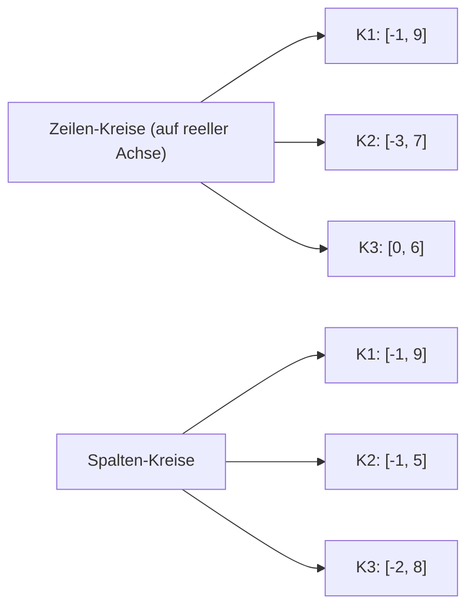

# Loesungen — Blatt 6

**Aufgaben:** [[numerik/exercises/06/num-exercise-06|Uebung 6]]
**PDF:** [[numerik/exercises/06/num-solution-06.pdf|num-solution-06.pdf]]
**Quellcode:** `numerik/repos/numerik/blatt06/`

---

## Inhaltsverzeichnis

- [[#Aufgabe 1 — CG-Verfahren auf der Membran-Matrix|Aufgabe 1 — CG-Verfahren auf der Membran-Matrix]]
- [[#Aufgabe 2 — Gerschgorin-Kreise|Aufgabe 2 — Gerschgorin-Kreise]]
- [[#Aufgabe 3 — Eigenwertabschaetzung fuer symmetrische Matrizen|Aufgabe 3 — Eigenwertabschaetzung fuer symmetrische Matrizen]]

---

## Aufgabe 1 — CG-Verfahren auf der Membran-Matrix

### Implementierung

Klassisches CG ohne Vorkonditionierer. Bei Sparse-Matrix bitte `A.dot(p)` statt `A @ p`.

```python
import numpy as np

def cg(A, b, tol=1e-6, max_iter=None):
    n = b.size
    if max_iter is None: max_iter = 10 * n
    x = np.zeros(n)
    r = b - A.dot(x)
    p = r.copy()
    r_dot = r @ r
    r0_norm = np.sqrt(r_dot)
    residuals = [1.0]
    for _ in range(max_iter):
        Ap = A.dot(p)
        alpha = r_dot / (p @ Ap)
        x += alpha * p
        r -= alpha * Ap
        r_dot_new = r @ r
        residuals.append(np.sqrt(r_dot_new) / r0_norm)
        if residuals[-1] < tol: break
        beta = r_dot_new / r_dot
        p = r + beta * p
        r_dot = r_dot_new
    return x, residuals
```

### Matrix `Ablock(m)`

```python
from scipy.sparse import diags, eye, kron, csr_matrix

def Ablock(m):
    B = diags([-1.0, 4.0, -1.0], [-1, 0, 1], shape=(m, m), format='csr')
    L_off = diags([1.0, 1.0], [-1, 1], shape=(m, m), format='csr')
    A = kron(eye(m), B) - kron(L_off, eye(m))
    return csr_matrix(A)
```

### Ergebnisse

| $m$ | $n = m^2$ | Iterationen | Endresiduum $\|r_k\|/\|r_0\|$ |
|---|---|---|---|
| 50  | 2500  | **79**  | $9.64 \cdot 10^{-7}$ |
| 100 | 10000 | **159** | $9.38 \cdot 10^{-7}$ |
| 200 | 40000 | **320** | $9.84 \cdot 10^{-7}$ |

Konvergenz-Plot: `blatt06/cg_residuen.png`. Verformte Membran: `blatt06/membran_m{50,100,200}.png`.

### Beobachtung

> [!tip] Merke
> Die Konditionszahl der Membran-Matrix waechst wie $\kappa(A) \sim \mathcal{O}(m^2)$. Aus der CG-Fehlerabschaetzung
> $$\|x - x_k\|_A \leq 2 \left(\frac{\sqrt{\kappa} - 1}{\sqrt{\kappa} + 1}\right)^k \|x - x_0\|_A$$
> folgt eine Iterationsanzahl in $\mathcal{O}(\sqrt{\kappa}) = \mathcal{O}(m)$ — exakt das beobachtete Verhalten (79 → 159 → 320, Verdopplung bei Verdopplung von $m$).

> [!warning] Achtung
> Bei der Sparse-Variante muss zwingend `A.dot(x)` verwendet werden — `A * x` liefert bei `scipy.sparse` ein **Skalarprodukt-aehnliches** Resultat bzw. erzeugt versehentlich eine dichte Matrix.

---

## Aufgabe 2 — Gerschgorin-Kreise

Gegeben:

$$A = \begin{pmatrix} 4 & -2 & 3 \\ 3 & 2 & -2 \\ 2 & -1 & 3 \end{pmatrix}.$$

### Zeilen-Kreise (Gerschgorin auf $A$)

$$K_i^{(Z)} = \{z \in \mathbb{C} : |z - a_{ii}| \leq R_i\}, \quad R_i = \sum_{j \neq i} |a_{ij}|.$$

| $i$ | Zentrum $a_{ii}$ | Radius $R_i$ | Intervall (reell) |
|---|---|---|---|
| 1 | $4$ | $|-2| + |3| = 5$ | $[-1, 9]$ |
| 2 | $2$ | $|3| + |-2| = 5$ | $[-3, 7]$ |
| 3 | $3$ | $|2| + |-1| = 3$ | $[0, 6]$ |

### Spalten-Kreise (Gerschgorin auf $A^T$)

| $j$ | Zentrum $a_{jj}$ | Radius $C_j$ | Intervall (reell) |
|---|---|---|---|
| 1 | $4$ | $|3| + |2| = 5$ | $[-1, 9]$ |
| 2 | $2$ | $|-2| + |-1| = 3$ | $[-1, 5]$ |
| 3 | $3$ | $|3| + |-2| = 5$ | $[-2, 8]$ |

### Abschaetzung der Eigenwerte

$$\sigma(A) \subseteq \left(\bigcup_i K_i^{(Z)}\right) \cap \left(\bigcup_j K_j^{(S)}\right).$$

- Zeilen-Vereinigung: $K_1^{(Z)} \cup K_2^{(Z)} \cup K_3^{(Z)}$ ergibt fuer reelle EW $[-3, 9]$.
- Spalten-Vereinigung: $K_1^{(S)} \cup K_2^{(S)} \cup K_3^{(S)}$ ergibt $[-2, 9]$.
- **Schnitt:** $\sigma(A) \subseteq [-2, 9]$.



> [!tip] Merke
> Spalten-Kreise liefern oft **engere** Schranken als Zeilen-Kreise (oder umgekehrt). Im Schnitt erhaelt man die tightere Aussage.

---

## Aufgabe 3 — Eigenwertabschaetzung fuer symmetrische Matrizen

### (a) Beweis

Sei $A$ symmetrisch. Dann existiert eine **orthonormale** Basis $\{v_1, \ldots, v_n\}$ aus Eigenvektoren von $A$ mit $A v_i = \lambda_i v_i$. Schreibe $x = \sum_{i=1}^n c_i v_i$ mit $c_i \in \mathbb{R}$.

**Norm von $x$:**

$$\|x\|_2^2 = \left\langle \sum_i c_i v_i, \sum_j c_j v_j \right\rangle = \sum_i c_i^2 \quad \text{(Orthonormalitaet)}.$$

**Berechnung von $d = Ax - \lambda x$:**

$$Ax = \sum_i c_i \lambda_i v_i, \quad d = \sum_i c_i (\lambda_i - \lambda) v_i.$$

**Norm von $d$:**

$$\|d\|_2^2 = \sum_i c_i^2 (\lambda_i - \lambda)^2.$$

Sei $\delta := \min_i |\lambda - \lambda_i|$. Dann ist $(\lambda_i - \lambda)^2 \geq \delta^2$ fuer alle $i$, also:

$$\|d\|_2^2 = \sum_i c_i^2 (\lambda_i - \lambda)^2 \geq \delta^2 \sum_i c_i^2 = \delta^2 \|x\|_2^2.$$

Daraus folgt $\delta \leq \|d\|_2 / \|x\|_2$. $\square$

> [!quote] Merke
> Diese Abschaetzung ist ein **Standardwerkzeug** fuer die Bewertung von Naeherungs-Eigenwerten und -vektoren. Ist das Residuum $d = Ax - \lambda x$ klein, so liegt $\lambda$ nahe an einem echten Eigenwert.

### (b) Anwendung

Gegeben $A = \begin{pmatrix} 6 & 4 & 3 \\ 4 & 6 & 3 \\ 3 & 3 & 7 \end{pmatrix}$, $\lambda = 12$, $x = (3, 4, 5)^T$.

**$Ax$ berechnen:**

$$Ax = \begin{pmatrix} 6 \cdot 3 + 4 \cdot 4 + 3 \cdot 5 \\ 4 \cdot 3 + 6 \cdot 4 + 3 \cdot 5 \\ 3 \cdot 3 + 3 \cdot 4 + 7 \cdot 5 \end{pmatrix} = \begin{pmatrix} 49 \\ 51 \\ 56 \end{pmatrix}.$$

**$d$ und Normen:**

$$\lambda x = 12 \cdot (3, 4, 5)^T = (36, 48, 60)^T,$$

$$d = Ax - \lambda x = (49 - 36, 51 - 48, 56 - 60)^T = (13, 3, -4)^T.$$

$$\|d\|_2 = \sqrt{169 + 9 + 16} = \sqrt{194} \approx 13.928.$$

$$\|x\|_2 = \sqrt{9 + 16 + 25} = \sqrt{50} = 5\sqrt{2} \approx 7.071.$$

**Abschaetzung:**

$$\min_i |\lambda - \lambda_i| \leq \frac{\|d\|_2}{\|x\|_2} = \sqrt{\frac{194}{50}} = \sqrt{3.88} \approx 1.970.$$

D.h. es existiert ein Eigenwert in $[10.030, 13.970]$.

**Verifikation:** Die echten Eigenwerte sind $\{2, 4, 13\}$. $13 \in [10.03, 13.97]$ und $|12 - 13| = 1 \leq 1.970$. $\checkmark$

> [!success] Best Practice
> Die Schranke ist nicht scharf, gilt aber **immer**. In der Praxis (z.B. Krylov- oder Inverse-Iteration) wird $x$ und $\lambda$ aus einer Naeherung gewonnen — und dieser Test liefert eine garantierte Distanz zu einem echten Eigenwert.
