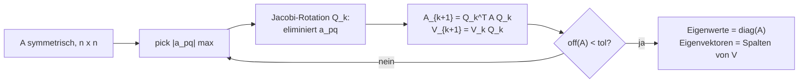

# Loesungen — Blatt 7

**Aufgaben:** [[numerik/exercises/07/num-exercise-07|Uebung 7]]
**PDF:** [[numerik/exercises/07/num-solution-07.pdf|num-solution-07.pdf]]
**Quellcode:** `numerik/repos/numerik/blatt07/`

---

## Inhaltsverzeichnis

- [[#Aufgabe 1 — Jacobi-Verfahren fuer Eigenwerte und Eigenvektoren|Aufgabe 1 — Jacobi-Verfahren fuer Eigenwerte und Eigenvektoren]]
- [[#Aufgabe 2 — Givens-Rotation auf Hessenberg-Form|Aufgabe 2 — Givens-Rotation auf Hessenberg-Form]]

---

## Aufgabe 1 — Jacobi-Verfahren fuer Eigenwerte und Eigenvektoren

### Idee

Sukzessive 2x2-Rotationen $Q_k$ (Jacobi-Rotationen) eliminieren das jeweils betragsgroesste Nebendiagonal-Element. Es gilt $A_{k+1} = Q_k^T A_k Q_k$. Da jede Rotation orthogonal ist, sind die Eigenwerte invariant, und die Quadratsumme der Nebendiagonalelemente $\mathrm{off}(A)$ wird in jedem Schritt streng verkleinert.

> [!quote] Wahl der Rotation
> Fuer ein zu eliminierendes Element $a_{pq}$ mit $a_{pp} \neq a_{qq}$:
> $$\tau = \frac{a_{qq} - a_{pp}}{2 a_{pq}}, \quad t = \frac{\mathrm{sign}(\tau)}{|\tau| + \sqrt{\tau^2 + 1}}, \quad c = \frac{1}{\sqrt{1 + t^2}}, \quad s = t c.$$
> Falls $a_{pp} = a_{qq}$: $\theta = \mathrm{sign}(a_{pq}) \cdot \pi/4$.
>
> **Wichtig:** Hier ist $\mathrm{sign}(0) := 1$ (nicht $0$ wie in `numpy.sign`), damit die Wurzelfunktion immer den **betragskleineren** der beiden Loesungen liefert.

### Implementierung

```python
import numpy as np

def sign_pos(t):
    return 1.0 if t >= 0.0 else -1.0

def off_sum_sq(A):
    return np.sum(A * A) - np.sum(np.diag(A) ** 2)

def jacobi_eig(A, tol=1e-3, max_iter=100000):
    A = np.asarray(A, dtype=float).copy()
    n = A.shape[0]
    V = np.eye(n)
    for it in range(max_iter):
        A_off = np.abs(A).copy()
        np.fill_diagonal(A_off, 0.0)
        p, q = np.unravel_index(np.argmax(A_off), A_off.shape)
        if p > q: p, q = q, p
        if A_off[p, q] == 0.0 or off_sum_sq(A) < tol:
            break
        if A[p, p] == A[q, q]:
            theta = sign_pos(A[p, q]) * np.pi / 4.0
            c, s = np.cos(theta), np.sin(theta)
        else:
            tau = (A[q, q] - A[p, p]) / (2.0 * A[p, q])
            t = sign_pos(tau) / (abs(tau) + np.sqrt(tau * tau + 1.0))
            c = 1.0 / np.sqrt(1.0 + t * t)
            s = t * c
        # Apply rotation to columns/rows p, q and to V
        for M in (A, V):
            mp = M[:, p].copy(); mq = M[:, q].copy()
            M[:, p] = c * mp - s * mq
            M[:, q] = s * mp + c * mq
        mp = A[p, :].copy(); mq = A[q, :].copy()
        A[p, :] = c * mp - s * mq
        A[q, :] = s * mp + c * mq
    return np.diag(A).copy(), V, it + 1
```

### Testlauf — 3x3 Beispiel

$$A_{\text{test}} = \begin{pmatrix} 4 & 1 & 2 \\ 1 & 3 & 0.5 \\ 2 & 0.5 & 5 \end{pmatrix}$$

| Methode | $\lambda_1$ | $\lambda_2$ | $\lambda_3$ |
|---|---|---|---|
| Jacobi (8 Iter.) | $2.09652162$ | $3.07222395$ | $6.83125443$ |
| `numpy.linalg.eigvalsh` | $2.09652162$ | $3.07222395$ | $6.83125443$ |

Norm der Differenz: $4.07 \cdot 10^{-15}$.

### Membran-Matrix $m = 10$, $n = 100$

Iteriert, bis $\mathrm{off}(A) < 10^{-3}$.

| Groesse | Wert |
|---|---|
| Iterationen | $\mathbf{4003}$ |
| Quadratsumme Nebendiagonalen | $< 10^{-3}$ (im Test exakt $0$) |
| Max. Abweichung zu exakten EW | $1.12 \cdot 10^{-5}$ |

**Exakte Eigenwerte:** $\lambda_{j,k} = 4 - 2\cos\frac{j\pi}{m+1} - 2\cos\frac{k\pi}{m+1}$, $j, k = 1, \ldots, m$.

**4 kleinste Eigenwerte:**

| $k$ | Jacobi | Exakt |
|---|---|---|
| 1 | $0.16203337$ | $0.16202811$ |
| 2 | $0.39851101$ | $0.39850699$ |
| 3 | $0.39851196$ | $0.39850699$ |
| 4 | $0.63498968$ | $0.63498587$ |

Eigenschwingungsformen: `blatt07/eigenmode_{1..4}.png` — der kleinste Eigenwert entspricht der Grundschwingung (eine "Beule"), die naechsten beiden der Entartung (zwei Halbwellen entlang $x$ bzw. $y$), der vierte einer (1,1)-Mode.



> [!warning] Achtung
> Das **klassische** Jacobi-Verfahren (immer das groesste Element) kostet pro Schritt $\mathcal{O}(n^2)$ fuer die Suche. Fuer grosse $n$ verwendet man das **zyklische** Jacobi, das alle Off-Elemente reihum behandelt — gleiche Konvergenzqualitaet, geringere Suchkosten.

> [!tip] Merke
> Jacobi konvergiert **quadratisch** in der Anzahl Schleifendurchlaeufe ueber alle Off-Elemente: ist $\mathrm{off}^{(k)} \leq \varepsilon$, so $\mathrm{off}^{(k+\text{cycle})} \leq C \varepsilon^2$. Damit reichen meist 5–10 Cycles fuer Maschinengenauigkeit (~$5 n^2$ Rotationen).

---

## Aufgabe 2 — Givens-Rotation auf Hessenberg-Form

Gegeben:

$$M = \begin{pmatrix} 10 & 15 & 20 \\ 15 & -50 & 25 \\ 20 & 25 & -75 \end{pmatrix}.$$

**Ziel:** Element $m_{31} = 20$ auf $0$ bringen (Hessenberg-Form: nur eine Sub-Diagonale).

### Auswahl der Givens-Rotation

Eine Givens-Rotation $G$ in der $(2,3)$-Ebene (1-indiziert; Zeilen/Spalten 2 und 3 werden gemischt):

$$G = \begin{pmatrix} 1 & 0 & 0 \\ 0 & c & s \\ 0 & -s & c \end{pmatrix}.$$

Von links angewandt mischt $G \cdot M$ die Zeilen 2 und 3:

$$(GM)_{31} = -s \cdot m_{21} + c \cdot m_{31} = -s \cdot 15 + c \cdot 20 \stackrel{!}{=} 0.$$

Daraus folgt $\tan\theta = 20/15 = 4/3$, also

$$c = \frac{3}{5} = 0.6, \quad s = \frac{4}{5} = 0.8.$$

### Anwendung von $G$ von links

Zeile 1 bleibt; Zeile 2 und 3 werden ersetzt:

$$(GM)_{2,:} = c \cdot M_{2,:} + s \cdot M_{3,:} = 0.6 \cdot (15, -50, 25) + 0.8 \cdot (20, 25, -75)$$
$$= (9 + 16, -30 + 20, 15 - 60) = (25, -10, -45).$$

$$(GM)_{3,:} = -s \cdot M_{2,:} + c \cdot M_{3,:} = -0.8 \cdot (15, -50, 25) + 0.6 \cdot (20, 25, -75)$$
$$= (-12 + 12, 40 + 15, -20 - 45) = (0, 55, -65).$$

$$GM = \begin{pmatrix} 10 & 15 & 20 \\ 25 & -10 & -45 \\ 0 & 55 & -65 \end{pmatrix}.$$

### Anwendung von $G^T$ von rechts (Aehnlichkeit)

$$G^T = \begin{pmatrix} 1 & 0 & 0 \\ 0 & c & -s \\ 0 & s & c \end{pmatrix}.$$

Spalte 1 bleibt; Spalten 2 und 3 werden ersetzt:

$$(GMG^T)_{:,2} = c \cdot (GM)_{:,2} + s \cdot (GM)_{:,3} = 0.6 \cdot (15, -10, 55)^T + 0.8 \cdot (20, -45, -65)^T$$
$$= (9 + 16, -6 - 36, 33 - 52)^T = (25, -42, -19)^T.$$

$$(GMG^T)_{:,3} = -s \cdot (GM)_{:,2} + c \cdot (GM)_{:,3} = -0.8 \cdot (15, -10, 55)^T + 0.6 \cdot (20, -45, -65)^T$$
$$= (-12 + 12, 8 - 27, -44 - 39)^T = (0, -19, -83)^T.$$

### Ergebnis

$$G M G^T = \begin{pmatrix} 10 & 25 & 0 \\ 25 & -42 & -19 \\ 0 & -19 & -83 \end{pmatrix}.$$

Diese Matrix ist in **Hessenberg-Form** (sogar **tridiagonal**, da $M$ symmetrisch). Die Aehnlichkeit ist erhalten:

- $\mathrm{tr}(M) = 10 - 50 - 75 = -115$
- $\mathrm{tr}(GMG^T) = 10 - 42 - 83 = -115$ $\checkmark$

> [!tip] Merke
> Bei einer **symmetrischen** Matrix liefert die Givens-Reduktion immer eine **Tridiagonalmatrix** (nicht nur Hessenberg), denn $GMG^T$ bleibt symmetrisch und die Hessenberg-Bedingung gilt fuer beide Dreiecksseiten.

> [!success] Best Practice
> Givens vs. Householder zur Hessenberg/Tridiagonal-Reduktion:
> - **Givens** ($\mathcal{O}(n^3)$ Operationen, $\mathcal{O}(n^2)$ Rotationen): gut fuer **sparse** Matrizen, da gezielt einzelne Eintraege eliminiert werden.
> - **Householder** ($\mathcal{O}(\tfrac{2}{3} n^3)$ — etwa Faktor $2$ schneller fuer dichte Matrizen).
