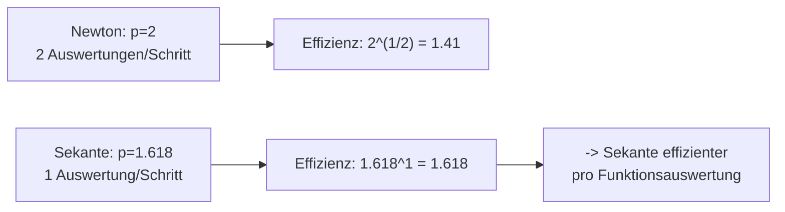
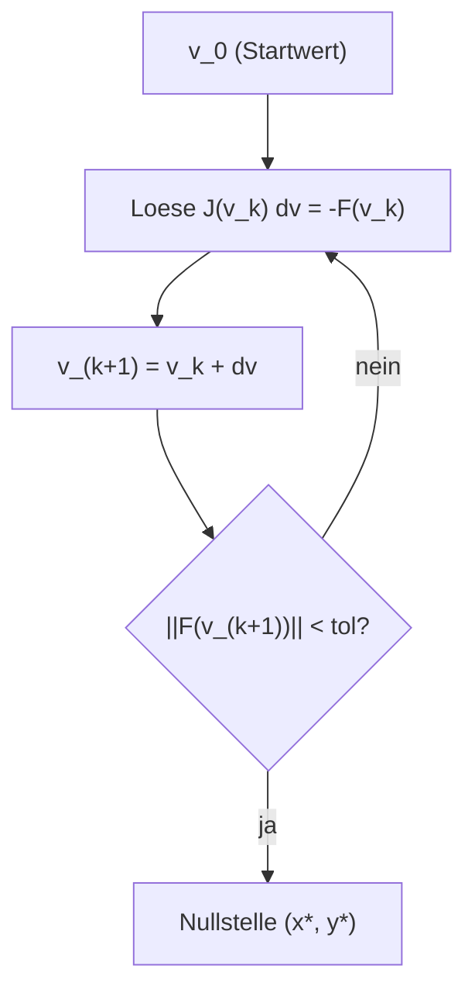

# Loesungen — Blatt 8

**Aufgaben:** [[numerik/exercises/08/num-exercise-08|Uebung 8]]
**PDF:** [[numerik/exercises/08/num-solution-08.pdf|num-solution-08.pdf]]
**Quellcode:** `numerik/repos/numerik/blatt08/`

---

## Inhaltsverzeichnis

- [[#Aufgabe 1 — Newton vs. Sekante (Weltbevoelkerung)|Aufgabe 1 — Newton vs. Sekante (Weltbevoelkerung)]]
- [[#Aufgabe 2 — Newton als Kontraktion|Aufgabe 2 — Newton als Kontraktion]]
- [[#Aufgabe 3 — Lineare vs. quadratische Konvergenz|Aufgabe 3 — Lineare vs. quadratische Konvergenz]]
- [[#Aufgabe 4 — Newton fuer ein nichtlineares System|Aufgabe 4 — Newton fuer ein nichtlineares System]]

---

## Aufgabe 1 — Newton vs. Sekante (Weltbevoelkerung)

### Aufstellung

Gesucht ist $x$ mit $b(x) = 9$, d.h. die Nullstelle von

$$f(x) = \frac{a}{1 - c\,e^{-dx}} - 9.$$

Die Ableitung (Kettenregel, $\tfrac{d}{dx}(1 - c e^{-dx}) = c d\,e^{-dx}$):

$$f'(x) = b'(x) = -\frac{a\,c\,d\,e^{-dx}}{\left(1 - c\,e^{-dx}\right)^2}.$$

Das Sekanten-Verfahren braucht **keine** Ableitung, dafuer einen zweiten Startwert.

### Ergebnis

Beide Verfahren konvergieren gegen denselben Wert

$$x^* = 2069.4822452014, \qquad b(x^*) = 9.0000000000,$$

d.h. die Weltbevoelkerung uebersteigt nach diesem Modell **Mitte 2069** die 9-Milliarden-Grenze.

**Newton** ($x_0 = 1961$):

| $k$ | $x_k$ | $f(x_k)$ |
|---|---|---|
| 0 | $1961.000000000$ | $-5.94 \cdot 10^{0}$ |
| 1 | $2058.058957255$ | $-2.98 \cdot 10^{-1}$ |
| 2 | $2068.116147179$ | $-3.16 \cdot 10^{-2}$ |
| 3 | $2069.460262864$ | $-5.01 \cdot 10^{-4}$ |
| 4 | $2069.482239419$ | $-1.32 \cdot 10^{-7}$ |
| 5 | $2069.482245201$ | $-5.33 \cdot 10^{-15}$ |

**Sekante** ($x_{-1} = 1961,\ x_0 = 2000$):

| $k$ | $x_k$ | $f(x_k)$ |
|---|---|---|
| 1 | $2047.368923762$ | $-6.55 \cdot 10^{-1}$ |
| 3 | $2067.254518475$ | $-5.21 \cdot 10^{-2}$ |
| 5 | $2069.475607771$ | $-1.51 \cdot 10^{-4}$ |
| 6 | $2069.482225165$ | $-4.56 \cdot 10^{-7}$ |
| 7 | $2069.482245200$ | $-3.63 \cdot 10^{-11}$ |
| 8 | $2069.482245201$ | $-5.33 \cdot 10^{-15}$ |

### Aufwandsvergleich

| Verfahren | Schritte bis Maschinengenauigkeit | Funktionsauswertungen |
|---|---|---|
| Newton | $6$ | $\mathbf{12}$ (je $f$ **und** $f'$) |
| Sekante | $8$ | $\mathbf{11}$ (1 pro Schritt + 2 Startwerte) |

> [!tip] Merke
> Newton konvergiert **quadratisch** ($p = 2$), die Sekante nur **superlinear** mit $p = \frac{1+\sqrt5}{2} \approx 1.618$. Newton braucht daher *weniger Schritte*. Zaehlt man aber **Funktionsauswertungen** (jeder Newton-Schritt kostet zwei: $f$ und $f'$), so ist die Sekante hier minimal **effizienter** (11 statt 12 Auswertungen). Die *Effizienzordnung* $p^{1/(\text{Auswertungen pro Schritt})}$ ist $\sqrt{2} \approx 1.41$ fuer Newton gegenueber $1.618$ fuer die Sekante — die Sekante gewinnt, wenn $f'$ teuer oder gar nicht verfuegbar ist.

---

## Aufgabe 2 — Newton als Kontraktion

Newton ist die Fixpunktiteration $x_{k+1} = g(x_k)$ mit

$$g(x) = x - \frac{f(x)}{f'(x)}, \qquad f(x) = x + \ln x - 2,\quad f'(x) = 1 + \tfrac1x,\quad f''(x) = -\tfrac1{x^2}.$$

### (a) Kontraktion mit $\alpha = \tfrac14$

Fuer die Newton-Iterationsfunktion gilt allgemein

$$g'(x) = \frac{f(x)\,f''(x)}{f'(x)^2}.$$

Einsetzen mit $f'(x)^2 = \left(\tfrac{x+1}{x}\right)^2 = \tfrac{(x+1)^2}{x^2}$ und $f''(x) = -\tfrac1{x^2}$:

$$g'(x) = \frac{(x + \ln x - 2)\cdot\left(-\tfrac{1}{x^2}\right)}{(x+1)^2 / x^2} = -\frac{x + \ln x - 2}{(x+1)^2}.$$

Auf $X = [1,2]$ schaetzen wir Zaehler und Nenner getrennt ab:

- **Zaehler:** $x + \ln x - 2$ ist streng monoton wachsend, mit Werten von $f(1) = -1$ bis $f(2) = \ln 2 \approx 0.693$. Also $|x + \ln x - 2| \le 1$, mit Maximum am linken Rand $x = 1$.
- **Nenner:** $(x+1)^2 \ge (1+1)^2 = 4$, mit Minimum ebenfalls bei $x = 1$.

Damit

$$|g'(x)| = \frac{|x + \ln x - 2|}{(x+1)^2} \le \frac{1}{4} =: \alpha \quad \forall x \in [1,2].$$

Die Schranke wird bei $x = 1$ exakt angenommen: $|g'(1)| = \tfrac{1}{4}$.

**Selbstabbildung** $g(X) \subseteq X$: $g(1) = 1 - \tfrac{-1}{2} = 1.5$ und $g(2) = 2 - \tfrac{\ln 2}{1.5} \approx 1.538$; da $g$ stetig ist und im Inneren das Maximum $g(x^*) = x^* \approx 1.557$ annimmt, gilt $g([1,2]) \subseteq [1.5,\,1.557] \subset [1,2]$.

> [!tip] Merke
> Mit $|g'| \le \alpha = \tfrac14 < 1$ und $g(X)\subseteq X$ ist $g$ nach dem **Banachschen Fixpunktsatz** eine Kontraktion: es existiert genau ein Fixpunkt $x^* \in X$, und die Iteration konvergiert von **jedem** Startwert in $X$.

### (b) A-priori-Schranke fuer die Iterationszahl

A-priori-Abschaetzung:

$$|x_k - x^*| \le \frac{\alpha^k}{1-\alpha}\,|x_1 - x_0|.$$

Mit $x_0 = 1$, $x_1 = g(1) = 1.5$, also $|x_1 - x_0| = 0.5$, und $\alpha = \tfrac14$:

$$|x_k - x^*| \le \frac{(1/4)^k}{3/4}\cdot 0.5 = \frac{2}{3}\left(\frac14\right)^k.$$

Forderung $\le 10^{-6}$:

$$\left(\frac14\right)^k \le \frac{3}{2}\cdot 10^{-6} \;\Longleftrightarrow\; 4^k \ge \frac{2}{3}\cdot 10^{6} = 6.667\cdot10^{5} \;\Longleftrightarrow\; k \ge \frac{\ln(6.667\cdot10^5)}{\ln 4} = 9.67.$$

> [!example] Ergebnis
> Es sind **$k = 10$ Iterationen** ausreichend (a-priori-Schranke bei $k=10$: $6.36\cdot10^{-7} < 10^{-6}$).

### (c) Newton-Iteration mit a-posteriori-Stopp

A-posteriori-Abschaetzung:

$$|x_k - x^*| \le \frac{\alpha}{1-\alpha}\,|x_k - x_{k-1}| = \frac13\,|x_k - x_{k-1}|.$$

| $k$ | $x_k$ | $\lvert x_k - x_{k-1}\rvert$ | Schranke $\tfrac13\lvert x_k - x_{k-1}\rvert$ |
|---|---|---|---|
| 0 | $1.000000000000$ | — | — |
| 1 | $1.500000000000$ | $5.00\cdot10^{-1}$ | $1.67\cdot10^{-1}$ |
| 2 | $1.556720935135$ | $5.67\cdot10^{-2}$ | $1.89\cdot10^{-2}$ |
| 3 | $1.557145576347$ | $4.25\cdot10^{-4}$ | $1.41\cdot10^{-4}$ |
| 4 | $1.557145598998$ | $2.27\cdot10^{-8}$ | $7.55\cdot10^{-9}$ |

> [!example] Ergebnis
> Nach **4 Iterationen** ist die a-posteriori-Schranke $7.55\cdot10^{-9} < 10^{-6}$. Loesung: $x^* = 1.557145598998$ mit $f(x^*) \approx -2.2\cdot10^{-16}$.

Die a-priori-Schranke (10 Iterationen) ist erwartungsgemaess deutlich **pessimistischer** als die a-posteriori-Schranke (4 Iterationen), da Newton in der Naehe der Nullstelle quadratisch (also viel schneller als $\alpha^k$) konvergiert.

---

## Aufgabe 3 — Lineare vs. quadratische Konvergenz

$$f(x) = \arctan(x) - x, \qquad f'(x) = \frac{1}{1+x^2} - 1 = -\frac{x^2}{1+x^2}, \qquad f''(x) = -\frac{2x}{(1+x^2)^2}.$$

### (a) Nur lineare Konvergenz

Die Taylor-Entwicklung $\arctan x = x - \tfrac{x^3}{3} + \tfrac{x^5}{5} - \ldots$ liefert

$$f(x) = -\frac{x^3}{3} + \frac{x^5}{5} - \ldots$$

Die Nullstelle $x = 0$ ist also eine **dreifache** Nullstelle ($m = 3$): $f(0) = f'(0) = f''(0) = 0$, $f'''(0) \neq 0$.

Fuer eine Nullstelle der Vielfachheit $m$ gilt fuer die Newton-Iterationsfunktion $g(x) = x - \tfrac{f}{f'}$ am Fixpunkt

$$g'(0) = 1 - \frac1m = 1 - \frac13 = \frac23 \neq 0.$$

Wegen $g'(0) \neq 0$ konvergiert Newton nur **linear** mit asymptotischem Fehlerquotienten $\tfrac23$. Das bestaetigt der Testlauf (Fehlerquotient $e_{k+1}/e_k$ konvergiert gegen $0.6667$):

| $k$ | $1$ | $3$ | $6$ | $9$ | $12$ |
|---|---|---|---|---|---|
| $e_{k+1}/e_k$ | $0.6284$ | $0.6596$ | $0.6661$ | $0.6666$ | $0.6667$ |

### (b) Modifikationen fuer quadratische Konvergenz

**Modifikation 1 — bekannte Vielfachheit ($m = 3$):**

$$x_{k+1} = x_k - m\,\frac{f(x_k)}{f'(x_k)} = x_k - 3\,\frac{f(x_k)}{f'(x_k)}.$$

**Modifikation 2 — Newton auf $u = f/f'$** (die Funktion $u$ hat bei $x^*$ stets eine **einfache** Nullstelle, unabhaengig von $m$):

$$x_{k+1} = x_k - \frac{u(x_k)}{u'(x_k)}, \qquad u'(x) = 1 - \frac{f(x)\,f''(x)}{f'(x)^2}.$$

**Iterierte zu $x_0 = 1$:**

| $k$ | Standard-Newton | Mod. 1 ($3f/f'$) | Mod. 2 ($u/u'$) |
|---|---|---|---|
| 0 | $1.0000000000$ | $1.0000000000$ | $1.0000000000$ |
| 1 | $0.5707963268$ | $-0.2876110196$ | $0.2480616061$ |
| 2 | $0.3586767169$ | $0.0091938435$ | $0.0108324683$ |
| 3 | $0.2332821545$ | $-3.108\cdot10^{-7}$ | $1.017\cdot10^{-6}$ |
| 4 | $0.1538670490$ | $-7.277\cdot10^{-11}$ | $3.298\cdot10^{-10}$ |

> [!tip] Merke
> Beide Modifikationen stellen die **quadratische Konvergenz** wieder her: nach 4 Schritten sind sie bereits auf $\sim10^{-10}$, waehrend Standard-Newton noch bei $\sim0.15$ liegt. Mod. 1 setzt die bekannte Vielfachheit $m$ voraus; Mod. 2 funktioniert **ohne** Kenntnis von $m$, kostet aber pro Schritt eine zusaetzliche Auswertung von $f''$.

---

## Aufgabe 4 — Newton fuer ein nichtlineares System

$$F\begin{pmatrix}x\\y\end{pmatrix} = \begin{pmatrix}\sin x - y \\ e^{-y} - x\end{pmatrix} \stackrel{!}{=} \begin{pmatrix}0\\0\end{pmatrix}, \qquad J(x,y) = \begin{pmatrix} \cos x & -1 \\ -1 & -e^{-y} \end{pmatrix}.$$

Newton im Mehrdimensionalen loest in jedem Schritt das **lineare System** $J(v_k)\,\Delta v = -F(v_k)$ und setzt $v_{k+1} = v_k + \Delta v$ (kein explizites Invertieren der Jacobi-Matrix noetig).

### Iterationsverlauf (Startwert $v_0 = (0.5,\, 0.5)$)

| $k$ | $x_k$ | $y_k$ | $\lVert F(v_k)\rVert$ |
|---|---|---|---|
| 0 | $0.500000000$ | $0.500000000$ | $1.08\cdot10^{-1}$ |
| 1 | $0.577668340$ | $0.547585920$ | $1.66\cdot10^{-3}$ |
| 2 | $0.578713448$ | $0.546947629$ | $3.21\cdot10^{-7}$ |
| 3 | $0.578713644$ | $0.546947495$ | $1.17\cdot10^{-14}$ |

### Ergebnis

$$\boxed{(x^*, y^*) = (0.5787136435,\; 0.5469474945)}$$

Probe: $\sin x^* - y^* = 0$ und $e^{-y^*} - x^* = 0$ (bis Maschinengenauigkeit). Der Startwert $v_0 = (1,1)$ fuehrt in 5 Schritten zur selben Loesung — Newton ist hier robust, weil $J$ im gesamten betrachteten Bereich regulaer ist.

> [!warning] Achtung
> Das System hat **mehrere** Loesungen (die Kurven $y = \sin x$ und $x = e^{-y}$ schneiden sich mehrfach). Welche Nullstelle Newton findet, haengt vom Startwert ab — fuer eine andere Loesung muss ein Startwert in deren Einzugsbereich gewaehlt werden.
