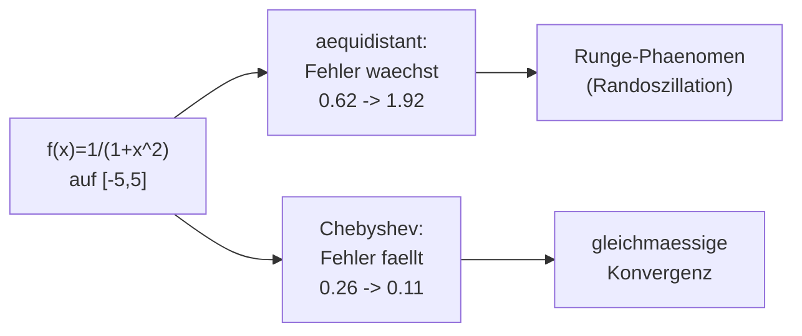

# Loesungen — Blatt 9

**Aufgaben:** [[numerik/exercises/09/num-exercise-09|Uebung 9]]
**PDF:** [[numerik/exercises/09/num-solution-09.pdf|num-solution-09.pdf]]
**Quellcode:** `numerik/repos/numerik/blatt09/`

---

## Inhaltsverzeichnis

- [[#Aufgabe 1 — Interpolationspolynom (Lagrange & Newton)|Aufgabe 1 — Interpolationspolynom (Lagrange & Newton)]]
- [[#Aufgabe 2 — Dividierte Differenzen, Horner-Schema, Runge-Phaenomen|Aufgabe 2 — Dividierte Differenzen, Horner-Schema, Runge-Phaenomen]]
- [[#Aufgabe 3 — Natuerlicher kubischer Spline|Aufgabe 3 — Natuerlicher kubischer Spline]]

---

## Aufgabe 1 — Interpolationspolynom (Lagrange & Newton)

Stuetzstellen $x = (-1, 0, 1, 3)$, Werte $y = (-2, 4, 6, 22)$. Gesucht ist das eindeutige Interpolationspolynom vom Grad $\le 3$.

### (a) Lagrange-Darstellung

$$p(x) = \sum_{i=0}^{3} y_i\, L_i(x), \qquad L_i(x) = \prod_{j \neq i} \frac{x - x_j}{x_i - x_j}.$$

Die vier Basispolynome (Nenner = Produkt der Stuetzstellenabstaende):

$$L_0(x) = \frac{x(x-1)(x-3)}{(-1)(-2)(-4)} = \frac{x(x-1)(x-3)}{-8},$$
$$L_1(x) = \frac{(x+1)(x-1)(x-3)}{(1)(-1)(-3)} = \frac{(x+1)(x-1)(x-3)}{3},$$
$$L_2(x) = \frac{(x+1)\,x\,(x-3)}{(2)(1)(-2)} = \frac{(x+1)\,x\,(x-3)}{-4},$$
$$L_3(x) = \frac{(x+1)\,x\,(x-1)}{(4)(3)(2)} = \frac{(x+1)\,x\,(x-1)}{24}.$$

Damit

$$p(x) = -2\,L_0(x) + 4\,L_1(x) + 6\,L_2(x) + 22\,L_3(x).$$

### (b) Newton-Darstellung (dividierte Differenzen)

Schema der dividierten Differenzen:

| $x_i$ | $y_i = d_{i0}$ | 1. Ordnung | 2. Ordnung | 3. Ordnung |
|---|---|---|---|---|
| $-1$ | $-2$ | | | |
| | | $\frac{4-(-2)}{0-(-1)} = 6$ | | |
| $0$ | $4$ | | $\frac{2-6}{1-(-1)} = -2$ | |
| | | $\frac{6-4}{1-0} = 2$ | | $\frac{2-(-2)}{3-(-1)} = 1$ |
| $1$ | $6$ | | $\frac{8-2}{3-0} = 2$ | |
| | | $\frac{22-6}{3-1} = 8$ | | |
| $3$ | $22$ | | | |

Die Diagonalkoeffizienten sind $d = (-2,\ 6,\ -2,\ 1)$, also

$$p(x) = -2 + 6(x+1) - 2(x+1)x + (x+1)x(x-1).$$

### Ausmultipliziert (beide Wege identisch)

$$\boxed{p(x) = x^3 - 2x^2 + 3x + 4}$$

**Probe:** $p(-1) = -2,\ p(0) = 4,\ p(1) = 6,\ p(3) = 22$ — alle Stuetzstellen exakt getroffen (numerisch bestaetigt).

> [!tip] Merke
> Lagrange und Newton liefern **dasselbe** Polynom (Eindeutigkeit der Interpolation). Die **Newton-Darstellung** ist praktischer, wenn weitere Stuetzstellen hinzukommen: man haengt nur eine Zeile an das Differenzenschema an, statt alle Basispolynome neu zu berechnen.

---

## Aufgabe 2 — Dividierte Differenzen, Horner-Schema, Runge-Phaenomen

### (a) Implementierung

```python
import numpy as np

def divided_differences(x, y):
    """Liefert die Koeffizienten d_k0 = f[x0,...,xk] (Newton-Darstellung)."""
    n = len(x)
    d = np.array(y, dtype=float).copy()
    for j in range(1, n):
        for i in range(n - 1, j - 1, -1):
            d[i] = (d[i] - d[i - 1]) / (x[i] - x[i - j])
    return d

def horner_eval(d, x_nodes, x):
    """Auswertung des Newton-Polynoms an der Stelle x (Horner-aehnlich)."""
    n = len(d)
    q = d[n - 1]
    for k in range(n - 2, -1, -1):
        q = d[k] + (x - x_nodes[k]) * q
    return q
```

Die `divided_differences`-Funktion ueberschreibt das Array **in-place** (von hinten nach vorn), sodass nur $\mathcal{O}(n)$ zusaetzlicher Speicher anfaellt. Die Auswertung ist das auf die Newton-Basis verallgemeinerte Horner-Schema mit $\mathcal{O}(n)$ Operationen.

**Test (Vorlesungsbeispiel)** — Punkte $(0,3), (1,2), (3,6)$, Auswertung bei $x = 2$:

- dividierte Differenzen $d = (3,\ -1,\ 1)$
- $p(2) = 3$  $\checkmark$ (erwartet $3$)

### (b) Runge-Phaenomen — aequidistante Stuetzstellen

Interpolation von $f(x) = \tfrac{1}{1+x^2}$ auf $[-5,5]$. Maximaler Interpolationsfehler $\max_{x}|p_{m-1}(x) - f(x)|$:

| $m$ | aequidistant | Chebyshev |
|---|---|---|
| 7 | $0.617$ | $0.264$ |
| 9 | $1.045$ | $0.171$ |
| 11 | $1.916$ | $0.109$ |

Bei **aequidistanten** Stuetzstellen waechst der Fehler mit steigendem $m$ — starke Oszillationen an den Intervallraendern (Runge-Phaenomen). Plots: `blatt09/runge_m7.png`, `runge_m9.png`, `runge_m11.png`.

### (c) Chebyshev-Stuetzstellen

Mit den nicht-aequidistanten Chebyshev-Knoten $\tilde x_i = -5\cos\!\big(\pi\tfrac{2i+1}{2m}\big)$ (am Rand dichter) **faellt** der Fehler mit steigendem $m$ (siehe Tabelle: $0.264 \to 0.109$). Die Oszillationen verschwinden weitgehend.



> [!warning] Achtung
> Mehr Stuetzstellen bedeuten **nicht** automatisch eine bessere Approximation. Bei aequidistanten Knoten divergiert die Interpolierende von $\tfrac1{1+x^2}$ fuer $m \to \infty$ an den Raendern.

> [!success] Best Practice
> **Chebyshev-Knoten** (am Rand verdichtet) minimieren das Knotenpolynom $\prod_i(x - x_i)$ in der Maximumsnorm und unterdruecken so das Runge-Phaenomen. Alternativ verwendet man **stueckweise** Interpolation (Splines, siehe Aufgabe 3) statt eines einzigen Polynoms hohen Grades.

---

## Aufgabe 3 — Natuerlicher kubischer Spline

Stuetzstellen $x = (-1, 0, 2)$, Werte $y = (16, 8, 16)$, zwei Intervalle mit $h_0 = x_1 - x_0 = 1$, $h_1 = x_2 - x_1 = 2$. Ansatz: zwei kubische Stuecke

$$s_0(x) = a_0 + b_0(x+1) + c_0(x+1)^2 + d_0(x+1)^3 \quad \text{auf } [-1,0],$$
$$s_1(x) = a_1 + b_1 x + c_1 x^2 + d_1 x^3 \quad \text{auf } [0,2].$$

### (a) Die 8 Bedingungsgleichungen

8 Unbekannte $\Rightarrow$ 8 Gleichungen:

| Bedingung | Gleichung |
|---|---|
| **Interpolation** $s_0(-1)=16$ | $a_0 = 16$ |
| $s_0(0)=8$ | $a_0 + b_0 + c_0 + d_0 = 8$ |
| $s_1(0)=8$ | $a_1 = 8$ |
| $s_1(2)=16$ | $a_1 + 2b_1 + 4c_1 + 8d_1 = 16$ |
| **$C^1$** $s_0'(0)=s_1'(0)$ | $b_0 + 2c_0 + 3d_0 = b_1$ |
| **$C^2$** $s_0''(0)=s_1''(0)$ | $2c_0 + 6d_0 = 2c_1$ |
| **natuerlich** $s_0''(-1)=0$ | $2c_0 = 0$ |
| **natuerlich** $s_1''(2)=0$ | $2c_1 + 12d_1 = 0$ |

Aufloesen: aus den natuerlichen Randbedingungen $c_0 = 0$ und $c_1 = -6d_1$. Dann liefern die uebrigen Gleichungen schrittweise

$$c_0 = 0,\quad d_0 = 2,\quad b_0 = -10,\quad c_1 = 6,\quad d_1 = -1,\quad b_1 = -4.$$

$$\boxed{s_0(x) = 16 - 10(x+1) + 2(x+1)^3, \qquad s_1(x) = 8 - 4x + 6x^2 - x^3}$$

aequivalent $s_0(x) = 2(x+1)^3 - 10x + 6$ und $s_1(x) = (2-x)^3 + 8x$.

### (b) Momenten-Gleichungssystem

Mit den Momenten $\beta_i = s''(x_i)$ lautet die Gleichung am inneren Knoten $i$ (hier nur $i=1$):

$$h_{i-1}\beta_{i-1} + 2(h_{i-1}+h_i)\beta_i + h_i\beta_{i+1} = 6\left(\frac{y_{i+1}-y_i}{h_i} - \frac{y_i-y_{i-1}}{h_{i-1}}\right).$$

**Natuerliche** Randbedingung: $\beta_0 = \beta_2 = 0$. Damit bleibt eine einzige Gleichung fuer $\beta_1$:

$$2(h_0+h_1)\,\beta_1 = 6\left(\frac{16-8}{2} - \frac{8-16}{1}\right) = 6\,(4 + 8) = 72,$$
$$2\,(1+2)\,\beta_1 = 72 \;\Longrightarrow\; 6\,\beta_1 = 72 \;\Longrightarrow\; \boxed{\beta_1 = 12}.$$

Also $\beta = (0, 12, 0)$. Einsetzen in die stueckweise Momentenformel reproduziert exakt $s_0, s_1$ aus Teil (a) (numerisch bestaetigt).

### Verifikation der Glattheit

- $s_0(-1)=16,\ s_0(0)=s_1(0)=8,\ s_1(2)=16$ — Interpolation $\checkmark$
- $s_0'(0) = 6(x+1)^2 - 10\big|_{0} = -4 = s_1'(0) = -3(2-x)^2+8\big|_{0}$ — $C^1$ $\checkmark$
- $s_0''(0) = 12 = s_1''(0) = \beta_1$, und $s_0''(-1) = 0 = s_1''(2)$ — $C^2$ und natuerlich $\checkmark$

> [!tip] Merke
> Der **natuerliche** Spline setzt die zweite Ableitung an den Raendern gleich Null ($\beta_0 = \beta_n = 0$). Das reduziert das tridiagonale Momentensystem auf die $n-1$ inneren Knoten — hier ein einziger, also eine skalare Gleichung. Der natuerliche Spline minimiert unter allen interpolierenden $C^2$-Funktionen die "Biegeenergie" $\int (s'')^2\,dx$.
