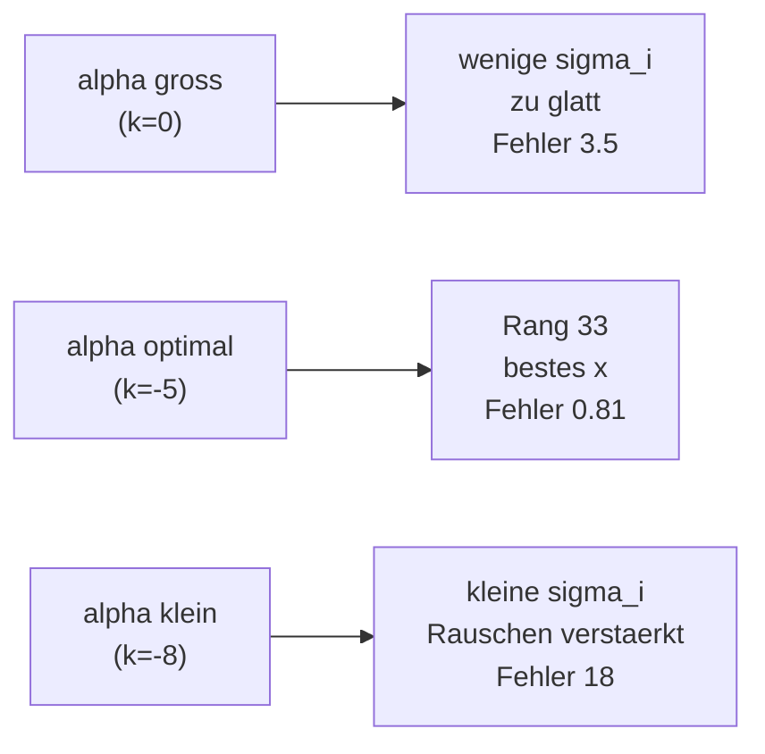

# Loesungen — Blatt 10

**Aufgaben:** [[numerik/exercises/10/num-exercise-10|Uebung 10]]
**PDF:** [[numerik/exercises/10/num-solution-10.pdf|num-solution-10.pdf]]
**Quellcode:** `numerik/repos/numerik/blatt10/`

---

## Inhaltsverzeichnis

- [[#Aufgabe 1 — Ausgleichspolynom p(x) = a + bx^2|Aufgabe 1 — Ausgleichspolynom p(x) = a + bx^2]]
- [[#Aufgabe 2 — Entschaerfung eines Signals (Pseudoinverse & TSVD)|Aufgabe 2 — Entschaerfung eines Signals (Pseudoinverse & TSVD)]]

---

## Aufgabe 1 — Ausgleichspolynom p(x) = a + bx^2

### Aufstellen des ueberbestimmten Systems

Mit $x_i^2 = (4, 0, 1, 4)$ lautet die Designmatrix (Spalten $1$ und $x^2$):

$$A = \begin{pmatrix} 1 & 4 \\ 1 & 0 \\ 1 & 1 \\ 1 & 4 \end{pmatrix}, \qquad \binom{a}{b} = c, \qquad y = \begin{pmatrix} 4 \\ 0 \\ 1 \\ -4 \end{pmatrix}.$$

Das System $A c = y$ ist mit 4 Gleichungen und 2 Unbekannten **ueberbestimmt** und i. A. nicht exakt loesbar; gesucht ist das $c$, das $\lVert Ac - y\rVert_2$ minimiert.

### Normalgleichungen $A^\top A\,c = A^\top y$

$$A^\top A = \begin{pmatrix} \sum 1 & \sum x_i^2 \\ \sum x_i^2 & \sum x_i^4 \end{pmatrix} = \begin{pmatrix} 4 & 9 \\ 9 & 33 \end{pmatrix}, \qquad A^\top y = \begin{pmatrix} \sum y_i \\ \sum x_i^2 y_i \end{pmatrix} = \begin{pmatrix} 1 \\ 1 \end{pmatrix}.$$

Dabei ist $\sum x_i^2 = 4+0+1+4 = 9$, $\sum x_i^4 = 16+0+1+16 = 33$, $\sum y_i = 4+0+1-4 = 1$ und $\sum x_i^2 y_i = 16 + 0 + 1 - 16 = 1$.

### Aufloesen

Mit $\det(A^\top A) = 4\cdot 33 - 9\cdot 9 = 132 - 81 = 51$:

$$a = \frac{1\cdot 33 - 9\cdot 1}{51} = \frac{24}{51} = \frac{8}{17} \approx 0.4706, \qquad b = \frac{4\cdot 1 - 9\cdot 1}{51} = -\frac{5}{51} \approx -0.0980.$$

$$\boxed{p(x) = \frac{8}{17} - \frac{5}{51}\,x^2}$$

### Probe / Residuen

$$p(x_i) = (0.0784,\ 0.4706,\ 0.3725,\ 0.0784), \qquad y_i - p(x_i) = (3.92,\ -0.47,\ 0.63,\ -4.08).$$

Residuenquadratsumme $\lVert Ac - y\rVert_2^2 \approx 32.63$.

> [!warning] Achtung
> Die Residuen sind gross, weil das **gerade** Modell $a + bx^2$ die Daten nicht gut beschreiben kann: $x_0 = -2$ und $x_3 = 2$ haben denselben $x^2$-Wert ($=4$), aber $y_0 = 4$ und $y_3 = -4$. Das symmetrische Modell kann nur den Mittelwert ($p(\pm 2) \approx 0.078$) treffen — die Ausgleichsrechnung liefert hier trotzdem die *bestmoegliche* Anpassung im Sinne der kleinsten Quadrate.

> [!tip] Merke
> Bei einem Modell, das **linear in den Parametern** ist (auch wenn es nichtlinear in $x$ ist, wie hier $x^2$), bleibt die Ausgleichsrechnung linear: man stellt die Designmatrix $A$ aus den Basisfunktionen auf und loest die Normalgleichungen $A^\top A\,c = A^\top y$.

---

## Aufgabe 2 — Entschaerfung eines Signals (Pseudoinverse & TSVD)

Das Modell $b = Ax$ ist ein **diskretes inverses Problem**: aus dem unscharfen (und verrauschten) Bild $b + \triangle b$ soll das Original $x$ rekonstruiert werden. Die Gauss-foermige Unschaerfe-Matrix $A$ ist **extrem schlecht konditioniert**.

### Aufbau

```python
import numpy as np

N, GAMMA, DELTA = 100, 0.05, 1e-6

def blur_matrix(n=N, gamma=GAMMA):
    c = 1.0 / (gamma * np.sqrt(2 * np.pi))
    i = np.arange(n + 1)
    diff = i[:, None] - i[None, :]
    return (c / n) * np.exp(-(diff / (np.sqrt(2) * n * gamma)) ** 2)

def original_signal(n=N):
    x = np.zeros(n + 1)
    x[45:56] = 1.0      # 1 fuer 45..55
    x[60:66] = 0.5      # 1/2 fuer 60..65
    return x
```

Konditionszahl der Matrix: $\operatorname{cond}(A) \approx 2.2\cdot 10^{18}$ — das Problem ist praktisch singulaer.

### (a) Pseudoinverse

```python
x_pinv = np.linalg.pinv(A) @ (b + db)   # db = DELTA * randn
```

Ergebnis: $\lVert x_{\text{pinv}} - x\rVert_2 \approx 2.9\cdot 10^{8}$ — die Rekonstruktion ist **voellig unbrauchbar**. Grund: $A^+$ teilt durch die winzigen Singulaerwerte $\sigma_i$, wodurch der mit $\delta = 10^{-6}$ skalierte Rauschanteil um den Faktor $1/\sigma_i$ (bis $\sim 10^{18}$) **massiv verstaerkt** wird.

### (b) TSVD (Truncated SVD) als Regularisierung

Mit der SVD $A = U\Sigma V^\top$ lautet die Pseudoinverse $x = \sum_i \frac{u_i^\top \tilde b}{\sigma_i} v_i$. Die **TSVD** schneidet alle Singulaerwerte $\sigma_i < \alpha$ ab und summiert nur ueber die "gutmuetigen" grossen $\sigma_i$:

$$x_\alpha = \sum_{\sigma_i \ge \alpha} \frac{u_i^\top (b + \triangle b)}{\sigma_i}\, v_i.$$

```python
U, s, Vt = np.linalg.svd(A)
def tsvd_solve(U, s, Vt, b, alpha):
    mask = s >= alpha
    return Vt.T[:, mask] @ ((U.T @ b)[mask] / s[mask])
```

Rekonstruktionsfehler $\lVert x_\alpha - x\rVert_2$ in Abhaengigkeit von $\alpha = 10^k$:

| $k$ | $\alpha$ | beruecksichtigter Rang | Fehler $\lVert x_\alpha - x\rVert_2$ |
|---|---|---|---|
| $0$ | $10^{0}$ | 0 | $3.54$ |
| $-1$ | $10^{-1}$ | 14 | $1.49$ |
| $-2$ | $10^{-2}$ | 20 | $1.21$ |
| $-3$ | $10^{-3}$ | 25 | $1.06$ |
| $-4$ | $10^{-4}$ | 29 | $0.890$ |
| $\mathbf{-5}$ | $\mathbf{10^{-5}}$ | **33** | $\mathbf{0.806}$ |
| $-6$ | $10^{-6}$ | 36 | $1.49$ |
| $-7$ | $10^{-7}$ | 40 | $10.84$ |
| $-8$ | $10^{-8}$ | 42 | $17.97$ |

Das **Optimum liegt bei $\alpha = 10^{-5}$** (Rang 33): hier ist der beste Kompromiss zwischen Regularisierung und Aufloesung erreicht. (Plots: `blatt10/signal_pinv.png`, `signal_tsvd.png`.)



> [!warning] Achtung
> Die **naive Pseudoinverse** $A^+(b+\triangle b)$ ist bei schlecht konditionierten inversen Problemen wertlos (hier Fehler $\sim 10^8$), obwohl die Stoerung nur $\delta = 10^{-6}$ betraegt. Die kleinen Singulaerwerte verstaerken das Rauschen um Groessenordnungen.

> [!success] Best Practice
> **TSVD regularisiert** durch Abschneiden kleiner Singulaerwerte. Der Parameter $\alpha$ steuert den Kompromiss:
> - **zu gross** ($\alpha = 1$): zu viele Komponenten verworfen, Rekonstruktion zu glatt;
> - **zu klein** ($\alpha = 10^{-8}$): rauschverstaerkende $\sigma_i$ wieder dabei, Fehler explodiert.
>
> Das ist die diskrete Form des **Bias-Varianz-Kompromisses** bei der Regularisierung schlecht gestellter Probleme.
