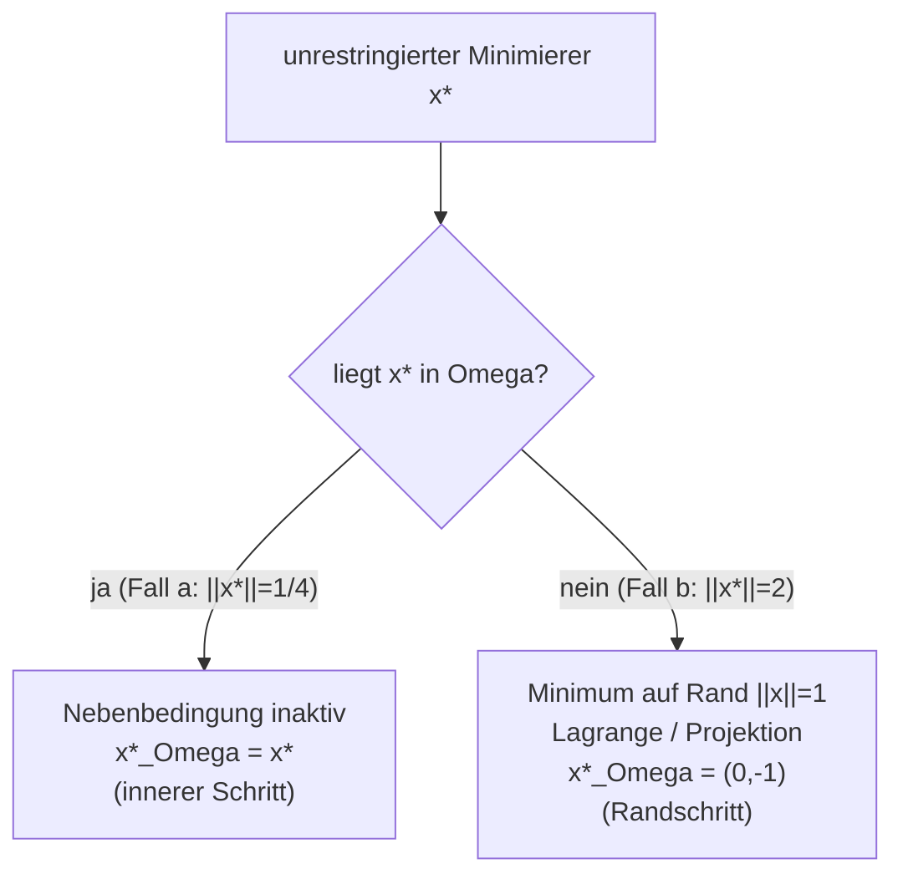

# Loesungen — Blatt 13

**Aufgaben:** [[numerik/exercises/13/num-exercise-13|Uebung 13]]
**PDF:** [[numerik/exercises/13/num-solution-13.pdf|num-solution-13.pdf]]
**Quellcode:** `numerik/repos/numerik/blatt13/`

---

## Inhaltsverzeichnis

- [[#Aufgabe 1 — Trust-Region: restringierte vs. unrestringierte Minimierung|Aufgabe 1 — Trust-Region: restringierte vs. unrestringierte Minimierung]]
- [[#Aufgabe 2 — BFGS-Quasi-Newton mit Armijo-Liniensuche|Aufgabe 2 — BFGS-Quasi-Newton mit Armijo-Liniensuche]]

---

## Aufgabe 1 — Trust-Region: restringierte vs. unrestringierte Minimierung

**Zentrale Vereinfachung.** Der quadratische Teil beider Funktionen laesst sich zusammenfassen:

$$(x_1 - x_2)^2 + (x_1 + x_2)^2 = 2x_1^2 + 2x_2^2 = 2\|x\|_2^2.$$

Damit sind beide Zielfunktionen von der Form $f(x) = 2\|x\|_2^2 + (\text{Linearterm})$ — ein isotroper Paraboloid plus lineare Verschiebung.

> [!tip] Merke
> Auf dem **Rand** $\|x\|_2 = 1$ ist $2\|x\|_2^2 = 2$ **konstant**. Die restringierte Minimierung auf dem Rand reduziert sich dort auf die Minimierung des **Linearterms** allein.

### (a) $f(x_1,x_2) = 2\|x\|^2 + x_1$

**Unrestringiert ueber $\mathbb{R}^2$.** Gradient null setzen:

$$\nabla f = \begin{pmatrix} 4x_1 + 1 \\ 4x_2 \end{pmatrix} \overset{!}{=} \begin{pmatrix} 0 \\ 0 \end{pmatrix} \;\Longrightarrow\; x^* = \left(-\tfrac{1}{4},\, 0\right).$$

Die Hessematrix $f'' = \begin{pmatrix} 4 & 0 \\ 0 & 4 \end{pmatrix}$ ist positiv definit, also ein Minimum. Funktionswert:

$$f(x^*) = 2\cdot\tfrac{1}{16} + \left(-\tfrac14\right) = \tfrac18 - \tfrac14 = -\tfrac18.$$

**Restringiert auf $\Omega = \{\|x\|_2 \le 1\}$.** Pruefe, ob der unrestringierte Minimierer in $\Omega$ liegt:

$$\|x^*\|_2 = \tfrac14 \le 1 \quad(\text{korrekt}).$$

Der Minimierer liegt **im Inneren** des Vertrauensbereichs. Die Nebenbedingung ist **inaktiv** — der restringierte Minimierer ist identisch zum unrestringierten:

$$\boxed{x^*_\Omega = \left(-\tfrac14,\, 0\right), \qquad f(x^*_\Omega) = -\tfrac18.}$$

### (b) $f(x_1,x_2) = 2\|x\|^2 + 8x_2$

**Unrestringiert ueber $\mathbb{R}^2$.**

$$\nabla f = \begin{pmatrix} 4x_1 \\ 4x_2 + 8 \end{pmatrix} \overset{!}{=} 0 \;\Longrightarrow\; x^* = (0,\, -2), \qquad f(x^*) = 2\cdot 4 + 8\cdot(-2) = 8 - 16 = -8.$$

**Restringiert auf $\Omega$.** Nun gilt

$$\|x^*\|_2 = 2 > 1,$$

der unrestringierte Minimierer liegt **ausserhalb** von $\Omega$. Da $f$ auf $\Omega$ stetig und $\Omega$ kompakt ist und im Inneren kein stationaerer Punkt liegt, wird das Minimum auf dem **Rand** $\|x\|_2 = 1$ angenommen. Loesung ueber Lagrange (KKT):

$$L(x, \lambda) = 2x_1^2 + 2x_2^2 + 8x_2 - \lambda\,(x_1^2 + x_2^2 - 1).$$

Stationaritaet:

$$\partial_{x_1} L = 4x_1 - 2\lambda x_1 = (4 - 2\lambda)\,x_1 = 0,$$
$$\partial_{x_2} L = 4x_2 + 8 - 2\lambda x_2 = 0.$$

Aus der ersten Gleichung: $x_1 = 0$ **oder** $\lambda = 2$.

- **Fall $\lambda = 2$:** einsetzen in die zweite Gleichung liefert $4x_2 + 8 - 4x_2 = 8 \neq 0$ — Widerspruch, keine Loesung.
- **Fall $x_1 = 0$:** aus der Nebenbedingung $x_2 = \pm 1$.
  - $x_2 = -1$: $\;f = 2\cdot 1 + 8\cdot(-1) = -6$ (Minimum).
  - $x_2 = +1$: $\;f = 2\cdot 1 + 8\cdot(+1) = +10$ (Maximum auf dem Rand).

Also

$$\boxed{x^*_\Omega = (0,\, -1), \qquad f(x^*_\Omega) = -6.}$$

**Kurzweg (aequivalent).** Auf dem Rand ist $2\|x\|^2 = 2$ konstant, also minimiere nur $8x_2$ unter $x_1^2 + x_2^2 = 1$: das ist minimal fuer $x_2 = -1$, $x_1 = 0$.

> [!example] Der Trust-Region-Effekt
> In (a) liegt der unrestringierte Minimierer **innerhalb** des Vertrauensbereichs — die Restriktion aendert nichts (Nebenbedingung inaktiv, "innerer" Schritt). In (b) liegt er **ausserhalb**; die Restriktion **zieht** die Loesung auf den Rand, und zwar in Richtung des unrestringierten Minimierers: $(0,-2)$ wird auf $(0,-1)$ projiziert (Randschritt, Nebenbedingung aktiv). Genau dieses Verhalten nutzt ein Trust-Region-Verfahren, um zu grosse, unzuverlaessige Schritte zu begrenzen.



| | unrestringiert $\mathbb{R}^2$ | restringiert $\Omega$ | Nebenbedingung |
|---|---|---|---|
| **(a)** | $(-\tfrac14, 0)$, $f = -\tfrac18$ | $(-\tfrac14, 0)$, $f = -\tfrac18$ | inaktiv |
| **(b)** | $(0, -2)$, $f = -8$ | $(0, -1)$, $f = -6$ | aktiv (Rand) |

---

## Aufgabe 2 — BFGS-Quasi-Newton mit Armijo-Liniensuche

### Gradient der Zielfunktion

Mit $f(x_1,x_2) = (\sin x_1 - x_2)^2 + (e^{-x_2} - x_1)^2$ und den Abkuerzungen $a = \sin x_1 - x_2$, $b = e^{-x_2} - x_1$:

$$\frac{\partial f}{\partial x_1} = 2a\cos x_1 - 2b, \qquad \frac{\partial f}{\partial x_2} = -2a - 2b\,e^{-x_2}.$$

### Implementierung

```python
import numpy as np

def f(x):
    x1, x2 = x
    return (np.sin(x1) - x2) ** 2 + (np.exp(-x2) - x1) ** 2

def grad(x):
    x1, x2 = x
    a = np.sin(x1) - x2
    b = np.exp(-x2) - x1
    return np.array([2 * a * np.cos(x1) - 2 * b,
                     -2 * a - 2 * b * np.exp(-x2)])

def armijo(x, p, g, rho=0.5, tau=0.5):
    alpha, fx, slope = 1.0, f(x), g @ p
    while f(x + alpha * p) > fx + tau * alpha * slope:
        alpha *= rho
        if alpha < 1e-16:
            break
    return alpha

def bfgs(x0, tol=1e-8, max_iter=1000):
    x = np.array(x0, dtype=float)
    D = np.eye(len(x))                 # D_0 = I
    g = grad(x)
    for k in range(max_iter):
        if np.linalg.norm(g) < tol:
            return x, f(x), np.linalg.norm(g), k
        p = -D @ g                     # Suchrichtung
        alpha = armijo(x, p, g)
        x_new = x + alpha * p
        g_new = grad(x_new)
        h, y = x_new - x, g_new - g
        hy = h @ y
        if hy > 0:                     # Kruemmungsbedingung
            v = D @ y
            k2 = 1.0 / hy
            k1 = k2 * (1.0 + k2 * (y @ v))
            D = D + k1 * np.outer(h, h) - k2 * (np.outer(h, v) + np.outer(v, h))
        x, g = x_new, g_new
    return x, f(x), np.linalg.norm(g), max_iter
```

### Ergebnisse (tatsaechliche Laeufe)

Abbruch bei $\|f'(x_k)\|_2 < 10^{-8}$.

| Startwert | Minimierer $(x_1^*, x_2^*)$ | $f(x^*)$ | $\|f'(x^*)\|_2$ | Iterationen |
|---|---|---|---|---|
| $(5, 2)$ | $(0.578714,\ 0.546947)$ | $1.23\cdot10^{-32}$ | $2.57\cdot10^{-16}$ | 35 |
| $(6, 2)$ | $(4.481332,\ -1.474007)$ | $2.637\cdot10^{-1}$ | $1.18\cdot10^{-11}$ | 14 |
| $(-1, -1)$ | $(0.578714,\ 0.546947)$ | $5.63\cdot10^{-20}$ | $6.16\cdot10^{-10}$ | 11 |
| $(-2, -2)$ | $(4.481332,\ -1.474007)$ | $2.637\cdot10^{-1}$ | $7.45\cdot10^{-10}$ | 14 |

### Beobachtungen

Das Verfahren konvergiert je nach Startwert gegen **zwei verschiedene** stationaere Punkte:

- **Globales Minimum** $x^* \approx (0.5787,\ 0.5469)$ mit $f(x^*) \approx 0$. Hier gilt exakt $\sin x_1 = x_2$ **und** $e^{-x_2} = x_1$, d.h. **beide** quadratischen Summanden werden null. Gefunden von den Startwerten $(5,2)$ und $(-1,-1)$.
- **Lokales Minimum** $x^* \approx (4.4813,\ -1.4740)$ mit $f(x^*) \approx 0.2637$. Der Gradient ist dort verschwindend klein ($\approx 10^{-11}$), es ist also ein echter stationaerer Punkt, aber die beiden Klammern koennen nicht gleichzeitig null werden. Gefunden von $(6,2)$ und $(-2,-2)$.

> [!warning] Achtung
> BFGS ist ein **lokales** Abstiegsverfahren: es findet den nächstgelegenen stationaeren Punkt im "Einzugsgebiet" des Startwerts, **nicht** garantiert das globale Minimum. Die Funktion $f$ besitzt mehrere Minima; welches gefunden wird, haengt allein vom Startwert ab. Praktisch hilft ein **Multistart** (mehrere Startwerte), um das globale Minimum zu identifizieren.

> [!tip] Merke
> Die Update-Formel arbeitet direkt auf der **inversen** Hessenaeherung $D_k = B_k^{-1}$ (Sherman-Morrison-Form). Dadurch entfaellt das Loesen eines linearen Gleichungssystems pro Schritt — die Suchrichtung ist ein reines Matrix-Vektor-Produkt $p_k = -D_k f'(x_k)$. Der Update wird nur bei erfuellter **Kruemmungsbedingung** $h_k^T y_k > 0$ ausgefuehrt, was die positive Definitheit von $D_{k+1}$ und damit die Abstiegseigenschaft $p_k^T f'(x_k) < 0$ sichert.

> [!success] Best Practice
> Die **Armijo-Liniensuche** (Backtracking ab $\alpha = 1$ mit Faktor $\rho = 0.5$) garantiert einen hinreichenden Abstieg $f(x_k + \alpha p_k) \le f(x_k) + \tau\,\alpha\, f'(x_k)^T p_k$. Der Startwert $\alpha = 1$ ist bei Quasi-Newton-Verfahren wichtig: nahe des Minimums wird der volle Newton-Schritt akzeptiert und man erhaelt superlineare Konvergenz.
