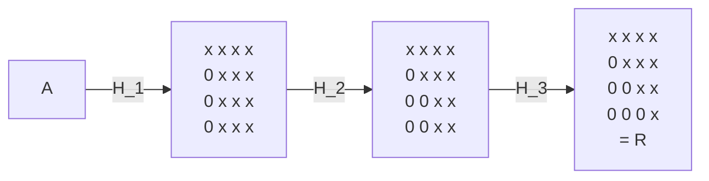
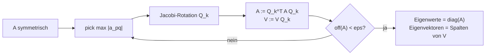

# Exam Concepts — Numerik

## Inhaltsverzeichnis

1. [[#1. LU-Zerlegung (Gauß-Elimination)|LU-Zerlegung (Gauß-Elimination)]]
2. [[#2. LU-Zerlegung mit Pivotsuche (Spalten-Pivotisierung)|LU-Zerlegung mit Pivotsuche]]
3. [[#3. Nachiteration (Iterative Refinement)|Nachiteration]]
4. [[#4. Cholesky-Zerlegung|Cholesky-Zerlegung]]
5. [[#5. Kondition einer Matrix|Kondition einer Matrix]]
6. [[#6. Prager und Oettli (Stoerungsanalyse)|Prager und Oettli]]
7. [[#7. Jacobi-Verfahren|Jacobi-Verfahren]]
8. [[#8. Gauss-Seidel-Verfahren|Gauss-Seidel-Verfahren]]
9. [[#9. Relaxationsverfahren (JOR und SOR)|Relaxationsverfahren (JOR und SOR)]]
10. [[#10. Verfahren des steilsten Abstiegs (Steepest Descent)|Verfahren des steilsten Abstiegs]]
11. [[#11. Householder-Verfahren (QR-Zerlegung)|Householder-Verfahren (QR-Zerlegung)]]
12. [[#12. Verfahren der konjugierten Gradienten (CG)|Verfahren der konjugierten Gradienten (CG)]]
13. [[#13. Gerschgorin-Kreise|Gerschgorin-Kreise]]
14. [[#14. Eigenwert-Residuum-Abschaetzung (symmetrische Matrizen)|Eigenwert-Residuum-Abschaetzung]]
15. [[#15. Jacobi-Eigenwertverfahren|Jacobi-Eigenwertverfahren]]
16. [[#16. Givens-Rotationen und Hessenberg-Reduktion|Givens-Rotationen / Hessenberg]]
17. [[#Zusammenfassung|Zusammenfassung]]

---

## 1. LU-Zerlegung (Gauß-Elimination)

### Idee

Jede reguläre Matrix $A \in \mathbb{R}^{n \times n}$ lässt sich (unter bestimmten Voraussetzungen) in ein Produkt aus einer **unteren Dreiecksmatrix** $L$ (lower) und einer **oberen Dreiecksmatrix** $U$ (upper) zerlegen:

$$A = L \cdot U$$

wobei:
- $L$ ist eine untere Dreiecksmatrix mit **Einsen auf der Diagonale** ($l_{ii} = 1$)
- $U$ ist eine obere Dreiecksmatrix

### Warum?

Statt $Ax = b$ direkt zu lösen, zerlegen wir in zwei **einfach lösbare** Dreieckssysteme:

1. **Vorwärtssubstitution:** $Ly = b$ → löse nach $y$
2. **Rückwärtssubstitution:** $Ux = y$ → löse nach $x$

Das ist besonders effizient, wenn man dasselbe $A$ mit verschiedenen rechten Seiten $b$ lösen will — die Zerlegung muss nur **einmal** berechnet werden.

### Algorithmus

Die LU-Zerlegung basiert auf der **Gauß-Elimination**. Man eliminiert spaltenweise die Einträge unterhalb der Diagonale:

Für jede Spalte $k = 1, \dots, n-1$:
- Für jede Zeile $i = k+1, \dots, n$:
  - Berechne den Multiplikator: $l_{ik} = \dfrac{a_{ik}^{(k)}}{a_{kk}^{(k)}}$
  - Aktualisiere die Zeile: $a_{ij}^{(k+1)} = a_{ij}^{(k)} - l_{ik} \cdot a_{kj}^{(k)}$ für $j = k, \dots, n$

Nach Abschluss steht $U$ in der transformierten Matrix, und die Multiplikatoren $l_{ik}$ bilden $L$.

### Voraussetzung

Alle **Hauptabschnittsminoren** von $A$ müssen ungleich Null sein, d.h. $\det(A_k) \neq 0$ für $k = 1, \dots, n$, wobei $A_k$ die führende $k \times k$-Untermatrix ist. Insbesondere darf kein Pivotelement $a_{kk}^{(k)} = 0$ auftreten.

### Aufwand

Die LU-Zerlegung benötigt $\dfrac{2}{3}n^3 + \mathcal{O}(n^2)$ Operationen (Multiplikationen und Additionen).

### Beispiel

Gegeben:

$$A = \begin{pmatrix} 2 & 1 & 1 \\ 4 & 3 & 3 \\ 8 & 7 & 9 \end{pmatrix}$$

**Schritt 1:** Elimination in Spalte 1

Multiplikatoren:
- $l_{21} = \dfrac{4}{2} = 2$
- $l_{31} = \dfrac{8}{2} = 4$

$$A^{(1)} = \begin{pmatrix} 2 & 1 & 1 \\ 0 & 1 & 1 \\ 0 & 3 & 5 \end{pmatrix}$$

**Schritt 2:** Elimination in Spalte 2

Multiplikator:
- $l_{32} = \dfrac{3}{1} = 3$

$$U = \begin{pmatrix} 2 & 1 & 1 \\ 0 & 1 & 1 \\ 0 & 0 & 2 \end{pmatrix}$$

**Ergebnis:**

$$L = \begin{pmatrix} 1 & 0 & 0 \\ 2 & 1 & 0 \\ 4 & 3 & 1 \end{pmatrix}, \quad U = \begin{pmatrix} 2 & 1 & 1 \\ 0 & 1 & 1 \\ 0 & 0 & 2 \end{pmatrix}$$

**Probe:** $L \cdot U = \begin{pmatrix} 2 & 1 & 1 \\ 4 & 3 & 3 \\ 8 & 7 & 9 \end{pmatrix} = A$ ✔

### Lösen eines Gleichungssystems

Sei $b = \begin{pmatrix} 4 \\ 10 \\ 24 \end{pmatrix}$.

**Vorwärtssubstitution** $Ly = b$:

$$\begin{pmatrix} 1 & 0 & 0 \\ 2 & 1 & 0 \\ 4 & 3 & 1 \end{pmatrix} \begin{pmatrix} y_1 \\ y_2 \\ y_3 \end{pmatrix} = \begin{pmatrix} 4 \\ 10 \\ 24 \end{pmatrix}$$

- $y_1 = 4$
- $y_2 = 10 - 2 \cdot 4 = 2$
- $y_3 = 24 - 4 \cdot 4 - 3 \cdot 2 = -2$

**Rückwärtssubstitution** $Ux = y$:

$$\begin{pmatrix} 2 & 1 & 1 \\ 0 & 1 & 1 \\ 0 & 0 & 2 \end{pmatrix} \begin{pmatrix} x_1 \\ x_2 \\ x_3 \end{pmatrix} = \begin{pmatrix} 4 \\ 2 \\ -2 \end{pmatrix}$$

- $x_3 = \dfrac{-2}{2} = -1$
- $x_2 = 2 - 1 \cdot (-1) = 3$
- $x_1 = \dfrac{4 - 1 \cdot 3 - 1 \cdot (-1)}{2} = 1$

**Lösung:** $x = \begin{pmatrix} 1 \\ 3 \\ -1 \end{pmatrix}$

### Beispiel 2 (Zeilentausch nötig — Permutationsvektor)

Gegeben:

$$A = \begin{pmatrix} 0 & 1 & 2 \\ 1 & 2 & 3 \\ 2 & 1 & 1 \end{pmatrix}$$

Permutationsvektor zu Beginn: $\pi = (1, 2, 3)$ (Identität — keine Vertauschungen)

**Schritt 1:** Elimination in Spalte 1

Pivotelement $a_{11} = 0$ → **Division durch Null!** Zeilentausch nötig.

Suche größtes Element in Spalte 1: $|a_{11}| = 0$, $|a_{21}| = 1$, $|a_{31}| = 2$ → Tausche Zeile 1 ↔ Zeile 3

$$A' = \begin{pmatrix} 2 & 1 & 1 \\ 1 & 2 & 3 \\ 0 & 1 & 2 \end{pmatrix}, \quad \pi = (3, 2, 1)$$

Multiplikatoren:
- $l_{21} = \dfrac{1}{2}$
- $l_{31} = \dfrac{0}{2} = 0$

$$A^{(1)} = \begin{pmatrix} 2 & 1 & 1 \\ 0 & \frac{3}{2} & \frac{5}{2} \\ 0 & 1 & 2 \end{pmatrix}$$

**Schritt 2:** Elimination in Spalte 2

Pivotelement $a_{22}^{(1)} = \frac{3}{2}$, $a_{32}^{(1)} = 1$ → $\frac{3}{2} > 1$, kein Tausch nötig.

Multiplikator:
- $l_{32} = \dfrac{1}{\frac{3}{2}} = \dfrac{2}{3}$

$$U = \begin{pmatrix} 2 & 1 & 1 \\ 0 & \frac{3}{2} & \frac{5}{2} \\ 0 & 0 & \frac{1}{3} \end{pmatrix}$$

**Ergebnis:**

$$\pi = (3, 2, 1), \quad L = \begin{pmatrix} 1 & 0 & 0 \\ \frac{1}{2} & 1 & 0 \\ 0 & \frac{2}{3} & 1 \end{pmatrix}, \quad U = \begin{pmatrix} 2 & 1 & 1 \\ 0 & \frac{3}{2} & \frac{5}{2} \\ 0 & 0 & \frac{1}{3} \end{pmatrix}$$

**Lösen mit Permutationsvektor:**

Sei $b = \begin{pmatrix} 3 \\ 6 \\ 4 \end{pmatrix}$. Permutiere $b$ gemäß $\pi = (3, 2, 1)$:

$$b_\pi = \begin{pmatrix} b_3 \\ b_2 \\ b_1 \end{pmatrix} = \begin{pmatrix} 4 \\ 6 \\ 3 \end{pmatrix}$$

**Vorwärtssubstitution** $Ly = b_\pi$:
- $y_1 = 4$
- $y_2 = 6 - \frac{1}{2} \cdot 4 = 4$
- $y_3 = 3 - 0 \cdot 4 - \frac{2}{3} \cdot 4 = \frac{1}{3}$

**Rückwärtssubstitution** $Ux = y$:
- $x_3 = \dfrac{\frac{1}{3}}{\frac{1}{3}} = 1$
- $x_2 = \dfrac{4 - \frac{5}{2} \cdot 1}{\frac{3}{2}} = 1$
- $x_1 = \dfrac{4 - 1 \cdot 1 - 1 \cdot 1}{2} = 1$

**Lösung:** $x = \begin{pmatrix} 1 \\ 1 \\ 1 \end{pmatrix}$

---

## 2. LU-Zerlegung mit Pivotsuche (Spalten-Pivotisierung)

### Problem

Die einfache LU-Zerlegung versagt, wenn ein Pivotelement $a_{kk}^{(k)} = 0$ ist. Selbst wenn es nur **sehr klein** ist, führt dies zu numerischer Instabilität (große Rundungsfehler durch Division durch eine fast-Null).

### Idee

Vor jedem Eliminationsschritt sucht man in der aktuellen Spalte $k$ das **betragsmäßig größte** Element unterhalb (und einschließlich) der Diagonale und tauscht die entsprechende Zeile nach oben. Dies nennt man **Spalten-Pivotisierung** (partial pivoting).

Man erhält die Zerlegung:

$$P \cdot A = L \cdot U$$

wobei $P$ eine **Permutationsmatrix** ist, die die Zeilenvertauschungen beschreibt.

### Algorithmus

Für jede Spalte $k = 1, \dots, n-1$:

1. **Pivotsuche:** Finde $p$ mit $|a_{pk}^{(k)}| = \max_{i=k,\dots,n} |a_{ik}^{(k)}|$
2. **Zeilentausch:** Vertausche Zeile $k$ mit Zeile $p$ (in $A$ **und** in den bisherigen Einträgen von $L$)
3. **Elimination:** Wie bei der normalen LU-Zerlegung

In der Praxis speichert man die Permutation als Vektor $\pi = (\pi_1, \dots, \pi_n)$ statt als volle Matrix.

### Vorteile

- **Immer durchführbar** für reguläre Matrizen (kein Nullpivot möglich)
- **Numerisch stabil:** Alle Multiplikatoren erfüllen $|l_{ik}| \leq 1$, was die Fehlerfortpflanzung begrenzt

### Beispiel

Gegeben:

$$A = \begin{pmatrix} 0 & 2 & 1 \\ 3 & 1 & 1 \\ 1 & 4 & 2 \end{pmatrix}, \quad b = \begin{pmatrix} 5 \\ 7 \\ 11 \end{pmatrix}$$

**Schritt 1:** Pivotsuche in Spalte 1

Beträge: $|a_{11}| = 0$, $|a_{21}| = 3$, $|a_{31}| = 1$ → Maximum bei Zeile 2

Tausche Zeile 1 ↔ Zeile 2:

$$A' = \begin{pmatrix} 3 & 1 & 1 \\ 0 & 2 & 1 \\ 1 & 4 & 2 \end{pmatrix}, \quad \pi = (2, 1, 3)$$

Elimination in Spalte 1 — Ziel: alle Einträge **unterhalb** von $a_{11} = 3$ auf Null bringen.

**Zeile 2:** $a_{21} = 0$ → ist schon Null, nichts zu tun. Multiplikator: $l_{21} = \dfrac{a_{21}}{a_{11}} = \dfrac{0}{3} = 0$

**Zeile 3:** $a_{31} = 1 \neq 0$ → muss eliminiert werden.

Multiplikator: $l_{31} = \dfrac{a_{31}}{a_{11}} = \dfrac{1}{3}$

Neue Zeile 3 = Zeile 3 $-$ $l_{31}$ $\cdot$ Zeile 1:

$$\begin{pmatrix} 1 & 4 & 2 \end{pmatrix} - \frac{1}{3} \cdot \begin{pmatrix} 3 & 1 & 1 \end{pmatrix} = \begin{pmatrix} 1 - 1 & 4 - \frac{1}{3} & 2 - \frac{1}{3} \end{pmatrix} = \begin{pmatrix} 0 & \frac{11}{3} & \frac{5}{3} \end{pmatrix}$$

Ergebnis nach Elimination in Spalte 1:

$$A^{(1)} = \begin{pmatrix} 3 & 1 & 1 \\ 0 & 2 & 1 \\ 0 & \frac{11}{3} & \frac{5}{3} \end{pmatrix}$$

**Schritt 2:** Pivotsuche in Spalte 2

Beträge: $|a_{22}^{(1)}| = 2$, $|a_{32}^{(1)}| = \frac{11}{3} \approx 3.67$ → Maximum bei Zeile 3

Tausche Zeile 2 ↔ Zeile 3. Der Tausch betrifft **sowohl** die Matrixzeilen **als auch** die bereits berechneten $L$-Einträge aus Spalte 1:

**Matrixzeilen tauschen:**

$$A^{(1)} = \begin{pmatrix} 3 & 1 & 1 \\ 0 & \underset{\uparrow}{2} & \underset{\uparrow}{1} \\ 0 & \underset{\downarrow}{\frac{11}{3}} & \underset{\downarrow}{\frac{5}{3}} \end{pmatrix} \xrightarrow{\text{Zeile 2 ↔ 3}} A^{(1)'} = \begin{pmatrix} 3 & 1 & 1 \\ 0 & \frac{11}{3} & \frac{5}{3} \\ 0 & 2 & 1 \end{pmatrix}$$

**$L$-Einträge (Spalte 1) tauschen:** Die Multiplikatoren gehören zu den jeweiligen Zeilen — wenn die Zeilen tauschen, tauschen auch ihre Multiplikatoren:

$$l_{21} = 0, \; l_{31} = \tfrac{1}{3} \xrightarrow{\text{Zeile 2 ↔ 3}} l_{21} = \tfrac{1}{3}, \; l_{31} = 0$$

**Permutationsvektor aktualisieren:** $\pi = (2, 1, 3) \xrightarrow{\text{Pos. 2 ↔ 3}} \pi = (2, 3, 1)$

Elimination in Spalte 2:
- $l_{32} = \dfrac{2}{\frac{11}{3}} = \dfrac{6}{11}$

$$U = \begin{pmatrix} 3 & 1 & 1 \\ 0 & \frac{11}{3} & \frac{5}{3} \\ 0 & 0 & \frac{1}{11} \end{pmatrix}$$

**Ergebnis:**

$$P = \begin{pmatrix} 0 & 1 & 0 \\ 0 & 0 & 1 \\ 1 & 0 & 0 \end{pmatrix}, \quad L = \begin{pmatrix} 1 & 0 & 0 \\ \frac{1}{3} & 1 & 0 \\ 0 & \frac{6}{11} & 1 \end{pmatrix}, \quad U = \begin{pmatrix} 3 & 1 & 1 \\ 0 & \frac{11}{3} & \frac{5}{3} \\ 0 & 0 & \frac{1}{11} \end{pmatrix}$$

Zum Lösen: Permutiere $b$ gemäß $P$, dann Vorwärts-/Rückwärtssubstitution wie gewohnt.

$Pb = \begin{pmatrix} 7 \\ 11 \\ 5 \end{pmatrix}$

---

## 3. Nachiteration (Iterative Refinement)

### Idee

Die Nachiteration verbessert eine bereits berechnete (ungenaue) Loesung $\tilde{x}$ eines linearen Gleichungssystems $Ax = b$ schrittweise. Sie nutzt die **bereits vorhandene LU-Zerlegung** aus und ist daher sehr guenstig — pro Nachiterationsschritt fallen nur $\mathcal{O}(n^2)$ Operationen an (statt $\frac{2}{3}n^3$ fuer eine neue Zerlegung).

> [!tip] Merke
> Die Nachiteration ist besonders sinnvoll, wenn die LU-Zerlegung bereits berechnet wurde und die Loesung durch Rundungsfehler ungenau ist. Man "recycelt" die Zerlegung, um die Loesung iterativ zu verbessern.

### Algorithmus

Gegeben: $A$, $b$, LU-Zerlegung $PA = LU$, Naeherungsloesung $\tilde{x}$

**Fuer** $k = 0, 1, 2, \dots$ (bis Konvergenz):

1. **Residuum berechnen:** $r^{(k)} = b - A\tilde{x}^{(k)}$
2. **Korrektursystem loesen:** $A \cdot d^{(k)} = r^{(k)}$ (mittels der vorhandenen LU-Zerlegung: Vorwaerts-/Rueckwaertssubstitution)
3. **Loesung aktualisieren:** $\tilde{x}^{(k+1)} = \tilde{x}^{(k)} + d^{(k)}$

> [!warning] Achtung
> Das Residuum $r^{(k)} = b - A\tilde{x}^{(k)}$ sollte in **hoeherer Genauigkeit** (z.B. doppelte Praezision) berechnet werden, wenn die Zerlegung in einfacher Praezision erfolgte. Sonst kann die Nachiteration wirkungslos sein, da das Residuum selbst zu ungenau ist.

### Warum funktioniert das?

Der Fehler der aktuellen Naeherung ist $e^{(k)} = x - \tilde{x}^{(k)}$. Es gilt:

$$A \cdot e^{(k)} = A(x - \tilde{x}^{(k)}) = b - A\tilde{x}^{(k)} = r^{(k)}$$

Also loest der Fehler $e^{(k)}$ genau das System $Ad = r^{(k)}$. Die berechnete Korrektur $d^{(k)}$ ist eine Naeherung an $e^{(k)}$, und $\tilde{x}^{(k+1)} = \tilde{x}^{(k)} + d^{(k)}$ ist damit naeher an der exakten Loesung.

### Aufwand pro Iterationsschritt

- Residuum $r = b - A\tilde{x}$: eine Matrix-Vektor-Multiplikation → $\mathcal{O}(n^2)$
- Korrektursystem $Ad = r$ loesen (Vorwaerts-/Rueckwaertssubstitution mit vorhandener LU): $\mathcal{O}(n^2)$
- Update $\tilde{x} + d$: $\mathcal{O}(n)$

**Gesamt:** $\mathcal{O}(n^2)$ pro Schritt — deutlich guenstiger als die initiale Zerlegung mit $\mathcal{O}(n^3)$.

### Beispiel

Gegeben:

$$A = \begin{pmatrix} 4 & 1 \\ 1 & 3 \end{pmatrix}, \quad b = \begin{pmatrix} 9 \\ 7 \end{pmatrix}$$

**Exakte Loesung:** $x = (2, 1)^T$ (Probe: $4 \cdot 2 + 1 \cdot 1 = 9$, $1 \cdot 2 + 3 \cdot 1 = 5$... falsch, nehmen wir $b = (9, 5)^T$, dann stimmt $x = (2, 1)^T$.)

Korrigiert: $b = (9, 5)^T$, exakte Loesung $x = (2, 1)^T$.

Angenommen, durch Rundungsfehler in der LU-Zerlegung erhaelt man $\tilde{x}^{(0)} = (1.98, 1.01)^T$.

**Schritt 1: Residuum berechnen**

$$r^{(0)} = b - A\tilde{x}^{(0)} = \begin{pmatrix} 9 \\ 5 \end{pmatrix} - \begin{pmatrix} 4 & 1 \\ 1 & 3 \end{pmatrix} \begin{pmatrix} 1.98 \\ 1.01 \end{pmatrix} = \begin{pmatrix} 9 \\ 5 \end{pmatrix} - \begin{pmatrix} 8.93 \\ 5.01 \end{pmatrix} = \begin{pmatrix} 0.07 \\ -0.01 \end{pmatrix}$$

**Schritt 2: Korrektursystem loesen**

$$A \cdot d^{(0)} = r^{(0)} = \begin{pmatrix} 0.07 \\ -0.01 \end{pmatrix}$$

$$\begin{pmatrix} 4 & 1 \\ 1 & 3 \end{pmatrix} \begin{pmatrix} d_1 \\ d_2 \end{pmatrix} = \begin{pmatrix} 0.07 \\ -0.01 \end{pmatrix}$$

Mit Cramer oder Substitution: $\det(A) = 11$

- $d_1 = \frac{0.07 \cdot 3 - 1 \cdot (-0.01)}{11} = \frac{0.22}{11} = 0.02$
- $d_2 = \frac{4 \cdot (-0.01) - 0.07 \cdot 1}{11} = \frac{-0.11}{11} = -0.01$

**Schritt 3: Loesung aktualisieren**

$$\tilde{x}^{(1)} = \tilde{x}^{(0)} + d^{(0)} = \begin{pmatrix} 1.98 \\ 1.01 \end{pmatrix} + \begin{pmatrix} 0.02 \\ -0.01 \end{pmatrix} = \begin{pmatrix} 2.0 \\ 1.0 \end{pmatrix}$$

Nach **einem** Nachiterationsschritt hat man bereits die exakte Loesung erreicht.

### Konvergenz

Die Nachiteration konvergiert, solange die Matrix $A$ nicht zu schlecht konditioniert ist. Genauer: Wenn die LU-Zerlegung in Praezision $\varepsilon$ berechnet wird und das Residuum in hoeherer Praezision, dann konvergiert die Nachiteration fuer $\kappa(A) \cdot \varepsilon < 1$.

Bei **schlecht konditionierten** Matrizen ($\kappa(A) \cdot \varepsilon \geq 1$) kann die Nachiteration stagnieren oder divergieren.

---

## 4. Cholesky-Zerlegung

### Idee

Für **symmetrische, positiv definite** (s.p.d.) Matrizen gibt es eine effizientere Zerlegung:

$$A = L \cdot L^T$$

wobei $L$ eine untere Dreiecksmatrix mit **positiven Diagonaleinträgen** ist. Dies ist ein Spezialfall der LU-Zerlegung, bei dem $U = L^T$ gilt.

### Voraussetzungen

$A$ muss:
1. **Symmetrisch** sein: $A = A^T$
2. **Positiv definit** sein: $x^T A x > 0$ für alle $x \neq 0$

Äquivalent: Alle Eigenwerte von $A$ sind positiv.

### Algorithmus

Die Einträge von $L$ berechnen sich direkt:

**Diagonaleinträge** ($i = j$):

$$l_{ii} = \sqrt{a_{ii} - \sum_{k=1}^{i-1} l_{ik}^2}$$

**Einträge unterhalb der Diagonale** ($i > j$):

$$l_{ij} = \frac{1}{l_{jj}} \left( a_{ij} - \sum_{k=1}^{j-1} l_{ik} \cdot l_{jk} \right)$$

### Vorteile gegenüber LU

- **Halber Aufwand:** $\dfrac{1}{3}n^3 + \mathcal{O}(n^2)$ statt $\dfrac{2}{3}n^3$ (Symmetrie wird ausgenutzt)
- **Keine Pivotsuche nötig:** Positiv definite Matrizen sind automatisch stabil
- **Halber Speicher:** Nur $L$ muss gespeichert werden ($U = L^T$)
- **Eingebauter Definitheitstest:** Wenn unter der Wurzel ein negativer Wert auftritt, ist $A$ nicht positiv definit

### Beispiel 1

Gegeben:

$$A = \begin{pmatrix} 4 & 2 & 2 \\ 2 & 5 & 1 \\ 2 & 1 & 6 \end{pmatrix}$$

$A$ ist symmetrisch. Positiv definit? Prüfen wir die Hauptabschnittsminoren:
- $\det(A_1) = 4 > 0$
- $\det(A_2) = 4 \cdot 5 - 2 \cdot 2 = 16 > 0$
- $\det(A_3) = \det(A) = 4(30-1) - 2(12-2) + 2(2-10) = 116 - 20 - 16 = 80 > 0$

Alle positiv → $A$ ist s.p.d. ✔

**Berechnung von $L$:**

$l_{11} = \sqrt{a_{11}} = \sqrt{4} = 2$

$l_{21} = \dfrac{a_{21}}{l_{11}} = \dfrac{2}{2} = 1$

$l_{31} = \dfrac{a_{31}}{l_{11}} = \dfrac{2}{2} = 1$

$l_{22} = \sqrt{a_{22} - l_{21}^2} = \sqrt{5 - 1} = 2$

$l_{32} = \dfrac{a_{32} - l_{31} \cdot l_{21}}{l_{22}} = \dfrac{1 - 1 \cdot 1}{2} = 0$

$l_{33} = \sqrt{a_{33} - l_{31}^2 - l_{32}^2} = \sqrt{6 - 1 - 0} = \sqrt{5}$

**Ergebnis:**

$$L = \begin{pmatrix} 2 & 0 & 0 \\ 1 & 2 & 0 \\ 1 & 0 & \sqrt{5} \end{pmatrix}$$

**Probe:** $L \cdot L^T = \begin{pmatrix} 4 & 2 & 2 \\ 2 & 5 & 1 \\ 2 & 1 & 6 \end{pmatrix} = A$ ✔

### Beispiel 2 (Nicht positiv definit)

$$B = \begin{pmatrix} 1 & 2 \\ 2 & 1 \end{pmatrix}$$

$B$ ist symmetrisch, aber:

$l_{11} = \sqrt{1} = 1$, $l_{21} = \dfrac{2}{1} = 2$

$l_{22} = \sqrt{1 - 4} = \sqrt{-3}$ → **nicht definiert!**

Die Zerlegung scheitert — $B$ ist nicht positiv definit (Eigenwerte: $3$ und $-1$).

### Ausführliches Beispiel: Spalten-Pivot-Suche Schritt für Schritt

Gegeben:

$$A = \begin{pmatrix} 1 & 0 & 0 & 10 \\ -10 & 1 & 0 & 0 \\ 0 & -10 & 1 & 0 \\ 0 & 0 & -10 & 0 \end{pmatrix}, \quad b = \begin{pmatrix} 11 \\ -9 \\ -9 \\ -10 \end{pmatrix}$$

Dies ist die Matrix aus Blatt 3, Aufgabe 1 mit $\beta = 10$, $n = 4$. Exakte Lösung: $x = (1,1,1,1)^T$.

**Permutationsvektor:** $\pi = (1,2,3,4)$

---

**Schritt 1: Elimination in Spalte 1**

Spalten-Pivotsuche: Beträge in Spalte 1 ab Zeile 1: $|1|, |-10|, |0|, |0|$
Maximum: $|-10| = 10$ in Zeile 2 → Tausche Zeile 1 ↔ Zeile 2

$$A' = \begin{pmatrix} -10 & 1 & 0 & 0 \\ 1 & 0 & 0 & 10 \\ 0 & -10 & 1 & 0 \\ 0 & 0 & -10 & 0 \end{pmatrix}, \quad \pi = (2,1,3,4)$$

Multiplikatoren:
- $l_{21} = \dfrac{1}{-10} = -\dfrac{1}{10}$ (Beachte: $|l_{21}| = 0.1 \leq 1$ — das ist der Vorteil der Pivotsuche!)
- $l_{31} = \dfrac{0}{-10} = 0$
- $l_{41} = \dfrac{0}{-10} = 0$

Elimination: Zeile 2 = Zeile 2 $-$ $(-\frac{1}{10})$ $\cdot$ Zeile 1:

$$\begin{pmatrix} 1 & 0 & 0 & 10 \end{pmatrix} - (-\tfrac{1}{10}) \cdot \begin{pmatrix} -10 & 1 & 0 & 0 \end{pmatrix} = \begin{pmatrix} 0 & \tfrac{1}{10} & 0 & 10 \end{pmatrix}$$

$$A^{(1)} = \begin{pmatrix} -10 & 1 & 0 & 0 \\ 0 & \frac{1}{10} & 0 & 10 \\ 0 & -10 & 1 & 0 \\ 0 & 0 & -10 & 0 \end{pmatrix}$$

---

**Schritt 2: Elimination in Spalte 2 (ab Zeile 2)**

Spalten-Pivotsuche: Beträge in Spalte 2 ab Zeile 2: $|\frac{1}{10}|, |-10|, |0|$
Maximum: $|-10| = 10$ in Zeile 3 → Tausche Zeile 2 ↔ Zeile 3

Tausche Matrixzeilen **und** L-Einträge aus Spalte 1:
- $l_{21} = -\frac{1}{10}$ und $l_{31} = 0$ tauschen → $l_{21} = 0$, $l_{31} = -\frac{1}{10}$

$$A^{(1)'} = \begin{pmatrix} -10 & 1 & 0 & 0 \\ 0 & -10 & 1 & 0 \\ 0 & \frac{1}{10} & 0 & 10 \\ 0 & 0 & -10 & 0 \end{pmatrix}, \quad \pi = (2,3,1,4)$$

Multiplikatoren:
- $l_{32} = \dfrac{\frac{1}{10}}{-10} = -\dfrac{1}{100}$
- $l_{42} = \dfrac{0}{-10} = 0$

Elimination: Zeile 3 = Zeile 3 $-$ $(-\frac{1}{100})$ $\cdot$ Zeile 2:

$$\begin{pmatrix} 0 & \tfrac{1}{10} & 0 & 10 \end{pmatrix} - (-\tfrac{1}{100}) \cdot \begin{pmatrix} 0 & -10 & 1 & 0 \end{pmatrix} = \begin{pmatrix} 0 & 0 & \tfrac{1}{100} & 10 \end{pmatrix}$$

$$A^{(2)} = \begin{pmatrix} -10 & 1 & 0 & 0 \\ 0 & -10 & 1 & 0 \\ 0 & 0 & \frac{1}{100} & 10 \\ 0 & 0 & -10 & 0 \end{pmatrix}$$

---

**Schritt 3: Elimination in Spalte 3 (ab Zeile 3)**

Spalten-Pivotsuche: Beträge in Spalte 3 ab Zeile 3: $|\frac{1}{100}|, |-10|$
Maximum: $|-10| = 10$ in Zeile 4 → Tausche Zeile 3 ↔ Zeile 4

Tausche Matrixzeilen **und** L-Einträge aus Spalten 1 und 2:
- Spalte 1: $l_{31} = -\frac{1}{10}$, $l_{41} = 0$ tauschen → $l_{31} = 0$, $l_{41} = -\frac{1}{10}$
- Spalte 2: $l_{32} = -\frac{1}{100}$, $l_{42} = 0$ tauschen → $l_{32} = 0$, $l_{42} = -\frac{1}{100}$

$$A^{(2)'} = \begin{pmatrix} -10 & 1 & 0 & 0 \\ 0 & -10 & 1 & 0 \\ 0 & 0 & -10 & 0 \\ 0 & 0 & \frac{1}{100} & 10 \end{pmatrix}, \quad \pi = (2,3,4,1)$$

Multiplikator:
- $l_{43} = \dfrac{\frac{1}{100}}{-10} = -\dfrac{1}{1000}$

Elimination: Zeile 4 = Zeile 4 $-$ $(-\frac{1}{1000})$ $\cdot$ Zeile 3:

$$\begin{pmatrix} 0 & 0 & \tfrac{1}{100} & 10 \end{pmatrix} - (-\tfrac{1}{1000}) \cdot \begin{pmatrix} 0 & 0 & -10 & 0 \end{pmatrix} = \begin{pmatrix} 0 & 0 & 0 & 10 \end{pmatrix}$$

---

**Endergebnis:**

$$\pi = (2,3,4,1)$$

$$L = \begin{pmatrix} 1 & 0 & 0 & 0 \\ 0 & 1 & 0 & 0 \\ 0 & 0 & 1 & 0 \\ -\frac{1}{10} & -\frac{1}{100} & -\frac{1}{1000} & 1 \end{pmatrix}, \quad U = \begin{pmatrix} -10 & 1 & 0 & 0 \\ 0 & -10 & 1 & 0 \\ 0 & 0 & -10 & 0 \\ 0 & 0 & 0 & 10 \end{pmatrix}$$

Beachte: **Alle** $|l_{ij}| \leq 1$ — das ist die zentrale Eigenschaft der Spalten-Pivotsuche!

**Ohne Pivotsuche** würden die Multiplikatoren $l_{ij}$ den Faktor $\beta = 10$ pro Schritt akkumulieren ($l_{ij}$ bis zu $\beta^{n-1}$), was zu katastrophalem Genauigkeitsverlust führt.

---

## 5. Kondition einer Matrix

### Definition

Die **Konditionszahl** einer Matrix $A$ bezüglich einer Norm $\|\cdot\|$ ist:

$$\kappa(A) = \|A\| \cdot \|A^{-1}\|$$

Sie misst, wie empfindlich die Lösung eines Gleichungssystems $Ax = b$ auf Störungen in $A$ oder $b$ reagiert.

### Interpretation

- $\kappa(A) \approx 1$: **gut konditioniert** — kleine Störungen in den Daten führen zu kleinen Fehlern in der Lösung
- $\kappa(A) \gg 1$: **schlecht konditioniert** — kleine Störungen können die Lösung stark verfälschen
- Faustregel: Bei $\kappa(A) \approx 10^k$ verliert man etwa $k$ Dezimalstellen Genauigkeit

### Wichtige Normen

**Zeilensummennorm** (Maximumnorm, $\infty$-Norm):

$$\|A\|_\infty = \max_{i=1,\dots,n} \sum_{j=1}^{n} |a_{ij}|$$

Für jede Zeile werden die Beträge der Einträge aufsummiert — das Maximum dieser Zeilensummen ist die Norm.

**Spaltensummennorm** ($1$-Norm):

$$\|A\|_1 = \max_{j=1,\dots,n} \sum_{i=1}^{n} |a_{ij}|$$

### Fehlerabschätzung

Für ein gestörtes System $(A + \Delta A)(x + \Delta x) = b + \Delta b$ gilt:

$$\frac{\|\Delta x\|}{\|x\|} \leq \kappa(A) \cdot \left( \frac{\|\Delta A\|}{\|A\|} + \frac{\|\Delta b\|}{\|b\|} \right)$$

Der **relative Fehler** in der Lösung ist höchstens $\kappa(A)$-mal so groß wie der relative Fehler in den Eingabedaten.

### Beispiel 1: Gut konditionierte Matrix

$$A = \begin{pmatrix} 2 & -1 \\ 1 & 1 \end{pmatrix}$$

**Schritt 1: $\|A\|_\infty$ berechnen**

Zeilensummen der Beträge:
- Zeile 1: $|2| + |-1| = 3$
- Zeile 2: $|1| + |1| = 2$

$$\|A\|_\infty = \max(3, 2) = 3$$

**Schritt 2: $A^{-1}$ berechnen**

$$A^{-1} = \frac{1}{\det(A)} \begin{pmatrix} 1 & 1 \\ -1 & 2 \end{pmatrix} = \frac{1}{3} \begin{pmatrix} 1 & 1 \\ -1 & 2 \end{pmatrix}$$

**Schritt 3: $\|A^{-1}\|_\infty$ berechnen**

Zeilensummen der Beträge:
- Zeile 1: $\frac{1}{3}(|1| + |1|) = \frac{2}{3}$
- Zeile 2: $\frac{1}{3}(|-1| + |2|) = 1$

$$\|A^{-1}\|_\infty = \max\left(\frac{2}{3}, 1\right) = 1$$

**Schritt 4: Kondition**

$$\kappa_\infty(A) = \|A\|_\infty \cdot \|A^{-1}\|_\infty = 3 \cdot 1 = 3$$

Gut konditioniert — kleine Störungen werden höchstens um Faktor 3 verstärkt.

### Beispiel 2: Schlecht konditionierte Matrix

$$A = \begin{pmatrix} 1 & -1 \\ -1 & 1.001 \end{pmatrix}$$

**$\|A\|_\infty$:** Zeilensummen: $|1| + |-1| = 2$, $|-1| + |1.001| = 2.001$ → $\|A\|_\infty = 2.001$

**$A^{-1}$:** $\det(A) = 1 \cdot 1.001 - (-1)(-1) = 0.001$

$$A^{-1} = \frac{1}{0.001} \begin{pmatrix} 1.001 & 1 \\ 1 & 1 \end{pmatrix} = \begin{pmatrix} 1001 & 1000 \\ 1000 & 1000 \end{pmatrix}$$

**$\|A^{-1}\|_\infty$:** Zeilensummen: $1001 + 1000 = 2001$, $1000 + 1000 = 2000$ → $\|A^{-1}\|_\infty = 2001$

$$\kappa_\infty(A) = 2.001 \cdot 2001 \approx 4004$$

Schlecht konditioniert! Eine relative Störung von $5 \cdot 10^{-4}$ kann zu einem relativen Fehler von bis zu $4004 \cdot 5 \cdot 10^{-4} \approx 2$ führen — die Lösung kann **komplett falsch** sein.

### Beispiel 3: Matrix aus Blatt 3, Aufgabe 1

Für $\beta > 1$:

$$A = \begin{pmatrix} 1 & 0 & \cdots & 0 & \beta \\ -\beta & 1 & 0 & \cdots & 0 \\ 0 & \ddots & \ddots & \ddots & \vdots \\ \vdots & \ddots & -\beta & 1 & 0 \\ 0 & \cdots & 0 & -\beta & 0 \end{pmatrix}$$

**$\|A\|_\infty$:** Die maximale Zeilensumme ist $1 + \beta$ (jede Zeile hat höchstens Betrag $1 + \beta$).

**$\|A^{-1}\|_\infty$:** Aus der gegebenen Inverse sieht man, dass die letzte Zeile die größte Zeilensumme hat:

$$\|A^{-1}\|_\infty = \frac{1}{\beta^n}(\beta^{n-1} + \beta^{n-2} + \cdots + \beta + 1) = \frac{1}{\beta^n} \cdot \frac{\beta^n - 1}{\beta - 1} \approx \frac{1}{\beta - 1}$$

$$\kappa_\infty(A) = (1 + \beta) \cdot \frac{\beta^n - 1}{\beta^n(\beta - 1)}$$

Für große $n$: $\kappa_\infty(A) \to \dfrac{1+\beta}{\beta-1}$, was **unabhängig von $n$** beschränkt ist.

Für $\beta = 10$: $\kappa_\infty \approx \frac{11}{9} \approx 1.22$ — die Matrix ist stets gut konditioniert, obwohl die LU-Zerlegung ohne Pivotsuche versagt!

> **Merke:** Eine gut konditionierte Matrix kann trotzdem bei **falscher Algorithmuswahl** (ohne Pivotsuche) zu katastrophalen Ergebnissen führen. Kondition und algorithmische Stabilität sind verschiedene Dinge!

---

## 6. Prager und Oettli (Störungsanalyse)

### Problem

Man hat ein lineares Gleichungssystem $Ax = b$ mit **unsicheren Koeffizienten**:
- Die Matrix $A$ ist nur bis auf $|\Delta A|$ genau bekannt
- Der Vektor $b$ ist nur bis auf $|\Delta b|$ genau bekannt

Man hat eine Näherungslösung $\tilde{x}$ berechnet. **Frage:** Kann $\tilde{x}$ als Lösung eines „in der Nähe liegenden" Systems akzeptiert werden?

### Satz von Prager und Oettli

Die Näherungslösung $\tilde{x}$ ist genau dann Lösung eines Systems $(A + \delta A)\tilde{x} = b + \delta b$ mit $|\delta A| \leq |\Delta A|$ und $|\delta b| \leq |\Delta b|$, wenn **komponentenweise** gilt:

$$|r| \leq |\Delta A| \cdot |\tilde{x}| + |\Delta b|$$

wobei $r = b - A\tilde{x}$ das **Residuum** ist.

Die Ungleichung muss für **jede Komponente** gelten:

$$|r_i| \leq \sum_{j=1}^{n} |\Delta a_{ij}| \cdot |\tilde{x}_j| + |\Delta b_i| \quad \text{für alle } i = 1, \dots, n$$

### Interpretation

- Das Residuum $r = b - A\tilde{x}$ misst, „wie weit $\tilde{x}$ von einer exakten Lösung entfernt ist"
- Die rechte Seite $|\Delta A||\tilde{x}| + |\Delta b|$ ist der maximal erlaubte Fehler aufgrund der Unsicherheiten
- Wenn $|r| \leq |\Delta A||\tilde{x}| + |\Delta b|$ komponentenweise, dann **existiert** ein zulässiges gestörtes System, das $\tilde{x}$ als exakte Lösung hat

### Beispiel 1: Lösung akzeptabel (Blatt 3, Aufgabe 2a)

$$A = \begin{pmatrix} 2 & -1 \\ 1 & 1 \end{pmatrix}, \quad b = \begin{pmatrix} 1 \\ 2 \end{pmatrix}, \quad \tilde{x} = \begin{pmatrix} 0.9 \\ 1.1 \end{pmatrix}$$

$$|\Delta A| \leq \frac{1}{10} \begin{pmatrix} 1 & 1 \\ 1 & 1 \end{pmatrix}, \quad |\Delta b| \leq \frac{1}{10} \begin{pmatrix} 1 \\ 1 \end{pmatrix}$$

**Schritt 1: Residuum berechnen**

$$r = b - A\tilde{x} = \begin{pmatrix} 1 \\ 2 \end{pmatrix} - \begin{pmatrix} 2 & -1 \\ 1 & 1 \end{pmatrix} \begin{pmatrix} 0.9 \\ 1.1 \end{pmatrix} = \begin{pmatrix} 1 \\ 2 \end{pmatrix} - \begin{pmatrix} 0.7 \\ 2.0 \end{pmatrix} = \begin{pmatrix} 0.3 \\ 0 \end{pmatrix}$$

$$|r| = \begin{pmatrix} 0.3 \\ 0 \end{pmatrix}$$

**Schritt 2: Rechte Seite berechnen**

$$|\Delta A| \cdot |\tilde{x}| + |\Delta b| = \frac{1}{10} \begin{pmatrix} 1 & 1 \\ 1 & 1 \end{pmatrix} \begin{pmatrix} 0.9 \\ 1.1 \end{pmatrix} + \frac{1}{10} \begin{pmatrix} 1 \\ 1 \end{pmatrix} = \frac{1}{10} \begin{pmatrix} 2.0 \\ 2.0 \end{pmatrix} + \begin{pmatrix} 0.1 \\ 0.1 \end{pmatrix} = \begin{pmatrix} 0.3 \\ 0.3 \end{pmatrix}$$

**Schritt 3: Komponentenweiser Vergleich**

$$|r_1| = 0.3 \leq 0.3 \quad \checkmark$$
$$|r_2| = 0 \leq 0.3 \quad \checkmark$$

Beide Komponenten erfüllt → $\tilde{x} = (0.9, 1.1)^T$ **kann als Lösung akzeptiert werden**.

### Beispiel 2: Lösung problematisch (Blatt 3, Aufgabe 2b)

$$A = \begin{pmatrix} 1 & -1 \\ -1 & 1.001 \end{pmatrix}, \quad b = \begin{pmatrix} 1 \\ 0 \end{pmatrix}, \quad \tilde{x} = \begin{pmatrix} 501 \\ 500 \end{pmatrix}$$

$$|\Delta A| \leq 5 \cdot 10^{-4} \begin{pmatrix} 1 & 1 \\ 1 & 1 \end{pmatrix}, \quad |\Delta b| \leq 5 \cdot 10^{-4} \begin{pmatrix} 1 \\ 1 \end{pmatrix}$$

**Schritt 1: Residuum**

$$r = b - A\tilde{x} = \begin{pmatrix} 1 \\ 0 \end{pmatrix} - \begin{pmatrix} 1 & -1 \\ -1 & 1.001 \end{pmatrix} \begin{pmatrix} 501 \\ 500 \end{pmatrix} = \begin{pmatrix} 1 \\ 0 \end{pmatrix} - \begin{pmatrix} 1 \\ -0.5 \end{pmatrix} = \begin{pmatrix} 0 \\ 0.5 \end{pmatrix}$$

$$|r| = \begin{pmatrix} 0 \\ 0.5 \end{pmatrix}$$

**Schritt 2: Rechte Seite**

$$|\Delta A| \cdot |\tilde{x}| + |\Delta b| = 5 \cdot 10^{-4} \begin{pmatrix} 1 & 1 \\ 1 & 1 \end{pmatrix} \begin{pmatrix} 501 \\ 500 \end{pmatrix} + 5 \cdot 10^{-4} \begin{pmatrix} 1 \\ 1 \end{pmatrix}$$

$$= 5 \cdot 10^{-4} \begin{pmatrix} 1001 \\ 1001 \end{pmatrix} + \begin{pmatrix} 0.0005 \\ 0.0005 \end{pmatrix} = \begin{pmatrix} 0.5010 \\ 0.5010 \end{pmatrix}$$

**Schritt 3: Komponentenweiser Vergleich**

$$|r_1| = 0 \leq 0.501 \quad \checkmark$$
$$|r_2| = 0.5 \leq 0.501 \quad \checkmark$$

Knapp erfüllt — die Lösung liegt gerade noch im Toleranzbereich. **Aber:** Die exakte Lösung ist $x = (1001, 1000)^T$, und $\tilde{x} = (501, 500)^T$ weicht um fast 50% davon ab!

> **Merke:** Prager-Oettli bestätigt nur, dass $\tilde{x}$ eine Lösung eines **zulässig gestörten** Systems ist — nicht, dass es nahe an der Lösung des ungestörten Systems liegt. Bei schlecht konditionierten Matrizen ($\kappa_\infty \approx 4004$ hier) können kleine Datenstörungen die Lösung trotzdem komplett verschieben. Das Bestehen des Prager-Oettli-Tests sagt nichts über die Nähe zur ungestörten Lösung!

---

## 7. Jacobi-Verfahren

### Idee

Das Jacobi-Verfahren ist ein **iteratives Verfahren** zur Loesung linearer Gleichungssysteme $Ax = b$. Statt einer exakten Loesung berechnet man eine Folge von Naeherungen $x^{(0)}, x^{(1)}, x^{(2)}, \dots$, die (bei Konvergenz) gegen die exakte Loesung konvergiert.

Die Grundidee: Man loest jede Gleichung nach der jeweiligen Unbekannten auf und setzt auf der rechten Seite die **alten** Werte ein.

### Herleitung

Man zerlegt die Matrix $A$ in:

$$A = D + L + U$$

wobei:
- $D$ = Diagonalmatrix (Diagonaleintraege von $A$)
- $L$ = strikte untere Dreiecksmatrix (Eintraege unterhalb der Diagonale)
- $U$ = strikte obere Dreiecksmatrix (Eintraege oberhalb der Diagonale)

**Achtung:** $L$ und $U$ hier sind **nicht** die Matrizen der LU-Zerlegung! Hier sind es einfach die Teile von $A$.

Aus $Ax = b$ wird $(D + L + U)x = b$, also:

$$Dx = b - (L + U)x$$

$$x = D^{-1}(b - (L + U)x)$$

Da $D$ eine Diagonalmatrix ist, ist $D^{-1}$ trivial: $d_{ii}^{-1} = \frac{1}{a_{ii}}$.

### Iterationsvorschrift

$$x^{(k+1)} = D^{-1}\left(b - (L + U)x^{(k)}\right)$$

Komponentenweise:

$$x_i^{(k+1)} = \frac{1}{a_{ii}} \left( b_i - \sum_{\substack{j=1 \\ j \neq i}}^{n} a_{ij} \cdot x_j^{(k)} \right) \quad \text{fuer } i = 1, \dots, n$$

> [!tip] Merke
> Beim Jacobi-Verfahren werden **alle** Komponenten von $x^{(k+1)}$ mit den **alten** Werten $x^{(k)}$ berechnet. Die neuen Werte werden erst im naechsten Schritt verwendet.

### Iterationsmatrix

$$M_J = -D^{-1}(L + U) = I - D^{-1}A$$

Die Iteration lautet dann: $x^{(k+1)} = M_J x^{(k)} + D^{-1}b$

### Konvergenz und Spektralradius

Das Jacobi-Verfahren konvergiert genau dann, wenn der **Spektralradius** der Iterationsmatrix kleiner als 1 ist:

$$\rho(M_J) < 1$$

Der Spektralradius $\rho(M)$ ist der **groesste Betrag** aller Eigenwerte von $M$:

$$\rho(M) = \max_{i} |\lambda_i(M)|$$

**Bedeutung fuer die Konvergenz:**
- $\rho(M_J) < 1$ → Iteration konvergiert fuer **jeden** Startwert $x^{(0)}$
- $\rho(M_J) \geq 1$ → Iteration divergiert (im Allgemeinen)
- Je **kleiner** $\rho(M_J)$, desto **schneller** die Konvergenz — der Fehler wird pro Schritt mit dem Faktor $\rho(M_J)$ multipliziert:

$$\|e^{(k)}\| \approx \rho(M_J)^k \cdot \|e^{(0)}\|$$

> [!quote] Definition
> Der **Spektralradius** $\rho(M)$ einer Matrix $M$ ist der groesste Betrag ihrer Eigenwerte. Er bestimmt das asymptotische Konvergenzverhalten iterativer Verfahren: $\rho < 1$ bedeutet Konvergenz, $\rho \geq 1$ bedeutet Divergenz.

**Hinreichendes Kriterium:** Ist $A$ **strikt diagonaldominant**, d.h.

$$|a_{ii}| > \sum_{\substack{j=1 \\ j \neq i}}^{n} |a_{ij}| \quad \text{fuer alle } i$$

dann ist automatisch $\rho(M_J) < 1$ und Jacobi konvergiert.

### Spektralradius berechnen — Beispiel

Fuer die Matrix aus dem Hauptbeispiel:

$$A = \begin{pmatrix} 4 & -1 & 0 \\ -1 & 4 & -1 \\ 0 & -1 & 4 \end{pmatrix}$$

Die Iterationsmatrix ist $M_J = -D^{-1}(L + U)$:

$$D = \begin{pmatrix} 4 & 0 & 0 \\ 0 & 4 & 0 \\ 0 & 0 & 4 \end{pmatrix}, \quad L + U = \begin{pmatrix} 0 & -1 & 0 \\ -1 & 0 & -1 \\ 0 & -1 & 0 \end{pmatrix}$$

$$M_J = -\frac{1}{4} \begin{pmatrix} 0 & -1 & 0 \\ -1 & 0 & -1 \\ 0 & -1 & 0 \end{pmatrix} = \begin{pmatrix} 0 & \frac{1}{4} & 0 \\ \frac{1}{4} & 0 & \frac{1}{4} \\ 0 & \frac{1}{4} & 0 \end{pmatrix}$$

**Eigenwerte von $M_J$** (ueber $\det(M_J - \lambda I) = 0$):

$$-\lambda \left(\lambda^2 - \frac{1}{8}\right) - \frac{1}{16}(-\lambda) = 0$$

$$-\lambda^3 + \frac{\lambda}{8} + \frac{\lambda}{16} = 0 \implies \lambda\left(-\lambda^2 + \frac{3}{16}\right) = 0$$

$$\lambda_1 = 0, \quad \lambda_{2,3} = \pm\sqrt{\frac{3}{16}} = \pm\frac{\sqrt{3}}{4} \approx \pm 0.433$$

$$\rho(M_J) = \frac{\sqrt{3}}{4} \approx 0.433 < 1 \quad \implies \text{Konvergenz}$$

Der Fehler schrumpft also pro Iteration um den Faktor $\approx 0.433$ — nach 5 Iterationen ist der Fehler auf ca. $0.433^5 \approx 1.5\%$ des Anfangsfehlers geschrumpft.

### Beispiel

Gegeben:

$$\begin{pmatrix} 4 & -1 & 0 \\ -1 & 4 & -1 \\ 0 & -1 & 4 \end{pmatrix} \begin{pmatrix} x_1 \\ x_2 \\ x_3 \end{pmatrix} = \begin{pmatrix} 5 \\ 10 \\ 5 \end{pmatrix}$$

**Prüfung strikte Diagonaldominanz:**
- Zeile 1: $|4| = 4 > |-1| = 1$ (korrekt)
- Zeile 2: $|4| = 4 > |-1| + |-1| = 2$ (korrekt)
- Zeile 3: $|4| = 4 > |-1| = 1$ (korrekt)

**Iterationsvorschrift aufstellen:**

$$x_1^{(k+1)} = \frac{1}{4}\left(5 + x_2^{(k)}\right)$$

$$x_2^{(k+1)} = \frac{1}{4}\left(10 + x_1^{(k)} + x_3^{(k)}\right)$$

$$x_3^{(k+1)} = \frac{1}{4}\left(5 + x_2^{(k)}\right)$$

**Startwert:** $x^{(0)} = (0, 0, 0)^T$

**Iteration 1:**

- $x_1^{(1)} = \frac{1}{4}(5 + 0) = 1.25$
- $x_2^{(1)} = \frac{1}{4}(10 + 0 + 0) = 2.5$
- $x_3^{(1)} = \frac{1}{4}(5 + 0) = 1.25$

**Iteration 2:**

- $x_1^{(2)} = \frac{1}{4}(5 + 2.5) = 1.875$
- $x_2^{(2)} = \frac{1}{4}(10 + 1.25 + 1.25) = 3.125$
- $x_3^{(2)} = \frac{1}{4}(5 + 2.5) = 1.875$

**Iteration 3:**

- $x_1^{(3)} = \frac{1}{4}(5 + 3.125) = 2.03125$
- $x_2^{(3)} = \frac{1}{4}(10 + 1.875 + 1.875) = 3.4375$
- $x_3^{(3)} = \frac{1}{4}(5 + 3.125) = 2.03125$

**Exakte Loesung:** $x = (2,\; 3.5,\; 2)^T$ — die Naeherung konvergiert sichtbar dagegen.

### Abbruchkriterium

Man iteriert, bis die Aenderung klein genug ist: $\|x^{(k+1)} - x^{(k)}\| < \varepsilon$, oder bis das Residuum klein ist: $\|b - Ax^{(k)}\| < \varepsilon$.

---

## 8. Gauss-Seidel-Verfahren

### Idee

Das Gauss-Seidel-Verfahren ist eine **Verbesserung des Jacobi-Verfahrens**. Der zentrale Unterschied: Sobald eine neue Komponente $x_i^{(k+1)}$ berechnet ist, wird sie **sofort** in den folgenden Berechnungen desselben Iterationsschritts verwendet.

### Herleitung

Wie bei Jacobi zerlegt man $A = D + L + U$. Aus $Ax = b$ wird:

$$(D + L)x = b - Ux$$

$$x = (D + L)^{-1}(b - Ux)$$

### Iterationsvorschrift

$$x^{(k+1)} = (D + L)^{-1}\left(b - Ux^{(k)}\right)$$

Komponentenweise:

$$x_i^{(k+1)} = \frac{1}{a_{ii}} \left( b_i - \sum_{j=1}^{i-1} a_{ij} \cdot x_j^{(k+1)} - \sum_{j=i+1}^{n} a_{ij} \cdot x_j^{(k)} \right)$$

> [!tip] Merke
> Der entscheidende Unterschied zu Jacobi: In der **ersten Summe** ($j < i$) stehen bereits die **neuen** Werte $x_j^{(k+1)}$, in der **zweiten Summe** ($j > i$) noch die **alten** Werte $x_j^{(k)}$.

### Iterationsmatrix

$$M_{GS} = -(D + L)^{-1} U$$

### Konvergenz und Spektralradius

Wie bei Jacobi konvergiert Gauss-Seidel genau dann, wenn $\rho(M_{GS}) < 1$.

**Hinreichende Kriterien:**
1. $A$ ist **strikt diagonaldominant** → Gauss-Seidel konvergiert
2. $A$ ist **symmetrisch und positiv definit** → Gauss-Seidel konvergiert

**Spektralradius im Vergleich:** Fuer dieselbe Matrix gilt oft $\rho(M_{GS}) \approx \rho(M_J)^2$. Das bedeutet: Gauss-Seidel konvergiert ungefaehr **doppelt so schnell** wie Jacobi (gemessen in Iterationen).

Fuer das Beispiel oben: $\rho(M_J) \approx 0.433$, also erwartet man $\rho(M_{GS}) \approx 0.433^2 \approx 0.1875$. Tatsaechlich ist $\rho(M_{GS}) = \frac{3}{16} = 0.1875$ — der Fehler schrumpft pro Schritt auf unter 19%, waehrend er bei Jacobi nur auf 43% schrumpft.

> [!info] Hinweis
> Gauss-Seidel konvergiert in der Praxis oft **schneller** als Jacobi, da die neuen Werte sofort genutzt werden. Es gibt aber Faelle, in denen Jacobi konvergiert und Gauss-Seidel nicht (und umgekehrt) — der Spektralradius muss fuer jedes Verfahren separat geprueft werden.

### Beispiel

Dasselbe System wie beim Jacobi-Verfahren:

$$\begin{pmatrix} 4 & -1 & 0 \\ -1 & 4 & -1 \\ 0 & -1 & 4 \end{pmatrix} \begin{pmatrix} x_1 \\ x_2 \\ x_3 \end{pmatrix} = \begin{pmatrix} 5 \\ 10 \\ 5 \end{pmatrix}$$

**Iterationsvorschrift** (beachte: neue Werte werden sofort genutzt):

- $x_1^{(k+1)} = \frac{1}{4}\left(5 + x_2^{(k)}\right)$
- $x_2^{(k+1)} = \frac{1}{4}\left(10 + x_1^{(\mathbf{k+1})} + x_3^{(k)}\right)$
- $x_3^{(k+1)} = \frac{1}{4}\left(5 + x_2^{(\mathbf{k+1})}\right)$

**Startwert:** $x^{(0)} = (0, 0, 0)^T$

**Iteration 1:**

- $x_1^{(1)} = \frac{1}{4}(5 + 0) = 1.25$
- $x_2^{(1)} = \frac{1}{4}(10 + \mathbf{1.25} + 0) = 2.8125$
- $x_3^{(1)} = \frac{1}{4}(5 + \mathbf{2.8125}) = 1.953125$

**Iteration 2:**

- $x_1^{(2)} = \frac{1}{4}(5 + 2.8125) = 1.953125$
- $x_2^{(2)} = \frac{1}{4}(10 + \mathbf{1.953125} + 1.953125) = 3.47656$
- $x_3^{(2)} = \frac{1}{4}(5 + \mathbf{3.47656}) = 2.11914$

**Iteration 3:**

- $x_1^{(3)} = \frac{1}{4}(5 + 3.47656) = 2.11914$
- $x_2^{(3)} = \frac{1}{4}(10 + \mathbf{2.11914} + 2.11914) = 3.55957$
- $x_3^{(3)} = \frac{1}{4}(5 + \mathbf{3.55957}) = 2.13989$

**Exakte Loesung:** $x = (2,\; 3.5,\; 2)^T$ — Gauss-Seidel ist nach 3 Iterationen bereits naeher dran als Jacobi.

### Vergleich Jacobi vs. Gauss-Seidel

- **Verwendung neuer Werte:** Jacobi erst im naechsten Schritt, Gauss-Seidel sofort
- **Parallelisierbar:** Jacobi ja (alle Komponenten unabhaengig), Gauss-Seidel nein (sequentielle Abhaengigkeit)
- **Konvergenzgeschwindigkeit:** Gauss-Seidel oft ca. doppelt so schnell
- **Konvergenz bei strikt diag.-dom.:** Beide garantiert
- **Konvergenz bei s.p.d.:** Nur Gauss-Seidel garantiert
- **Speicher:** Jacobi braucht $x^{(k)}$ und $x^{(k+1)}$, Gauss-Seidel kann in-place aktualisieren

---

## 9. Relaxationsverfahren (JOR und SOR)

### Idee

Die Konvergenzgeschwindigkeit von Jacobi und Gauss-Seidel laesst sich oft deutlich verbessern, indem man den neuen Iterationsschritt mit einem **Relaxationsparameter** $\omega$ gewichtet. Statt den vollen Jacobi- oder Gauss-Seidel-Schritt zu nehmen, bildet man eine Konvexkombination zwischen dem alten Wert $x^{(k)}$ und dem neuen Wert.

- **JOR** (Jacobi Over-Relaxation) = Jacobi mit Relaxation
- **SOR** (Successive Over-Relaxation) = Gauss-Seidel mit Relaxation

> [!tip] Merke
> Relaxationsverfahren sind **Verallgemeinerungen** von Jacobi und Gauss-Seidel. Setzt man $\omega = 1$, erhaelt man genau das Basisverfahren zurueck. Mit $\omega > 1$ ("Ueberrelaxation") wird der Schritt verstaerkt, mit $\omega < 1$ ("Unterrelaxation") gedaempft.

### Herleitung JOR (Bezug zu Jacobi)

Ausgangspunkt ist der Jacobi-Schritt:

$$x_{J}^{(k+1)} = D^{-1}\left(b - (L+U)x^{(k)}\right)$$

Statt $x^{(k+1)} := x_{J}^{(k+1)}$ zu setzen, mischt man alten und neuen Wert:

$$x^{(k+1)} = (1-\omega) \cdot x^{(k)} + \omega \cdot x_{J}^{(k+1)}$$

Eingesetzt:

$$x^{(k+1)} = (1-\omega)\, x^{(k)} + \omega D^{-1}\!\left(b - (L+U)x^{(k)}\right)$$

Aequivalent ueber das Residuum $r^{(k)} = b - Ax^{(k)}$:

$$x^{(k+1)} = x^{(k)} + \omega D^{-1} r^{(k)}$$

Komponentenweise:

$$x_i^{(k+1)} = (1-\omega)\, x_i^{(k)} + \frac{\omega}{a_{ii}} \left( b_i - \sum_{\substack{j=1 \\ j \neq i}}^{n} a_{ij}\, x_j^{(k)} \right)$$

### Iterationsmatrix JOR

$$M_{JOR}(\omega) = (1-\omega)I + \omega M_J = I - \omega D^{-1} A$$

Damit lautet die Iteration: $x^{(k+1)} = M_{JOR}(\omega)\, x^{(k)} + \omega D^{-1} b$.

> [!info] Hinweis
> Fuer $\omega = 1$ ist $M_{JOR}(1) = M_J$ — also genau das Jacobi-Verfahren. JOR ist somit eine **echte Verallgemeinerung** von Jacobi.

### Herleitung SOR (Bezug zu Gauss-Seidel)

Analog zu JOR mischt SOR den Gauss-Seidel-Schritt mit dem alten Wert. Komponentenweise:

$$x_i^{(k+1)} = (1-\omega)\, x_i^{(k)} + \frac{\omega}{a_{ii}} \left( b_i - \sum_{j=1}^{i-1} a_{ij}\, x_j^{(k+1)} - \sum_{j=i+1}^{n} a_{ij}\, x_j^{(k)} \right)$$

Iterationsmatrix:

$$M_{SOR}(\omega) = (D + \omega L)^{-1}\!\left((1-\omega)D - \omega U\right)$$

Fuer $\omega = 1$ ergibt sich genau Gauss-Seidel.

### Konvergenz und Spektralradius

Wie bei Jacobi/Gauss-Seidel gilt: Konvergenz genau dann, wenn $\rho(M(\omega)) < 1$.

**Notwendige Bedingung (Satz von Kahan):** Damit SOR/JOR ueberhaupt konvergieren kann, muss gelten:

$$0 < \omega < 2$$

Beweisidee: $\det(M_{SOR}(\omega)) = (1-\omega)^n$, also $\rho(M_{SOR}(\omega)) \geq |1-\omega|$. Fuer $\omega \notin (0,2)$ ist $|1-\omega| \geq 1$ und das Verfahren divergiert.

**Hinreichendes Kriterium:** Ist $A$ **symmetrisch und positiv definit**, dann konvergiert SOR fuer **jedes** $\omega \in (0, 2)$ (Satz von Ostrowski-Reich).

### Wahl des Relaxationsparameters

| $\omega$ | Bezeichnung | Wirkung |
|---|---|---|
| $\omega < 1$ | Unterrelaxation | Daempft den Schritt — fuer Verfahren, die sonst oszillieren oder divergieren |
| $\omega = 1$ | keine Relaxation | Reduziert sich auf Jacobi (JOR) bzw. Gauss-Seidel (SOR) |
| $1 < \omega < 2$ | Ueberrelaxation | Beschleunigt die Konvergenz — typischer Anwendungsfall |

**Optimaler Parameter $\omega_{opt}$** minimiert $\rho(M(\omega))$. Fuer eine wichtige Klasse von Matrizen (konsistent geordnet, blocktridiagonal — z.B. aus Diskretisierungen partieller DGL) gilt der **Satz von Young**:

$$\omega_{opt} = \frac{2}{1 + \sqrt{1 - \rho(M_J)^2}}$$

Mit zugehoerigem Spektralradius:

$$\rho(M_{SOR}(\omega_{opt})) = \omega_{opt} - 1$$

> [!warning] Achtung
> Die Formel von Young setzt voraus, dass $A$ konsistent geordnet ist und $M_J$ nur reelle Eigenwerte hat. Fuer beliebige Matrizen muss $\omega_{opt}$ numerisch (z.B. durch Probieren) gefunden werden.

### Beispiel: JOR fuer das Standard-Beispiel

Wieder das System aus dem Jacobi-Kapitel:

$$A = \begin{pmatrix} 4 & -1 & 0 \\ -1 & 4 & -1 \\ 0 & -1 & 4 \end{pmatrix}, \quad b = \begin{pmatrix} 5 \\ 10 \\ 5 \end{pmatrix}$$

Jacobi-Spektralradius (aus Kapitel 7): $\rho(M_J) = \frac{\sqrt{3}}{4} \approx 0.433$.

**JOR-Iterationsvorschrift** (komponentenweise):

$$x_1^{(k+1)} = (1-\omega)\, x_1^{(k)} + \frac{\omega}{4}\!\left(5 + x_2^{(k)}\right)$$

$$x_2^{(k+1)} = (1-\omega)\, x_2^{(k)} + \frac{\omega}{4}\!\left(10 + x_1^{(k)} + x_3^{(k)}\right)$$

$$x_3^{(k+1)} = (1-\omega)\, x_3^{(k)} + \frac{\omega}{4}\!\left(5 + x_2^{(k)}\right)$$

**Wahl von $\omega = 1.1$ (leichte Ueberrelaxation), Startwert $x^{(0)} = (0,0,0)^T$:**

Iteration 1:
- $x_1^{(1)} = 0 + \frac{1.1}{4}(5+0) = 1.375$
- $x_2^{(1)} = 0 + \frac{1.1}{4}(10+0+0) = 2.75$
- $x_3^{(1)} = 0 + \frac{1.1}{4}(5+0) = 1.375$

Iteration 2:
- $x_1^{(2)} = -0.1 \cdot 1.375 + \frac{1.1}{4}(5 + 2.75) = -0.1375 + 2.13125 = 1.99375$
- $x_2^{(2)} = -0.1 \cdot 2.75 + \frac{1.1}{4}(10 + 1.375 + 1.375) = -0.275 + 3.5063 = 3.23125$
- $x_3^{(2)} = -0.1 \cdot 1.375 + \frac{1.1}{4}(5 + 2.75) = 1.99375$

**Exakte Loesung:** $x = (2,\; 3.5,\; 2)^T$ — bereits nach 2 Iterationen ist $x_1$ und $x_3$ deutlich naeher an der Loesung als Jacobi nach 3 Iterationen.

### Vergleich Jacobi / Gauss-Seidel / JOR / SOR

- **Jacobi** ($\omega = 1$ in JOR): konvergiert bei strikt diag.-dom., parallelisierbar
- **JOR** ($\omega \neq 1$): kann Jacobi beschleunigen oder stabilisieren, weiterhin parallelisierbar
- **Gauss-Seidel** ($\omega = 1$ in SOR): nutzt neue Werte sofort, ca. doppelt so schnell wie Jacobi
- **SOR** ($1 < \omega < 2$): in der Praxis das schnellste der vier Verfahren — fuer s.p.d. Matrizen mit gut gewaehltem $\omega$ Faktor 10–100 schneller als Gauss-Seidel

> [!success] Best Practice
> Fuer praktische Anwendungen (z.B. Loesung diskretisierter PDEs) ist **SOR mit optimal gewaehltem $\omega$** dem reinen Gauss-Seidel deutlich ueberlegen. JOR wird seltener eingesetzt, ist aber theoretisch nuetzlich, um den Uebergang Jacobi → Relaxation zu verstehen.

---

## 10. Verfahren des steilsten Abstiegs (Steepest Descent)

> [!info] Klausurrelevanz
> Steepest Descent ist **eher unwichtig fuer die Klausur** — es wird in der Vorlesung hauptsaechlich als **konzeptionelle Vorstufe zum CG-Verfahren** behandelt. Wichtig sind die **Idee** (Loesen via Minimierung), die **Aequivalenz Residuum ↔ negativer Gradient** und die **Schwaeche** (Zickzack bei schlechter Kondition), weil das CG motiviert. Das detaillierte Durchrechnen ist klausurfern.

### Idee

Das Verfahren des steilsten Abstiegs ist ein **iteratives Verfahren** zur Loesung linearer Gleichungssysteme $Ax = b$ mit **symmetrisch positiv definiter** Matrix $A$. Anders als Jacobi/Gauss-Seidel basiert es nicht auf einer Matrixzerlegung, sondern auf einer **Optimierungsformulierung**: Man minimiert ein quadratisches Funktional und folgt in jedem Schritt der Richtung des steilsten Abstiegs.

### Aequivalenz: Lineares System ↔ Minimierungsproblem

Fuer s.p.d. Matrizen gilt:

$$Ax = b \quad \Longleftrightarrow \quad x = \arg\min_{y \in \mathbb{R}^n} f(y)$$

mit dem **quadratischen Funktional**:

$$f(y) = \tfrac{1}{2}\, y^T A y - b^T y$$

> [!quote] Definition
> Fuer s.p.d. $A$ ist $f(y) = \tfrac{1}{2} y^T A y - b^T y$ eine streng konvexe Funktion mit eindeutigem Minimum $x^* = A^{-1}b$. Die Loesung des Gleichungssystems ist also genau der Minimierer von $f$.

**Gradient:** $\nabla f(y) = Ay - b = -r(y)$ mit dem **Residuum** $r(y) = b - Ay$.

> [!tip] Merke
> Der **negative Gradient** $-\nabla f(y) = b - Ay = r$ ist die Richtung des **steilsten Abstiegs** und gleichzeitig genau das **Residuum**. Daher: in Richtung Residuum laufen = in Richtung des steilsten Abstiegs laufen.

### Algorithmus

In jedem Schritt:
1. Berechne Residuum $r^{(k)} = b - Ax^{(k)}$ (= Suchrichtung)
2. Bestimme **optimale Schrittweite** $\alpha_k$ durch eindimensionale Minimierung von $f(x^{(k)} + \alpha\, r^{(k)})$
3. Update: $x^{(k+1)} = x^{(k)} + \alpha_k\, r^{(k)}$

**Optimale Schrittweite (exakte Liniensuche):**

$$\frac{d}{d\alpha} f(x^{(k)} + \alpha\, r^{(k)}) = 0 \quad \Longrightarrow \quad \alpha_k = \frac{(r^{(k)})^T r^{(k)}}{(r^{(k)})^T A\, r^{(k)}}$$

### Iterationsvorschrift

$$\boxed{\;\begin{aligned}
r^{(k)} &= b - A x^{(k)} \\
\alpha_k &= \frac{(r^{(k)})^T r^{(k)}}{(r^{(k)})^T A\, r^{(k)}} \\
x^{(k+1)} &= x^{(k)} + \alpha_k\, r^{(k)}
\end{aligned}\;}$$

**Effiziente Update-Formel fuer das Residuum** (spart eine Matrix-Vektor-Multiplikation):

$$r^{(k+1)} = r^{(k)} - \alpha_k\, A r^{(k)}$$

(folgt aus $r^{(k+1)} = b - A(x^{(k)} + \alpha_k r^{(k)}) = r^{(k)} - \alpha_k A r^{(k)}$)

> [!info] Hinweis
> Pro Iteration ist nur **eine** Matrix-Vektor-Multiplikation $A r^{(k)}$ noetig. Aufwand pro Schritt: $O(n^2)$ fuer dichte $A$, $O(n)$ fuer duenn besetzte $A$.

### Voraussetzungen

- $A$ **symmetrisch und positiv definit** (s.p.d.)

> [!warning] Achtung
> Ohne s.p.d. ist das Verfahren nicht anwendbar:
> - **Nicht symmetrisch** → $A^T \neq A$, Funktional nicht "passend" zu $A$
> - **Nicht positiv definit** → $f$ hat kein Minimum, Suchrichtung kann hochlaufen statt absteigen

### Konvergenz

Das Verfahren konvergiert fuer **jede** s.p.d. Matrix und **jeden** Startwert. Die Konvergenzrate haengt entscheidend von der **Konditionszahl** $\kappa = \kappa_2(A) = \lambda_{\max}/\lambda_{\min}$ ab:

$$\|x^{(k)} - x^*\|_A \leq \left(\frac{\kappa - 1}{\kappa + 1}\right)^k \|x^{(0)} - x^*\|_A$$

mit der **A-Norm** $\|y\|_A = \sqrt{y^T A y}$.

| Konditionszahl $\kappa$ | Konvergenzfaktor $\frac{\kappa-1}{\kappa+1}$ | Verhalten |
|---|---|---|
| $\kappa = 1$ | $0$ | Konvergenz in einem Schritt |
| $\kappa = 10$ | $\approx 0.82$ | Maessig schnell |
| $\kappa = 100$ | $\approx 0.98$ | Sehr langsam |
| $\kappa \to \infty$ | $\to 1$ | Praktisch keine Konvergenz |

> [!warning] Achtung
> Bei **schlecht konditionierten** Matrizen ($\kappa \gg 1$) konvergiert Steepest Descent extrem langsam — das Verfahren "zickzackt" durch ein langgestrecktes Tal. In solchen Faellen ist das **CG-Verfahren** (Conjugate Gradient) deutlich besser.

### Geometrische Interpretation

Die Hoehenlinien von $f$ sind **Ellipsoide**, deren Halbachsen den Eigenvektoren von $A$ entsprechen und deren Halbachsenlaengen umgekehrt proportional zu $\sqrt{\lambda_i}$ sind.

- Bei $\kappa \approx 1$: Hoehenlinien sind nahezu Kreise → der Gradient zeigt fast direkt zum Minimum
- Bei $\kappa \gg 1$: Hoehenlinien sind langgestreckte Ellipsen → der Gradient zeigt fast senkrecht zur langen Achse → Zickzack-Verlauf

### Beispiel

Gegeben (s.p.d., aus Kapitel 7):

$$A = \begin{pmatrix} 4 & -1 & 0 \\ -1 & 4 & -1 \\ 0 & -1 & 4 \end{pmatrix}, \quad b = \begin{pmatrix} 5 \\ 10 \\ 5 \end{pmatrix}, \quad x^{(0)} = \begin{pmatrix} 0 \\ 0 \\ 0 \end{pmatrix}$$

**Iteration 1:**

$$r^{(0)} = b - A x^{(0)} = b = \begin{pmatrix} 5 \\ 10 \\ 5 \end{pmatrix}$$

$$A r^{(0)} = \begin{pmatrix} 4\cdot 5 - 10 \\ -5 + 40 - 5 \\ -10 + 20 \end{pmatrix} = \begin{pmatrix} 10 \\ 30 \\ 10 \end{pmatrix}$$

$$(r^{(0)})^T r^{(0)} = 25 + 100 + 25 = 150$$

$$(r^{(0)})^T A r^{(0)} = 5\cdot 10 + 10\cdot 30 + 5\cdot 10 = 400$$

$$\alpha_0 = \frac{150}{400} = 0.375$$

$$x^{(1)} = x^{(0)} + 0.375 \cdot r^{(0)} = \begin{pmatrix} 1.875 \\ 3.75 \\ 1.875 \end{pmatrix}$$

**Iteration 2:**

$$r^{(1)} = r^{(0)} - 0.375 \cdot A r^{(0)} = \begin{pmatrix} 5 \\ 10 \\ 5 \end{pmatrix} - 0.375 \begin{pmatrix} 10 \\ 30 \\ 10 \end{pmatrix} = \begin{pmatrix} 1.25 \\ -1.25 \\ 1.25 \end{pmatrix}$$

$$A r^{(1)} = \begin{pmatrix} 4\cdot 1.25 - (-1.25) \\ -1.25 + 4\cdot(-1.25) - 1.25 \\ -(-1.25) + 4\cdot 1.25 \end{pmatrix} = \begin{pmatrix} 6.25 \\ -7.5 \\ 6.25 \end{pmatrix}$$

$$(r^{(1)})^T r^{(1)} = 1.5625 + 1.5625 + 1.5625 = 4.6875$$

$$(r^{(1)})^T A r^{(1)} = 1.25\cdot 6.25 + (-1.25)\cdot (-7.5) + 1.25\cdot 6.25 = 7.8125 + 9.375 + 7.8125 = 25$$

$$\alpha_1 = \frac{4.6875}{25} = 0.1875$$

$$x^{(2)} = \begin{pmatrix} 1.875 \\ 3.75 \\ 1.875 \end{pmatrix} + 0.1875 \begin{pmatrix} 1.25 \\ -1.25 \\ 1.25 \end{pmatrix} = \begin{pmatrix} 2.1094 \\ 3.5156 \\ 2.1094 \end{pmatrix}$$

**Exakte Loesung:** $x^* = (15/7,\; 25/7,\; 15/7)^T \approx (2.1429,\; 3.5714,\; 2.1429)^T$ — bereits nach 2 Iterationen sehr nah dran.

### Eigenschaften aufeinanderfolgender Suchrichtungen

Aus der Optimalitaetsbedingung folgt:

$$(r^{(k+1)})^T r^{(k)} = 0$$

> [!tip] Merke
> Aufeinanderfolgende Residuen (Suchrichtungen) sind **orthogonal**. Geometrisch bedeutet das: Man laeuft solange in Richtung $r^{(k)}$, bis $f$ in dieser Richtung minimal ist — der naechste Gradient steht dann senkrecht auf dem alten. Genau das fuehrt zum Zickzack-Effekt bei schlechter Kondition.

### Abbruchkriterium

Wie bei den anderen iterativen Verfahren:
- $\|r^{(k)}\| < \varepsilon$ (Residuum klein)
- $\|x^{(k+1)} - x^{(k)}\| < \varepsilon$ (Aenderung klein)
- maximale Iterationszahl

### Vergleich mit Jacobi / Gauss-Seidel / SOR

| Eigenschaft | Jacobi/GS/SOR | Steepest Descent |
|---|---|---|
| Voraussetzung | strikt diag.-dom. bzw. s.p.d. | nur s.p.d. |
| Suchrichtung | feste Komponentenrichtungen | Residuum (Gradient) |
| Schrittweite | implizit (durch Verfahren) | explizit, optimal pro Schritt |
| Konvergenzrate | $\rho(M)$ | $\frac{\kappa - 1}{\kappa + 1}$ |
| Sensitiv auf Kondition | maessig | sehr stark |
| Erweiterung | JOR/SOR (Relaxation) | CG-Verfahren (konjugierte Richtungen) |

> [!success] Best Practice
> Steepest Descent ist konzeptionell wichtig als **Vorstufe zum CG-Verfahren** (Conjugate Gradient), das den Zickzack-Effekt vermeidet, indem es Suchrichtungen waehlt, die **A-konjugiert** statt nur orthogonal sind. Fuer s.p.d. Matrizen ist CG in der Praxis fast immer die bessere Wahl.

---

## 11. Householder-Verfahren (QR-Zerlegung)

> [!info] Klausurrelevanz
> Householder ist das **Standardverfahren zur Berechnung der QR-Zerlegung**. Wichtig fuer die Klausur sind: die **Idee der Spiegelung** (Reflexion an einer Hyperebene), die **Konstruktion des Householder-Vektors** $v$ inkl. Vorzeichenwahl gegen Ausloeschung, die **Eigenschaften** ($H$ symmetrisch und orthogonal), der **Aufbau der QR-Zerlegung** Spalte fuer Spalte sowie die **Anwendung** auf $Ax = b$ und auf das **lineare Ausgleichsproblem**.

### Idee

Das Householder-Verfahren berechnet die **QR-Zerlegung** einer Matrix $A \in \mathbb{R}^{m \times n}$:

$$A = Q R$$

mit:
- $Q \in \mathbb{R}^{m \times m}$ **orthogonal** ($Q^T Q = I$)
- $R \in \mathbb{R}^{m \times n}$ **obere Dreiecksmatrix** (bei $m > n$: oberes $n \times n$-Block dreieckig, darunter Nullen)

Die Idee: $A$ wird Spalte fuer Spalte durch **Spiegelungen** (Householder-Reflexionen) auf obere Dreiecksgestalt gebracht. Jede Spiegelung erzeugt unterhalb der Diagonale in einer Spalte Nullen.

> [!quote] Definition
> Eine **Householder-Reflexion** spiegelt einen Vektor an einer Hyperebene durch den Ursprung mit Normale $v$. Die zugehoerige Matrix ist
> $$H = I - 2 \frac{v v^T}{v^T v}$$
> $H$ ist symmetrisch ($H^T = H$), orthogonal ($H^T H = I$) und involutorisch ($H^2 = I$).

### Konstruktion des Householder-Vektors

Ziel: zu einem gegebenen Vektor $x \in \mathbb{R}^k$ eine Reflexion $H$ konstruieren, sodass $Hx$ ein Vielfaches von $e_1 = (1, 0, \dots, 0)^T$ ist — also alle Komponenten ausser der ersten zu Null werden.

Setze:

$$v = x + \sigma\, \|x\|_2\, e_1, \qquad \sigma = \operatorname{sign}(x_1)$$

(bei $x_1 = 0$ waehle $\sigma = 1$). Dann gilt:

$$H x = -\sigma\, \|x\|_2\, e_1$$

> [!warning] Achtung
> Die Vorzeichenwahl $\sigma = \operatorname{sign}(x_1)$ ist entscheidend: bei $\sigma = -\operatorname{sign}(x_1)$ wuerde im ersten Eintrag von $v$ Subtraktion gleich grosser Zahlen auftreten → **numerische Ausloeschung**. Mit der "gleiches Vorzeichen"-Wahl addieren sich die Betraege und $\|v\|$ wird gross genug, damit die Division $vv^T / v^T v$ stabil bleibt.

> [!tip] Merke
> $H$ wird **nie explizit aufgestellt**. Stattdessen speichert man nur $v$ (bzw. $\beta = 2/(v^T v)$) und wendet die Reflexion via
> $$H y = y - \beta\, v\, (v^T y)$$
> an — das ist eine Skalarproduktbildung plus eine Vektoraddition pro Anwendung, also $O(k)$ statt $O(k^2)$.

### Eigenschaften

| Eigenschaft | Bedeutung |
|---|---|
| $H = H^T$ | symmetrisch |
| $H^T H = I$ | orthogonal — laengen- und winkeltreu |
| $H^2 = I$ | involutorisch (Spiegelung zweimal angewandt = Identitaet) |
| $\det(H) = -1$ | orientierungsumkehrend |
| $\|Hy\|_2 = \|y\|_2$ | bewahrt die 2-Norm |

> [!tip] Merke
> Weil $Q$ orthogonal ist, gilt $\|Qy\|_2 = \|y\|_2$ und $\kappa_2(Q) = 1$. Orthogonale Transformationen **verstaerken keine Fehler** — das ist der Grund fuer die hervorragende numerische Stabilitaet des Householder-Verfahrens.

### Algorithmus zur QR-Zerlegung

Fuer $A \in \mathbb{R}^{m \times n}$ mit $m \geq n$ werden $n$ (bzw. $n-1$ bei $m = n$) Householder-Reflexionen nacheinander angewandt:

**Schritt $k$** (fuer $k = 1, \dots, n$):
1. Betrachte die $k$-te Spalte von $A^{(k-1)}$ unterhalb der Diagonale: $x = (a^{(k-1)}_{kk}, a^{(k-1)}_{k+1,k}, \dots, a^{(k-1)}_{mk})^T \in \mathbb{R}^{m-k+1}$
2. Bilde $v_k = x + \operatorname{sign}(x_1)\, \|x\|_2\, e_1$
3. Definiere $\tilde H_k = I_{m-k+1} - \frac{2 v_k v_k^T}{v_k^T v_k}$ und blockerweitere zu $H_k = \begin{pmatrix} I_{k-1} & 0 \\ 0 & \tilde H_k \end{pmatrix} \in \mathbb{R}^{m \times m}$
4. Update: $A^{(k)} = H_k\, A^{(k-1)}$ — dadurch werden in Spalte $k$ alle Eintraege unterhalb der Diagonale zu Null

Nach $n$ Schritten ist $A^{(n)} = R$ obere Dreiecksmatrix und

$$H_n H_{n-1} \cdots H_1\, A = R \quad \Longrightarrow \quad Q^T = H_n \cdots H_1, \quad Q = H_1 H_2 \cdots H_n$$

(beachte: jedes $H_k$ ist symmetrisch, deshalb dreht sich beim Transponieren nur die Reihenfolge).



### Loesung von $A x = b$ via QR

Sei $A \in \mathbb{R}^{n \times n}$ regulaer mit $A = QR$:

$$A x = b \;\Longleftrightarrow\; Q R x = b \;\Longleftrightarrow\; R x = Q^T b$$

**Algorithmus:**
1. Berechne QR-Zerlegung $A = QR$ via Householder
2. Berechne $c = Q^T b$ (durch sukzessives Anwenden der Reflexionen: $c = H_n \cdots H_1\, b$)
3. **Rueckwaertseinsetzen** loest $R x = c$

> [!info] Hinweis
> Schritt 2 nutzt die Faktorisierung: $Q^T = H_n \cdots H_1$ — also $b$ einfach durch die gleiche Reihe von Reflexionen schicken, die $A$ auf $R$ gebracht haben.

### Anwendung: Lineares Ausgleichsproblem (Least Squares)

Fuer ueberbestimmtes System ($A \in \mathbb{R}^{m \times n}$ mit $m > n$, vollen Rang):

$$\min_{x \in \mathbb{R}^n} \|A x - b\|_2$$

Mit $A = QR$, $R = \begin{pmatrix} R_1 \\ 0 \end{pmatrix}$ ($R_1 \in \mathbb{R}^{n \times n}$ obere Dreiecksmatrix), $Q^T b = \begin{pmatrix} c_1 \\ c_2 \end{pmatrix}$:

$$\|A x - b\|_2^2 = \|Q^T(A x - b)\|_2^2 = \|R x - Q^T b\|_2^2 = \|R_1 x - c_1\|_2^2 + \|c_2\|_2^2$$

> [!success] Best Practice
> $\|c_2\|_2^2$ haengt nicht von $x$ ab. Das Minimum wird also bei $R_1 x = c_1$ erreicht (Rueckwaertseinsetzen). Das Residuum betraegt genau $\|c_2\|_2$. Householder-QR ist der **numerisch stabile Standardweg** fuer lineare Ausgleichsprobleme — viel besser als die Normalengleichung $A^T A x = A^T b$ (die quadriert die Konditionszahl).

### Aufwand und Stabilitaet

| Verfahren | Aufwand (dichte $n \times n$-Matrix) | Bemerkung |
|---|---|---|
| LU (Gauss) | $\tfrac{2}{3} n^3$ | schnell, kann instabil sein |
| LU mit Pivot | $\tfrac{2}{3} n^3$ | numerisch stabil |
| Cholesky | $\tfrac{1}{3} n^3$ | nur s.p.d., am schnellsten |
| **Householder-QR** | $\tfrac{4}{3} n^3$ | doppelt so teuer wie LU, **sehr stabil** |

> [!success] Best Practice
> Householder ist **doppelt so teuer wie LU**, dafuer aber numerisch ausgezeichnet stabil und ohne Pivotsuche anwendbar. Faustregel:
> - $A$ regulaer und gut konditioniert → **LU mit Pivot** (schneller)
> - $A$ s.p.d. → **Cholesky** (am schnellsten)
> - $A$ schlecht konditioniert oder Ausgleichsproblem ($m > n$) → **Householder-QR**

### Beispiel: Reflexion in $\mathbb{R}^2$

Spiegele $x = \begin{pmatrix} 3 \\ 4 \end{pmatrix}$ auf ein Vielfaches von $e_1$.

**1. Norm:** $\|x\|_2 = \sqrt{9 + 16} = 5$

**2. Householder-Vektor:** $\sigma = \operatorname{sign}(3) = +1$

$$v = x + \sigma \|x\|\, e_1 = \begin{pmatrix} 3 \\ 4 \end{pmatrix} + 5 \begin{pmatrix} 1 \\ 0 \end{pmatrix} = \begin{pmatrix} 8 \\ 4 \end{pmatrix}$$

**3. Skalar:** $v^T v = 64 + 16 = 80$, also $\beta = 2/80 = 1/40$

**4. Householder-Matrix:**

$$H = I - \frac{1}{40} \begin{pmatrix} 64 & 32 \\ 32 & 16 \end{pmatrix} = \begin{pmatrix} 1 - 8/5 & -4/5 \\ -4/5 & 1 - 2/5 \end{pmatrix} = \begin{pmatrix} -3/5 & -4/5 \\ -4/5 & 3/5 \end{pmatrix}$$

**5. Anwendung:**

$$H x = \begin{pmatrix} -3/5 & -4/5 \\ -4/5 & 3/5 \end{pmatrix} \begin{pmatrix} 3 \\ 4 \end{pmatrix} = \begin{pmatrix} -9/5 - 16/5 \\ -12/5 + 12/5 \end{pmatrix} = \begin{pmatrix} -5 \\ 0 \end{pmatrix} = -\|x\|_2\, e_1 \quad \checkmark$$

Erwartet ist $H x = -\sigma \|x\|_2 e_1 = -5 e_1$ — passt.

### Zusammenfassung Householder

> [!tip] Merke
> 1. **Ziel:** $A = QR$ mit $Q$ orthogonal, $R$ obere Dreiecksmatrix
> 2. **Werkzeug:** Householder-Reflexion $H = I - 2 vv^T / v^T v$ — symmetrisch, orthogonal, $H^2 = I$
> 3. **Vektorwahl:** $v = x + \operatorname{sign}(x_1) \|x\|_2 e_1$ (Vorzeichen gegen Ausloeschung)
> 4. **Algorithmus:** $n$ Reflexionen erzeugen Spalte fuer Spalte Nullen unterhalb der Diagonale
> 5. **Loesen:** $R x = Q^T b$ via Rueckwaertseinsetzen
> 6. **Aufwand:** $\tfrac{4}{3} n^3$ (doppelt LU), dafuer **sehr stabil** und **ohne Pivot**
> 7. **Killerapplikation:** lineares Ausgleichsproblem $\min \|Ax - b\|_2$

---

## 12. Verfahren der konjugierten Gradienten (CG)

> [!info] Klausurrelevanz
> CG ist das Standard-Iterativverfahren fuer **s.p.d.** Systeme. Wichtig: **Voraussetzung** ($A$ s.p.d.), **A-konjugierte Suchrichtungen**, **endliche Termination** (theoretisch nach $n$ Schritten), **Konvergenzrate** $\propto \sqrt{\kappa}$ (statt $\kappa$ wie bei Steepest Descent), **Algorithmus** (Update von $x_k$, $r_k$, $p_k$).

### Idee

CG loest $Ax = b$ mit $A$ s.p.d. ueber das aequivalente Minimierungsproblem $\min_x \tfrac{1}{2} x^T A x - b^T x$. Im Unterschied zum Steepest Descent werden die Suchrichtungen so gewaehlt, dass sie paarweise **A-konjugiert** sind:

$$p_i^T A p_j = 0 \quad \text{fuer } i \neq j.$$

Damit wird der **Zickzack-Effekt** des Steepest Descent vermieden: in $n$ Schritten (exakt) findet CG die Loesung — in der Praxis viel frueher.

### Algorithmus

```text
x_0 beliebig (z.B. 0); r_0 = b - A x_0; p_0 = r_0
fuer k = 0, 1, 2, ...
    alpha_k  = (r_k^T r_k) / (p_k^T A p_k)
    x_{k+1}  = x_k + alpha_k p_k
    r_{k+1}  = r_k - alpha_k A p_k
    falls ||r_{k+1}|| klein -> stop
    beta_k   = (r_{k+1}^T r_{k+1}) / (r_k^T r_k)
    p_{k+1}  = r_{k+1} + beta_k p_k
```

Pro Iteration genau **ein** Matrix-Vektor-Produkt $A p_k$ — entscheidend bei Sparse-Matrizen.

### Konvergenz

> [!quote] Fehlerabschaetzung in der A-Norm
> $$\|x - x_k\|_A \leq 2 \left(\frac{\sqrt{\kappa} - 1}{\sqrt{\kappa} + 1}\right)^k \|x - x_0\|_A$$

Vergleich:

| Verfahren | Konvergenzfaktor pro Schritt |
|---|---|
| Steepest Descent | $\frac{\kappa - 1}{\kappa + 1}$ |
| CG              | $\frac{\sqrt{\kappa} - 1}{\sqrt{\kappa} + 1}$ |

Bei $\kappa = 10^4$: SD braucht $\sim 10^4$ Schritte, CG nur $\sim 100$.

### Iterationsanzahl bei der Membran-Matrix

Fuer das diskretisierte Poisson-Problem auf einem $m \times m$ Gitter gilt $\kappa(A) \sim \mathcal{O}(m^2)$, also CG-Iterationen $\sim \mathcal{O}(m)$:

| $m$ | $n = m^2$ | CG-Iterationen (bis $\|r\|/\|r_0\| \leq 10^{-6}$) |
|---|---|---|
| 50  | 2500  | 79 |
| 100 | 10000 | 159 |
| 200 | 40000 | 320 |

> [!tip] Merke
> CG ist **theoretisch direkt** (max. $n$ Iterationen) und **praktisch iterativ** (man stoppt frueher). Bei dichten Matrizen kostet CG aber $\mathcal{O}(n^3)$ — direkte Verfahren sind dann besser. **Killerapplikation:** grosse **sparse** s.p.d. Systeme (FEM, Bildverarbeitung, ...).

> [!warning] Achtung
> CG funktioniert **nur** fuer s.p.d. Matrizen. Fuer nicht-symmetrische oder indefinite Systeme: **GMRES**, **BiCGStab**, **MINRES** (s.p. nicht-pos.def.), etc.

### Praktische Hinweise

- Bei `scipy.sparse`-Matrizen `A.dot(p)` verwenden (nicht `A @ p`, das ist fuer dichte Matrizen).
- **Praeconditionierung** (PCG) ist meistens entscheidend: man arbeitet mit $M^{-1} A$ wobei $M \approx A$ leicht invertierbar (z.B. unvollstaendige Cholesky). Reduziert effektives $\kappa$ massiv.
- Bei verlorener Orthogonalitaet (lange Iterationen, Rundungsfehler) kann ein gelegentlicher **Restart** ($p_0 = r_0$) helfen.

---

## 13. Gerschgorin-Kreise

> [!info] Klausurrelevanz
> Einfaches Werkzeug fuer **a-priori-Lokalisierung** von Eigenwerten. Wichtig: **Definition** der Kreise, **Anwendung** auf $A$ **und** $A^T$ (Schnitt liefert die schaerfere Schranke), **Skizze**.

### Satz von Gerschgorin

Fuer $A \in \mathbb{R}^{n \times n}$ (oder $\mathbb{C}^{n \times n}$) liegen alle Eigenwerte in der Vereinigung der **Gerschgorin-Kreise**:

$$K_i = \{z \in \mathbb{C} : |z - a_{ii}| \leq R_i\}, \quad R_i = \sum_{j \neq i} |a_{ij}| \quad (\text{Zeilensumme ohne Diagonale}).$$

$$\sigma(A) \subseteq \bigcup_{i=1}^{n} K_i.$$

> [!tip] Verschaerfung
> Da $\sigma(A) = \sigma(A^T)$, kann man den Satz auch auf $A^T$ anwenden — die Radien sind dann die **Spaltensummen** $C_j = \sum_{i \neq j} |a_{ij}|$. Es gilt $\sigma(A) \subseteq (\bigcup K_i^Z) \cap (\bigcup K_j^S)$.

### Beispiel

$$A = \begin{pmatrix} 4 & -2 & 3 \\ 3 & 2 & -2 \\ 2 & -1 & 3 \end{pmatrix}.$$

**Zeilen-Kreise:**

| $i$ | Zentrum | Radius | Intervall reell |
|---|---|---|---|
| 1 | $4$ | $5$ | $[-1, 9]$ |
| 2 | $2$ | $5$ | $[-3, 7]$ |
| 3 | $3$ | $3$ | $[0, 6]$ |

**Spalten-Kreise:**

| $j$ | Zentrum | Radius | Intervall reell |
|---|---|---|---|
| 1 | $4$ | $5$ | $[-1, 9]$ |
| 2 | $2$ | $3$ | $[-1, 5]$ |
| 3 | $3$ | $5$ | $[-2, 8]$ |

Reelle EW von $A$ liegen im Schnitt $[-2, 9]$.

> [!success] Best Practice
> Wenn ein Gerschgorin-Kreis **isoliert** von allen anderen liegt, enthaelt er **genau einen** Eigenwert (Stetigkeitsargument).

---

## 14. Eigenwert-Residuum-Abschaetzung (symmetrische Matrizen)

> [!info] Klausurrelevanz
> A-posteriori-Werkzeug fuer Naeherungseigenwerte. Beweis ueber orthonormale Basis aus Eigenvektoren ist oft Klausuraufgabe.

### Satz

Sei $A \in \mathbb{R}^{n \times n}$ symmetrisch mit reellen Eigenwerten $\lambda_1, \ldots, \lambda_n$. Fuer beliebige $\lambda \in \mathbb{R}$ und $x \in \mathbb{R}^n \setminus \{0\}$ gilt mit dem **Residuum** $d = Ax - \lambda x$:

$$\min_{i = 1, \ldots, n} |\lambda - \lambda_i| \leq \frac{\|d\|_2}{\|x\|_2}.$$

### Beweis (Skizze)

Da $A$ symmetrisch ist, existiert eine **orthonormale Basis** $\{v_i\}$ aus Eigenvektoren. Schreibe $x = \sum c_i v_i$. Dann:

- $\|x\|^2 = \sum c_i^2$
- $d = \sum c_i (\lambda_i - \lambda) v_i$
- $\|d\|^2 = \sum c_i^2 (\lambda_i - \lambda)^2 \geq \delta^2 \|x\|^2$ mit $\delta = \min_i |\lambda - \lambda_i|$.

Wurzel ziehen, fertig. $\square$

### Anwendungsbeispiel

$A = \begin{pmatrix} 6 & 4 & 3 \\ 4 & 6 & 3 \\ 3 & 3 & 7 \end{pmatrix}$ mit EW $\{2, 4, 13\}$. Mit $\lambda = 12$ und $x = (3, 4, 5)^T$:

$$Ax = (49, 51, 56)^T, \quad d = (13, 3, -4)^T, \quad \|d\|/\|x\| = \sqrt{194/50} \approx 1.97.$$

Also ein EW in $[10.03, 13.97]$ — und tatsaechlich liegt $13$ darin.

> [!warning] Achtung
> Die Schranke ist **nicht** scharf. Im Beispiel ist die echte Distanz $|12 - 13| = 1$, die Schranke gibt $1.97$. Sie ist aber **immer** gueltig — fuer **jeden** Naeherungswert.

---

## 15. Jacobi-Eigenwertverfahren

> [!info] Klausurrelevanz
> **Nicht** zu verwechseln mit dem **Jacobi-Verfahren fuer lineare Systeme** (Section 7). Hier geht es um **alle Eigenwerte + Eigenvektoren** einer **symmetrischen** Matrix.

### Idee

Sukzessive 2x2-Rotationen $Q_k$ eliminieren das jeweils **betragsgroesste Nebendiagonal-Element**. Da jede Rotation orthogonal ist und die Aehnlichkeit erhaelt:

$$A_{k+1} = Q_k^T A_k Q_k,$$

bleiben die Eigenwerte erhalten. Die Quadratsumme der Nebendiagonal-Elemente

$$\mathrm{off}(A) := \sum_{i \neq j} a_{ij}^2 = \|A\|_F^2 - \sum_i a_{ii}^2$$

wird in jedem Schritt um $2 a_{pq}^2 > 0$ verkleinert. Im Limit ist $A_\infty$ diagonal — die Diagonale enthaelt die Eigenwerte.

### Wahl der Rotation

Fuer ein Off-Element $a_{pq} \neq 0$:

$$\tau = \frac{a_{qq} - a_{pp}}{2 a_{pq}}, \quad t = \frac{\mathrm{sign}(\tau)}{|\tau| + \sqrt{\tau^2 + 1}}, \quad c = \frac{1}{\sqrt{1 + t^2}}, \quad s = t \cdot c.$$

Falls $a_{pp} = a_{qq}$: $\theta = \pm\pi/4$ (45°-Rotation), also $c = s = 1/\sqrt{2}$ mit Vorzeichen aus $\mathrm{sign}(a_{pq})$.

> [!warning] Achtung
> **Wichtig:** Hier $\mathrm{sign}(0) := 1$ benutzen — nicht $\mathrm{sign}(0) = 0$ wie in NumPy. Sonst liefert die Formel den **falschen** Wurzel-Zweig fuer $\tau = 0$.

### Eigenvektoren mitfuehren

Setze $V_0 = I$ und aktualisiere $V_{k+1} = V_k Q_k$. Im Limit gilt $V^T A V = \mathrm{diag}(\lambda_i)$ — die Spalten von $V$ sind die Eigenvektoren.

### Konvergenz

- **Klassisches Jacobi** (immer das groesste $|a_{pq}|$): quadratische Konvergenz nach genuegend Schritten.
- **Zyklisches Jacobi** (reihum alle Paare $(p,q)$): nach jedem vollstaendigen **Cycle** ($\binom{n}{2}$ Rotationen) reduziert sich $\mathrm{off}(A)$ etwa quadratisch.
- Abbruchkriterium typisch: $\mathrm{off}(A) < \varepsilon$, z.B. $\varepsilon = 10^{-3}$.

### Eigenschaften

| Eigenschaft | Jacobi-EW |
|---|---|
| Voraussetzung | $A$ symmetrisch |
| Liefert | **alle** Eigenwerte und -vektoren gleichzeitig |
| Aufwand pro Rotation | $\mathcal{O}(n)$ (Zeilen + Spalten + $V$) |
| Aufwand gesamt | $\mathcal{O}(n^3)$ pro Cycle, oft $\sim 5\text{–}10$ Cycles |
| Genauigkeit | sehr hoch, **garantiert** klein in $\mathrm{off}$ |



> [!tip] Merke
> Vorteil gegenueber QR-Iteration: Jacobi liefert **hohe relative Genauigkeit** auch fuer kleine Eigenwerte (wichtig bei stark variierenden Spektren). Nachteil: ueberlebt Householder/QR-basierten Algorithmen in der Praxis nur fuer **kleinere** Matrizen ($n \lesssim 100$).

---

## 16. Givens-Rotationen und Hessenberg-Reduktion

> [!info] Klausurrelevanz
> Givens-Rotation = $2 \times 2$-Drehung eingebettet in eine $n \times n$-Identitaet. Klausur: **Reduktion auf Hessenberg-Form von Hand** (3x3 oder 4x4).

### Givens-Rotation

In der $(p,q)$-Ebene:

$$G(p, q, c, s) = I + (c - 1)(e_p e_p^T + e_q e_q^T) + s (e_p e_q^T - e_q e_p^T).$$

Konkret: Einheitsmatrix mit Eintraegen $G_{pp} = G_{qq} = c$, $G_{pq} = s$, $G_{qp} = -s$. Es gilt $c^2 + s^2 = 1$ und $G$ ist orthogonal.

**Wirkung:** $G \cdot A$ aendert nur die Zeilen $p, q$; $A \cdot G^T$ nur die Spalten $p, q$. Eine Givens-Rotation kann gezielt **einen** Eintrag $a_{ij}$ eliminieren — Wahl von $c, s$ aus $-s \cdot a_{pj} + c \cdot a_{qj} = 0$.

### Hessenberg-Form

Eine Matrix $H \in \mathbb{R}^{n \times n}$ heisst **(oberer) Hessenberg**, wenn $h_{ij} = 0$ fuer $i > j + 1$ — also Eintraege unterhalb der ersten Subdiagonale verschwinden.

Bei **symmetrischer** Matrix wird Hessenberg automatisch **Tridiagonal**.

### Hessenberg-Reduktion durch Givens

Ziel: aus $A$ ueber Aehnlichkeitstransformationen $A' = G^T A G$ eine Hessenberg-Matrix erzeugen, indem schrittweise Subdiagonal-Eintraege $a_{31}, a_{41}, \ldots$ in der ersten Spalte (und analog in den Folgespalten) zu Null gemacht werden.

### Beispiel (Klausur-Format, von Hand)

$$M = \begin{pmatrix} 10 & 15 & 20 \\ 15 & -50 & 25 \\ 20 & 25 & -75 \end{pmatrix} \quad \text{(symmetrisch)}.$$

**Ziel:** $m_{31} = 20 \to 0$. Wende Givens in der $(2,3)$-Ebene an:

- $-s \cdot m_{21} + c \cdot m_{31} = 0 \Rightarrow \tan\theta = 20/15 \Rightarrow c = 3/5,\; s = 4/5$.

**Links:** $G \cdot M$, Zeilen 2 und 3 neu:
- Neue Zeile 2: $0.6 \cdot (15, -50, 25) + 0.8 \cdot (20, 25, -75) = (25, -10, -45)$
- Neue Zeile 3: $-0.8 \cdot (15, -50, 25) + 0.6 \cdot (20, 25, -75) = (0, 55, -65)$

**Rechts:** $\cdot G^T$, Spalten 2 und 3 neu:
- Neue Spalte 2: $0.6 \cdot (15, -10, 55)^T + 0.8 \cdot (20, -45, -65)^T = (25, -42, -19)^T$
- Neue Spalte 3: $-0.8 \cdot (15, -10, 55)^T + 0.6 \cdot (20, -45, -65)^T = (0, -19, -83)^T$

**Resultat:**

$$G M G^T = \begin{pmatrix} 10 & 25 & 0 \\ 25 & -42 & -19 \\ 0 & -19 & -83 \end{pmatrix}.$$

**Pruefung:** $\mathrm{tr}(M) = -115 = \mathrm{tr}(GMG^T)$ — Spur invariant unter Aehnlichkeit. $\checkmark$

### Givens vs. Householder fuer Hessenberg-Reduktion

| Aspekt | Givens | Householder |
|---|---|---|
| Operation | $2 \times 2$ Rotation | $n - k$-elementige Reflexion |
| Eliminiert pro Schritt | **ein** Element | eine **ganze Spalte** unterhalb |
| Aufwand fuer dichte Matrix | $\mathcal{O}(n^3)$ | $\sim \tfrac{1}{2} \mathcal{O}(n^3)$ |
| Gut bei | **Sparse** Matrizen, sukzessive Anwendung | dichten Matrizen |
| Implementierungskomplexitaet | gering | mittel |

> [!success] Best Practice
> Givens-Rotationen sind das Werkzeug der Wahl, wenn nur **wenige** Eintraege zu eliminieren sind (z.B. bei bereits fast-tridiagonalen Matrizen, oder beim QR-Update). Bei voller Reduktion einer **dichten** Matrix ist Householder etwa doppelt so schnell.

---

## Zusammenfassung

| Eigenschaft | LU (Gauß) | LU mit Pivot | Cholesky |
|---|---|---|---|
| Zerlegung | $A = LU$ | $PA = LU$ | $A = LL^T$ |
| Voraussetzung | Hauptabschnittsminoren $\neq 0$ | $A$ regulär | $A$ symmetrisch & positiv definit |
| Pivotsuche | Nein | Ja (Spalte) | Nicht nötig |
| Aufwand | $\frac{2}{3}n^3$ | $\frac{2}{3}n^3$ | $\frac{1}{3}n^3$ |
| Stabilität | Kann instabil sein | Numerisch stabil | Stabil |

### Iterative Verfahren (lineare Systeme)

- **Jacobi:** Alle Komponenten mit alten Werten berechnen, konvergiert bei strikt diag.-dom. Matrizen, parallelisierbar
- **Gauss-Seidel:** Neue Werte sofort nutzen, konvergiert bei strikt diag.-dom. und s.p.d. Matrizen, oft ca. doppelt so schnell wie Jacobi
- **JOR / SOR (Relaxationsverfahren):** Verallgemeinerung mit Parameter $\omega$. Fuer $\omega = 1$ identisch zu Jacobi/Gauss-Seidel, fuer $1 < \omega < 2$ "Ueberrelaxation" mit beschleunigter Konvergenz. Notwendig: $0 < \omega < 2$. Bei s.p.d. Matrizen konvergiert SOR fuer alle $\omega \in (0,2)$ (Ostrowski-Reich)
- **Steepest Descent:** Optimierungsbasiert, minimiert $f(y) = \tfrac{1}{2} y^T A y - b^T y$ entlang des Residuums (= negativer Gradient). Nur fuer s.p.d. $A$. Konvergenzfaktor $\frac{\kappa-1}{\kappa+1}$ — sehr langsam bei schlechter Kondition. Vorstufe zum CG-Verfahren
- **CG (Conjugate Gradient):** A-konjugierte Suchrichtungen, nur s.p.d. $A$. Konvergenzfaktor $\frac{\sqrt{\kappa} - 1}{\sqrt{\kappa} + 1}$ — quadratisch besser als Steepest Descent. Theoretisch direkt nach $n$ Schritten; Killerapplikation: grosse **sparse** s.p.d. Systeme (FEM, Membran-Diskretisierung, ...)

### Eigenwertprobleme

| Werkzeug | Voraussetzung | Liefert | Charakter |
|---|---|---|---|
| **Gerschgorin-Kreise** | beliebig | Lokalisierung aller EW (a-priori) | sehr billig, grob |
| **EW-Residuum $\|d\|/\|x\|$** | $A$ symmetrisch | Naehe von $\lambda$ zu **einem** echten EW | a-posteriori, fuer Naeherungen |
| **Jacobi-EW-Verfahren** | $A$ symmetrisch | **alle** EW + Eigenvektoren | iterativ, sehr genau, $\mathcal{O}(n^3)$ pro Cycle |
| **Givens-Rotationen** | beliebig | Hessenberg- bzw. Tridiagonal-Reduktion | $2 \times 2$ Aehnlichkeit, gut fuer sparse |
| **Householder-Reduktion** | beliebig | Hessenberg/Tridiagonal in einem Rutsch pro Spalte | dichte Matrizen, ~2x schneller als Givens |

### Fehleranalyse-Werkzeuge

| Werkzeug | Fragestellung | Formel |
|---|---|---|
| **Konditionszahl** | Wie empfindlich ist das System? | $\kappa(A) = \|A\| \cdot \|A^{-1}\|$ |
| **Prager-Oettli** | Ist $\tilde{x}$ eine zulässige Lösung? | $\|b - A\tilde{x}\| \leq \|\Delta A\| \|\tilde{x}\| + \|\Delta b\|$ (komponentenweise) |
| **EW-Residuum (sym.)** | Naehe von $\lambda$ zu echtem EW? | $\min_i |\lambda - \lambda_i| \leq \|Ax - \lambda x\| / \|x\|$ |
| **Gerschgorin-Kreise** | Wo liegen alle EW? | $\sigma(A) \subseteq \bigcup_i \{z : |z - a_{ii}| \leq R_i\}$ |

> **Wichtig:** Prager-Oettli prüft nur, ob die Näherung mit den Datenunsicherheiten konsistent ist. Bei schlecht konditionierten Systemen kann eine Näherung den Test bestehen und trotzdem weit von der wahren Lösung entfernt sein.
