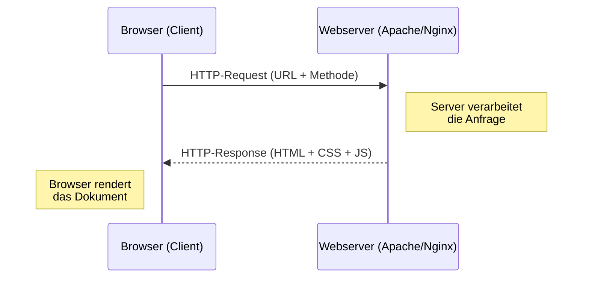

# 01 — Einfuehrung Web

**Folien:** [[web-engineering/resources/01-Einfuehrung-Web.pdf|01-Einfuehrung-Web.pdf]]
**Lernziele:** [[web-engineering/lernziele/webeng-lernziele-01|Lernziele Vorlesung 1]]

**Dozenten:** Prof. Dr. Volker Sander, Johanna Roussel M.Sc., Marco Mix M.Sc.

## Inhaltsverzeichnis

- [[#Themen der Vorlesung (Gesamtuebersicht)|Themen der Vorlesung (Gesamtuebersicht)]]
- [[#Das klassische World Wide Web|Das klassische World Wide Web]]
- [[#Die Evolution des Internets|Die Evolution des Internets]]
- [[#Motivation|Motivation]]
- [[#Webserver|Webserver]]
- [[#Bezug zu Lernzielen|Bezug zu Lernzielen]]

---

## Themen der Vorlesung (Gesamtuebersicht)

1. **Einfuehrung und Grundverstaendnis** — Motivation, HTML, CSS, HTTP
2. **Dynamisches HTML am Beispiel von PHP** — Elementare Syntax, Basisanwendungen
3. **Die Basis moderner Web-Anwendungen: JavaScript** — Syntax, AJAX, Fetch, OOP, Node.js, Express, Middlewares, REST
4. **Klassische Server-Technologien** — Apache, nginx
5. **Exkurs Java-basierte Technologien** — Servlets
6. **Sicherheit** — SOP/CORS, OWASP

Begleitet durch Praktika (Uebungen) und Projekte.

> [!info] Hinweis
> Ziel ist es, die fundamentalen Konzepte der Technologien zu vermitteln. Die Veranstaltung konzentriert sich auf Basistechnologien und Konzepte. Gute Ergaenzung zur Veranstaltung [[kommunikationssysteme/komsys-index|Kommunikationssysteme]].

---

## Das klassische World Wide Web

Globaler Informationsraum:
1. **URLs** als Bezeichner von Dokumenten (Ressourcen) im Netz
2. **HTML** reichert den Inhalt an: Auszeichnungselemente beschreiben die Dokumentenstruktur
3. **Hyperlinks** als Navigationshilfe zum Verlinken von Dokumenten
4. Zugriff auf Information durch **Browser** (Client) mittels **URL**, einem standardisierten Netzwerkprotokoll (**HTTP**) und einem bereitstellenden Prozess (**Web-Server**)

## Die Evolution des Internets

| Jahr | Ereignis |
|------|----------|
| 1968 | Entwicklung des ARPANET (Vorlaeufer des Internet) |
| 1971 | Erste Email wird verschickt |
| 1981 | IPv4, ICMP und TCP werden standardisiert |
| 1984 | DNS-Einfuehrung |
| 1990 | Tim Berners-Lee erstellt die erste Webseite, schreibt den ersten Browser: WorldWideWeb |
| 1994 | Mosaic (erster "richtiger" Browser), Yahoo entsteht |
| 1995 | PHP 1.0 |
| 1997 | Google-Suchmaschine |
| 1999 | IE7 mit erstem kompletten AJAX-Stack |
| 2004 | Web 2.0 — **User-Generated Content**, Facebook |
| 2009 | Node.js |
| 2014 | Microsoft: "Mobile first, cloud first" |
| 2017 | 50% der Weltbevoelkerung haben Internet |

## Motivation

**Das urspruengliche Web besteht aus:**
- Dokumenten samt Strukturinformationen (HTML), eindeutig adressiert (URL), die sich untereinander referenzieren koennen
- Einem festen Uebertragungsprotokoll: **HTTP**
- **Servern**, die die Dokumente bereitstellen
- **Clients** (Browser), die Anfragen an den Server uebertragen und die Antwort praesentieren

**Klassische Client-Server-Architektur:** Server warten auf Anfragen, Clients stellen Anfragen und warten auf Antwort.

---

## Webserver

### Apache — Marktanteile (Feb 2024)
- Nginx: 34.1%, Apache: 30.2%, Cloudflare: 21.6%, LiteSpeed: 13.1%, Microsoft-IIS: 5.0%, Node.js: 3.1%

### Apache — Verzeichnisstruktur
- **XAMPP Windows:** `xampp/apache/` mit `conf/httpd.conf`, `bin/httpd.exe`, `htdocs/` (DocumentRoot)
- **Apache Ubuntu:** `/etc/apache2/apache2.conf`, `/usr/sbin/apache2ctl`, `/var/www/html/` (DocumentRoot)

### XAMPP — nur Entwicklungssystem!
- Viele Konfigurationen im Produktiveinsatz unsicher (PHP Errors sichtbar, Verzeichnisinhalte sichtbar)
- **Produktivumgebungen:** Ubuntu, Debian, Red Hat, Docker Container

---

## Bezug zu [[web-engineering/lernziele/webeng-lernziele-01|Lernzielen]]

**Lernziel 5 — Do's und Dont's bei HTML:**
- Web-Seiten bestehen aus drei Sauelen: **HTML** (Inhalt/Struktur), **CSS** (Design), **JavaScript** (Logik)
- Diese drei Belange muessen strikt getrennt werden
- XAMPP ist nur fuer Entwicklung geeignet, nicht fuer Produktion
