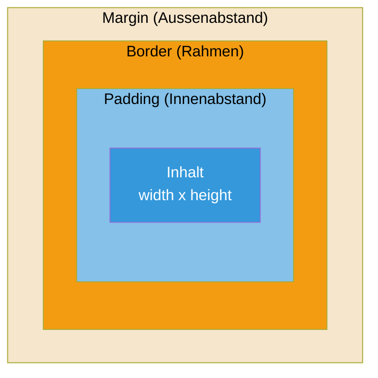

# 03 — Einfuehrung CSS

**Folien:** [[web-engineering/resources/03-Einfuehrung-CSS.pdf|03-Einfuehrung-CSS.pdf]]
**Lernziele:** [[web-engineering/lernziele/webeng-lernziele-01|Lernziele Vorlesung 1]]


## Inhaltsverzeichnis

- [[#Was ist CSS?|Was ist CSS?]]
- [[#CSS einbinden — 3 Wege|CSS einbinden — 3 Wege]]
- [[#CSS Selektoren|CSS Selektoren]]
- [[#CSS Wertangaben|CSS Wertangaben]]
- [[#CSS Eigenschaften|CSS Eigenschaften]]
- [[#Anzeige und Positionierung|Anzeige und Positionierung]]
- [[#Flexbox|Flexbox]]
- [[#CSS Grids|CSS Grids]]
- [[#Bootstrap|Bootstrap]]
- [[#Bezug zu Lernzielen|Bezug zu Lernzielen]]

---

## Was ist CSS?

- **Formatierungssprache fuer HTML-Dokumente**
- HTML dient der Strukturierung und semantischen Auszeichnung
- CSS dient dem **Formatieren/Stylen** des Dokuments
- Ermoeglicht unterschiedliche Darstellungen fuer verschiedene Ausgabemedien (Bildschirm, Papier): **Responsives Design!**

### Trennung von Inhalt und Design
- Optimalfall: Austausch des Designs ohne Veraenderung des Dokuments
- **"inline"-HTML-Style vermeiden** — keine font-Tags o.Ae.
- Besser: HTML-Elemente mit CSS-Klassen und IDs versehen
- Idee: Wiederverwendbare Stil-Elemente schaffen (Bootstrap)

### Was CSS steuert
- Farben (Vordergrund, Hintergruende, Rahmen)
- Schriftgroessen, -farben, -arten, -stile
- Textformatierungen, Rahmen, Raender
- Positionierung (pixelgenau!)

---

## CSS einbinden — 3 Wege

**1. Einbinden im `<head>` (empfohlen!)**
```html
<link rel="stylesheet" href="style.css" type="text/css">
```
- Wiederverwendbar ueber mehrere Dokumente
- Fuer Bibliotheken: Content-Delivery Networks (CDN)

**2. `<style>`-Element im `<head>`**
```html
<style type="text/css">
  h1 { font-size: 200%; }
</style>
```

**3. style-Attribut (unschoen, nicht wiederverwendbar)**
```html
<h1 style="font-size:200%;">Ueberschrift</h1>
```

---

## CSS Selektoren

**Aufbau eines CSS-Dokuments:**
```css
Selektor {
    Eigenschaft: Wert;
}
Selektor1, Selektor2 {
    Eigenschaft: Wert;
    /* Kommentar */
}
```

- Selektoren sprechen eine Menge von HTML-Elementen an
- Spezifizierte Eigenschaften werden auf diese Elemente angewendet

**Beispiele:**

| Selektor | Selektiert | Beispiel-HTML |
|----------|-----------|---------------|
| `h1` | Alle h1-Tags | `<h1>...</h1>` |
| `p strong` | strong innerhalb von p | `<p><strong>...</strong></p>` |
| `p.first` | p mit class="first" | `<p class="first">...</p>` |
| `p, li` | Alle p- und li-Tags | |
| `input[name=pw]` | input mit name="pw" | `<input name="pw" .../>` |
| `.hl` | **Alle** Tags mit class="hl" | |
| `div#navi` | div mit id="navi" | `<div id="navi">...</div>` |
| `a:hover` | a-Tag beim Mouseover | |

---

## CSS Wertangaben

### Relative Laengenangaben

| Einheit | Beschreibung | Beispiel |
|---------|-------------|----------|
| `%` | Relativ zum Elternelement | `width: 50%;` |
| `em` | 1em = Schriftgroesse des Elements | `border-width: 1em;` |
| `vw`, `vh` | Viewport width/height (in % des Browserfensters) | `font-size: 3vw;` |

- **Viewport** = sichtbarer Bereich im Browser
- Fuer Druckmedien: cm, mm, in
- Weitere relative Einheiten: ex, ch, rem, vmin, vmax

### Farben
- **RGB-Farbmodell:** Angabe als (rot, gruen, blau), Werte 0-255
- Hexadezimal: `#ffff00` (gelb), Kurzform: `#ff0`
- **RGBA:** mit Deckkraft, z.B. `rgba(255, 255, 0, 0.5)` = Gelb mit 50% Deckkraft
- Vordefinierte Farbwerte: `red`, `blue`, `cyan`, `yellow`

---

## CSS Eigenschaften

### Text- und Schriftformatierung
```css
font-family: Arial, sans-serif;  /* Schriftart */
font-style: italic;              /* kursiv */
font-size: 20px;                 /* Schriftgroesse */
font-weight: bold;               /* fett */
color: blue;                     /* Textfarbe */
text-align: center;              /* zentrieren */
font: 20px Arial, sans-serif;    /* Kurzform */
```

### Rahmenformatierung
```css
border-width: 10px;
border-style: solid;
border-color: red;
border: 10px solid red;    /* Zusammengefasst */
border-radius: 5px;        /* Rundung der Ecken */
```
- Aufschluesselung moeglich: `border-top`, `border-right`, `border-bottom`, `border-left`
- **Besser relative Angaben (z.B. 1em) statt px!**

### Hintergrundformatierung
```css
background-color: red;
background-image: url(logo.png);
background-position: 10px 20px;
background-repeat: no-repeat;
```

---

## Anzeige und Positionierung

### Absolute Positionierung (vermeiden!)
```css
position: absolute;
left: 100px;
top: 100px;
```
- Nur in seltenen Faellen notwendig, meistens kontraproduktiv

### Formatierung einer Box
```css
width: 100px;               /* Breite */
height: 100px;              /* Hoehe */
margin: 10px;               /* Aussenabstand */
padding: 5px 10px 5px 10px; /* Innenabstand */
display: none;              /* Display-Typ */
```

### Das Box-Modell

Jedes HTML-Element ist eine Box mit folgenden Schichten (von innen nach aussen):
1. **Inhalt** (width x height)
2. **Padding** (Innenabstand)
3. **Border** (Rahmen)
4. **Margin** (Aussenabstand)

**Standard-Kalkulation:**
`width + padding + border = tatsaechliche Breite`

**Konsequenz:** Padding und Border beeinflussen die Groesse der Box!

**Loesung:** `box-sizing: border-box` — damit beinhaltet width/height auch Padding und Border.



**Empfehlung:** Alle Elemente so setzen:
```css
* { box-sizing: border-box; }
```

### Best Practices
- Keine festen Werte fuer Breite/Hoehe, sondern relative (`width: 27%; padding: 1em;`)
- Abstaende ueber Padding festlegen
- Relative Laengenmasse nutzen, die sich an Schriftgroesse anpassen (em)

---

## Flexbox

- Ermoeglicht **responsive Anordnungen multipler Elemente**
- Ein Flexbox-Container beinhaltet **Flex-Items**
- Items werden entlang einer Flex-Line ausgerichtet (default: horizontal, linksbuendig)
- Aktivierung: `display: flex;`
- Einzelne Items koennen durch `nth-of-type(zahl)` differenziert werden
- Flexbox = **eindimensionale** Layouts

## CSS Grids

- Mittels Flexbox koennen eindimensionale Strukturen verwaltet werden
- **CSS Grids** ermoglichen **zweidimensionale** Layouts
- Anlegen eines Rasters, Kindelemente werden ohne feste Groessenangaben positioniert

---

## Bootstrap

- Responsives Design wird zumeist mittels existierender Frameworks erreicht
- **Bootstrap** ist das populaerste CSS-Framework (nicht nur CSS)
- Benoetigt ab Version 4 aktuellere Browser
- Verfolgt einen **Mobile-First-Ansatz:** Layout wird zunaechst fuer kleine Bildschirme entworfen
- Viewport-Meta-Tag erforderlich: `<meta name="viewport" content="width=device-width, initial-scale=1">`
- Einbindung ueber CDN im `<head>`:
```html
<link rel="stylesheet" href="https://maxcdn.bootstrapcdn.com/bootstrap/..." crossorigin="anonymous">
```

---

## Bezug zu [[web-engineering/lernziele/webeng-lernziele-01|Lernzielen]]

**Lernziel 6 — CSS-Einbindung:**
- Drei Wege: externe Datei per `<link>` im `<head>` (empfohlen!), `<style>`-Block im `<head>`, inline per `style`-Attribut (vermeiden)
- Externe CSS-Dateien sind wiederverwendbar ueber mehrere Seiten, Bibliotheken kommen ueber CDNs

**Lernziel 7 — CSS-Selektoren:**
- Element-Selektor: `h1 { ... }` — alle h1
- Klassen-Selektor: `.classname { ... }` — alle Elemente mit dieser Klasse
- ID-Selektor: `#id { ... }` — ein spezifisches Element
- Nachfahren-Selektor: `p strong { ... }` — strong innerhalb von p
- Attribut-Selektor: `input[name=pw] { ... }`
- Pseudo-Klassen: `a:hover { ... }` — bei Mouseover
- Komma fuer Mehrfach-Selektion: `p, li { ... }`

**Lernziel 8 — Das Box-Modell:**
- Jedes Element besteht aus: Inhalt → Padding → Border → Margin
- Standard: `width` bezieht sich nur auf den Inhalt, Padding/Border kommen dazu
- Mit `box-sizing: border-box` bezieht sich `width` auf alles inkl. Padding und Border
- Empfehlung: `* { box-sizing: border-box; }` global setzen
- Relative Einheiten (%, em, vw/vh) statt absolute (px) verwenden

**Lernziel 9 — Bootstrap:**
- Populaerstes CSS-Framework fuer Responsives Design
- Mobile-First-Ansatz: erst fuer kleine Bildschirme designen, dann hochskalieren
- Einbindung ueber CDN im `<head>`, benoetigt Viewport-Meta-Tag

**Lernziel 10 — Responsives Design:**
- Ziel: eine Webseite passt sich an verschiedene Bildschirmgroessen an (Desktop, Tablet, Mobile)
- Erreicht durch: relative Einheiten (%, em, vw/vh), Flexbox, CSS Grids, Frameworks wie Bootstrap
- Flexbox fuer eindimensionale Layouts, CSS Grid fuer zweidimensionale
- Viewport = sichtbarer Bereich im Browser, aendert sich bei Fenstergroessenaenderung
