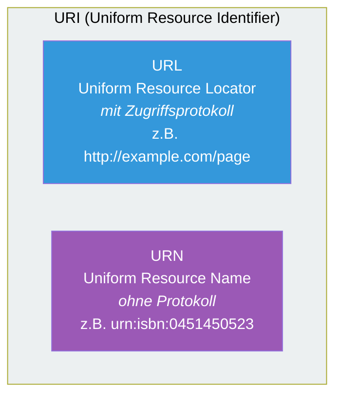
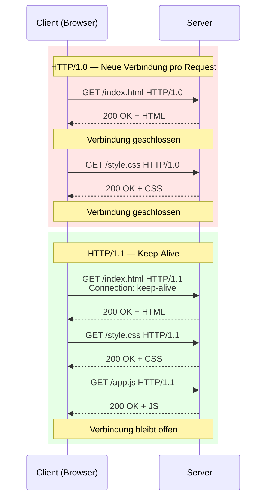
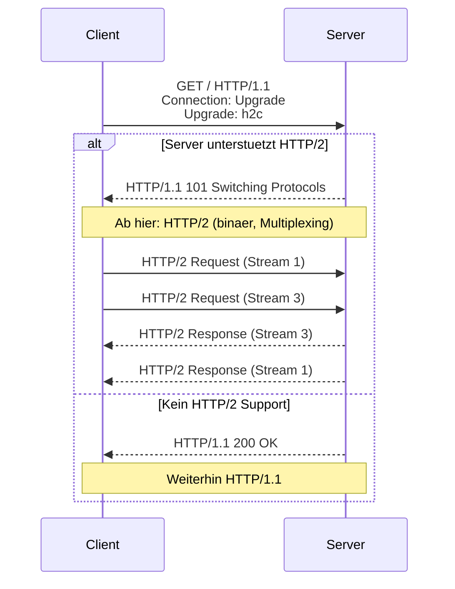

# 04 — Einfuehrung HTTP

**Folien:** [[web-engineering/resources/04-Einfuehrung-HTTP.pdf|04-Einfuehrung-HTTP.pdf]]
**Lernziele:** [[web-engineering/lernziele/lernziele-02|Lernziele Vorlesung 2]]

## HTTP — Hypertext Transfer Protocol

- **Zustandsloses Anfrage-/Antwort-Protokoll**
- Textbasiert unter Nutzung einer zeilenbasierten Struktur (pre 2.0)
- Dient der Uebertragung von Ressourcen zwischen Server und Client
- Endpunkt wird ueber URL identifiziert (Port 80/443): `Protokoll://Host:Port/Ort?Parameter`
- HTTP/1.1 im RFC 2616 (1999)

---

## Adressierung: URI, URL, URN

### URI (Uniform Resource Identifier)
- Eindeutige Adressierung von abstrakten und physikalischen Ressourcen im Internet (RFC 2396)
- **URI = URL ∪ URN**



### URL (Uniform Resource Locator)
- Adressierung von Informationsobjekten **mit Festlegung des Zugangsprotokolls** (RFC 2141)
- Jede URL ist auch eine URI

### URN (Uniform Resource Name)
- Adressierung **ohne Protokoll** — eindeutige, gleichbleibende Referenz (RFC 1738)

### URL-Syntax
`<Schemata>:<Schemata-spezifischer-Teil>`

**HTTP URL:** `http://<user>:<password>@<host>:<port>/<url-path>?<query-parameter>`

### Relative URLs
- Wenn Schemaname und ":" fehlen → relative URL
- **Basis-URL** = alle Zeichen bis (einschliesslich) zum letzten `/` im Pfadnamen
- Aus Basis-URL + relativer URL ergibt sich immer eine absolute URL

| Relative URL | Absolute URL (Basis: `http://www.example.com/html/`) |
|-------------|------------------------------------------------------|
| `about.html` | `http://www.example.com/html/about.html` |
| `path/` | `http://www.example.com/html/path/` |
| `/` | `http://www.example.com/` |
| `../` | `http://www.example.com/` |
| `./about.html` | `http://www.example.com/html/about.html` |

### Zeichensatz der URLs (URL Encoding)
- RFC 3986 erlaubt Nicht-ASCII-Zeichen nur indirekt durch **Prozentkodierung**
- Nationale Sonderzeichen → hexadezimale Darstellung mit `%` vorangestellt
  - Beispiele: ß → `%DF`, ] → `%5D`, } → `%7D`
- Leerzeichen → `+` (oder `%20`)
- **Nur ASCII-Zeichen als Dateiname empfohlen**
- Sonderzeichen `%`, `+`, `&`, `=`, `:` muessen ebenfalls kodiert werden (z.B. `%26` fuer `&`)

---

## HTTP im OSI-Modell

HTTP ist ein Anwendungsprotokoll (Schichten 5-7 im OSI-Modell), basiert auf TCP (Schicht 4) und IP (Schicht 3). Siehe [[kommunikationssysteme/kommunikationssysteme|Kommunikationssysteme]].

## Client-Server-Modell

- Kurzlebiger Client-Prozess stellt Anfragen an langlebigen Server-Prozess
- **Zustandslosigkeit vereinfacht den Server:** Anfrage enthaelt alles zur Bearbeitung, keine Abhaengigkeiten ueber Aufrufgrenzen hinweg

### Varianten
- **Replizierte Server:** Mehrere Server-Replikate fuer Performance und Ausfallsicherheit (z.B. Google, eBay)
- **Forward Proxy:** Zwischenspeichern/Filtern/Anonymisieren von Client-Anfragen
- **Reverse Proxy:** Lastbalancierung, Kontaktpunkt der Anfragen weiterleitet

### Content Delivery Networks (CDN)
- Bibliotheken nicht alle vom gleichen Server laden → Verteilungsstrategie
- CDN repliziert Inhalt auf geografisch verteilte Server
- Clients nutzen automatisch den naechsten Server (IP-Anycast oder GeoDNS)
- Lastverteilung mittels HTTP-Redirects

---

## HTTP Ablauf

### Urspruenglicher Ablauf (HTTP/1.0)
1. **Verbindungsaufbau:** Client baut TCP/IP-Verbindung zum Server auf
2. **Request:** Client sendet HTTP-Anfrage (Kommando, URL, Protokoll-Version, Header)
3. **Response:** Server antwortet mit Statuscode, Header-Elementen und Dokument
4. **Verbindung schliessen:** Bei HTTP/1.0 wurde die Verbindung geschlossen

Seit **HTTP/1.1:** Client kann mittels `Connection: keep-alive` die TCP-Verbindung offen halten.



**Keep-Alive Parameter:**
- **Timeout:** Maximale Zeitspanne (5-15 Sekunden) nach letzter Aktivitaet
- **MaxKeepAliveRequests:** Maximale Anfragen pro Verbindung (50-100)

---

## Request und Response — Formaler Aufbau

**Request:**
```
Request-Line  = Method SP Request-URI SP HTTP-Version CRLF
*(Header-Field CRLF)
CRLF
[message-body]
```

**Response:**
```
Status-Line   = HTTP-Version SP Status-Code SP Reason-Phrase CRLF
*(Header-Field CRLF)
CRLF
[message-body]
```

### Request-Methoden

| Methode | Bedeutung |
|---------|-----------|
| **GET** | Anforderung der im Request-URI angeforderten Ressource |
| **POST** | Uebertragung von Daten an den Server (im Body) |
| **HEAD** | Wie GET, aber nur Header (kein Seiteninhalt) |
| **PUT** | Uebertragung einer neuen Ressource an den Server |
| **DELETE** | Loeschen von Dokumenten auf dem Server |
| **OPTIONS** | Ermitteln der erlaubten Methoden fuer eine Ressource |
| **TRACE** | Testzwecke: Anfrage wird vom Server zurueckgeschickt |

- Zunaechst nur GET und POST genutzt, teilweise HEAD
- Weitere Methoden durch REST-Anwendungen populaer (+ PATCH)

### GET vs. POST

**GET:**
- Daten in der URL (`?key=value&key2=value2`), **kein HTTP-Body**
- Kann als Lesezeichen gespeichert werden
- **Nicht geeignet fuer grosse Datenmengen**
- Daten werden geloggt und gecacht → **keine sensiblen Daten per GET!**

**POST:**
- Daten im HTTP-Body (nicht in der URL sichtbar)
- Content-Length-Header erforderlich
- Geeignet fuer grosse Datenmengen, freies Encodieren
- Wird i.d.R. nicht mitgeloggt/gecacht
- **Leerzeile** trennt Header von Body

### HTML Formulare
```html
<form action="do.php?q=login" method="post">
  <input type="text" name="username" />
  <input type="password" name="pw" />
  <input type="submit" value="Login" />
</form>
```

Wichtige `<input type="...">`: text, password, submit, radio, checkbox, file, hidden, number, date, datetime, email, range, url

### Statuscodes

| Code | Bedeutung |
|------|-----------|
| 1xx | **Informational** — Anforderung empfangen, Aktion folgt |
| 2xx | **Success** — Erfolgreiche Abarbeitung |
| 3xx | **Redirection** — Objekt an anderer Stelle |
| 4xx | **Client Error** — Falsche/Unerlaubte Anfrage |
| 5xx | **Server Error** — Server kann Anfrage nicht ausfuehren |

Beispiele: 200 OK, 201 Created, 301 Moved Permanently, 302 Moved Temporarily, 404 Not Found, 500 Internal Server Error

### Wichtige Header-Felder

**Request-Header:**
- `Host` — Pflicht seit HTTP/1.1, ermoeglicht Virtual Hosts
- `Accept` — Akzeptierte MIME-Typen
- `Accept-Encoding` — Akzeptierte Komprimierung (gzip, deflate, br)
- `Accept-Language` — Bevorzugte Sprachen
- `Connection` — keep-alive (HTTP/1.1) oder close
- `User-Agent` — Browser-Identifikation
- `Cookie` — gespeicherte Cookie-Daten

**Response-Header:**
- `Content-Type` — MIME-Typ (z.B. text/html; charset=utf-8)
- `Content-Length` — Groesse der Antwort
- `Content-Encoding` — Komprimierung (z.B. gzip)
- `Server` — Server-Software
- `Date` — Zeitstempel

### MIME (Multipurpose Internet Mail Extensions)
- Definiert Kodierungsregeln fuer Nicht-ASCII-Nachrichten
- `Content-Type` legt den Datentyp fest (type/subtype)
- Bei HTTP: `Content-Encoding` und `Transfer-Encoding` statt `Content-Transfer-Encoding`

---

## HTTP Evolution

### HTTP/1.0 (1996, RFC 1945)
- Jede Operation = separate TCP-Verbindung → grosser Overhead durch TCP-Handshake und Slow-Start

### HTTP/1.1 (1999, RFC 2616)
- **Persistente Verbindungen:** `Connection: keep-alive`
- **Virtual Hosts:** `Host`-Header Pflicht → mehrere Domains auf einer IP-Adresse
- Pipelining erlaubt, aber in Browsern meist deaktiviert

### HTTP/2 (2015, RFC 7540)
- Beschleunigung der Datenuebertragung
- **Abwaertskompatibel** zu HTTP/1.1 (URL-Schema bleibt) → Upgrade der Verbindung
- Uebertragung der Protokollparameter ist **binaer** (nicht mehr textbasiert)

**Wichtige Neuerungen:**
- **Multiplexing:** Mehrere Anfragen gleichzeitig, ohne auf Antwort zu warten. Anfrage-Stream bleibt offen (END_STREAM-Flag). **Keep-Alive-Header entfaellt**
- **Header-Compression:** Effizientere Uebertragung der Header
- **Server-PUSH:** Server kann proaktiv Daten senden (z.B. CSS/JS die sowieso benoetigt werden)

### HTTP/2 Upgrade-Mechanismus
Client sendet HTTP/1.1 Request mit:
```
Connection: Upgrade, HTTP2-Settings
Upgrade: h2c
```
- Server unterstuetzt HTTP/2 nicht → antwortet normal mit HTTP/1.1 200 OK
- Server unterstuetzt HTTP/2 → antwortet mit `HTTP/1.1 101 Switching Protocols` → ab hier HTTP/2



---

## Bezug zu [[web-engineering/lernziele/lernziele-02|Lernzielen]]

**Lernziel 1 — Struktur von HTTP/1.1:**
- Request: Request-Line (Method SP URI SP Version) + Header-Zeilen + Leerzeile + optionaler Body
- Response: Status-Line (Version SP Code SP Phrase) + Header-Zeilen + Leerzeile + Body
- Alles zeilenbasiert (CRLF), textbasiert, Header als Key-Value-Paare

**Lernziel 2 — Zustandsloses Anfrage-Antwort-Protokoll:**
- HTTP ist zustandslos: jede Anfrage ist unabhaengig, der Server speichert keinen Zustand zwischen Anfragen
- Wenige Operationen: GET, POST, HEAD, PUT, DELETE, OPTIONS, TRACE (+ PATCH)
- Vereinfacht Serverdesign: Neustart ohne Datenverlust, keine Abhaengigkeiten zwischen Requests

**Lernziel 3 — Wichtige Header-Felder:**
- `Host` (Pflicht, Virtual Hosts), `Connection` (keep-alive/close, ermoeglicht persistente Verbindungen), `Content-Type` (MIME-Typ), `Content-Length`, `Accept`, `User-Agent`, `Cookie`
- `Connection: keep-alive` wurde mit HTTP/1.1 eingefuehrt, um TCP-Verbindungen wiederzuverwenden

**Lernziel 4 — Status-Codes und Kodierungsproblematik:**
- 1xx Info, 2xx Erfolg, 3xx Redirect, 4xx Client-Fehler, 5xx Server-Fehler
- Wichtigste: 200 OK, 201 Created, 301 Moved Permanently, 302 Moved Temporarily, 404 Not Found, 500 Internal Server Error
- URL-Encoding: Nicht-ASCII-Zeichen muessen prozentkodiert werden (%XX), Sonderzeichen wie &, =, % ebenfalls

**Lernziel 5 — URI/URL-Struktur:**
- URI = Oberbegriff (URL ∪ URN). URL = URI + Zugriffsprotokoll. URN = URI ohne Protokoll
- URL-Aufbau: `schema://user:pw@host:port/path?query`
- Relative URLs: kein Schema → werden relativ zur Basis-URL aufgeloest (alles bis zum letzten `/`)

**Lernziel 6 — HTTP/2 Unterschiede:**
- Binaer statt textbasiert, Multiplexing (mehrere Anfragen parallel ohne Warten), Header-Compression, Server-PUSH
- Keep-Alive entfaellt (Verbindungen sind immer persistent), Streams mit END_STREAM-Flag

**Lernziel 7 — HTTP/2 Upgrade:**
- Client sendet HTTP/1.1-Request mit `Connection: Upgrade` und `Upgrade: h2c`
- Server antwortet entweder mit normalem HTTP/1.1 (kein Support) oder `101 Switching Protocols` → ab dann HTTP/2
- Abwaertskompatibel: URL-Schema aendert sich nicht
