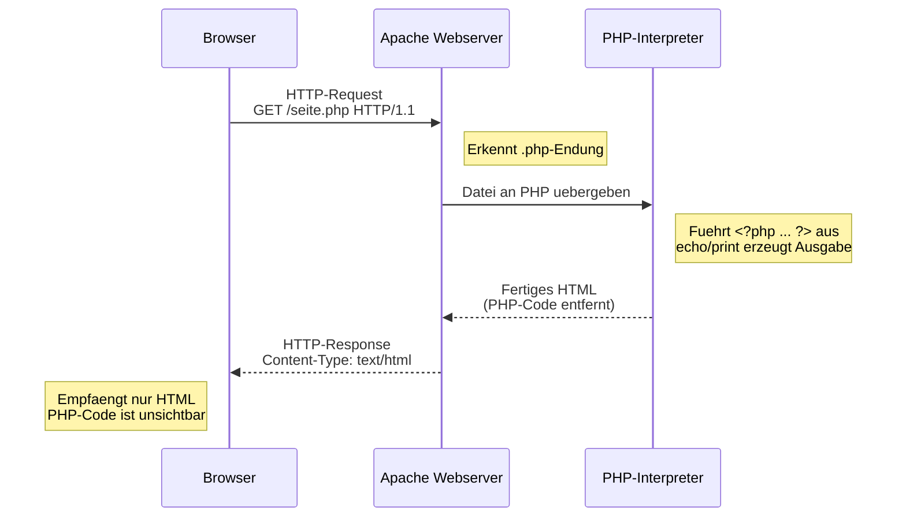

# 05 — PHP Einfuehrung

**Folien:** [[web-engineering/resources/05-PHP-Einfuehrung.pdf|05-PHP-Einfuehrung.pdf]]
**Lernziele:** [[web-engineering/lernziele/lernziele-02|Lernziele Vorlesung 2]]

## PHP — Grundlagen

- Entwickelt 1995 von Rasmus Lerdorf als "Personal Home Page"
- Spaeter umbenannt in **PHP: Hypertext Processor**
- **Im Web-Server integrierte Skriptsprache** zur Verarbeitung von Formulardaten (GET/POST)
- Aktuelle Version: PHP 8.5 (2025)
- Dokumentation: php.net

### Voraussetzungen
- Installierter PHP-Interpreter notwendig
- Typisch: **LAMP/WAMP-Stack** (Linux/Windows, Apache, MySQL, PHP)
- PHP ist **in den Adressraum des Apache-Servers integriert**

### Ablauf einer PHP-Anfrage
1. Browser stellt mittels GET/POST die Anfrage an den Server
2. **Dateiendung `.php`** signalisiert dem Server, dass PHP-Code enthalten ist
3. PHP-Interpreter durchlaeuft die Datei, interpretiert markierten Code (`<?php ... ?>`) und fuehrt ihn aus
4. Die **Ausgabe** des Codes wird in das an den Browser gesendete HTML integriert
5. **Der Code ist fuer den Nutzer nicht sichtbar** — nur die Ausgabe wird uebertragen



### Syntax-Grundlagen
```php
<?php
    $titel = 'Web-Engineering';
    $gruss = 'Willkommen im Kurs!';
?>
<!DOCTYPE html>
<html>
<head>
    <title><?php echo $titel; ?></title>
</head>
<body>
    <?php echo $gruss; ?>
</body>
</html>
```

---

## Variablen

- Dargestellt durch **Dollar-Zeichen** (`$`) gefolgt vom Namen
- **Keine explizite Deklaration!**
- **Kein fester Typ!** (dynamisch typisiert)
- Nicht initialisierte Variablen haben Vorgabewert (false, null, leerer String, leeres Array)

### Datentypen

| Typ | Beschreibung | Beispiel |
|-----|-------------|----------|
| boolean | Wahrheitswert | `true`, `false` |
| integer | Ganzzahl | `0`, `123`, `-12`, `0xFF` |
| float/double | Fliesskommazahl | `3.14`, `1.2e5` |
| string | Zeichenkette | `'foo'`, `"bar"` |
| array | Assoziatives Array | `[]`, `[1, 2, 3]`, `['key' => 'val']` |
| object | Objekt | `new Car()` |
| NULL | Variable ohne Wert | `NULL` |
| resource | Referenz zu Ressource | `mysql_connect(...)` |
| callable | Funktionszeiger | `function() { }` |

### Typumwandlung
- **Implizit:** PHP castet automatisch — fuehrt schnell zu Problemen!
  - `$foo = '5'; $foo += 3;` → `8` (String wird zu int)
  - `$foo = '10 Mann' + $foo;` → `18`
  - `$foo += array();` → **FATAL ERROR**
- **Explizit:** `(double)`, `(int)`, `(boolean)`, `(string)` — **besser explizit casten!**

### Vergleich: `==` vs. `===`
- **`==` (typschwach):** Vergleicht nach Typumwandlung → **gefaehrlich!**
  - `true == 'php'` → TRUE, `'php' == 0` → TRUE, aber `0 != true` → Widerspruch!
- **`===` (typstark):** Nur bei gleichem Typ UND gleichem Wert → TRUE
  - **Immer `===` verwenden!**

---

## Strings

### Einfache Anfuehrungszeichen (`'...'`)
- Steuerzeichen (`$`, `\n`) werden **nicht interpretiert**
- `echo '2+3 = $fuenf';` → `2+3 = $fuenf`

### Doppelte Anfuehrungszeichen (`"..."`)
- Steuerzeichen werden **interpretiert**, Variablen werden erkannt
- `echo "2+3 = $fuenf";` → `2+3 = 5`
- Fuer komplexe Ausdruecke: `"2+3 = {$fuenf}th"`

**Faustregel:** Einfache Anfuehrungszeichen fuer Strings ohne Variablen, doppelte fuer Strings mit Variablen/SQL.

### Verkettung
- **Punktoperator** (`.`) fuer String-Verkettung:
```php
$fh = 'FH' . ' ' . 'Aachen';  // 'FH Aachen'
$ort = 'Raum ' . $id;          // 'Raum 305'
$ort .= ' (3. OG)';            // 'Raum 305 (3. OG)'
```

---

## Arrays

- **Keine feste Groesse**
- **Assoziative Arrays** sind der Standard (Strings als Key)
- Mischformen von String und Integer als Key erlaubt
- Numerische Arrays starten mit 0, koennen Luecken haben
- Zugriff auf nicht definierte Indizes → `null` (mit `isset()` oder `array_key_exists()` pruefen!)

### Erstellung
```php
$normal = [];
$mix1   = [2, 4, 8, 'Tomate'];
$mix2   = ['foo' => 'bar', 12 => true];
$colors = ['rgb1' => [0, 0, 255]];
```

### Zugriff und Bearbeitung
```php
$arr = [];
$arr[] = 'EINS';           // array('EINS')
$arr[] = 'ZWEI';           // array('EINS', 'ZWEI')
$arr[0] = 'NEU';           // array('NEU', 'ZWEI')
$arr['a'] = 5;             // array(0 => 'NEU', 1 => 'ZWEI', 'a' => 5)
echo $arr[1];              // 'ZWEI'
```

---

## Sprachkonstrukte

### Bedingungen und Schleifen
- Bekannt aus Java: `if`, `else if`, `else`, `for`, `while`, `do-while`, `break`, `continue`

### foreach-Schleife
```php
foreach ($arr as $value) { ... }
foreach ($arr as $key => $value) { ... }
```

### Dateien einbinden: require vs. include
- `require 'file.php'` → **Fatal Error** bei Fehler (Ausfuehrung bricht ab)
- `include 'file.php'` → **Warning** bei Fehler (Skript laeuft weiter)
- `require_once` / `include_once` → bindet Datei nur einmal ein
- **Benutzereingaben niemals in include/require-Pfade!**

### Sonstige Befehle
- `isset($var)` — prueft ob Variable existiert und nicht NULL ist
- `empty($var)` — TRUE fuer: `''`, `array()`, `0`, `0.0`, `'0.0'`, `NULL`, `FALSE`
- `define('NAME', $value)` — globale Konstante (ohne `$`): `echo VERSION;`

---

## Objektorientierung

```php
class Auto {
    private $farbe = 'blau';
    private $ps;
    public static $speedLimit = 100;

    public function __construct($ps = 60) {
        $this->ps = $ps;
    }
    public function getPs() {
        return $this->ps;
    }
}
$auto = new Auto();
$geschw = $auto->getPs();  // 60
```

**Zugriff auf Membervariablen:**
- `$this->name` — innerhalb der Klasse
- `$objekt->name` — ausserhalb (falls public)
- `self::name` — statische Variable
- `parent::name` — Elternklasse (statisch)

---

## Funktionen

- Funktionen sind **nicht typsicher** — koennen verschiedene Typen zurueckgeben
- **Vorgabewerte** fuer Parameter moeglich: `function machKaffee($typ = 'Kaffee') { ... }`
- **Call-By-Reference:** `function toggle(&$value) { ... }`
- **Variable Anzahl von Parametern:** `func_num_args()`, `func_get_arg(0)`, `func_get_args()`
- **Geltungsbereich:** Variablen sind durch Funktionen gegliedert. Aeussere Variablen nur mit `global` erreichbar

### Lambdas (Anonyme Funktionen)
- Funktionszeiger in Variable gespeichert, kann wie Funktion benutzt und als Argument uebergeben werden
```php
$eineFunktion = function () {
    echo 'Ich bin eine anonyme Funktion!';
};
$eineFunktion();  // Aufruf

// Als Parameter:
$mySort = function($a, $b) { return $b - $a; };
usort($array, $mySort);

// Direkt als Argument (Wegwerffunktion):
echoText(function () { return 'Ich bin cool'; });
```

### Closures
- Ein Lambda wird zum **Closure**, wenn es **Zugang zu Variablen bekommt, die normalerweise nicht zur Verfuegung stuenden**
- In PHP muessen Variablen **explizit mit `use`** gebunden werden (nicht automatisch wie in anderen Sprachen)
- Standard: `use` captured **by value**. Fuer by reference: `use (&$var)`

```php
$dayPrepare = function() {
    $dayNames = array('Mo', 'Di', 'Mi', 'Do', 'Fr', 'Sa', 'So');
    return function($day) use ($dayNames) {
        return $dayNames[$day];
    };
};
$dayNameGetter = $dayPrepare();
echo $dayNameGetter(1);  // 'Di'
```

**Closure-Fabrik (Counter-Beispiel):**
```php
function makeCounter() {
    $c = 0;
    return function() use (&$c) { return ++$c; };
}
$cnt = makeCounter();
echo $cnt();  // 1
echo $cnt();  // 2
```

- Closures erlauben beliebig haeufige Instanziierung (im Gegensatz zu `static`)
- Closures ermoeglichen das Prinzip der **Dependency Injection**

---

## Bezug zu [[web-engineering/lernziele/lernziele-02|Lernzielen]]

**Lernziel 8 — Ablauf bei PHP-Scriptelementen:**
1. Browser sendet HTTP-Request (GET/POST) an den Server
2. Server erkennt an `.php`-Endung, dass PHP-Code enthalten ist
3. PHP-Interpreter durchlaeuft die Datei, fuehrt `<?php ... ?>`-Bloecke aus
4. Ausgabe (echo/print) wird ins HTML eingefuegt — der PHP-Code selbst ist fuer den Nutzer **unsichtbar**
5. Server sendet das fertige HTML als HTTP-Response zurueck
- PHP laeuft im LAMP/WAMP-Stack im Adressraum des Apache-Servers

**Lernziel 9 — Typstarker Vergleich und Arrays:**
- `==` vergleicht typschwach (nach Umwandlung) → gefaehrlich: `true == 'php'` ist TRUE
- `===` vergleicht typstark (Typ UND Wert muessen gleich sein) → **immer verwenden!**
- Arrays: keine feste Groesse, assoziativ (Standard), `[]` zum Anlegen/Anhaengen, `foreach ($arr as $key => $value)` zum Iterieren, `isset()` / `array_key_exists()` zur Existenzpruefung

**Lernziel 10 — Lambdas und Closures:**
- **Lambda** = anonyme Funktion, in Variable gespeichert, als Parameter uebergebbar: `$f = function() { ... };`
- **Closure** = Lambda mit Zugriff auf Variablen aus aeusserem Scope via `use`-Keyword
- In PHP muss `use` explizit angegeben werden (nicht automatisch captured)
- Standard: by value. Fuer by reference: `use (&$var)` — noetig wenn die Variable veraendert werden soll (z.B. Counter)
- Anwendung: Sortier-Callbacks (`usort`), Counter-Fabriken, Dependency Injection
