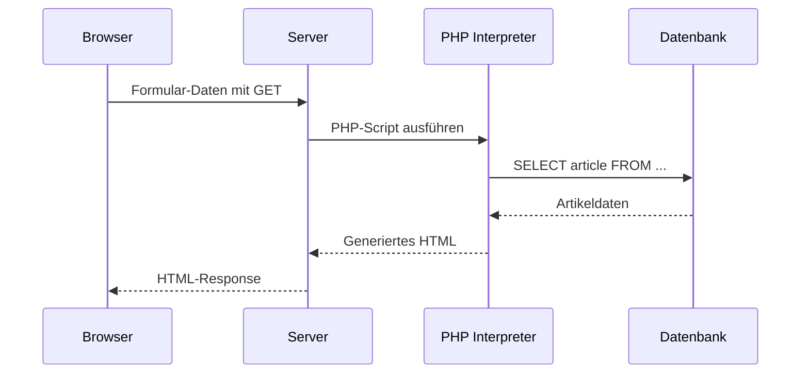

# 06 — PHP Dateizugriff und Dynamische Webseiten

**Folien:** [[web-engineering/resources/06-PHP-File-und-DynHTML.pdf|06-PHP-File-und-DynHTML.pdf]]
**Lernziele:** [[web-engineering/lernziele/webeng-lernziele-03|Lernziele Vorlesung 3]]

---


## Inhaltsverzeichnis

- [[#Dateizugriff in PHP|Dateizugriff in PHP]]
- [[#Dynamische Webseiten|Dynamische Webseiten]]
- [[#Verarbeitung von Formularen|Verarbeitung von Formularen]]
- [[#Validierung der Nutzereingaben|Validierung der Nutzereingaben]]
- [[#Bezug zu Lernzielen|Bezug zu Lernzielen]]

---

## Dateizugriff in PHP

Datenhaltung erfolgt meist über Datenbanken, dennoch ist manchmal direkter Dateizugriff notwendig.

### Grundlegende Datei-Funktionen

| Funktion | Beschreibung |
|---|---|
| `fopen($filename, $mode)` | Öffnet Datei. Modi: `'r'` (lesen), `'w'` (schreiben), `'a'` (anhängen). Gibt `false` bei Fehler zurück |
| `fclose($handle)` | Schließt den Dateizeiger (Resource). Gibt `true` bei Erfolg zurück |
| `fread($handle, $length)` | Liest bis zu `$length` Bytes vom Dateizeiger |
| `fwrite($handle, $string)` | Schreibt `$string` in die Datei. Gibt Anzahl geschriebener Bytes oder `FALSE` zurück |
| `file_exists($filename)` | Gibt `TRUE` zurück wenn Datei/Verzeichnis existiert |
| `filesize($filename)` | Gibt die Dateigröße zurück |

### Vereinfachter Zugriff

| Funktion | Beschreibung |
|---|---|
| `file_get_contents($filename)` | Liest gesamten Dateiinhalt als String |
| `file_put_contents($filename, $data)` | Schreibt `$data` in Datei. Erstellt die Datei wenn nicht vorhanden |

### Beispiel: Datei lesen und ausgeben

```php
<?php
$fileName     = 'title_form.html';
$fileContent = file_get_contents($fileName);

echo $fileContent; // Ausgabe inkl. HTML-Tags

$fileContent = htmlspecialchars($fileContent);
echo $fileContent; // Ausgabe mit "entschärften" HTML-Tags
?>
```

**`htmlspecialchars()`** wandelt Sonderzeichen in HTML-Entities um:

| Zeichen | Entity |
|---|---|
| `&` | `&amp;` |
| `"` | `&quot;` |
| `'` | `&#039;` |
| `<` | `&lt;` |
| `>` | `&gt;` |

---

## Dynamische Webseiten

### Statisch vs. Dynamisch

**Statische Webseiten:**
- HTML/CSS-Dateien liegen auf dem Server
- Stellen immer den gleichen Inhalt dar
- Beispiel: Webvisitenkarte

**Dynamische Webseiten:**
- Seite wird im Moment der Anforderung erzeugt
- Darstellung aktueller Daten möglich
- Inhalt abhängig von Benutzeraktionen
- Beispiel: Suchformular



---

## Verarbeitung von Formularen

### Beispiel: Login-Formular

```html
<form action="do.php?q=login" method="post">
    <input type="text" name="username" />
    <input type="password" name="pw" />
    <input type="submit" value="Login" />
</form>
```

- **action** gibt an, welche Ressource per HTTP aufgerufen wird
- Übermittelt Parameter `username` und `pw` per POST-Request
- GET-Parameter (`q=login`) bringt Variabilität — ein Script kann mehrere Methoden ansprechen

### GET-Request

- Parameter werden **über die Adresszeile** übertragen (nach `?` in der URL)
- Kodierung gemäß Browser-Kodierung für URLs (`%`)
- URL inkl. Parameter kann als Bookmark gespeichert werden
- Zugriff in PHP über globales Array **`$_GET`**
- **Nicht geeignet** für große Datenmengen oder sensible Daten

```php
// URL: index.php?id=5&foo=bar
$_GET['id']   // 5
$_GET['foo']  // bar
```

**URL-Encoding:** Sonderzeichen werden hexadezimal mit `%` dargestellt (z.B. `ß` → `%DF`, `]` → `%5D`). Leerzeichen werden zu `+` oder `%20`.

### POST-Request

- Daten werden im **HTTP-Body** übertragen (nicht in URL sichtbar)
- Content-Type: `application/x-www-form-urlencoded` (Textdaten) oder `multipart/form-data`
- Zugriff in PHP: **`$_POST['text']`**

---

## Validierung der Nutzereingaben

> [!danger] Never trust the user

- Client-seitige Beschränkungen (z.B. `maxlength="5"`) können umgangen werden
- Serverseitige Prüfung ist **zwingend erforderlich**

### Filter-Funktionen

Vereinfachen die Validierung der Eingaben. Liefern `null`, `false` oder den gefilterten Wert zurück.

| Filter-Typ | Beschreibung |
|---|---|
| `FILTER_VALIDATE_*` | Validiert Eingaben (alles oder nichts) |
| `FILTER_SANITIZE_*` | Korrigiert/bereinigt Eingaben |

```php
filter_input($type, $variable_name, $filter [, $options])
```
- `$type`: `INPUT_GET` oder `INPUT_POST`

```php
filter_var($variable, $filter [, $options])
```
- Filtert beliebige Variablen oder Werte

### Beispiele

**E-Mail validieren:**
```php
if (! filter_input(INPUT_POST, 'email', FILTER_VALIDATE_EMAIL)) {
    echo "E-Mail is not valid";
} else {
    echo "E-Mail is valid";
}
```

**Float mit Bereichsprüfung:**
```php
$heightInCm = filter_input(INPUT_GET, 'height', FILTER_VALIDATE_FLOAT);
if ($heightInCm === null) {
    // Parameter 'height' nicht gesetzt
} else if ($heightInCm === false) {
    // Kein gültiger Float-Wert
} else {
    // Gültiger Float-Wert
}
```

**Integer mit Range-Option:**
```php
$range = array('options' => array('min_range' => 1, 'max_range' => 100));
$choice = filter_input(INPUT_POST, 'choice', FILTER_VALIDATE_INT, $range);
```

> [!tip] Merke
> Bei `filter_input` unbedingt typenstarken Vergleich (`===`) nutzen, da `null` (nicht gesetzt) und `false` (ungültig) unterschieden werden müssen.

---

## Bezug zu Lernzielen

**Lernziele:** [[web-engineering/lernziele/webeng-lernziele-03|Lernziele Vorlesung 3]]

1. **Dynamische Webseiten mit $_GET/$_POST:** Formulardaten werden über `action` und `method` an PHP gesendet. GET-Parameter stehen in `$_GET`, POST-Parameter in `$_POST`. Ein Login-Formular nutzt typischerweise POST für sensible Daten, GET für Steuerparameter wie `q=login`.

2. **"Never Trust the User" und Filter-Funktionen:** Client-seitige Validierung kann umgangen werden. PHP bietet `filter_input()` und `filter_var()` mit `FILTER_VALIDATE_*` (strenge Prüfung) und `FILTER_SANITIZE_*` (Bereinigung). Serverseitige Prüfung ist Pflicht.

3. **Typenstarker Vergleich:** Bei `filter_input` ist `===` essenziell: `null` bedeutet "Parameter nicht gesetzt", `false` bedeutet "ungültiger Wert" — mit `==` wären beide falsy und nicht unterscheidbar.
