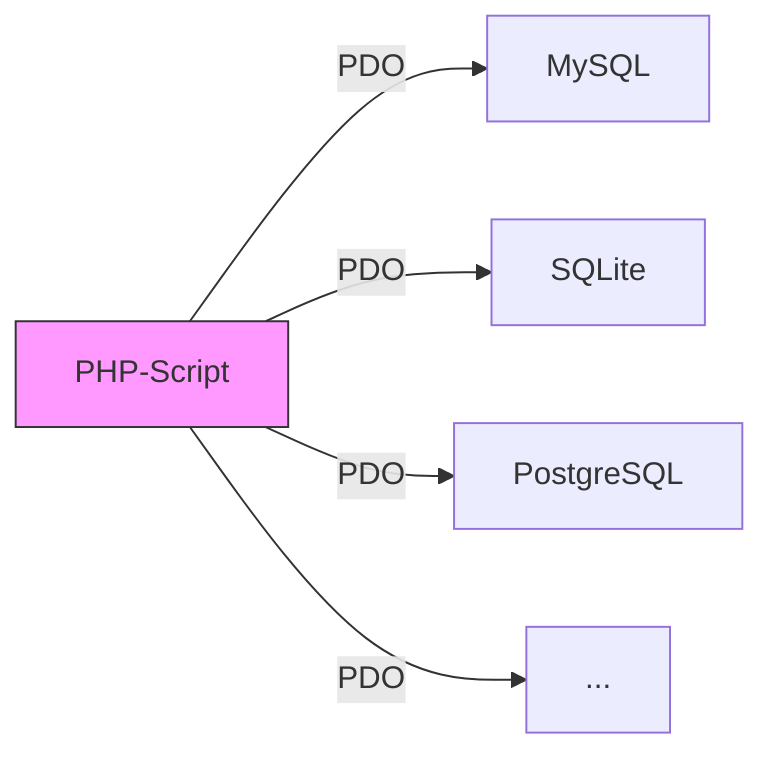
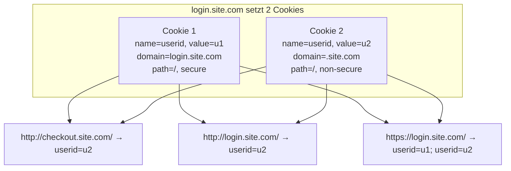

# 07 — PHP Datenbanken, Cookies und Sessions

**Folien:** [[web-engineering/resources/07-PHP-DB-Sessions.pdf|07-PHP-DB-Sessions.pdf]]
**Lernziele:** [[web-engineering/lernziele/webeng-lernziele-03|Lernziele Vorlesung 3]]

---


## Inhaltsverzeichnis

- [[#Datenbankzugriff|Datenbankzugriff]]
- [[#Zustände: Cookies & Sessions|Zustände: Cookies & Sessions]]
- [[#PHP Output Buffering|PHP Output Buffering]]
- [[#PHP-Frameworks|PHP-Frameworks]]
- [[#Bezug zu Lernzielen|Bezug zu Lernzielen]]

---

## Datenbankzugriff

Datenhaltung mittels Dateien ist nicht empfehlenswert — stattdessen Datenbanken verwenden.

Unterstützte Datenbanken in PHP: MySQL, MariaDB, Oracle, SQLite, MS SQL, PostgreSQL, IBM Informix, MongoDB (NoSQL).

### MySQL-Zugriffsbibliotheken

| Bibliothek | Eigenschaften |
|---|---|
| ~~`mysql_*`~~ | Veraltet, keine OOP, keine Prepared Statements — **nicht verwenden** |
| `mysqli_*` | OOP, Prepared Statements, Cutting-Edge MySQL-Support — aber nur MySQL |
| **PDO** | Generisch, OOP, Prepared Statements, **viele Datenbanktypen** — empfohlen |

### PDO (PHP Data Objects)

- Generische objektorientierte Datenbankschnittstelle
- Unterstützung von Prepared Statements
- Unterstützung vieler Datenbanktypen → einfache Migration

**Verbindung aufbauen:**
```php
$dsn = 'mysql:dbname=testdb;host=127.0.0.1';
$user = 'dbuser';
$password = 'dbpass';

try {
    $dbh = new PDO($dsn, $user, $password);
} catch (PDOException $e) {
    echo 'Connection failed: ' . $e->getMessage();
}
```



### SQL-Abfragen: query() vs. Prepared Statements

**`PDO::query()` — unsicher (SQL-Injection-anfällig):**
```php
// NICHT SO MACHEN:
$sth = $dbh->query("SELECT * FROM `user` WHERE id = '" . $_GET['id'] . "'");
$row = $sth->fetch();
echo $row['name'];
```

**Prepared Statements — sicher:**
- Vorbereitete Anweisung mit Platzhaltern wird an die Datenbank gesendet
- Variablen werden separat eingesetzt → Datenbanksystem kümmert sich ums Escaping
- Verhindert SQL-Injections und prüft Parametervalidität
- Geschwindigkeitsvorteil bei mehrfachem Ausführen (Statement liegt bereits vor)

---

## Zustände: Cookies & Sessions

### Problem: HTTP ist zustandslos

- Variablen in PHP sind nur für einen Aufruf gültig
- Für mehrstufige Operationen/Transaktionen muss der Server erkennen, dass Aufrufe zusammengehören
- ISO/OSI Schicht 5 (Session)? Nein — im HTTP-Protokoll ist Zustandsverwaltung Aufgabe der Applikation

### Cookies

Cookies speichern **clientseitig** Daten, die bei jedem Request an den Server mitgesendet werden.

- Cookies werden im **HTTP-Header** (`Set-Cookie`) zurückgeliefert
- Müssen **vor** der ersten HTML-Ausgabe gesetzt werden
- Speicherung auf dem Client (meist via In-Browser-Datenbanken)
- Ein Cookie wird für eine **Domäne** gesetzt (typischerweise der sendende Server)
- Nur die setzende Website kann das Cookie lesen

**HTTP-Beispiel (Server → Client):**
```
HTTP/1.1 200 OK
Content-type: text/html
Set-Cookie: name=value
Set-Cookie: foo=bar; Expires=Wed, 09 Jun 2021 10:18:14 GMT
```

**HTTP-Beispiel (Client → Server):**
```
GET / HTTP/1.1
Host: www.example.org
Cookie: name=value; foo=bar
```

**Setzen in PHP:**
```php
bool setcookie($name, $value [, $expire [, $path]])
```
- `$expire`: Unix-Timestamp, wann der Cookie verfällt
- `$path`: URL-Pfade, für die der Cookie übertragen wird

```php
setcookie('fontSize', '+1', time()+60*60*24*30, '/');
// Cookie "fontSize" mit Wert "+1", läuft in 30 Tagen ab, gilt für alle Pfade
```

**Auslesen in PHP:**
```php
$_COOKIE['fontSize']  // liefert '+1'
```

> [!tip] Merke
> Ein Cookie kann **nicht im selben Skriptdurchlauf** gespeichert und gelesen werden. Das Cookie wird erst beim nächsten Client-Request im `$_COOKIE`-Array verfügbar.

### Cookies — Same Origin Policy

Die klassische Same Origin Policy prüft das Triple **(Schema, Domain, Port)**.

Die **Same Origin Policy für Cookies ist generöser** und nutzt **(Schema\*, Domain, Path)**:
- Schema wird nur geprüft wenn `Secure`-Option gesetzt ist
- Jedes (Domain, Path)-Tupel ist ein eigenes Cookie

| URL | Ergebnis | Grund |
|---|---|---|
| `http://store.company.com/dir2/other.html` | Same origin | Nur Pfad unterschiedlich |
| `https://store.company.com/page.html` | Failure | Anderes Protokoll |
| `http://store.company.com:81/dir/page.html` | Failure | Anderer Port |
| `http://news.company.com/dir/page.html` | Failure | Anderer Host |

**Weitere Cookie-Parameter:**
- **Domain:** Cookie gilt für eigene und untergeordnete Subdomains (nie für übergeordnete Public Domains)
- **Path:** Cookie an Pfad inkl. Unterpfade gebunden
- **Secure:** Erzwingt HTTPS
- **httponly:** Cookie nicht per JavaScript zugänglich (Schutz vor XSS)



### Sessions

Sessions speichern Daten **serverseitig** — der Client erhält nur eine Session-ID (als Cookie).

| Eigenschaft | Cookies | Sessions |
|---|---|---|
| Speicherort | Client | Server |
| Datenmanipulation | Möglich durch User | Nicht möglich |
| Datentypen | Nur Strings | Komplexe Variablen (Arrays, Objekte) |
| Zeitpunkt des Setzens | Vor HTML-Ausgabe | Jederzeit |

**Benutzung in PHP:**
```php
session_start();    // Session erzeugen oder wiederherstellen
                    // MUSS vor jeder Ausgabe aufgerufen werden

session_destroy();  // Session beenden und Variablen löschen
```

**Session-Werte setzen und lesen:**
```php
$_SESSION['logged_in'] = true;
$_SESSION['zaehler'] = 1;
```

**Beispiel: Seitenaufruf-Zähler:**
```php
<?php
session_start();

if (!isset($_SESSION['zaehler'])) {
    $_SESSION['zaehler'] = 1;
} else {
    $_SESSION['zaehler']++;
}

echo 'Sie haben diese Seite ' . $_SESSION['zaehler'] . ' mal aufgerufen';
?>
```

---

## PHP Output Buffering

PHP-Ausgaben werden nicht direkt zum Browser geschickt, sondern in **Chunks** (standardmäßig 4KB) gepuffert.

**Konsequenz:** Sobald der erste Chunk (4KB) übertragen wurde, können **keine HTTP-Header mehr gesetzt** werden. Daher müssen `header()`, `session_start()`, `setcookie()` immer **vor** den ersten Daten im HTTP-Body aufgerufen werden.

**Beispiel:** `echo 'Hello '; sleep(5); echo 'World!';` — Ausgabe erscheint erst nach 5 Sekunden komplett, weil der Buffer noch nicht voll ist. Füllt man den Buffer vorher (z.B. 8KB an Punkten), wird die Ausgabe vor dem `sleep` bereits gesendet.

---

## PHP-Frameworks

**Composer** ermöglicht das Wiederverwenden und Teilen einzelner Komponenten. Frameworks bieten ein "Gesamtpaket" mit Best Practices.

Typische Framework-Komponenten:
- Benutzerverwaltung
- Datenbankzugriff (Object Relational Mapping)
- MVC-Unterstützung
- Caching-Systeme
- Vereinfachung des Zusammenspiels von JavaScript und PHP

---

## Bezug zu Lernzielen

**Lernziele:** [[web-engineering/lernziele/webeng-lernziele-03|Lernziele Vorlesung 3]]

4. **Cookies vs. Sessions:** Cookies speichern Daten clientseitig (nur Strings, manipulierbar, müssen vor HTML-Ausgabe gesetzt werden). Sessions speichern serverseitig (komplexe Datentypen, nicht manipulierbar, jederzeit setzbar). Der Client erhält bei Sessions nur eine Session-ID als Cookie. Sessions sind die sicherere Lösung für sensible Daten.

5. **Lambdas/Closures:** (wird in einem separaten Modul behandelt)

6. **Datenbankanbindung und PDO:** Es gibt `mysql_*` (veraltet), `mysqli_*` (nur MySQL) und **PDO** (generisch, OOP, viele DB-Typen). PDO-Handle: `$dbh = new PDO($dsn, $user, $password)` im try/catch. Immer Prepared Statements verwenden, um SQL-Injections zu verhindern.

7. **PHP-Output-Buffering:** Ausgaben werden in 4KB-Chunks gepuffert. Nach dem ersten gesendeten Chunk können keine HTTP-Header mehr gesetzt werden. Deshalb `session_start()`, `setcookie()`, `header()` immer vor jeder Ausgabe aufrufen.

8. **Template-Engine:** Frameworks bieten komponentenbasierte Architekturen mit Template-Engines, die die Trennung von Logik und Darstellung ermöglichen (Composer als Paketmanager).
