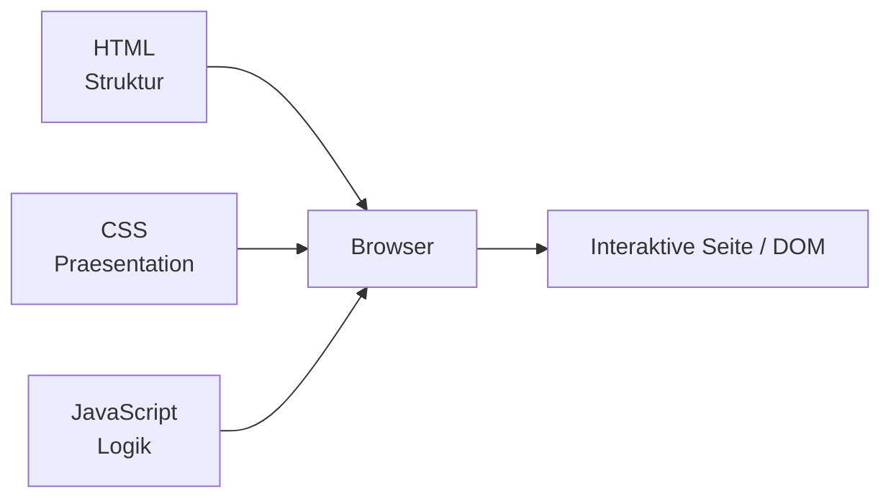
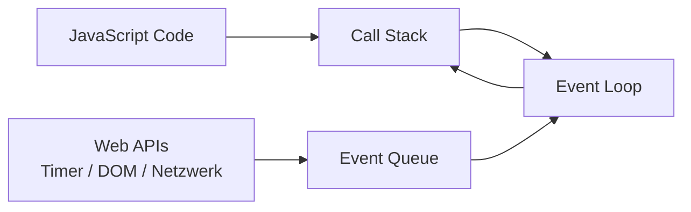

# 08 — JavaScript Basics

**Folien:** [[web-engineering/resources/08-JS-Basic.pdf|08-JS-Basic.pdf]]
**Lernziele:** [[web-engineering/lernziele/webeng-lernziele-04|Lernziele Vorlesung 4]]

## Inhaltsverzeichnis

- [[#JavaScript im Browser|JavaScript im Browser]]
- [[#Einbindung in HTML und Startzeitpunkt|Einbindung in HTML und Startzeitpunkt]]
- [[#Variablen, Scope und Typumwandlung|Variablen, Scope und Typumwandlung]]
- [[#Strings, Template Literals und Arrays|Strings, Template Literals und Arrays]]
- [[#Funktionen, Closures und Arrow Functions|Funktionen, Closures und Arrow Functions]]
- [[#JSON und Objekte|JSON und Objekte]]
- [[#this, call, apply und bind|this, call, apply und bind]]
- [[#Klassen, Prototyping und Vererbung|Klassen, Prototyping und Vererbung]]
- [[#Event Loop und asynchrones Verhalten|Event Loop und asynchrones Verhalten]]
- [[#Bezug zu Lernzielen|Bezug zu Lernzielen]]

---

## JavaScript im Browser

- JavaScript liefert in der klassischen Web-Trennung die **Logik** zu HTML und CSS.
- Der Code wird zunaechst im **Browser** ausgefuehrt und kann dort auf DOM, Events und Browser-APIs zugreifen.
- Dynamische Aenderungen am DOM ermoeglichen interaktive Seiten, ohne das komplette HTML neu zu laden.
- Die Vorlesung betont die Grundlagen unterhalb von Frameworks: DOM, Events, Scope, `this`, Module und asynchrones Verhalten.

> [!info] Hinweis
> Frameworks wie React oder Angular bauen auf genau diesen JavaScript- und Browser-Grundlagen auf. Wer das Laufzeitverhalten versteht, debuggt spaeter deutlich sauberer.



---

## Einbindung in HTML und Startzeitpunkt

### Empfohlene Einbindung

```html
<script src="script.js" defer></script>
```

- `defer` laedt das Skript parallel zum HTML.
- Die Ausfuehrung startet erst, wenn der DOM-Baum aufgebaut ist.
- Das vermeidet blockierendes Laden und reduziert Timing-Probleme beim DOM-Zugriff.

### DOMContentLoaded statt `window.onload`

```js
document.addEventListener('DOMContentLoaded', function () {
  console.log('DOM ist bereit');
});
```

- `DOMContentLoaded` feuert frueher als `window.onload`.
- `window.onload` wartet auch auf Bilder und andere abhaengige Ressourcen.
- Die Folien bezeichnen `window.onload` am Programmanfang als **Anti-Pattern**.

### Inline-JavaScript vermeiden

- `onclick="doStuff()"` und eingebettete `<script>`-Bloecke vermischen HTML und Logik.
- Besser ist die Trennung in eigene `.js`-Dateien und Event-Registrierung im Skript.

> [!success] Best Practice
> JavaScript in eigene Dateien auslagern und per `defer` laden. Das haelt Struktur, Darstellung und Logik sauber getrennt.

---

## Variablen, Scope und Typumwandlung

### `var`, `let`, `const`

- `var` ist die alte Schreibweise und nutzt **Function Scope**.
- `let` und `const` wurden mit ES6 eingefuehrt und nutzen **Block Scope**.
- Auesserhalb von Funktionen deklarierte Variablen sind global sichtbar.

```js
function demo() {
  for (var i = 0; i < 3; i++) {}
  console.log(i); // sichtbar
}

function demo2() {
  for (let i = 0; i < 3; i++) {}
  // console.log(i); // ReferenceError
}
```

### `const` ist keine Tiefenkonstante

- Die **Bindung** ist konstant, nicht zwingend der Inhalt.
- Objekte und Arrays koennen trotz `const` weiterhin intern veraendert werden.

```js
const user = { name: 'Max' };
user.name = 'Anna'; // erlaubt
```

### Typumwandlung und Vergleiche

- JavaScript konvertiert Werte oft implizit.
- Typische Stolperfallen:
  - `'3' + 5` ergibt `'35'`
  - `false == ''` ist `true`
  - `0 == ''` ist `true`
  - `NaN == NaN` ist `false`
- Deshalb fuer verlaessliche Vergleiche **`===` statt `==`** verwenden.

### Hoisting und Temporal Dead Zone

- Deklarationen werden intern nach oben gezogen, Initialisierungen aber nicht.
- Funktionsdeklarationen sind deshalb oft schon vor ihrer Definition aufrufbar.
- `let` und `const` liegen vor ihrer Initialisierung in der **Temporal Dead Zone**.

```js
console.log(x); // ReferenceError
let x = 10;
```

> [!warning] Achtung
> `let` und `const` loesen viele Probleme von `var`, aber sie beseitigen Hoisting nicht komplett. Sie machen ungueltige Fruehzugriffe nur frueher sichtbar.

---

## Strings, Template Literals und Arrays

### Strings

- Einfache und doppelte Anfuehrungszeichen verhalten sich in JavaScript weitgehend gleich.
- Verkettung erfolgt mit `+`.
- Escape-Sequenzen wie `\n` bleiben wichtig.

### Template Literals

```js
const name = 'Max';
console.log(`Hallo ${name}`);
```

- Lesbarer als String-Verkettung.
- Eingebettete Ausdruecke werden mit `${...}` notiert.

### Arrays

- Arrays haben keine feste Groesse.
- Sie koennen gemischte Datentypen enthalten.
- Luecken sind moeglich; fehlende Elemente erscheinen dann als `undefined`.
- Assoziative Arrays gibt es in JavaScript **nicht** im eigentlichen Sinn. Dafuer nutzt man Objekte.

```js
const arr = ['one', 2];
arr[4] = 4;
console.log(arr.length); // 5
```

> [!tip] Merke
> Geordnete Indexlisten gehoeren in Arrays. Benannte Schluessel gehoeren in Objekte.

---

## Funktionen, Closures und Arrow Functions

### Funktionen sind First-Class Objects

- Funktionen koennen Variablen zugewiesen, als Parameter uebergeben und aus Funktionen zurueckgegeben werden.
- Methoden sind letztlich Objekt-Eigenschaften mit Funktionswert.

### Scope durch Funktionen

- Funktionen erzeugen einen neuen Gueltigkeitsbereich.
- Vor `let` wurden Funktionen oft genutzt, um Variablen gezielt zu kapseln.

### Closures

Ein Closure verbindet eine Funktion mit ihrem **lexikalischen Umfeld**. Dadurch kann die Funktion spaeter weiter auf Variablen aus dem umgebenden Scope zugreifen.

```js
function idGetter() {
  let counter = 0;
  return function () {
    counter++;
    return counter;
  };
}

const getId = idGetter();
```

- `counter` bleibt ueber mehrere Aufrufe erhalten.
- Direkter Zugriff von aussen ist nicht moeglich.
- Closures wurden in JavaScript auch wichtig, um die Nachteile von `var` und Function Scope praktisch zu umgehen.

### Arrow Functions

```js
const plusOne = (value) => value + 1;
```

- Kurzschreibweise fuer Funktionen.
- Typischer Einsatz bei Callbacks, Events und Transformationen.
- Arrow Functions **binden kein eigenes `this`**, sondern uebernehmen das `this` aus dem aeusseren Scope.

```js
function Person() {
  this.age = 0;
  setTimeout(() => {
    this.age++;
  }, 1000);
}
```

---

## JSON und Objekte

### Objekte

```js
const user = {
  id: 12,
  name: 'Max Mustermann'
};
```

- Zugriff per Punktnotation: `user.name`
- Alternativ per Klammernotation: `user['name']`
- Als Attributwert ist nahezu alles moeglich: Primitive, Arrays, Objekte, Funktionen

### JSON

- JSON steht fuer **JavaScript Object Notation**.
- JSON beschreibt Datenstrukturen mit Objekten, Arrays, Strings, Numbers, Booleans und `null`.
- JSON ist einfach, sprachunabhaengig und deshalb sehr wichtig fuer Datenaustausch und APIs.

```json
{
  "id": 2648,
  "name": "Mustermann",
  "adr": {
    "stadt": "Aachen"
  },
  "tel": ["0241 1234", "0160 123456"]
}
```

### Reflexion ueber Objekte

```js
Object.keys(obj).forEach((key) => {
  console.log(`key=${key} value=${obj[key]}`);
});
```

- `Object.keys()` und `Object.values()` erlauben generische Verarbeitung von Objektinhalten.

---

## this, call, apply und bind

### Grundidee

- `this` wird in JavaScript **nicht** durch den Ort der Definition bestimmt.
- Entscheidend ist, **wie** eine Funktion aufgerufen wird.

```js
const auto = {
  maxSpeed: 140,
  distance: 0,
  go: function (times) {
    this.distance += this.maxSpeed * times;
  }
};
```

### Typisches Problem bei Event-Callbacks

```js
document.getElementById('btn').onclick = auto.go;
```

- Hier wird nur ein Funktionszeiger uebergeben.
- Beim spaeteren Aufruf zeigt `this` dann auf das Button-Objekt statt auf `auto`.

### Loesungswege

1. Anonyme Huelle:

```js
document.getElementById('btn').onclick = function () {
  auto.go();
};
```

2. `bind()`:

```js
document.getElementById('btn').onclick = auto.go.bind(auto);
```

3. `call()` und `apply()` fuer explizites Setzen von `this`:

```js
auto.go.call(auto2, 3);
auto.go.apply(auto2, [3]);
```

- `call()` uebergibt Argumente einzeln.
- `apply()` uebergibt Argumente als Array.
- `bind()` erzeugt eine neue Funktion mit fest gebundenem `this`, fuehrt sie aber noch nicht direkt aus.

---

## Klassen, Prototyping und Vererbung

- JavaScript ist historisch **prototypbasiert**.
- `class` seit ES6 ist vor allem syntaktischer Zucker ueber dem bestehenden Modell.

### Klassen

```js
class Rechteck {
  #hoehe;
  #breite;

  constructor(hoehe, breite) {
    this.#hoehe = hoehe;
    this.#breite = breite;
  }

  get flaeche() {
    return this.#hoehe * this.#breite;
  }
}
```

- Private Felder werden mit `#` notiert.
- Klassen und statische Attribute sind **nicht vor ihrer Deklaration** nutzbar.
- Das unterscheidet sie von klassischen Funktionsdeklarationen.

### Statische Eigenschaften

- `static` eignet sich fuer Funktionalitaet auf Klassenebene.
- In den Folien wird `static` auch als Alternative zu manchen Closure-Mustern eingeordnet.

### Vererbung

```js
class Tier {
  constructor(name) {
    this.name = name;
  }
}

class Hund extends Tier {
  sprich() {
    console.log(`${this.name} wau`);
  }
}
```

- Vererbung existiert in moderner Syntax ueber `extends`.
- Konzeptionell bleibt die Sprache trotzdem prototype-basiert.

---

## Event Loop und asynchrones Verhalten

### Kernaussage

JavaScript ist laut Folien:

> "single-threaded non-blocking asynchronous event-based"

### Bestandteile

- **Ein Thread** fuer die eigentliche JavaScript-Ausfuehrung
- **Call Stack** fuer aktuell laufende Funktionen
- **Web APIs** fuer Timer, DOM-Events und andere Browser-Funktionen
- **Queue(s)** fuer Rueckmeldungen aus asynchronen Aktionen
- **Event Loop** verschiebt wartende Callbacks in den Stack, sobald dieser leer ist



### `setTimeout(..., 0)` ist nicht sofort

```js
console.log('i am first');
setTimeout(function timeout() {
  console.log('i am second');
}, 0);
console.log('i am third');
```

Ausgabe:

```txt
i am first
i am third
i am second
```

- Der Timer-Callback kommt erst in die Queue.
- Ausgefuehrt wird er erst, wenn der Stack leer ist.

### Konsequenzen

- Asynchronitaet funktioniert ohne echte parallele JS-Ausfuehrung im selben Thread.
- Lange blockierende Schleifen verhindern Reaktionen auf Benutzerinteraktionen und Timer.

> [!warning] Achtung
> Never block the Event Loop. Endlosschleifen oder sehr teure Berechnungen machen die Seite unreaktiv.

---

## Bezug zu Lernzielen

**Lernziele:** [[web-engineering/lernziele/webeng-lernziele-04|Lernziele Vorlesung 4]]

1. **Einbindung von JavaScript in eine Web-Umgebung:**
   JavaScript sollte in eigene Dateien ausgelagert und per `<script ... defer>` eingebunden werden. Der Browser laedt das Skript parallel und fuehrt es nach dem DOM-Aufbau aus. Fuer fruehe Initialisierung ist `DOMContentLoaded` meist besser geeignet als `window.onload`.

2. **Gueltigkeitsbereich von Variablen und Konstanten:**
   `var` arbeitet mit Function Scope und fuehrt leicht zu schwer erkennbaren Nebeneffekten. `let` und `const` verwenden Block Scope und sind fuer modernen Code der Standard. `const` fixiert die Bindung, nicht automatisch den verknuepften Objektinhalt.

3. **Arrays, Strings und Template Literals:**
   Strings koennen klassisch verkettet oder ueber Template Literals lesbar zusammengesetzt werden. Arrays sind dynamisch und koennen gemischte Inhalte tragen, sind aber keine assoziativen Arrays. Fuer benannte Schluessel sollten Objekte verwendet werden.

4. **Closures und Arrow-Notation:**
   Closures erlauben den Zugriff auf Variablen aus dem lexikalischen Umfeld auch nach Rueckkehr der aeusseren Funktion. Arrow Functions sind kompakt und besonders nuetzlich fuer Callbacks; zusaetzlich uebernehmen sie das `this` aus dem umgebenden Scope.

5. **JSON und Objekte:**
   Objekte werden in JavaScript ueber Literale, Punktnotation oder Klammernotation verarbeitet. JSON ist das standardisierte Datenaustauschformat fuer Objektstrukturen mit einfachen Datentypen, Arrays, Objekten und `null`.

6. **`this`-Problematik und Umgehungsstrategien:**
   `this` richtet sich nach der Aufrufart und nicht nach dem Definitionsort. Bei Event-Callbacks zeigt `this` oft auf das Event-Ziel statt auf das fachliche Objekt. Typische Loesungen sind Wrapper-Funktionen, `bind()`, `call()`, `apply()` oder Arrow Functions in geeigneten Situationen.

7. **Hoisting:**
   Deklarationen werden intern vorgezogen, Initialisierungen jedoch nicht. Funktionsdeklarationen sind deshalb frueh nutzbar, `let` und `const` dagegen vor ihrer Initialisierung nicht, weil dort die Temporal Dead Zone gilt.

8. **Klassen und Vererbung in JavaScript:**
   JavaScript bleibt prototype-basiert, auch wenn ES6 mit `class` eine vertrautere Schreibweise einfuehrt. Methoden, private Felder, statische Member und `extends` unterstuetzen strukturierteren OOP-Stil, ohne das Sprachmodell grundsaetzlich zu aendern.

9. **Event Loop:**
   JavaScript arbeitet mit einem Call Stack und einer Event Loop, die wartende Callbacks erst dann ausfuehrt, wenn der Stack frei ist. Das erklaert, warum `setTimeout(..., 0)` nicht sofort laeuft und warum blockierender Code die gesamte Interaktion ausbremst.
