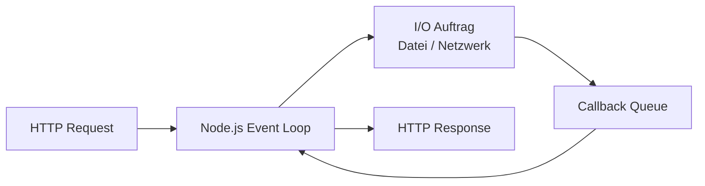
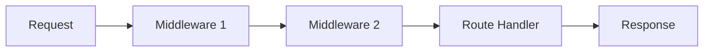

# 09 — Node.js Teil 1

**Folien:** [[web-engineering/resources/09-nodejs-Teil1.pdf|09-nodejs-Teil1.pdf]]
**Lernziele:** [[web-engineering/lernziele/webeng-lernziele-05|Lernziele Vorlesung 5]]

## Inhaltsverzeichnis

- [[#Node.js Grundidee|Node.js Grundidee]]
- [[#Eventbasiertes Servermodell|Eventbasiertes Servermodell]]
- [[#npm, Packages und package.json|npm, Packages und package.json]]
- [[#Module in Node.js|Module in Node.js]]
- [[#Nativer HTTP-Server|Nativer HTTP-Server]]
- [[#Express.js|Express.js]]
- [[#Routen und Router|Routen und Router]]
- [[#Middleware-Konzept|Middleware-Konzept]]
- [[#Response-Objekt und Template-Engines|Response-Objekt und Template-Engines]]
- [[#Bezug zu Lernzielen|Bezug zu Lernzielen]]

---

## Node.js Grundidee

- Node.js fuehrt JavaScript **serverseitig** aus.
- Dadurch kann dieselbe Sprache fuer Browser- und Serverlogik genutzt werden.
- Typische Einsatzfelder laut Folien:
  - Streaming
  - JSON-basierte REST-Dienste
  - Single-Page-Anwendungen
- Node.js basiert auf Googles **V8**-Engine.

### Historischer Rahmen

- 2009: erste Veroeffentlichung von Node.js
- 2010: Express erscheint
- 2011: npm wird eingefuehrt

> [!tip] Merke
> Node.js ist nicht einfach nur "JavaScript ausserhalb des Browsers", sondern eine Laufzeitumgebung mit I/O-Modulen, Event Loop und Server-APIs.

---

## Eventbasiertes Servermodell

- Klassische Webserver arbeiten oft thread- oder prozessbasiert: eine Verbindung pro Thread/Prozess.
- Node.js verfolgt stattdessen einen **eventbasierten, nicht blockierenden** Ansatz.
- I/O-Aufgaben werden delegiert und melden ihre Fertigstellung spaeter ueber Events bzw. Callbacks zurueck.



### Konsequenz

- Der JavaScript-Code bleibt im Kern single-threaded.
- Blockierende I/O-Aufrufe sind moeglich, aber fuer skalierbare Server unguenstig.
- CPU-intensive Arbeiten sollten die Event Loop nicht blockieren.

---

## npm, Packages und package.json

### npm

- npm ist Paketmanager und Projektwerkzeug fuer Node.js.
- Aufgaben laut Folien:
  - Projektkonfiguration
  - Metadatenverwaltung
  - Abhaengigkeiten installieren und aktualisieren
  - Projektstart, Test und Build-Schritte organisieren

### Wichtige Befehle

```bash
npm init
npm install <paket>
npm install
```

- `npm init` erzeugt interaktiv eine `package.json`.
- `npm install <paket>` installiert ein Paket und traegt es als Abhaengigkeit ein.
- `npm install` installiert alle Abhaengigkeiten aus `package.json`.

### Rolle von `package.json`

Die Datei enthaelt z. B.:

- Projektname und Version
- Beschreibung und Lizenz
- Einstiegspunkt
- Repository-Angaben
- Abhaengigkeiten und deren Versionen

```json
{
  "name": "demo_server",
  "version": "1.0.0",
  "private": true,
  "dependencies": {
    "express": "^4.16.4"
  }
}
```

> [!success] Best Practice
> `package.json` beschreibt nicht nur Pakete, sondern das gesamte Projektgeruest: Einstiegspunkt, Skripte, Metadaten und Abhaengigkeiten.

---

## Module in Node.js

### Modularten

1. Kernmodule
2. Lokale Module
3. Third-Party-Module

Beispiele fuer Kernmodule:

- `fs`
- `http`
- `path`
- `url`
- `os`

### Altes CommonJS-Muster mit `require`

```js
const path = require('path');
const express = require('express');
```

- Kernmodule muessen nicht installiert werden.
- Third-Party-Module wie `express` muessen vorher ueber npm installiert sein.

### Exportieren eigener Funktionalitaet

```js
module.exports = function () {
  console.log('bar!');
};
```

oder:

```js
exports.hello = function () {
  console.log('bar!');
};
```

- `exports` ist ein Alias von `module.exports`.
- Bei `exports` muss ein Property beschrieben werden.
- Fuer Klassen oder einzelne Hauptobjekte ist `module.exports` oft klarer.

### ES-Module mit `import` und `export`

```js
export const SimpleMessage = 'Hello World!';
export function sayHello(name) {
  console.log(`Hello, ${name}!`);
}
```

```js
import { SimpleMessage, sayHello } from './Message.js';
```

- Named Import importiert gezielt benannte Exporte.
- Default Export erlaubt ein einzelnes Hauptelement ohne geschweifte Klammern.
- Laut Folien passt `import` besser zum modernen kapselnden Modulstil.

---

## Nativer HTTP-Server

Node.js bringt ueber das Modul `http` bereits einen einfachen Webserver mit.

```js
import http from 'http';

const port = 3001;

function handleRequest(request, response) {
  response.end('request URL: http://localhost:' + port + request.url);
}

const server = http.createServer(handleRequest);
server.listen(port, function () {
  console.log('Server listening on: http://localhost:' + port);
});
```

- Jede HTTP-Anfrage loest ein Ereignis aus.
- Die Callback-Funktion verarbeitet `request` und `response`.
- Dieses Modell ist minimal, aber fuer groessere Anwendungen schnell unhandlich.

---

## Express.js

- Express ist das am haeufigsten genutzte Web-Framework fuer Node.js in den Folien.
- Es sitzt logisch "hinter" dem nativen HTTP-Server und vereinfacht typische Serveraufgaben.

### Wichtige Funktionen

- Routing
- Middleware
- Ausliefern statischer Dateien
- Unterstuetzung fuer Cookies und Sessions
- Zusammenarbeit mit Template-Engines

### Minimalbeispiel

```js
import express from 'express';

const app = express();

app.get('/', function (req, res) {
  res.send('Hello World');
});

app.listen(3000);
```

- `app.get('/', ...)` steht fuer eine Reaktion auf `GET /`.
- Gegenueber dem nativen `http`-Modul spart Express Boilerplate und strukturiert den Code klarer.

---

## Routen und Router

### Was ist eine Route?

- Kombination aus **HTTP-Methode** und **Pfad**
- Beispiel:
  - URL: `http://localhost/myModule/subRoutine`
  - Route: `GET /myModule/subRoutine`

```js
app.get('/myModule/subRoutine', function (req, res) {
  // ...
});
```

### Wichtige Eigenschaften

- Routen werden **First-Come-First-Serve** ausgewertet.
- Die Reihenfolge im Quelltext ist relevant.

### Router

Router trennen Subpfade von der eigentlichen Implementierung und machen Module wiederverwendbarer.

```js
import express from 'express';

const router = express.Router();

router.get('/first', function (req, res) {
  res.send('First');
});

export { router };
```

```js
import { router } from './routes.js';
app.use('/wichtigeURL', router);
```

- Die Route `/first` wird so effektiv unter `/wichtigeURL/first` eingehangen.
- Router helfen, `app.js` als schmalen Einstiegspunkt zu behalten.

---

## Middleware-Konzept

### Grundidee

- Middleware ist ein Stapel von Funktionen zwischen Request-Eingang und finalem Handler.
- Jede Middleware kann:
  - `req` lesen oder erweitern
  - `res` veraendern
  - mit `next()` an die naechste Middleware weitergeben
  - oder die Kette durch eigene Antwort beenden



### Beispiel

```js
function middleHandler(req, res, next) {
  console.log(req.originalUrl);
  next();
}

app.use('/', function (req, res, next) {
  if (req.query.user === user && req.query.pw === password) {
    next();
  } else {
    res.send('Zugriff verweigert');
  }
});

app.get('/', middleHandler, function (req, res) {
  res.send('Zugriff gestattet');
});
```

### `app.use()` vs. `app.METHOD()`

- `app.use(path, middleware)` mountet Middleware fuer einen Pfad und dessen Subpfade.
- `app.get`, `app.post`, `app.put` usw. binden Handler fuer eine konkrete HTTP-Methode.
- Ohne `next()` endet die Verarbeitungskette an dieser Stelle.

> [!warning] Achtung
> `res.send()` und `res.json()` beenden die Antwort. Danach folgen keine weiteren Ausgaben im Response-Stream.

---

## Response-Objekt und Template-Engines

### Response-Methoden

- `res.send()` sendet eine Antwort und schliesst sie.
- `res.json()` sendet JSON und schliesst die Antwort.
- `res.write()` schreibt in den Stream, beendet ihn aber noch nicht.
- `res.end()` beendet den Stream explizit.
- `res.redirect([status,] path)` leitet weiter.

```js
res.status(404).end();
res.redirect('/');
res.redirect(301, 'https://domain.com/new-url');
```

### Template-Engines

- Express kann HTML nicht nur manuell zusammenbauen, sondern ueber Template-Engines rendern.
- Beispiel aus den Folien mit Mustache:

```js
import express from 'express';
import mustacheExpress from 'mustache-express';

app.engine('html', mustacheExpress());
app.set('view engine', 'mustache');
app.set('views', 'templates');
```

- `res.render(...)` nutzt dann die konfigurierte Engine, um aus Vorlagen HTML zu erzeugen.

---

## Bezug zu Lernzielen

**Lernziele:** [[web-engineering/lernziele/webeng-lernziele-05|Lernziele Vorlesung 5]]

1. **Node.js, Packages und `package.json`:**
   Node.js ist eine serverseitige JavaScript-Laufzeit auf Basis von V8. Externe Funktionalitaet wird ueber Packages eingebunden, die mit npm verwaltet werden. `package.json` beschreibt Projektmetadaten, Einstiegspunkt und Abhaengigkeiten.

2. **Module in Node.js:**
   Node.js kennt Kernmodule, lokale Module und Third-Party-Module. Im aelteren Stil werden Module mit `require` geladen und ueber `exports` oder `module.exports` bereitgestellt. Moderne ES-Module nutzen `import` und `export` fuer klarere Kapselung.

3. **Express und nativer HTTP-Server:**
   Mit dem nativen `http`-Modul kann Node.js bereits selbst HTTP-Anfragen verarbeiten. Express baut darauf auf und reduziert Boilerplate durch komfortables Routing, Middleware-Unterstuetzung und eine sauberere Struktur fuer Webanwendungen.

4. **Middleware-Konzept:**
   Middleware bildet eine Verarbeitungskette zwischen Request und finaler Antwort. Jede Stufe kann Daten pruefen, loggen, transformieren oder den Request stoppen. `next()` reicht weiter, waehrend `res.send()` oder `res.json()` die Kette in der Praxis beenden.

5. **Definition von Routen:**
   Routen kombinieren HTTP-Methode und Pfad, etwa `GET /products/42`. Die Reihenfolge der Definition ist relevant. Router helfen, Routen modular zu organisieren und ueber `app.use('/prefix', router)` unter gemeinsame Subpfade zu haengen.
