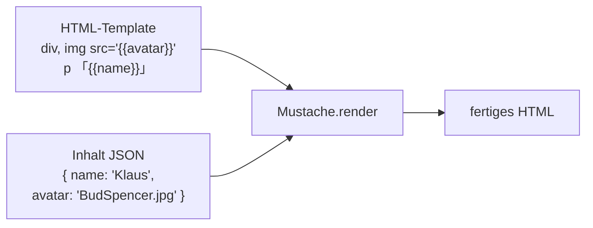
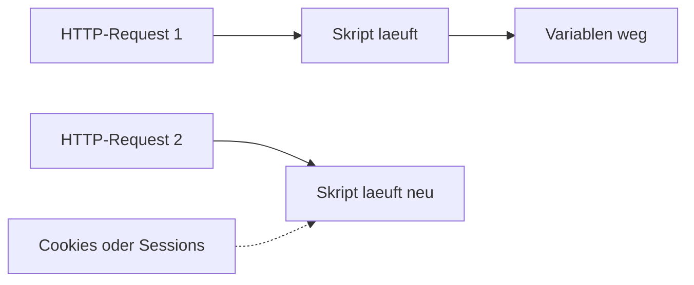
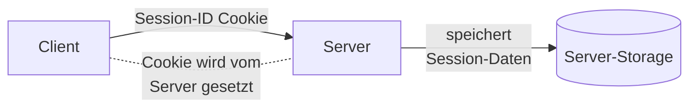
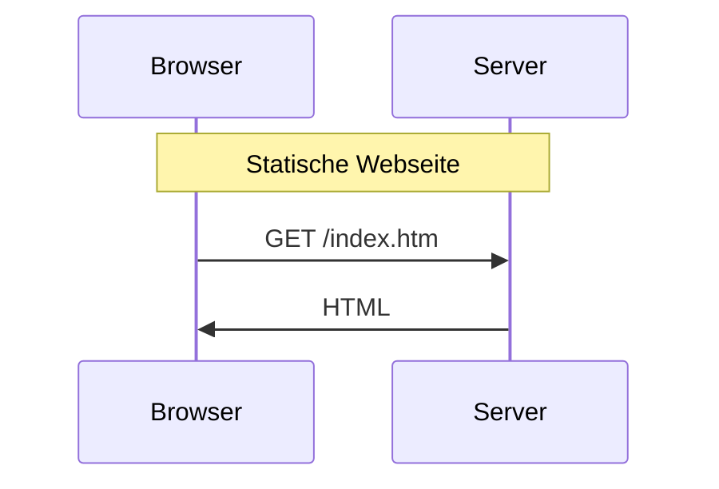
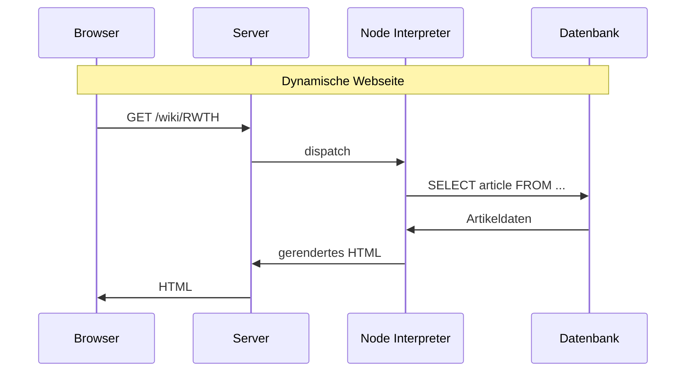
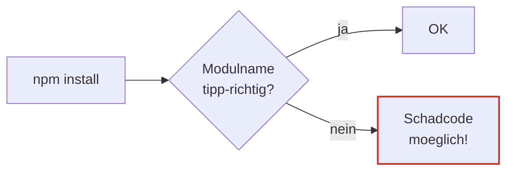
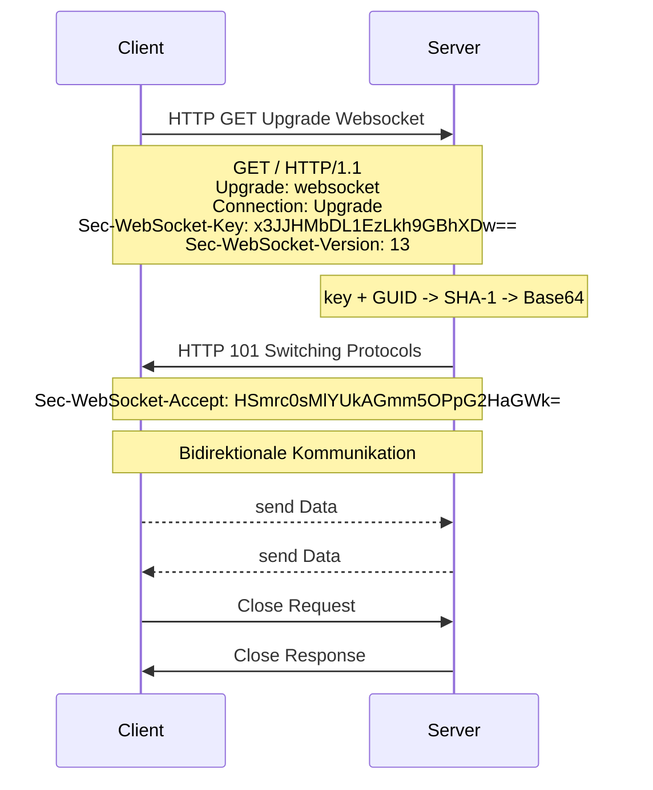
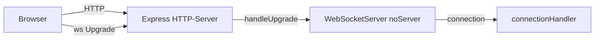

# 10 — Node.js Teil 2

**Folien:** [[web-engineering/resources/10-nodejs-Teil2.pdf|10-nodejs-Teil2.pdf]]
**Lernziele:** [[web-engineering/lernziele/webeng-lernziele-10|Lernziele Vorlesung 10]]

## Inhaltsverzeichnis

- [[#Template Engine mit Node.js|Template Engine mit Node.js]]
- [[#Zustaende: Cookies und Sessions|Zustaende: Cookies und Sessions]]
- [[#Dynamische Webseiten und Formulare|Dynamische Webseiten und Formulare]]
- [[#Validierung und Bereinigung von Eingaben|Validierung und Bereinigung von Eingaben]]
- [[#Sichere Passwortspeicherung mit argon2|Sichere Passwortspeicherung mit argon2]]
- [[#Schaedliche Module|Schaedliche Module]]
- [[#Websockets|Websockets]]
- [[#Bezug zu Lernzielen|Bezug zu Lernzielen]]

---

## Template Engine mit Node.js

### Motivation

> [!tip] Merke
> **Ziel**: Saubere **Trennung von Darstellung und Inhalt** → HTML getrennt von Node-Code.
> Eine Template-Engine liest eine HTML-Vorlage (**Template**) mit Platzhaltern ein und ersetzt diese durch Attributwerte eines Datenobjekts.
> Selbst implementieren? **Nein!**

### Mustache.js

Mustache verwendet **doppelte geschweifte Klammern** `{{platzhalter}}` und **escaped HTML automatisch**.

```js
const person = {
  firstName: 'Volker',
  lastName: 'Sander',
  blogURL: 'http://sandersblog.org'
};
let template = "<h1>{{firstName}} {{lastName}}</h1>Blog:{{blogURL}}";
let html = Mustache.to_html(template, person);
```

### Darstellung und Inhalt strikt trennen



### Integration mit Express

```js
import express from 'express';
import { fileURLToPath } from 'url';
import path from 'path';
import mustacheExpress from 'mustache-express';

const app = express();
const __filename = fileURLToPath(import.meta.url);
const __dirname = path.dirname(__filename);

app.set('view engine', 'mustache');
app.engine('html', mustacheExpress());
app.set('views', path.join(__dirname, 'views'));

router.get('/', (req, res) => {
  const inhalt = { name: 'Klaus', avatar: 'BudSpencer.jpg' };
  res.render('tpl_datei_views.html', inhalt); // gibt das generierte HTML direkt zurueck
});
```

> [!warning] Achtung
> Bei Node.js mit **ESModulen** (import) sind `__dirname` und `__filename` **nicht mehr gesetzt** — wir muessen sie programmatisch erzeugen.

### Consolidate — Adapter fuer viele Template-Engines

> [!info] Hinweis
> Nicht alle Template-Engines implementieren die fuer Express noetige Funktion `__express(filePath, options, callback)`. Das Package **consolidate** bietet eine Zwischenschicht.

```js
import consolidate from 'consolidate';
import express from 'express';

const app = express();
app.engine('html', consolidate.mustache);
app.set('view engine', 'html');
```

---

## Zustaende: Cookies und Sessions

### Problem: Zustandslosigkeit

> [!quote] Definition
> Der **Zustand des Node.js-Skriptes geht nach Ausfuehrung verloren** — Variablen sind nur fuer einen einzigen Aufruf gueltig.

Wie koennen mehrstufige Operationen / Transaktionen vorgenommen werden? Der Server muss erkennen, dass der naechste Aufruf der Seite **im Kontext** geschieht.

> [!warning] Achtung
> Im **HTTP-Protokoll** ist das die Aufgabe der **Applikation**, nicht von OSI-Schicht 5 ("Session").



### Cookies

> [!quote] Definition
> **Cookies** ermoeglichen es, Daten **clientseitig** zu speichern. Benutzer muss sich nicht mehrfach anmelden, aber Tracking ist moeglich.

#### Setzen via HTTP-Header

```http
HTTP/1.1 200 OK
Content-type: text/html
Set-Cookie: name=value
Set-Cookie: foo=bar; Expires=Wed, 09 Jun 2021 10:18:14 GMT

(Inhalt der Seite)
```

> [!tip] Merke
> Cookies werden im **Header** der Seite zurueckgeliefert → das Setzen muss erfolgen, **bevor** Inhalt ausgegeben wird.

#### Senden zurueck zum Server

```http
GET / HTTP/1.1
Host: www.example.org
Cookie: name=value; foo=bar
```

Nur die Webseite, die das Cookie gesetzt hat, kann es lesen.

#### Cookies in Express setzen

```js
res.cookie('rememberme', '1', {
  expires: new Date(Date.now() + 900000),
  path: '/'
});
```

Optionen: `expires`, `path`, `domain`, `httpOnly` (kennzeichnet das Cookie als nur fuer den Webserver zugaenglich).

#### Cookies lesen — cookie-parser Middleware

```js
import express from 'express';
import cookieParser from 'cookie-parser';

const app = express();
app.use(cookieParser());

// In einer Route
const wert = req.cookies.rememberme;
```

> [!warning] Achtung
> Cookies koennen **nicht im selben Skriptdurchlauf** gesetzt und wieder gelesen werden — sie werden erst beim naechsten Request im `req`-Objekt eingetragen.

### Sessions

> [!tip] Merke — Cookies vs. Sessions
> 
> | Cookies | Sessions |
> |---|---|
> | speichern Daten **clientseitig** | speichern Daten **serverseitig** |
> | Daten vom Nutzer **manipulierbar** | keine Manipulation moeglich |
> | nur Strings | komplexe Variablen (Arrays, Objekte) |
> | groessere Mengen problematisch | groessere Mengen unproblematisch |
> 
> Bei Sessions erhaelt der Client nur die **Session-ID** als Cookie — alles andere bleibt auf dem Server.

#### Konfiguration mit express-session

```js
import session from 'express-session';

app.use(session({
  name: '_es_demo',
  secret: '1234',           // langer, zufaelliger String — signiert das Cookie (Schutz vor Manipulation)
  resave: false,            // verhindert unnoetiges Resave, wenn nichts geaendert wurde
  saveUninitialized: false, // verhindert leere Sitzungen (Privacy Compliance)
  cookie: {
    secure: true,           // HTTPS-Pflicht
    domain: 'yourdomain.com' // Cookie fuer alle Subdomains
    // HttpOnly ist Default
  }
}));
```

> [!info] Hinweis
> - `saveUninitialized: true` (Default) wird fuer Privacy Compliance kritisiert — verhindert, dass Cookies gespeichert werden, bevor der Benutzer zugestimmt hat → mittlerweile als deprecated angesehen.
> - `secret` signiert das Cookie. Aenderung des Secrets startet eine neue Session.

#### Session-Daten lesen/schreiben/beenden

```js
app.get('/', (req, res) => {
  if (!req.session.count) req.session.count = 0;
  req.session.count += 1;
  res.json(req.session);
});

// Beenden
req.session.destroy();
```



---

## Dynamische Webseiten und Formulare

### Statisch vs. Dynamisch





### Formularverarbeitung

```html
<form action="do?q=login" method="post">
  <input type="text" name="username" />
  <input type="password" name="pw" />
  <input type="submit" value="Login" />
</form>
```

POST-Daten werden **urlencoded** uebertragen (`%xx`-Notation, z.B. `%20` fuer Leerzeichen).

### GET-Request — Parameter via URL

```js
// URL: /index.html?id=5&foo=bar
req.query.id   // '5'
req.query.foo  // 'bar'
```

> [!warning] Achtung
> Nicht geeignet fuer grosse Datenmengen oder sensible Daten — alles ist in der URL sichtbar.

### POST-Request — Parameter im Body

```js
import express from 'express';
const app = express();
app.use(express.urlencoded({ extended: true }));
// extended:true unterstuetzt komplexere Objekte (Arrays, Nested)

app.post('/form', (req, res) => {
  console.log(`Name: ${req.body.name}, E-Mail: ${req.body.email}`);
  res.json(req.body);
});
```

---

## Validierung und Bereinigung von Eingaben

> [!warning] Achtung — "Never trust the user"
> **Serverseitige** Pruefung von Nutzerdaten ist **zwingend** erforderlich. Clientseitige Validierung ist nur UX-Hilfe.

### express-validator

```js
import { check, validationResult, matchedData } from 'express-validator';

// Middleware zum Auswerten
function validationError(req, res, next) {
  const errors = validationResult(req);
  if (!errors.isEmpty()) {
    return res.status(422).json({ errors: errors.array() }); // 422 Unprocessable Entity
  }
  next();
}

app.post('/form', [
  check('name').notEmpty().withMessage('Name is required').isLength({ max: 50 }),
  check('email').isEmail(),
  check('age').optional().isInt({ min: 0, max: 100 }),
  validationError
], (req, res) => {
  const { name, email, age } = matchedData(req, { includeOptionals: true });
  res.json({ name, email, age });
});
```

> [!info] Hinweis
> `check([field, message])` liefert eine **Validation Chain** als Middleware. Mehrere Checks werden in einem Array zusammengestellt und sequentiell ausgefuehrt.

### Bereinigung (Sanitizing)

`sanitize*(fields).[one ore more sanitizer]` — `*` kann `Body`, `Cookie`, `Param` oder `Query` sein.

```js
app.post('/form', [
  check('name').trim().notEmpty().withMessage('Name is required').isLength({ max: 50 }),
  check('email').isEmail().normalizeEmail(),
  check('age').optional().isNumeric({ min: 0, max: 100 }).toInt(),
  validationError
], (req, res) => res.json(req.body));
```

```js
app.post('/register',
  sanitizeBody('user').escape().trim(),
  (req, res, next) => {
    console.log(req.body.user); // escaped + trimmed
    console.log(req.body.pw);   // not sanitized
  }
);
```

> [!info] Hinweis
> Bei `escape()` handelt es sich um den **Sanitizer**, nicht um das veraltete globale `escape()`.

Liste der Sanitizer: [github.com/validatorjs/validator.js#sanitizers](https://github.com/validatorjs/validator.js#sanitizers).

---

## Sichere Passwortspeicherung mit argon2

> [!warning] Achtung
> **Passwoerter niemals im Klartext speichern**:
> - Datenbank koennte in falsche Haende geraten
> - Nutzer verwenden oft das gleiche Passwort auf mehreren Seiten

Besser: **Hash-Werte** speichern.

### argon2

```bash
npm install argon2
```

```js
const hash = await argon2.hash('superPW123');
// $argon2id$v=19$m=65536,t=3,p=4$<Salt>$<Hash>
```

Felder eines argon2-Hashes:

```text
$argon2id$v=19$m=65536,t=3,p=4$UaZWj+XshKBArAhpVDv28A$eSAXDk8dWRp+Wyqa7VtnqsyF1g1oB8vowmfxN31bJtA
  |       |       |         |                          |
  Algo    Vers.   Mem/Iter/Threads  Salt (Base64)       Hash (Base64)
```

> [!tip] Merke
> Gleicher Funktionsaufruf liefert unterschiedliche Werte, weil **Argon2 automatisch einen zufaelligen Salt** erzeugt.

### Passwort-API

```js
await argon2.hash(data, [, options])
// options: { memoryCost: 4096, parallelism: 3, timeCost: 4 }

await argon2.verify(hash, data) // true / false
```

### Alternative: bcryptjs

> [!warning] Achtung
> `bcrypt.hash` und `bcrypt.compare` sind **asynchron** — mit `await` in einer `async`-Funktion aufrufen, damit die **Event Loop nicht blockiert** wird.
> Synchrone Varianten (`bcrypt.hashSync`, `bcrypt.compareSync`) existieren, sind aber nicht zu bevorzugen.

---

## Schaedliche Module

Jeder kann Module per npm veroeffentlichen — Schadcode moeglich.

> [!warning] Achtung — Typosquatting
> `socketio` statt `socket.io`: `socket.io` ist das verbreitetste Modul fuer Echtzeit-Webanwendungen. Ein aehnlich benanntes `socketio` koennte Schadcode enthalten.

Schutzmassnahmen:
- Auch bekannte Module koennen durch Updates verwundbar sein
- **Versionen** in `package.json` **fixieren**
- **`npm audit`** nutzen — Projekt nach Verwundbarkeiten durchsuchen



---

## Websockets

### Was sind Websockets?

> [!quote] Definition
> **TCP-basiertes Protokoll**, das eine **bidirektionale Verbindung** zwischen Webbrowser und Server ermoeglicht. Nur ein Verbindungsaufbau notwendig (per HTTP-Upgrade) — TCP-Verbindung bleibt offen.

> [!tip] Merke
> Im Gegensatz zu reinem HTTP setzt eine Server-Antwort keine Client-Anfrage voraus (Anfrage-Antwort-Prinzip wird durchbrochen).

Anwendung: Chats, Spiele, Server-Monitoring. Wird von allen gaengigen Browsern unterstuetzt.

### Handshake



### Server-Hash-Berechnung

> [!info] Hinweis
> Der Server haengt eine feste **GUID** `258EAFA5-E914-47DA-95CA-C5AB0DC85B11` an den Client-Key, bildet **SHA-1** + **Base64** und sendet das Ergebnis als `Sec-WebSocket-Accept`. Diese GUID ist immer gleich.

### HTTP/2 vs. Websockets

> [!info] Hinweis
> Das **Upgrade-Konzept** einer HTTP/1.1-Verbindung wurde fuer Websockets entwickelt. Bei HTTP/2 wurde der Mehraufwand der extra Upgrade-Nachricht durch **Application Layer Protocol Negotiation (ALPN)** im **TLS-Handshake** abgeloest. Websockets nutzen weiterhin den klassischen 1.1-Upgrade.

### Client (Browser)

```js
const socket = new WebSocket("ws://localhost:8080/");
// bei https: wss verwenden!

socket.onopen = function () {
  console.log("WebSocket Client Connected");
  socket.send("Hi this is web client.");
};

socket.onmessage = function (e) {
  console.log("Received:," + e.data + "'");
};
```

### Server (Node.js mit `ws`)

```js
import express from 'express';
import { WebSocketServer } from 'ws';
import path from 'path';
import { fileURLToPath } from 'url';
import connectionHandler from './websockets/connection.js';

const __filename = fileURLToPath(import.meta.url);
const __dirname = path.dirname(__filename);

const app = express();
app.use(express.static(path.join(__dirname, 'websockets')));
app.get('/', (req, res) => res.sendFile('index.html', { root: __dirname }));
app.get('/ws.js', (req, res) => res.sendFile('ws.js', { root: __dirname }));

// kein eigener Server fuer Websockets, wir nutzen express
const wsServer = new WebSocketServer({ noServer: true });
wsServer.on('connection', connectionHandler);

const server = app.listen(8080);
server.on('upgrade', (request, socket, head) => {
  wsServer.handleUpgrade(request, socket, head, ws =>
    wsServer.emit('connection', ws, request)
  );
});
```

```js
// websockets/connection.js
export default function connectionHandler(socket, req) {
  console.log("Someone connected");
  socket.on('message', message => {
    console.log("Nachricht:" + message);
    socket.send(message); // Echo
  });
}
```



---

## Bezug zu Lernzielen

Die kompakten Karteikarten finden sich unter [[web-engineering/lernziele/webeng-lernziele-10|Lernziele Vorlesung 10]]. Im Folgenden ausfuehrliche Antworten zur Pruefungsvorbereitung.

**Was leistet eine Template-Engine?**

Saubere Trennung von Darstellung (HTML) und Inhalt (Node-Daten). Sie liest ein Template mit Platzhaltern und ersetzt diese durch Werte aus einem Objekt. **Mustache** verwendet `{{key}}` und escaped HTML automatisch — ein Klassiker. Selbst implementieren ist nicht noetig — fertige Engines existieren.

**Wie werden Cookies und Sessions in Express genutzt?**

- **Cookies** speichern Daten clientseitig. Setzen via `res.cookie(name, value, opts)`, Lesen via Middleware `cookie-parser` und `req.cookies.name`. Manipulierbar durch den Benutzer, daher nicht fuer sensible Daten.
- **Sessions** speichern Daten serverseitig, der Client erhaelt nur eine **Session-ID als Cookie**. Sessions-Middleware ist `express-session`. Wichtige Optionen: `secret` (signiert das Cookie), `cookie.secure: true` (HTTPS), `resave: false`, `saveUninitialized: false` (Privacy Compliance), `cookie.domain` fuer Subdomains. HttpOnly ist Default. Beenden mit `req.session.destroy()`.

**Wie verarbeitet Express GET- und POST-Daten?**

- **GET**: Parameter in `req.query` (nach `?` in der URL). Nicht fuer sensible Daten.
- **POST**: Parameter in `req.body` — Middleware `express.urlencoded({extended: true})` ist noetig, um `%xx`-codierte Body-Daten zu dekodieren. `extended: true` erlaubt verschachtelte Objekte und Arrays.

**Wie werden Eingaben validiert und bereinigt?**

Mit **express-validator**: `check('field').isEmail().isLength({max: 50}).withMessage('…')` als Middleware-Chain. Eine zusaetzliche Middleware ruft `validationResult(req)` auf und liefert bei Fehler HTTP 422. Mit `matchedData(req)` werden die validierten Daten geholt.

**Bereinigung** geschieht ueber Sanitizers wie `.trim()`, `.escape()`, `.normalizeEmail()`, `.toInt()` — entweder direkt in der Chain oder ueber `sanitizeBody('field').escape()`.

**Warum und wie Passwoerter mit argon2 speichern?**

Klartext-Passwoerter sind tabu — bei einer DB-Kompromittierung sind alle Logins (und ggf. Mehrfach-Nutzungen auf anderen Seiten) verloren. Statt dessen Hash-Werte mit Salt:

```js
const hash = await argon2.hash('superPW123');
const ok = await argon2.verify(hash, 'superPW123');
```

argon2 erzeugt **automatisch einen zufaelligen Salt**, so dass gleicher Input verschiedene Hashes liefert. Format: `$argon2id$v=19$m=…,t=…,p=…$<Salt>$<Hash>` (Algorithmus, Version, Memory/Iterations/Threads, Salt, Hash).

**Warum sind schaedliche Module gefaehrlich und wie schuetzt man sich?**

Jeder kann auf npm veroeffentlichen. Gefahren: Typosquatting (`socketio` vs. `socket.io`), kompromittierte Updates etablierter Module. Schutz: Versionen in `package.json` fixieren, regelmaessig `npm audit` ausfuehren.

**Was sind Websockets und wie funktioniert der Handshake?**

Websockets sind ein TCP-basiertes Protokoll fuer **bidirektionale**, **offen gehaltene** Verbindungen zwischen Browser und Server — der Server kann **ohne Client-Request** Daten senden. Anwendung: Chats, Spiele, Echtzeit-Monitoring.

Der Handshake startet als HTTP-GET mit `Upgrade: websocket`, `Sec-WebSocket-Key: <random>`. Der Server bildet `SHA-1(<key> + GUID)` (GUID = `258EAFA5-E914-47DA-95CA-C5AB0DC85B11`), Base64-codiert das Ergebnis und antwortet mit HTTP 101 Switching Protocols + `Sec-WebSocket-Accept: <hash>`. Danach bleibt die TCP-Verbindung offen fuer bidirektionalen Datenaustausch.

Im Browser: `new WebSocket('ws://...')`, Events `onopen`, `onmessage`, Methode `send(...)`. Server in Node.js mit `ws`-Modul und `WebSocketServer({noServer: true})` plus `server.on('upgrade', ...)`.
