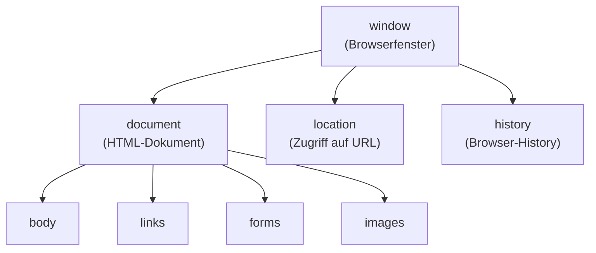
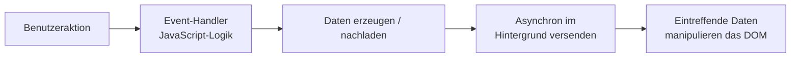
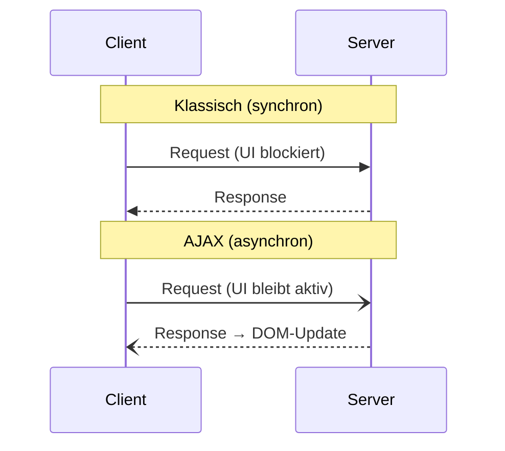

# 12 — JavaScript im Einsatz auf der Client-Seite (AJAX, DOM, Fetch)

**Folien:** [[web-engineering/resources/12-JavaScript-Fetch.pdf|12-JavaScript-Fetch.pdf]]
**Lernziele:** [[web-engineering/lernziele/webeng-lernziele-08|Lernziele Vorlesung 8]]

> [!info] Hinweis
> Woche 8 umfasst zwei Foliensätze: **Fetch (AJAX, DOM, Fetch)** — diese Notiz — und [[web-engineering/lectures/08/webeng-13-restful-services|13 — RESTful Services]]. Die Lernziele 1–5 (DOM, AJAX, Fetch) werden hier behandelt, die Lernziele 6–15 (REST) in der RESTful-Services-Notiz.

## Inhaltsverzeichnis

- [[#Document Object Model (DOM)|Document Object Model (DOM)]]
- [[#Zugriff auf DOM-Knoten|Zugriff auf DOM-Knoten]]
- [[#Klassische DOM-Manipulation|Klassische DOM-Manipulation]]
- [[#AJAX — Asynchronous JavaScript and XML|AJAX — Asynchronous JavaScript and XML]]
- [[#XMLHttpRequest|XMLHttpRequest]]
- [[#Datenformate: XML vs. JSON|Datenformate: XML vs. JSON]]
- [[#Vor- und Nachteile von AJAX|Vor- und Nachteile von AJAX]]
- [[#Die Fetch-API|Die Fetch-API]]
- [[#Das response-Objekt|Das response-Objekt]]
- [[#Fetch mit POST|Fetch mit POST]]
- [[#Fetch mit async / await|Fetch mit async / await]]
- [[#Fetch eines HTML-Dokuments (DOMParser)|Fetch eines HTML-Dokuments (DOMParser)]]
- [[#DOM-Manipulation — Methodenübersicht|DOM-Manipulation — Methodenübersicht]]
- [[#Bezug zu Lernzielen|Bezug zu Lernzielen]]

---

## Document Object Model (DOM)

> [!quote] Definition (DOM)
> Das **Document Object Model** bietet Zugriff auf **alle Tags und Attribute** der Webseite. Es bildet das HTML-Dokument als **Baumstruktur** ab und erlaubt dessen **Manipulation** zur Laufzeit.

> [!info] Hinweis — "Dunkle Vergangenheit"
> JavaScript war zwar früh standardisiert, **nicht aber der Zugriff** auf das HTML-Dokument — jeder Browser regelte den Zugriff anders. Mittlerweile ist das DOM standardisiert.

Das clientseitige Objektmodell hängt am globalen `window`-Objekt:



> [!warning] Achtung — Same Origin Policy
> Es handelt sich um **clientseitigen** Zugriff. Der Server hat **keinen** Zugriff auf z.B. das `history`-Objekt — die **Same Origin Policy** wird hier vom Browser erzwungen.

---

## Zugriff auf DOM-Knoten

Auf Knoten kann man auf drei Arten zugreifen:

- über ihre **id** (einfachste Möglichkeit) oder per **Klasse / Tag / Name**
- über die **numerische Ordnung** in der Hierarchie (Index in `childNodes`)
- über die **Position im Baum** und Navigation: `parentNode`, `previousSibling`, `nextSibling`, `firstChild`, `lastChild`, `childNodes`

```mermaid
flowchart TB
    html --> head
    html --> body
    body -->|firstChild / lastChild| div
    div -->|childNodes[0]| h1
    div -->|childNodes[1]| ul
    h1 <-->|nextSibling / previousSibling| ul
```

> [!example] Beispiel — getElementById & innerHTML
> ```html
> <div id="meindiv">Dies ist ein einfacher Text</div>
> ```
> ```js
> document.getElementById('meindiv');             // erstes Element mit id="meindiv"
> let str = document.getElementById('meindiv').innerHTML;  // "Dies ist ein einfacher Text"
> document.getElementById('meindiv').innerHTML = 'neu';    // Inhalt ändern
> ```
> Der Text ist **nicht** Wert des `div`-Elements selbst, sondern der Wert seines ersten (Text-)Kindknotens — referenzierbar über `childNodes[0]` und ansprechbar über `innerHTML`.

> [!tip] Merke
> `document.getElementById(id)` liefert den **ersten** DOM-Knoten mit der ID zurück (oder `null`). Laut HTML-Standard muss eine ID im **gesamten Dokument eindeutig** sein.

---

## Klassische DOM-Manipulation

Eine **alte native** Form der Manipulation — neue Elemente erzeugen und einhängen:

```js
document.addEventListener('DOMContentLoaded', function () {
  document.getElementById('btn').onclick = function () {
    // Neues h1-Element mit Inhalt "Klick!" erstellen
    var h1 = document.createElement('h1');
    var text = document.createTextNode('Klick!');
    h1.appendChild(text);
    // In den HTML-body im DOM-Baum hinten einfügen
    document.querySelector('body').appendChild(h1);
  };
});
```

> [!info] Hinweis
> `DOMContentLoaded` stellt sicher, dass der DOM-Baum existiert — bei `defer`-geladenen Skripten nicht nötig. `document.querySelector` ist die "perfekte" (leider langsame) Interaktion mit CSS: das Argument ist ein **gültiger CSS-Selektor**, `querySelector` liefert das **erste** zutreffende Element, `querySelectorAll` eine **NodeList** aller zutreffenden Elemente.

---

## AJAX — Asynchronous JavaScript and XML

**Ablauf:**



**Typische Anwendungsgebiete:** Vorschläge für Suchbegriffe, webbasierte Anwendungen, Cloud-Anwendungen (SaaS).

> [!tip] Merke
> Faktisch ist **`XMLHttpRequest`** das ursprüngliche Herzstück von AJAX (kein direkter Zugriff auf klassische Sockets, und nicht nur XML). Es wurde durch die **Fetch-API** ersetzt.

**Klassisches vs. AJAX-Modell:** Im klassischen Modell blockiert jede **synchrone** Datenübertragung die Benutzeraktivität (Request → Warten → Response). Im AJAX-Modell läuft eine **AJAX-Engine** clientseitig dazwischen, sodass Datenübertragungen **asynchron** ablaufen und die Oberfläche nicht blockiert wird.



---

## XMLHttpRequest

Klasse war die interne Basis jeglicher AJAX-Interaktion:

| Methode | Beschreibung |
|---|---|
| `new XMLHttpRequest()` | erzeugt ein neues XMLHttpRequest-Objekt |
| `abort()` | bricht den aktuellen Request ab |
| `getAllResponseHeaders()` | liefert alle Header-Informationen |
| `getResponseHeader()` | liefert eine bestimmte Header-Information |
| `open(method, url, async, user, psw)` | spezifiziert den Request (Methode GET/POST, URL, async true/false, optional user/psw) |
| `send()` | sendet den Request (GET) |
| `send(string)` | sendet den Request mit Body (POST) |
| `setRequestHeader()` | fügt ein Label/Value-Paar zum Header hinzu |

```js
var xhr = new XMLHttpRequest();
xhr.onreadystatechange = function () {
  if (xhr.readyState == XMLHttpRequest.DONE) {
    console.log(xhr.responseText);
  }
};
xhr.open('GET', 'http://google.com', true);
xhr.send(); // alte Browser brauchen null als Argument
```

> [!warning] Achtung — Callback-Hell
> Die Methodik über `XMLHttpRequest` funktioniert zwar bestens, birgt aber das Problem der **Callback-Hell**: Funktionsaufrufe sind aufgrund der Callbacks tief ineinander geschachtelt → unübersichtlicher, fehlerträchtiger Code. Das war einer der Gründe für die Einführung von **Promises** und **async/await** (siehe [[web-engineering/lectures/07/webeng-11-javascript-teil2|11 — JavaScript Teil 2]]).

---

## Datenformate: XML vs. JSON

Der Austausch zwischen Server und Client erfolgt meist über festgelegte Datenformate:

| | **XML** (Extensible Markup Language) | **JSON** (JavaScript Object Notation) |
|---|---|---|
| Typisierung | typisierbar über Schema | feste Auswahl an Datentypen |
| Attribut vs. Tag | teilweise unklar, ob Attribut oder Tag | keine Unterscheidung |
| Lesbarkeit | eher geschwätzig (schließende Tags, Arrays) | einfach zu lesen |
| Overhead | höher | kompakt, wenig Overhead |
| Eignung für AJAX | — | **besser geeignet** |

---

## Vor- und Nachteile von AJAX

> [!success] Vorteile
> - Keine unmittelbare Auswirkung auf die Darstellung der Seite
> - Verringerte Serverlast
> - Erhöhte Benutzerfreundlichkeit (z.B. Ladeindikator möglich)

> [!warning] Nachteile
> - Bruch mit klassischen Technologien
> - Zurück-Button des Browsers funktioniert nicht
> - Komplexität der URL-Ressource hoch, ggf. fehlende Eindeutigkeit → Probleme mit Bookmarks
> - Benutzerempfinden bzgl. Rückmeldungen hängt stark von der Programmierung ab
> - "Suchmaschinenlesbarkeit" bzw. Zugriff ohne JavaScript

---

## Die Fetch-API

> [!quote] Definition (Fetch)
> Die **Fetch-API** ist eine modernere Schnittstelle zur Nutzung von AJAX **auf Basis von Promises**. Faustregel: GET-/POST-Interaktion eher mit Fetch, DOM-Manipulation danach mit `querySelector`.

```js
fetch(url) // optionale Header-Felder { method: 'post', ... }
  .then(function () {   // meistens mit resp-Objekt
    // Hier verarbeitet man die Response
  })
  .catch(function () {
    // Fehlerhandlung
  });
```

**Lange Version** mit Statusprüfung:

```js
fetch('./api/some.json')
  .then(function (response) {
    if (response.status !== 200) {
      console.log('Houston, wir haben ein Problem. Status Code: ' + response.status);
      return;
    }
    // JSON-Objekt im Body → natives JS-Objekt machen
    response.json().then(data => console.log(data));
  })
  .catch(function (err) {
    console.log('Fetch Error :-S', err);
  });
```

**Kurze then-Kaskade** (besser, aber nicht super):

```js
fetch(url) // Lade das Objekt (JSON-Format)
  .then((resp) => resp.json()) // Jetzt haben wir ein Objekt
  .then(function (obj) {
    let returned_object = obj; // Verarbeite das json-Objekt
  })
  .catch(function () { /* Fehlerbehandlung */ });
```

> [!tip] Merke
> `response.json()` und `response.text()` liefern **selbst ein Promise** zurück — daher `then` oder besser `await` darauf anwenden.

---

## Das response-Objekt

Das `response`-Objekt liefert mehrere Body-Reader, die jeweils **über eine resolved-Promise** zurückgeben:

| Methode | Rückgabe (via Promise) |
|---|---|
| `response.json()` | JSON-Objekt |
| `response.text()` | einfacher Text |
| `response.formData()` | FormData (Key-Value-Paare) |
| `response.blob()` | BLOB (nicht änderbarer, file-ähnlicher Stream) |
| `response.arrayBuffer()` | Array Buffer (binäre Daten fester Länge) |

---

## Fetch mit POST

Bei POST werden `method`, `body` (serialisiert über JSON) und `headers` gesetzt:

```js
const url = ...;
let data = { name: 'Volker Sander' };
let fetchData = {
  method: 'POST',
  body: JSON.stringify(data),
  headers: { 'Content-Type': 'application/json' }
};
fetch(url, fetchData)
  .then(res => console.log('Objekt übertragen, Response ist: ', res));
```

**Fetch vs. XMLHttpRequest** — derselbe GET-Request, deutlich kompakter:

```js
fetch('http://google.com')
  .then((resp) => resp.text())          // Daten in Text umwandeln
  .then(data => console.log(data.results))
  .catch(error => console.error('error:', error));
```

---

## Fetch mit async / await

`async/await` macht Fetch **deutlich übersichtlicher** und vermeidet die Callback-Hell:

```js
async function getJson(url) {
  let response = await fetch(url);
  if (!response.ok)
    throw new Error(`HTTP error! status: ${response.status}`);
  return await response.json(); // response.json() liefert ein Promise → await
}
```

> [!tip] Merke
> `await` darf vor ECMAScript 2022 nur sicher **innerhalb einer `async`-Funktion** verwendet werden. Aufruf wahlweise mit `try/catch` + Top-Level await (ES2022, im ES-Modul-Modus) oder klassisch über `.then(...)`:
> ```js
> try {
>   const receivedObject = await getJson("https://abc.org/");
>   console.log(receivedObject);
> } catch (err) { console.log(err); }
> ```

**Beispiel — Fetch mit await** (GitHub-Avatar):

```js
async function showAvatar() {
  let response = await fetch('/article/promise-chaining/user.json');
  let user = await response.json();
  let githubResponse = await fetch(`https://api.github.com/users/${user.name}`);
  let githubUser = await githubResponse.json();
  let img = document.createElement('img');
  img.src = githubUser.avatar_url;
  document.body.append(img);
  await new Promise((resolve) => setTimeout(resolve, 3000)); // 3s warten
  img.remove();
  return githubUser;
}
```

**Top-Level await in Modulen (ES2022)** — ohne umschließende `async`-Funktion:

```js
const response = await fetch('https://jsonplaceholder.typicode.com/posts/1');
const data = await response.json();
console.log(data.userId); // 1
```

> [!info] Hinweis — Browser-Support
> Top-Level await ist erst in neueren Browser-Versionen verfügbar (Chrome/Edge 89+, Firefox 89+, Safari 15+) und nur im **ES-Modul-Modus**.

---

## Fetch eines HTML-Dokuments (DOMParser)

> [!warning] Achtung
> Beim FETCH eines **HTML-Objekts** erhalten wir **kein** passendes `document`-Objekt! Beim klassischen Laden gewährleistet der Browser den Zugriff auf `document` — bei klassischen Single-Page-Anwendungen kann man von einem vorhandenen Zugriff ausgehen. Wird aber mit FETCH ein **neues HTML (DOM)** geladen, müssen wir den **Umweg über einen `DOMParser`** gehen.

```js
const fetchWhatever = async () => {
  const resp = await fetch('url'); // ggf. try-catch
  return await resp.text();
};

(async () => {
  let html = await fetchWhatever();
  const parser = new DOMParser();
  const htmlDoc = parser.parseFromString(html, "text/html");
  console.log(htmlDoc.querySelector('span').textContent);
})();
```

> [!tip] Merke
> - Werden **mehrere** Knoten spezifiziert, `querySelectorAll` verwenden.
> - `querySelector`-Routinen sind relativ langsam — Alternativen: `getElementById`, `getElementsByClassName`, `getElementsByTagName`.

---

## DOM-Manipulation — Methodenübersicht

Die folgenden Methoden bieten sich für das `document`-Objekt an:

| Methode | Liefert |
|---|---|
| `querySelector(selectors)` | **erstes** Element, das den Selektor erfüllt (z.B. `.meineKlasse`) |
| `querySelectorAll(selectors)` | **alle** Elemente; auch Selektorliste möglich (`"#id1, #id2"`) |
| `getElementById(id)` | schnelle Methode, **ein einzelnes** Element mit der Id |
| `getElementsByClassName(class)` | schnell, **alle** Elemente mit den Klassen (`"class1 class2"`) |
| `getElementsByTagName(tag)` | schnell, **alle** Elemente des Auszeichnungselements |

Jedes so erhaltene Element kann mit Events versehen werden oder dient als **Pointer zur Manipulation** des DOM-Baums:

- `addEventListener(type, listener)` — bindet den Event-Typ an das Element (z.B. `'submit'` für Formulare, `'click'` bei Mausbetätigung)
- `classList` — Liste der CSS-Klassen des Elements (erweiterbar / änderbar)
- `appendChild(node)`, `insertBefore(newNode, referenceNode)` — Elemente werden mit `document.createElement('name')` erzeugt

> [!success] Best Practice
> Schnelle Selektoren (`getElementById` & Co.) gegenüber den bequemen, aber langsameren `querySelector`-Routinen bevorzugen, wenn Performance kritisch ist.

---

## Bezug zu Lernzielen

Die kompakten Karteikarten finden sich unter [[web-engineering/lernziele/webeng-lernziele-08|Lernziele Vorlesung 8]]. Diese Notiz deckt die Lernziele **1–5** ab (DOM, AJAX, Fetch); die REST-Lernziele 6–15 werden in [[web-engineering/lectures/08/webeng-13-restful-services|13 — RESTful Services]] behandelt.

**Was sollten Sie über den Zugriff auf Knoten im DOM-Baum wissen?**

Das DOM bildet das HTML-Dokument als **Baum** ab. Zugriff auf Knoten erfolgt (a) über die **id** via `document.getElementById(id)` (liefert den ersten Treffer oder `null`; ID muss dokumentweit eindeutig sein), (b) über **Klasse/Tag/Name**, (c) über die **numerische Ordnung** in `childNodes[i]` oder (d) per **Navigation**: `parentNode`, `previousSibling`, `nextSibling`, `firstChild`, `lastChild`, `childNodes`. Wichtig: der sichtbare Text eines `<div>` ist nicht dessen Wert, sondern der Wert seines Text-Kindknotens (`childNodes[0]` bzw. `innerHTML`).

**Was sollten Sie über das Verändern von DOM-Knoten und Teilbäumen wissen?**

Neue Knoten werden mit `document.createElement('tag')` und `document.createTextNode('text')` erzeugt, mit `appendChild(node)` oder `insertBefore(newNode, referenceNode)` in den Baum eingehängt. Inhalte ändert man direkt über `innerHTML` oder `textContent`, CSS-Klassen über `classList`. Damit lassen sich ganze Teilbäume einfügen oder austauschen.

**Was sollten Sie über AJAX und die FETCH-API wissen?**

AJAX (Asynchronous JavaScript and XML) lädt Daten **asynchron im Hintergrund** nach und manipuliert damit das DOM, ohne die Seite neu zu laden. Ursprüngliches Herzstück war `XMLHttpRequest`, ersetzt durch die promise-basierte **Fetch-API**: `fetch(url)` liefert ein Promise auf ein `response`-Objekt; `response.json()`/`.text()` liefern wiederum Promises auf den geparsten Body. POST-Requests setzen `method`, `body: JSON.stringify(data)` und den `Content-Type`-Header. Mit `async/await` wird der Code übersichtlich und vermeidet die Callback-Hell.

**Was sollten Sie über Event-Listener und DOM-Manipulation wissen?**

`element.addEventListener(type, listener)` bindet Events (`'click'`, `'submit'`, …). `document.addEventListener('DOMContentLoaded', …)` bzw. `window.onload` / `window.addEventListener('load', …)` stellen sicher, dass der DOM-Baum existiert, bevor manipuliert wird (bei `defer`-Skripten nicht nötig). Über das so referenzierte Element manipuliert man dann den Baum (createElement → appendChild).

**Was sollten Sie über kaskadierte Verarbeitung und JSON-Austausch wissen?**

Tief verschachtelte Callbacks führen zur **Callback-Hell** — unübersichtlich und fehlerträchtig. Promise-Chaining (`.then().then().catch()`) bzw. `async/await` lösen das. Beim JSON-Austausch ist zu beachten, dass `response.json()` ein **Promise** liefert und den Body-Stream **endgültig** liest — ein zweites Auslesen schlägt fehl (`body stream already read`). JSON ist gegenüber XML kompakter und für AJAX besser geeignet.
