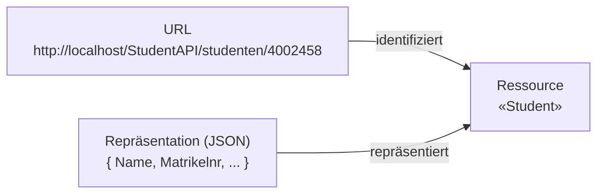
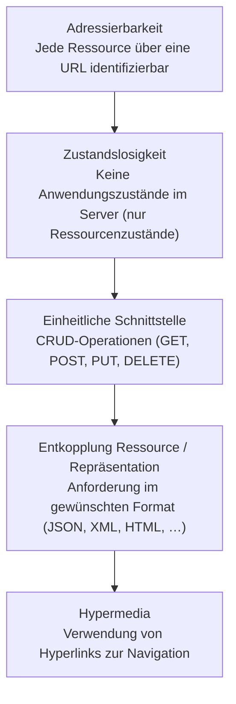
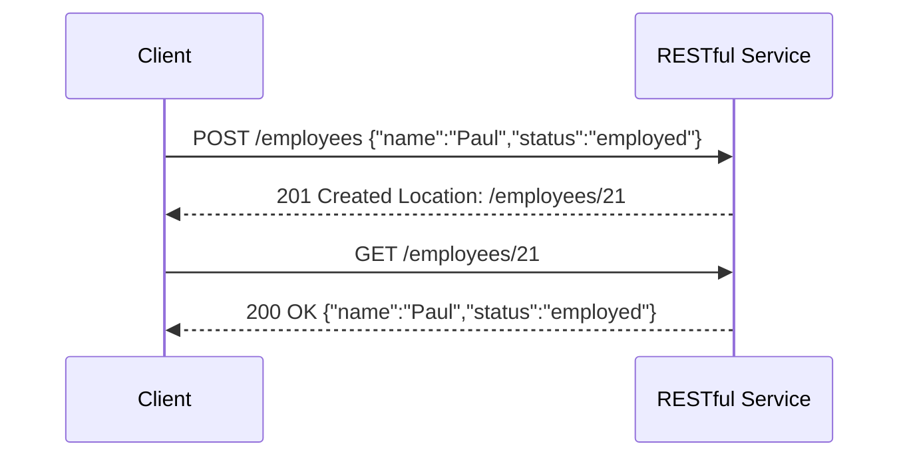
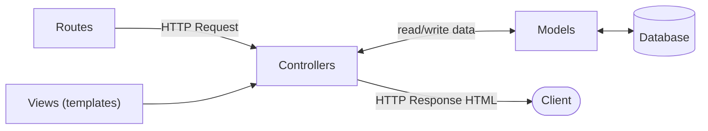

# 13 — RESTful Services

**Folien:** [[web-engineering/resources/13-JavaScript-Rest.pdf|13-JavaScript-Rest.pdf]]
**Lernziele:** [[web-engineering/lernziele/webeng-lernziele-08|Lernziele Vorlesung 8]]

> [!info] Hinweis
> Woche 8 umfasst zwei Foliensätze: [[web-engineering/lectures/08/webeng-12-javascript-fetch|12 — JavaScript Fetch (AJAX, DOM, Fetch)]] und **RESTful Services** — diese Notiz. Die Lernziele 6–15 (REST) werden hier behandelt, die Lernziele 1–5 (DOM, AJAX, Fetch) in der Fetch-Notiz.

## Inhaltsverzeichnis

- [[#Was ist REST?|Was ist REST?]]
- [[#Konzept: URL, Repräsentation, Ressource|Konzept: URL, Repräsentation, Ressource]]
- [[#Eigenschaften einer REST-Architektur|Eigenschaften einer REST-Architektur]]
- [[#Zustandslosigkeit|Zustandslosigkeit]]
- [[#Idempotente Operationen|Idempotente Operationen]]
- [[#Hypermedia|Hypermedia]]
- [[#CRUD und die HTTP-Verben|CRUD und die HTTP-Verben]]
- [[#Die Interaktion|Die Interaktion]]
- [[#Ressourcen und URL-Gestaltung|Ressourcen und URL-Gestaltung]]
- [[#Query-Parameter: Filtering, Sorting, Searching, Fields|Query-Parameter: Filtering, Sorting, Searching, Fields]]
- [[#Content Negotiation mit Fetch (Client)|Content Negotiation mit Fetch (Client)]]
- [[#Server-Seite mit Express|Server-Seite mit Express]]
- [[#Validierung der Eingaben|Validierung der Eingaben]]
- [[#Strukturierung: Routes, Controller, Model|Strukturierung: Routes, Controller, Model]]
- [[#Bezug zu Lernzielen|Bezug zu Lernzielen]]

---

## Was ist REST?

> [!quote] Definition (REST)
> **RE**presentational **S**tate **T**ransfer ist ein »Paradigma« zur Architektur verteilter Systeme, das den Prinzipien webbasierter Systeme folgt — eine **Abstraktion des Verhaltens des World Wide Web**.

> [!warning] Achtung
> REST ist **ausschließlich eine Architektur**. Web Services (SOAP-basiert) sind dagegen **beides**: Standard *und* Architektur.

Die Architektur beschreibt die Interaktion von Anwendungen gemäß dem webbasierten Interaktionsmodell:

- Verwendung von **HTTP** als Transportprotokoll
- **Feststehende Operationen**
- Interaktion mit **»Ressourcen«** als Dreh- und Angelpunkt

> [!tip] Merke
> REST ist eine **ressourcenorientierte Architektur (ROA — Resource-Oriented Architecture)**.

---

## Konzept: URL, Repräsentation, Ressource

Drei zentrale Begriffe greifen ineinander:



- Ressourcen (HTML-Seiten, Bilder, Objekte) werden über **URLs** angefordert oder verändert.
- Übertragung der Objekte in **verschiedenen Repräsentationen** möglich, z.B. `GET StudentAPI/studenten/4002458` als JSON-Objekt (andere Rückgabeformate möglich).
- Mit dem **Anlegen/Ändern** einer Ressource beim Server können dortige **Prozesse angestoßen** werden.

---

## Eigenschaften einer REST-Architektur



Ergänzend:

- **HTTP** als zentrales Protokoll zur Interaktion.
- Ressourcen sind **eindeutig adressierbar** (URL/URI). Eine *Naming Authority* weist URIs zu, oder der Entwickler entscheidet über das Routing.
- Jede Ressource hat **eine oder mehrere Repräsentationen** (XML, Text, JSON, PNG, MP3 …) — flexible Objekt-Serialisierung; Repräsentation ist aushandelbar (**Content Negotiation**).
- Ressourcen besitzen ggf. **Verweise** auf andere Ressourcen (analog zu Objekt-Referenzen).

---

## Zustandslosigkeit

> [!quote] Definition
> Mit dem Ausliefern einer Repräsentation geht die **Verantwortung über die Ressource an die Benutzer über**. Der Server behandelt **jeden Aufruf als in sich abgeschlossenen Auftrag ohne impliziten Bezug auf vorhergehende Operationen**.

- Der Server hält die Ressource zwar weiter vor und kann sie über die Zeit verändern; jeder Berechtigte kann eine Operation darauf durchführen und einen neuen Zustand erzeugen.
- **Keine direkte Unterstützung von Transaktionen** über Aufrufgrenzen hinweg.
- Die Anwendung kann allerdings Attribute schaffen und **Hypermedia** verwenden, um Operationen zu vernetzen.

---

## Idempotente Operationen

> [!quote] Definition (Idempotenz)
> Eine Operation ist **idempotent**, wenn $\text{Op}(x) = \text{Op}(\text{Op}(x))$ — mehrfache Ausführung ändert das Ergebnis nicht. Beispiel: `i = 42` ist idempotent, `i++` nicht.

- REST verfolgt die Idee, dass jede Operation **independent** und **self-contained** ist — das passt gut zu idempotenten Operationen.
- Das **Anlegen** einer neuen Ressource (Create) ist **normalerweise nicht idempotent** (jeder Create erzeugt eine neue Ressource). Mit einem **Unique Identifier** im Create kann eine Ressource differenzierbar werden.
- Das **Update (PUT)** sollte **alle** Attribute einer Ressource liefern. Ein **PATCH** (Diff-Notation, JSON-Patch) ist **nicht immer idempotent**.

> [!tip] Merke
> Zustandslosigkeit und idempotente Operationen passen gut zusammen (**At-least-once-Semantik**). Ggf. lassen sich über Versionierung und Unique Identifier effizientere Szenarien abbilden.

---

## Hypermedia

- Letztlich wollen wir nicht nur mit einzelnen Ressourcen arbeiten, sondern **vernetzte Ressourcen und Prozesse** abbilden.
- Hypermedia liefert die **Verlinkung von Ressourcen** und dient so als Stütze für die Implementierung von Interaktionsprozessen/**Workflows**.

> [!example] Beispiel
> Ein **Warenkorb** kann die Verlinkung auf eine »Bestellungen«-Ressource haben, die bei Create als Argument den zu bestellenden Warenkorb als JSON-Objekt erhält und so einen Bestellvorgang initiiert.

---

## CRUD und die HTTP-Verben

Die Interaktion lässt sich auf die HTTP-Verben abbilden (CRUD-Operationen):

| Action | Verb |
|---|---|
| **C**reate | `POST` |
| **R**ead (Retrieve) | `GET` |
| **U**pdate | `PUT` oder `PATCH` |
| **D**elete (Destroy) | `DELETE` |

> [!warning] Achtung
> Etwas überraschend wird **POST für Create** genutzt und **PUT für Update**. Eigentlich hätte man dies umgekehrt vermutet — Grund ist die **Idempotenz** (PUT ist idempotent, POST nicht).

**URL-Schema:**

```
Create   POST   /resourceNames
Read     GET    /resourceNames            (Liste)
         GET    /resourceNames/resourceId (einzeln)
Update   PUT    /resourceNames/resourceId
         PATCH  /resourceNames/resourceId
Delete   DELETE /resourceNames/resourceId
```

---

## Die Interaktion



Der Request besteht aus **HTTP-Header** und **HTTP-Body**. Beim Create antwortet der Server mit **201 Created** und einem **Location-Header**, der auf die URL der neuen Ressource zeigt.

---

## Ressourcen und URL-Gestaltung

> [!tip] Merke — Nomenorientierung
> REST orientiert sich an **Nomen**. Die URL sollte **nomenorientiert** und im **Plural** gebildet werden:
> `http://api.example.com/user-management/users/` bzw. `.../users/{id}`

Auf Basis von HTTP gibt es zwei Möglichkeiten, Anfragen zu parametrisieren (serverseitig zu berücksichtigen):

- **Query-Parameter** als Argument der URL: `?Key1=Value1&Key2=Value2` — für komplexe Abfragen.
- **Path-Parameter** fixieren dynamisch Ressourcen in der URL: `users/{id}`. Create sollte die id **nicht** mitliefern, sondern die Erzeugung dem Server überlassen. Ressourcen können verschachtelt sein: `.../managed-devices/{device-id}/parameter/{parm-id}`.

> [!example] Beispiel — verschachtelte Ressourcen
> ```
> GET    /tickets/12/messages     – Liste der Nachrichten für Ticket #12
> GET    /tickets/12/messages/5   – Nachricht #5 für Ticket #12
> POST   /tickets/12/messages     – neue Nachricht in Ticket #12
> PUT    /tickets/12/messages/5   – Nachricht #5 aktualisieren
> PATCH  /tickets/12/messages/5   – Nachricht #5 teilweise aktualisieren
> DELETE /tickets/12/messages/5   – Nachricht #5 löschen
> ```

Die genaue **Struktur** der Ressourcen wird in REST **nicht festgelegt** (eher wie Skriptsprachen ohne feste Typisierung). Ressourcen sind oft **denormalisiert** — man bekommt alles Wichtige mit einer einzelnen GET-Operation (Vermeidung externer Objektreferenzen, folgt der JSON-Idee von Embedded Documents). **Testwerkzeuge** für REST-APIs: OpenAPI, Swagger, Insomnia.

---

## Query-Parameter: Filtering, Sorting, Searching, Fields

> [!success] Best Practice (vinaysahni.com)
> - **Filtering:** ein eindeutiger Query-Parameter pro Feld — `GET /tickets?state=open`
> - **Sorting:** generischer `sort`-Parameter mit kommagetrennter Feldliste, unäres Minus = absteigend — `GET /tickets?sort=-priority,created_at`
> - **Searching:** Volltextsuche über einen `q`-Parameter (z.B. an eine ElasticSearch/Lucene-Engine durchgereicht) — `GET /tickets?q=return&state=open&sort=-priority,created_at`
> - **Fields:** `fields`-Parameter begrenzt die zurückgegebenen Felder und spart Netzwerk-Traffic — `GET /tickets?fields=id,subject,customer_name&state=open`

---

## Content Negotiation mit Fetch (Client)

> [!quote] Definition (Content Negotiation)
> Der Client fordert eine Ressource in einer **speziellen Repräsentation** an, indem er die gewünschten Formate über den HTTP-Header **`Accept`** angibt. Der Server gibt die tatsächlich gelieferte Repräsentation über **`Content-Type`** an.

- In Node.js: Prüfung/Angabe über `request.headers.get` bzw. `response.headers.get`.
- Unterstützt der Server die angefragte Repräsentation nicht → Fehler **HTTP 415 ("Unsupported Media Type")**.

```js
async function getObj(url, parameter) {
  let response = await fetch(url, parameter);
  const contentType = response.headers.get('content-type');
  if (response.status === 401) throw new Error('Request was not authorized.');
  if (contentType === null) return new Promise(() => null);
  else if (contentType.startsWith('application/json;')) return await response.json();
  else if (contentType.startsWith('text/plain;')) return await response.text();
  else throw new Error(`Unsupported contenttype: ${contentType}`);
}
getObj('https://abc.org/', { headers: { 'Accept': 'text/plain' } })
  .then(console.log).catch(console.error);
```

> [!warning] Achtung — body stream already read
> Sobald wir mittels `response.json()` auf das Objekt zugegriffen haben, ist es **zu spät** für eine Content Negotiation (`TypeError: body stream already read`). Ein **Fallback-Trick** ist das **Klonen** des Response-Objekts:
> ```js
> fetch(url)
>   .then(res => res.clone().json().catch(() => res.text()))
>   .then(data => { /* data ist jetzt geparstes JSON oder Rohtext */ });
> ```

---

## Server-Seite mit Express

**Content Negotiation mit `res.format()`** — arbeitet abhängig vom `Accept`-Header des Requests:

```js
app.get('/', (req, res) => res.format({
  'text/plain':       () => res.send('hey'),
  'text/html':        () => res.send('<p>hey</p>'),
  'application/json': () => res.send({ message: 'hey' }),
  'default':          () => res.status(415).send('Unsupported')
}));
// Verkürzte Notation: text / html / json statt voller MIME-Namen möglich
```

**Body-Parser / Express-Parser-Middleware:** Früher das Modul `body-parser`; seit **Express 4.16** ist die Funktionalität **in Express enthalten** und muss nicht mehr separat eingebunden werden:

| Content-Type | Alt (`body-parser`) | Neu (Express ≥ 4.16) |
|---|---|---|
| `application/json` | `app.use(bodyParser.json())` | `app.use(express.json())` |
| `text/plain` | `app.use(bodyParser.text())` | `app.use(express.text())` |
| `application/x-www-form-urlencoded` | `app.use(bodyParser.urlencoded({ extended: true }))` | `app.use(express.urlencoded())` |

```js
app.use(express.json());      // verarbeitet JSON für alle Routen (POST, PUT, PATCH)
app.use(express.urlencoded()); // klassische Formulardaten
app.post('/action', (req, res) => {
  let name = req.body.name;
  let color = req.body.color;
});
```

> [!warning] Achtung — Never trust the user!
> `req.body` basiert auf benutzergesteuerter Eingabe — **alle** Properties und Werte sind **untrusted** und müssen vor der Nutzung validiert werden. `bodyParser.json` übernimmt nur den Content-Type JSON; das Middleware-Konzept erlaubt das Hinzufügen **mehrerer Parser** für weitere Content-Types. Hinweis: `response.json` verarbeitet das Response-Objekt **endgültig** — spätere Middlewares können es nicht erneut verarbeiten.

> [!example] Beispiel — Server mit JSON-Verarbeitung
> ```js
> let todos = [{ id: 1, title: 'kaufe Milch' }, { id: 2, title: 'mache Übungsaufgaben' }];
> app.use(express.json());
> app.get('/todos', (req, res) => res.status(200).json(todos));
> app.post('/todos', (req, res) => {
>   let newTodo = { id: todos.length + 1, title: req.body.title };
>   todos.push(newTodo);
>   res.setHeader('Location', '/todos/' + newTodo.id);
>   res.status(201).json();
> });
> ```

**Path- und Query-Parameter** auf dem Server:

```js
app.put('/cars/:id', (req, res) => {
  let id = parseInt(req.params.id); // Never Trust the User: id muss kein Int sein
  if (cars[id]) { cars[id] = req.body; res.status(200).send(); }
  else res.status(404, 'Car not found').send();
});
app.get('/cars/:carId/passengers/:passengerId', (req, res) => {
  // req.params.carId, req.params.passengerId
});
app.get('/', (req, res) => { let id = req.query.id; res.status(200).json(cars[id]); });
```

---

## Validierung der Eingaben

> [!warning] Achtung
> Die Struktur eines empfangenen JSON-Objekts lässt sich **nicht mit `instanceof`** prüfen — JSON kennt keine Prototyp-Verbindungen. **JSON ist immer vom Typ `Object`.** Daher müssen alle Felder einzeln getestet werden.

Zwei Ansätze (Lernziel: kennen, nicht detailliert anwenden):

- **`express-validation`** (mit *Joi*-Schemata): definiert z.B. `email: Joi.string().email().required()` und fängt `ValidationError` in einem Error-Handler ab.
- **`express-json-validator-middleware`** mit einem **JSON-Schema**:
  ```js
  var StreetSchema = {
    type: 'object',
    required: ['number', 'name', 'type'],
    properties: {
      number: { type: 'number' },
      name:   { type: 'string' },
      type:   { type: 'string', enum: ['Street', 'Avenue', 'Boulevard'] }
    }
  };
  app.post('/street/', validate({ body: StreetSchema }), (req, res) => res.send('valid'));
  ```

---

## Strukturierung: Routes, Controller, Model

Ein sauberer Express-Server folgt dem **MVC-Muster** (Routes → Controller → Model/Views):



- **Routes** (`taskRoutes.mjs`): `router.route('/').get(controller.readAllTasks).post(controller.createTask)…`, mit Validierung via `express-validator` (`check('id').isNumeric()`).
- **Controller** (`taskController.js`): `export function createTask(req, res) { … res.status(201).json(tasks.read(id)); }` — enthält die Logik, setzt Status-Codes und `Location`-Header.
- **Model** (`taskList.js`): Klasse mit privaten Feldern (`#data = new Map()`, `#counter`), Methoden `readAll()`, `read(id)`, `create(title)`.
- **App** (`taskApp.js`): bindet Middleware und Router ein, `app.listen(port, …)`.

**Client-Seite** greift z.B. per Fetch auf den REST-Service zu:

```js
fetch('https://localhost:3001/tasks', {
  headers: { 'Content-Type': 'application/json; charset=utf-8' },
  method: 'POST',
  body: 'Abendessen kochen'
}).then(/* 201 & neue Task */).catch(/* error handling */);
```

> [!tip] Merke — Frage beim Client
> - **Wer liefert beim Create die ID?** IDs sollten nur beim **PUT** vom Client mitgegeben werden (Update → ID schon bekannt). Beim **POST** sollte keine ID mitgegeben bzw. sie vom Server ignoriert werden.
> - Der **Location-Header** der 201-Response liefert die URL mit der neuen ID zurück.
> - **Updates & Creation sollten eine Repräsentation zurückgeben:** Ein PUT/POST/PATCH kann Felder ändern, die nicht Teil der Parameter waren (z.B. `created_at`, `updated_at`). Damit der Client nicht erneut anfragen muss, gibt die API die aktualisierte/erstellte Repräsentation in der Response zurück.

---

## Bezug zu Lernzielen

Die kompakten Karteikarten finden sich unter [[web-engineering/lernziele/webeng-lernziele-08|Lernziele Vorlesung 8]]. Diese Notiz deckt die Lernziele **6–15** ab (REST); die Lernziele 1–5 (DOM, AJAX, Fetch) in [[web-engineering/lectures/08/webeng-12-javascript-fetch|12 — JavaScript Fetch]].

**Was sollten Sie über die REST-Architektur wissen?**

REST (REpresentational State Transfer) ist eine **ressourcenorientierte Architektur (ROA)**, die das Verhalten des WWW abstrahiert: HTTP als Transport, feststehende Operationen, Ressourcen im Mittelpunkt. Kerneigenschaften: **Adressierbarkeit** (URL pro Ressource), **Zustandslosigkeit**, **einheitliche Schnittstelle** (CRUD), **Entkopplung** von Ressource und Repräsentation und **Hypermedia**. Im Gegensatz zu SOAP-Web-Services ist REST *nur* Architektur, kein Standard.

**Was sollten Sie über CRUD-Operationen in REST wissen?**

CRUD wird auf HTTP-Verben abgebildet: **Create→POST**, **Read→GET**, **Update→PUT/PATCH**, **Delete→DELETE**. Überraschend: POST (nicht idempotent) für Create, PUT (idempotent) für Update — genau wegen der Idempotenz. URL-Schema: `/resourceNames` (Liste/Create) und `/resourceNames/{id}` (einzeln/Update/Delete).

**Was sollten Sie über idempotente Operationen wissen?**

Idempotent: $\text{Op}(x)=\text{Op}(\text{Op}(x))$ — mehrfaches Ausführen ändert nichts (`i=42` ja, `i++` nein). PUT und DELETE sind idempotent, POST nicht (jeder Create erzeugt eine Ressource). PATCH ist **nicht immer** idempotent. Idempotenz + Zustandslosigkeit ergeben eine robuste At-least-once-Semantik.

**Was sollten Sie über Ressourcenorientierung und URLs wissen?**

Ressourcen sind alles, was man benennen kann; jede ist eindeutig über URL/URI adressierbar. URLs werden **nomenorientiert** und im **Plural** gebildet (`/users/{id}`). Aggregate und verschachtelte Ressourcen: `/tickets/12/messages/5`. Create liefert die id nicht mit — der Server vergibt sie.

**Was sollten Sie über das Erzeugen neuer Ressourcen wissen?**

Create per **POST** auf die Collection, **ohne** Client-ID (Server vergibt sie). Antwort: **201 Created** mit **Location-Header**, der auf die URL der neuen Ressource zeigt, und idealerweise die erstellte Repräsentation im Body (spart einen zweiten Request).

**Was sollten Sie über Content-Negotiation wissen?**

Der Client gibt akzeptierte Formate über den **`Accept`**-Header an, der Server antwortet mit **`Content-Type`**; nicht unterstützt → **415**. Clientseitig per `response.headers.get('content-type')` auswerten (Vorsicht: nach `response.json()` ist der Body-Stream verbraucht → `clone()`-Trick). Serverseitig mit Express via **`res.format({...})`**.

**Was sollten Sie über Body-Parser und Express-Parser-Middleware wissen?**

Body-Parsing wandelt den Request-Body in `req.body`. Seit Express 4.16 integriert: `express.json()`, `express.text()`, `express.urlencoded()` (früher `bodyParser.*`). Mehrere Parser für verschiedene Content-Types kombinierbar. `req.body` ist stets **untrusted** → validieren.

**Was sollten Sie über PATH- und Query-Parameter wissen?**

**Path-Parameter** (`/cars/:id` → `req.params.id`) fixieren eine Ressource in der URL; **Query-Parameter** (`?id=…` → `req.query.id`) parametrisieren Abfragen (Filtering, Sorting via `sort=-priority`, Searching via `q`, Fields-Begrenzung). Für GET mit Query-Parametern braucht man keinen Body-Parser.

**Was sollten Sie über express-Validation wissen?**

Da JSON immer `Object` ist (kein `instanceof`-Test), werden Felder einzeln validiert — komfortabel über **`express-validation`** (Joi-Schemata) oder **`express-json-validator-middleware`** (JSON-Schema mit `type`, `required`, `properties`, `enum`). Lernziel: kennen, nicht detailliert anwenden.

**Was sollten Sie über Models, Controller und Routen in separaten Modulen wissen?**

Sauberer Aufbau nach **MVC**: **Routes** leiten Requests an **Controller** weiter (`router.route('/').get(...).post(...)`), Controller enthalten die Logik und greifen auf das **Model** zu (z.B. `taskList`-Klasse mit `#data`-Map und `create/read/readAll`), **Views** liefern Templates. Jedes in einem eigenen Modul (`taskRoutes`, `taskController`, `taskList`, `taskApp`).